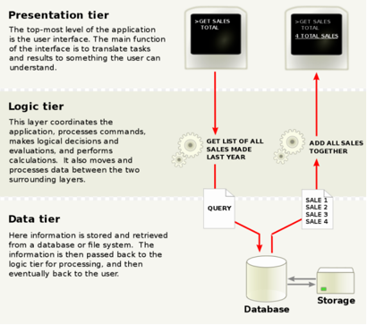
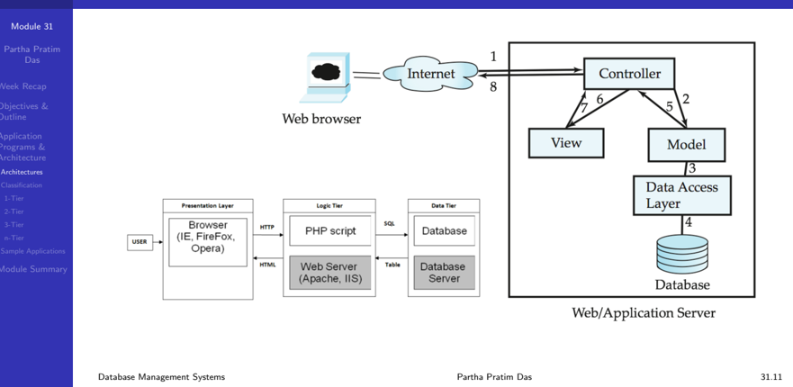
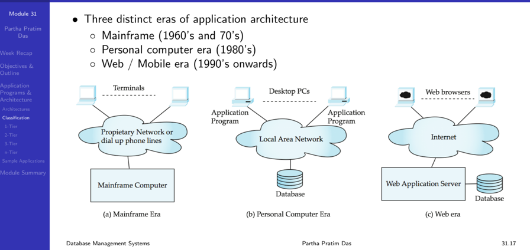
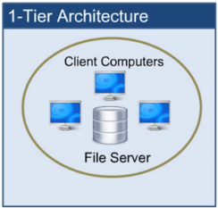
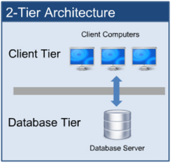
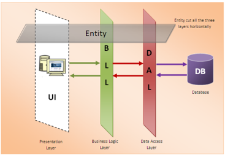
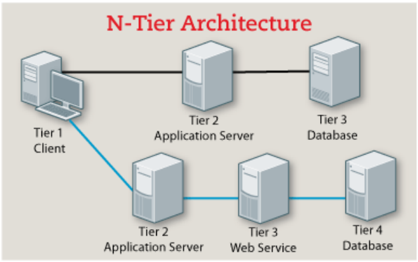

## Module 31

Partha Pratim Das

Week Recap

Objectives &amp;

Outline

Application

Programs &amp;

Architecture

Architectures

Classification

1-Tier

2-Tier

3-Tier n-Tier

Sample Applications

Module Summary

## Database Management Systems Module 31: Application Design and Development/1: Architecture

## Partha Pratim Das

Department of Computer Science and Engineering Indian Institute of Technology, Kharagpur ppd@cse.iitkgp.ac.in

Partha Pratim Das

Module 31

Partha Pratim

Das

Week Recap

Objectives &amp;

Outline

Application

Programs &amp;

Architecture

Architectures

Classification

1-Tier

2-Tier

3-Tier n-Tier

Sample Applications

Module Summary

## https://www.overleaf.com/project/60ab55772e24e3d695070fc1

## Module 31

Partha Pratim Das

Week Recap

Objectives &amp; Outline

Application

Programs &amp;

Architecture

Architectures

Classification

1-Tier

2-Tier

3-Tier n-Tier

Sample Applications

Module Summary

## Week Recap

- Studied the Normal Forms and their Importance in Relational Design - how progressive increase of constraints can minimize redundancy in a schema
- Learnt how to decompose a schema into 3NF while preserving dependency and lossless join
- Learnt how to decompose a schema into BCNF with lossless join
- Using the specification for a Library Information System, we have illustrated how a schema can be designed and then refined for finalization
- Coding of various queries based on these schema are left as exercises
- Understood multi-valued dependencies to handle attributes that can have multiple values
- Learnt Fourth Normal Form and decomposition to 4NF
- Discussed aspects of the database design process
- Studied the issues with temporal data

## Partha Pratim Das

## Module 31

Partha Pratim Das

Week Recap

Objectives &amp; Outline

Application

Programs &amp;

Architecture

Architectures

Classification

1-Tier

2-Tier

3-Tier n-Tier

Sample Applications

Module Summary

## Module Objectives

- What are the Application Programs across various sectors?
- Commonality of architecture across applications
- Understanding the classification and evolution of the architectures
- A look at the architecture for a few sample applications

## Module 31

Partha Pratim Das

Week Recap

Objectives &amp; Outline

Application

Programs &amp;

Architecture

Architectures

Classification

1-Tier

2-Tier

3-Tier n-Tier

Sample Applications

Module Summary

## Module Outline

- Application Programs
- Application Architecture with classification and evolution
- Sample application architectures

## Module 31

Partha Pratim

Das

Week Recap

Objectives &amp;

Outline

Application

Programs &amp;

Architecture

Architectures

Classification

1-Tier

2-Tier

3-Tier n-Tier

Sample Applications

Module Summary

## Application Programs and User Interfaces

## Application Programs and Architecture

## Module 31

## Partha Pratim Das

Week Recap

Objectives &amp; Outline

## Application Programs &amp; Architecture

Architectures

Classification

1-Tier

2-Tier

3-Tier n-Tier

Sample Applications

Module Summary

## Application Programs: Internet / Web or Mobile

## · Financial :

- Netbanking: SBI, PNB, BoB, Canara, HDFC, ICICI
- Insurance &amp; Investment: LICI, PolicyBazaar, NSDL, NPS,

## · Software Engineering :

- Share Market: ICICIDirect, Sharekhan, HDFCDirect
- Payment Gateway: Paytm, GPay, Bhim UPI, PhonePe,
- e-Commerce: Amazon, Flipkart, eBay, BigBazaar, BigBasket,

## · Travel &amp; Tourism :

- Travel Reservations: IRCTC, Airlines, MakeMyTrip, Yatra,
- Transportation: Uber, Ola Cab, Mega Cab, Meru Cab,
- Accommodation: Booking, OYO, AirBnb, Fabhotels, Treebo,
- Navigation: Google Maps, MapQuest, Apple Maps,
- Food &amp; Delivery: Zomato, Swiggy, UberEats, Dunzo,

## · Communication :

- Live Interaction: Zoom, Google Meet, Teams, Webex, Skype,
- Mail: Gmail, Yahoo, Hotmail, Rediffmail, Enterprise Mail,
- Intermittent Interaction: WhatsApp, Telegram, Signal, Skype
- Social Media: Facebook, Instagram, Twitter, YouTube,

## · Knowledge Discovery :

- Static: Google, Yahoo, Bing, Wikipedia, Encyclopedia.com,
- Q&amp;A: Quora, ASKfm, Yahoo Answers, Reddit, Digg,

## · Sports :

- Cricket: Cricbuzz, CricViz, Cricket-21, Cricket Exchange,
- Tennis: ATP, ITF, SwingVision, TennisPAL, Tennis Clash, Database Management Systems
- Issue Tracking: JIRA, BugZilla, Githubs, Gitlab,
- Online IDE: OnlineGDB, Codechef, Ideone,
- VCS: Githubs, Gitlab, BitBucket, SourceForge,

## · Library :

- Digital Library: National Digital Library of India,
- Archives: Internet Archive, arXiv, Nextpoint,

## · Education :

- eLearning: BYJU's, IGNOU, NIIT, Edukart,
- MOOCs: SWAYAM, edX, Coursera, Udemy,

## · Document Processing :

- Editing: Overleaf, Google Docs, Spreadsheet
- Website, Blog: Google Sites, WordPress, Webly,

## · Health :

- Telemedicine: MDLIVE, Doctor on Demand,
- National: Aarogy Setu, CoWin, NACO App,

## · Organizational ERP : (Intranet)

- Institutions: Students, Faculty, Course
- Manufacturing: Suppliers, Inventory, Customers,
- Hospital: Patient, Doctor, OPD, IPD, Pharmacy,
- Bank: Customers, Accounts, Locker, Deposits,
- Courier: Customers, Parcels, Delivery Agents, Partha Pratim Das 31.7

Module 31

Partha Pratim Das

Week Recap

Objectives &amp; Outline

Application Programs &amp; Architecture

Architectures

Classification

1-Tier

2-Tier

3-Tier n-Tier

Sample Applications

Module Summary

## Characteristic of Application Programs

- Diversity : These applications widely differ in their
- Domain , functionality , user base , response time , scale , daily hit and many more
- Unity : Yet, these have a lot in common
- Most use an RDBMS like Oracle, DB2 MySQL, PostgreSQL, etc. for managing data
- Applications are functionally split into frontend layer , middle layer , backend layer
- glyph[triangleright] Frontend or Presentation Layer / Tier
- -Interacts with the user: Display / View, Input / Output
- -Choose item, Add to cart, Checkout, Pay, Track order
- -Interfaces may be, Browser-based , Mobile App , or Custom
- glyph[triangleright] Middle or Application / Business Logic Layer / Tier
- -Implements the Functionality of the Application: Links front and backend
- -Authentication, Search / Browse logic, Pricing, Cart management, Payment handling (gateway), Order management (mail / SMS / internal actions), Delivery management
- -Support functionality based on frontend interface

## glyph[triangleright] Backend or Data Access Layer / Tier

- -Manages persistent data, large volume, efficient access, security
- -User, Cart, Inventory, Order, Vendor databases

Database Management Systems

Partha Pratim Das

Module 31

Partha Pratim

Das

Week Recap

Objectives &amp;

Outline

Application

Programs &amp;

Architecture

Architectures

Classification

1-Tier

2-Tier

3-Tier n-Tier

Sample Applications

Module Summary

## Characteristic of Application Programs (2): Architecture

Source : https: // en. wikipedia. org/ wiki/ Multitier\_ architecture

Database Management Systems

## Partha Pratim Das

## Module 31

Partha Pratim Das

Week Recap

Objectives &amp; Outline

Application Programs &amp; Architecture

Architectures

Classification

1-Tier

2-Tier

3-Tier n-Tier

Sample Applications

Module Summary

## Application Architectures: Layers

## · Presentation Layer / Tier

- Model-View-Controller (MVC) architecture

- glyph[triangleright] model :

business logic

- glyph[triangleright] view : presentation of data, depends on display device

- glyph[triangleright] controller : receives events, executes actions, and returns a view to the user

## · Business Logic Layer / Tier

- provides high level view of data and actions on data
- glyph[triangleright] often using an object data model
- hides details of data storage schema

## · Data Access Layer / Tier

- interfaces between business logic layer and the underlying database
- provides mapping from object model of business layer to relational model of database
- Already discussed and studied in depth

Partha Pratim Das

## Application Architecture (2): MVC

## Module 31

Partha Pratim Das

Week Recap

Objectives &amp; Outline

Application Programs &amp; Architecture

Architectures

Classification

1-Tier

2-Tier

3-Tier n-Tier

Sample Applications

Module Summary

## Application Architecture (3): User Interface

- Web browsers have become the de-facto standard user interface to databases
- Enable large numbers of users to access databases from anywhere
- Avoid the need for downloading / installing specialized code, while providing a good graphical user interface
- glyph[triangleright] Javascript, Flash and other scripting languages run in browser, but are downloaded transparently
- Examples: banks, airline and rental car reservations, university course registration and grading, and so on.
- Use in Mobile Devices are getting popular
- Mobile Apps or Browser in Mobile
- These are similar in architecture and workflow with web, but have significant differences with their smaller (but wide range of) form factor, and extremely low resources
- Will be discussed later

## Module 31

Partha Pratim Das

Week Recap

Objectives &amp; Outline

Application Programs &amp; Architecture

Architectures

Classification

1-Tier

2-Tier

3-Tier n-Tier

Sample Applications

Module Summary

## Application Architecture (4): Business Logic Layer

- Provides abstractions of entities
- For example, students, instructors, courses, etc
- Enforces business rules for carrying out actions
- For example, student can enroll in a class only if she has completed prerequisites, and has paid her tuition fees
- Supports workflows which define how a task involving multiple participants is to be carried out
- For example, how to process application by a student applying to a university
- Sequence of steps to carry out task
- Error handling
- glyph[triangleright] For example, what to do if recommendation letters not received on time

## Module 31

Partha Pratim Das

Week Recap

Objectives &amp; Outline

Application Programs &amp; Architecture

Architectures

Classification

1-Tier

2-Tier

3-Tier n-Tier

Sample Applications

Module Summary

## Application Architecture (5): Object-Relational Mapping

- Allows application code to be written on top of object-oriented data model, while storing data in a traditional relational database
- alternative: implement object-oriented or object-relational database to store object model
- glyph[triangleright] has not been commercially successful
- Schema designer has to provide a mapping between object data and relational schema
- For example, Java class Student mapped to relation student , with corresponding mapping of attributes
- An object can map to multiple tuples in multiple relations
- Application opens a session, which connects to the database
- Objects can be created and saved to the database using session.save(object)
- mapping used to create appropriate tuples in the database
- Query can be run to retrieve objects satisfying specified predicates

## Module 31

Partha Pratim Das

Week Recap

Objectives &amp; Outline

Application Programs &amp; Architecture

Architectures

Classification

1-Tier

2-Tier

3-Tier n-Tier

Sample Applications

Module Summary

## Application Architecture (6): Data Access Layer

- Issues of modeling and design of databases have already discussed in depth through the previous module
- Issues of accessing and updating data from application will be discussed later this with through the interactions of native languages and SQL

## Module 31

Partha Pratim Das

Week Recap

Objectives &amp; Outline

Application

Programs &amp;

Architecture

Architectures

Classification

1-Tier

2-Tier

3-Tier n-Tier

Sample Applications

Module Summary

## Architecture Classification

- Database architecture uses programming languages to design a particular type of software for businesses or organizations.
- Database architecture focuses on the design, development, implementation and maintenance of computer programs that store and organize information for businesses, agencies and institutions.
- A database architect develops and implements software to meet the needs of users.
- The design of a DBMS depends on its architecture. It can be
- centralized
- decentralized
- hierarchical
- The architecture of a DBMS can be seen as either single tier or multi-tier:
- 1-tier architecture
- 2-tier architecture
- 3-tier architecture
- n-tier architecture

Database Management Systems

## Architecture Evolution

Module 31

Partha Pratim

Das

Week Recap

Objectives &amp;

Outline

Application

Programs &amp;

Architecture

Architectures

Classification

1-Tier

2-Tier

3-Tier n-Tier

Sample Applications

Module Summary

## 1-tier Architecture

- One-tier architecture involves putting all of the required components for a software application or technology on a single server or platform
- Basically, a one-tier architecture keeps all of the elements of an application, including the interface, Middleware and back-end data, in one place
- Developers see these types of systems as the simplest and most direct way

Source :

Concepts of Database Architecture

Database Management Systems

## Module 31

Partha Pratim

Das

Week Recap

Objectives &amp;

Outline

Application

Programs &amp;

Architecture

Architectures

Classification

1-Tier

2-Tier

3-Tier n-Tier

Sample Applications

Module Summary

## 2-tier Architecture

- The two-tier is based on Client Server architecture
- It is like client server application
- The direct communication takes place between client and server
- There is no intermediate between client and server

Source :

Concepts of Database Architecture

Database Management Systems

## Module 31

Partha Pratim Das

Week Recap

Objectives &amp; Outline

Application

Programs &amp;

Architecture

Architectures

Classification

1-Tier

2-Tier

3-Tier n-Tier

Sample Applications

Module Summary

## 3-tier Architecture

- A 3-tier architecture separates its tiers Presentation , Logic and Data Access - from each other based on the complexity of the users and how they use the data present in the database
- It is the most widely used architecture to design a DBMS

Source

:

Concepts of Database Architecture

Database Management Systems

## Partha Pratim Das

## Module 31

Partha Pratim

Das

Week Recap

Objectives &amp;

Outline

Application

Programs &amp;

Architecture

Architectures

Classification

1-Tier

2-Tier

3-Tier n-Tier

Sample Applications

Module Summary

## n-tier Architecture

- An n-tier architecture distributes different components of the 3 tiers between different servers and adds interfaces tiers for interactions and workload balancing

Source :

Concepts of Database Architecture

Module 31

Partha Pratim

Das

Week Recap

Objectives &amp;

Outline

Application

Programs &amp;

Architecture

Architectures

Classification

1-Tier

2-Tier

3-Tier n-Tier

Sample Applications

Module Summary

## Sample Applications in Multiple Tiers

| Application   | Presentation                                                                                                       | Logic                                                                                                                    | Data                                                             | Functionality                                                    |
|---------------|--------------------------------------------------------------------------------------------------------------------|--------------------------------------------------------------------------------------------------------------------------|------------------------------------------------------------------|------------------------------------------------------------------|
| Web Mail      | Login Mail List View Inbox Sent Items Outbox Trash Mail Composer Filters                                           | User Authentication Connection to Mail Server (SMTP, POP, IMAP) Encryption Decryption                                    | Mail Users Address Book Mail Items                               | Send Receive Mails Manage Address Book                           |
| Net Banking   | Login Account View Add Delete Account Add Delete Beneficiary Fund Transfer                                         | User Authentication Beneficiary Authentication Transaction Validation Connection to Banks Gateways Encryption Decryption | Account Holders Beneficiaries Accounts Debit Credit Transactions | Check Balance and Transactions Transfer Funds                    |
| Timetable     | Login Add Delete Courses_ Teachers, Rooms, Slots Assignments: Teachers Course Allocations Course Room, Slots Views | User Authentication Timetable Assignment Logic Encryption Decryption                                                     | Courses Teachers Rooms Slots Assignments Allocations             | Manage timetable for multiple courses taken by multiple teachers |

## Partha Pratim Das

## Module 31

Partha Pratim Das

Week Recap

Objectives &amp; Outline

Application

Programs &amp;

Architecture

Architectures

Classification

1-Tier

2-Tier

3-Tier n-Tier

Sample Applications

Module Summary

## Module Summary

- Had a glimpse of Application Programs across various sectors
- Understood the typical architecture for an application
- Studies the classification and evolution of the architectures
- Glimpsed at architecture for a few sample applications

Slides used in this presentation are borrowed from http://db-book.com/ with kind permission of the authors. Edited and new slides are marked with 'PPD'.

Partha Pratim Das