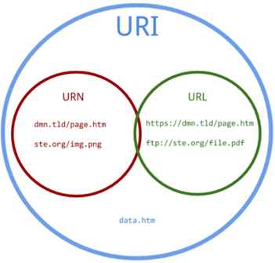
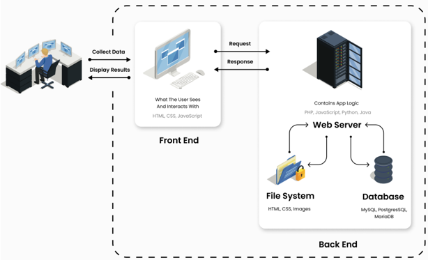
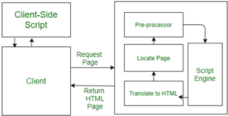

## Module 32

Partha Pratim Das

Objectives &amp; Outline

WWW

URL

HTML &amp; HTTP

Sessions &amp; Cookies

Web Browser &amp;

Server

Scripting

Client Side

Javscript

Server Side

Servlets

JSP

PHP

Module Summary

## Database Management Systems

Module 32: Application Design and Development/2: Web Applications

## Partha Pratim Das

Department of Computer Science and Engineering Indian Institute of Technology, Kharagpur ppd@cse.iitkgp.ac.in

Partha Pratim Das

## Module 32

Partha Pratim Das

Objectives &amp; Outline

WWW

URL

HTML &amp; HTTP

Sessions &amp; Cookies

Web Browser &amp;

Server

Scripting

Client Side

Javscript

Server Side

Servlets

JSP

PHP

Module Summary

## Module Recap

- Had a glimpse of Application Programs across various sectors
- Understood the typical architecture for an application
- Studies the classification and evolution of the architectures
- Glimpsed at architecture for a few sample applications

## Module 32

Partha Pratim Das

Objectives &amp; Outline

WWW

URL

HTML &amp; HTTP

Sessions &amp; Cookies

Web Browser &amp;

Server

Scripting

Client Side

Javscript

Server Side

Servlets

JSP

PHP

Module Summary

## Module Objectives

- To familiarize with the fundamentals notions and technologies of Web
- To learn about scripting
- To learn about Servlets

## Module 32

Partha Pratim Das

Objectives &amp; Outline

WWW

URL

HTML &amp; HTTP

Sessions &amp; Cookies

Web Browser &amp;

Server

Scripting

Client Side

Javscript

Server Side

Servlets

JSP

PHP

Module Summary

## Module Outline

- Web Fundamentals and Scripting
- Servlets

## Module 32

Partha Pratim Das

Objectives &amp;

Outline

WWW

URL

HTML &amp; HTTP

Sessions &amp; Cookies

Web Browser &amp;

Server

Scripting

Client Side

Javscript

Server Side

Servlets

JSP

PHP

Module Summary

## Web Fundamentals

## Web Fundamentals

## Module 32

Partha Pratim Das

Objectives &amp; Outline

WWW

URL

HTML &amp; HTTP

Sessions &amp; Cookies

Web Browser &amp;

Server

Scripting

Client Side

Javscript

Server Side

Servlets

JSP

PHP

Module Summary

## The World Wide Web

- The Web is a distributed information system based on hypertext
- Most Web documents are hypertext documents formatted via the HyperText Markup Language (HTML)
- HTML documents contain
- text along with font specifications, and other formatting instructions
- hypertext links to other documents, which can be associated with regions of the text
- forms, enabling users to enter data which can then be sent back to the Web server

Module 32

Partha Pratim Das

Objectives &amp; Outline

WWW

URL

HTML &amp; HTTP

Sessions &amp; Cookies

Web Browser &amp;

Server

Scripting

Client Side

Javscript

Server Side

Servlets

JSP

PHP

Module Summary

## Uniform Resources Locators

- On the Web, functionality of pointers is provided by Uniform Resource Locators (URLs).
- URL example: http://www.acm.org/sigmod
- The first part indicates how the document is to be accessed (protocol)
- glyph[triangleright] 'http' indicates that the document is to be accessed using the Hyper Text Transfer Protocol.
- The second part gives the unique name of a machine on the Internet
- The rest of the URL identifies the document within the machine
- The local identification can be:
- The path name of a file on the machine: A file at
- C:/WINDOWS/media/Alarm01.wav of local machine can be accessed as:
- glyph[triangleright] file:///C:/WINDOWS/media/Alarm01.wav
- glyph[triangleright] file://localhost/c:/WINDOWS/media/Alarm01.wav
- An identifier (path name) of a program, plus arguments to be passed to the program: Searching google.com with 'silberschatz' has the uri:
- glyph[triangleright] http://www.google.com/search?q=silberschatz

## Module 32

Partha Pratim Das

Objectives &amp;

Outline

WWW

URL

HTML &amp; HTTP

Sessions &amp; Cookies

Web Browser &amp;

Server

Scripting

Client Side

Javscript

Server Side

Servlets

JSP

PHP

Module Summary

## URI, URL, and URN

- Uniform Resource Identifier (URI)
- Uniform Resource Locator (URL)
- Uniform Resource Name (URN)
- Relationships:
- URIs can be classified as locators (URLs), or as names (URNs), or as both.
- URN functions like a person's name
- URL resembles that person's street address.
- URN defines an item's identity, while the URL provides a method for finding it

## Partha Pratim Das

## Module 32

Partha Pratim Das

Objectives &amp; Outline

WWW

URL

HTML &amp; HTTP

Sessions &amp; Cookies

Web Browser &amp;

Server

Scripting

Client Side

Javscript

Server Side

Servlets

JSP

PHP

Module Summary

## HTML and HTTP

- HTML provides formatting, hypertext link, and image display features
- including tables, stylesheets (to alter default formatting), etc.
- HTML also provides input features
- Select from a set of options
- glyph[triangleright] Pop-up menus, radio buttons, check lists
- Enter values
- glyph[triangleright] Text boxes
- Filled in input sent back to the server, to be acted upon by an executable at the server
- HyperText Transfer Protocol (HTTP) used for communication with the Web server

## Module 32

Partha Pratim

Das

Objectives &amp;

Outline

WWW

URL

HTML &amp; HTTP

Sessions &amp; Cookies

Web Browser &amp;

Server

Scripting

Client Side

Javscript

Server Side

Servlets

JSP

PHP

Module Summary

## Sample HTML

## &lt; html &gt;

&lt;

body

&gt;

## &lt; table border &gt;

&lt; tr &gt; &lt; th &gt; ID &lt; /th &gt;&lt; th &gt; Name &lt; /th &gt; &lt; th &gt; Department &lt; /th &gt;&lt; /tr &gt; &lt; tr &gt; &lt; td &gt; 00128 &lt; /td &gt; &lt; td &gt; Zhang &lt; /td &gt; &lt; td &gt; Comp. Sci. &lt; /td &gt; &lt; /tr &gt; · · ·

&lt;

/table

&gt;

&lt;

form action='PersonQuery' method=get &gt;

Search for:

&lt;

select name='persontype'

&gt;

&lt;

option value='student' selected

&lt;

option value='instructor'

&gt;

Student

&gt;

Instructor

&lt;

/select

&lt;

/option

&lt;

/option

&gt;

&gt;

&gt; &lt;

br

&gt;

Name:

&lt;

input type=text size=20 name='name'

&lt;

input type=submit value='submit'

&lt;

/form

&lt;

&gt;

&gt;

&gt;

/body

&lt;

&gt;

/html

&gt;

## Module 32

Partha Pratim Das

Objectives &amp; Outline

WWW

URL

HTML &amp; HTTP

Sessions &amp; Cookies

Web Browser &amp;

Server

Scripting

Client Side

Javscript

Server Side

Servlets

JSP

PHP

Module Summary

## HTTP and Sessions

## · The HTTP protocol is connectionless

- That is, once the server replies to a request, the server closes the connection with the client, and forgets all about the request
- In contrast, Unix logins, and JDBC/ODBC connections stay connected until the client disconnects
- glyph[triangleright] retaining user authentication and other information
- Motivation: reduces load on server
- glyph[triangleright] operating systems have tight limits on number of open connections on a machine
- Information services need session information
- For example, user authentication should be done only once per session
- Solution: use a cookie

## Module 32

Partha Pratim Das

Objectives &amp;

Outline

WWW

URL

HTML &amp; HTTP

Sessions &amp; Cookies

Web Browser &amp;

Server

Scripting

Client Side

Javscript

Server Side

Servlets

JSP

PHP

Module Summary

## Sessions and Cookies

- A cookie is a small piece of text containing identifying information
- Sent by server to browser
- glyph[triangleright] Sent on first interaction, to identify session
- Sent by browser to the server that created the cookie on further interactions glyph[triangleright] part of the HTTP protocol
- Server saves information about cookies it issued, and can use it when serving a request
- glyph[triangleright] For example, authentication information, and user preferences
- Cookies can be stored permanently or for a limited time

Module 32

Partha Pratim Das

Objectives &amp; Outline

WWW

URL

HTML &amp; HTTP

Sessions &amp; Cookies

Web Browser &amp; Server

Scripting

Client Side

Javscript

Server Side

Servlets

JSP

PHP

Module Summary

## Web Browser

- A web browser is application software for accessing the World Wide Web
- A web browser is to fetch content from the Web and display it on a user's device
- This process begins when the user inputs a URL into the browser starting with either http: or https:
- Once a web page has been retrieved, the rendering engine displays it on the user's device
- A browser or rendering engine is a core software component for a web browser
- The primary job of a browser engine is to transform HTML documents and other resources of a web page into an interactive visual representation on a user's device
- This includes image and video formats supported by the browser
- Web pages usually contain hyperlinks to other pages and resources. Each link contains a URL, and when it is clicked or tapped, the browser navigates to the new resource
- Web browsers are used on a range of devices, including desktops, laptops, tablets, and smartphones. In 2020, an estimated 4.9 billion people used a browser. The most used browser is Google Chrome, with a 64% global market share on all devices, followed by Safari with 19%

Module 32

Partha Pratim Das

Objectives &amp; Outline

WWW

URL

HTML &amp; HTTP

Sessions &amp; Cookies

Web Browser &amp; Server

Scripting

Client Side

Javscript

Server Side

Servlets

JSP

PHP

Module Summary

## Web Servers

- A web server is software and underlying hardware that accepts requests via HTTP or its secure variant HTTPS
- A web browser or crawler, requests for a specific resource using HTTP, and the server responds with the content of that resource or an error message
- The server can also accept and store resources sent from the user agent
- The document name in a URL may identify an executable program, that, when run, generates a HTML document
- When an HTTP server receives a request for such a document, it executes the program, and sends back the HTML document that is generated
- The Web client can pass extra arguments with the name of the document
- To install a new service on the Web, one simply needs to create and install an executable that provides that service
- The Web browser provides a graphical user interface to the information service
- Common Gateway Interface (CGI): a standard interface between web and application server

Database Management Systems

## Module 32

Partha Pratim Das

Objectives &amp; Outline

WWW

URL

HTML &amp; HTTP

Sessions &amp; Cookies

Web Browser &amp; Server

Scripting

Client Side

Javscript

Server Side

Servlets

JSP

PHP

Module Summary

## Web Services

- Allow data on Web to be accessed using remote procedure call mechanism
- Two approaches are widely used
- Representation State Transfer (REST): allows use of standard HTTP request to a URL to execute a request and return data
- glyph[triangleright] returned data is encoded either in XML, or in JavaScript Object Notation (JSON)
- Big Web Services:
- glyph[triangleright] uses XML representation for sending request data, as well as for returning results glyph[triangleright] standard protocol layer built on top of HTTP

Module 32

Partha Pratim

Das

Objectives &amp;

Outline

WWW

URL

HTML &amp; HTTP

Sessions &amp; Cookies

Web Browser &amp;

Server

Scripting

Client Side

Javscript

Server Side

Servlets

JSP

PHP

Module Summary

## Web Architecture

Source

:

Web Application Architecture: A Comprehensive Guide On The What, Why And How

Database Management Systems

Partha Pratim Das

## Module 32

Partha Pratim Das

Objectives &amp;

Outline

WWW

URL

HTML &amp; HTTP

Sessions &amp; Cookies

Web Browser &amp;

Server

Scripting

Client Side

Javscript

Server Side

Servlets

JSP

PHP

Module Summary

## Scripting for Web Applications

## Scripting for Web Applications

## Module 32

Partha Pratim Das

Objectives &amp; Outline

WWW

URL

HTML &amp; HTTP Sessions &amp; Cookies Web Browser &amp; Server

Scripting

Client Side

Javscript

Server Side

Servlets

JSP

PHP

Module Summary

## Scripting for Web Applications

- A script is a list of (text) commands that are embedded in a web-page or in the server
- They are interpreted and executed by a certain program or scripting engine
- Scripts may be written for a variety of purposes such as for automating processes on a local-computer or to generate web pages.
- The programming languages in which scripts are written are called scripting language
- Common scripting languages are VBScript, JavaScript, ASP, PHP, PERL, JSP etc.

## Module 32

Partha Pratim

Das

Objectives &amp;

Outline

WWW

URL

HTML &amp; HTTP

Sessions &amp; Cookies

Web Browser &amp;

Server

Scripting

Client Side

Javscript

Server Side

Servlets

JSP

PHP

Module Summary

## Scripting for Web Applications (2)

## Scripting of two types

- Client Side : Client-side scripting is responsible for interaction within a web page. The client-side scripts are firstly downloaded at the client-end and then interpreted and executed by the browser
- Server Side : Server-side scripting is responsible for the completion or carrying out a task at the server-end and then sending the result to the client-end.

Source

:

Web Scripting and its Types

Database Management Systems

Partha Pratim Das

## Module 32

Partha Pratim Das

Objectives &amp; Outline

WWW

URL

HTML &amp; HTTP

Sessions &amp; Cookies

Web Browser &amp; Server

Scripting

Client Side

Javscript

Server Side

Servlets

JSP

PHP

Module Summary

## Client Side Scripting

- Browsers can fetch certain scripts (client-side scripts) or programs along with documents, and execute them in 'safe mode' at the client site
- Javascript
- Macromedia Flash and Shockwave for animation/games
- VRML
- Applets
- Client-side scripts/programs allow documents to be active
- For example, animation by executing programs at the local site
- For example, ensure that values entered by users satisfy some correctness checks
- Permit flexible interaction with the user.
- glyph[triangleright] Executing programs at the client site speeds up interaction by avoiding many round trips to server

## Module 32

Partha Pratim Das

Objectives &amp; Outline

WWW

URL

HTML &amp; HTTP

Sessions &amp; Cookies

Web Browser &amp;

Server

Scripting

Client Side

Javscript

Server Side

Servlets

JSP

PHP

Module Summary

## Client Side Scripting (2): Security

- Security mechanisms needed to ensure that malicious scripts do not cause damage to the client machine
- Easy for limited capability scripting languages, harder for general purpose programming languages like Java
- For example, Java's security system ensures that the Java applet code does not make any system calls directly
- Disallows dangerous actions such as file writes
- Notifies the user about potentially dangerous actions, and allows the option to abort the program or to continue execution.

## Module 32

Partha Pratim Das

Objectives &amp; Outline

WWW

URL

HTML &amp; HTTP

Sessions &amp; Cookies

Web Browser &amp;

Server

Scripting

Client Side

Javscript

Server Side

Servlets

JSP

PHP

Module Summary

## Javascript

- Javascript very widely used
- forms basis of new generation of Web applications (called Web 2.0 applications) offering rich user interfaces
- Javascript functions can
- check input for validity
- modify the displayed Web page, by altering the underlying document object model (DOM) tree representation of the displayed HTML text
- communicate with a Web server to fetch data and modify the current page using fetched data, without needing to reload/refresh the page
- glyph[triangleright] forms basis of AJAX technology used widely in Web 2.0 applications
- glyph[triangleright] For example, on selecting a country in a drop-down menu, the list of states in that country is automatically populated in a linked drop-down menu

## Module 32

Partha Pratim Das

Objectives &amp; Outline

WWW

URL

HTML &amp; HTTP

Sessions &amp; Cookies

Web Browser &amp; Server

Scripting

Client Side

Javscript

Server Side

Servlets

JSP

PHP

Module Summary

## Javascript (2): Example

- Example of Javascript used to validate form input

&lt;html&gt; &lt;head&gt;

&lt;script type="text/javascript"&gt;

function validate() {

var credits=document.getElementById("credits").value;

if (isNaN(credits)|| credits&lt;=0 || credits&gt;=16) {

alert("Credits must be a number greater than 0 and less than 16"); return false;

}

}

&lt;/script&gt;

&lt;/head&gt; &lt;body&gt;

&lt;form action="createCourse" onsubmit="return validate()"&gt; Title: &lt;input type="text" id="title" size="20"&gt;&lt;br /&gt; Credits: &lt;input type="text" id="credits" size="2"&gt;&lt;br /&gt; &lt;Input type="submit" value="Submit"&gt;

&lt;/form&gt;

&lt;/body&gt; &lt;/html&gt;

Database Management Systems

Partha Pratim Das

32.23

## Module 32

Partha Pratim Das

Objectives &amp; Outline

WWW

URL

HTML &amp; HTTP

Sessions &amp; Cookies

Web Browser &amp; Server

Scripting

Client Side

Javscript

Server Side

Servlets

JSP

PHP

Module Summary

## Server-Side Scripting

- Server-side scripting simplifies the task of connecting a database to the Web
- Define an HTML document with embedded executable code/SQL queries.
- Input values from HTML forms can be used directly in the embedded code/SQL queries.
- When the document is requested, the Web server executes the embedded code/SQL queries to generate the actual HTML document.
- Numerous server-side scripting languages
- JSP, PHP
- General purpose scripting languages: VBScript, Perl, Python

## Module 32

Partha Pratim Das

Objectives &amp; Outline

WWW

URL

HTML &amp; HTTP

Sessions &amp; Cookies

Web Browser &amp;

Server

Scripting

Client Side

Javscript

Server Side

Servlets

JSP

PHP

Module Summary

## Servlets

- Java Servlet specification defines an API for communication between the Web / application server and application program running in the server
- For example, methods to get parameter values from Web forms, and to send HTML text back to client
- Application program (also called a servlet) is loaded into the server
- Each request spawns a new thread in the server
- glyph[triangleright] thread is closed once the request is serviced

Module 32

Partha Pratim Das

Objectives &amp;

Outline

WWW

URL

HTML &amp; HTTP

Sessions &amp; Cookies

Web Browser &amp;

Server

Scripting

Client Side

Javscript

Server Side

Servlets

JSP

PHP

Module Summary

## Servlet (2): Example

import java.io.*;

import javax.servlet.*;

import javax.servlet.http.*;

public class PersonQueryServlet extends HttpServlet {

public void doGet (HttpServletRequest request, HttpServletResponse response) throws ServletException, IOException

{

response.setContentType('text/html');

PrintWriter out = response.getWriter();

out.println('

&lt;

HEAD

&gt;&lt;

TITLE

&gt;

Query Result out.println('

&lt;

BODY

&gt;

');

· · ·

BODY OF SERVLET (next slide)

out.println('

· · ·

&lt;

/BODY

&gt;

');

out.close();

}

}

&lt;

/TITLE

&gt;&lt;

&gt;

/HEAD

');

## Module 32

Partha Pratim Das

Objectives &amp; Outline

WWW

URL

HTML &amp; HTTP

Sessions &amp; Cookies

Web Browser &amp;

Server

Scripting

Client Side

Javscript

Server Side

Servlets

JSP

PHP

Module Summary

## Servlet (3): Example

String persontype = request.getParameter('persontype');

String number = request.getParameter('name'); if (persontype.equals('student')) {

- · · code to find students with the specified name · · ·
- · · using JDBC to communicate with the database · · ·

out.println('

&lt;

table BORDER COLS=3

&gt;

');

out.println('

&lt;

tr

&gt; &lt;

td

&gt;

ID

&lt;

/td

&gt;&lt;

td

&gt;

Name:

&lt; /td &gt; ' + ' &lt; td &gt; Department &lt; /td &gt; &lt; /tr &gt; ');

for(

· · ·

each result

· · ·

)

{

- · · retrieve ID, name and dept name
- · · into variables ID, name and deptname
- · · out.println(' &lt; tr &gt; &lt; td &gt; ' + ID + ' &lt; /td &gt; ' + ' &lt; td &gt; ' + name + ' &lt; /td &gt; ' + ' &lt; td &gt; ' + deptname + ' &lt; /td &gt;&lt; /tr &gt; ');

}

;

out.println(' &lt; /table &gt; ');

}

else

{

· · · as above, but for instructors · · ·

}

## Module 32

Partha Pratim Das

Objectives &amp; Outline

WWW

URL

HTML &amp; HTTP

Sessions &amp; Cookies

Web Browser &amp; Server

Scripting

Client Side

Javscript

Server Side

Servlets

JSP

PHP

Module Summary

## Servlet (4): Sessions

- Servlet API supports handling of sessions
- Sets a cookie on first interaction with browser, and uses it to identify session on further interactions
- To check if session is already active:
- if (request.getSession(false) == true)
- glyph[triangleright] .. then existing session
- glyph[triangleright] else .. redirect to authentication page
- authentication page
- glyph[triangleright] check login/password
- glyph[triangleright] request.getSession(true): creates new session
- Store/retrieve attribute value pairs for a particular session
- session.setAttribute('userid', userid)
- session.getAttribute('userid')

## Module 32

Partha Pratim Das

Objectives &amp; Outline

WWW

URL

HTML &amp; HTTP

Sessions &amp; Cookies

Web Browser &amp;

Server

Scripting

Client Side

Javscript

Server Side

Servlets

JSP

PHP

Module Summary

## Servlet (5): Support

- Servlets run inside application servers such as
- Apache Tomcat, Glassfish, JBoss
- BEA Weblogic, IBM WebSphere and Oracle Application Servers
- Application servers support
- deployment and monitoring of servlets
- Java 2 Enterprise Edition (J2EE) platform supporting objects, parallel processing across multiple application servers, etc

## Module 32

Partha Pratim Das

Objectives &amp; Outline

WWW

URL

HTML &amp; HTTP

Sessions &amp; Cookies

Web Browser &amp; Server

Scripting

Client Side

Javscript

Server Side

Servlets

JSP

PHP

Module Summary

## Java Server Pages (JSP)

- A JSP page with embedded Java code &lt; html &gt;
- &lt; head &gt; &lt; title &gt; Hello &lt; /title &gt; &lt; /head &gt; &lt; body &gt;

&lt; % if (request.getParameter('name') == null) { out.println('Hello World'); } else { out.println('Hello, ' + request.getParameter('name')); } % &gt;

- &lt; /body &gt;
- &lt; /html &gt;
- JSP is compiled into Java + Servlets
- JSP allows new tags to be defined, in tag libraries
- such tags are like library functions, can are used for example to build rich user interfaces such as paginated display of large datasets

## Module 32

Partha Pratim Das

Objectives &amp; Outline

WWW

URL

HTML &amp; HTTP

Sessions &amp; Cookies

Web Browser &amp;

Server

Scripting

Client Side

Javscript

Server Side

Servlets

JSP

PHP

Module Summary

## PHP

- PHP is widely used for Web server scripting
- Extensive libraries including for database access using ODBC
- &lt; html &gt;
- &lt; head &gt; &lt; title &gt; Hello &lt; /title &gt; &lt; /head &gt;
- &lt; body &gt;
- &lt; ? php if (!isset( $ REQUEST['name'])) { echo 'Hello World'; } else { echo 'Hello, ' + $ REQUEST['name']; } ? &gt;
- &lt; /body &gt;
- &lt; /html &gt;

## Module 32

Partha Pratim Das

Objectives &amp; Outline

WWW

URL

HTML &amp; HTTP

Sessions &amp; Cookies

Web Browser &amp;

Server

Scripting

Client Side

Javscript

Server Side

Servlets

JSP

PHP

Module Summary

## USP of JSP

## · JSP vs . Active Server Pages ( ASP )

- ASP is a similar technology from Microsoft and is proprietary (uses VB).
- JSP is platform independent and portable.

## · JSP vs . Pure Servlets

- JSP is a servlet but it is more convenient to write and to modify regular HTML than to have a million println statements that generate the HTML.
- The Web page design experts can build the HTML, leaving places for the servlet programmers to insert the dynamic content.
- JSP vs . JavaScript JavaScript can generate HTML dynamically on the client.
- 'Client Side': Java Script code is executed by the browser after the web server sends the HTTP response. With the exception of cookies, HTTP and form submission data is not available to JavaScript.
- 'Server Side': Java Server Pages are executed by the web server before the web server sends the HTTP response. It can access server-side resources like databases, catalogs.
- JSP vs . Static HTML Regular HTML cannot contain dynamic information. Database Management Systems Partha Pratim Das

## Module 32

Partha Pratim Das

Objectives &amp; Outline

WWW

URL

HTML &amp; HTTP

Sessions &amp; Cookies

Web Browser &amp; Server

Scripting

Client Side

Javscript

Server Side

Servlets

JSP

PHP

Module Summary

## Module Summary

- Familiarized with the Fundamentals notions and technologies of Web
- Learnt about Scripting
- Learnt the notions of Servlets

Slides used in this presentation are borrowed from http://db-book.com/ with kind permission of the authors.

Edited and new slides are marked with 'PPD'.