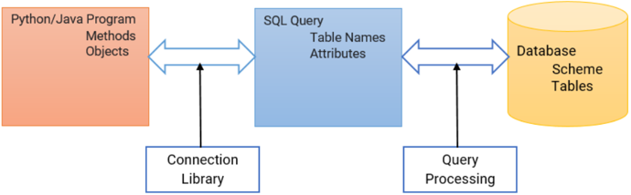
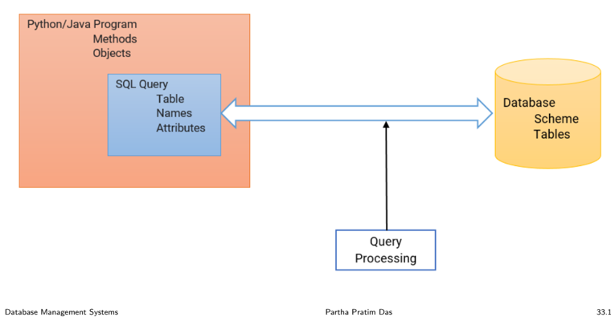
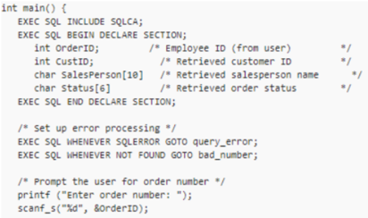

## Module 33

Partha Pratim Das

Objectives &amp; Outline

SQL and Native Language

ODBC

Example: Python

JDBC

Example: Java

Bridge

Embedded SQL

Example: C

Example: Java

Module Summary

## Database Management Systems

Module 33: Application Design and Development/3: SQL and Native Language

## Partha Pratim Das

Department of Computer Science and Engineering Indian Institute of Technology, Kharagpur ppd@cse.iitkgp.ac.in

Partha Pratim Das

33.1

## Module 33

Partha Pratim Das

Objectives &amp; Outline

SQL and Native Language

ODBC

Example: Python

JDBC

Example: Java

Bridge

Embedded SQL

Example: C

Example: Java

Module Summary

## Module Recap

- Familiarized with the Fundamentals notions and technologies of Web
- Learnt about Scripting
- Learnt the notions of Servlets

Module 33

Partha Pratim Das

Objectives &amp; Outline

SQL and Native Language

ODBC

Example: Python

JDBC

Example: Java

Bridge

Embedded SQL

Example: C

Example: Java

Module Summary

## Module Objectives

- To understand how to use SQL from a programming language

Module 33

Partha Pratim Das

Objectives &amp; Outline

SQL and Native Language

ODBC

Example: Python

JDBC

Example: Java

Bridge

Embedded SQL

Example: C

Example: Java

Module Summary

## Module Outline

- Accessing SQL From a Programming Language

## Module 33

Partha Pratim Das

Objectives &amp; Outline

SQL and Native Language

ODBC

Example: Python

JDBC

Example: Java

Bridge

Embedded SQL

Example: C

Example: Java

Module Summary

## Working with SQL and Native Language

Module 33

Partha Pratim Das

Objectives &amp; Outline

SQL and Native Language

ODBC

Example: Python

JDBC

Example: Java

Bridge

Embedded SQL

Example: C

Example: Java

Module Summary

## Working with SQL and Native Language

- Applications use Application Programming / Program Interface (API) to interact with a database server
- Applications make calls to
- Connect with the database server
- Send SQL commands to the database server
- Fetch tuples of result one-by-one into program variables
- Frameworks
- Connectionist
- glyph[triangleright] Open Database Connectivity (ODBC) works with C, C++, C#, Visual Basic, and Python. Other data APIs include
- -OLEDB
- -ADO.NET
- glyph[triangleright] Java Database Connectivity (JDBC) works with Java
- Embedding
- glyph[triangleright] Embedded SQL works with C, C++, Java, COBOL, FORTRAN and Pascal

Database Management Systems

Partha Pratim Das

33.6

Module 33

Partha Pratim

Das

Objectives &amp;

Outline

SQL and Native

Language

ODBC

Example: Python

JDBC

Example: Java

Bridge

Embedded SQL

Example: C

Example: Java

Module Summary

## Native Language ⇐⇒ Query Language: Connectionist

Module 33

Partha Pratim Das

Objectives &amp; Outline

SQL and Native Language

ODBC

Example: Python

JDBC

Example: Java

Bridge

Embedded SQL

Example: C

Example: Java

Module Summary

## ODBC

- Open Database Connectivity (ODBC) is a standard API for accessing DBMS
- It aimed to be independent of database systems and operating systems
- An application written using ODBC can be ported to other platforms, both on the client and server side, with few changes to the data access code
- ODBC is
- A standard for application program to communicate with a database server
- An application program interface (API) to
- glyph[triangleright] Open a connection with a database
- glyph[triangleright] Send queries and updates
- glyph[triangleright] Get back results
- Applications such as GUI, Spreadsheets, etc. can use ODBC
- ODBC was originally developed by Microsoft and Simba Technologies during the early 1990s, and became the basis for the Call Level Interface (CLI) standardized by SQL Access Group in the Unix and mainframe field.

Partha Pratim Das

Module 33

Partha Pratim Das

Objectives &amp; Outline

SQL and Native Language

ODBC

Example: Python

JDBC

Example: Java

Bridge

Embedded SQL

Example: C

Example: Java

Module Summary

## ODBC (2): Python Example

- The code uses a data source named 'SQLS' from the odbc.ini file to connect and issue a query.
- It creates a table, inserts data using literal and parameterized statements and fetches the data

## import pyodbc

conn pyodbc .connect ( ' DSN=SQLS CurSOrconn cursor( ) CUISOI execute("create Lable (coll int, col2 float, co13 varchar(10) ) ") cursor execute("insert into rvtest values (1, 10.0 , cursor from rvtesc")

while True: row=curSOr ferchone ( ) if nor row: break print (row)

from Ivest" ) cursor inco rvcest values (? , 2 , 2) " 2 , 20 .0 , CUISOI from vtest while Irue: fetchone ( ) if not row: break print (row)

Source :

https: // dzone. com/ articles/ tutorial-connecting-to-odbc-data-sources-with-pyth

Database Management Systems

## Partha Pratim Das

Module 33

Partha Pratim Das

Objectives &amp; Outline

SQL and Native Language

ODBC

Example: Python

JDBC

Example: Java

Bridge

Embedded SQL

Example: C

Example: Java

Module Summary

## JDBC

- Java Database Connectivity (JDBC) is an API for the programming language Java, which defines how a client may access a database
- It is a Java-based data access technology used for Java database connectivity
- JDBC supports a variety of features for querying and updating data, and for retrieving query results; metadata retrieval, such as querying about relations present in the database and the names and types of relation attributes
- Model for communicating with the database:
- Open a connection
- Create a 'statement' object
- Execute queries using the Statement object to send queries and fetch results
- Exception mechanism to handle errors
- JDBC, originally released by Sun Microsystems released as part of Java Development Kit (JDK) 1.1 on in 1997, is part of the Java Standard Edition platform, from Oracle Corporation

## Module 33

Partha Pratim Das

Objectives &amp; Outline

SQL and Native Language

ODBC

Example: Python

JDBC

Example: Java

Bridge

Embedded SQL Example: C Example: Java

Module Summary

## JDBC: Example (1)

- We show a simple example here to connect to SQL Server from Java using JDBC to execute database commands
- In the example, the sample code makes a connection to the sample database
- Then, using an SQL statement with the SQLServerStatement object, it runs the SQL statement and places the data that it returns into a SQLServerResultSet object
- Next, the sample code calls the custom displayRow method to iterate through the rows of data that are in the result set, and uses the getString method to display some of the data
- Complete example can be found at: Retrieving result set data sample

Module 33

Partha Pratim Das

Objectives &amp; Outline

SQL and Native Language

ODBC

Example: Python

JDBC

Example: Java

Bridge

Embedded SQL

Example: C

Example: Java

Module Summary

## JDBC: Example (2)

import java.sql.Connection; import java.sql.DriverManager; import java.sql.ResultSet; import java.sql.SQLException; import java.sql.Statement;

public class RetrieveResultSet {

public static void main(String[] args) {

String connectionUrl = "jdbc:sqlserver://&lt;server&gt;:&lt;port&gt;;databaseName=AdventureWorks;";

// Create a variable for the connection string. connectionUrl += "user=&lt;user&gt;; password=&lt;password&gt;";

try (Connection con = DriverManager.getConnection(connectionUrl); Statement stmt = con.createStatement();) {

createTable(stmt);

String SQL = "SELECT * FROM Production.Product;"; ResultSet rs = stmt.executeQuery(SQL); displayRow("PRODUCTS", rs);

}

// Handle any errors that may have occurred. catch (SQLException e) { e.printStackTrace();

}

}

Database Management Systems

Partha Pratim Das

33.12

Module 33

Partha Pratim Das

Objectives &amp; Outline

SQL and Native Language

ODBC

Example: Python

JDBC

Example: Java

Bridge

Embedded SQL

Example: C

Example: Java

Module Summary

## JDBC: Example (3)

private static void displayRow(String title, ResultSet rs) throws SQLException { System.out.println(title);

while (rs.next()) {

// Iterate on Table("ProductID", "Name")

System.out.println(rs.getString("ProductID") + " : " + rs.getString("Name"));

}

}

private static void createTable(Statement stmt) throws SQLException { stmt.execute("if exists (select * from sys.objects where name = 'Product\_JDBC\_Sample')" + "drop table Product\_JDBC\_Sample");

String sql = "CREATE TABLE [Product\_JDBC\_Sample]("

// Table Name

+ "[ProductID] [int] IDENTITY(1,1) NOT NULL," // Attribute 1

+ "[Name] [varchar](30) NOT NULL,)";

// Attribute 2

stmt.execute(sql);

sql = "INSERT Product\_JDBC\_Sample VALUES ('Adjustable Time','AR-5381')"; stmt.execute(sql);

// Add Product 1

sql = "INSERT Product\_JDBC\_Sample VALUES ('ML Bottom Bracket','BB-8107')"; // Add Product 2 stmt.execute(sql);

sql = "INSERT Product\_JDBC\_Sample VALUES ('Mountain-500 Black','BK-M18B-44')"; // Add Product 3 stmt.execute(sql);

}

}

Database Management Systems

Partha Pratim Das

33.13

Module 33

Partha Pratim Das

Objectives &amp; Outline

SQL and Native Language

ODBC

Example: Python

JDBC

Example: Java

Bridge

Embedded SQL

Example: C

Example: Java

Module Summary

## Connectionist Bridge Configurations

A bridge is a special kind of driver that uses another driver-based technology

- This driver translates source function-calls into target function-calls
- Programmers usually use such a bridge when they lack a source driver for some database but have access to a target driver
- Common bridges are:
- ODBC-to-JDBC (ODBC-JDBC) bridges : An ODBC-JDBC bridge consists of an ODBC driver which uses the services of a JDBC driver to connect to a database. Examples : OpenLink ODBC-JDBC Bridge, SequeLink ODBC-JDBC Bridge
- JDBC-to-ODBC (JDBC-ODBC) bridges : A JDBC-ODBC bridge consists of a JDBC driver which employs an ODBC driver to connect to a target database. Examples : OpenLink JDBC-ODBC Bridge, SequeLink JDBC-ODBC Bridge
- OLE DB-to-ODBC bridges : An OLE DB-ODBC bridge consists of an OLE DB Provider which uses the services of an ODBC driver to connect to a target database. This provider translates OLE DB method calls into ODBC function calls. Examples : OpenLink OLEDB-ODBC Bridge, SequeLink OLEDB-ODBC Bridge
- ADO.NET-to-ODBC bridges : An ADO.NET-ODBC bridge consists of an ADO.NET Provider which uses the services of an ODBC driver to connect to a target database. Examples : OpenLink ADO.NET-ODBC Bridge, SequeLink ADO.NET-ODBC Bridge

Partha Pratim Das

Module 33

Partha Pratim

Das

Objectives &amp;

Outline

SQL and Native

Language

ODBC

Example: Python

JDBC

Example: Java

Bridge

Embedded SQL

Example: C

Example: Java

Module Summary

## Native Language ⇐⇒ Query Language: Embedded SQL

## Module 33

Partha Pratim Das

Objectives &amp; Outline

SQL and Native Language

ODBC

Example: Python

JDBC

Example: Java

Bridge

Embedded SQL

Example: C

Example: Java

Module Summary

## Embedded SQL

- The SQL standard defines embedding of SQL in a variety of programming languages such as C, C++, Java, FORTRAN, and PL/1
- A language to which SQL queries are embedded is referred to as a host language , and the SQL structures permitted in the host language comprise embedded SQL
- The basic form of these languages follows that of the System R embedding of SQL into PL/1
- EXEC SQL (or similar alternate like #sql ) statement is used to identify embedded SQL request to the pre-processor
- EXEC SQL &lt; embedded SQL statement &gt; ; Note: this varies by language:
- In some languages, like COBOL, the semicolon is replaced with END-EXEC
- In Java embedding uses # SQL { .... } ;

## Module 33

Partha Pratim Das

Objectives &amp; Outline

SQL and Native Language

ODBC

Example: Python

JDBC

Example: Java

Bridge

Embedded SQL

Example: C

Example: Java

Module Summary

## Embedded SQL (2)

- Before executing any SQL statements, the program must first connect to the database. This is done using:

EXEC-SQL connect to server user user-name using password;

Here, server identifies the server to which a connection is to be established

- Variables of the host language can be used within embedded SQL statements. They are preceded by a colon (:) to distinguish from SQL variables (for example, :credit amount )
- Variables used as above must be declared within DECLARE section, as illustrated below. The syntax for declaring the variables, however, follows the usual host language syntax

EXEC-SQL BEGIN DECLARE SECTION int credit-amount ; EXEC-SQL END DECLARE SECTION;

## Module 33

Partha Pratim Das

Objectives &amp; Outline

SQL and Native Language

ODBC

Example: Python

JDBC

Example: Java

Bridge

Embedded SQL

Example: C

Example: Java

Module Summary

## Embedded SQL (3)

- To write an embedded SQL query, we use the declare c cursor for &lt; SQL query &gt; statement. The variable c is used to identify the query
- Example:
- From within a host language, find the ID and name of students who have completed more than the number of credits stored in variable credit amount in the host language
- ◦
- Specify the query in SQL as follows: EXEC SQL declare c cursor for select ID, name from student where tot cred &gt; : credit amount

END EXEC

## Module 33

Partha Pratim Das

Objectives &amp; Outline

SQL and Native Language

ODBC

Example: Python

JDBC

Example: Java

Bridge

Embedded SQL

Example: C

Example: Java

Module Summary

## Embedded SQL (4)

- Example
- From within a host language, find the ID and name of students who have completed more than the number of credits stored in variable credit amount in the host language
- •
- Specify the query in SQL as follows: EXEC SQL declare c cursor for select ID, name from student where tot cred &gt; : credit amount END EXEC
- The variable c (used in the cursor declaration) is used to identify the query

## Module 33

Partha Pratim Das

Objectives &amp; Outline

SQL and Native Language

ODBC

Example: Python

JDBC

Example: Java

Bridge

Embedded SQL

Example: C

Example: Java

Module Summary

## Embedded SQL (5)

- The open statement for our example is as follows:

## EXEC SQL open c ;

This statement causes the database system to execute the query and to save the results within a temporary relation. The query uses the value of the host-language variable credit-amount at the time the open statement is executed.

- The fetch statement causes the values of one tuple in the query result to be placed on host language variables.

EXEC SQL fetch c into :si, :sn END EXEC

Repeated calls to fetch get successive tuples in the query result

## Module 33

Partha Pratim Das

Objectives &amp; Outline

SQL and Native Language

ODBC

Example: Python

JDBC

Example: Java

Bridge

Embedded SQL

Example: C

Example: Java

Module Summary

## Embedded SQL (6)

- A variable called SQLSTATE in the SQL communication area (SQLCA) gets set to '02000' to indicate no more data is available
- The close statement causes the database system to delete the temporary relation that holds the result of the query.

EXEC SQL close c ;

Note: above details vary with language. For example, the Java embedding defines Java iterators to step through result tuples.

Module 33

Partha Pratim Das

Objectives &amp; Outline

SQL and Native Language

ODBC

Example: Python

JDBC

Example: Java

Bridge

Embedded SQL

Example: C

Example: Java

Module Summary

## Embedded SQL (7): Updates

- Embedded SQL expressions for database modification ( update, insert, and delete )
- Can update tuples fetched by cursor by declaring that the cursor is for update EXEC SQL

declare c cursor for select * from instructor where dept name = 'Music' for update

- We then iterate through the tuples by performing fetch operations on the cursor (as illustrated earlier), and after fetching each tuple we execute the following code:

update instructor set salary = salary + 1000

where current of c

Module 33

Partha Pratim Das

Objectives &amp; Outline

SQL and Native Language

ODBC

Example: Python

JDBC

Example: Java

Bridge

Embedded SQL

Example: C

Example: Java

Module Summary

## Embedded SQL: C Example

- Here is an example embedded SQL C program from DB2: Embedded SQL for C and C++ (by P. Godfrey NOV 2002)
- It does not do much, but is instructive
- The APP queries a table sailor in schema one.
- User one has granted select privileges to all on table sailor, so the bind step will be legal
- This APP takes one argument on the command line, a sailor's SID. It then finds the sailor SID's age out of the table ONE.SAILOR and reports it
- Try pre-compiling / compiling it. Connect to database c341f02 for this.

Module 33

Partha Pratim Das

Objectives &amp; Outline

SQL and Native Language

ODBC

Example: Python

JDBC

Example: Java

Bridge

Embedded SQL

Example: C

Example: Java

Module Summary

## Embedded SQL: C Example (2)

#include &lt;stdio.h&gt;

#include &lt;stdlib.h&gt;

#include &lt;string.h&gt;

#include &lt;sqlenv.h&gt;

#include &lt;sqlcodes.h&gt;

#include &lt;sys/time.h&gt;

#define EXIT 0 #define NOEXIT 1

EXEC SQL INCLUDE SQLCA; // Include DB2's SQL error reporting facility.

EXEC SQL BEGIN DECLARE SECTION; // Declare the SQL interface variables. short sage, sid; char sname[16]; EXEC SQL END DECLARE SECTION;

// Declare variables to be used in the following C program char msg[1025]; int rc, errcount;

// This macro prints the message in the SQLCA if the return code is 0 and the SQLCODE is not 0 #define PRINT\_MESSAGE() { \

if (rc == 0 &amp;&amp; sqlca.sqlcode != 0) { \ sqlaintp(msg, 1024, 0, &amp;sqlca); \ printf("%s\n",msg); \

} \

} Database Management Systems

Partha Pratim Das

33.24

Module 33

Partha Pratim Das

Objectives &amp; Outline

SQL and Native Language

ODBC

Example: Python

JDBC

Example: Java

Bridge

Embedded SQL

Example: C

Example: Java

Module Summary

## Embedded SQL: C Example (3)

// The macro prints out all fields in the SQLCA #define DUMP\_SQLCA() { \

printf("**********

DUMP OF SQLCA

**********************\n");

printf("SQLCAID:

%s\n",

\

sqlca.sqlcaid); printf("SQLCABC: %d\n", sqlca.sqlcabc);

\

printf("SQLCODE:

%d\n", sqlca.sqlcode); printf("SQLERRML: %d\n", sqlca.sqlerrml);

printf("SQLERRD[0]: %d\n", sqlca.sqlerrd[0]); printf("SQLERRD[1]:

\

%d\n", sqlca.sqlerrd[1]); \

printf("SQLERRD[2]: %d\n", sqlca.sqlerrd[2]);

printf("SQLERRD[3]: %d\n", sqlca.sqlerrd[3]); \

printf("SQLERRD[4]: %d\n", sqlca.sqlerrd[4]);

printf("SQLERRD[5]: %d\n", sqlca.sqlerrd[5]); \

printf("SQLWARN:

%s\n", sqlca.sqlwarn); printf("SQLSTATE: %s\n", sqlca.sqlstate);

printf("**********

END OF SQLCA DUMP

\

*******************\n");

\

}

// This macro prints the message in the SQLCA if one exists

// If the return code is not 0 or the SQLCODE is #define CHECK\_SQL(code,text\_string,eExit) { \

not expected, an error occurred and must be recorded.

PRINT\_MESSAGE(); \

if (rc != 0

|| sqlca.sqlcode

!= code) { \

printf("%s\n",text\_string); printf("Expected code = %d\n",code); \

if (rc ==

0) DUMP\_SQLCA(); \

else printf("RC: %d\n",rc); \

errcount += 1; \

if (eExit == EXIT) goto errorexit; \

} \

}

Database Management Systems

Partha Pratim Das

33.25

Module 33

Partha Pratim Das

Objectives &amp; Outline

SQL and Native Language

ODBC

Example: Python

JDBC

Example: Java

Bridge

Embedded SQL

Example: C

Example: Java

Module Summary

## Embedded SQL: C Example (4)

main (int argc, char *argv[]) { // The PROGRAM

// Grab the first command argument. This is if (argc &gt; 1)

{

sid = atoi(argv[1]);

printf("SID requested is %d.\n", sid); // If there is no argument, bail

} else {

printf("Which SID?\n");

exit(0);

}

EXEC SQL CONNECT TO C3421M; CHECK\_SQL(0, "Connect failed", EXIT);

// Find the name and age of sailor SID EXEC SQL SELECT SNAME, AGE into :sname, :sage FROM ONE.SAILOR WHERE sid = :sid; CHECK\_SQL(0, "The SELECT query failed.", EXIT);

// Report the age printf("Sailor %s's age is %d.\nExecuted Successfully\nBye\n", sname, sage);

## errorexit:

EXEC SQL CONNECT RESET;

}

Database Management Systems the SID

Partha Pratim Das

33.26

## Module 33

Partha Pratim Das

Objectives &amp;

Outline

SQL and Native Language

ODBC

Example: Python

JDBC

Example: Java

Bridge

Embedded SQL

Example: C

Example: Java

Module Summary

## Embedded SQL: C Example (5)

- The instance of the table sailor :
- If the name of the executable is sage , and if you ask: % sage 44
- •

| SNAME   |   SID |   RATING |   AGE |
|---------|-------|----------|-------|
| yuppy   |    22 |        1 |    20 |
| lubber  |    31 |        1 |    25 |
| guppy   |    44 |        2 |    31 |
| rusty   |    58 |        3 |    47 |

SID requested is 44. Sailor guppy's age is Executed Successfully Bye

- The output should be: 31.

Module 33

Partha Pratim Das

Objectives &amp; Outline

SQL and Native Language

ODBC

Example: Python

JDBC

Example: Java

Bridge

Embedded SQL

Example: C

Example: Java

Module Summary

## Embedded SQL: C Example (6)

- The program prompts the user for an order number, retrieves the customer number, salesperson, and status of the order, and displays the retrieved information on the screen

Execute the SQL query Status Mhere printr ("Status: Status);

exito);

printf ("Invalid exit();

- The statement used to return the data is a singleton SELECT statement; that is, it returns only a single row of data. So, the code example does not declare or use cursors

Source :

https: // docs. microsoft. com/ en-us/ sql/ odbc/ reference/ embedded-sql-example

Database Management Systems

Partha Pratim Das

## Module 33

Partha Pratim Das

Objectives &amp; Outline

SQL and Native Language

ODBC

Example: Python

JDBC

Example: Java

Bridge

Embedded SQL

Example: C

Example: Java

Module Summary

## Embedded SQL: Java Example

- The following example SQLJ application, App.sqlj, uses static SQL to retrieve and update data from the EMPLOYEE table of the sample database
- Complete example can be found at: Example: Embedding SQL Statements in your Java ™ application

Module 33

Partha Pratim

Das

Objectives &amp; Outline

SQL and Native Language

ODBC

Example: Python

JDBC

Example: Java

Bridge

Embedded SQL

Example: C

Example: Java

Module Summary

## Embedded SQL: Java Example (2)

import java.sql.*;

import sqlj.runtime.*;

import sqlj.runtime.ref.*;

#sql iterator App\_Cursor1 (String empno, String firstnme) ; // 1

#sql iterator App\_Cursor2 (String) ;

class App { // Register Driver

static {

try { Class.forName("com.ibm.db2.jdbc.app.DB2Driver").newInstance(); } catch (Exception e) { e.printStackTrace(); }

}

public static void main(String argv[]) {

try { App\_Cursor1 cursor1; App\_Cursor2 cursor2; String str1 = null, str2 = null; long count1; String url = "jdbc:db2:sample"; // URL is jdbc:db2:dbname

DefaultContext ctx = DefaultContext.getDefaultContext();

if (ctx == null) {

try { // connect with default id / password

Connection con = DriverManager.getConnection(url);

con.setAutoCommit(false); ctx = new DefaultContext(con);

}

catch (SQLException e) {

System.out.println("Error: could not get a default context"); System.err.println(e); System.exit(1);

}

DefaultContext.setDefaultContext(ctx);

} Database Management Systems

Partha Pratim Das

33.30

Module 33

Partha Pratim Das

Objectives &amp; Outline

SQL and Native Language

ODBC

Example: Python

JDBC

Example: Java

Bridge

Embedded SQL

Example: C

Example: Java

Module Summary

## Embedded SQL: Java Example (3): Notes

- 1 Declare iterators . This section declares two types of iterators:
- App Cursor1: Declares column data types and names, and returns the values of the columns according to column name (Named binding to columns)
- App Cursor2: Declares column data types, and returns the values of the columns by column position (Positional binding to columns)

Module 33

Partha Pratim Das

Objectives &amp; Outline

SQL and Native Language

ODBC

Example: Python

JDBC

Example: Java

Bridge

Embedded SQL

Example: C

Example: Java

Module Summary

## Embedded SQL: Java Example (4)

// retrieve data from the database System.out.println("Retrieve some data from the database."); #sql cursor1 = {SELECT empno, firstnme FROM employee}; // 2

// display the result set. cursor1.next() returns false when there are no more rows System.out.println("Received results:");

while (cursor1.next()) { // 3

str1 = cursor1.empno(); str2 = cursor1.firstnme(); // 4 System.out.println(" empno= " + str1 + " firstname= "

+ str2 + ""); }

cursor1.close(); // 9

// retrieve number of employee from the database

#sql { SELECT count(*) into :count1 FROM employee };

// 5

if (1 == count1)

System.out.println("There is 1 row in employee table");

else

System.out.println("There are " + count1 + " rows in employee table");

// update the database System.out.println("Update the database.");

#sql { UPDATE employee SET firstnme = 'SHILI' WHERE empno = '000010' };

Database Management Systems

Partha Pratim Das

Module 33

Partha Pratim Das

Objectives &amp; Outline

SQL and Native Language

ODBC

Example: Python

JDBC

Example: Java

Bridge

Embedded SQL

Example: C

Example: Java

Module Summary

## Embedded SQL: Java Example (5): Notes

- 2 Initialize the iterator . The iterator object cursor1 is initialized using the result of a query. The query stores the result in cursor1.
- 3 Advance the iterator to the next row . The cursor1.next() method returns a Boolean false if there are no more rows to retrieve.
- 4 Move the data . The named accessor method empno() returns the value of the column named empno on the current row. The named accessor method firstnme() returns the value of the column named firstnme on the current row.
- 5 SELECT data into a host variable . The SELECT statement passes the number of rows in the table into the host variable count1.
- 9 Close the iterators . The close() method releases any resources held by the iterators. You should explicitly close iterators to ensure that system resources are released in a timely fashion.

Module 33

Partha Pratim Das

Objectives &amp; Outline

SQL and Native Language

ODBC

Example: Python

JDBC

Example: Java

Bridge

Embedded SQL

Example: C

Example: Java

Module Summary

## Embedded SQL: Java Example (6)

// retrieve the updated data from the database System.out.println("Retrieve the updated data from the database."); str1 = "000010";

#sql cursor2 = {SELECT firstnme FROM employee WHERE empno = :str1}; // 6

// display the result set. cursor2.next() returns false when there are no more rows System.out.println("Received results:");

while (true) {

#sql { FETCH :cursor2 INTO :str2 }; // 7

if (cursor2.endFetch()) break; // 8

System.out.println(" empno= " + str1 + " firstname= " + str2 + "");

}

cursor2.close(); // 9

// rollback the update

System.out.println("Rollback the update.");

#sql { ROLLBACK work };

System.out.println("Rollback done.");

} // try catch( Exception e ) {

e.printStackTrace();

}

} // main } // class App

Database Management Systems

Module 33

Partha Pratim Das

Objectives &amp; Outline

SQL and Native Language

ODBC

Example: Python

JDBC

Example: Java

Bridge

Embedded SQL

Example: C

Example: Java

Module Summary

## Embedded SQL: Java Example (7): Notes

- 6 Initialize the iterator . The iterator object cursor2 is initialized using the result of a query. The query stores the result in cursor2.
- 7 Retrieve the data . The FETCH statement returns the current value of the first column declared in the ByPos cursor from the result table into the host variable str2.
- 8 Check the success of a FETCH.INTO statement . The endFetch() method returns a Boolean true if the iterator is not positioned on a row, that is, if the last attempt to fetch a row failed. The endFetch() method returns false if the last attempt to fetch a row was successful. DB2 attempts to fetch a row when the next() method is called. A FETCH...INTO statement implicitly calls the next() method.
- 9 Close the iterators . The close() method releases any resources held by the iterators. You should explicitly close iterators to ensure that system resources are released in a timely fashion.

Module 33

Partha Pratim Das

Objectives &amp; Outline

SQL and Native Language

ODBC

Example: Python

JDBC

Example: Java

Bridge

Embedded SQL

Example: C

Example: Java

Module Summary

## Module Summary

- Introduced the use of SQL from a programming language

Slides used in this presentation are borrowed from http://db-book.com/ with kind permission of the authors.

Edited and new slides are marked with 'PPD'.