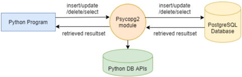
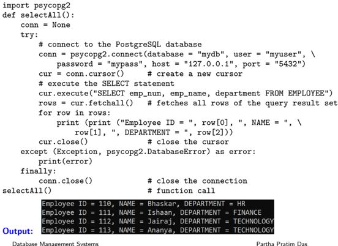
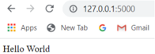
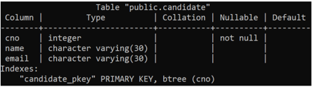
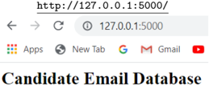
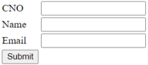
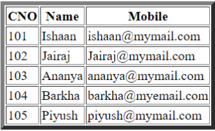

## Module 34

Partha Pratim Das

Objectives &amp; Outline

PostgreSQL and Python

Python Frameworks for PostgresSQL

Flask

Module Summary

## Database Management Systems

Module 34: Application Design and Development/4: Python and PostgreSQL

## Partha Pratim Das

Department of Computer Science and Engineering Indian Institute of Technology, Kharagpur ppd@cse.iitkgp.ac.in

Partha Pratim Das

Module 34

Partha Pratim Das

Objectives &amp; Outline

PostgreSQL and Python

Python Frameworks for PostgresSQL

Flask

Module Summary

## Module Recap

- Introduced the use of SQL from a programming language

## Module 34

Partha Pratim Das

Objectives &amp; Outline

PostgreSQL and Python

Python Frameworks for PostgresSQL

Flask

Module Summary

## Module Objectives

- To understand how to access PostgreSQL database from Python
- To understand Python Web Application with PostgresSQL

## Module 34

Partha Pratim Das

Objectives &amp; Outline

PostgreSQL and Python

Python Frameworks for PostgresSQL

Flask

Module Summary

## Module Outline

- Accessing PostgreSQL from Python
- Developing Web Application with Python

## Module 34

Partha Pratim Das

Objectives &amp; Outline

PostgreSQL and Python

Python Frameworks for PostgresSQL

Flask

Module Summary

## Working with PostgreSQL and Python

## Module 34

Partha Pratim Das

Objectives &amp; Outline

PostgreSQL and Python

Python Frameworks for PostgresSQL

Flask

Module Summary

## Python Modules for PostgreSQL

Following Python modules that can be used to work with a PostgreSQL database server:

- psycopg2
- pg8000
- py-postgresql
- PyGreSQL
- ocpgdb
- bpgsql
- SQLAlchemy (needs any of the above to be installed separately)

Source :

https: // pynative. com/ python-postgresql-tutorial/

Partha Pratim Das

## Module 34

Partha Pratim Das

Objectives &amp; Outline

PostgreSQL and Python

Python Frameworks for PostgresSQL

Flask

Module Summary

## Package psycopg2

## Advantages of psycopg2

- Most popular and stable module to work with PostgreSQL
- Used in most of the Python and Postgres frameworks
- An actively maintained package and supports Python 2.x and 3.x
- Thread-safe and designed for heavily multi-threaded applications.

## Installing Psycopg2 using pip command

- The following pip command installs psycopg2 on different operating systems including Windows, MacOS, Linux, and Unix pip install psycopg2
- For installing specific version, the following command can be used pip install psycopg2=2.8.6

Source :

https: // pynative. com/ python-postgresql-tutorial/

Partha Pratim Das

## Module 34

Partha Pratim

Das

Objectives &amp; Outline

PostgreSQL and Python

Python Frameworks for PostgresSQL

Flask

Module Summary

## Steps to access PostgresSQL from Python

## Steps to access PostgresSQL from Python using Psycopg

- a) Create connection
- b) Create cursor
- c) Execute the query
- d) Commit/rollback
- e) Close the cursor
- f) Close the connection

Source : https: // pynative. com/ python-postgresql-tutorial/

## Module 34

Partha Pratim Das

Objectives &amp; Outline

PostgreSQL and Python

Python Frameworks for PostgresSQL

Flask

Module Summary

## Python psycopg2 Module APIs: connection objects

- psycopg2.connect(database="mydb", user="myuser", password="mypass" host="127.0.0.1", port="5432")

This API opens a connection to the PostgreSQL database. If database is opened successfully, it returns a connection object.

- connection.close()

This method closes the database connection.

Important psycopg2 module routines for managing cursor object:

- connection.cursor()

This routine creates a cursor which will be used throughout the program.

- cursor.close()

This method closes the cursor.

Source :

https: // www. tutorialspoint. com/ postgresql/ postgresql\_ python. htm

Partha Pratim Das

## Module 34

Partha Pratim Das

Objectives &amp; Outline

PostgreSQL and Python

Python Frameworks for PostgresSQL

Flask

Module Summary

## Python psycopg2 Module APIs: insert, delete, update &amp; stored procedures

## · cursor.execute(sql [, optional parameters])

This routine executes an SQL statement. The SQL statement may be parameterized (i.e., placeholders instead of SQL literals). The psycopg2 module supports placeholder using %s sign. For example: cursor.execute("insert into people values (%s, %s)", (who, age))

## · cursor.executemany(sql, seq of parameters)

This routine executes an SQL command against all parameter sequences or mappings found in the sequence SQL.

## · cursor.callproc(procname[, parameters])

This routine executes a stored database procedure with the given name. The sequence of parameters must contain one entry for each argument that the procedure expects.

## · cursor.rowcount

This is a read-only attribute which returns the total number of database rows that have been modified, inserted, or deleted by the last execute() .

:

## Module 34

Partha Pratim Das

Objectives &amp; Outline

## PostgreSQL and Python

Python Frameworks for PostgresSQL

Flask

Module Summary

## Python psycopg2 Module APIs: select

## · cursor.fetchone()

This method fetches the next row of a query result set, returning a single sequence, or None when no more data is available.

## · cursor.fetchmany([size=cursor.arraysize])

This routine fetches the next set of rows of a query result, returning a list. An empty list is returned when no more rows are available. The method tries to fetch as many rows as indicated by the size parameter.

## · cursor.fetchall()

This routine fetches all (remaining) rows of a query result, returning a list. An empty list is returned when no rows are available.

:

Partha Pratim Das

## Module 34

Partha Pratim Das

Objectives &amp; Outline

PostgreSQL and Python

Python Frameworks for PostgresSQL

Flask

Module Summary

## Python psycopg2 Module APIs: commit &amp; rollback

## · connection.commit()

This method commits the current transaction. If you do not call this method, anything you did since the last call to commit() is not visible to other database connections.

- connection.rollback()

This method rolls back any changes to the database since the last call to commit() .

:

Partha Pratim Das

Module 34

Partha Pratim Das

Objectives &amp; Outline

PostgreSQL and Python

Python Frameworks for PostgresSQL

Flask

Module Summary

## Connect to a PostgreSQL Database Server

import psycopg2

def connectDb(dbname, usrname, pwd, address, portnum): conn = None try: # connect to the PostgreSQL database conn = psycopg2.connect(database = dbname, user = usrname, \ password = pwd, host = address, port = portnum) print ("Database connected successfully") except (Exception, psycopg2.DatabaseError) as error: print(error) finally: conn.close() # close the connection

connectDb("mydb", "myuser", "mypass", "127.0.0.1", "5432") # function call

Output:

## Database connected\_successfully

psycopg2.DatabaseError : Exception raised for errors that are related to the PostgreSQL database. We assume the following for all the programs in this module:

- Database Name: mydb
- Username: myuser
- Password: mypass
- Host Name: localhost or IP address 127.0.0.1

Database Management Systems

Partha Pratim Das

34.13

Module 34

Partha Pratim Das

Objectives &amp; Outline

PostgreSQL and Python

Python Frameworks for PostgresSQL

Flask

Module Summary

## Steps to execute SQL commands

1. Use the psycopg2.connect() method with the required arguments to connect PostgresSQL. It would return an Connection object if the connection established successfully.
2. Create a cursor object using the cursor() method of connection object.
3. The execute() methods run the SQL commands and return the result.
4. Use cursor.fetchall() or fetchone() or fetchmany() to read query result.
5. Use commit() to make the changes in database persistent, or use rollback() to revert the database changes.
6. Use cursor.close() and connection.close() method to close the cursor and PostgreSQL connection.

Source : https: // pynative. com/ python-postgresql-tutorial/

Module 34

Partha Pratim Das

Objectives &amp; Outline

PostgreSQL and Python

Python Frameworks for PostgresSQL

Flask

Module Summary

## CREATE new PostgreSQL tables

import psycopg2

def createTable():

conn = None

try:

conn = psycopg2.connect(database

= "mydb", user = "myuser", \

password = "mypass", host = "127.0.0.1", port =

"5432") #

connect

to the database

cur = conn.cursor()

#

create

a new cursor

cur.execute('''CREATE TABLE

EMPLOYEE \

(emp\_num INT PRIMARY KEY

NOT NULL, \

emp\_name VARCHAR(40)

NOT

NULL, \

department VARCHAR(40)

NOT NULL)''') # execute the CREATE TABLE statement

conn.commit()

#

commit

the changes to the database

print ("Table created successfully")

cur.close()

# close the cursor

except (Exception, psycopg2.DatabaseError) as error:

print(error)

finally:

if conn is not None:

conn.close()

# close the connection

createTable()

#function call

Output (if table EMPLOYEE does not exist):

Output (if table EMPLOYEE already exists):

Database Management Systems rrelation employee already exists

Partha Pratim Das

34.15

Module 34

Partha Pratim Das

Objectives &amp; Outline

PostgreSQL and Python

Python Frameworks for PostgresSQL

Flask

Module Summary

## Executing INSERT statement from Python

import psycopg2

def insertRecord(num, name, dept):

conn = None try:

# connect to the

PostgreSQL database conn = psycopg2.connect(database

= "mydb", user = "myuser", \

password = "mypass", host = "127.0.0.1", port =

"5432")

cur = conn.cursor()

# create a new cursor

# execute the INSERT statement cur.execute("INSERT INTO

EMPLOYEE

(emp\_num, emp\_name, department) \

VALUES (%s, %s, %s)", (num, name, dept))

conn.commit()

#

commit the changes to the database

print ("Total number of rows inserted :", cur.rowcount);

cur.close()

# close the cursor except (Exception, psycopg2.DatabaseError) as error:

print(error)

finally:

if conn is not

None:

conn.close()

insertRecord(110, 'Bhaskar', 'HR')

# close the connection #function call

Output:

number of rows inserted 1

Output:

duplicate key value violates unique constraint employee\_pkey (emp\_num)=(110) already exists Key

If a row already exists with emp num = 110 Database Management Systems

Partha Pratim Das

34.16

Module 34

Partha Pratim Das

Objectives &amp; Outline

PostgreSQL and Python

Python Frameworks for PostgresSQL

Flask

Module Summary

## Executing DELETE statement from Python

import psycopg2

def deleteRecord(num):

conn = None

try:

# connect to the PostgreSQL database

conn = psycopg2.connect(database

= "mydb", user = "myuser", \

password = "mypass", host = "127.0.0.1", port =

"5432")

cur = conn.cursor()

# create a new cursor

# execute the DELETE statement

cur.execute("DELETE FROM

EMPLOYEE

WHERE

emp\_num

= %s", (num,))

conn.commit()

# commit the changes to the database

print ("Total number of rows deleted :", cur.rowcount)

cur.close()

# close the cursor

except (Exception, psycopg2.DatabaseError) as error:

print(error)

finally:

conn.close()

# close the connection #function call

deleteRecord(110)

Output:

Output:

If the row does not exist

number of rows deleted

Of rows deleted

Database Management Systems

Module 34

Partha Pratim Das

Objectives &amp; Outline

PostgreSQL and Python

Python Frameworks for PostgresSQL

Flask

Module Summary

## Executing UPDATE statement from Python

import psycopg2

def updateRecord(num, dept):

conn = None try:

# connect to the

PostgreSQL database conn = psycopg2.connect(database

= "mydb", user = "myuser", \

password = "mypass", host = "127.0.0.1", port =

"5432")

cur = conn.cursor()

# create a new cursor

# execute the UPDATE statement cur.execute("UPDATE EMPLOYEE set

%s", (dept, num))

conn.commit()

#

commit the

changes to the database

print ("Total number of rows updated :", cur.rowcount)

cur.close()

# close the cursor except (Exception, psycopg2.DatabaseError) as error:

print(error)

finally:

conn.close()

updateRecord(110, "Finance")

# close the connection

#function call

Output:

Total number rows updated

Output:

Total number Of rows updated

If the row does not exist

Database Management Systems department =

%s where emp\_num = \

Module 34

Partha Pratim Das

Objectives &amp; Outline

PostgreSQL and Python

Python Frameworks for PostgresSQL

Flask

Module Summary

## Executing SELECT statement from Python

Database Management Systems

Partha Pratim Das

## Module 34

Partha Pratim Das

Objectives &amp; Outline

PostgreSQL and Python

Python Frameworks for PostgresSQL

Flask

Module Summary

## Python Frameworks for PostgresSQL

## Module 34

Partha Pratim Das

Objectives &amp; Outline

PostgreSQL and Python

Python Frameworks for PostgresSQL

Flask

Module Summary

## Web and Internet Development using Python

Python offers several frameworks such as bottle.py , Flask , CherryPy , Pyramid , Django and web2py for web development.

- Python offers many choices for web development
- Frameworks such as Django and Pyramid .
- Advanced content management systems such as Plone and django CMS .
- Micro-frameworks such as Flask and Bottle .
- Python's standard library supports many internet protocols
- HTML and XML
- E-mail processing
- JSON
- Support for FTP , IMAP , and other Internet protocols
- Easy-to-use socket interface
- The package Index has more libraries
- Requests , a powerful HTTP client library.
- Feedparser for parsing RSS/Atom feeds.
- Beautiful Soup , an HTML parser that can handle all sorts of HTML.
- Paramiko , implementing the SSH2 protocol.
- Twisted Python , a framework for asynchronous network programming.

## Module 34

Partha Pratim Das

Objectives &amp; Outline

PostgreSQL and Python

Python Frameworks for PostgresSQL

Flask

Module Summary

## Flask Web Application Framework

- Flask is a lightweight WSGI (Web Server Gateway Interface) web application framework. It is designed to make getting started quick and easy, with the ability to scale up to complex applications.
- It began as a simple wrapper around Werkzeug (Werkzeug WSGI toolkit) and Jinja (Jinja template engine) and has since then become one of the most popular Python web application frameworks.
- Flask offers suggestions, but does not enforce any dependencies or project layouts. It is up to the developer to choose the tools and libraries they want to use.
- There are many extensions provided by the community that make adding new functionality easy.

## Installing Flask using pip command

- pip install -U Flask

Source :

https: // pypi. org/ project/ Flask/

Partha Pratim Das

Database Management Systems

Module 34

Partha Pratim Das

Objectives &amp; Outline

PostgreSQL and Python

Python Frameworks for PostgresSQL

Flask

Module Summary

## A Simple Example

from flask import Flask app = Flask(\_\_name\_\_)

@app.route('/') def hello\_world(): return "Hello World"

- Importing flask module in the project is mandatory. Our WSGI application is an object of Flask class.
- Flask constructor takes the name of current module ( name ) as argument.
- if \_\_name\_\_ == '\_\_main\_\_': app.run()
- The route() function of the Flask class is a decorator, which tells the application which URL should call the associated function. app.route(rule, options)
- The rule parameter represents URL binding with the function.
- The options is a list of parameters to be forwarded to the underlying Rule object.
- In the above example, '/' URL is bound with hello world() function. Hence, when the home page of web server is opened in browser, the output of this function will be rendered.
- Finally the run() method of Flask class runs the application on the local development server.

Source :

https: // www. tutorialspoint. com/ flask/ flask\_ application. htm

Database Management Systems

Partha Pratim Das

34.23

## Module 34

Partha Pratim Das

Objectives &amp; Outline

PostgreSQL and Python

Python Frameworks for PostgresSQL

Flask

Module Summary

## A Simple Example (2)

## app.run(host, port, debug, options)

- host : Hostname to listen on. Defaults to 127.0.0.1 (localhost). Set to '0.0.0.0' to have server available externally
- port : Defaults to 5000
- debug : Defaults to false. If set to true, provides a debug information
- options : To be forwarded to underlying Werkzeug server.

## Executing the code:

- Python Hello.py

## Output:

A message in Python shell:

- * Running on http://127.0.0.1:5000/ (Press CTRL+C to quit)

Open the above URL (127.0.0.1:5000) in the browser

## Module 34

Partha Pratim Das

Objectives &amp; Outline

PostgreSQL and Python

Python Frameworks for PostgresSQL

Flask

Module Summary

## Python: Flask

- Consider the table Candidate (in PostgreSQL) as shown below:
- Code segment in Python:

from flask import Flask, \ render\_template, request import psycopg2

app = Flask( \_\_name\_\_, template\_folder='templates'

)

#functions to be added here for #different actions

- if \_\_name\_\_ == '\_\_main\_\_': # Run the Flask app app.run( host='127.0.0.1', debug=True, port=5000 )

Module 34

Partha Pratim Das

Objectives &amp; Outline

PostgreSQL and Python

Python Frameworks for PostgresSQL

Flask

Module Summary

## Python: Flask (2)

- Source code for index.html :

&lt;!DOCTYPE html&gt; &lt;html&gt; &lt;head&gt; &lt;title&gt;Candidate Email Database&lt;/title&gt; &lt;/head&gt; &lt;body&gt; &lt;h2&gt;Candidate Email Database&lt;/h2&gt; &lt;a href="/add"&gt;Add Email&lt;/a&gt;&lt;br&gt;&lt;br&gt; &lt;a href="/viewall"&gt;View Email&lt;/a&gt;

&lt;/body&gt; &lt;/html&gt;

- •
- Source code for rendering index.html and add.html pages:

@app.route("/") def index():

return render\_template("index.html");

@app.route("/add") def add(): return render\_template("add.html")

Database Management Systems

Partha Pratim Das

34.26

## Module 34

Partha Pratim Das

Objectives &amp; Outline

PostgreSQL and Python

Python Frameworks for PostgresSQL

Flask

Module Summary

## Python: Flask (3)

Add Email

View Email

Module 34

Partha Pratim Das

Objectives &amp; Outline

PostgreSQL and Python

Python Frameworks for PostgresSQL

Flask

Module Summary

## Python: Flask (4)

- Source code for add.html (in HTML):

&lt;!DOCTYPE html&gt;

&lt;html&gt;

&lt;head&gt;

&lt;title&gt;Add Email&lt;/title&gt;

&lt;/head&gt;

&lt;body&gt;

&lt;h2&gt;Email Information&lt;/h2&gt;

&lt;form action = "/savedetails" method="post"&gt;

&lt;table&gt;

&lt;tr&gt;&lt;td&gt;CNO&lt;/td&gt;&lt;td&gt;&lt;input type="text" name="cno" required&gt;&lt;/td&gt;&lt;/tr&gt; &lt;tr&gt;&lt;td&gt;Name&lt;/td&gt;&lt;td&gt;&lt;input type="text" name="name" required&gt;&lt;/td&gt;&lt;/tr&gt; &lt;tr&gt;&lt;td&gt;Email&lt;/td&gt;&lt;td&gt;&lt;input type="text" name="email" required&gt;&lt;/td&gt;&lt;/tr&gt; &lt;tr&gt;&lt;td&gt;&lt;input type="submit" value="Submit"&gt;&lt;/td&gt;&lt;/tr&gt;

&lt;/table&gt;

&lt;/form&gt;

&lt;/body&gt; &lt;/html&gt;

Module 34

Partha Pratim Das

Objectives &amp; Outline

PostgreSQL and Python

Python Frameworks for PostgresSQL

Flask

Module Summary

## Python: Flask (5)

- savaDetails() function for add.html (in Python):

@app.route("/savedetails",methods = ["POST"]) def saveDetails():

cno = request.form["cno"]

name = request.form["name"]

email = request.form["email"]

conn = None

try:

conn = psycopg2.connect(database

= "mydb", user = "myuser", \

password = "mypass", host = "127.0.0.1", port = "5432") #

connect

to the PostgreSQL database

cur = conn.cursor()

# create a

new cursor

cur.execute("INSERT

INTO

Candidate

(cno,

name,

email)

\

VALUES (%s, %s, %s)", (cno, name, email)) #

execute

the INSERT statement

conn.commit() # commit the changes to the database

cur.close() # close the cursor

except (Exception, psycopg2.DatabaseError) as error:

render\_template("fail.html")

finally:

if conn is

not

None:

conn.close()

# close the connection

return render\_template("success.html")

Database Management Systems

Partha Pratim Das

34.29

## Module 34

Partha Pratim

Das

Objectives &amp;

Outline

PostgreSQL and

Python

Python

Frameworks for

PostgresSQL

Flask

Module Summary

## Python: Flask (6)

## http://127.0.0.1:5000/add

9

C

Apps

New Tab

Gmail

## Mobile Information

## http://127.0.0.1:5000/savedetails

9

C

Apps

New Tab

M Gmail

## Data Successfully Added

Go Home

Yoi

## Module 34

Partha Pratim Das

Objectives &amp; Outline

PostgreSQL and Python

Python Frameworks for PostgresSQL

Flask

Module Summary

## Python: Flask (7)

- viewAll() function for viewall.html (in Python):

@app.route("/viewall")

def viewAll():

conn = None

try:

# connect to the

PostgreSQL database

conn = psycopg2.connect(database

= "mydb", user = "myuser", \

password = "mypass", host = "127.0.0.1", port = "5432")

cur = conn.cursor()

# create a new cursor

# execute the SELECT statement

cur.execute("SELECT

cno,

name, email FROM Candidate")

results = cur.fetchall()

#

fetches

all rows of the query result set

cur.close()

- # close the cursor

except (Exception, psycopg2.DatabaseError) as error:

render\_template("fail.html")

finally:

conn.close()

# close the connection

return render\_template("viewall.html",rows = results)

34.31

Module 34

Partha Pratim Das

Objectives &amp; Outline

PostgreSQL and Python

Python Frameworks for PostgresSQL

Flask

Module Summary

## Python: Flask (8)

- Source code for viewall.html (in HTML):

&lt;!DOCTYPE html&gt; &lt;html&gt; &lt;head&gt; &lt;title&gt;Email List&lt;/title&gt;

&lt;/head&gt; &lt;body&gt;

&lt;h3&gt;Email List&lt;/h3&gt; &lt;table border=5&gt;

&lt;tr&gt;

&lt;th&gt;CNO&lt;/td&gt;&lt;th&gt;Name&lt;/td&gt;&lt;th&gt;Email&lt;/td&gt;

&lt;/tr&gt;



&lt;tr&gt;

&lt;td&gt;{{row[0]}}&lt;/td&gt; &lt;td&gt;{{row[1]}}&lt;/td&gt; &lt;td&gt;{{row[2]}}&lt;/td&gt;

&lt;/tr&gt;



&lt;/table&gt;

&lt;br&gt;&lt;br&gt;

&lt;a href="/"&gt;Go Home&lt;/a&gt;

&lt;/body&gt;

&lt;/html&gt;

Database Management Systems

Partha Pratim Das

34.32

## Module 34

Partha Pratim

Das

Objectives &amp;

Outline

PostgreSQL and

Python

Python

Frameworks for

PostgresSQL

Flask

Module Summary

## Python: Flask (9)

## http://127.0.0.1:5000/viewall

## Email List

|   [CNO | Name    | Mobile                     |
|--------|---------|----------------------------|
|    101 | Ishaan  | lishaan@mymail com         |
|    102 | [Jairaj | [Jairaj@mymail.com         |
|    103 |         | Ananya lananya@mymail com  |
|    104 |         | [Barkha barkha@myemail.com |
|    105 |         | [Piyush_piyush@mymail.com  |

Go Home

## Module 34

Partha Pratim Das

Objectives &amp; Outline

PostgreSQL and Python

Python Frameworks for PostgresSQL

Flask

Module Summary

## Module Summary

- Learnt how to access PostgreSQL database from Python
- Learnt to build Python Web Application with PostgresSQL and Flask

Slides used in this presentation are borrowed from http://db-book.com/ with kind permission of the authors. Edited and new slides are marked with 'PPD'.