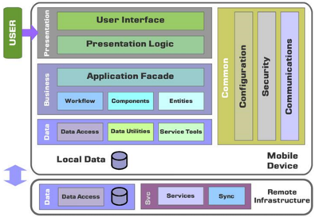

## Module 35

Partha Pratim Das

Objectives &amp; Outline

Rapid Application Development

Application Performance and Security

Challenges

Mobile Apps

Module Summary

## Database Management Systems

Module 35: Application Design and Development/5: Application Development and Mobile

## Partha Pratim Das

Department of Computer Science and Engineering Indian Institute of Technology, Kharagpur ppd@cse.iitkgp.ac.in

Partha Pratim Das

## Module 35

Partha Pratim Das

## Objectives &amp; Outline

Rapid Application Development

Application Performance and Security

Challenges

Mobile Apps

Module Summary

## Module Recap

- Learnt how to accessing PostgreSQL database from Python
- Learnt to build Python Web Application with PostgreSQL and Flask

## Module 35

Partha Pratim Das

Objectives &amp; Outline

Rapid Application Development

Application Performance and Security

Challenges

Mobile Apps

Module Summary

## Module Objectives

- To explore the Rapid Application Development Process
- To understand the issues in Application Performance and Security
- To understand the similarity and differences between how Mobile Apps and Web Applications

## Module 35

Partha Pratim Das

## Objectives &amp; Outline

Rapid Application Development

Application Performance and Security

Challenges

Mobile Apps

Module Summary

## Module Outline

- Rapid Application Development
- Application Performance and Security
- Mobile Apps

## Module 35

Partha Pratim Das

Objectives &amp; Outline

Rapid Application Development

Application Performance and Security

Challenges

Mobile Apps

Module Summary

## Rapid Application Development

## Rapid Application Development

Module 35

Partha Pratim Das

Objectives &amp; Outline

Rapid Application Development

Application Performance and Security

Challenges

Mobile Apps

Module Summary

## Rapid Application Development

- A lot of effort is required to develop Web application interfaces, especially the rich interaction functionality associated with Web 2.0 applications
- Several approaches to speed up application development
- Function library to generate user-interface elements
- Drag-and-drop features in an IDE to create user-interface elements
- Automatically generate code for user interface from a declarative specification
- Used as part of Rapid Application Development (RAD) tools even before Web
- RAD Software is an agile model that focuses on fast prototyping and quick feedback in app development to ensure speedier delivery and an efficient result
- App development has 4 phases: business modeling, data modeling, process modeling, and testing &amp; turnover: Defining the requirements, Prototyping, Receiving feedback and Finalizing the software
- With RAD, the time between prototypes and iterations is short, and integration occurs since inception.

## Partha Pratim Das

## Module 35

Partha Pratim Das

Objectives &amp; Outline

Rapid Application Development

Application Performance and Security

Challenges

Mobile Apps

Module Summary

## Rapid Application Development (2)

- Web application development frameworks
- Java Server Faces (JSF)
- glyph[triangleright] A set of APIs for representing UI components and managing their state, handling events and input validation, defining page navigation, and supporting internationalization and accessibility
- glyph[triangleright] JSP custom tag library for expressing a JSF interface within a JSP page
- Ruby on Rails
- glyph[triangleright] Allows easy creation of simple CRUD (create, read, update and delete) interfaces by code generation from database schema or object model
- RAD Platforms and Tools
- G Suite
- Google App Engine
- Microsoft Azure
- Amazon Elastic Compute Cloud (EC2)
- AWS Elastic Beanstalk

## Module 35

Partha Pratim Das

Objectives &amp; Outline

Rapid Application Development

Application Performance and Security

Challenges

Mobile Apps

Module Summary

## ASP.NET and Visual Studio

- ASP.NET provides a variety of controls that are interpreted at server, and generate HTML code
- Visual Studio provides drag-and-drop development using these controls
- For example, menus and list boxes can be associated with DataSet object
- Validator controls (constraints) can be added to form input fields
- glyph[triangleright] JavaScript to enforce constraints at client, and separately enforced at server
- User actions such as selecting a value from a menu can be associated with actions at server
- DataGrid provides convenient way of displaying SQL query results in tabular format

## Module 35

Partha Pratim Das

Objectives &amp; Outline

Rapid Application Development

Application Performance and Security

Challenges

Mobile Apps

Module Summary

## Application Performance and Security

## Application Performance and Security

## Module 35

Partha Pratim Das

Objectives &amp; Outline

Rapid Application Development

Application Performance and Security

Challenges

Mobile Apps

Module Summary

## Application Performance

- Performance is an issue for popular Web sites
- May be accessed by millions of users every day, thousands of requests per second at peak time
- Caching techniques used to reduce cost of serving pages by exploiting commonalities between requests
- At the server site:
- glyph[triangleright] Caching of JDBC connections between servlet requests
- a.k.a. connection pooling
- glyph[triangleright] Caching results of database queries
- Cached results must be updated if underlying database changes
- glyph[triangleright]
- Caching of generated HTML
- At the client's network
- glyph[triangleright] Caching of pages by Web proxy

Module 35

Partha Pratim Das

Objectives &amp; Outline

Rapid Application Development

Application Performance and Security

Challenges

Mobile Apps

Module Summary

## Application Security: SQL Injection

- Suppose query is constructed using
- 'select * from instructor where name = '' + name + '''
- Suppose the user, instead of entering a name, enters:
- X' or 'Y' = 'Y
- then the resulting statement becomes:
- 'select * from instructor where name = '' + 'X' or 'Y' = 'Y' + '''
- which is:
- glyph[triangleright] select * from instructor where name = 'X' or 'Y' = 'Y'
- User could have even used
- glyph[triangleright] X'; update instructor set salary = salary + 10000; - -
- Prepared statement internally uses:
- 'select * from instructor where name = 'X \ ' or \ 'Y \ ' = \ 'Y'
- Always use prepared statements, with user inputs as parameters
- Is the following prepared statement secure?
- conn.prepareStatement('select * from instructor where name = '' + name + ''') Database Management Systems Partha Pratim Das 35.11

## Module 35

Partha Pratim Das

Objectives &amp; Outline

Rapid Application Development

Application Performance and Security

Challenges

Mobile Apps

Module Summary

## Application Security (2): Password Leakage

- Never store passwords, such as database passwords, in clear text in scripts that may be accessible to users
- For example, in files in a directory accessible to a web server
- glyph[triangleright] Normally, web server will execute, but not provide source of script files such as file.jsp or file.php, but source of editor backup files such as file.jsp ∼ , or .file.jsp.swp may be served
- Restrict access to database server from IPs of machines running application servers
- Most databases allow restriction of access by source IP address

## Module 35

Partha Pratim Das

Objectives &amp; Outline

Rapid Application Development

Application Performance and Security

Challenges

Mobile Apps

Module Summary

## Application Security (3): Authentication

- Single factor authentication such as passwords too risky for critical applications
- guessing of passwords, sniffing of packets if passwords are not encrypted
- passwords reused by user across sites
- spyware which captures password
- Two-factor authentication
- For example, password plus one-time password sent by SMS
- For example, password plus one-time password devices
- glyph[triangleright] device generates a new pseudo-random number every minute, and displays to user
- glyph[triangleright] user enters the current number as password
- glyph[triangleright] application server generates same sequence of pseudo-random numbers to check that the number is correct.

## Module 35

Partha Pratim Das

Objectives &amp; Outline

Rapid Application Development

Application Performance and Security

Challenges

Mobile Apps

Module Summary

## Application Security (4): Application-Level Authorization

- Current SQL standard does not allow fine-grained authorization such as 'students can see their own grades, but not other's grades'
- Problem 1: Database has no idea who are application users
- Problem 2: SQL authorization is at the level of tables, or columns of tables, but not to specific rows of a table
- One workaround: use views such as create view studentTakes as select * from takes
- where takes.ID = syscontext.user id()
- where syscontext.user id() provides end user identity
- glyph[triangleright] end user identity must be provided to the database by the application
- Having multiple such views is cumbersome

## Module 35

Partha Pratim Das

Objectives &amp; Outline

Rapid Application Development

Application Performance and Security

Challenges

Mobile Apps

Module Summary

## Application Security (5): Application-Level Authorization

- Currently, authorization is done entirely in application
- Entire application code has access to entire database
- large surface area, making protection harder
- Alternative: fine-grained (row-level) authorization schemes
- extensions to SQL authorization proposed but not currently implemented
- Oracle Virtual Private Database (VPD) allows predicates to be added transparently to all SQL queries, to enforce fine-grained authorization
- glyph[triangleright] For example, add ID = sys context.user id() to all queries on student relation if user is a student

## Module 35

Partha Pratim Das

Objectives &amp; Outline

Rapid Application Development

Application Performance and Security

Challenges

Mobile Apps

Module Summary

## Application Security (6): Audit Trails

- Applications must log actions to an audit trail, to detect who carried out an update, or accessed some sensitive data
- Audit trails used after-the-fact to
- detect security breaches
- repair damage caused by security breach
- trace who carried out the breach
- Audit trails needed at
- Database level, and at
- Application level

Module 35

Partha Pratim Das

Objectives &amp; Outline

Rapid Application Development

Application Performance and Security

Challenges

Mobile Apps

Module Summary

## Challenges in Web Application Development

## Challenges in Web Application Development

## Module 35

Partha Pratim Das

Objectives &amp; Outline

Rapid Application Development

Application Performance and Security

Challenges

Mobile Apps

Module Summary

## Challenges in Web Application Development

- User Interface and User Experience
- Scalability
- Performance
- Knowledge of Framework and Platforms
- Security

Source : 5 Challenges in Web Application Development

## Module 35

Partha Pratim Das

Objectives &amp; Outline

Rapid Application Development

Application Performance and Security

Challenges

Mobile Apps

Module Summary

## Mobile Apps

## Mobile Apps

## Module 35

Partha Pratim Das

Objectives &amp; Outline

Rapid Application Development

Application Performance and Security

Challenges

Mobile Apps

Module Summary

## What is a Mobile App?

- A type of application software designed to run on a mobile device, such as a smartphone or tablet computer
- Developed specifically for use on small, wireless computing devices, such as smartphones and tablets
- Designed with consideration for the demands and constraints of the devices and also to take advantage of any specialized capabilities
- -Form Factor - influences display and navigation
- -Limited Memory
- -Limited Computing Power
- -Limited Power
- -Limited Bandwidth

-

· · ·

+ Availability of sensors like accelerometer
+ Availability of touchscreen - Gesture-based Navigation

· · ·

## Module 35

Partha Pratim Das

Objectives &amp; Outline

Rapid Application Development

Application Performance and Security

Challenges

Mobile Apps

Module Summary

## Mobile Website vis-` a-vis Mobile App

## · Mobile Website

- Similar to any other website in that it consists of browser-based HTML pages
- Can display text content, data, images and video
- Typically accessed over WiFi or 3G or 4G networks
- Designed for the smaller handheld display and touch-screen interface
- Can also access mobile-specific features such as click-to-call (to dial a phone number) or location-based mapping

## · Mobile Apps

- Actual applications that are downloaded and installed on the mobile device
- Users download apps from device-specific portals such as App Store, Google Play Store
- The app may
- glyph[triangleright] pull content and data from the Internet, in similar fashion to a website, or
- glyph[triangleright] download the content so that it can be accessed without an Internet connection

Source:

https://www.slideshare.net/hassandar18/architecture-of-mobile-software-applications?from\_action=save

Database Management Systems

Partha Pratim Das

## Module 35

Partha Pratim Das

Objectives &amp; Outline

Rapid Application Development

Application Performance and Security

Challenges

Mobile Apps

Module Summary

## Architecture of Mobile App

- Typically 3 tier
- Presentation
- Business
- Data
- Data Layer is often split between:
- Local Data
- Remote Data
- Needs customization for platform
- Android
- iOS
- Windows

## Module 35

Partha Pratim Das

Objectives &amp; Outline

Rapid Application Development

Application Performance and Security

Challenges

Mobile Apps

Module Summary

## Types of Mobile Apps

- Native Apps: Completely written in the native language of a platform
- iOS → Objective-C; Android → Java or C/C++
- Platform specific (heavily dependent on OS)
- Web Apps: Run completely inside of a Web browser.
- Features interfaces built with HTML or CSS
- Powered via Web programming languages → Ruby on Rails, JavaScript, PHP, or Python
- Portable across any phone, tablet, or computer
- Hybrid Apps: Combines attributes of both native and Web apps.
- Attempts to use redundant, common code that can be used across platforms, and
- Tailors required attributes to the native system

Source: https://www.slideshare.net/hassandar18/architecture-of-mobile-software-applications?from\_action=save

## Module 35

Partha Pratim Das

Objectives &amp; Outline

Rapid Application Development

Application Performance and Security

Challenges

Mobile Apps

Module Summary

## Design Issues

- Determine Device
- Note Device Resources - memory, power, speed
- Consider Bandwidth
- Decide on Architecture Layers
- Select Technology
- Define User Interface
- Select Navigation
- Maintain Flow

Source: https://www.slideshare.net/hassandar18/architecture-of-mobile-software-applications?from\_action=save

## Module 35

Partha Pratim Das

Objectives &amp; Outline

Rapid Application Development

Application Performance and Security

Challenges

Mobile Apps

Module Summary

## Module Summary

- Understood the steps in the Rapid Application Development Process
- Exposed to the issues in Application Performance and Application Security
- Learnt the distinctive features of Mobile Apps

Slides used in this presentation are borrowed from http://db-book.com/ with kind permission of the authors.

Edited and new slides are marked with 'PPD'.

Database Management Systems

Partha Pratim Das

35.25