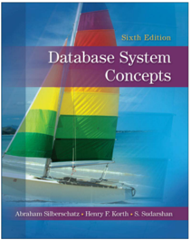

## Module 01

Partha Pratim Das

Objectives &amp; Outline

Why Databases?

Know Your Course

Course Outline

Course Text Book

Module Summary

## Database Management Systems Module 01: Course Overview

## Partha Pratim Das

Department of Computer Science and Engineering Indian Institute of Technology, Kharagpur ppd@cse.iitkgp.ac.in

Partha Pratim Das

## Module 01

Partha Pratim Das

Objectives &amp; Outline

Why Databases?

Know Your Course

Course Outline

Course Text Book

Module Summary

## Module Objectives

- To understand the importance of database management systems in modern day applications
- To Know Your Course

## Module 01

Partha Pratim Das

Objectives &amp; Outline

Why Databases?

Know Your Course

Course Outline

Course Text Book

Module Summary

## Module Outline

- Why Databases?
- KYC: Know Your Course
- Course Prerequisite
- Course Outline
- Course Text Book

## Module 01

Partha Pratim Das

Objectives &amp; Outline

Why Databases?

Know Your Course

Course Outline

Course Text Book

Module Summary

## Why Databases?

## Why Databases?

Module 01

Partha Pratim Das

Objectives &amp; Outline

Why Databases?

Know Your Course

Course Outline

Course Text Book

Module Summary

## Database Management System (DBMS)

- DBMS contains information about a particular enterprise
- Collection of interrelated data
- Set of programs to access the data
- An environment that is both convenient and efficient to use
- Database Applications:
- Banking: transactions
- Airlines: reservations, schedules
- Universities: registration, grades
- Sales: customers, products, purchases
- Online retailers: order tracking, customized recommendations
- Manufacturing: production, inventory, orders, supply chain
- Human resources: employee records, salaries, tax deductions

◦

· · ·

- Databases can be very large
- Databases touch all aspects of our lives

Partha Pratim Das

## Module 01

Partha Pratim Das

Objectives &amp; Outline

Why Databases?

Know Your Course

Course Outline

Course Text Book

Module Summary

## University Database Example

- Application program examples
- Add new students, instructors, and courses
- Register students for courses, and generate class rosters
- Assign grades to students, compute grade point averages (GPA) and generate transcripts
- In the early days, database applications were built directly on top of file systems

## Module 01

Partha Pratim Das

Objectives &amp; Outline

Why Databases?

Know Your Course

Course Outline

Course Text Book

Module Summary

## Drawbacks of using file systems to store data

- Data redundancy and inconsistency
- Multiple file formats, duplication of information in different files
- Difficulty in accessing data
- Need to write a new program to carry out each new task
- Data isolation
- Multiple files and formats
- Integrity problems
- Integrity constraints (e.g., account balance &gt; 0) become 'buried' in program code rather than being stated explicitly
- Hard to add new constraints or change existing ones

Module 01

Partha Pratim Das

Objectives &amp; Outline

Why Databases?

Know Your Course

Course Outline

Course Text Book

Module Summary

## Drawbacks of using file systems to store data (2)

- Atomicity of updates
- Failures may leave database in an inconsistent state with partial updates carried out
- Example: Transfer of funds from one account to another should either complete or not happen at all
- Concurrent access by multiple users
- Concurrent access needed for performance
- Uncontrolled concurrent accesses can lead to inconsistencies
- glyph[triangleright] Example: Two people reading a balance (say 100) and updating it by withdrawing money (say 50 each) at the same time
- Security problems
- Hard to provide user access to some, but not all, data

Database systems offer solutions to all the above problems

## Partha Pratim Das

## Module 01

Partha Pratim Das

Objectives &amp; Outline

Why Databases?

Know Your Course

Course Outline

Course Text Book

Module Summary

## Know Your Course

## Know Your Course

## Module 01

Partha Pratim Das

Objectives &amp; Outline

Why Databases?

Know Your Course

Course Outline

Course Text Book

Module Summary

## Course Prerequisites: Essential

- Set Theory
- Definition of a Set
- glyph[triangleright] Intensional Definition
- glyph[triangleright] Extensional Definition
- glyph[triangleright] Set-builder Notation
- Membership, Subset, Superset, Power Set, Universal Set
- Operations on sets:
- glyph[triangleright] Union, Intersection, Complement, Difference, Cartesian Product
- De Morgan's Law
- Courses
- glyph[triangleright] MOOCs: Discrete Mathematics:

https://nptel.ac.in/courses/111/106/111106086/

- glyph[triangleright] Online Degree Foundational Course: Mathematics for Data Science I

https://onlinedegree.iitm.ac.in/course\_pages/BSCMA1001.html

Partha Pratim Das

## Module 01

Partha Pratim Das

Objectives &amp; Outline

Why Databases?

Know Your Course

Course Outline

Course Text Book

Module Summary

## Course Prerequisites: Essential

## · Relations and Functions

- Definition of Relations
- Ordered Pairs and Binary Relations
- glyph[triangleright] Domain and Range
- glyph[triangleright] Image, Preimage, Inverse
- glyph[triangleright] Properties: Reflexive, Symmetric, Antisymmetric, Transitive, Total
- Definition of Functions
- Properties of Functions: Injective, Surjective, Bijective
- Composition of Functions
- Inverse of a Function
- Courses
- glyph[triangleright] MOOCs: Discrete Mathematics:

https://nptel.ac.in/courses/111/106/111106086/

- glyph[triangleright] Online Degree Foundational Course: Mathematics for Data Science I

https://onlinedegree.iitm.ac.in/course\_pages/BSCMA1001.html

Database Management Systems

Partha Pratim Das

## Module 01

Partha Pratim Das

Objectives &amp; Outline

Why Databases?

Know Your Course

Course Outline

Course Text Book

Module Summary

## Course Prerequisites: Essential

- Propositional Logic
- Truth Values &amp; Truth Tables
- Operators: conjunction (and), disjunction (or), negation (not), implication, equivalence
- Closure under Operations
- Courses
- glyph[triangleright] MOOCs: Discrete Mathematics:

https://nptel.ac.in/courses/111/106/111106086/

## Module 01

Partha Pratim Das

Objectives &amp; Outline

Why Databases?

Know Your Course

Course Outline

Course Text Book

Module Summary

## Course Prerequisites: Essential

- Predicate Logic
- Predicates
- Quantification
- glyph[triangleright] Existential
- glyph[triangleright] Universal
- Courses
- glyph[triangleright] MOOCs: Discrete Mathematics:

https://nptel.ac.in/courses/111/106/111106086/

## Module 01

Partha Pratim Das

Objectives &amp; Outline

Why Databases?

Know Your Course

Course Outline

Course Text Book

Module Summary

## Course Prerequisites: Essential

## · Data Structures

- Array
- List
- Binary Search Tree
- glyph[triangleright] Balanced Tree
- B-Tree
- Hash Table / Map
- Courses
- glyph[triangleright] MOOCs: Design and Analysis of Algorithms:
- https://nptel.ac.in/courses/106/106/106106131/
- glyph[triangleright] MOOCs: Fundamental Algorithms - Design and Analysis:

https://nptel.ac.in/courses/106/105/106105157/

Module 01

Partha Pratim Das

Objectives &amp; Outline

Why Databases?

Know Your Course

Course Outline

Course Text Book

Module Summary

## Course Prerequisites: Essential

- Programming in Python
- Courses
- glyph[triangleright] Online Degree Foundational Course - Programming in Python

https://onlinedegree.iitm.ac.in/course\_pages/BSCCS1002.html

## Module 01

Partha Pratim Das

Objectives &amp; Outline

Why Databases?

Know Your Course

Course Outline

Course Text Book

Module Summary

## Course Prerequisites: Desirable

- Algorithms and Programming in C
- Sorting
- glyph[triangleright] Merge Sort
- glyph[triangleright] Quick Sort
- Search
- glyph[triangleright] Linear Search
- glyph[triangleright] Binary Search
- glyph[triangleright] Interpolation Search
- Courses
- glyph[triangleright] MOOCs: Design and Analysis of Algorithms:
- https://nptel.ac.in/courses/106/106/106106131/
- glyph[triangleright] MOOCs: Introduction to Programming in C:

https://nptel.ac.in/courses/106/104/106104128/

Module 01

Partha Pratim Das

Objectives &amp; Outline

Why Databases?

Know Your Course

Course Outline

Course Text Book

Module Summary

## Course Prerequisites: Desirable

- Object-Oriented Analysis and Design
- Courses
- glyph[triangleright] MOOCs: Object-Oriented Analysis and Design:

https://nptel.ac.in/courses/106/105/106105153/

## Module 01

Partha Pratim

Das

Objectives &amp;

Outline

Why Databases?

Know Your

Course

Course Outline

Course Text Book

Module Summary

## Course Outline

| Week No.                                      | Topics   |
|-----------------------------------------------|----------|
| Week 1 Course Overview; Introduction          |          |
| Basic Structured Query Language               | Week 2   |
| Advanced Structured Query Language            | Week 3   |
| Relational Algebra, Entity Relationship Model | Week 4   |
| Normal Forms and Functional Dependency        | Week 5   |
| Normal Forms and Functional Dependency        | Week 6   |
| Application Development                       | Week 7   |
| Storage Management                            | Week 8   |
| Indexing and Hashing                          | Week 9   |
| Transactions                                  | Week 10  |
| Backup and Recovery                           | Week 11  |
| Week 12 Query Optimization, Conclusion        |          |

## Partha Pratim Das

Module 01

Partha Pratim Das

Objectives &amp; Outline

Why Databases?

Know Your Course

Course Outline

Course Text Book

Module Summary

## Course Textbook

## Database System Concepts

Sixth Edition,

Abraham Silberschatz, Henry Korth, S. Sudarshan,

Publisher: McGraw Hill Education ISBN: 0073523321

Website:

http://db-book.com/

7th Edition will also do

,

Module 01

Partha Pratim Das

Objectives &amp; Outline

Why Databases?

Know Your Course

Course Outline

Course Text Book

Module Summary

## Module Summary

- Elucidates the importance of database management systems in modern day applications
- Introduced various aspects of the Course

Slides used in this presentation are borrowed from http://db-book.com/ with kind permission of the authors.

Edited and new slides are marked with 'PPD'.

