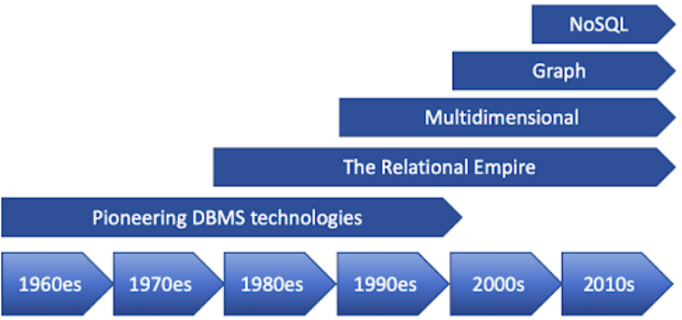
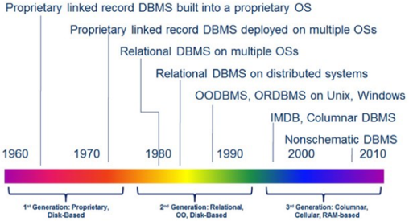
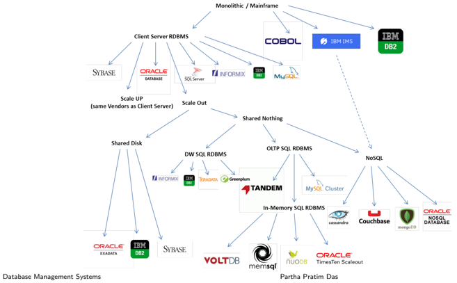

## Module 02

Partha Pratim Das

Objectives &amp; Outline

Evolution of Data Management

History

Module Summary

## Database Management Systems Module 02: Why DBMS?/1

## Partha Pratim Das

Department of Computer Science and Engineering Indian Institute of Technology, Kharagpur ppd@cse.iitkgp.ac.in

Partha Pratim Das

## Module 02

Partha Pratim Das

Objectives &amp; Outline

Evolution of Data Management

History

Module Summary

## Module Objectives

- To understand the need for a DBMS from historical perspective

## Module 02

Partha Pratim Das

Objectives &amp; Outline

Evolution of Data Management

History

Module Summary

## Module Outline

- Evolution of data management practices
- History of DBMS

## Module 02

Partha Pratim Das

Objectives &amp; Outline

Evolution of Data Management

History

Module Summary

## Evolution of Data Management

## Module 02

Partha Pratim Das

Objectives &amp; Outline

Evolution of Data Management

History

Module Summary

## Data Management

Management of Data or Records is a basic need for human society:

- Storage
- Retrieval
- Transaction
- Audit
- Archival

## For:

- Individual
- Small / Big Enterprise
- Global

There have been two major approaches in this practice:

- Physical
- Electronic

Database Management Systems

Module 02

Partha Pratim Das

Objectives &amp; Outline

Evolution of Data Management

History

Module Summary

## Data Management: Physical

Physical Data or Records management, more formally known as Book Keeping , has been using physical ledgers and journals for centuries.

The most significant development happened when Henry Brown, an American inventor, patented a 'receptacle for storing and preserving papers' on November 2, 1886.

Herman Hollerith adapted the punch cards used for weaving looms to act as the memory for a mechanical tabulating machine, in 1890.

## Module 02

Partha Pratim Das

Objectives &amp; Outline

Evolution of Data Management

History

Module Summary

## Data Management: Electronic

Electronic Data or Records management moves with the advances in technology especially of memory, storage, computing, and networking.

- 1950s: Computer Programming started
- 1960s: Data Management with punch card / tapes and magnetic tapes
- 1970s:
- COBOL and CODASYL approach was introduced in 1971
- On October 14 in 1979, Apple II platform shipped VisiCalc, marking the birth of the spreadsheet
- Magnetic disks became prevalent
- 1980s: RDBMS changed the face of data management
- 1990s: With Internet data management started becoming global
- 2000s: e-Commerce boomed, NoSQL was introduced for unstructured data management
- 2010s: Data Science started riding high

Database Management Systems

## Partha Pratim Das

Module 02

Partha Pratim Das

Objectives &amp; Outline

Evolution of Data Management

History

Module Summary

## Electronic Data Management Parameters

Electronic Data or Records management depends on various parameters including:

- Durability
- Scalability
- Security
- Retrieval
- Ease of Use
- Consistency
- Efficiency
- Cost
- ...

## Module 02

Partha Pratim Das

Objectives &amp; Outline

Evolution of Data Management

History

Module Summary

## Book Keeping

Recall how shop owners used to maintain their accounts.

A book register was maintained on which the shop owner wrote the amount received from customers, the amount due for any customer, inventory details and so on.

Problems with such an approach of book-keeping:

- Durability : Physical damage to these registers is a possibility due to rodents, humidity, wear and tear
- Scalability : Very difficult to maintain for many years, some shops have numerous registers spanning over years
- Security : Susceptible to tampering by outsiders
- Retrieval : Time consuming process to search for a previous entry
- Consistency : Prone to human errors

Not only small shops but large organizations also used to maintain their transaction details in book registers.

Database Management Systems

## Partha Pratim Das

Module 02

Partha Pratim Das

Objectives &amp; Outline

Evolution of Data Management

History

Module Summary

## Spreadsheet Files - A better solution

Spreadsheet Softwares like Google Sheets: Due to the disadvantages of maintaining ledger registers, organizations dealing with huge amount of data shifted to using spreadsheet softwares for maintaining their records in files.

- Durability : These are computer applications and hence data is less prone to physical damage.
- Scalability : Easier to search, insert and modify records as compared to book ledgers
- Security : Can be password-protected
- Easy of Use : Computer applications are used to search and manipulate records in the spreadsheets leading to reduction in manpower needed to perform routine computations
- Consistency : Not guaranteed but spreadsheets are less prone to mistakes than registers.

## Mostly useful for single user or small enterprise applications

Partha Pratim Das

## Module 02

Partha Pratim Das

Objectives &amp; Outline

Evolution of Data Management

History

Module Summary

## Why leave filesystems?

## Lack of efficiency in meeting growing needs

PPD

- With rapid scale up of data, there has been considerable increase in the time required to perform most operations.
- A typical spreadsheet file may have an upper limit on the number of rows.
- Ensuring consistency of data is a big challenge.
- No means to check violations of constraints in the face of concurrent processing.
- Unable to give different permissions to different people in a centralized manner.
- A system crash could be catastrophic.

The above limitations of filesystems paved the way for a comprehensive platform dedicated to management of data - the Database Management Systems .

Module 02

Partha Pratim Das

Objectives &amp; Outline

Evolution of Data Management

History

Module Summary

## History of DBMS

## History of DBMS

## Module 02

Partha Pratim Das

Objectives &amp; Outline

Evolution of Data Management

History

Module Summary

## History of Database Systems

- 1950s and early 1960s:
- Data processing using magnetic tapes for storage
- glyph[triangleright] Tapes provided only sequential access
- Punched cards for input
- Late 1960s and 1970s:
- Hard disks allowed direct access to data
- Network and hierarchical data models in widespread use
- Ted Codd defines the relational data model
- glyph[triangleright] Would win the ACM Turing Award for this work
- glyph[triangleright] IBM Research begins System R prototype
- glyph[triangleright] UC Berkeley begins Ingres prototype
- High-performance (for the era) transaction processing

## Module 02

Partha Pratim Das

Objectives &amp; Outline

Evolution of Data Management

History

Module Summary

## History (2)

- 1980s:
- Research relational prototypes evolve into commercial systems - SQL becomes industrial standard
- Parallel and distributed database systems
- Object-oriented database systems
- 1990s:
- Large decision support and data-mining applications
- Large multi-terabyte data warehouses
- Emergence of Web commerce
- Early 2000s:
- XML and XQuery standards
- Automated database administration
- Later 2000s:
- Giant data storage systems - Google BigTable, Yahoo PNuts, Amazon, . . .

Database Management Systems

Partha Pratim Das

Module 02

Partha Pratim

Das

Objectives &amp;

Outline

Evolution of Data

Management

History

Module Summary

## History (3): Evolution of Data Models

Database Management Systems

Partha Pratim Das

02.15

Module 02

Partha Pratim

Das

Objectives &amp;

Outline

Evolution of Data

Management

History

Module Summary

## History (4): Evolution of DB Technology

## Evolution of DBMS Technology and Usage

Database Management Systems

## Partha Pratim Das

Module 02

Partha Pratim

Das

Objectives &amp;

Outline

Evolution of Data

Management

History

Module Summary

## History (5): Evolution of DB Architecture

02.17

## Module 02

Partha Pratim Das

Objectives &amp; Outline

Evolution of Data Management

History

Module Summary

## Module Summary

- Walk through of evolution of Data and Records Management
- History of DBMS

Slides used in this presentation are borrowed from http://db-book.com/ with kind permission of the authors. Edited and new slides are marked with 'PPD'.