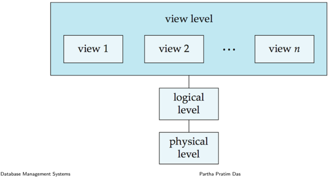
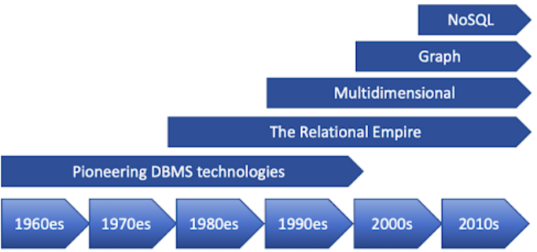
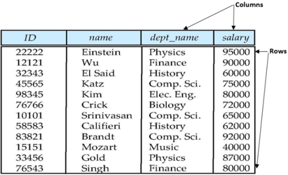

## Module 04

Partha Pratim Das

Objectives &amp; Outline

Levels of Abstraction

Schema and Instance

Data Models

DDL and DML

SQL

Database Design

Module Summary

## Database Management Systems

Module 04: Introduction to DBMS/1

## Partha Pratim Das

Department of Computer Science and Engineering Indian Institute of Technology, Kharagpur ppd@cse.iitkgp.ac.in

Partha Pratim Das

04.1

## Module 04

Partha Pratim Das

Objectives &amp; Outline

Levels of Abstraction

Schema and Instance

Data Models

DDL and DML

SQL

Database Design

Module Summary

## Module Recap

- Comparison of data management using Python &amp; files and DBMS
- Efficacy and Efficient DBMS highlighted

Module 04

Partha Pratim Das

Objectives &amp; Outline

Levels of Abstraction

Schema and Instance

Data Models

DDL and DML

SQL

Database Design

Module Summary

## Module Objectives

- To familiarize with the basic notions and terminology of database management systems
- To understand the role of data models and languages
- To understand the approaches to database design

## Module 04

Partha Pratim Das

Objectives &amp; Outline

Levels of Abstraction

Schema and Instance

Data Models

DDL and DML

SQL

Database Design

Module Summary

## Module Outline

- Levels of Abstraction
- Schema &amp; Instance
- Data Models
- Relational Databases
- DDL &amp; DML
- SQL
- Database Design

Module 04

Partha Pratim Das

Objectives &amp; Outline

Levels of Abstraction

Schema and Instance

Data Models

DDL and DML

SQL

Database Design

Module Summary

## Levels of Abstraction

## Module 04

Partha Pratim Das

Objectives &amp; Outline

Levels of Abstraction

Schema and

Instance

Data Models

DDL and DML

SQL

Database Design

Module Summary

## Levels of Abstraction

- Physical level: describes how a record (for example, instructor) is stored
- Logical level: describes data stored in database, and the relationships among the data fields

type instructor = record

ID

: string;

name :

string;

dept name :

string;

salary :

integer;

end;

- View level: application programs hide details of data types
- Views can also hide information (such as an employee's salary) for security purposes

Module 04

Partha Pratim

Das

Objectives &amp;

Outline

Levels of

Abstraction

Schema and

Instance

Data Models

DDL and DML

SQL

Database Design

Module Summary

## View of Data

## An architecture for a database system

Module 04

Partha Pratim Das

Objectives &amp; Outline

Levels of Abstraction

Schema and Instance

Data Models

DDL and DML

SQL

Database Design

Module Summary

## Schema and Instance

## Module 04

Partha Pratim Das

Objectives &amp; Outline

Levels of Abstraction

Schema and Instance

Data Models

DDL and DML

SQL

Database Design

Module Summary

## Schemas and Instances

- Similar to type of a variable and value of the variable at run-time in programming languages
- Schema
- Logical Schema - the overall logical structure of the database
- glyph[triangleright] Analogous to type information of a variable in a program
- glyph[triangleright] Example: The database consists of information about a set of customers and accounts in a bank and the relationship between them
- Physical Schema - the overall physical structure of the database

| glyph[triangleright]   | Customer Schema   | Customer ID            | Account #     | Aadhaar ID   | Mobile #   |
|------------------------|-------------------|------------------------|---------------|--------------|------------|
| glyph[triangleright]   | Account Schema    | Account # Account Type | Interest Rate | Min. Bal.    | Balance    |

## Module 04

Partha Pratim Das

Objectives &amp; Outline

Levels of Abstraction

Schema and Instance

Data Models

DDL and DML

SQL

Database Design

Module Summary

## Schemas and Instances

## · Instance

- The actual content of the database at a particular point in time
- Analogous to the value of a variable
- Customer Instance
- Account Instance

| Name        |   Customer ID |   Account # |   Aadhaar ID |   Mobile # |
|-------------|---------------|-------------|--------------|------------|
| Pavan Laha  |          6728 |      917322 | 182719289372 | 9830100291 |
| Lata Kala   |          8912 |      827183 | 918291204829 | 7189203928 |
| Nand Prabhu |          6617 |      372912 | 127837291021 | 8892021892 |

|   Account # | Account Type   | Interest Rate   | Min_ Bal.   |   Balance |
|-------------|----------------|-----------------|-------------|-----------|
|      917322 | Savings        | 4.09            | 5000        |      7812 |
|      372912 | Current        | 0.0%            |             |    291820 |
|      827183 | Term Deposit   |                 | 10000       |    100000 |

## Module 04

Partha Pratim Das

Objectives &amp; Outline

Levels of Abstraction

Schema and Instance

Data Models

DDL and DML

SQL

Database Design

Module Summary

## Schema and Instances

- Physical Data Independence - the ability to modify the physical schema without changing the logical schema
- Analogous to independence of Interface and Implementation in Object-Oriented Systems
- Applications depend on the logical schema
- In general, the interfaces between the various levels and components should be well defined so that changes in some parts do not seriously influence others.

## Module 04

Partha Pratim Das

Objectives &amp; Outline

Levels of Abstraction

Schema and Instance

Data Models

DDL and DML

SQL

Database Design

Module Summary

## Data Models

## Data Models

Module 04

Partha Pratim Das

Objectives &amp; Outline

Levels of Abstraction

Schema and Instance

Data Models

DDL and DML

SQL

Database Design

Module Summary

## Data Models

- A collection of tools for describing
- Data
- Data relationships
- Data semantics
- Data constraints
- Relational model (we focus in this course)
- Entity-Relationship data model (mainly for database design)
- Object-based data models (Object-oriented and Object-relational)
- Other older models
- Network model
- Hierarchical model
- Recent models for Semi-structured or Unstructured data
- Converted to easily manageable formats
- Content Addressable Storage (CAS) with metadata descriptors
- XML format.
- RDBMS which supports BLOBs
- Database Management Systems

Partha Pratim Das

04.13

Module 04

Partha Pratim

Das

Objectives &amp;

Outline

Levels of

Abstraction

Schema and

Instance

Data Models

DDL and DML

SQL

Database Design

Module Summary

## Data Models (2)

Database Management Systems

Partha Pratim Das

04.14

## Module 04

Partha Pratim Das

Objectives &amp; Outline

Levels of

Abstraction

Schema and

Instance

Data Models

DDL and DML

SQL

Database Design

Module Summary

## Relational Model

- All the data is stored in various tables
- Example of tabular data in the relational model

|                                                                            | name                                                                             | dept name                                                                                                 | Columns salary                                                          |
|----------------------------------------------------------------------------|----------------------------------------------------------------------------------|-----------------------------------------------------------------------------------------------------------|-------------------------------------------------------------------------|
| ID 22222 12121 32343 45565 98345 76766 10101 58583 83821 15151 33456 76543 | Einstein Wu El Said Katz Kim Crick Srinivasan Califieri Brandt Mozart Gold Singh | Physics Finance History Comp: Sci. Elec. Comp. Sci. History Comp: Sci. Music Physics Finance Eng; Biology | 95000 90000 60000 75000 80000 72000 65000 62000 92000 40000 87000 80000 |

## (a The instructor table

## Partha Pratim Das

## Module 04

Partha Pratim Das

Objectives &amp; Outline

Levels of

Abstraction

Schema and

Instance

Data Models

DDL and DML

SQL

Database Design

Module Summary

## A Sample Relational Database

|    ID | nane       | dept        | salary   |
|-------|------------|-------------|----------|
| 22222 | Einstein   | Physics     | 95000    |
| 12121 | Wu         | Finance     | 90OOO    |
| 32343 | El Said    | History     |          |
| 45565 | Katz       | Sci . Comp: | 75000    |
| 98345 | Kim        | Elec. Eng   | 8OOOO    |
| 76766 | Crick      | Biology     | 72000    |
| 10101 | Srinivasan | Comp. Sci.  | 65000    |
| 58583 | Califieri  | History     | 62000    |
| 83821 | Brandt     | Comp: Sci.  | 92000    |
| 15151 | Mozart     | Music       | 40000    |
| 33456 | Gold       | Physics     | 87000    |
| 76543 | Singh      | Finance     |          |

(a) The instructor table

| dept namC   | building   | budget   |
|-------------|------------|----------|
| Comp. Sci.  | Taylor     |          |
| Biology     | Watson     | 9000O    |
| Elec.       | Taylor     | 85000    |
| Music       | Packard    |          |
| Finance     | Painter    | 120000   |
| History     | Painter    | 50000    |
| Physics     | Watson     | 70000    |

Partha Pratim Das

## Module 04

Partha Pratim Das

Objectives &amp; Outline

Levels of Abstraction

Schema and Instance

Data Models

DDL and DML

SQL

Database Design

Module Summary

## DDL and DML

## DDL and DML

## Module 04

Partha Pratim Das

Objectives &amp; Outline

Levels of Abstraction

Schema and

Instance

Data Models

DDL and DML

SQL

Database Design

Module Summary

## Data Definition Language (DDL)

- Specification notation for defining the database schema
- Example:

(20),

- create table instructor ( ID char (5), name varchar (20), dept name varchar salary numeric (8,2))
- DDL compiler generates a set of table templates stored in a data dictionary
- Data dictionary contains metadata (that is, data about data)
- Database schema
- Integrity constraints
- glyph[triangleright] Primary key (ID uniquely identifies instructors)
- Authorization
- glyph[triangleright] Who can access what

Partha Pratim Das

Module 04

Partha Pratim Das

Objectives &amp; Outline

Levels of Abstraction

Schema and Instance

Data Models

DDL and DML

SQL

Database Design

Module Summary

## Data Manipulation Language (DML)

- Language for accessing and manipulating the data organized by the appropriate data model
- DML: also known as Query Language
- Two classes of languages
- Pure - used for proving properties about computational power and for optimization
- glyph[triangleright] Relational Algebra (we focus in this course)
- glyph[triangleright] Tuple relational calculus
- glyph[triangleright] Domain relational calculus
- Commercial - used in commercial systems
- glyph[triangleright] SQL is the most widely used commercial language

## Module 04

Partha Pratim Das

Objectives &amp; Outline

Levels of Abstraction

Schema and Instance

Data Models

DDL and DML

SQL

Database Design

Module Summary

SQL

## Module 04

Partha Pratim Das

Objectives &amp; Outline

Levels of Abstraction

Schema and Instance

Data Models

DDL and DML

SQL

Database Design

Module Summary

- The most widely used commercial language
- SQL is NOT a Turing Machine equivalent language
- Cannot be used to solve all problems that a C program, for example, can solve
- To be able to compute complex functions, SQL is usually embedded in some higher-level language
- Application programs generally access databases through one of
- Language extensions to allow embedded SQL
- Application Programming Interface or API (for example, ODBC/JDBC) which allow SQL queries to be sent to a database

Module 04

Partha Pratim Das

Objectives &amp; Outline

Levels of Abstraction

Schema and Instance

Data Models

DDL and DML

SQL

Database Design

Module Summary

## Database Design

## Database Design

## Module 04

Partha Pratim Das

Objectives &amp; Outline

Levels of Abstraction

Schema and Instance

Data Models

DDL and DML

SQL

Database Design

Module Summary

## Database Design

The process of designing the general structure of the database:

- Logical Design - Deciding on the database schema. Database design requires that we find a good collection of relation schema
- Business decision
- glyph[triangleright] What attributes should we record in the database?
- Computer Science decision
- glyph[triangleright] What relation schemas should we have and how should the attributes be distributed among the various relation schemas?
- Physical Design - Deciding on the physical layout of the database

## Module 04

Partha Pratim

Das

Objectives &amp;

Outline

Levels of

Abstraction

Schema and

Instance

Data Models

DDL and DML

SQL

Database Design

Module Summary

## Database Design (2)

## · Is there any problem with this relation?

| ID                                                                      | name                                                                             | salary                                                                  | dept_name                                                                                           | building                                                                                 | budget                                                                       |
|-------------------------------------------------------------------------|----------------------------------------------------------------------------------|-------------------------------------------------------------------------|-----------------------------------------------------------------------------------------------------|------------------------------------------------------------------------------------------|------------------------------------------------------------------------------|
| 22222 12121 32343 45565 98345 76766 10101 58583 83821 15151 33456 76543 | Einstein Wu El Said Katz Kim Crick Srinivasan Califieri Brandt Mozart Gold Singh | 95000 90000 60000 75000 80000 72000 65000 62000 92000 40000 87000 80000 | Physics Finance History Sci. Elec. Sci. History Sci Music Physics Finance Comp. Biology Comp. Comp- | Watson Painter Painter Taylor Taylor Watson Taylor Painter Taylor Packard Watson Painter | 70000 120000 50000 100000 85000 90000 100000 50000 100000 80000 70000 120000 |

Module 04

Partha Pratim Das

Objectives &amp; Outline

Levels of Abstraction

Schema and Instance

Data Models

DDL and DML

SQL

Database Design

Module Summary

## Module Summary

- Familiarized with the basic notions and terminology of database management systems
- Introduced the role of data models and languages
- Introduced the approaches to database design

Slides used in this presentation are borrowed from http://db-book.com/ with kind permission of the authors.

Edited and new slides are marked with 'PPD'.

Database Management Systems

Partha Pratim Das

04.25