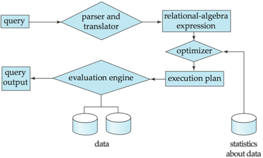
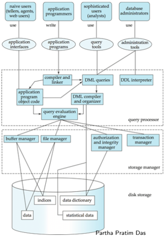
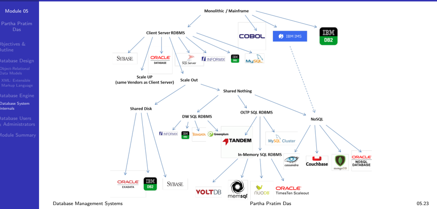
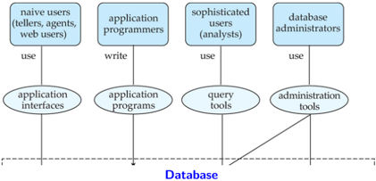

## Module 05

Partha Pratim Das

Objectives &amp; Outline

Database Design Object-Relational Data Models XML: Extensible Markup Language

Database Engine Database System Internals

Database Users &amp; Administrators

Module Summary

Database Management Systems

## Database Management Systems

Module 05: Introduction to DBMS/2

## Partha Pratim Das

Department of Computer Science and Engineering Indian Institute of Technology, Kharagpur ppd@cse.iitkgp.ac.in

Partha Pratim Das

05.1

## Module 05

Partha Pratim Das

## Objectives &amp; Outline

Database Design Object-Relational Data Models XML: Extensible Markup Language

Database Engine Database System Internals

Database Users &amp; Administrators

Module Summary

## Module Recap

- Basic notions and terminology of database management systems
- Role of data models and languages
- Approaches to database design

## Module 05

Partha Pratim Das

## Objectives &amp; Outline

Database Design Object-Relational Data Models XML: Extensible Markup Language

Database Engine Database System Internals

Database Users &amp; Administrators

Module Summary

## Module Objectives

- To understand models of database management systems
- To familiarize with major components of a database engine
- To familiarize with database internals and architecture
- To understand the historical perspective

## Module 05

Partha Pratim Das

## Objectives &amp; Outline

Database Design Object-Relational

Data Models

XML: Extensible Markup Language

Database Engine Database System Internals

Database Users &amp; Administrators

Module Summary

## Module Outline

- Database Design
- OO Relational Model
- XML
- Database Engine
- Storage Management
- Query Processing
- Transaction Management
- Database Internals and Architecture
- Database Users and Administrators

## Module 05

Partha Pratim Das

Objectives &amp; Outline

Database Design

Object-Relational

Data Models

XML: Extensible Markup Language

Database Engine Database System Internals

Database Users &amp; Administrators

Module Summary

## Database Design

## Database Design

## Module 05

Partha Pratim Das

Objectives &amp; Outline

## Database Design

Object-Relational Data Models

XML: Extensible Markup Language

Database Engine Database System Internals

Database Users &amp; Administrators

Module Summary

## Database Design

The process of designing the general structure of the database:

- Logical Design
- Deciding on the database schema. Database design requires that we find a good collection of relation schema
- Business decision
- glyph[triangleright] What attributes should we record in the database?
- Computer Science decision
- glyph[triangleright] What relation schemas should we have and how should the attributes be distributed among the various relation schemas?
- Physical Design
- Deciding on the physical layout of the database

## Module 05

Partha Pratim

Das

Objectives &amp;

Outline

Database Design

Object-Relational

Data Models

XML: Extensible

Markup Language

Database Engine

Database System

Internals

Database Users

&amp; Administrators

Module Summary

## Database Design (2)

## · Is there any problem with this relation?

| ID                                                                      | name                                                                             | salary                                                                  | dept_name                                                                                           | building                                                                                 | budget                                                                       |
|-------------------------------------------------------------------------|----------------------------------------------------------------------------------|-------------------------------------------------------------------------|-----------------------------------------------------------------------------------------------------|------------------------------------------------------------------------------------------|------------------------------------------------------------------------------|
| 22222 12121 32343 45565 98345 76766 10101 58583 83821 15151 33456 76543 | Einstein Wu El Said Katz Kim Crick Srinivasan Califieri Brandt Mozart Gold Singh | 95000 90000 60000 75000 80000 72000 65000 62000 92000 40000 87000 80000 | Physics Finance History Sci. Elec. Comp. Sci. History Comp. Sci Music Physics Finance Comp. Biology | Watson Painter Painter Taylor Taylor Watson Taylor Painter Taylor Packard Watson Painter | 70000 120000 50000 100000 85000 90000 100000 50000 100000 80000 70000 120000 |

## Partha Pratim Das

## Module 05

Partha Pratim Das

Objectives &amp;

Outline

Database Design

Object-Relational

Data Models

XML: Extensible

Markup Language

Database Engine

Database System

Internals

Database Users &amp; Administrators

Module Summary

## Database Design (3)

|    ID | nane       | dept        | salary   |
|-------|------------|-------------|----------|
| 22222 | Einstein   | Physics     | 95000    |
| 12121 | Wu         | Finance     | 90OOO    |
| 32343 | El Said    | History     |          |
| 45565 | Katz       | Sci . Comp: | 75000    |
| 98345 | Kim        | Elec. Eng   | 8OOOO    |
| 76766 | Crick      | Biology     | 72000    |
| 10101 | Srinivasan | Comp. Sci.  | 65000    |
| 58583 | Califieri  | History     | 62000    |
| 83821 | Brandt     | Comp: Sci.  | 92000    |
| 15151 | Mozart     | Music       | 40000    |
| 33456 | Gold       | Physics     | 87000    |
| 76543 | Singh      | Finance     |          |

- (a) The instructor table

| dept namC   | building   | budget   |
|-------------|------------|----------|
| Comp. Sci.  | Taylor     |          |
| Biology     | Watson     | 9000O    |
| Elec.       | Taylor     | 85000    |
| Music       | Packard    |          |
| Finance     | Painter    | 120000   |
| History     | Painter    | 50000    |
| Physics     | Watson     | 70000    |

Partha Pratim Das

## Module 05

Partha Pratim Das

Objectives &amp; Outline

## Database Design

Object-Relational Data Models

XML: Extensible Markup Language

Database Engine Database System Internals

Database Users &amp; Administrators

Module Summary

## Design Approaches

- Need to come up with a methodology to ensure that each relations in the database is good
- Two ways of doing so:
- Entity Relationship Model (Chapter 7)
- glyph[triangleright] Models an enterprise as a collection of entities and relationships
- glyph[triangleright] Represented diagrammatically by an entity-relationship diagram
- Normalization Theory (Chapter 8)
- glyph[triangleright] Formalize what designs are bad, and test for them

Module 05

Partha Pratim Das

Objectives &amp; Outline

Database Design

Object-Relational Data Models

XML: Extensible Markup Language

Database Engine Database System Internals

Database Users &amp; Administrators

Module Summary

## Object-Relational Data Models

## Object-Relational Data Models

## Module 05

Partha Pratim Das

Objectives &amp; Outline

Database Design

Object-Relational Data Models

XML: Extensible Markup Language

Database Engine Database System Internals

Database Users &amp; Administrators

Module Summary

## Object-Relational Data Models

- Relational model: flat, atomic values
- Object Relational Data Models
- Extend the relational data model by including object orientation and constructs to deal with added data types
- Allow attributes of tuples to have complex types, including non-atomic values such as nested relations
- Preserve relational foundations, in particular the declarative access to data, while extending modeling power
- Provide upward compatibility with existing relational languages

Module 05

Partha Pratim Das

Objectives &amp; Outline

Database Design Object-Relational Data Models

XML: Extensible Markup Language

Database Engine Database System Internals

Database Users &amp; Administrators

Module Summary

## XML: Extensible Markup Language

## XML: Extensible Markup Language

## Module 05

Partha Pratim Das

Objectives &amp; Outline

Database Design Object-Relational Data Models

XML: Extensible Markup Language

Database Engine Database System Internals

Database Users &amp; Administrators

Module Summary

## XML: Extensible Markup Language

- Defined by the WWW Consortium (W3C)
- Originally intended as a document markup language not a database language
- The ability to specify new tags, and to create nested tag structures made XML a great way to exchange data, not just documents
- XML has become the basis for all new generation data interchange formats
- A wide variety of tools is available for parsing, browsing and querying XML documents/data

## Module 05

Partha Pratim Das

Objectives &amp; Outline

Database Design

Object-Relational

Data Models

XML: Extensible

Markup Language

Database Engine

Database System Internals

Database Users &amp; Administrators

Module Summary

## Database Engine

## Database Engine

## Module 05

Partha Pratim Das

Objectives &amp; Outline

Database Design Object-Relational Data Models XML: Extensible Markup Language

Database Engine

Database System Internals

Database Users &amp; Administrators

Module Summary

## Database Engine

- Storage manager
- Query processing
- Transaction manager

## Module 05

Partha Pratim Das

Objectives &amp; Outline

Database Design

Object-Relational Data Models XML: Extensible Markup Language

## Database Engine

Database System Internals

Database Users &amp; Administrators

Module Summary

## Storage Management

- Storage manager is a program module that provides the interface between the low-level data stored in the database and the application programs and queries submitted to the system
- The storage manager is responsible to the following tasks:
- Interaction with the OS file manager
- Efficient storing, retrieving and updating of data
- Issues:
- Storage access
- File organization
- Indexing and hashing

Module 05

Partha Pratim

Das

Objectives &amp;

Outline

Database Design

Object-Relational

Data Models

XML: Extensible

Markup Language

Database Engine

Database System

Internals

Database Users

&amp; Administrators

Module Summary

## Query Processing

- a) Parsing and translation
- b) Optimization
- c) Evaluation

Database Management Systems

Partha Pratim Das

## Module 05

Partha Pratim Das

Objectives &amp; Outline

Database Design

Object-Relational Data Models XML: Extensible Markup Language

Database Engine

Database System Internals

Database Users &amp; Administrators

Module Summary

## Query Processing (2)

- Alternative ways of evaluating a given query
- Equivalent expressions
- Different algorithms for each operation
- Cost difference between a good and a bad way of evaluating a query can be enormous
- Need to estimate the cost of operations
- Depends critically on statistical information about relations which the database must maintain
- Need to estimate statistics for intermediate results to compute cost of complex expressions

## Module 05

Partha Pratim Das

Objectives &amp; Outline

Database Design Object-Relational Data Models XML: Extensible Markup Language

Database Engine

Database System Internals

Database Users &amp; Administrators

Module Summary

## Transaction Management

- What if the system fails?
- What if more than one user is concurrently updating the same data?
- A transaction is a collection of operations that performs a single logical function in a database application
- Transaction-management component ensures that the database remains in a consistent (correct) state despite system failures (e.g., power failures and operating system crashes) and transaction failures.
- Concurrency-control manager controls the interaction among the concurrent transactions, to ensure the consistency of the database.

## Module 05

Partha Pratim Das

Objectives &amp; Outline

Database Design

Object-Relational

Data Models

XML: Extensible Markup Language

Database Engine

Database System Internals

Database Users &amp; Administrators

Module Summary

## Database System Internals

## Database System Internals

Module 05

Partha Pratim

Das

Objectives &amp;

Outline

Database Design

Object-Relational

Data Models

XML: Extensible

Markup Language

Database Engine

Database System

Internals

Database Users

&amp; Administrators

Module Summary

## Database System Internals

Database Management Systems

## Module 05

Partha Pratim Das

Objectives &amp; Outline

Database Design

Object-Relational Data Models

XML: Extensible Markup Language

Database Engine

Database System Internals

Database Users &amp; Administrators

Module Summary

## Database Architecture

The architecture of a database system is greatly influenced by the underlying computer system on which the database is running:

- Centralized
- Client-server
- Parallel (multi-processor)
- Distributed
- Cloud

## Database Architecture (2)

## Module 05

Partha Pratim Das

Objectives &amp; Outline

Database Design

Object-Relational

Data Models

XML: Extensible

Markup Language

Database Engine Database System Internals

Database Users &amp; Administrators

Module Summary

## Database Users and Administrators

Module 05

Partha Pratim

Das

Objectives &amp;

Outline

Database Design

Object-Relational

Data Models

XML: Extensible

Markup Language

Database Engine

Database System

Internals

Database Users

&amp; Administrators

Module Summary

## Database Users and Administrators

## Module 05

Partha Pratim Das

Objectives &amp; Outline

Database Design Object-Relational Data Models XML: Extensible Markup Language

Database Engine Database System Internals

Database Users &amp; Administrators

Module Summary

## Module Summary

- Introduced models of database management systems
- Familiarized with major components of a database engine
- Familiarized with database internals and architecture

Slides used in this presentation are borrowed from http://db-book.com/ with kind permission of the authors.

Edited and new slides are marked with 'PPD'.

Database Management Systems

Partha Pratim Das

05.26