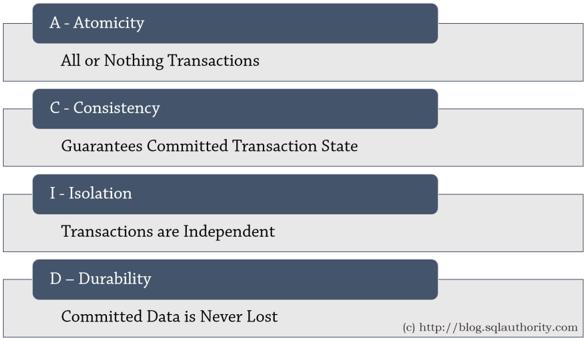
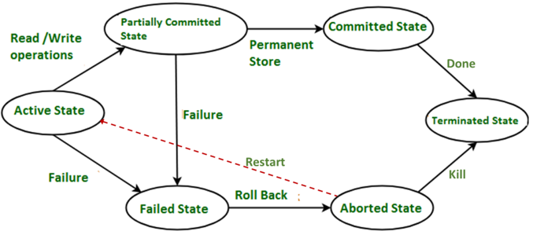
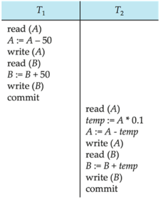
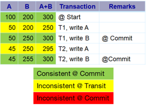
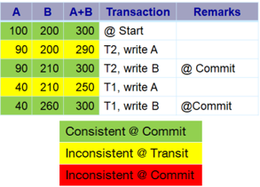

## Module 46

Partha Pratim Das

Week Recap

Objectives &amp;

Outline

Transaction Concept

ACID

Transaction

States

State Transition Diagram

Concurrent

Executions

Schedules

Example

Module Summary

Database Management Systems

## Database Management Systems Module 46: Transactions/1

## Partha Pratim Das

Department of Computer Science and Engineering Indian Institute of Technology, Kharagpur ppd@cse.iitkgp.ac.in

Partha Pratim Das

## Module 46

Partha Pratim Das

Week Recap

Objectives &amp; Outline

Transaction Concept

ACID

Transaction States

State Transition Diagram

Concurrent Executions

Schedules

Example

Module Summary

## Week Recap

- Need for indexing database tables
- Understood the ordered indexes
- Recap of Balanced BST for optimal in-memory search data structures
- Issues of external search data structures for persistent data
- Explored 2-3-4 Tree as a precursor to B/B+-Tree
- Understood the B + Tree and B Tree for Index files and data files
- Explored Static and Dynamic Hashing
- Compared Ordered Indexing and Hashing
- Studied the use of Bitmap Indices
- Learnt to create indexes in SQL
- Learnt a set of Ground Rules for Indexing

## Module 46

Partha Pratim Das

Week Recap

Objectives &amp; Outline

Transaction Concept

ACID

Transaction States

State Transition Diagram

Concurrent Executions

Schedules

Example

Module Summary

## Module Objectives

- To understand the concept of transaction - 'doing a task in a database' and its state
- To explore issues in concurrent execution of transactions

## Module 46

Partha Pratim Das

Week Recap

Objectives &amp; Outline

Transaction Concept

ACID

Transaction States

State Transition Diagram

Concurrent Executions

Schedules

Example

Module Summary

## Module Outline

- Transaction Concept
- Transaction State
- Concurrent Executions

Module 46

Partha Pratim Das

Week Recap

Objectives &amp; Outline

Transaction Concept

ACID

Transaction States

State Transition Diagram

Concurrent

Executions

Schedules

Example

Module Summary

## Transaction Concept

## Transaction Concept

## Module 46

Partha Pratim Das

Week Recap

Objectives &amp; Outline

Transaction Concept

ACID

Transaction States

State Transition Diagram

Concurrent

Executions

Schedules

Example

Module Summary

## Transaction Concept

- A transaction is a unit of program execution that accesses and, possibly updates, various data items
- For example, transaction to transfer $ 50 from account A to account B:
1. read ( A )
2. A := A -50

3. write ( A )

4. read ( B )
5. B := B +50
6. write ( B )
- Two main issues to deal with:
- Failures of various kinds, such as hardware failures and system crashes
- Concurrent execution of multiple transactions

## Module 46

Partha Pratim Das

Week Recap

Objectives &amp; Outline

Transaction Concept

ACID

Transaction States

State Transition Diagram

Concurrent Executions

Schedules

Example

Module Summary

## Required Properties of a Transaction: ACID: Atomicity

## · Atomicity Requirement

- If the transaction fails after step 3 and before step 6, money will be 'lost' leading to an inconsistent database state
- glyph[triangleright] Failure could be due to software or hardware
- The system should ensure that updates of a partially executed transaction are not reflected in the database

Transaction to transfer $ 50 from account A to account B:

1. read ( A )

2. A := A - 50

3. write ( A )

4. read ( B )

5. B := B +50

6. write ( B )

Module 46

Partha Pratim Das

Week Recap

Objectives &amp; Outline

Transaction Concept

ACID

Transaction States

State Transition Diagram

Concurrent

Executions

Schedules

Example

Module Summary

## Required Properties of a Transaction: ACID: Consistency

## · Consistency Requirement

- A + B must be unchanged by the execution of the transaction
- In general, consistency requirements include
- glyph[triangleright] Explicitly specified integrity constraints
- -primary keys and foreign keys
- glyph[triangleright] Implicit integrity constraints
- -sum of balances of all accounts, minus sum of loan amounts must equal value of cash-in-hand
- A transaction, when starting to execute, must see a consistent database
- During transaction execution the database may be temporarily inconsistent
- When the transaction completes successfully the database must be consistent
- glyph[triangleright] Erroneous transaction logic can lead to inconsistency

Partha Pratim Das

Transaction to transfer $ 50 from account A to account B:

1. read (A)
2. A := A - 50
3. write (A)
4. read (B)
5. B := B + 50
6. write (B)

Module 46

Partha Pratim

Das

Week Recap

Objectives &amp;

Outline

Transaction

Concept

ACID

Transaction

States

State Transition

Diagram

Concurrent

Executions

Schedules

Example

Module Summary

## Required Properties of a Transaction: ACID: Isolation

## · Isolation Requirement

- If between steps 3 and 6 (of the fund transfer transaction), another transaction T2 is allowed to access the partially updated database, it will see an inconsistent database (the sum A + B will be less than it should be)

T1

T2

1.

2.

3.

4.

5.

read

(

A

A

:=

A

write

)

-

(

A

read

(

B

:=

B

)

)

B

+50

6.

write

(

B

)

- Isolation can be ensured trivially by running transactions serially
- glyph[triangleright] That is, one after the other
- However, executing multiple transactions concurrently has significant benefits

Database Management Systems

Partha Pratim Das

50

read ( A ), read ( B ), print ( A + B )

## Module 46

Partha Pratim Das

Week Recap

Objectives &amp; Outline

Transaction Concept

ACID

Transaction States

- State Transition Diagram

Concurrent Executions

Schedules

Example

Module Summary

## Required Properties of a Transaction: ACID: Durability

## · Durability Requirement

Transaction to transfer $ 50 from account A to account B:

- Once the user has been notified that the transaction has completed (that is, the transfer of the $ 50 has taken place), the updates to the database by the transaction must persist even if there are software or hardware failures

1. read (A)

2. A := A - 50

3. write (A)

4. read (B)

5. B := B + 50

6. write (B)

Module 46

Partha Pratim Das

Week Recap

Objectives &amp; Outline

Transaction Concept

ACID

Transaction States

State Transition Diagram

Concurrent Executions

Schedules

Example

Module Summary

## ACID Properties

A transaction is a unit of program execution that accesses and possibly updates various data items:

- Atomicity: Atomicity guarantees that each transaction is treated as a single unit , which either succeeds completely, or fails completely
- If any of the statements constituting a transaction fails to complete, the entire transaction fails and the database is left unchanged
- Atomicity must be guaranteed in every situation, including power failures, errors and crashes
- Consistency: Consistency ensures that a transaction can only bring the database from one valid state to another, maintaining database invariants
- Any data written to the database must be valid according to all defined rules, including constraints, cascades, triggers, and any combination thereof
- Isolation: Transactions are often executed concurrently (multiple transactions reading and writing to a table at the same time)
- Isolation ensures that concurrent execution of transactions leaves the database in the same state that would have been obtained if the transactions were executed sequentially
- Durability: Durability guarantees that once a transaction has been committed, it will remain committed even in the case of a system failure (like power outage or crash)
- This usually means that completed transactions (or their effects) are recorded in non-volatile memory

Database Management Systems

Partha Pratim Das

46.11

Module 46

Partha Pratim

Das

Week Recap

Objectives &amp;

Outline

Transaction

Concept

ACID

Transaction

States

State Transition

Diagram

Concurrent

Executions

Schedules

Example

Module Summary

## ACID Properties: Quick Reckoner

Database Management Systems

Partha Pratim Das

Module 46

Partha Pratim Das

Week Recap

Objectives &amp; Outline

Transaction Concept

ACID

Transaction States

State Transition Diagram

Concurrent

Executions

Schedules

Example

Module Summary

## Transaction States

## Transaction States

## Module 46

Partha Pratim Das

Week Recap

Objectives &amp; Outline

Transaction Concept

ACID

Transaction States

State Transition Diagram

Concurrent Executions

Schedules

Example

Module Summary

## Transaction States

- Every transaction can be in one of the following states (like Process States in OS)
- Active
- glyph[triangleright] The initial state; the transaction stays in this state while it is executing
- Partially committed
- glyph[triangleright] After the final statement has been executed
- Failed
- glyph[triangleright] After the discovery that normal execution can no longer proceed
- Aborted
- glyph[triangleright] After the transaction has been rolled back and the database restored to its state prior to the start of the transaction. Two options after it has been aborted:
- -Restart the transaction: Can be done only if no internal logical error
- -Kill the transaction
- Committed
- glyph[triangleright] After successful completion
- Terminated
- glyph[triangleright] After it has been committed or aborted (killed) Database Management Systems Partha Pratim Das

Module 46

Partha Pratim

Das

Week Recap

Objectives &amp;

Outline

Transaction

Concept

ACID

Transaction

States

State Transition

Diagram

Concurrent

Executions

Schedules

Example

Module Summary

## Transitions for Transaction States

Database Management Systems

Partha Pratim Das

Module 46

Partha Pratim Das

Week Recap

Objectives &amp; Outline

Transaction Concept

ACID

Transaction

States

State Transition Diagram

Concurrent Executions

Schedules

Example

Module Summary

## Concurrent Executions

## Module 46

Partha Pratim Das

Week Recap

Objectives &amp; Outline

Transaction Concept ACID

Transaction States

State Transition Diagram

Concurrent Executions

Schedules

Example

Module Summary

## Concurrent Executions

- Multiple transactions are allowed to run concurrently in the system. Advantages are:
- Increased processor and disk utilization , leading to better transaction throughput
- glyph[triangleright] For example, one transaction can be using the CPU while another is reading from or writing to the disk
- Reduced average response time for transactions: short transactions need not wait behind long ones
- Concurrency Control Schemes : Mechanisms to achieve isolation
- To control the interaction among the concurrent transactions in order to prevent them from destroying the consistency of the database

## Module 46

Partha Pratim Das

Week Recap

Objectives &amp; Outline

Transaction Concept ACID

Transaction States

State Transition Diagram

Concurrent Executions

Schedules

Example

Module Summary

## Schedules

- Schedule : A sequence of instructions that specify the chronological order in which instructions of concurrent transactions are executed
- A schedule for a set of transactions must consist of all instructions of those transactions
- Must preserve the order in which the instructions appear in each individual transaction
- A transaction that successfully completes its execution will have a commit instructions as the last statement
- By default transaction assumed to execute commit instruction as its last step
- A transaction that fails to successfully complete its execution will have an abort instruction as the last statement

Module 46

Partha Pratim

Das

Week Recap

Objectives &amp;

Outline

Transaction

Concept

ACID

Transaction

States

State Transition

Diagram

Concurrent

Executions

Schedules

Example

Module Summary

## Schedule 1

- Let T 1 transfer $ 50 from A to B , and T 2 transfer 10% of the balance from A to B
- An example of a serial schedule in which T 1 is followed by T 2 :

## Database Management Systems

## Partha Pratim Das

Module 46

Partha Pratim

Das

Week Recap

Objectives &amp;

Outline

Transaction

Concept

ACID

Transaction

States

State Transition

Diagram

Concurrent

Executions

Schedules

Example

Module Summary

## Schedule 2

- A serial schedule in which T 2 is followed by T 1 :

T1

Tz read (A)

temp

A* 0.1

A : A - temp write (A)

read (B)

B := B + temp commit

write (B)

read (A)

write (A)

read (B)

B:= B+ 50

write (B)

commit

## Database Management Systems

Values of A &amp; B are different from Schedule 1 - yet consistent

| IIT Madras BSc Degree       | Schedule 3                                                                                                    |                                          |                    |                              |                                 |     |                        |                     |         | PPD    |
|-----------------------------|---------------------------------------------------------------------------------------------------------------|------------------------------------------|--------------------|------------------------------|---------------------------------|-----|------------------------|---------------------|---------|--------|
| Module 46 Partha Pratim Das | • Let T 1 and T 2 be the transactions defined previously. serial schedule, but it is equivalent to Schedule 1 |                                          |                    |                              | The following schedule is not a |     |                        |                     |         |        |
| Week Recap                  | Schedule 3 Tz                                                                                                 | Objectives &                             | Schedule 1 T1      |                              |                                 |     |                        |                     |         |        |
| Outline Transaction Concept | read (A) write (A)                                                                                            | ACID Transaction States State Transition | read (A) write (A) |                              | 100                             | 200 | A+B 300                | Transaction Start   | Remarks |        |
|                             | read (A)                                                                                                      |                                          | read (B)           | read (A)                     | 50                              | 200 | 250                    | T1, write A         |         |        |
|                             | temp : = A* 0.1                                                                                               |                                          | B:= B + 50         |                              | 45                              | 200 | 245                    | T2, write A         |         |        |
|                             | A:= A - temp                                                                                                  |                                          | write (B)          |                              |                                 |     |                        | T1, write B         |         | Commit |
|                             |                                                                                                               |                                          | commit             |                              | 45                              |     |                        |                     |         |        |
| Diagram                     | write (A) read (B)                                                                                            | Concurrent                               |                    |                              | 45                              | 255 | 300                    | T2, write B         |         | Commit |
| Executions                  | B:= B + 50 write (B)                                                                                          | Schedules Example Module Summary         |                    | temp := A * 0.1 A:= A - temp |                                 |     |                        | Consistent @ Commit |         |        |
|                             | commit                                                                                                        |                                          |                    | write (A) read (B) B := B+   |                                 |     | Inconsistent @ Transit |                     |         |        |
|                             |                                                                                                               |                                          |                    | temp                         |                                 |     |                        |                     |         |        |
|                             |                                                                                                               |                                          |                    | write (B) commit             |                                 |     |                        |                     |         |        |
|                             | Note - In schedules 1, 2 and 3, the sum '                                                                     |                                          |                    | A + B ' is preserved         |                                 |     |                        |                     |         |        |
|                             | Database Management Systems                                                                                   |                                          |                    |                              |                                 |     |                        |                     |         |        |
|                             |                                                                                                               |                                          |                    | Partha Pratim Das            |                                 |     |                        |                     |         |        |
|                             |                                                                                                               |                                          |                    |                              |                                 |     |                        |                     |         | 46.21  |

Module 46

Partha Pratim

Das

Week Recap

Objectives &amp;

Outline

Transaction

Concept

ACID

Transaction

States

State Transition

Diagram

Concurrent

Executions

Schedules

Example

Module Summary

## Schedule 4

- The following concurrent schedule does not preserve the sum of ' A + B '

T1

read (A)

write (A)

read (B)

B:= B + 50

write (B)

commit

## Database Management Systems

|     |         | A+B | Transaction   | Remarks   |
|-----|---------|---------------------|-----------|
| 100 | 200     | 300 @ Start         |           |
| 90  | 200     |                     |           |
|     | 50| 200 | 250/T1, write A     |           |
| 50  | 250     | 300/T1, write B     | Commit    |
|     |         | 260T2, write B      | Commit    |

Consistent @ Commit

Inconsistent @ Transit read (A)

A:=A - temp : = A * 0.1

write (A)

temp read (B)

B== B + temp commit

write (B)

## Partha Pratim Das

## Module 46

Partha Pratim Das

Week Recap

Objectives &amp; Outline

Transaction Concept ACID

Transaction

States

State Transition Diagram

Concurrent

Executions

Schedules

Example

Module Summary

## Module Summary

- A task in a database is done as a transaction that passes through several states
- Transactions are executed in concurrent fashion for better throughput
- Concurrent execution of transactions raise serializability issues that need to be addressed
- All schedules may not satisfy ACID properties

Slides used in this presentation are borrowed from http://db-book.com/ with kind permission of the authors. Edited and new slides are marked with 'PPD'.