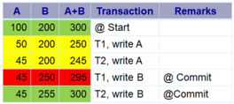
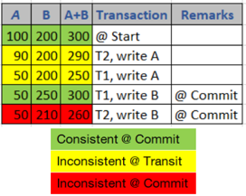
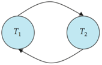
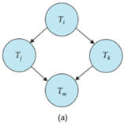
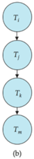
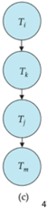
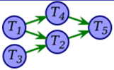

## Module 47

Partha Pratim Das

Objectives &amp; Outline

Serializability Conflicting Instructions

Conflict Serializability

Examples

Precedence Graph

Tests

Module Summary

## Database Management Systems

Module 47: Transactions/2: Serializability

## Partha Pratim Das

Department of Computer Science and Engineering Indian Institute of Technology, Kharagpur ppd@cse.iitkgp.ac.in

Partha Pratim Das

## Module 47

Partha Pratim Das

## Objectives &amp; Outline

Serializability Conflicting Instructions

Conflict Serializability

Examples

Precedence Graph

Tests

Module Summary

## Module Recap

- A task in a database is done as a transaction that passes through several states
- Transactions are executed in concurrent fashion for better throughput
- Concurrent execution of transactions raise serializability issues that need to be addressed
- All schedules may not satisfy ACID properties

Module 47

Partha Pratim Das

Objectives &amp; Outline

Serializability Conflicting Instructions

Conflict Serializability

Examples

Precedence Graph

Tests

Module Summary

## Module Objectives

- To understand the issues that arise when two or more transactions work concurrently
- To introduce the notions of Serializability that ensure schedules for transactions that may run in concurrent fashion but still guarantee and serial behavior
- To analyze the conditions, called conflicts, that need to be honored to attain Serializable schedules

## Module 47

Partha Pratim Das

Objectives &amp; Outline

Serializability Conflicting Instructions

Conflict Serializability

Examples

Precedence Graph

Tests

Module Summary

## Module Outline

- Serializability
- Conflict Serializability

Module 47

Partha Pratim Das

Objectives &amp; Outline

Serializability

Conflicting

Instructions

Conflict Serializability

Examples

Precedence Graph

Tests

Module Summary

## Serializability

## Serializability

## Module 47

Partha Pratim Das

Objectives &amp; Outline

Serializability

Conflicting Instructions

Conflict Serializability

Examples

Precedence Graph

Tests

Module Summary

## Serializability

- Assumption : Each transaction preserves database consistency
- Thus, serial execution of a set of transactions preserves database consistency
- A (possibly concurrent) schedule is serializable if it is equivalent to a serial schedule
- Different forms of schedule equivalence give rise to the notions of:
- a) Conflict Serializability
- b) View Serializability

Module 47

Partha Pratim

Das

Objectives &amp;

Outline

Serializability

Conflicting

Instructions

Conflict

Serializability

Examples

Precedence Graph

Tests

Module Summary

## Reacp Schedule 3: Serializable

- Let T 1 and T 2 be the transactions defined previously. The following schedule is not a serial schedule, but it is equivalent to Schedule 1

| Schedule 3                           | Schedule 3      | Schedule 1   | Schedule 1                                               |     |                     |                     |                        |                     |
|--------------------------------------|-----------------|--------------|----------------------------------------------------------|-----|---------------------|---------------------|------------------------|---------------------|
|                                      | Tz              | T1           |                                                          |     |                     |                     |                        |                     |
| read (A) write (A)                   |                 | read (A)     |                                                          |     |                     | A+B                 | Transaction            | Remarks             |
|                                      |                 | write (A)    |                                                          | 100 | 200                 | 300                 | Start                  |                     |
|                                      | read (A)        | read (B)     |                                                          | 50  | 200                 | 250                 | T1, write A            |                     |
|                                      | temp : = A* 0.1 | B:= B + 50   |                                                          | 45  | 200                 | 245                 | T2, write A            |                     |
|                                      | A:= A - temp    | write (B)    |                                                          | 45  |                     |                     | T1, write B            | Commit              |
|                                      | write (A)       | commit       |                                                          | 45  | 255                 | 300                 | T2, write B            | Commit              |
| read (B) B:= B + 50 write (B) commit | read (B)        |              | read (A) temp := A * 0.1 A:= A - temp write (A) read (B) |     | Consistent @ Commit | Consistent @ Commit | Inconsistent @ Transit | Consistent @ Commit |

Note: In schedules 1, 2 and 3, the sum ' A + B ' is preserved

Database Management Systems

Partha Pratim Das

Module 47

Partha Pratim

Das

Objectives &amp;

Outline

Serializability

Conflicting

Instructions

Conflict

Serializability

Examples

Precedence Graph

Tests

Module Summary

## Recap Schedule 4: Not Serializable

- The following concurrent schedule does not preserve the sum of ' A + B '

T1

read (A)

write (A)

read (B)

B:= B + 50

write (B)

commit

## Database Management Systems

|     |         | A+B | Transaction   | Remarks   |
|-----|---------|---------------------|-----------|
| 100 | 200     | 300 @ Start         |           |
| 90  | 200     |                     |           |
|     | 50| 200 | 250/T1, write A     |           |
| 50  | 250     | 300/T1, write B     | Commit    |
|     |         | 260T2, write B      | Commit    |

## Partha Pratim Das

read (A)

A:=A - temp : = A * 0.1

write (A)

temp read (B)

B== B + temp commit

write (B)

## Module 47

Partha Pratim Das

Objectives &amp; Outline

Serializability

Conflicting Instructions

Conflict Serializability

Examples

Precedence Graph

Tests

Module Summary

## Simplified View of Transactions

- We ignore operations other than read and write instructions
- Other operations happen in memory (are temporary in nature) and (mostly) do not affect the state of the database
- This is a simplifying assumption for analysis
- We assume that transactions may perform arbitrary computations on data in local buffers in between reads and writes
- Our simplified schedules consist of only read and write instructions

## Module 47

Partha Pratim Das

Objectives &amp; Outline

Serializability

Conflicting Instructions

Conflict Serializability

Examples

Precedence Graph

Tests

Module Summary

## Conflicting Instructions

- Let l i and l j be two Instructions from transactions T i and T j respectively
- Instructions l i and l j conflict if and only if there exists some item Q accessed by both l i and l j , and at least one of these instructions write to Q
- a) l i = read ( Q ), l j = read ( Q ). l i and l j don't conflict
- b) l i = read ( Q ), l j = write ( Q ). They conflict
- c) l i = write ( Q ), l j = read ( Q ). They conflict
- d) l i = write ( Q ), l j = write ( Q ). They conflict
- Intuitively, a conflict between l i and l j forces a (logical) temporal order between them
- If l i and l j are consecutive in a schedule and they do not conflict, their results would remain the same even if they had been interchanged in the schedule

Module 47

Partha Pratim Das

Objectives &amp; Outline

Serializability Conflicting Instructions

Conflict Serializability

Examples

Precedence Graph

Tests

Module Summary

## Conflict Serializability

## Conflict Serializability

Module 47

Partha Pratim Das

Objectives &amp; Outline

Serializability Conflicting Instructions

Conflict Serializability

Examples

Precedence Graph

Tests

Module Summary

## Conflict Serializability

- If a schedule S can be transformed into a schedule S' by a series of swaps of non-conflicting instructions, we say that S and S' are conflict equivalent
- We say that a schedule S is conflict serializable if it is conflict equivalent to a serial schedule

Module 47

Partha Pratim

Das

Objectives &amp;

Outline

Serializability

Conflicting

Instructions

Conflict

Serializability

Examples

Precedence Graph

Tests

Module Summary

## Conflict Serializability (2)

- Schedule 3 can be transformed into Schedule 6, a serial schedule where T 2 follows T 1 , by a series of swaps of non-conflicting instructions:
- Swap T1.read(B) and T2.write(A)
- Swap T1.read(B) and T2.read(A)
- Swap T1.write(B) and T2.write(A)

These swaps do not conflict as they work with different items (A or B) in different transactions

- Swap T1.write(B) and T2.read(A)

T1

read (A)

write (A)

read (B)

write (B)

T1

read(A)

write(A)

read(B)

write(B)

read(A)

write(A)

read(B)

write(B)

Schedule 5

Partha Pratim Das read (A)

write (A)

read (B)

write (B)

## Schedule 3

Database Management Systems

| T1                                    | Tz                            |
|---------------------------------------|-------------------------------|
| read (A) write (A) read (B) write (B) |                               |
|                                       | read (A) write read (B) write |
| Schedule 6                            | Schedule 6                    |

## Module 47

Partha Pratim Das

Objectives &amp;

Outline

Serializability

Conflicting

Instructions

Conflict

Serializability

Examples

Precedence Graph

Tests

Module Summary

## Conflict Serializability (3)

- Example of a schedule that is not conflict serializable:
- We are unable to swap instructions in the above schedule to obtain either the serial schedule &lt; T 3 , T 4 &gt; , or the serial schedule &lt; T 4 , T 3 &gt;

|                    | T4        |
|--------------------|-----------|
| read (Q) write (Q) | write (Q) |

Module 47

Partha Pratim Das

Objectives &amp; Outline

Serializability

Conflicting Instructions

Conflict Serializability

Examples

Precedence Graph

Tests

Module Summary

## Example: Bad Schedule

Consider two transactions:

Transaction 1

UPDATE

accounts

SET

balance = balance - 100

WHERE

acct id = 31414

Transaction 2

UPDATE

accounts

SET

balance = balance * 1.005

(initial:) 200.00 100.00

W[(4):

W2(4): 201.00

W2(B):

100.50

- In terms of read / write we can write these as:

Schedule S

Transaction 1:

r 1( A ) , w 1( A ) // A is the balance for acct id = 31414

Transaction 2:

r 2( A ) , w 2( A ) , r 2( B ) , w 2( B ) // B is balance of other accounts

- Consider schedule S :
- Schedule S : r 1( A ) , r 2( A ) , w 1( A ) , w 2( A ) , r 2( B ) , w 2( B )
- Suppose: A starts with $ 200, and account B starts with $ 100
- Schedule S is very bad! (At least, it's bad if you're the bank!) We withdrew $ 100 from account A , but somehow the database has recorded that our account now holds $ 201!

Database Management Systems

Partha Pratim Das

47.15

## Module 47

Partha Pratim Das

Objectives &amp; Outline

Serializability

Conflicting

Instructions

Conflict Serializability

Examples

Precedence Graph

Tests

Module Summary

## Example: Bad Schedule (2)

- Ideal schedule is serial: Serial schedule 1: r 1( A ) , w 1( A ) , r 2( A ) , w 2( A ) , r 2( B ) , w 2( B ) Serial schedule 2: r 2( A ) , w 2( A ) , r 2( B ) , w 2( B ) , r 1( A ) , w 1( A )
- We call a schedule serializable if it has the same effect as some serial schedule regardless of the specific information in the database.
- As an example, consider Schedule T , which has swapped the third and fourth operations from S :
- Schedule S : r 1( A ) , r 2( A ) , w 1( A ) , w 2( A ) , r 2( B ) , w 2( B )
- Schedule T : r 1( A ) , r 2( A ) , w 2( A ) , w 1( A ) , r 2( B ) , w 2( B )

|               |   Schedule 1: T1-T2 |   Schedule 1: T1-T2 |   Schedule 2: T2-T1 |   Schedule 2: T2-T1 |
|---------------|---------------------|---------------------|---------------------|---------------------|
| Initial Value |               200   |               100   |                 200 |               100   |
| Final Value   |               100   |               100   |                 201 |               100.5 |
| Initial Value |               100   |               100   |                 201 |               100.5 |
| Final Value   |               100.5 |               100.5 |                 101 |               100.5 |

| A is S100 initially       | A is S100 initially       | A is S100 initially       |                          |                          |
|---------------------------|---------------------------|---------------------------|--------------------------|--------------------------|
| (initial: ) 100.00 100.00 | (initial: ) 100.00 100.00 | (initial: ) 100.00 100.00 | (initial:) 200.00 100.00 | (initial:) 200.00 100.00 |
| 72(4):                    |                           |                           | 72(4):                   |                          |
| W2(4):                    | 100.50                    |                           | W2(4):                   | 201.00                   |
|                           | 0.00                      |                           |                          | 100.00                   |
| W2(B):                    |                           | 100.50                    | W2(B):                   | 100.50                   |

## Schedule T

- By first example, the outcome is the same as Serial schedule 1. But that's just a peculiarity of the data, as revealed by the second example, where the final value of A can't be the consequence of either of the possible serial schedules.
- So neither S nor T are serializable Database Management Systems

Partha Pratim Das

47.16

## Module 47

Partha Pratim Das

Objectives &amp; Outline

Serializability

Conflicting Instructions

Conflict Serializability

Examples

Precedence Graph

Tests

Module Summary

## Example: Good Schedule

- What's a non-serial example of a serializable schedule?
- We could credit interest to A first, then withdraw the money, then credit interest to B :
- Schedule U :

r 2 ( A ) , w 2 ( A ) , r 1 ( A ) , w 1 ( A ) , r 2 ( B ) , w 2 ( B )

- glyph[triangleright] Initial:

A = 200 , B = 100

- glyph[triangleright] Final: A = 101 , B = 100 . 50
- Schedule U is conflict serializable to Schedule 2:

Schedule U :

r 2 ( A ) , w 2 ( A ) , r 1 ( A ) , w 1 ( A ) , r 2 ( B ) , w 2 ( B )

swap w 1 ( A ) and r 2 ( B ):

r 2 ( A ) , w 2 ( A ) , r 1 ( A ) , r 2 ( B ) , w 1 ( A ) , w 2 ( B )

swap w 1 ( A ) and w 2 ( B ):

r 2 ( A ) , w 2 ( A ) , r 1 ( A ) , r 2 ( B ) , w 2 ( B ) , w 1 ( A )

swap r 1 ( A ) and r 2 ( B ):

r 2 ( A ) , w 2 ( A ) , r 2 ( B ) , r 1 ( A ) , w 2 ( B ) , w 1 ( A )

swap r 1 ( A ) and w 2 ( B ):

r

2 ( A ) , w 2 ( A ) , r 2 ( B ) , w 2 ( B ) , r 1 ( A ) , w 1 ( A ) : Schedule 2

Source :

Serializability

Database Management Systems

Partha Pratim Das

47.17

Module 47

Partha Pratim Das

Objectives &amp; Outline

Serializability

Conflicting Instructions

Conflict Serializability

Examples

Precedence Graph

Tests

Module Summary

## Serializability

- Are all serializable schedules conflict-serializable? No.
- Consider the following schedule for a set of three transactions.
- w 1 ( A ) , w 2 ( A ) , w 2 ( B ) , w 1 ( B ) , w 3 ( B )
- We can perform no swaps to this:
- The first two operations are both on A and at least one is a write;
- The second and third operations are by the same transaction;
- The third and fourth are both on B at least one is a write; and
- So are the fourth and fifth.
- So this schedule is not conflict-equivalent to anything - and certainly not any serial schedules.
- However, since nobody ever reads the values written by the w 1 ( A ) , w 2 ( B ), and w 1 ( B ) operations, the schedule has the same outcome as the serial schedule:
- w 1 ( A ) , w 1 ( B ) , w 2 ( A ) , w 2 ( B ) , w 3 ( B )

Source :

Serializability

Database Management Systems

Partha Pratim Das

47.18

## Module 47

Partha Pratim Das

Objectives &amp; Outline

Serializability Conflicting Instructions

Conflict Serializability

Examples

Precedence Graph

Tests

Module Summary

## Precedence Graph

- Consider some schedule of a set of transactions T 1 , T 2 , · · · , T n
- Precedence Graph
- A direct graph where the vertices are the transactions (names)
- We draw an arc from T i to T j if the two transactions conflict, and T i accessed the data item on which the conflict arose earlier
- We may label the arc by the item that was accessed
- Example

## Module 47

Partha Pratim Das

Objectives &amp; Outline

Serializability Conflicting Instructions

Conflict

Serializability

Examples

Precedence Graph

Tests

Module Summary

## Testing for Conflict Serializability

- A schedule is conflict serializable if and only if its precedence graph is acyclic
- Cycle-detection algorithms exist which take order n 2 time, where n is the number of vertices in the graph
- (Better algorithms take order n + e where e is the number of edges)
- If precedence graph is acyclic, the serializability order can be obtained by a topological sorting of the graph
- That is, a linear order consistent with the partial order of the graph.
- For example, a serializability order for the schedule (a) would be one of either (b) or (c)

Database Management Systems

Partha Pratim Das

47.20

## Module 47

Partha Pratim Das

Objectives &amp; Outline

Serializability Conflicting Instructions

Conflict Serializability

Examples

Precedence Graph

Tests

Module Summary

## Testing for Conflict Serializability (2)

- Build a directed graph, with a vertex for each transaction.
- Go through each operation of the schedule.
- If the operation is of the form w i ( X ), find each subsequent operation in the schedule also operating on the same data element X by a different transaction: that is, anything of the form r j ( X ) or w j ( X ). For each such subsequent operation, add a directed edge in the graph from T i to T j .
- If the operation is of the form r i ( X ), find each subsequent write to the same data element X by a different transaction: that is, anything of the form w j ( X ). For each such subsequent write, add a directed edge in the graph from T i to T j .
- The schedule is conflict-serializable if and only if the resulting directed graph is acyclic.
- Moreover, we can perform a topological sort on the graph to discover the serial schedule to which the schedule is conflict-equivalent.

Module 47

Partha Pratim Das

Objectives &amp; Outline

Serializability Conflicting Instructions

Conflict Serializability

Examples

Precedence Graph

Tests

Module Summary

## Testing for Conflict Serializability (3)

- Consider the following schedule:
- w 1( A ) , r 2( A ) , w 1( B ) , w 3( C ) , r 2( C ) , r 4( B ) , w 2( D ) , w 4( E ) , r 5( D ) , w 5( E )
- We start with an empty graph with five vertices labeled T 1 , T 2 , T 3 , T 4 , T 5.
- We go through each operation in the schedule:
- w 1( A ): A is subsequently read by T 2, so add edge T 1 → T 2
- r 2( A ): no subsequent writes to A , so no new edges
- w 1( B ): B is subsequently read by T 4, so add edge T 1 → T 4
- w 3( C ): C is subsequently read by T 2, so add edge T 3 → T 2
- r 2( C ): no subsequent writes to C , so no new edges
- r 4( B ): no subsequent writes to B , so no new edges
- w 2( D ): C is subsequently read by T 2, so add edge T 3 → T 2
- w 4( E ): E is subsequently written by T 5, so add edge T 4 → T 5
- r 5( D ): no subsequent writes to D , so no new edges
- w 5( E ): no subsequent operations on E , so no new edges
- We end up with precedence graph
- This graph has no cycles, so the original schedule must be serializable. Moreover, since one way to topologically sort the graph is T 3 -T 1 -T 4 -T 2 -T 5, one serial schedule that is conflict-equivalent is
- w 3( C ) , w 1( A ) , w 1( B ) , r 4( B ) , w 4( E ) , r 2( A ) , r 2( C ) , w 2( D ) , r 5( D ) , w 5( E ) Database Management Systems Partha Pratim Das

Module 47

Partha Pratim Das

Objectives &amp; Outline

Serializability Conflicting Instructions

Conflict Serializability

Examples

Precedence Graph

Tests

Module Summary

## Module Summary

- Understood the issues that arise when two or more transactions work concurrently
- Learnt the forms of serializability in terms of conflict and view serializability
- Acyclic precedence graph can ensure conflict serializability

Slides used in this presentation are borrowed from http://db-book.com/ with kind permission of the authors.

Edited and new slides are marked with 'PPD'.

Database Management Systems

Partha Pratim Das

47.23