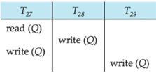

## Module 48

Partha Pratim Das

Objectives &amp; Outline

Recovery

Example

Transactions in

SQL

TCL

COMMIT

ROLLBACK

SAVEPOINT

SET

TRANSACTION

View

Serializability

Test

Example

Complex Notions of Serializability

Module Summary

Database Management Systems

## Database Management Systems

Module 48: Transactions/3: Recoverability

## Partha Pratim Das

Department of Computer Science and Engineering Indian Institute of Technology, Kharagpur ppd@cse.iitkgp.ac.in

Partha Pratim Das

## Module 48

Partha Pratim Das

Objectives &amp; Outline

Recovery Example

Transactions in

SQL

TCL

COMMIT

ROLLBACK

SAVEPOINT

SET

TRANSACTION

View

Serializability

Test

Example

Complex Notions of Serializability

Module Summary

## Module Recap

- Understood the issues that arise when two or more transactions work concurrently
- Learnt the forms of serializability in terms of conflict and view serializability
- Acyclic precedence graph can ensure conflict serializability

## Module 48

Partha Pratim Das

Objectives &amp; Outline

Recovery

Example

Transactions in SQL

TCL

COMMIT

ROLLBACK

SAVEPOINT

SET TRANSACTION

View

Serializability

Test

Example

Complex Notions of Serializability

Module Summary

## Module Objectives

- What happens if system fails while a transaction is in execution? Can a consistent state be reached for the database? Recoverability attempts to answer issues in state and transaction recovery in the face of system failures
- Conflict serializability is a crisp concept for concurrent execution that guarantees ACID properties and has a simple detection algorithm. Yet only few schedules are Conflict serializable in practice. There is a need to explore - View Serializability - a weaker system for better concurrency

## Module 48

Partha Pratim Das

Objectives &amp; Outline

Recovery

Example

Transactions in SQL

TCL

COMMIT

ROLLBACK

SAVEPOINT

SET

TRANSACTION

View

Serializability

Test

Example

Complex Notions of Serializability

Module Summary

## Module Outline

- Recoverability
- Transaction Definition in SQL
- View Serializability
- Complex Notions of Serializability

Module 48

Partha Pratim

Das

Objectives &amp;

Outline

Recovery

Example

Transactions in

SQL

TCL

COMMIT

ROLLBACK

SAVEPOINT

SET

TRANSACTION

View

Serializability

Test

Example

Complex Notions of Serializability

Module Summary

## Recovery

## Recovery

## Module 48

Partha Pratim Das

Objectives &amp; Outline

Recovery

Example

Transactions in SQL

TCL

COMMIT

ROLLBACK

SAVEPOINT

SET TRANSACTION

View

Serializability

Test

Example

Complex Notions of Serializability

Module Summary

## What is Recovery?

- Serializability helps to ensure Isolation and Consistency of a schedule
- Yet, the Atomicity and Consistency may be compromised in the face of system failures
- Consider a schedule comprising a single transaction (obviously serial):
1. read ( A )
2. A := A -50
3. write ( A )
4. read ( B )
5. B := B +50
6. write ( B )
7. commit // Make the changes permanent; show the results to the user
- What if system fails after Step 3 and before Step 6?
- Leads to inconsistent state
- Need to rollback update of A
- This is known as Recovery

Database Management Systems

## Partha Pratim Das

## Module 48

Partha Pratim Das

Objectives &amp;

Outline

Recovery

Example

Transactions in

SQL

TCL

COMMIT

ROLLBACK

SAVEPOINT

SET

TRANSACTION

View

Serializability

Test

Example

Complex Notions of Serializability

Module Summary

## Recoverable Schedules

- If a transaction T j reads a data item previously written by a transaction T i , then the commit operation of T i must appear before the commit operation of T j .
- The following schedule is not recoverable if T 9 commits immediately after the read( A ) operation
- If T 8 should abort, T 9 would have read (and possibly shown to the user) an inconsistent database state. Hence, database must ensure that schedules are recoverable

|                             | T,              |
|-----------------------------|-----------------|
| read (A) write (A) read (B) | read (A) commit |

Database Management Systems

## Partha Pratim Das

## Module 48

Partha Pratim Das

Objectives &amp;

Outline

Recovery

Example

Transactions in

SQL

TCL

COMMIT

ROLLBACK

SAVEPOINT

SET

TRANSACTION

View

Serializability

Test

Example

Complex Notions of Serializability

Module Summary

## Cascading Rollbacks

- Cascading rollback : A single transaction failure leads to a series of transaction rollbacks. Consider the following schedule where none of the transactions has yet committed (so the schedule is recoverable)
- If T 10 fails, T 11 and T 12 must also be rolled back
- Can lead to the undoing of a significant amount of work

| T1o                               |                    | T12      |
|-----------------------------------|--------------------|----------|
| read (A) read (B) write (A) abort | read (A) write (A) | read (A) |

Partha Pratim Das

## Module 48

Partha Pratim Das

Objectives &amp; Outline

Recovery

Example

Transactions in

SQL

TCL

COMMIT

ROLLBACK

SAVEPOINT

SET

TRANSACTION

View

Serializability

Test

Example

Complex Notions of Serializability

Module Summary

## Cascadeless Schedules

- Cascadeless schedules : For each pair of transactions T i and T j such that T j reads a data item previously written by T i , the commit operation of T i appears before the read operation of T j
- Every cascadeless schedule is also recoverable
- It is desirable to restrict the schedules to those that are cascadeless
- Example of a schedule that is NOT cascadeless

|                             | T1o                               |                    | T12               |
|-----------------------------|-----------------------------------|--------------------|-------------------|
|                             | read (A) read (B) write (A) abort | read (A) write (A) | read (A)          |
| Database Management Systems |                                   | Partha Pratim Das  | Partha Pratim Das |

48.9

Module 48

Partha Pratim

Das

Objectives &amp;

Outline

Recovery

Example

Transactions in

SQL

TCL

COMMIT

ROLLBACK

SAVEPOINT

SET

TRANSACTION

View

Serializability

Test

Example

Complex Notions of Serializability

Module Summary

## Example: Irrecoverable Schedule

| T1            | T2       | T2's Buffer   | Database   |
|---------------|----------|---------------|------------|
|               |          |               | A = 5000   |
| R(A);         | A = 5000 |               | A = 5000   |
| A = A - 1000; | A = 4000 |               | A = 5000   |
| W(A);         | A = 4000 |               | A = 4000   |
|               | R(A);    | A = 4000      | A = 4000   |
|               |          | A = 4500      | A = 4000   |
|               | W(A);    | A = 4500      | A = 4500   |
|               | Commit;  |               |            |
| Failure Point |          |               |            |
| Commit;       |          |               |            |

Rollback is possible only till the end (commit) of T2. So the computation of A (4000) and write in T1 is lost.

Database Management Systems

Partha Pratim Das

48.10

Module 48

Partha Pratim

Das

Objectives &amp;

Outline

Recovery

Example

Transactions in

SQL

TCL

COMMIT

ROLLBACK

SAVEPOINT

SET

TRANSACTION

View

Serializability

Test

Example

Complex Notions of Serializability

Module Summary

## Example: Recoverable Schedule with Cascading Rollback

| T1            | T2       | T2's Buffer   | Database   |
|---------------|----------|---------------|------------|
|               |          |               | A = 5000   |
| R(A);         | A = 5000 |               | A = 5000   |
| A = A - 1000; | A = 4000 |               | A = 5000   |
| W(A);         | A = 4000 |               | A = 4000   |
|               | R(A);    | A = 4000      | A = 4000   |
|               |          | A = 4500      | A = 4000   |
|               | W(A);    | A = 4500      | A = 4500   |
| Failure Point |          |               |            |
| Commit;       |          |               |            |
|               | Commit;  |               |            |

Rollback is possible as T2 has not committed yet. But T2 also need to be rolled back for rolling back T1.

Database Management Systems

Partha Pratim Das

Module 48

Partha Pratim

Das

Objectives &amp;

Outline

Recovery

Example

Transactions in

SQL

TCL

COMMIT

ROLLBACK

SAVEPOINT

SET

TRANSACTION

View

Serializability

Test

Example

Complex Notions of Serializability

Module Summary

## Example: Recoverable Schedule without Cascading Rollback

| T1      |          | T2           | T2's Buffer   | Database   |
|---------|----------|--------------|---------------|------------|
|         |          |              |               | A = 5000   |
| R(A);   | A = 5000 |              |               | A = 5000   |
|         | A = 4000 |              |               | A = 5000   |
| W(A);   | A = 4000 |              |               | A = 4000   |
| Commit; |          |              |               |            |
|         |          | R(A);        | A = 4000      | A = 4000   |
|         |          | A = A + 500; | A = 4500      | A = 4000   |
|         |          | W(A);        | A = 4500      | A = 4500   |
|         |          | Commit;      |               |            |

Rollback is possible without cascading - wherever failure occurs.

Partha Pratim Das

## Module 48

Partha Pratim Das

Objectives &amp;

Outline

Recovery

Example

Transactions in

SQL

TCL

COMMIT

ROLLBACK

SAVEPOINT

SET

TRANSACTION

View

Serializability

Test

Example

Complex Notions of Serializability

Module Summary

## Transaction Definition in SQL

## Transaction Definition in SQL

## Module 48

Partha Pratim Das

Objectives &amp; Outline

Recovery

Example

Transactions in SQL

TCL

COMMIT

ROLLBACK

SAVEPOINT

SET

TRANSACTION

View

Serializability

Test

Example

Complex Notions of Serializability

Module Summary

## Transaction Definition in SQL

- Data manipulation language must include a construct for specifying the set of actions that comprise a transaction
- In SQL, a transaction begins implicitly
- A transaction in SQL ends by:
- glyph[triangleright] Commit work
- -Commits the current transaction and begins a new one
- glyph[triangleright] Rollback work
- -Causes current transaction to abort
- In almost all database systems, by default, every SQL statement also commits implicitly if it executes successfully
- glyph[triangleright] Implicit commit can be turned off by a database directive
- -For example in JDBC, connection.setAutoCommit(false);

Module 48

Partha Pratim Das

Objectives &amp; Outline

Recovery

Example

Transactions in SQL

TCL

COMMIT

ROLLBACK

SAVEPOINT

SET

TRANSACTION

View

Serializability

Test

Example

Complex Notions of Serializability

Module Summary

## Transaction Control Language (TCL)

- The following commands are used to control transactions
- COMMIT
- glyph[triangleright] To save the changes
- ROLLBACK
- glyph[triangleright] To roll back the changes
- SAVEPOINT
- glyph[triangleright] Creates points within the groups of transactions in which to ROLLBACK
- SET TRANSACTION
- glyph[triangleright] Places a name on a transaction
- Transactional control commands are only used with the DML Commands such as
- INSERT, UPDATE and DELETE only
- They cannot be used while creating tables or dropping them because these operations are automatically committed in the database

Source

: SQL - Transactions

Database Management Systems

Partha Pratim Das

## Module 48

Partha Pratim

Das

Objectives &amp; Outline

Recovery

Example

Transactions in

SQL

TCL

COMMIT

ROLLBACK

SAVEPOINT

SET

TRANSACTION

View

Serializability

Test

Example

Complex Notions of Serializability

Module Summary

## TCL: COMMIT Command

- COMMIT is the transactional command used to save changes invoked by a transaction to the database
- COMMIT saves all the transactions to the database since the last COMMIT or ROLLBACK command
- The syntax for the COMMIT command is as follows:
- SQL&gt; DELETE FROM Customers WHERE AGE = 25;
- SQL&gt; COMMIT;

## SQL&gt; SELECT * FROM Customers;

| ID NAME   | AGE ADDRESS   |   SALARY |
|-----------|---------------|----------|
| Ramesh    | 32 Ahmedabad  |     2000 |
| 2 Khilan  | 25 Delhi      |     1500 |
| 3 kaushik | 23 Kota       |     2000 |
| Chaitali  | 25 Mumbai     |     6500 |
| 5 Hardik  | 27 Bhopal     |     8500 |
| Komal     | 22 MP         |     4500 |
| Muffy     | 24 Indore     |    10000 |

Source

: SQL - Transactions

Database Management Systems

| SQL>   | SELECT   | SELECT    | * FROM Customers;   | * FROM Customers;   | * FROM Customers;   |
|--------|----------|-----------|---------------------|---------------------|---------------------|
|        | ID       | NAME      | AGE                 | ADDRESS             | SALARY              |
|        |          | Ramesh    |                     | 32 Ahmedabad        | 2000                |
|        |          | 3 kaushik |                     | 23 Kota             | 2000                |
|        |          | 5 Hardik  |                     | 27 Bhopal           | 8500                |
|        |          | Komal     |                     | 22 MP               | 4500                |
|        |          | Muffy     |                     | 24 Indore           | 10000               |

## Partha Pratim Das

## Module 48

Partha Pratim

Das

Objectives &amp; Outline

Recovery

Example

Transactions in

SQL

TCL

COMMIT

ROLLBACK

SAVEPOINT

SET

TRANSACTION

View

Serializability

Test

Example

Complex Notions of Serializability

Module Summary

## TCL: ROLLBACK Command

- The ROLLBACK is the command used to undo transactions that have not already been saved to the database
- This can only be used to undo transactions since the last COMMIT or ROLLBACK command was issued
- The syntax for a ROLLBACK command is as follows:
- SQL&gt; DELETE FROM Customers WHERE AGE = 25;
- SQL&gt; ROLLBACK;

## SQL&gt; SELECT * FROM Customers;

| ID NAME   | AGE ADDRESS   |   SALARY |
|-----------|---------------|----------|
| Ramesh    | 32 Ahmedabad  |     2000 |
| 2 Khilan  | 25 Delhi      |     1500 |
| 3 kaushik | 23 Kota       |     2000 |
| Chaitali  | 25 Mumbai     |     6500 |
| 5 Hardik  | 27 Bhopal     |     8500 |
| Komal     | 22 MP         |     4500 |
| Muffy     | 24 Indore     |    10000 |

Source

: SQL - Transactions

Database Management Systems

|           | FROM Customers;   | FROM Customers;   |
|-----------|-------------------|-------------------|
| ID NAME   | AGE ADDRESS       | SALARY            |
| 1 Ramesh  | 32 Ahmedabad      | 2000              |
| 2 Khilan  | 25 Delhi          | 1500              |
| 3 kaushik | 23 Kota           | 2000              |
| Chaitali  | 25 Mumbai         | 6500              |
| 5 Hardik  | 27 Bhopal         | 8500              |
| 6 Komal   | 22 MP             | 4500              |
| Muffy     | 24 Indore         | 10000             |

## Partha Pratim Das

## Module 48

Partha Pratim Das

Objectives &amp; Outline

Recovery

Example

Transactions in

SQL

TCL

COMMIT

ROLLBACK

SAVEPOINT

SET

TRANSACTION

View

Serializability

Test

Example

Complex Notions of Serializability

Module Summary

## TCL: SAVEPOINT / ROLLBACK Command

## Example:

- A SAVEPOINT is a point in a transaction when you can roll the transaction back to a certain point without rolling back the entire transaction
- The syntax for a SAVEPOINT command is:
- SAVEPOINT SAVEPOINT NAME;
- This command serves only in the creation of a SAVEPOINT among all the transactional statements.
- The ROLLBACK command is used to undo a group of transactions
- The syntax for rolling back to a SAVEPOINT is:
- ROLLBACK TO SAVEPOINT NAME;

Source

## : SQL - Transactions

Database Management Systems

- SQL&gt; SAVEPOINT SP1;
- Savepoint created.
- SQL&gt; DELETE FROM Customers WHERE ID=1;
- 1 row deleted.

•

- SQL&gt; SAVEPOINT SP2;
- Savepoint created.
- SQL&gt; DELETE FROM Customers WHERE ID=2;
- 1 row deleted.
- SQL&gt; SAVEPOINT SP3;
- Savepoint created.
- SQL&gt; DELETE FROM Customers WHERE ID=3;
- 1 row deleted.

## Module 48

Partha Pratim Das

Objectives &amp; Outline

Recovery

Example

Transactions in

SQL

TCL

COMMIT

ROLLBACK

SAVEPOINT

SET

TRANSACTION

View

Serializability

Test

Example

Complex Notions of Serializability

Module Summary

## TCL: SAVEPOINT / ROLLBACK Command

- Three records deleted
- Undo the deletion of last two
- SQL&gt; ROLLBACK TO SP2;
- Rollback complete

SQL&gt; SAVEPOINT SP1; SQL&gt; DELETE FROM Customers WHERE ID=1; SQL&gt; SAVEPOINT SP2; SQL&gt; DELETE FROM Customers WHERE ID=2; SQL&gt; SAVEPOINT SP3; SQL&gt; DELETE FROM Customers WHERE ID=3;

## SQL&gt; SELECT * FROM Customers

1

| ID NAME   | AGE ADDRESS   |   SALARY |
|-----------|---------------|----------|
| 1 Ramesh  | 32 Ahmedabad  |     2000 |
| 2 Khilan  | 25 Delhi      |     1500 |
| 3 kaushik | 23 Kota       |     2000 |
| Chaitali  | 25 Mumbai     |     6500 |
| 5 Hardik  | 27 Bhopal     |     8500 |
| Komal     | 22 MP         |     4500 |
| Muffy     | 24 Indore     |    10000 |

## Source : SQL - Transactions

Database Management Systems

## SQL&gt; SELECT * FROM Customers;

| ID NAME   | AGE ADDRESS   |   SALARY |
|-----------|---------------|----------|
| 2 Khilan  | 25 Delhi      |     1500 |
| 3 kaushik | 23 Kota       |     2000 |
| Chaitali  | 25 Mumbai     |     6500 |
| 5 Hardik  | 27 Bhopal     |     8500 |
| Komal     | 22 MP         |     4500 |
| Muffy     | 24 Indore     |    10000 |

## Partha Pratim Das

Module 48

Partha Pratim Das

Objectives &amp; Outline

Recovery Example

Transactions in

SQL

TCL

COMMIT

ROLLBACK

SAVEPOINT

SET

TRANSACTION

View

Serializability

Test

Example

Complex Notions of Serializability

Module Summary

## TCL: RELEASE SAVEPOINT Command

- The RELEASE SAVEPOINT command is used to remove a SAVEPOINT that you have created
- The syntax for a RELEASE SAVEPOINT command is as follows
- RELEASE SAVEPOINT SAVEPOINT NAME;
- Once a SAVEPOINT has been released, you can no longer use the ROLLBACK command to undo transactions performed since the last SAVEPOINT

Source

: SQL - Transactions

## Module 48

Partha Pratim Das

Objectives &amp; Outline

Recovery Example

Transactions in

SQL

TCL

COMMIT

ROLLBACK

SAVEPOINT

SET TRANSACTION

View

Serializability

Test

Example

Complex Notions of Serializability

Module Summary

## TCL: SET TRANSACTION Command

- The SET TRANSACTION command can be used to initiate a database transaction
- This command is used to specify characteristics for the transaction that follows
- For example, you can specify a transaction to be read only or read write
- The syntax for a SET TRANSACTION command is as follows:
- SET TRANSACTION [ READ WRITE | READ ONLY ];

Source

: SQL - Transactions

## Module 48

Partha Pratim Das

Objectives &amp; Outline

Recovery

Example

Transactions in

SQL

TCL

COMMIT

ROLLBACK

SAVEPOINT

SET

TRANSACTION

View

Serializability

Test

Example

Complex Notions of Serializability

Module Summary

## View Serializability

## Module 48

Partha Pratim Das

Objectives &amp; Outline

Recovery

Example

Transactions in SQL

TCL

COMMIT

ROLLBACK

SAVEPOINT

SET

TRANSACTION

View

Serializability

Test

Example

Complex Notions of Serializability

Module Summary

## View Serializability

- Let S and S ′ be two schedules with the same set of transactions. S and S ′ are view equivalent if the following three conditions are met, for each data item Q ,
- Initial Read : If in schedule S , transaction T i reads the initial value of Q , then in schedule S ′ also transaction T i must read the initial value of Q
- Write-Read Pair : If in schedule S transaction T i executes read ( Q ), and that value was produced by transaction T j (if any), then in schedule S ′ also transaction T i must read the value of Q that was produced by the same write ( Q ) operation of transaction T j
- Final Write : The transaction (if any) that performs the final write ( Q ) operation in schedule S must also perform the final write ( Q ) operation in schedule S ′
- As can be seen, view equivalence is also based purely on reads and writes alone

Module 48

Partha Pratim Das

Objectives &amp; Outline

Recovery

Example

Transactions in

SQL

TCL

COMMIT

ROLLBACK

SAVEPOINT

SET

TRANSACTION

View

Serializability

Test

Example

Complex Notions of Serializability

Module Summary

## View Serializability (2)

- A schedule S is view serializable if it is view equivalent to a serial schedule
- Every conflict serializable schedule is also view serializable
- Below is a schedule which is view-serializable but not conflict serializable
- What serial schedule is above equivalent to?
- T 27 -T 28 -T 29
- The one read( Q ) instruction reads the initial value of Q in both schedules and
- T 29 performs the final write of Q in both schedules
- T 28 and T 29 perform write( Q ) operations called blind writes , without having performed a read( Q ) operation
- Every view serializable schedule that is not conflict serializable has blind writes Database Management Systems Partha Pratim Das

|                    | T28       | T29       |
|--------------------|-----------|-----------|
| read (Q) write (Q) | write (Q) | write (Q) |

## Module 48

Partha Pratim Das

Objectives &amp; Outline

Recovery

Example

Transactions in SQL

TCL

COMMIT

ROLLBACK

SAVEPOINT

SET TRANSACTION

View Serializability

Test

Example

Complex Notions of Serializability

Module Summary

## Test for View Serializability

- The precedence graph test for conflict serializability cannot be used directly to test for view serializability
- Extension to test for view serializability has cost exponential in the size of the precedence graph
- The problem of checking if a schedule is view serializable falls in the class of NP -complete problems
- Thus, existence of an efficient algorithm is extremely unlikely
- However, practical algorithms that just check some sufficient conditions for view serializability can still be used

## Module 48

Partha Pratim Das

Objectives &amp; Outline

Recovery

Example

Transactions in SQL

TCL

COMMIT

ROLLBACK

SAVEPOINT

SET TRANSACTION

View

Serializability

Test

Example

Complex Notions of Serializability

Module Summary

## View Serializability: Example 1

- Check whether the schedule is view serializable or not?
- S : R 2( B ); R 2( A ); R 1( A ); R 3( A ); W 1( B ); W 2( B ); W 3( B );
- Solution:
- With 3 transactions, total number of schedules possible = 3! = 6

glyph[triangleright] &lt; T 1 T 2 T 3 &gt;

glyph[triangleright] &lt; T 1 T 3 T 2 &gt;

glyph[triangleright] &lt; T 2 T 3 T 1 &gt;

glyph[triangleright] &lt; T 2 T 1 T 3 &gt;

glyph[triangleright] &lt; T 3 T 1 T 2 &gt;

glyph[triangleright] &lt; T 3 T 2 T 1 &gt;

Source :

http: // www. edugrabs. com/ how-to-check-for-view-serializable-schedule/ (Accessed 12-Feb-18)

Database Management Systems

Partha Pratim Das

Module 48

Partha Pratim Das

Objectives &amp; Outline

Recovery

Example

Transactions in SQL

TCL

COMMIT

ROLLBACK

SAVEPOINT

SET TRANSACTION

View

Serializability

Test

Example

Complex Notions of Serializability

Module Summary

## View Serializability: Example 1 (2)

- Check whether the schedule is view serializable or not?
- S : R 2( B ); R 2( A ); R 1( A ); R 3( A ); W 1( B ); W 2( B ); W 3( B );
- Solution:
- Final update on data items:
- glyph[triangleright] A : -(No write on A)
- glyph[triangleright] B : T 1 , T 2 , T 3 (All 3 transactions write B)
- glyph[triangleright] As the final update on B is made by T 3 , ( T 1 , T 2 ) → T 3 . Now, Removing those schedules in which T 3 is not executing at last:
- -&lt; T 1 T 2 T 3 &gt;
- -&lt; T 2 T 1 T 3 &gt;

Source :

http: // www. edugrabs. com/ how-to-check-for-view-serializable-schedule/ (Accessed 12-Feb-18)

Database Management Systems

Partha Pratim Das

Module 48

Partha Pratim Das

Objectives &amp; Outline

Recovery

Example

Transactions in SQL

TCL

COMMIT

ROLLBACK

SAVEPOINT

SET

TRANSACTION

View

Serializability

Test

Example

Complex Notions of Serializability

Module Summary

## View Serializability: Example 1 (3)

- Check whether the schedule is view serializable or not?
- S : R 2( B ); R 2( A ); R 1( A ); R 3( A ); W 1( B ); W 2( B ); W 3( B );
- Solution:
- Initial Read + Which transaction updates after read?
- glyph[triangleright] A : T 2 , T 1 , T 3 (initial read)
- glyph[triangleright] B : T 2 (initial read); T 1 (update after read)
- glyph[triangleright] The transaction T 2 reads B initially which is updated by T 1 . So T 2 must execute before T 1 . Hence, T 2 → T 1 . So only one schedule survives:
- glyph[triangleright] &lt; T 2 T 1 T 3 &gt;
- Write Read Sequence (WR)
- glyph[triangleright] No need to check here
- Hence, view equivalent serial schedule is:
- glyph[triangleright] T 2 → T 1 → T 3

Source :

http: // www. edugrabs. com/ how-to-check-for-view-serializable-schedule/

Database Management Systems

(Accessed 12-Feb-18)

Partha Pratim Das

## Module 48

Partha Pratim Das

Objectives &amp; Outline

Recovery

Example

Transactions in

SQL

TCL

COMMIT

ROLLBACK

SAVEPOINT

SET

TRANSACTION

View

Serializability

Test

Example

Complex Notions of Serializability

Module Summary

## View Serializability: Example 2

- Check whether S is Conflict serializable and / or view serializable or not?
- S : R 1( A ); R 2( A ); R 3( A ); R 4( A ); W 1( B ); W 2( B ); W 3( B ); W 4( B )
- Solution is given in the next slide (hidden). First try to solve this and then check the solution.

Source : Given in solution slides

## Module 48

Partha Pratim Das

Objectives &amp; Outline

Recovery

Example

Transactions in

SQL

TCL

COMMIT

ROLLBACK

SAVEPOINT

SET

TRANSACTION

View

Serializability

Test

Example

Complex Notions of Serializability

Module Summary

## Complex Notions of Serializability

## Complex Notions of Serializability

Module 48

Partha Pratim

Das

Objectives &amp;

Outline

Recovery

Example

Transactions in

SQL

TCL

COMMIT

ROLLBACK

SAVEPOINT

SET

TRANSACTION

View

Serializability

Test

Example

Complex Notions of Serializability

Module Summary

## More Complex Notions of Serializability

- The schedule below produces the same outcome as the serial schedule &lt; T 1 , T 5 &gt; , yet is not conflict equivalent or view equivalent to it
- If we start with A = 1000 and B = 2000, the final result is 960 and 2040
- Determining such equivalence requires analysis of operations other than read and write Database Management Systems Partha Pratim Das 48.31

| T1                             | Ts                             |
|--------------------------------|--------------------------------|
| read (A) write (A)             | read (B) B:= B - 10 write (B)  |
| read (B) B := B + 50 write (B) | read (A) A := A + 10 write (A) |

## Module 48

Partha Pratim Das

Objectives &amp; Outline

Recovery

Example

Transactions in SQL

TCL

COMMIT

ROLLBACK

SAVEPOINT

SET TRANSACTION

View

Serializability

Test

Example

Complex Notions of Serializability

Module Summary

## Module Summary

- With proper planning, a database can be recovered back to a consistent state from inconsistent state in the face of system failures. Such a recovery is done via cascaded or cascadeless rollback
- View Serializability is a weaker serializability system for better concurrency. However, testing for view serializability is NP complete

Slides used in this presentation are borrowed from http://db-book.com/ with kind permission of the authors. Edited and new slides are marked with 'PPD'.

Database Management Systems

Partha Pratim Das