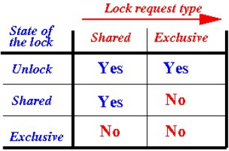
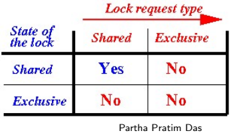
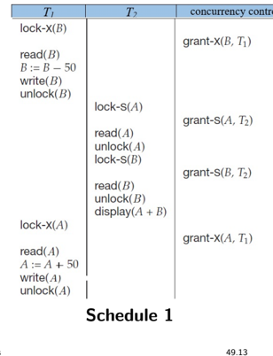
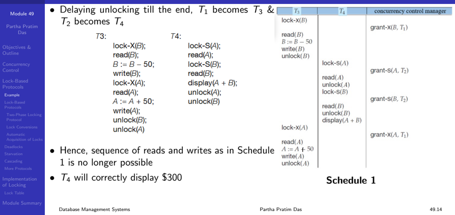
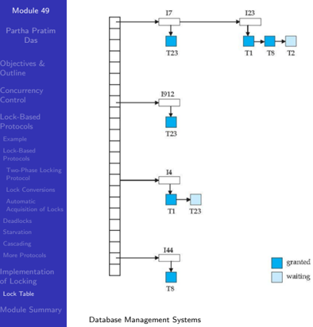

## Module 49

Partha Pratim Das

Objectives &amp; Outline

Concurrency Control

Lock-Based

Protocols

Example

Lock-Based

Protocols

Two-Phase Locking Protocol

Lock Conversions

Automatic

Acquisition of Locks

Deadlocks

Starvation

Cascading

More Protocols

Implementation of Locking

Lock Table

Module Summary

Database Management Systems

## Database Management Systems Module 49: Concurrency Control/1

## Partha Pratim Das

Department of Computer Science and Engineering Indian Institute of Technology, Kharagpur ppd@cse.iitkgp.ac.in

Partha Pratim Das

49.1

## Module 49

Partha Pratim Das

## Objectives &amp; Outline

Concurrency Control

Lock-Based Protocols

Example

Lock-Based Protocols

Two-Phase Locking Protocol

Lock Conversions

Automatic Acquisition of Locks

Deadlocks

Starvation

Cascading

More Protocols

Implementation of Locking Lock Table

Module Summary

## Module Recap

- With proper planning, a database can be recovered back to a consistent state from inconsistent state in the face of system failures. Such a recovery is done via cascaded or cascadeless rollback
- View Serializability is a weaker serializability system for better concurrency. However, testing for view serializability is NP complete

## Module 49

Partha Pratim Das

Objectives &amp; Outline

Concurrency Control

Lock-Based Protocols

Example

Lock-Based Protocols

Two-Phase Locking Protocol

Lock Conversions

Automatic Acquisition of Locks

Deadlocks

Starvation

Cascading

More Protocols

Implementation of Locking Lock Table

Module Summary

## Module Objectives

- Concurrency Control through design of serializable schedule is difficult in general. Hence we take a look into locking mechanism and Lock-Based Protocols
- We need to understand how locks may be implemented

## Module 49

Partha Pratim Das

Objectives &amp; Outline

Concurrency Control

Lock-Based Protocols

Example

Lock-Based

Protocols

Two-Phase Locking Protocol

Lock Conversions

Automatic

Acquisition of Locks

Deadlocks

Starvation

Cascading

More Protocols

Implementation of Locking Lock Table

Module Summary

## Module Outline

- Concurrency Control
- Lock-Based Protocols
- Implementing Locking

## Module 49

Partha Pratim Das

Objectives &amp; Outline

Concurrency Control

Lock-Based

Protocols

Example

Lock-Based

Protocols

Two-Phase Locking

Protocol

Lock Conversions

Automatic

Acquisition of Locks

Deadlocks

Starvation

Cascading

More Protocols

Implementation of Locking

Lock Table

Module Summary

## Concurrency Control

## Concurrency Control

## Module 49

Partha Pratim Das

Objectives &amp; Outline

Concurrency Control

Lock-Based

Protocols

Example

Lock-Based

Protocols

Two-Phase Locking

Protocol

Lock Conversions

Automatic Acquisition of Locks

Deadlocks

Starvation

Cascading

More Protocols

Implementation of Locking Lock Table

Module Summary

## Concurrency Control

- A database must provide a mechanism that will ensure that all possible schedules are both:
- Conflict serializable
- Recoverable and, preferably, Cascadeless
- A policy in which only one transaction can execute at a time generates serial schedules, but provides a poor degree of concurrency
- Concurrency-control schemes tradeoff between the amount of concurrency they allow and the amount of overhead that they incur
- Testing a schedule for serializability after it has executed is a little too late!
- Tests for serializability help us understand why a concurrency control protocol is correct
- Goal : To develop concurrency control protocols that will assure serializability

Database Management Systems

## Partha Pratim Das

## Module 49

Partha Pratim Das

Objectives &amp; Outline

Concurrency Control

Lock-Based Protocols

Example

Lock-Based Protocols

Two-Phase Locking Protocol

Lock Conversions

Automatic

Acquisition of Locks

Deadlocks

Starvation

Cascading

More Protocols

Implementation of Locking Lock Table

Module Summary

## Concurrency Control (2)

- One way to ensure isolation is to require that data items be accessed in a mutually exclusive manner ; that is, while one transaction is accessing a data item, no other transaction can modify that data item
- Should a transaction hold a lock on the whole database
- glyph[triangleright] Would lead to strictly serial schedules - very poor performance
- The most common method used to implement locking requirement is to allow a transaction to access a data item only if it is currently holding a lock on that item

Module 49

Partha Pratim Das

Objectives &amp; Outline

Concurrency Control

Lock-Based Protocols

Example

Lock-Based

Protocols

Two-Phase Locking

Protocol

Lock Conversions

Automatic

Acquisition of Locks

Deadlocks

Starvation

Cascading

More Protocols

Implementation of Locking

Lock Table

Module Summary

## Lock-Based Protocols

## Lock-Based Protocols

## Module 49

Partha Pratim Das

Objectives &amp; Outline

Concurrency Control

Lock-Based Protocols

Example

Lock-Based

Protocols

Two-Phase Locking

Protocol

Lock Conversions

Automatic Acquisition of Locks

Deadlocks

Starvation

Cascading

More Protocols

Implementation of Locking

Lock Table

Module Summary

## Lock-Based Protocols

- A lock is a mechanism to control concurrent access to a data item
- Data items can be locked in two modes:
- a) exclusive (X) mode:
- Data item can be both read as well as written
- X-lock is requested using lock-X instruction
- b) shared (S) mode:
- Data item can only be read
- S-lock is requested using lock-S instruction
- A transaction can unlock a data item Q by the unlock ( Q ) Instruction
- Lock requests are made to the concurrency-control manager by the programmer
- Transaction can proceed only after request is granted

Module 49

Partha Pratim

Das

Objectives &amp;

Outline

Concurrency

Control

Lock-Based

Protocols

Example

Lock-Based

Protocols

Two-Phase Locking

Protocol

Lock Conversions

Automatic

Acquisition of Locks

Deadlocks

Starvation

Cascading

More Protocols

Implementation of Locking

Lock Table

Module Summary

## Lock-Based Protocols (2): Lock Compatibility Matrix

- Lock-Compatibility Matrix : A lock compatibility matrix is used which states whether a data item can be locked by two transactions at the same time
- Full compatibility matrix
- Abbreviated compatibility matrix

|           | Lock request type   | Lock request type   |
|-----------|---------------------|---------------------|
| State the | Shared              | Exclusive           |
| Unlock    | Yes                 | Yes                 |
| Shared    | Yes                 | No                  |
| Exclusive | No                  | No                  |

Database Management Systems

49.10

Module 49

Partha Pratim Das

Objectives &amp; Outline

Concurrency Control

Lock-Based Protocols

Example

Lock-Based Protocols

Two-Phase Locking Protocol

Lock Conversions

Automatic Acquisition of Locks

Deadlocks

Starvation

Cascading

More Protocols

Implementation of Locking Lock Table

Module Summary

## Lock-Based Protocols (3)

- Requesting for / Granting of a Lock
- A transaction may be granted a lock on an item if the requested lock is compatible with locks already held on the item by other transactions
- Sharing a Lock
- Any number of transactions can hold shared locks on an item
- But if any transaction holds an exclusive lock on the item no other transaction may hold any lock on the item
- Waiting for a Lock
- If a lock cannot be granted, the requesting transaction is made to wait till all incompatible locks held by other transactions have been released
- Holding a Lock
- A transaction must hold a lock on a data item as long as it accesses that item
- Unlocking / Releasing a Lock
- Transaction Ti may unlock a data item that it had locked at some earlier point
- It is not necessarily desirable for a transaction to unlock a data item immediately after its final access of that data item, since serializability may not be ensured

Database Management Systems

Partha Pratim Das

Module 49

Partha Pratim Das

Objectives &amp; Outline

Concurrency Control

Lock-Based Protocols

Example

Lock-Based Protocols

Two-Phase Locking Protocol

Lock Conversions

Automatic

Acquisition of Locks

Deadlocks

Starvation

Cascading

More Protocols

Implementation of Locking Lock Table

Module Summary

## Lock-Based Protocols: Example: Serial Schedule

- Let A and B be two accounts that are accessed by transactions T 1 and T 2 .
- Transaction T 1 transfers $ 50 from account B to account A

T1:

- Transaction T 2 displays the total amount of money in accounts A and B , that is, the sum A + B
- Suppose that the values of accounts A and B are $ 100 and $ 200, respectively
- If these transactions are executed serially, either as T 1 , T 2 or the order T 2 , T 1 then transaction T 2 will display the value $ 300

lock-X(B); read(B); B :=B 50; write(B); unlock(B); lock-XKA); read(A); A:=A+ write(A); unlock(A); 50;

T2:

lock-S(A); read(A); unlock(A); lock-S(B); read(B); unlock(B); display(A B)

Module 49

Partha Pratim

Das

Objectives &amp;

Outline

Concurrency

Control

Lock-Based

Protocols

Example

Lock-Based

Protocols

Two-Phase Locking

Protocol

Lock Conversions

Automatic

Acquisition of Locks

Deadlocks

Starvation

Cascading

More Protocols

Implementation of Locking

Lock Table

Module Summary

## Lock-Based Protocols: Example (2): Concurrent Schedule: Bad

- If, however, these transactions are executed concurrently, then schedule 1 is possible
- In this case, transaction T 2 displays $ 250, which is incorrect. The reason for this mistake is that
- the transaction T 1 unlocked data item B too early, as a result of which T 2 saw an inconsistent state
- Suppose we delay unlocking till the end

T1:

T2:

lock-X(B); read(B); B:=B 50; write(B); unlock(B); read(A); A:=A + 50; write(A); unlock(A);

Database Management Systems lock-S(A);

unlock(A);

read(A);

lock-S(B);

unlock(B);

read(B);

display(A + B)

Partha Pratim Das

## Lock-Based Protocols: Example (3): Concurrent Schedule: Good

Module 49

Partha Pratim Das

Objectives &amp; Outline

Concurrency Control

Lock-Based Protocols

Example

Lock-Based

Protocols

Two-Phase Locking

Protocol

Lock Conversions

Automatic

Acquisition of Locks

Deadlocks

Starvation

Cascading

More Protocols

Implementation of Locking

Lock Table

Module Summary

## Lock-Based Protocols: Example (4): Concurrent Schedule: Deadlock

- Given, T 3 and T 4 , consider Schedule 2 (partial)
- Since T 3 is holding an exclusive mode lock on B and T 4 is requesting a shared-mode lock on B , T 4 is waiting for T 3 to unlock B
- Similarly, since T 4 is holding a shared-mode lock on A and T 3 is requesting an exclusive-mode lock on A , T 3 is waiting for T 4 to unlock A
- Thus, we have arrived at a state where neither of these transactions can ever proceed with its normal execution
- This situation is called deadlock
- When deadlock occurs, the system must roll back one of the two transactions.
- Once a transaction has been rolled back, the data items that were locked by that transaction are unlocked.
- These data items are then available to the other transaction, which can continue with its execution.

Database Management Systems

Partha Pratim Das

T3:

T4:

lock-S(A); read(A); lock-S(B); read(B); display(A B); unlock(A); unlock(B)

lock-S(A)

read(A)

lock-X(A)

lock-X(B); read(B); B:=B 50; write(B); read(A); A:= A + 50; write(A); unlock(B); unlock(A)

lock-X(B)

50

read(B)

write(B)

lock-S(B)

Schedule 2

49.15

## Module 49

Partha Pratim Das

Objectives &amp; Outline

Concurrency Control

Lock-Based Protocols Example

Lock-Based Protocols

Two-Phase Locking Protocol

Lock Conversions

Automatic Acquisition of Locks

Deadlocks

Starvation

Cascading

More Protocols

Implementation of Locking Lock Table

Module Summary

## Lock-Based Protocols

- If we do not use locking, or if we unlock data items too soon after reading or writing them, we may get inconsistent states
- On the other hand, if we do not unlock a data item before requesting a lock on another data item, deadlocks may occur
- Deadlocks are a necessary evil associated with locking, if we want to avoid inconsistent states
- Deadlocks are definitely preferable to inconsistent states, since they can be handled by rolling back transactions, whereas inconsistent states may lead to real-world problems that cannot be handled by the database system
- A locking protocol is a set of rules followed by all transactions while requesting and releasing locks
- Locking protocols restrict the set of possible schedules
- The set of all such schedules is a proper subset of all possible serializable schedules
- We present locking protocols that allow only conflict-serializable schedules, and thereby ensure isolation

Partha Pratim Das

## Module 49

Partha Pratim Das

Objectives &amp; Outline

Concurrency Control

Lock-Based Protocols

Example

Lock-Based Protocols

Two-Phase Locking Protocol

Lock Conversions

Automatic Acquisition of Locks

Deadlocks

Starvation

Cascading

More Protocols

Implementation of Locking

Lock Table

Module Summary

## Two-Phase Locking Protocol

- This protocol ensures conflict-serializable schedules
- Phase 1: Growing Phase
- Transaction may obtain locks
- Transaction may not release locks
- Phase 2: Shrinking Phase
- Transaction may release locks
- Transaction may not obtain locks
- The protocol assures serializability. It can be proved that the transactions can be serialized in the order of their lock points
- That is, the point where a transaction acquired its final lock

## Module 49

Partha Pratim Das

Objectives &amp; Outline

Concurrency Control

Lock-Based Protocols

Example

Lock-Based Protocols

Two-Phase Locking Protocol

Lock Conversions

Automatic Acquisition of Locks

Deadlocks

Starvation

Cascading

More Protocols

Implementation of Locking Lock Table

Module Summary

## Two-Phase Locking Protocol (2)

- There can be conflict serializable schedules that cannot be obtained if two-phase locking is used
- However, in the absence of extra information (that is, ordering of access to data), two-phase locking is needed for conflict serializability in the following sense:
- Given a transaction T i that does not follow two-phase locking, we can find a transaction T j that uses two-phase locking, and a schedule for T i and T j that is not conflict serializable

## Module 49

Partha Pratim Das

Objectives &amp; Outline

Concurrency Control

Lock-Based Protocols

Example

Lock-Based

Protocols

Two-Phase Locking Protocol

Lock Conversions

Automatic

Acquisition of Locks

Deadlocks

Starvation

Cascading

More Protocols

Implementation of Locking

Lock Table

Module Summary

## Lock Conversions

- Two-phase locking with lock conversions:
- -First Phase:
- glyph[triangleright] can acquire a lockS on item
- glyph[triangleright] can acquire a lockX on item
- glyph[triangleright] can convert a lockS to a lockX (upgrade)
- -Second Phase:
- glyph[triangleright] can release a lockS
- glyph[triangleright] can release a lockX
- glyph[triangleright] can convert a lockX to a lockS (downgrade)
- This protocol assures serializability. But still relies on the programmer to insert the various locking instructions

## Module 49

Partha Pratim Das

Objectives &amp; Outline

Concurrency Control

Lock-Based

Protocols

Example

Lock-Based

Protocols

Two-Phase Locking Protocol

Lock Conversions

Automatic

Acquisition of Locks

Deadlocks

Starvation

Cascading

More Protocols

Implementation of Locking

Lock Table

Module Summary

## Automatic Acquisition of Locks: Read

- A transaction T i issues the standard read/write instruction, without explicit locking calls
- The operation read ( D ) is processed as:
- if T i has a lock on D

then read( D )

else begin if necessary, wait until no other transaction has a lock-X on D grant T i a lock-S on D ; read( D )

end

## Module 49

Partha Pratim Das

Objectives &amp; Outline

Concurrency Control

Lock-Based

Protocols

Example

Lock-Based

Protocols

Two-Phase Locking Protocol

Lock Conversions

Automatic Acquisition of Locks

Deadlocks

Starvation

Cascading

More Protocols

Implementation of Locking

Lock Table

Module Summary

## Automatic Acquisition of Locks: Write

- write ( D ) is processed as:

if

T

i

has a lock-X

then write( D )

else begin if necessary, wait until no other transaction has any lock on D , if T i has a lock-S on D

then upgrade lock on D to lock-X

else grant T i a lock-X on D

write( D )

end ;

- All locks are released after commit or abort

on

D

Partha Pratim Das

## Module 49

Partha Pratim

Das

Objectives &amp; Outline

Concurrency

Control

Lock-Based

Protocols

Example

Lock-Based

Protocols

Two-Phase Locking

Protocol

Lock Conversions

Automatic

Acquisition of Locks

Deadlocks

Starvation

Cascading

More Protocols

Implementation of Locking

Lock Table

Module Summary

## Deadlocks

- Two-phase locking does not ensure freedom from deadlocks

T3:

T4:

lock-X(B);

read(B);

B:=B

50;

write(B);

lock-XVA);

read(A);

A := A

50;

write(A);

unlock(B);

unlock(A)

- Observe that transactions T 3 and T 4 are two phase, but, in deadlock

Database Management Systems

## Partha Pratim Das

lock-S(A);

read(A);

lock-S(B);

read(B);

display(A

unlock(A);

unlock(B)

B);

lock-x (B)

read (B)

B:= B - 50

write (B)

lock-x (A)

lock-s (A)

read (A)

lock-s (B)

## Module 49

Partha Pratim Das

Objectives &amp; Outline

Concurrency Control

Lock-Based Protocols

Example

Lock-Based Protocols

Two-Phase Locking Protocol

Lock Conversions

Automatic

Acquisition of Locks

Deadlocks

Starvation

Cascading

More Protocols

Implementation of Locking Lock Table

Module Summary

## Starvation

- In addition to deadlocks, there is a possibility of Starvation
- Starvation occurs if the concurrency control manager is badly designed. For example:
- A transaction may be waiting for an X-lock on an item, while a sequence of other transactions request and are granted an S-lock on the same item
- The same transaction is repeatedly rolled back due to deadlocks
- Concurrency control manager can be designed to prevent starvation
- Starvation is also loosely referred to as Livelock

## Module 49

Partha Pratim Das

Objectives &amp; Outline

Concurrency Control

Lock-Based

Protocols

Example

Lock-Based

Protocols

Two-Phase Locking

Protocol

Lock Conversions

Automatic

Acquisition of Locks

Deadlocks

Starvation

Cascading

More Protocols

Implementation of Locking

Lock Table

Module Summary

## Cascading Rollback

- The potential for deadlock exists in most locking protocols. Deadlocks are a necessary evil
- When a deadlock occurs there is a possibility of cascading roll-backs
- Cascading roll-back is possible under twophase locking
- In the schedule here, each transaction observes the two-phase locking protocol, but the failure of T5 after the read(A) step of T7 leads to cascading rollback of T6 and T7.

| Ts                                                     | T6                                   | T7                |
|--------------------------------------------------------|--------------------------------------|-------------------|
| lock-X(A) read(A) lock-S(B) read(B) write(A) unlock(A) | lock-X(A) read(A) write(A) unlock(A) |                   |
|                                                        |                                      | lock-S(A) read(A) |

Module 49

Partha Pratim Das

Objectives &amp; Outline

Concurrency Control

Lock-Based Protocols

Example

Lock-Based Protocols

Two-Phase Locking Protocol

Lock Conversions

Automatic

Acquisition of Locks

Deadlocks

Starvation

Cascading

More Protocols

Implementation of Locking Lock Table

Module Summary

## More Two Phase Locking Protocols

- To avoid Cascading roll-back, follow a modified protocol called strict two-phase locking
- a transaction must hold all its exclusive locks till it commits/aborts
- Rigorous two-phase locking is even stricter
- All locks are held till commit/abort. In this protocol transactions can be serialized in the order in which they commit
- Note that concurrency goes down as we move to more and more strict locking protocol

Module 49

Partha Pratim Das

Objectives &amp; Outline

Concurrency Control

Lock-Based

Protocols

Example

Lock-Based

Protocols

Two-Phase Locking

Protocol

Lock Conversions

Automatic

Acquisition of Locks

Deadlocks

Starvation

Cascading

More Protocols

Implementation of Locking

Lock Table

Module Summary

## Implementation of Locking

## Implementation of Locking

## Module 49

Partha Pratim Das

Objectives &amp; Outline

Concurrency Control

Lock-Based Protocols

Example

Lock-Based Protocols

Two-Phase Locking Protocol

Lock Conversions

Automatic Acquisition of Locks

Deadlocks

Starvation

Cascading

More Protocols

Implementation of Locking

Lock Table

Module Summary

## Implementation of Locking

- A lock manager can be implemented as a separate process to which transactions send lock and unlock requests
- The lock manager replies to a lock request by sending a lock grant messages (or a message asking the transaction to roll back, in case of a deadlock)
- The requesting transaction waits until its request is answered
- The lock manager maintains a data-structure called a lock table to record granted locks and pending requests
- The lock table is usually implemented as an in-memory hash table indexed on the name of the data item being locked

## Lock Table

- Dark blue rectangles indicate granted locks; light blue indicate waiting requests
- Lock table also records the type of lock granted or requested
- New request is added to the end of the queue of requests for the data item, and granted if it is compatible with all earlier locks
- Unlock requests result in the request being deleted, and later requests are checked to see if they can now be granted
- If transaction aborts, all waiting or granted requests of the transaction are deleted
- lock manager may keep a list of locks held by each transaction, to implement this efficiently

## Partha Pratim Das

Module 49

Partha Pratim Das

Objectives &amp; Outline

Concurrency Control

Lock-Based Protocols

Example

Lock-Based Protocols

Two-Phase Locking Protocol

Lock Conversions

Automatic Acquisition of Locks

Deadlocks

Starvation

Cascading

More Protocols

Implementation of Locking

Lock Table

Module Summary

## Module Summary

- Understood the locking mechanism and protocols
- Realized that deadlock is a peril of locking and needs to be handled through rollback

Slides used in this presentation are borrowed from http://db-book.com/ with kind permission of the authors. Edited and new slides are marked with 'PPD'.

Database Management Systems