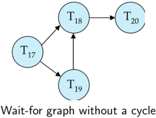
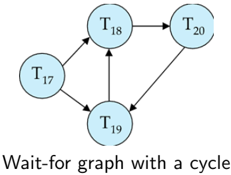
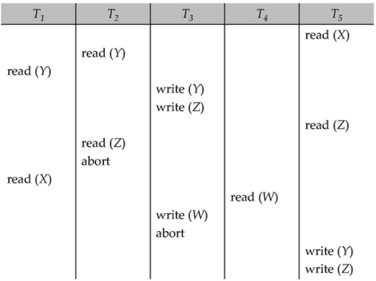

## Module 50

Partha Pratim Das

Objectives &amp; Outline

Deadlock

Handling

Prevention

Detection

Recovery

Timestamp-

Based

Protocols

Correctness

Module Summary

## Database Management Systems Module 50: Concurrency Control/2

## Partha Pratim Das

Department of Computer Science and Engineering Indian Institute of Technology, Kharagpur ppd@cse.iitkgp.ac.in

Partha Pratim Das

## Module 50

Partha Pratim Das

Objectives &amp; Outline

Deadlock

Handling

Prevention

Detection

Recovery

Timestamp-

Based

Protocols

Correctness

Module Summary

## Module Recap

- Understood the locking mechanism and protocols
- Realized that deadlock is a peril of locking and needs to be handled through rollback

## Module 50

Partha Pratim Das

Objectives &amp; Outline

Deadlock

Handling

Prevention

Detection

Recovery

TimestampBased Protocols Correctness

Module Summary

## Module Objectives

- Deadlocks are perils of locking. We need to understand how to detect, prevent and recover from deadlock
- Introduce a simple time-based protocol that avoids deadlocks

## Module 50

Partha Pratim Das

Objectives &amp; Outline

Deadlock

Handling

Prevention

Detection

Recovery

Timestamp-

Based

Protocols

Correctness

Module Summary

## Module Outline

- Deadlock Handling
- Timestamp-Based Protocols

## Module 50

Partha Pratim Das

Objectives &amp; Outline

Deadlock Handling

Prevention

Detection

Recovery

Timestamp-

Based

Protocols

Correctness

Module Summary

## Deadlock Handling

## Deadlock Handling

## Module 50

Partha Pratim Das

Objectives &amp; Outline

Deadlock Handling

Prevention

Detection

Recovery

TimestampBased Protocols Correctness

Module Summary

## Deadlock Handling

- System is deadlocked if there is a set of transactions such that every transaction in the set is waiting for another transaction in the set
- Deadlock Prevention protocols ensure that the system will never enter into a deadlock state. Some prevention strategies:
- Require that each transaction locks all its data items before it begins execution (pre-declaration)
- Impose partial ordering of all data items and require that a transaction can lock data items only in the order specified by the partial order

## Module 50

Partha Pratim Das

Objectives &amp; Outline

Deadlock

Handling

Prevention

Detection

Recovery

Timestamp-

Based

Protocols

Correctness

Module Summary

## Deadlock Prevention

- Transaction Timestamp : Timestamp is a unique identifier created by the DBMS to identify the relative starting time of a transaction. Timestamping is a method of concurrency control in which each transaction is assigned a transaction timestamp
- Following schemes use transaction timestamps for the sake of deadlock prevention alone
- wait-die scheme: non-preemptive
- glyph[triangleright] Older transaction may wait for younger one to release data item. (older means smaller timestamp)
- -Younger transactions never wait for older ones; they are rolled back instead
- glyph[triangleright] A transaction may die several times before acquiring needed data item
- wound-wait scheme: preemptive
- glyph[triangleright] Older transaction wounds (forces rollback) of younger transaction instead of waiting for it
- -Younger transactions may wait for older ones
- glyph[triangleright] May be fewer rollbacks than wait-die scheme

Module 50

Partha Pratim Das

Objectives &amp; Outline

Deadlock

Handling

Prevention

Detection

Recovery

TimestampBased Protocols Correctness

Module Summary

## Deadlock Prevention (2): Wait-Die Scheme

- It is a non-preemptive technique for deadlock prevention
- When transaction T n requests a data item currently held by T k , T n is allowed to wait only if it has a timestamp smaller than that of T k (That is, T n is older than T k ), otherwise T n is killed ('die')
- If a transaction requests to lock a resource (data item), which is already held with a conflicting lock by another transaction, then one of the two possibilities may occur:
- Timestamp( T n ) &lt; Timestamp( T k ) : T n , which is requesting a conflicting lock, is older than T k , then T n is allowed to 'wait' until the data-item is available.
- Timestamp( T n ) &gt; Timestamp( T k ) : T n is younger than T k , then T n is killed ('dies'). T n is restarted later with a random delay but with the same timestamp(n)
- This scheme allows the older transaction to 'wait' but kills the younger one ('die')
- Example
- Suppose that transaction T 5, T 10, T 15 have time-stamps 5, 10 and 15 respectively
- If T 5 requests a data item held by T 10 then T 5 will 'wait'
- If T 15 requests a data item held by T 10, then T 15 will be killed ('die')

Source :

What is the difference between 'wait-die' and 'wound-wait' deadlock prevention algorithms?

Database Management Systems

Partha Pratim Das

Module 50

Partha Pratim Das

Objectives &amp; Outline

Deadlock

Handling

Prevention

Detection

Recovery

TimestampBased Protocols Correctness

Module Summary

## Deadlock Prevention (3): Wound-Wait Scheme

- It is a preemptive technique for deadlock prevention
- When transaction T n requests a data item currently held by T k , T n is allowed to wait only if it has a timestamp larger than that of T k , otherwise T k is killed (wounded by T n )
- If a transaction requests to lock a resource (data item), which is already held with a conflicting lock by another transaction, then one of the two possibilities may occur:
- Timestamp( T n ) &lt; Timestamp( T k ) : T n forces T k to be killed ('wounds'). T k is restarted later with a random delay but with the same timestamp(k)
- Timestamp( T n ) &gt; Timestamp( T k ) : T n 'wait's until the resource is free
- This scheme allows the younger transaction requesting a lock to 'wait' if the older transaction already holds a lock, but forces the younger one to be suspended ('wound') if the older transaction requests a lock on an item already held by the younger one
- Example
- Suppose that transaction T 5, T 10, T 15 have time-stamps 5, 10 and 15 respectively
- If T 5 requests a data item held by T 10, then it will be preempted from T 10 and T 10 will be suspended ('wounded')
- If T 15 requests a data item held by T 10, then T 15 will 'wait'

Source : What is the difference between 'wait-die' and 'wound-wait' deadlock prevention algorithms? Database Management Systems Partha Pratim Das

## Module 50

Partha Pratim Das

Objectives &amp; Outline

Deadlock

Handling

Prevention

Detection

Recovery

TimestampBased Protocols Correctness

Module Summary

## Deadlock Prevention

- Both in wait-die and in wound-wait schemes, a rolled back transaction is restarted with its original timestamp. Older transactions thus have precedence over newer ones, and starvation is hence avoided

## · Timeout-Based Schemes

- A transaction waits for a lock only for a specified amount of time. If the lock has not been granted within that time, the transaction is rolled back and restarted
- Thus, deadlocks are not possible
- Simple to implement; but starvation is possible. Also difficult to determine good value of the timeout interval

## Module 50

Partha Pratim Das

Objectives &amp; Outline

Deadlock

Handling

Prevention

Detection

Recovery

Timestamp-

Based

Protocols

Correctness

Module Summary

## Deadlock Detection

- Deadlocks can be described as a wait-for graph, which consists of a pair G = ( V , E ),
- V is a set of vertices (all the transactions in the system)
- E is a set of edges; each element is an ordered pair T i → T j .
- If T i → T j is in E , then there is a directed edge from T i to T j , implying that T i is waiting for T j to release a data item
- When T i requests a data item currently being held by T j , then the edge T i → T j is inserted in the wait-for graph. This edge is removed only when T j is no longer holding a data item needed by T i
- The system is in a deadlock state if and only if the wait-for graph has a cycle
- Must invoke a deadlock-detection algorithm periodically to look for cycles

Module 50

Partha Pratim

Das

Objectives &amp;

Outline

Deadlock

Handling

Prevention

Detection

Recovery

Timestamp-

Based

Protocols

Correctness

Module Summary

## Deadlock Detection: Example

## Module 50

Partha Pratim Das

Objectives &amp; Outline

Deadlock

Handling

Prevention

Detection

Recovery

TimestampBased Protocols Correctness

Module Summary

## Deadlock Recovery

- When deadlock is detected:
- Some transaction will have to rolled back (made a victim) to break deadlock. Select that transaction as victim that will incur minimum cost
- Rollback - determine how far to roll back transaction
- glyph[triangleright] Total rollback: Abort the transaction and then restart it
- glyph[triangleright] More effective to roll back transaction only as far as necessary to break deadlock
- Starvation happens if same transaction is always chosen as victim. Include the number of rollbacks in the cost factor to avoid starvation

## Module 50

Partha Pratim Das

Objectives &amp; Outline

Deadlock

Handling

Prevention

Detection

Recovery

Timestamp-

Based

Protocols

Correctness

Module Summary

## Timestamp-Based Protocols

## Timestamp-Based Protocols

## Module 50

Partha Pratim Das

Objectives &amp; Outline

Deadlock

Handling

Prevention

Detection

Recovery

Timestamp-

Based

Protocols

Correctness

Module Summary

## Timestamp-Based Protocols

- Each transaction is issued a timestamp when it enters the system. If an old transaction T i has time-stamp TS( T i ), a new transaction T j is assigned time-stamp TS ( T j ) such that TS ( T i ) &lt; TS ( T j ).
- The protocol manages concurrent execution such that the time-stamps determine the serializability order
- In order to assure such behavior, the protocol maintains for each data Q two timestamp values:
- W-timestamp( Q ) is the largest time-stamp of any transaction that executed write ( Q ) successfully
- R-timestamp( Q ) is the largest time-stamp of any transaction that executed read ( Q ) successfully

## Module 50

Partha Pratim Das

Objectives &amp; Outline

Deadlock

Handling

Prevention

Detection

Recovery

Timestamp-

Based

Protocols

Correctness

Module Summary

## Timestamp-Based Protocols (2)

- The timestamp ordering protocol ensures that any conflicting read and write operations are executed in timestamp order
- Suppose a transaction T i issues a read ( Q )
- a) If TS ( T i ) ≤ W -timestamp( Q ), then T i needs to read a value of Q that was already overwritten
- Hence, the read operation is rejected, and T i is rolled back.
- b) If TS ( T i ) ≥ W -timestamp( Q ), then the read operation is executed, and R -timestamp( Q ) is set to max ( R -timestamp( Q ), TS ( T i )).

## Module 50

Partha Pratim Das

Objectives &amp; Outline

Deadlock

Handling

Prevention

Detection

Recovery

Timestamp-

Based

Protocols

Correctness

Module Summary

## Timestamp-Based Protocols (3)

- Suppose that transaction T i issues write ( Q ).
- is producing was needed
- If TS ( T i ) &lt; R -timestamp( Q ), then the value of Q that T i previously, and the system assumed that that value would never be produced
- glyph[triangleright] Hence, the write operation is rejected, and Ti is rolled back
- If TS ( T i ) &lt; W -timestamp( Q ), then T i is attempting to write an obsolete value of Q
- glyph[triangleright] Hence, this write operation is rejected, and Ti is rolled back
- Otherwise, the write operation is executed, and W -timestamp( Q ) is set to TS ( T i )

Module 50

Partha Pratim

Das

Objectives &amp;

Outline

Deadlock

Handling

Prevention

Detection

Recovery

Timestamp-

Based

Protocols

Correctness

Module Summary

## Example Use of the Protocol

## A partial schedule for several data items for transactions with timestamps 1, 2, 3, 4, 5

|          | Tz             |                     | T,       | Ts   |
|----------|----------------|---------------------|----------|------|
| read (Y) | read (Y)       | write (Y) write (Z) |          | read |
| read (X) | read (Z) abort | write (W) abort     | read (W) |      |

## Module 50

Partha Pratim Das

Objectives &amp; Outline

Deadlock

Handling

Prevention

Detection

Recovery

TimestampBased Protocols Correctness

Module Summary

## Correctness of Timestamp-Ordering Protocol

- The timestamp-ordering protocol guarantees serializability since all the arcs in the precedence graph are of the form:

Thus, there will be no cycles in the precedence graph

- Timestamp protocol ensures freedom from deadlock as no transaction ever waits
- But the schedule may not be cascade-free, and may not even be recoverable

## Module 50

Partha Pratim Das

Objectives &amp; Outline

Deadlock

Handling

Prevention

Detection

Recovery

Timestamp-

Based

Protocols

Correctness

Module Summary

## Module Summary

- Explained how to detect, prevent and recover from deadlock
- Introduced a time-based protocol that avoids deadlocks

Slides used in this presentation are borrowed from http://db-book.com/ with kind permission of the authors. Edited and new slides are marked with 'PPD'.