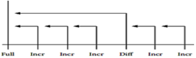
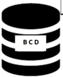
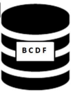
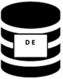

## Module 51

Partha Pratim Das

Week Recap

Objectives &amp; Outline

What is Backup and Recovery?

Why Backup?

Backup Data: Types

Backup Strategies Full Backup

Incremental Backup

Differential Backup

Example

Case: Monthly Schedule

Hot Backup Transactional Logging

Module Summary

## Database Management Systems

Module 51: Backup &amp; Recovery/1: Backup/1

## Partha Pratim Das

Department of Computer Science and Engineering Indian Institute of Technology, Kharagpur ppd@cse.iitkgp.ac.in

Partha Pratim Das

## Module 51

Partha Pratim Das

Week Recap

Objectives &amp; Outline

What is Backup and Recovery?

Why Backup?

Backup Data: Types

Backup Strategies Full Backup

Incremental Backup

Differential Backup

Example

Case: Monthly Schedule

Hot Backup Transactional Logging

Module Summary

## Week Recap

- Concurrent transactions, serializability issues, and ACID properties are discussed
- Learnt the forms of serializability - conflict and view
- Conflict serializability can be ensured by acyclic precedence graph
- View Serializability is a weaker serializability system providing better concurrency. However, testing for view serializability is NP complete
- With proper planning, a database can be recovered back to a consistent state from inconsistent state in the face of system failures. Such a recovery is done via cascaded or cascadeless rollback
- Understood the locking mechanism and protocols
- Realized that deadlock is a peril of locking and needs to be handled through rollback
- Explained how to detect, prevent and recover from deadlock
- Introduced a time-based protocol that avoids deadlocks

## Partha Pratim Das

## Module 51

Partha Pratim Das

Week Recap

Objectives &amp; Outline

What is Backup and Recovery?

Why Backup?

Backup Data: Types

Backup Strategies Full Backup

Incremental Backup

Differential Backup

Example

Case: Monthly Schedule

Hot Backup Transactional Logging

Module Summary

## Module Objectives

- To understand need for having backup
- To learn about different strategies of backup and their suitability

## Module 51

Partha Pratim Das

Week Recap

Objectives &amp; Outline

What is Backup and Recovery?

Why Backup?

Backup Data: Types

Backup Strategies Full Backup

Incremental Backup

Differential Backup

Example

Case: Monthly Schedule

Hot Backup Transactional Logging

Module Summary

## Module Outline

- Need for backup and recovery
- Different strategies of backup with examples

## References :

- Enterprise Systems Backup and Recovery: A Corporate Insurance Policy by Preston De Guise (Accessed 21-Aug-2021)
- Data Backup Recovery: The Essential Guide for Businesses (Accessed 19-Aug-2021)

## Module 51

Partha Pratim Das

Week Recap

Objectives &amp; Outline

What is Backup and Recovery?

Why Backup?

Backup Data: Types

Backup Strategies Full Backup

Incremental Backup

Differential Backup

Example

Case: Monthly Schedule

Hot Backup Transactional Logging

Module Summary

## What is Backup and Recovery?

## What is Backup and Recovery?

Module 51

Partha Pratim Das

Week Recap

Objectives &amp; Outline

What is Backup and Recovery?

Why Backup?

Backup Data: Types

Backup Strategies Full Backup

Incremental Backup

Differential Backup

Example

Case: Monthly Schedule

Hot Backup Transactional Logging

Module Summary

## What is Backup and Recovery?

- A Backup of a database is a representative copy of data containing all necessary contents of a database such as data files and control files
- Unexpected database failures, especially those due to factors beyond our control, are unavoidable. Hence, it is important to keep a backup of the entire database
- There are two major types of backup:
- ▷ Physical Backup : A copy of physical database files such as data, control files, log files, and archived redo logs.
- ▷ Logical Backup : A copy of logical data that is extracted from a database consisting of tables, procedures, views, functions, etc.
- Recovery is the process of restoring the database to its latest known consistent state after a system failure occurs.
- A Database Log records all transactions in a sequence. Recovery using logs is quite popular in databases
- A typical log file contains information about transactions to execute, transaction states, and modified values

## Partha Pratim Das

## Module 51

Partha Pratim Das

Week Recap

Objectives &amp; Outline

What is Backup and Recovery?

Why Backup?

Backup Data: Types

Backup Strategies Full Backup

Incremental Backup

Differential Backup

Example

Case: Monthly Schedule

Hot Backup Transactional Logging

Module Summary

## Why Backup?

## Why Backup?

Module 51

Partha Pratim Das

Week Recap

Objectives &amp; Outline

What is Backup and Recovery?

Why Backup?

Backup Data: Types

Backup Strategies Full Backup

Incremental Backup

Differential Backup

Example

Case: Monthly Schedule

Hot Backup

Transactional Logging

Module Summary

## Why is backup necessary?

## · Disaster Recovery

- Data loss can occur due to various reasons like hardware failures, malware attacks, environmental &amp; physical factors or a simple human error

## · Client Side Changes

- Clients may want to modify the existing application to serve their business's dynamic needs
- Developers might need to restore a previous version of the database in order to such address such requirements

## · Auditing

- From an auditing perspective, you need to know what your data or schema looked like at some point in the past
- For instance, if your organization happens to get involved in a lawsuit, it may want to have a look at an earlier snapshot of the database.

## · Downtime

- Without backup, system failures lead to data loss, which in turn results in application downtime
- This leads to bad business reputation Database Management Systems

Partha Pratim Das

## Module 51

Partha Pratim Das

Week Recap

Objectives &amp; Outline

What is Backup and Recovery?

Why Backup?

Backup Data: Types

Backup Strategies Full Backup

Incremental Backup

Differential Backup

Example

Case: Monthly Schedule

Hot Backup Transactional Logging

Module Summary

## Backup Data: Types

## Backup Data: Types

## Module 51

Partha Pratim Das

Week Recap

Objectives &amp; Outline

What is Backup and Recovery?

Why Backup?

Backup Data: Types

Backup Strategies Full Backup

Incremental Backup

Differential Backup

Example

Case: Monthly Schedule

Hot Backup Transactional Logging

Module Summary

## Types of Backup Data

- Business Data includes personal information of clients, employees, contractors etc. along with details about places, things, events and rules related to the business.
- System Data includes specific environment/configuration of the system used for specialised development purposes, log files, software dependency data, disk images.
- Media files like photographs, videos, sounds, graphics etc. need backing up. Media files are typically much larger in size.

## Module 51

Partha Pratim Das

Week Recap

Objectives &amp; Outline

What is Backup and Recovery?

Why Backup?

Backup Data: Types

Backup Strategies

Full Backup

Incremental Backup

Differential Backup

Example

Case: Monthly Schedule

Hot Backup Transactional Logging

Module Summary

## Backup Strategies

## Backup Strategies

Module 51

Partha Pratim Das

Week Recap

Objectives &amp; Outline

What is Backup and Recovery?

Why Backup?

Backup Data: Types

Backup Strategies

Full Backup

Incremental Backup

Differential Backup

Example

Case: Monthly Schedule

Hot Backup

Transactional Logging

Module Summary

## Types of Backup Strategies: Full Backup

- Full Backup backs up everything. This is a complete copy, which stores all the objects of the database: tables, procedures, functions, views, indexes etc. Full backup can restore all components of the database system as it was at the time of crash.
- A full backup must be done at least once before any of the other type of backup
- The frequency of a full backup depends on the type of application. For instance, a full backup is done on a daily basis for applications in which one or more of the following is/are true:
- Either 24/7 availability is not a requirement, or system availability is not affected as a consequence of backups.
- A complete backup takes a minimum amount of media, i.e. the backup data is not too large.
- Backup/system administrators may not be available on a daily basis, and therefore a primary goal is to reduce to a bare minimum the amount of media required to complete a restore.

Partha Pratim Das

## Module 51

Partha Pratim Das

Week Recap

Objectives &amp; Outline

What is Backup and Recovery?

Why Backup?

Backup Data: Types

Backup Strategies

Full Backup

Incremental Backup

Differential Backup

Example

Case: Monthly Schedule

Hot Backup

Transactional Logging

Module Summary

## Types of Backup Strategies: Full Backup (2)

## · Full Backup: Advantages

- Recovery from a full backup involves a consolidated read from a single backup
- Generally, there will not be any dependency between two consecutive backups.
- Effectively, the loss of a single day's backup does not affect the ability to recover other backups
- It is relatively easy to setup, configure and maintain

## · Full Backup: Disadvantages

- The backup takes largest amount of time among all types of backups
- This results in longest system downtime during the backup process
- It uses largest amount of storage media per backup

Module 51

Partha Pratim Das

Week Recap

Objectives &amp; Outline

What is Backup and Recovery?

Why Backup?

Backup Data: Types

Backup Strategies Full Backup

Incremental Backup

Differential Backup

Example

Case: Monthly Schedule

Hot Backup Transactional Logging

Module Summary

## Types of Backup Strategies: Incremental Backup

- Incremental backup targets only those files or items that have changed since the last backup. This often results in smaller backups and needs shorter duration to complete the backup process.
- For instance, a 2 TB database may only have a 5% change during the day. With incremental database backups, the amount backed up is typically only a little more than the actual amount of changed data in the database.
- For most organizations, a full backup is done once a week, and incremental backups are done for the rest of the time. This might mean a backup schedule as shown below
- This ensures a minimum backup window during peak activity times, with a longer backup window during non-peak activity times.

| Friday   | Saturday    | Sunday      | Monday      | Tuesday     | Wednesday   | Thursday    |
|----------|-------------|-------------|-------------|-------------|-------------|-------------|
| Full     | Incremental | Incremental | Incremental | Incremental | Incremental | Incremental |

Partha Pratim Das

## Module 51

Partha Pratim Das

Week Recap

Objectives &amp; Outline

What is Backup and Recovery?

Why Backup?

Backup Data: Types

Backup Strategies Full Backup

Incremental Backup

Differential Backup

Example

Case: Monthly Schedule

Hot Backup

Transactional Logging

Module Summary

## Types of Backup Strategies: Incremental Backup (2)

## · Incremental Backup: Advantages

- Less storage is used per backup
- The downtime due to backup is minimized
- It provides considerable cost reductions over full backups

## · Incremental Backup: Disadvantages

- It requires more effort and time during recovery
- A complete system recovery needs a full backup to start with
- It cannot be done without the full backups and all incremental backups in between
- If any of the intermediate incremental backups are lost, then the recovery cannot be 100%

## Module 51

Partha Pratim Das

Week Recap

Objectives &amp; Outline

What is Backup and Recovery?

Why Backup?

Backup Data: Types

Backup Strategies Full Backup

Incremental Backup

Differential Backup

Example

Case: Monthly Schedule

Hot Backup

Transactional Logging

Module Summary

## Types of Backup Strategies: Differential Backup

- Differential backup backs up all the changes that have occurred since the most recent full backup regardless of what backups have occurred in between
- This 'rolls up' multiple changes into a single backup job which sets the basis for the next incremental backup
- As a differential backup does not back up everything, this backup process usually runs quicker than a full backup
- The longer the age of a differential backup, the larger the size of its backup window

## Module 51

Partha Pratim Das

Week Recap

Objectives &amp; Outline

What is Backup and Recovery?

Why Backup?

Backup Data: Types

Backup Strategies Full Backup

Incremental Backup

Differential Backup

Example

Case: Monthly Schedule

Hot Backup Transactional Logging

Module Summary

## Types of Backup Strategies: Differential Backup (2)

- To evaluate how differential backups might work within an environment, consider the sample backup schedule shown in the figure below.
- a) The incremental backup on Saturday backs up all files that have changed since the full backup on Friday. Likewise all changes since Saturday and Sunday is backed up on Sunday and Monday's incremental backup respectively.
- b) On Tuesday, a differential backup is performed. This backs up all files that have changed since the full backup on Friday. A recovery on Wednesday should only require data from the full and differential backups, skipping the Saturday/Sunday/Monday incremental backups .

| Friday   | Saturday    | Sunday      | Monday      | Iuesday      | Wednesday   | Thursday    |
|----------|-------------|-------------|-------------|--------------|-------------|-------------|
| Full     | Incremental | Incremental | Incremental | Differential | Incremental | Incremental |

Recovery on any given day only needs the data from the full backup and the most recent differential backup

Database Management Systems

Partha Pratim Das

## Module 51

Partha Pratim Das

Week Recap

Objectives &amp; Outline

What is Backup and Recovery?

Why Backup?

Backup Data: Types

Backup Strategies Full Backup

Incremental Backup

Differential Backup

Example

Case: Monthly Schedule

Hot Backup

Transactional Logging

Module Summary

## Types of Backup strategies: Differential Backup (3)

## · Differential Backup: Advantages

- Recoveries require fewer backup sets.
- Provide better recovery options when full backups are run rarely (for example, only monthly)

## · Differential Backup: Disadvantages

- Although the number of backup sets required for recovery is less but in differential backups the amount of storage media required may exceed the storage media required for incremental backups
- If done after quite a long time, differential backups can even reach the size of a full backup

## Module 51

Partha Pratim Das

Week Recap

Objectives &amp; Outline

What is Backup and Recovery?

Why Backup?

Backup Data: Types

Backup Strategies Full Backup

Incremental Backup

Differential Backup

Example

Case: Monthly Schedule

Hot Backup Transactional Logging

Module Summary

## Types of Backup Strategies: Illustrative Example

- The figure below depicts which of the updated files of the database will be backed up in each respective type of backup throughout a span of 5 days as indicated.

Full

Incremental

Figure: Backup Types Differential

Incremental

Full

## Module 51

Partha Pratim Das

Week Recap

Objectives &amp; Outline

What is Backup and Recovery?

Why Backup?

Backup Data: Types

Backup

Strategies

Full Backup

Incremental Backup

Differential Backup

Example

Case: Monthly Schedule

Hot Backup Transactional Logging

Module Summary

## Case: Monthly Schedule

## Case: Monthly Schedule

## Module 51

Partha Pratim Das

Week Recap

Objectives &amp; Outline

What is Backup and Recovery?

Why Backup?

Backup Data: Types

Backup Strategies Full Backup

Incremental Backup

Differential Backup

Example

Case: Monthly Schedule

Hot Backup Transactional Logging

Module Summary

## Case: Monthly Data Backup Schedule

## Consider the following backup schedule for a month:

- Inference
- Here full backups are performed once per month, but with differentials being performed weekly, the maximum number of backups required for a complete system recovery at any point will be one full backup, one differential backup, and six incremental backups
- A full system recovery will never need more than the full backup from the start of the month, the differential backup at the start of the relevant week, and the incremental backups performed during the week
- If a policy were used whereby full backups were done on the first of the month, and incrementals for the rest of the month , a complete system recovery on last day of month will need as many as 31 backup sets
- Thus differential backups can improve efficiency of recovery when planned properly

| Sunday   | Monday   | Tuesday   | Wednesday   | Thursday   | Friday   | Saturday   |
|----------|----------|-----------|-------------|------------|----------|------------|
|          | 2Incr    | 3/Incr    |             |            | 6 Incr   |            |
| 8Diff    |          | OIncr     |             | 2Incr      |          |            |
| 15/Diff  | 16 /Incr | I7Incr    |             | I9/Incr    | 20/Incr  | 21/lncr    |
| 22/Diff  | 23/Incr  |           | 25/Incr     | 26Incr     | 27Incr   | 28/Incr    |
| 29/Diff  |          | 31lncr    |             |            |          |            |

Database Management Systems

Partha Pratim Das

## Module 51

Partha Pratim Das

Week Recap

Objectives &amp; Outline

What is Backup and Recovery?

Why Backup?

Backup Data: Types

Backup Strategies Full Backup

Incremental Backup

Differential Backup

Example

Case: Monthly Schedule

Hot Backup

Transactional Logging

Module Summary

## Hot Backup

## Hot Backup

Module 51

Partha Pratim Das

Week Recap

Objectives &amp; Outline

What is Backup and Recovery?

Why Backup?

Backup Data: Types

Backup Strategies Full Backup

Incremental Backup

Differential Backup

Example

Case: Monthly Schedule

Hot Backup

Transactional Logging

Module Summary

## Hot Backup

- Till now we have learnt about backup strategies which can not happen simultaneously with a running application
- In systems where high availability is a requirement Hot backup is preferable wherever possible
- Hot backup refers to keeping a database up and running while the backup is performed concurrently
- Such a system usually has a module or plug-in that allows the database to be backed up while staying available to end users
- Databases which stores transactions of asset management companies, hedge funds, high frequency trading companies etc. try to implement Hot backups as these data are highly dynamic and the operations run 24x7
- Real time systems like sensor and actuator data in embedded devices, satellite transmissions etc. also use Hot backup

## Module 51

Partha Pratim Das

Week Recap

Objectives &amp; Outline

What is Backup and Recovery?

Why Backup?

Backup Data: Types

Backup Strategies Full Backup

Incremental Backup

Differential Backup

Example

Case: Monthly Schedule

Hot Backup

Transactional Logging

Module Summary

## Hot Backup (2)

## · Hot Backup: Advantages

- The database is always available to the end user.
- Point-in-time recovery is easier to achieve in Hot backup systems.
- Most efficient while dealing with dynamic and modularized data.

## · Hot Backup: Disadvantages

- May not be feasible when the data set is huge and monolithic.
- Fault tolerance is less. Occurrence of any error on the fly can terminate the whole backup process.
- Maintenance and setup cost is high.

## Module 51

Partha Pratim Das

Week Recap

Objectives &amp; Outline

What is Backup and Recovery?

Why Backup?

Backup Data: Types

Backup Strategies Full Backup

Incremental Backup

Differential Backup

Example

Case: Monthly Schedule

Hot Backup

Transactional Logging

Module Summary

## Transactional Logging as Hot Backup

- In regular database systems, hot backup is mainly used for Transaction Log Backup.
- Cold backup strategies like Differential, Incremental are preferred for Data backup. The reason is evident from the disadvantages of Hot backup.
- Transactional Logging is used in circumstances where a possibly inconsistent backup is taken, but another file generated and backed up (after the database file has been fully backed up) can be used to restore consistency.
- The information regarding data backup versions while recovery at a given point can be inferred from the Transactional Log backup set.
- Thus they play a vital role in database recovery.

## Module 51

Partha Pratim Das

Week Recap

Objectives &amp; Outline

What is Backup and Recovery?

Why Backup?

Backup Data: Types

Backup Strategies Full Backup

Incremental Backup

Differential Backup

Example

Case: Monthly Schedule

Hot Backup Transactional Logging

Module Summary

## Module Summary

- Learnt why having backup is essential
- Analysed different backup strategies and respective schedules
- Learnt how Hot backup of transaction log helps in recovering consistent database

Slides used in this presentation are borrowed from http://db-book.com/ with kind permission of the authors.

Edited and new slides are marked with 'PPD'.

Database Management Systems

Partha Pratim Das