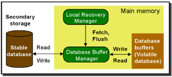
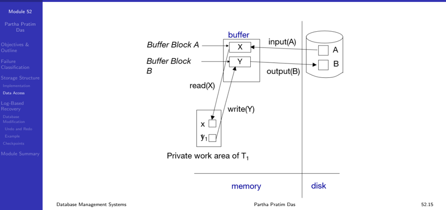
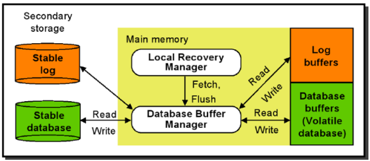
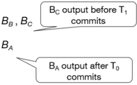
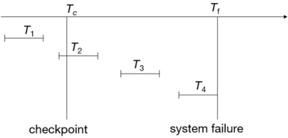

## Module 52

Partha Pratim Das

Objectives &amp; Outline

Failure Classification

Storage Structure Implementation Data Access

Log-Based Recovery

Database Modification

Undo and Redo

Example

Checkpoints

Module Summary

## Database Management Systems

Module 52: Backup &amp; Recovery/2: Recovery/1

## Partha Pratim Das

Department of Computer Science and Engineering Indian Institute of Technology, Kharagpur ppd@cse.iitkgp.ac.in

Partha Pratim Das

## Module 52

Partha Pratim Das

Objectives &amp; Outline

Failure Classification

Storage Structure

Implementation Data Access

Log-Based Recovery

Database

Modification

Undo and Redo

Example

Checkpoints

Module Summary

## Module Recap

- Learnt why having backup is essential
- Analysed different backup strategies and respective schedules
- Learnt how Hot backup of transaction log helps in recovering consistent database

## Module 52

Partha Pratim Das

Objectives &amp; Outline

Failure Classification

Storage Structure

Implementation Data Access

Log-Based Recovery

Database Modification

Undo and Redo

Example

Checkpoints

Module Summary

## Module Objectives

- We need to understand what are the possible sources for failure for transactions in a database
- Various types of storages are used for recovery from failures to ensure Atomicity, Consistency and Durability - these models need to be explored
- To understand recovery scheme based on logging
- To focus on single transactions only

## Module 52

Partha Pratim Das

Objectives &amp; Outline

Failure Classification

Storage Structure

Implementation

Data Access

Log-Based Recovery

Database Modification

Undo and Redo

Example

Checkpoints

Module Summary

## Module Outline

- Failure Classification
- Storage Structure
- Log-Based Recovery

## Module 52

Partha Pratim Das

Objectives &amp; Outline

Failure Classification

Storage Structure

Implementation

Data Access

Log-Based Recovery

Database

Modification

Undo and Redo

Example

Checkpoints

Module Summary

## Failure Classification

## Failure Classification

## Module 52

Partha Pratim Das

Objectives &amp; Outline

Failure Classification

Storage Structure

Implementation

Data Access

Log-Based Recovery

Database Modification

Undo and Redo

Example

Checkpoints

Module Summary

## Database System Recovery

- All database reads/writes are within a transaction
- Transactions have the 'ACID' properties
- Atomicity - all or nothing
- Consistency - preserves database integrity
- Isolation - execute as if they were run alone
- Durability - results are not lost by a failure
- Concurrency Control guarantees I, contributes to C
- Application program guarantees C
- Recovery subsystem guarantees A &amp; D, contributes to C

## Module 52

Partha Pratim Das

Objectives &amp; Outline

Failure Classification

Storage Structure

Implementation

Data Access

Log-Based Recovery

Database

Modification

Undo and Redo

Example

Checkpoints

Module Summary

## Failure Classification

- Transaction failure :
- Logical errors : transaction cannot complete due to some internal error condition
- System errors : the database system must terminate an active transaction due to an error condition (for example, deadlock)
- System crash : a power failure or other hardware or software failure causes the system to crash
- Fail-stop assumption : non-volatile storage contents are assumed to not be corrupted as result of a system crash
- ▷ Database systems have numerous integrity checks to prevent corruption of disk data
- Disk failure : a head crash or similar disk failure destroys all or part of disk storage
- Destruction is assumed to be detectable
- ▷ Disk drives use checksums to detect failures

## Module 52

Partha Pratim Das

Objectives &amp; Outline

Failure Classification

Storage Structure

Implementation Data Access

Log-Based Recovery

Database Modification

Undo and Redo

Example

Checkpoints

Module Summary

## Recovery Algorithms

- Consider transaction T i that transfers $ 50 from account A to account B
- Two updates: subtract 50 from A and add 50 to B
- Transaction T i requires updates to A and B to be output to the database
- A failure may occur after one of these modifications have been made but before both of them are made
- Modifying the database without ensuring that the transaction will commit may leave the database in an inconsistent state
- Not modifying the database may result in lost updates if failure occurs just after transaction commits
- Recovery algorithms have two parts
- a) Actions taken during normal transaction processing to ensure enough information exists to recover from failures
- b) Actions taken after a failure to recover the database contents to a state that ensures atomicity, consistency and durability

Database Management Systems

Partha Pratim Das

## Module 52

Partha Pratim Das

Objectives &amp; Outline

Failure Classification

Storage Structure

Implementation Data Access

Log-Based Recovery

Database

Modification

Undo and Redo

Example

Checkpoints

Module Summary

## Storage Structure

## Storage Structure

## Module 52

Partha Pratim Das

Objectives &amp; Outline

Failure Classification

## Storage Structure

Implementation

Data Access

Log-Based Recovery

Database Modification

Undo and Redo

Example

Checkpoints

Module Summary

## Storage Structure

## · Volatile Storage :

- does not survive system crashes
- examples: main memory, cache memory

## · Nonvolatile Storage :

- survives system crashes
- examples: disk, tape, flash memory, non-volatile (battery backed up) RAM
- but may still fail, losing data

## · Stable Storage :

- a mythical form of storage that survives all failures
- approximated by maintaining multiple copies on distinct non-volatile media

## Module 52

Partha Pratim Das

Objectives &amp; Outline

Failure Classification

Storage Structure

Implementation

Data Access

Log-Based Recovery

Database Modification

Undo and Redo

Example

Checkpoints

Module Summary

## Stable Storage Implementation

- Maintain multiple copies of each block on separate disks
- copies can be at remote sites to protect against disasters such as fire or flooding
- Failure during data transfer can still result in inconsistent copies. Block transfer can result in
- Successful completion
- Partial failure: destination block has incorrect information
- Total failure: destination block was never updated
- Protecting storage media from failure during data transfer (one solution):
- Execute output operation as follows (assuming two copies of each block):
- ▷ Write the information onto the 1 st physical block
- ▷ When the 1 st write is successful, write the same information onto the 2 nd physical block
- ▷ The output is completed only after the second write successfully completes

Database Management Systems

Partha Pratim Das

## Module 52

Partha Pratim Das

Objectives &amp; Outline

Failure Classification

Storage Structure

Implementation

Data Access

Log-Based Recovery

Database Modification

Undo and Redo

Example

Checkpoints

Module Summary

## Stable Storage Implementation (2)

Protecting storage media from failure during data transfer (cont.):

- Copies of a block may differ due to failure during output operation
- To recover from failure:
- First find inconsistent blocks:
- ▷ Expensive solution : Compare the two copies of every disk block
- ▷ Better solution :
- -Record in-progress disk writes on non-volatile storage (Non-volatile RAM or special area of disk)
- -Use this information during recovery to find blocks that may be inconsistent, and only compare copies of these
- -Used in hardware RAID systems
- If either copy of an inconsistent block is detected to have an error (bad checksum), overwrite it by the other copy
- If both have no error, but are different, overwrite the second block by the first block

Partha Pratim Das

## Module 52

Partha Pratim Das

Objectives &amp; Outline

Failure Classification

Storage Structure

Implementation

Data Access

Log-Based Recovery

Database Modification

Undo and Redo

Example

Checkpoints

Module Summary

## Data Access

- Physical Blocks are those blocks residing on the disk
- System Buffer Blocks are the blocks residing temporarily in main memory
- Block movements between disk and main memory are initiated through the following two operations:
- input(B) transfers the physical block B to main memory
- output(B) transfers the buffer block B to the disk, and replaces the appropriate physical block there
- We assume, for simplicity, that each data item fits in, and is stored inside, a single block

Module 52

Partha Pratim Das

Objectives &amp; Outline

Failure Classification

Storage Structure

Implementation

Data Access

Log-Based Recovery

Database Modification

Undo and Redo

Example

Checkpoints

Module Summary

## Data Access (2)

- Each transaction T i has its private work-area in which local copies of all data items accessed and updated by it are kept
- T i 's local copy of a data item X is denoted by x i
- B X denotes block containing X
- Transferring data items between system buffer blocks and its private work-area done by:
- read(X) assigns the value of data item X to the local variable x i
- write(X) assigns the value of local variable x i to data item X in the buffer block
- Transactions
- Must perform read(X) before accessing X for the first time (subsequent reads can be from local copy)
- The write(X) can be executed at any time before the transaction commits
- Note that output( B X ) need not immediately follow write(X) . System can perform the output operation when it deems fit

## Data Access (3): Example

Module 52

Partha Pratim Das

Objectives &amp; Outline

Failure Classification

Storage Structure

Implementation Data Access

Log-Based Recovery

Database Modification

Undo and Redo

Example

Checkpoints

Module Summary

## Recovery and Atomicity

- To ensure atomicity despite failures, we first output information describing the modifications to stable storage without modifying the database itself
- We study Log-based Recovery Mechanisms
- We first present key concepts
- And then present the actual recovery algorithm
- Less used alternative: Shadow Paging
- In this Module we assume serial execution of transactions
- In the next Module, we consider the case of concurrent transaction execution

## Module 52

Partha Pratim Das

Objectives &amp; Outline

Failure Classification

Storage Structure Implementation Data Access

Log-Based Recovery

Database

Modification

Undo and Redo

Example

Checkpoints

Module Summary

## Log-Based Recovery

## Log-Based Recovery

## Module 52

Partha Pratim Das

Objectives &amp; Outline

Failure Classification

Storage Structure Implementation Data Access

Log-Based Recovery

Database

Modification

Undo and Redo

Example

Checkpoints

Module Summary

## Log-Based Recovery

- A log is kept on stable storage
- The log is a sequence of log records , which maintains information about update activities on the database
- When transaction Ti starts, it registers itself by writing a record &lt; T i start &gt; to the log
- Before Ti executes write(X) , a log record &lt; T i , X , V 1 , V 2 &gt; is written, where V 1 is the value of X before the write ( old value ), and V 2 is the value to be written to X ( new value )
- When T i finishes its last statement, the log record &lt; T i commit &gt; is written

Partha Pratim Das

Module 52

Partha Pratim Das

Objectives &amp; Outline

Failure Classification

Storage Structure Implementation Data Access

Log-Based Recovery

Database Modification

Undo and Redo

Example

Checkpoints

Module Summary

## Database Modification Schemes

- The immediate-modification scheme allows updates of an uncommitted transaction to be made to the buffer, or the disk itself, before the transaction commits
- Update log record must be written before a database item is written
- ▷ We assume that the log record is output directly to stable storage
- Output of updated blocks to disk storage can take place at any time before or after transaction commit
- Order in which blocks are output can be different from the order in which they are written
- The deferred-modification scheme performs updates to buffer/disk only at the time of transaction commit
- Simplifies some aspects of recovery
- But has overhead of storing local copy
- We cover here only the immediate-modification scheme

## Module 52

Partha Pratim Das

Objectives &amp; Outline

Failure Classification

Storage Structure Implementation Data Access

Log-Based Recovery

Database Modification

Undo and Redo

Example

Checkpoints

Module Summary

## Transaction Commit

- A transaction is said to have committed when its commit log record is output to stable storage
- All previous log records of the transaction must have been output already
- Writes performed by a transaction may still be in the buffer when the transaction commits, and may be output later

Module 52

Partha Pratim

Das

Objectives &amp;

Outline

Failure

Classification

Storage Structure

Implementation

Data Access

Log-Based

Recovery

Database

Modification

Undo and Redo

Example

Checkpoints

Module Summary

## Immediate Database Modification Example

| Log                                                        | Write                                                      | Output                                                     |
|------------------------------------------------------------|------------------------------------------------------------|------------------------------------------------------------|
| <To start> <To A, 1000, 950> <To B, 2000, 2050> A = 950    | <To start> <To A, 1000, 950> <To B, 2000, 2050> A = 950    | <To start> <To A, 1000, 950> <To B, 2000, 2050> A = 950    |
| <To commit> <T, start>                                     | <To commit> <T, start>                                     | <To commit> <T, start>                                     |
| C = 600 Bc output before T, BB , Bc commits <T, commit> BA | C = 600 Bc output before T, BB , Bc commits <T, commit> BA | C = 600 Bc output before T, BB , Bc commits <T, commit> BA |
| Note: Bx denotes block containing X                        | Note: Bx denotes block containing X                        |                                                            |

## Partha Pratim Das

Module 52

Partha Pratim Das

Objectives &amp; Outline

Failure Classification

Storage Structure

Implementation

Data Access

Log-Based Recovery

Database Modification

Undo and Redo

Example

Checkpoints

Module Summary

## Undo and Redo Operations

- Undo of a log record &lt; T i , X , V 1 , V 2 &gt; writes the old value V 1 to X
- Redo of a log record &lt; T i , X , V 1 , V 2 &gt; writes the new value V 2 to X
- Undo and Redo of Transactions
- undo ( T i ) restores the value of all data items updated by T i to their old values, going backwards from the last log record for T i
- ▷ Each time a data item X is restored to its old value V a special log record (called redo-only ) &lt; T i , X , V &gt; is written out
- ▷ When undo of a transaction is complete, a log record &lt; T i abort &gt; is written out (to indicate that the undo was completed)
- redo ( T i ) sets the value of all data items updated by T i to the new values, going forward from the first log record for T i
- ▷ No logging is done in this case

## Module 52

Partha Pratim Das

Objectives &amp; Outline

Failure Classification

Storage Structure Implementation Data Access

Log-Based Recovery

Database Modification

Undo and Redo

Example Checkpoints

Module Summary

## Undo and Redo Operations (2)

- The undo and redo operations are used in several different circumstances:
- The undo is used for transaction rollback during normal operation ▷ in case a transaction cannot complete its execution due to some logical error
- The undo and redo operations are used during recovery from failure
- We need to deal with the case where during recovery from failure another failure occurs prior to the system having fully recovered

## Module 52

Partha Pratim Das

Objectives &amp; Outline

Failure Classification

Storage Structure

Implementation

Data Access

Log-Based Recovery

Database Modification

Undo and Redo

Example

Checkpoints

Module Summary

## Undo and Redo on Normal Transaction Rollback

- Let T i be the transaction to be rolled back
- Scan log backwards from the end, and for each log record of T i of the form &lt; T i , X j , V 1 , V 2 &gt;
- Perform the undo by writing V 1 to X j ,
- Write a log record &lt; T i , X j , V 1 &gt;
- ▷ such log records are called Compensation Log Records
- Once the record &lt; T i start &gt; is found stop the scan and write the log record &lt; T i abort &gt;

## Module 52

Partha Pratim Das

Objectives &amp; Outline

Failure Classification

Storage Structure

Implementation

Data Access

Log-Based Recovery

Database Modification

Undo and Redo

Example

Checkpoints

Module Summary

## Undo and Redo on Recovering from Failure

- When recovering after failure:
- Transaction T i needs to be undone if the log
- ▷ contains the record &lt; T i start &gt; ,
- ▷ but does not contain either the record &lt; T i commit &gt; or &lt; T i abort &gt;
- Transaction T i needs to be redone if the log
- ▷ contains the records &lt; T i start &gt;
- ▷ and contains the record &lt; T i commit &gt; or &lt; T i abort &gt;
- It may seem strange to redo transaction T i if the record &lt; T i abort &gt; record is in the log
- ▷ To see why this works, note that if &lt; T i abort &gt; is in the log, so are the redo-only records written by the undo operation. Thus, the end result will be to undo T i 's modifications in this case. This slight redundancy simplifies the recovery algorithm and enables faster overall recovery time
- ▷ such a redo redoes all the original actions including the steps that restored old value - Known as Repeating History

Partha Pratim Das

Module 52

Partha Pratim

Das

Objectives &amp;

Outline

Failure

Classification

Storage Structure

Implementation

Data Access

Log-Based

Recovery

Database

Modification

Undo and Redo

Example

Checkpoints

Module Summary

## Immediate Modification Recovery Example

Below we show the log as it appears at three instances of time.

| <To start> <To, A, 1000, 950> <To, B, 2000, 2050>   | <To start> <To, A, 1000, 950> <To commit> <T1 start> <T1, C, 700, 600>   | <To start> <To, A, 1000, 950> <To, B, 2000, 2050> <To commit> <T1 start> <T1, C, 700, 600> <T1 commit>   |
|-----------------------------------------------------|--------------------------------------------------------------------------|----------------------------------------------------------------------------------------------------------|
|                                                     | <To, B, 2000, 2050>                                                      |                                                                                                          |
|                                                     | (b)                                                                      |                                                                                                          |

Recovery actions in each case above are:

- (a) undo ( T 0 ): B is restored to 2000 and A to 1000, and log records &lt; T 0 , B, 2000 &gt; , &lt; T 0 , A, 1000 &gt; , &lt; T 0 , abort &gt; are written out
- (b) redo ( T 0 ) and undo ( T 1 ): A and B are set to 950 and 2050 and C is restored to 700. Log records &lt; T 1 , C, 700 &gt; , &lt; T 1 , abort &gt; are written out
- (c) redo ( T 0 ) and redo ( T 1 ): A and B are set to 950 and 2050 respectively. Then C is set to 600.

Database Management Systems

Partha Pratim Das

52.26

Module 52

Partha Pratim Das

Objectives &amp; Outline

Failure Classification

Storage Structure

Implementation Data Access

Log-Based Recovery

Database Modification

Undo and Redo

Example

Checkpoints

Module Summary

## Checkpoints

- Redoing/undoing all transactions recorded in the log can be very slow
- Processing the entire log is time-consuming if the system has run for a long time
- We might unnecessarily redo transactions which have already output their updates to the database
- Streamline recovery procedure by periodically performing checkpointing
- All updates are stopped while doing checkpointing
- a) Output all log records currently residing in main memory onto stable storage
- b) Output all modified buffer blocks to the disk
- c) Write a log record &lt; checkpoint L &gt; onto stable storage where L is a list of all transactions active at the time of checkpoint

Module 52

Partha Pratim Das

Objectives &amp; Outline

Failure Classification

Storage Structure

Implementation Data Access

Log-Based Recovery

Database Modification

Undo and Redo

Example

Checkpoints

Module Summary

## Checkpoints (2)

- During recovery we need to consider only the most recent transaction T i that started before the checkpoint, and transactions that started after T i
- Scan backwards from end of log to find the most recent &lt; checkpoint L &gt; record
- Only transactions that are in L or started after the checkpoint need to be redone or undone
- Transactions that committed or aborted before the checkpoint already have all their updates output to stable storage
- Some earlier part of the log may be needed for undo operations
- Continue scanning backwards till a record &lt; T i start &gt; is found for every transaction T i in L
- Parts of log prior to earliest &lt; T i start &gt; record above are not needed for recovery, and can be erased whenever desired

Module 52

Partha Pratim

Das

Objectives &amp;

Outline

Failure

Classification

Storage Structure

Implementation

Data Access

Log-Based

Recovery

Database

Modification

Undo and Redo

Example

Checkpoints

Module Summary

## Checkpoints (3): Example

- Any transactions that committed before the last checkpoint should be ignored
- T 1 can be ignored (updates already output to disk due to checkpoint)
- Any transactions that committed since the last checkpoint need to be redone
- T 2 and T 3 redone
- Any transaction that was running at the time of failure needs to be undone and restarted
- T 4 undone

Database Management Systems

## Module 52

Partha Pratim Das

Objectives &amp; Outline

Failure Classification

Storage Structure

Implementation

Data Access

Log-Based Recovery

Database Modification

Undo and Redo

Example

Checkpoints

Module Summary

## Module Summary

- Failures may be due to variety of sources - each needs a strategy for handling
- A proper mix and management of volatile, non-volatile and stable storage can guarantee recovery from failures and ensure Atomicity, Consistency and Durability
- Log-based recovery is efficient and effective

Slides used in this presentation are borrowed from http://db-book.com/ with kind permission of the authors.

Edited and new slides are marked with 'PPD'.