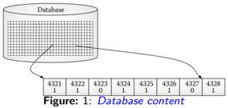
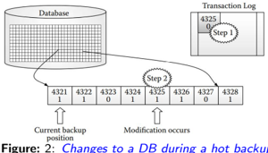
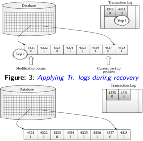
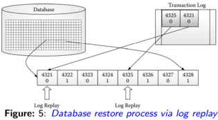
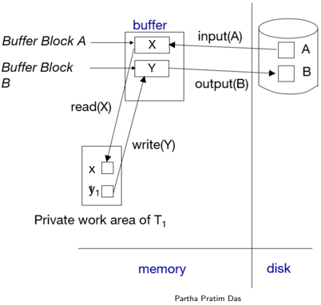
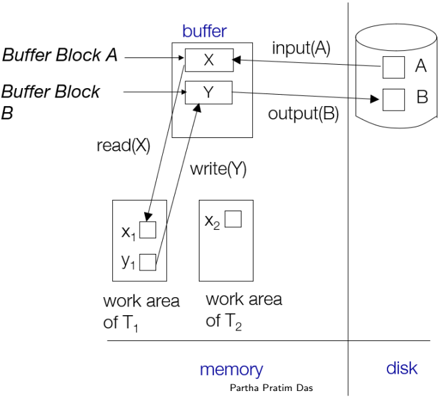
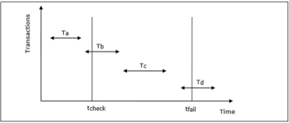
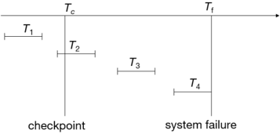
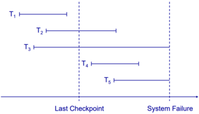
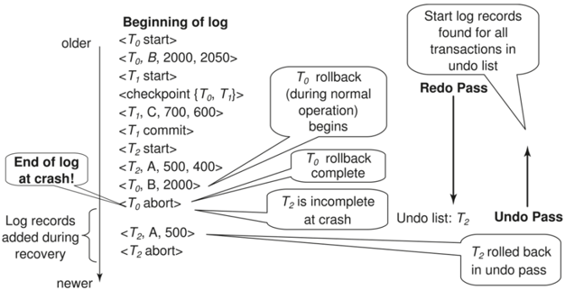

## Module 53

Partha Pratim Das

Objectives &amp; Outline

Transactional

Logging

Hot Backup

Example

Recovery

Algorithm

Data Access

Checkpoint

Redo Phase

Undo Phase

Example

Module Summary

## Database Management Systems

Module 53: Backup &amp; Recovery/3: Recovery/2

## Partha Pratim Das

Department of Computer Science and Engineering Indian Institute of Technology, Kharagpur ppd@cse.iitkgp.ac.in

Partha Pratim Das

## Module 53

Partha Pratim Das

## Objectives &amp; Outline

Transactional Logging Hot Backup Example

Recovery

Algorithm

Data Access

Checkpoint

Redo Phase

Undo Phase

Example

Module Summary

## Module Recap

- Failures may be due to variety of sources - each needs a strategy for handling
- A proper mix and management of volatile, non-volatile and stable storage can guarantee recovery from failures and ensure Atomicity, Consistency and Durability
- Log-based recovery is efficient and effective

## Module 53

Partha Pratim Das

## Objectives &amp; Outline

Transactional Logging Hot Backup Example

Recovery

Algorithm

Data Access

Checkpoint

Redo Phase

Undo Phase

Example

Module Summary

## Module Objectives

- To understand Transactional Logging with Hot Backup
- To focus on concurrent transactions and understand the recovery algorithms

## Module 53

Partha Pratim Das

## Objectives &amp; Outline

Transactional Logging Hot Backup Example

Recovery

Algorithm

Data Access

Checkpoint

Redo Phase

Undo Phase

Example

Module Summary

## Module Outline

- Transactional Logging
- Recovery Algorithm

## Module 53

Partha Pratim Das

Objectives &amp; Outline

Transactional Logging

Hot Backup

Example

Recovery

Algorithm

Data Access

Checkpoint

Redo Phase

Undo Phase

Example

Module Summary

## Transactional Logging

## Transactional Logging

Module 53

Partha Pratim Das

Objectives &amp; Outline

Transactional Logging

Hot Backup

Example

Recovery Algorithm

Data Access

Checkpoint

Redo Phase

Undo Phase

Example

Module Summary

## Hot Backup: Recap

- In systems where high availability is a requirement Hot backup is preferable wherever possible
- Hot backup refers to keeping a database up and running while the backup is performed concurrently
- Such a system usually has a module or plug-in that allows the database to be backed up while staying available to end users
- Databases which stores transactions of asset management companies, hedge funds, high frequency trading companies etc. try to implement Hot backups as these data are highly dynamic and the operations run 24x7
- Real time systems like sensor and actuator data in embedded devices, satellite transmissions etc. also use Hot backup

## Module 53

Partha Pratim Das

Objectives &amp; Outline

Transactional Logging

Hot Backup

Example

Recovery Algorithm

Data Access

Checkpoint

Redo Phase

Undo Phase

Example

Module Summary

## Transactional Logging as Hot Backup

- In regular database systems, Hot Backup is mainly used for Transaction Log Backup
- Cold backup strategies like Differential, Incremental are preferred for Data backup The reason is evident from the disadvantages of Hot backup
- Transactional Logging is used in circumstances where a possibly inconsistent backup is taken, but another file generated and backed up (after the database file has been fully backed up) can be used to restore consistency
- The information regarding data backup versions while recovery at a given point can be inferred from the Transactional Log backup set
- Thus they play a vital role in database recovery

Module 53

Partha Pratim

Das

Objectives &amp;

Outline

Transactional

Logging

Hot Backup

Example

Recovery

Algorithm

Data Access

Checkpoint

Redo Phase

Undo Phase

Example

Module Summary

## Transactional Logging with Recovery: Example

To understand how Transactional Logging works we consider Figure 1 that represents a chunk of a database just before a backup has been started

- While the backup is in progress, modifications may continue to occur to the database. For example, a request to modify the data at location ' 4325 ' to ' 0 ' arrives.
- When a request comes through to modify a part of the DB, the modifications will be written in the given order compulsorily
- 1 Transaction Log
- 2 Database (itself)

This is depicted in Figure 2

- If a crash occurs before writing to the database then the inconsistent backed up file is recovered first , and then the pending modifications in the transaction log (backed up*) are applied to re-establish consistency

*Note : The Transactional Log itself is backed up using Hot Backup the Data is backed up incrementally

## Partha Pratim Das

Database Management Systems

Module 53

Partha Pratim Das

Objectives &amp; Outline

Transactional

Logging

Hot Backup

Example

Recovery

Algorithm

Data Access

Checkpoint

Redo Phase

Undo Phase

Example

Module Summary

## Transactional Logging with Recovery: Example (2)

Consider in the previous scenario before the occurrence of crash, another request modifies the content of location ' 4321 ' to ' 0 '. Incidentally, this change gets written in the database itself (recall: Immediate Modification). This is indicated in Figure 3

Figure: 4: Recovered DB files and Tr. logs

Database Management Systems

- Figure 3 is the state of the database after which the system crashes. Note that this part has already been backed up, and hence, the backup is inconsistent with the database.
- Recovery Phase:
- Data recovery is done from the last data back up set (Figure 1)
- Log recovery is done from the Transaction Log backup set. It will be same as the current transaction log because of Hot backup
- Figure 4 shows the recovered database and log
- The recovered database is inconsistent. To re-establish consistency all transaction logs generated between the start of the backup and the end of the backup must be replayed

## Partha Pratim Das

## Module 53

Partha Pratim Das

Objectives &amp; Outline

Transactional Logging Hot Backup

Example

Recovery

Algorithm

Data Access

Checkpoint

Redo Phase

Undo Phase

Example

Module Summary

## Transactional Logging with Recovery: Example (3)

- When using transactional logging we distinguish between recover and restore :
- Recover : retrieve from the backup media the database files and transaction logs, and
- Restore : reapply database consistency based on the transaction logs
- For our restore process, we recover inconsistent database files and completed transaction logs. The recovered files will resemble the configuration shown in Figure 4
- The final database state after replaying log on the recovered database is displayed in Figure 5
- The state of database is consistent
- Note that an unnecessary log replay is shown occurring for block 4325. Whether such replays will occur is dependent on the database being used. For instance, a database vendor might choose to replay all logs because it would be faster than first determining whether a particular logged activity needs to be replayed
- Once all transaction logs have been replayed, the database is said to have been restored, that is, it is at a point where it can now be opened for user access

## Partha Pratim Das

## Module 53

Partha Pratim Das

Objectives &amp; Outline

Transactional

Logging

Hot Backup

Example

Recovery Algorithm

Data Access

Checkpoint

Redo Phase

Undo Phase

Example

Module Summary

## Recovery Algorithm

## Recovery Algorithm

## Module 53

Partha Pratim Das

Objectives &amp; Outline

Transactional

Logging

Hot Backup

Example

## Recovery Algorithm

Data Access

Checkpoint

Redo Phase

Undo Phase

Example

Module Summary

## Recovery Schemes

- So far :
- We covered key concepts
- We assumed serial execution of transactions
- Now :
- We discuss concurrency control issues
- We present the components of the basic recovery algorithm

## Module 53

Partha Pratim Das

Objectives &amp; Outline

Transactional Logging Hot Backup Example

## Recovery Algorithm

Data Access

Checkpoint

Redo Phase

Undo Phase

Example

Module Summary

## Concurrency Control and Recovery

- With concurrent transactions, all transactions share a single disk buffer and a single log
- A buffer block can have data items updated by one or more transactions
- We assume that if a transaction T i has modified an item, no other transaction can modify the same item until T i has committed or aborted
- That is, the updates of uncommitted transactions should not be visible to other transactions
- ▷ Otherwise how do we perform undo if T 1 updates A, then T 2 updates A and commits, and finally T 1 has to abort?
- Can be ensured by obtaining exclusive locks on updated items and holding the locks till end of transaction (strict two-phase locking)
- Log records of different transactions may be interspersed in the log

Module 53

Partha Pratim

Das

Objectives &amp;

Outline

Transactional

Logging

Hot Backup

Example

Recovery

Algorithm

Data Access

Checkpoint

Redo Phase

Undo Phase

Example

Module Summary

## Example of Data Access with Serial Transaction

Database Management Systems

53.14

Module 53

Partha Pratim

Das

Objectives &amp;

Outline

Transactional

Logging

Hot Backup

Example

Recovery

Algorithm

Data Access

Checkpoint

Redo Phase

Undo Phase

Example

Module Summary

## Example of Data Access with Concurrent Transactions

Database Management Systems

53.15

## Module 53

Partha Pratim Das

Objectives &amp; Outline

Transactional

Logging

Hot Backup

Example

Recovery Algorithm

Data Access

Checkpoint

Redo Phase

Undo Phase

Example

Module Summary

## Recovery Algorithm

- Logging (during normal operation):
- &lt; T i start &gt; at transaction start
- &lt; T i , X j , V 1 , V 2 &gt; for each update, and
- &lt; T i commit &gt; at transaction end

## Module 53

Partha Pratim Das

Objectives &amp; Outline

Transactional

Logging

Hot Backup

Example

Recovery Algorithm

Data Access

Checkpoint

Redo Phase

Undo Phase

Example

Module Summary

## Recovery Algorithm (2)

## · Transaction rollback (during normal operation)

- Let T i be the transaction to be rolled back
- Scan log backwards from the end, and for each log record of T i of the form &lt; T i , X j , V 1 , V 2 &gt;
- ▷ perform the undo by writing V 1 to X j ,
- ▷ write a log record &lt; T i , X j , V 1 &gt;
- . . . such log records are called Compensation Log Records (CLR)
- Once the record &lt; T i start &gt; is found stop the scan and write the log record &lt; T i abort &gt;

## Module 53

Partha Pratim Das

Objectives &amp; Outline

Transactional

Logging

Hot Backup

Example

Recovery Algorithm

Data Access

Checkpoint

Redo Phase

Undo Phase

Example

Module Summary

## Recovery Algorithm (3): Checkpoints Recap

- Let the time of checkpointing is tcheck and the time of system crash is tfail
- Let there be four transactions Ta , Tb , Tc and Td such that:
- Ta commits before checkpoint
- Tb starts before checkpoint and commits before system crash
- Tc starts after checkpoint and commits before system crash
- Td starts after checkpoint and was active at the time of system crash
- The actions that are taken by the recovery manager are:
- Nothing is done with Ta
- Transaction redo is performed for Tb and Tc
- Transaction undo is performed for Td

Source :

Distributed DBMS - Database Recovery

Database Management Systems

Module 53

Partha Pratim

Das

Objectives &amp;

Outline

Transactional

Logging

Hot Backup

Example

Recovery

Algorithm

Data Access

Checkpoint

Redo Phase

Undo Phase

Example

Module Summary

## Recovery Algorithm (4): Checkpoints Recap

- Any transactions that committed before the last checkpoint should be ignored
- T 1 can be ignored (updates already output to disk due to checkpoint)
- Any transactions that committed since the last checkpoint need to be redone
- T 2 and T 3 redone
- Any transaction that was running at the time of failure needs to be undone and restarted
- T 4 undone

Database Management Systems

## Module 53

Partha Pratim Das

Objectives &amp; Outline

Transactional

Logging

Hot Backup

Example

Recovery

Algorithm

Data Access

Checkpoint

Redo Phase

Undo Phase

Example

Module Summary

## Recovery Algorithm (5): Redo-Undo Phases

- Recovery from failure : Two phases
- Redo phase: Replay updates of all transactions, whether they committed, aborted, or are incomplete
- Undo phase: Undo phase: Undo all incomplete transactions

## Requirement:

## Database Management Systems

- Transactions of type T 1 need no recovery
- Transactions of type T 2 or T 4 need to be redone
- Transactions of type T 3 or T 5 need to be undone and restarted

## Strategy :

- Ignore T 1
- Redo T 2, T 3, T 4 and T 5
- Undo T 3 and T 5

## Partha Pratim Das

Module 53

Partha Pratim Das

Objectives &amp; Outline

Transactional Logging Hot Backup

Example

Recovery

Algorithm

Data Access

Checkpoint

Redo Phase

Undo Phase

Example

Module Summary

## Recovery Algorithm (6): Redo Phase

- Find last &lt; checkpoint L &gt; record, and set undo-list to L
- Scan forward from above &lt; checkpoint L &gt; record
- Whenever a record &lt; Ti , Xj , V 1 , V 2 &gt; is found, redo it by writing V 2 to Xj
- Whenever a log record &lt; Ti start &gt; is found, add Ti to undo-list
- Whenever a log record &lt; Ti commit &gt; or &lt; Ti abort &gt; is found, remove Ti from undo-list
- Steps for the REDO operation are:
- If the transaction has done INSERT, the recovery manager generates an insert from the log
- If the transaction has done DELETE, the recovery manager generates a delete from the log
- If the transaction has done UPDATE, the recovery manager generates an update from the log.

Source :

Distributed DBMS - Database Recovery

Module 53

Partha Pratim Das

Objectives &amp; Outline

Transactional

Logging

Hot Backup

Example

Recovery Algorithm

Data Access

Checkpoint

Redo Phase

Undo Phase

Example

Module Summary

## Recovery Algorithm (7): Undo Phase

- Scan log backwards from end
- Whenever a log record &lt; Ti , Xj , V 1 , V 2 &gt; is found where Ti is in undo-list perform same actions as for transaction rollback:
- ▷ Perform undo by writing V 1 to Xj
- ▷ Write a log record &lt; Ti , Xj , V 1 &gt;
- Whenever a log record &lt; Ti start &gt; is found where Ti is in undo-list
- ▷ Write a log record &lt; Ti abort &gt;
- ▷ Remove Ti from undo-list
- Stop when undo-list is empty
- That is, &lt; Ti start &gt; has been found for every transaction in undo-list
- Steps for the UNDO operation are:
- If the faulty transaction has done INSERT, the recovery manager deletes the data item(s) inserted
- If the faulty transaction has done DELETE, the recovery manager inserts the deleted data item(s) from the log
- If the faulty transaction has done UPDATE, the recovery manager eliminates the value by writing the before-update value from the log
- After undo phase completes, normal transaction processing can commence

Source :

Distributed DBMS - Database Recovery

Database Management Systems

Partha Pratim Das

53.22

Module 53

Partha Pratim

Das

Objectives &amp;

Outline

Transactional

Logging

Hot Backup

Example

Recovery

Algorithm

Data Access

Checkpoint

Redo Phase

Undo Phase

Example

Module Summary

## Recovery Algorithm (8): Example

Database Management Systems

Partha Pratim Das

## Module 53

Partha Pratim Das

Objectives &amp; Outline

Transactional

Logging

Hot Backup

Example

Recovery Algorithm

Data Access

Checkpoint

Redo Phase

Undo Phase

Example

Module Summary

## Module Summary

- Learnt how Hot backup of transaction log helps in recovering consistent database.
- Studied the recovery algorithms for concurrent transactions

Slides used in this presentation are borrowed from http://db-book.com/ with kind permission of the authors. Edited and new slides are marked with 'PPD'.