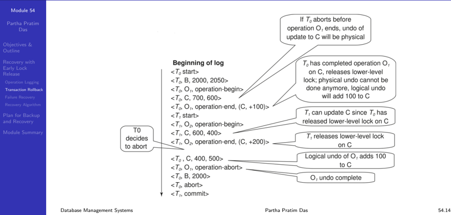
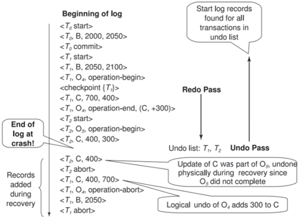

## Module 54

Partha Pratim Das

Objectives &amp; Outline

Recovery with Early Lock Release

Operation Logging

Transaction Rollback

Failure Recovery

Recovery Algorithm

Plan for Backup and Recovery

Module Summary

## Database Management Systems

Module 54: Backup &amp; Recovery/4: Recovery/3

## Partha Pratim Das

Department of Computer Science and Engineering Indian Institute of Technology, Kharagpur ppd@cse.iitkgp.ac.in

Partha Pratim Das

## Module 54

Partha Pratim Das

Objectives &amp; Outline

Recovery with Early Lock Release

Operation Logging

Transaction Rollback

Failure Recovery Recovery Algorithm

Plan for Backup and Recovery

Module Summary

## Module Recap

- Learnt how Hot backup of transaction log helps in recovering consistent database
- Studied the recovery algorithms for concurrent transactions

## Module 54

Partha Pratim Das

Objectives &amp; Outline

Recovery with Early Lock Release

Operation Logging

Transaction Rollback

Failure Recovery Recovery Algorithm

Plan for Backup and Recovery

Module Summary

## Module Objectives

- To understand Recovery with Early Lock Release
- To understand how to plan for backup and recovery

## Module 54

Partha Pratim Das

## Objectives &amp; Outline

Recovery with Early Lock Release

Operation Logging Transaction Rollback

Failure Recovery

Recovery Algorithm

Plan for Backup and Recovery

Module Summary

## Module Outline

- Recovery with Early Lock Release
- Planning Backup and Recovery

## References :

- Enterprise Systems Backup and Recovery: A Corporate Insurance Policy by Preston De Guise
- https://www.veritas.com/information-center/data-backup-and-recovery (Accessed 19-Aug-2021)
- https://www.sqlshack.com (Accessed 19-Aug-2021)

## Module 54

Partha Pratim Das

Objectives &amp; Outline

Recovery with Early Lock Release

Operation Logging

Transaction Rollback

Failure Recovery Recovery Algorithm

Plan for Backup and Recovery

Module Summary

## Recovery with Early Lock Release

## Recovery with Early Lock Release

## Module 54

Partha Pratim Das

Objectives &amp; Outline

## Recovery with Early Lock Release

Operation Logging Transaction Rollback Failure Recovery Recovery Algorithm

Plan for Backup and Recovery

Module Summary

## Recovery with Early Lock Release

- Any index used in processing a transaction , such as a B + -tree, can be treated as normal data
- To increase concurrency, the B + -tree concurrency control algorithm often allow locks to be released early, in a non-two-phase manner
- As a result of early lock release, it is possible that
- a value in a B + -tree node is updated by one transaction T 1 , which inserts an entry ( V 1 , R 1 ), and subsequently
- by another transaction T 2 , which inserts an entry ( V 2 , R 2 ) in the same node, moving the entry ( V 1 , R 1 ) even before T 1 completes execution
- At this point, we cannot undo transaction T 1 by replacing the contents of the node with the old value prior to T 1 performing its insert, since that would also undo the insert performed by T 2 ; transaction T 2 may still commit (or may have already committed)
- Hence, the only way to undo the effect of insertion of ( V 1 , R 1 ) is to execute a corresponding delete operation

Database Management Systems

## Partha Pratim Das

## Module 54

Partha Pratim Das

Objectives &amp; Outline

## Recovery with Early Lock Release

Operation Logging

Transaction Rollback

Failure Recovery

Recovery Algorithm

Plan for Backup and Recovery

Module Summary

## Recovery with Early Lock Release

- Support for high-concurrency locking techniques, such as those used for B + -tree concurrency control, which release locks early
- Supports 'logical undo'
- Recovery based on 'repeating history', whereby recovery executes exactly the same actions as normal processing
- including redo of log records of incomplete transactions, followed by subsequent undo
- Key benefits
- ▷ supports logical undo
- ▷ easier to understand/show correctness
- Early lock release is important not only for indices, but also for operations on other system data structures that are accessed and updated very frequently like:
- data structures that track the blocks containing records of a relation
- the free space in a block
- the free blocks

Database Management Systems

Partha Pratim Das

## Module 54

Partha Pratim Das

Objectives &amp; Outline

Recovery with Early Lock Release

Operation Logging

Transaction Rollback

Failure Recovery

Recovery Algorithm

Plan for Backup and Recovery

Module Summary

## Logical Undo Logging

- Operations like B + -tree insertions and deletions release locks early
- They cannot be undone by restoring old values ( physical undo ), since once a lock is released, other transactions may have updated the B + -tree
- Instead, insertions (deletions) are undone by executing a deletion (insertion) operation (known as logical undo )
- For such operations, undo log records should contain the undo operation to be executed
- Such logging is called logical undo logging , in contrast to physical undo logging ▷ Operations are called logical operations
- Other examples:
- ▷ delete of tuple, to undo insert of tuple
- -allows early lock release on space allocation information
- ▷ subtract amount deposited, to undo deposit
- -allows early lock release on bank balance

## Module 54

Partha Pratim Das

Objectives &amp; Outline

Recovery with Early Lock Release

Operation Logging

Transaction Rollback

Failure Recovery

Recovery Algorithm

Plan for Backup and Recovery

Module Summary

## Physical Redo

- Redo information is logged physically (that is, new value for each write) even for operations with logical undo
- Logical redo is very complicated since database state on disk may not be 'operation consistent' when recovery starts
- Physical redo logging does not conflict with early lock release

Module 54

Partha Pratim Das

Objectives &amp; Outline

Recovery with Early Lock Release

Operation Logging

Transaction Rollback

Failure Recovery Recovery Algorithm

Plan for Backup and Recovery

Module Summary

## Operation Logging: Process

- When operation starts, log &lt; T i , O j , operation-begin &gt; . Here O j is a unique identifier of the operation instance
- While the system is executing the operation, it creates update log records in the normal fashion for all updates performed by the operation
- the usual old-value ( physical undo information ) and new-value ( physical redo information ) is written out as usual for each update performed by the operation;
- the old-value information is required in case the transaction needs to be rolled back before the operation completes
- When operation completes, &lt; T i , O j , operation-end , U &gt; is logged, where U contains information needed to perform a logical undo information
- For example, if the operation inserted an entry in a B + -tree, the undo information U would indicate that a deletion operation is to be performed, and would identify the B + -tree and what entry to delete from the tree. This is called logical logging
- In contrast, logging of old-value and new-value information is called physical logging , and the corresponding log records are called physical log records

## Module 54

Partha Pratim Das

Objectives &amp; Outline

Recovery with Early Lock Release

Operation Logging

Transaction Rollback

Failure Recovery

Recovery Algorithm

Plan for Backup and Recovery

Module Summary

## Operation Logging (2): Example

- Insert of (key, record-id) pair (K5, RID7) into index I9

&lt;T1, 01, operation-begin&gt;

&lt;T1, X, 10, K5&gt;

Physical redo of steps in insert

&lt;T1, Y, 45, RID7 &gt;

&lt;T1, 01, operation-end; (delete 19, K5, RID7)&gt;

## Module 54

Partha Pratim Das

Objectives &amp; Outline

Recovery with Early Lock Release

Operation Logging

Transaction Rollback Failure Recovery Recovery Algorithm

Plan for Backup and Recovery

Module Summary

## Operation Logging (3)

- If crash/rollback occurs before operation completes:
- the operation-end log record is not found, and
- the physical undo information is used to undo operation
- If crash/rollback occurs after the operation completes:
- the operation-end log record is found, and in this case
- logical undo is performed using U ; the physical undo information for the operation is ignored
- Redo of operation (after crash) still uses physical redo information

Module 54

Partha Pratim Das

Objectives &amp; Outline

Recovery with Early Lock Release

Operation Logging

Transaction Rollback

Failure Recovery

Recovery Algorithm

Plan for Backup and Recovery

Module Summary

## Transaction Rollback with Logical Undo

Rollback of transaction Ti , scan the log backwards

- a) If a log record &lt; Ti , X , V 1 , V 2 &gt; is found, perform the undo and log &lt; Ti , X , V 1 &gt;
- b) If a &lt; Ti , Oj , operation-end , U &gt; record is found
- Rollback the operation logically using the undo information U
- Updates performed during roll back are logged just like during normal operation execution
- At the end of the operation rollback, instead of logging an operation-end record, generate a record &lt; Ti , Oj , operation-abort &gt;
- Skip all preceding log records for Ti until the record &lt; Ti , Oj operation-begin &gt; is found
- c) If a redo-only record is found ignore it
- d) If a &lt; Ti , Oj , operation-abort &gt; record is found: skip all preceding log records for Ti until the record &lt; Ti , Oj , operation-begin &gt; is found
- e) Stop the scan when the record &lt; Ti , start &gt; is found
- f) Add a &lt; Ti , abort &gt; record to the log
11. Note:
- Cases c) and d) above can occur only if the database crashes while a transaction is being rolled back
- Skipping of log records as in case d) is important to prevent multiple rollback of the same operation Database Management Systems Partha Pratim Das 54.13

## Transaction Rollback with Logical Undo

Module 54

Partha Pratim

Das

Objectives &amp;

Outline

Recovery with

Early Lock

Release

Operation Logging

Transaction Rollback

Failure Recovery

Recovery Algorithm

Plan for Backup and Recovery

Module Summary

## Failure Recovery with Logical Undo

Database Management Systems

Partha Pratim Das

## Module 54

Partha Pratim Das

Objectives &amp; Outline

Recovery with Early Lock Release

Operation Logging

Transaction Rollback

Failure Recovery

Recovery Algorithm

Plan for Backup and Recovery

Module Summary

## Transaction Rollback: Another Example

- Example with a complete and an incomplete operation
- &lt; T 1 , start &gt;
- &lt; T 1 , O 1 , operation-begin &gt;

. . .

- &lt; T 1 , X , 10 , K 5 &gt;
- &lt; T 1 , Y , 45 , RID 7 &gt;
- &lt; T 1 , O 1 , operation-end, (delete I 9 , K 5 , RID 7) &gt;
- &lt; T 1 , O 2 , operation-begin &gt;
- &lt; T 1 , Z , 45 , 70 &gt;
- ← T1 Rollback begins here
- &lt; T 1 , Z , 45 &gt; ← Redo-only log record during physical undo (of incomplete O2)
- &lt; T 1 , Y , . . . , . . . &gt; ← Normal redo records for logical undo of O1

. . .

- &lt; T 1 , O 1 , operation-abort &gt; ← What if crash occurred immediately after this?
- &lt; T 1 , abort &gt;

Database Management Systems

Partha Pratim Das

## Module 54

Partha Pratim Das

Objectives &amp; Outline

Recovery with Early Lock Release

Operation Logging

Transaction Rollback

Failure Recovery

Recovery Algorithm

Plan for Backup and Recovery

Module Summary

## Recovery Algorithm with Logical Undo

## Basically same as earlier algorithm, except for changes described earlier for transaction rollback

- ( Redo phase ): Scan log forward from last &lt; checkpoint L &gt; record till end of log
- Repeat history by physically redoing all updates of all transactions,
- Create an undo-list during the scan as follows
- ▷ undo-list is set to L initially
- ▷ Whenever &lt; T i start &gt; is found T i is added to undo-list
- ▷ Whenever &lt; T i commit &gt; or &lt; T i abort &gt; is found, T i is deleted from undo-list
- This brings database to state as of crash, with committed as well as uncommitted transactions having been redone
- Now undo-list contains transactions that are incomplete , that is, have neither committed nor been fully rolled back

## Module 54

Partha Pratim Das

Objectives &amp; Outline

Recovery with Early Lock Release

Operation Logging

Transaction Rollback

Failure Recovery

Recovery Algorithm

Plan for Backup and Recovery

Module Summary

## Recovery Algorithm with Logical Undo (2)

## Recovery from system crash (cont.)

- ( Undo phase ): Scan log backwards, performing undo on log records of transactions found in undo-list
- Log records of transactions being rolled back are processed as described earlier, as they are found
- ▷ Single shared scan for all transactions being undone
- When &lt; T i start &gt; is found for a transaction T i in undo-list, write a &lt; T i abort &gt; log record.
- Stop scan when &lt; T i start &gt; records have been found for all T i in undo-list
- This undoes the effects of incomplete transactions (those with neither commit nor abort log records). Recovery is now complete.

## Module 54

Partha Pratim Das

Objectives &amp; Outline

Recovery with Early Lock Release

Operation Logging

Transaction Rollback

Failure Recovery

Recovery Algorithm

Plan for Backup and Recovery

Module Summary

## Plan for Backup and Recovery

## Module 54

Partha Pratim Das

Objectives &amp; Outline

Recovery with Early Lock Release

Operation Logging

Transaction Rollback

Failure Recovery Recovery Algorithm

Plan for Backup and Recovery

Module Summary

## Plan for Backup and Recovery

## Deciding factors for having a Backup &amp; Recovery setup.

## · Data Importance

- How important is the information in your database for your company? For business-critical data you will create a plan that involves making extra copies of your database over the same period and ensuring that the copies can be easily restored when required

## · Frequency of Change

- How often does your database get updated? For instance, if critical data is modified daily then you should make a daily backup schedule.
- Speed
- How much time do you need to back up or recover your files? Recovery speed is an important factor that determines the maximum possible time period that could be spent on database backup and recovery.

Source : http://www.centriqs.com/database/database-backup-and-recovery.php

Database Management Systems

## Module 54

Partha Pratim Das

Objectives &amp; Outline

Recovery with Early Lock Release

Operation Logging Transaction Rollback Failure Recovery Recovery Algorithm

Plan for Backup and Recovery

Module Summary

## · Equipment

- Do you have necessary equipment to make backups? To perform timely backups and recoveries, you need to have proper software and hardware resources.

## · Employees

- Who will be responsible for implementing your database backup and recovery plan? Ideally, one person should be appointed for controlling and supervising the plan, and several IT specialists (e.g. system administrators) should be responsible for performing the actual backup and recovery of data.

## · Storing

- Where do you plan to store database duplicates? In case of Online/Offsite storage you can recover your systems in case of a natural disaster. Storing backups on-site is essential to quick restore. But onsite storage has capacity bottlenecks and high maintenance costs.

Source : http://www.centriqs.com/database/database-backup-and-recovery.php

Database Management Systems

## Module 54

Partha Pratim Das

Objectives &amp; Outline

Recovery with Early Lock Release

Operation Logging

Transaction Rollback

Failure Recovery

Recovery Algorithm

Plan for Backup and Recovery

Module Summary

## Module Summary

- Recovery based on operation logging supplements log-based recovery
- Planning for Backup

Slides used in this presentation are borrowed from http://db-book.com/ with kind permission of the authors.

Edited and new slides are marked with 'PPD'.