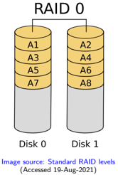
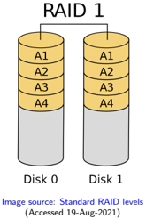
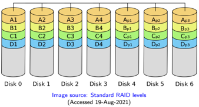
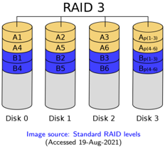
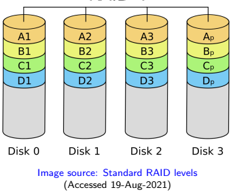
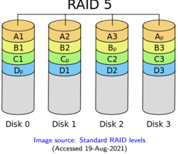
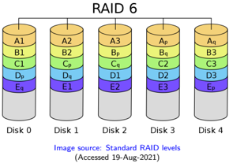
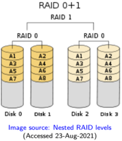
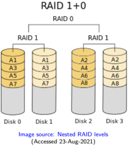
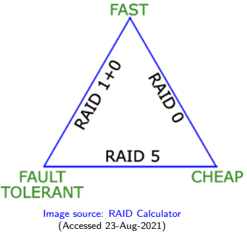

## Module 55

Partha Pratim Das

Objectives &amp; Outline

RAID

Reliability via

Redundancy

Mirroring

Striping

Parity

RAID 0

RAID 1

RAID 2

RAID 3

RAID 4

RAID 5

RAID 6

Hybrid RAID

RAID 01

RAID 10

Choice of RAID

Comparison

Module Summary

## Database Management Systems

Module 55: Backup &amp; Recovery/5: Backup/2: RAID

## Partha Pratim Das

Department of Computer Science and Engineering Indian Institute of Technology, Kharagpur ppd@cse.iitkgp.ac.in

Partha Pratim Das

## Module 55

Partha Pratim Das

Objectives &amp; Outline

RAID

Reliability via

Redundancy

Mirroring

Striping

Parity

RAID 0

RAID 1

RAID 2

RAID 3

RAID 4

RAID 5

RAID 6

Hybrid RAID

RAID 01

RAID 10

Choice of RAID

Comparison

Module Summary

## Module Recap

- Recovery based on operation logging supplements log-based recovery
- Planning for Backup

Module 55

Partha Pratim Das

Objectives &amp; Outline

RAID

Reliability via

Redundancy

Mirroring

Striping

Parity

RAID 0

RAID 1

RAID 2

RAID 3

RAID 4

RAID 5

RAID 6

Hybrid RAID

RAID 01

RAID 10

Choice of RAID

Comparison

Module Summary

## Module Objectives

- Understanding RAID: Array of redundant disks in parallel to enhance speed and reliability

## Module 55

Partha Pratim Das

Objectives &amp;

Outline

RAID

Reliability via

Redundancy

Mirroring

Striping

Parity

RAID 0

RAID 1

RAID 2

RAID 3

RAID 4

RAID 5

RAID 6

Hybrid RAID

RAID 01

RAID 10

Choice of RAID

Comparison

Module Summary

## Module Outline

- Redundant Array of Independent Disks: RAID

## Module 55

Partha Pratim

Das

Objectives &amp;

Outline

RAID

Reliability via

Redundancy

Mirroring

Striping

Parity

RAID 0

RAID 1

RAID 2

RAID 3

RAID 4

RAID 5

RAID 6

Hybrid RAID

RAID 01

RAID 10

Choice of RAID

Comparison

Module Summary

## RAID: Redundant Array of Independent Disks

## RAID: Redundant Array of Independent Disks

Partha Pratim Das

Module 55

Partha Pratim Das

Objectives &amp; Outline

RAID

Reliability via

Redundancy

Mirroring

Striping

Parity

RAID 0

RAID 1

RAID 2

RAID 3

RAID 4

RAID 5

RAID 6

Hybrid RAID

RAID 01

RAID 10

Choice of RAID

Comparison

Module Summary

## RAID: Redundant Array of Independent Disks

- Disk organization techniques that manage a large numbers of disks, providing a view of a single disk of
- high capacity and high speed by using multiple disks in parallel,
- high reliability by storing data redundantly, so that data can be recovered even if a disk fails
- The chance that some disk out of a set of n disks will fail is much higher than the chance that a specific single disk will fail
- For example, a system with 100 disks, each with MTTF of 100,000 hours (approx. 11 years), will have a system MTTF of 1000 hours (approx. 41 days)
- Techniques for using redundancy to avoid data loss are critical with large numbers of disks
- Originally a cost-effective alternative to large, expensive disks
- 'I' in RAID originally stood for inexpensive
- Today RAIDs are used for their higher reliability and bandwidth
- ▷ The 'I' is interpreted as independent

Partha Pratim Das

Module 55

Partha Pratim Das

Objectives &amp; Outline

RAID

Reliability via Redundancy

Mirroring

Striping

Parity

RAID 0

RAID 1

RAID 2

RAID 3

RAID 4

RAID 5

RAID 6

Hybrid RAID

RAID 01

RAID 10

Choice of RAID

Comparison

Module Summary

## Improvement of Reliability via Redundancy: Mirroring

- Redundancy : Store extra information that can be used to rebuild information lost in a disk failure
- Mean time to data loss depends on mean time to failure, and mean time to repair
- For example, MTTF of 100,000 hours, mean time to repair of 10 hours gives mean time to data loss of 500*106 hours (or 57,000 years) for a mirrored pair of disks (ignoring dependent failure modes)
- Mirroring (or shadowing )
- Duplicate every disk. Logical disk consists of two physical disks.
- Every write is carried out on both disks
- ▷ Reads can take place from either disk
- If one disk in a pair fails, data still available in the other
- ▷ Data loss would occur only if a disk fails, and its mirror disk also fails before the system is repaired
- -Probability of combined event is very small
- -Except for dependent failure modes such as fire or building collapse or electrical power surges

Database Management Systems

Partha Pratim Das

55.7

## Module 55

Partha Pratim Das

Objectives &amp; Outline

RAID

Reliability via

Redundancy

Mirroring

Striping

Parity

RAID 0

RAID 1

RAID 2

RAID 3

RAID 4

RAID 5

RAID 6

Hybrid RAID

RAID 01

RAID 10

Choice of RAID

Comparison

Module Summary

## Improvement of Reliability via Redundancy (2): Striping

- Bit-level Striping : Split the bits of each byte across multiple disks
- In an array of eight disks, write bit i of each byte to disk i
- Each access can read data at eight times the rate of a single disk
- But seek/access time worse than for a single disk
- ▷ Bit level striping is not used much any more
- Byte-level Striping : Each file is split up into parts one byte in size. Using n = 4 disk array as an example
- the 1 st byte would be written to the 1 st drive
- the 2 nd byte to the 2 nd drive and so on, until
- the 5 th byte is then written to the 1 st drive again and the whole process starts over
- the i th byte is then written to the ((( i -1) mod n ) + 1) th drive
- Block-level Striping : With n disks, block i of a file goes to disk ( i mod n ) + 1
- Requests for different blocks can run in parallel if the blocks reside on different disks
- A request for a long sequence of blocks can utilize all disks in parallel

Partha Pratim Das

## Module 55

Partha Pratim Das

Objectives &amp; Outline

RAID

Reliability via

Redundancy

Mirroring

Striping

Parity

RAID 0

RAID 1

RAID 2

RAID 3

RAID 4

RAID 5

RAID 6

Hybrid RAID

RAID 01

RAID 10

Choice of RAID

Comparison

Module Summary

## Improvement of Reliability via Redundancy (3): Parity

- Bit-Interleaved Parity : A single parity bit is enough for error correction, not just detection, since we know which disk has failed
- When writing data, corresponding parity bits must also be computed and written to a parity bit disk
- To recover data in a damaged disk, compute XOR of bits from other disks (including parity bit disk)
- Block-Interleaved Parity : Uses block-level striping, and keeps a parity block on a separate disk for corresponding blocks from n other disks
- When writing data block, corresponding block of parity bits must also be computed and written to parity disk
- To find value of a damaged block, compute XOR of bits from corresponding blocks (including parity block) from other disks

Module 55

Partha Pratim Das

Objectives &amp; Outline

RAID

Reliability via

Redundancy

Mirroring

Striping

Parity

RAID 0

RAID 1

RAID 2

RAID 3

RAID 4

RAID 5

RAID 6

Hybrid RAID

RAID 01

RAID 10

Choice of RAID

Comparison

Module Summary

## Standard RAID Levels

- A basic set of RAID configurations that employ the techniques of striping, mirroring, or parity to create large reliable data stores from multiple general-purpose HDDs
- The most common types are RAID 0 (striping), RAID 1 (mirroring) and its variants, RAID 5 (distributed parity), and RAID 6 (dual parity)
- Multiple RAID levels can also be combined or nested, for instance RAID 10 (striping of mirrors) or RAID 01 (mirroring stripe sets)
- RAID levels are standardized by the Storage Networking Industry Association (SNIA) in the Common RAID Disk Drive Format (DDF) standard
- The numerical values only serve as identifiers and do not signify any metric
- While most RAID levels can provide good protection against and recovery from hardware defects or defective sectors/read errors (hard errors), they do not provide any protection against data loss due to catastrophic failures (fire, water) or soft errors such as user error, software malfunction, or malware infection
- For valuable data, RAID is only one building block of a larger data loss prevention and recovery scheme - it cannot replace a backup plan

Source :

Standard RAID levels (Accessed 24-Aug-2021)

Database Management Systems

Partha Pratim Das

## Module 55

Partha Pratim Das

Objectives &amp; Outline

RAID

Reliability via

Redundancy

Mirroring

Striping

Parity

RAID 0

RAID 1

RAID 2

RAID 3

RAID 4

RAID 5

RAID 6

Hybrid RAID

RAID 01

RAID 10

Choice of RAID

Comparison

Module Summary

## RAID 0: Striping

- RAID level-0 only uses data striping , no redundant information is maintained
- If one disk fails, then all data in the disk array is lost
- Independent of the number of data disks, the effective space utilization for a RAID Level-0 system is always 100 percent
- RAID Level-0 has the best write performance of all RAID levels because the absence of redundant information implies that no redundant information needs to be updated.
- This solution is the least costly
- Reliability is very poor

Source : Database Management Systems by Raghu Ramakrishnan and Johannes Gehrke

## Module 55

Partha Pratim Das

Objectives &amp; Outline

RAID

Reliability via

Redundancy

Mirroring

Striping

Parity

RAID 0

RAID 1

RAID 2

RAID 3

RAID 4

RAID 5

RAID 6

Hybrid RAID

RAID 01

RAID 10

Choice of RAID

Comparison

Module Summary

## RAID 1: Mirroring

- RAID 1 employs mirroring , maintaining two identical copies of the data on two different disks
- It is the most expensive solution
- It provides excellent fault tolerance
- Every write of a disk block involves a write on both disks
- With two copies of each block exist on different disks, we can distribute reads between the two disks and allow parallel reads
- RAID Level-1 does not stripe the data over different disks. Thus the transfer rate for a single request is comparable to the transfer rate of a single disk
- The effective space utilization is 50 percent, independent of the number of data disks

Source : Database Management Systems by Raghu Ramakrishnan and Johannes Gehrke

Database Management Systems

## Partha Pratim Das

## Module 55

Partha Pratim Das

Objectives &amp; Outline

RAID

Reliability via

Redundancy

Mirroring

Striping

Parity

RAID 0

RAID 1

RAID 2

RAID 3

RAID 4

RAID 5

RAID 6

Hybrid RAID

RAID 01

RAID 10

Choice of RAID

Comparison

Module Summary

## RAID 2: Parity

- RAID 2 uses designated drive for parity
- In RAID 2, the striping unit is a single bit
- Hamming Code is used for parity
- Hamming codes can detect up to two-bit errors or correct one-bit errors
- For a 4-bit data, 3 bits are added
- Simple parity code cannot correct errors, and can detect only an odd number of bits in error
- In a disk array with D data disks, the smallest unit of transfer for a read is a set of D blocks. It is so because each bit of the data is stored in different blocks of D disks subsequently (Bit-level striping)
- Writing a block involves reading D blocks into main memory, modifying D + C blocks, and writing D + C blocks to disk, where C is the number of check disks. This sequence of steps is called a read-modify-write cycle

Source : Database Management Systems by Raghu Ramakrishnan and Johannes Gehrke

Database Management Systems

## RAID 2

## Module 55

Partha Pratim Das

Objectives &amp; Outline

RAID

Reliability via

Redundancy

Mirroring

Striping

Parity

RAID 0

RAID 1

RAID 2

RAID 3

RAID 4

RAID 5

RAID 6

Hybrid RAID

RAID 01

RAID 10

Choice of RAID

Comparison

Module Summary

## RAID 3: Byte Striping + Parity

- RAID 3 has a single check disk with parity information. Thus, the reliability overhead for RAID 3 is a single disk, the lowest overhead possible
- RAID 3 consists of byte-level striping with dedicated parity . Therefore the data transfer rate of this level is high because data can be accessed in parallel
- RAID-3 cannot service multiple requests simultaneously: This is so because any single block of data will be spread across all members of the set and will reside in the same physical location on each disk and thus every single I/O request has to be addressed by working on every disk in the array

Source : Database Management Systems by Raghu Ramakrishnan and Johannes Gehrke

Database Management Systems

## Module 55

Partha Pratim Das

Objectives &amp; Outline

RAID

Reliability via

Redundancy

Mirroring

Striping

Parity

RAID 0

RAID 1

RAID 2

RAID 3

RAID 4

RAID 5

RAID 6

Hybrid RAID

RAID 01

RAID 10

Choice of RAID

Comparison

Module Summary

## RAID 4: Block Striping + Parity

- RAID 4 has a striping unit of a disk block instead of a single bit, as in RAID 3
- Read requests of the size of a disk block can be served entirely by the disk where the requested block resides therefore RAID 4 provides good performance for data reads
- Provides recovery of corrupted or lost data using XOR recovery mechanism
- If a disk experiences a failure, recovery can be made by simply XORing all the remaining data bits and the parity bit
- Facilitates recovery of at most 1 disk failure . At this level, if more than one disk fails, then there is no way to recover the data
- Write performance is low due to the need to write all parity data to a single disk

Source : Database Management Systems by Raghu Ramakrishnan and Johannes Gehrke Database Management Systems

## RAID 4

## Module 55

Partha Pratim Das

Objectives &amp; Outline

RAID

Reliability via

Redundancy

Mirroring

Striping

Parity

RAID 0

RAID 1

RAID 2

RAID 3

RAID 4

RAID 5

RAID 6

Hybrid RAID

RAID 01

RAID 10

Choice of RAID

Comparison

Module Summary

## RAID 5: Distributed Parity

- RAID 5 improves upon RAID 4 by distributing the parity blocks uniformly over all disks instead of storing them on a single check disk
- Several write requests can potentially be processed in parallel since the bottleneck of a unique check disk has been eliminated
- Read requests have a higher level of parallelism. Since the data is distributed over all disks, read requests involve all disks, whereas, in systems with a dedicated check disk, the check disk never participates in reads
- This level too allows recovery of only 1 disk failure like level 4

Source : Database Management Systems by Raghu Ramakrishnan and Johannes Gehrke

## Module 55

Partha Pratim Das

Objectives &amp; Outline

## RAID

Reliability via

Redundancy

Mirroring

Striping

Parity

RAID 0

RAID 1

RAID 2

RAID 3

RAID 4

RAID 5

RAID 6

Hybrid RAID

RAID 01

RAID 10

Choice of RAID

Comparison

Module Summary

## RAID 6: Dual Parity

- RAID 6 extends RAID 5 by adding another parity block, thus it uses block-level striping with two parity blocks distributed across all member disks
- Write performance of RAID 6 is poorer than RAID 5 because of the increased complexity of parity calculation
- RAID 6 use Reed-Solomon Codes to recover from up to two simultaneous disk failures. Therefore it can handle a disk failure during recovery of a failed disk

Source :

Database Management Systems by Raghu Ramakrishnan and Johannes Gehrke, Standard RAID levels

Module 55

Partha Pratim Das

Objectives &amp; Outline

RAID

Reliability via

Redundancy

Mirroring

Striping

Parity

RAID 0

RAID 1

RAID 2

RAID 3

RAID 4

RAID 5

RAID 6

Hybrid RAID

RAID 01

RAID 10

Choice of RAID

Comparison

Module Summary

## Hybrid RAID: Nested RAID levels

- Nested RAID levels (Hybrid RAID) , combine two or more of the standard RAID levels to gain performance, additional redundancy or both, as a result of combining properties of different standard RAID layouts.
- Nested RAID levels are usually numbered using a series of numbers
- The first number in the numeric designation denotes the lowest RAID level in the 'stack', while
- the rightmost one denotes the highest layered RAID level
- For example, RAID 50 layers the data striping of RAID 0 on top of the distributed parity of RAID 5
- Nested RAID levels include RAID 01, RAID 10, RAID 100, RAID 50 and RAID 60, which all combine data striping with other RAID techniques
- As a result of the layering scheme, RAID 01 and RAID 10 represent significantly different nested RAID levels

Source :

Nested RAID levels (Accessed 23-Aug-2021)

Database Management Systems

Partha Pratim Das

Module 55

Partha Pratim Das

Objectives &amp; Outline

RAID

Reliability via

Redundancy

Mirroring

Striping

Parity

RAID 0

RAID 1

RAID 2

RAID 3

RAID 4

RAID 5

RAID 6

Hybrid RAID

RAID 01

RAID 10

Choice of RAID

Comparison

Module Summary

## RAID 01 (RAID 0+1): Mirror of Stripes

- RAID 01 is a mirror of stripes
- It achieves both replication and sharing of data between disks
- The usable capacity of a RAID 01 array is the same as in a RAID 1 array made of the same drives, in which one half of the drives is used to mirror the other half: ( N / 2) · S min , where N is the total number of drives and S min is the capacity of the smallest drive in the array
- At least four disks are required in a standard RAID 01 configuration , but larger arrays are also used

Source : Nested RAID levels

(Accessed 23-Aug-2021)

Module 55

Partha Pratim Das

Objectives &amp; Outline

RAID

Reliability via

Redundancy

Mirroring

Striping

Parity

RAID 0

RAID 1

RAID 2

RAID 3

RAID 4

RAID 5

RAID 6

Hybrid RAID

RAID 01

RAID 10

Choice of RAID

Comparison

Module Summary

## RAID 10 (RAID 1+0): Stripe of Mirrors

- RAID 10 is a stripe of mirrors
- RAID 10 is a RAID 0 array of mirrors, which may be two- or three-way mirrors, and requires a minimum of four drives
- RAID 10 provides better throughput and latency than all other RAID levels except RAID 0 (which wins in throughput)
- Thus, it is the preferable RAID level for I/O-intensive applications such as database, email, and web servers, as well as for any other use requiring high disk performance

Source : Nested RAID levels

(Accessed 23-Aug-2021)

## Module 55

Partha Pratim Das

Objectives &amp; Outline

RAID

Reliability via

Redundancy

Mirroring

Striping

Parity

RAID 0

RAID 1

RAID 2

RAID 3

RAID 4

RAID 5

RAID 6

Hybrid RAID

RAID 01

RAID 10

Choice of RAID

Comparison

Module Summary

## Choice of RAID Levels

- Different RAID Levels have different speed and fault tolerance properties
- RAID level 0 is not fault tolerant
- Levels 1, 1E, 5, 50, 6, 60, and 1+0 are fault tolerant to a different degree - should one of the hard drives in the array fail, the data is still reconstructed on the fly and no access interruption occurs
- RAID levels 2, 3, and 4 are theoretically defined but not used in practice
- There are some more complex layouts like RAID 5E/5EE (integrating some spare space) and RAID DP
- 'E' often stands for 'Enhanced' or 'Extended'
- Some of them use hot spare drives

## Module 55

Partha Pratim Das

Objectives &amp; Outline

RAID

Reliability via

Redundancy

Mirroring

Striping

Parity

RAID 0

RAID 1

RAID 2

RAID 3

RAID 4

RAID 5

RAID 6

Hybrid RAID

RAID 01

RAID 10

Choice of RAID

Comparison

Module Summary

## Choice of RAID Levels (2)

- Factors in choosing RAID level
- Monetary cost
- Performance : Number of I/O operations per second, and bandwidth during normal operation
- Performance during failure
- Performance during rebuild of failed disk
- ▷ Including time taken to rebuild failed disk
- RAID 0 is used only when data safety is not important
- For example, data can be recovered quickly from other sources
- Level 2 and 4 never used since they are subsumed by 3 and 5
- Level 3 is not used anymore since bit-striping forces single block reads to access all disks, wasting disk arm movement, which block striping (Level 5) avoids
- Level 6 is rarely used since levels 1 and 5 offer adequate safety for most applications

## Module 55

Partha Pratim Das

Objectives &amp; Outline

RAID

Reliability via

Redundancy

Mirroring

Striping

Parity

RAID 0

RAID 1

RAID 2

RAID 3

RAID 4

RAID 5

RAID 6

Hybrid RAID

RAID 01

RAID 10

Choice of RAID

Comparison

Module Summary

## Choice of RAID Levels (3)

- Level 1 provides much better write performance than level 5
- Level 5 requires at least 2 block reads and 2 block writes to write a single block, whereas Level 1 only requires 2 block writes
- Level 1 preferred for high update environments such as log disks
- Level 1 had higher storage cost than level 5
- disk drive capacities increasing rapidly (50%/year) whereas disk access times have decreased much less (x 3 in 10 years)
- I/O requirements have increased greatly, e.g. for Web servers
- When enough disks have been bought to satisfy required rate of I/O, they often have spare storage capacity
- ▷ so there is often no extra monetary cost for Level 1!
- Level 5 is preferred for applications with low update rate, and large amounts of data
- Level 1 is preferred for all other applications

Partha Pratim Das

Module 55

Partha Pratim

Das

Objectives &amp;

Outline

RAID

Reliability via

Redundancy

Mirroring

Striping

Parity

RAID 0

RAID 1

RAID 2

RAID 3

RAID 4

RAID 5

RAID 6

Hybrid RAID

RAID 01

RAID 10

Choice of RAID

Comparison

Module Summary

## Comparison of RAID: Theoretical

| Level   | Description                                               | Min. [ b ] #   | Space Efficiency   | Fault Tolerance   | Performance                  | Performance                                 |
|---------|-----------------------------------------------------------|----------------|--------------------|-------------------|------------------------------|---------------------------------------------|
|         |                                                           | of drives      |                    |                   | Read                         | Write                                       |
|         |                                                           |                |                    | ( Drives )        | ( as factor of single disk ) | ( as factor of single disk )                |
| RAID 0  | Block-level striping without parity or mirroring          | 2              | 1                  | None              | n                            | n                                           |
| RAID 1  | Mirroring without parity or striping                      | 2              | 1 n                | n - 1             | n [ a ]                      | 1 [ c ]                                     |
| RAID 2  | Bit-level striping with Hamming code for error correction | 3              | 1 - 1 n lg( n +1)  | One [ d ]         | Depends                      | Depends                                     |
| RAID 3  | Byte-level striping with dedicated parity                 | 3              | 1 - 1 n            | One               | n - 1                        | n - 1 [ e ]                                 |
| RAID 4  | Block-level striping with dedicated parity                | 3              | 1 - 1 n            | One               | n - 1                        | n - 1 [ e ]                                 |
| RAID 5  | Block-level striping with distributed parity              | 3              | 1 - 1 n            | One               | n [ e ]                      | single sector: 1 4 full stripe: n - 1 [ e ] |
| RAID 6  | Block-level striping with double distributed parity       | 4              | 1 - 2 n            | Two               | n [ e ]                      | single sector: 1 6 full stripe: n - 2 [ e ] |

- [a] Theoretical maximum, as low as single-disk performance in practice
- [b] Assumes a non-degenerate minimum number of drives
- [c] If disks with different speeds are used in a RAID 1 array, overall write performance is equal to the speed of the slowest disk
- [d] RAID 2 can recover from one drive failure or repair corrupt data or parity when a corrupted bit's corresponding data and parity are good
- [e] Assumes hardware capable of performing associated calculations fast enough

Source :

Standard RAID levels (Accessed 23-Aug-2021)

Database Management Systems

Partha Pratim Das

55.24

Module 55

Partha Pratim

Das

Objectives &amp;

Outline

RAID

Reliability via

Redundancy

Mirroring

Striping

Parity

RAID 0

RAID 1

RAID 2

RAID 3

RAID 4

RAID 5

RAID 6

Hybrid RAID

RAID 01

RAID 10

Choice of RAID

Comparison

Module Summary

## Comparison of RAID: Practical

| Features             | RAID 0                                                                         | RAID 1                                   | RAID 5                                 | RAID 6                                                                                              | RAID 10                                           |
|----------------------|--------------------------------------------------------------------------------|------------------------------------------|----------------------------------------|-----------------------------------------------------------------------------------------------------|---------------------------------------------------|
| Minimum # of drives  | 2                                                                              | 2                                        | 3                                      | 4                                                                                                   | 4                                                 |
| Fault tolerance      | None                                                                           | Single-drive failure                     | Single-drive failure                   | Two-drive failure                                                                                   | Up to 1 disk failure in each sub-array            |
| Read performance     | High                                                                           | Medium                                   | Low                                    | Low                                                                                                 | High                                              |
| Write Performance    | High                                                                           | Medium                                   | Low                                    | Low                                                                                                 | Medium                                            |
| Capacity utilization | 100%                                                                           | 50%                                      | 67% - 94%                              | 50% - 88%                                                                                           | 50%                                               |
| Typical applications | High end workstations, data logging, real-time rendering, very transitory data | Operating systems, transaction databases | Data warehouse, web servers, archiving | Data archive, backup to disk, high availability solutions, servers with large capacity requirements | Fast databases, file servers, application servers |

Source :

RAID Level Comparison: RAID 0, RAID 1, RAID 5, RAID 6 and RAID 10 (Accessed 23-Aug-2021)

## Partha Pratim Das

Module 55

Partha Pratim Das

Objectives &amp; Outline

RAID

Reliability via

Redundancy

Mirroring

Striping

Parity

RAID 0

RAID 1

RAID 2

RAID 3

RAID 4

RAID 5

RAID 6

Hybrid RAID

RAID 01

RAID 10

Choice of RAID

Comparison

Module Summary

## What Does RAID Not Do?

- RAID does not equate to 100% uptime : Nothing can. RAID is another tool on in the toolbox meant to help minimize downtime and availability issues. There is still a risk of a RAID card failure, though that is significantly lower than a HDD failure
- RAID does not replace backups : Nothing can replace a well planned and frequently tested backup implementation!
- RAID does not protect against data corruption, human error, or security issues : While it can protect you against a drive failure, there are innumerable reasons for keeping backups. So RAID is not a replacement for backups
- RAID does not necessarily allow to dynamically increase the size of the array : If you need more disk space, you cannot simply add another drive to the array. You are likely going to have to start from scratch, rebuilding/reformatting the array. Luckily, Steadfast engineers are here to help you architect and execute whatever systems you need to keep your business running.
- RAID isn't always the best option for virtualization and high-availability failover : You will want to look at SAN solutions

Source : (Almost) Everything You Need to Know About RAID Database Management Systems

Partha Pratim Das

## Module 55

Partha Pratim Das

Objectives &amp; Outline

RAID

Reliability via

Redundancy

Mirroring

Striping

Parity

RAID 0

RAID 1

RAID 2

RAID 3

RAID 4

RAID 5

RAID 6

Hybrid RAID

RAID 01

RAID 10

Choice of RAID

Comparison

Module Summary

## Module Summary

- Understood RAID - array of redundant disks in parallel to enhance speed and reliability

Slides used in this presentation are borrowed from http://db-book.com/ with kind permission of the authors.

Edited and new slides are marked with 'PPD'.