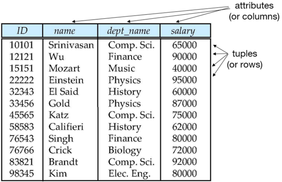
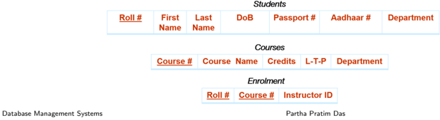
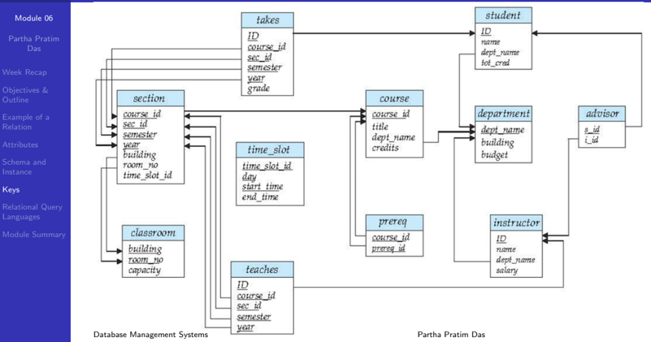

## Module 06

Partha Pratim Das

Week Recap

Objectives &amp; Outline

Example of a Relation

Attributes

Schema and Instance

Keys

Relational Query Languages

Module Summary

Database Management Systems

## Database Management Systems

Module 06: Introduction to Relational Model/1

## Partha Pratim Das

Department of Computer Science and Engineering Indian Institute of Technology, Kharagpur ppd@cse.iitkgp.ac.in

Partha Pratim Das

## Module 06

Partha Pratim Das

Week Recap

Objectives &amp; Outline

Example of a Relation

Attributes

Schema and Instance

Keys

Relational Query Languages

Module Summary

## Week Recap

- The proliferation of DBMS in wide range of applications provide motivation to study the subject
- Know Your Course provided information about prerequisites, outline and text book
- The specific need for a DBMS discussed in contrast to a file system based application using a programming language like Python
- Basic notions of a DBMS are introduced

## Module 06

Partha Pratim Das

Week Recap

Objectives &amp; Outline

Example of a Relation

Attributes

Schema and Instance

Keys

Relational Query Languages

Module Summary

## Module Objectives

- To understand attributes and their types
- To understand the mathematical structure of relational model
- Schema
- Instance
- Keys
- To familiarize with different types of relational query languages

## Module 06

Partha Pratim Das

Week Recap

Objectives &amp; Outline

Example of a Relation

Attributes

Schema and Instance

Keys

Relational Query Languages

Module Summary

## Module Outline

- Attribute Types
- Relation Schema and Instance
- Keys
- Relational Query Languages

Module 06

Partha Pratim

Das

Week Recap

Objectives &amp;

Outline

Example of a

Relation

Attributes

Schema and

Instance

Keys

Relational Query

Languages

Module Summary

## Example of a Relation

| attributes (or columns)                                     | attributes (or columns)                                                          | attributes (or columns)                                                                                  | attributes (or columns)                                                 | attributes (or columns)   |
|-------------------------------------------------------------|----------------------------------------------------------------------------------|----------------------------------------------------------------------------------------------------------|-------------------------------------------------------------------------|---------------------------|
| ID                                                          | name                                                                             | dept_name                                                                                                | salary                                                                  |                           |
| 10101 12121 15151 22222 45565 58583 76543 76766 83821 98345 | Srinivasan Wu Mozart Einstein El Said Gold Katz Califieri Singh Crick Brandt Kim | Comp. Sci. Finance Music Physics History Physics Comp. Sci. History Finance Sci. Elec. Biology Comp. Eng | 65000 90000 40000 95000 60000 87000 75000 62000 80000 72000 92000 80000 | tuples (or rows)          |

Database Management Systems

Partha Pratim Das

## Module 06

Partha Pratim Das

Week Recap

Objectives &amp; Outline

Example of a Relation

Attributes

Schema and Instance

Keys

Relational Query Languages

Module Summary

## Attributes

## Attributes

## Module 06

Partha Pratim Das

Week Recap

Objectives &amp; Outline

Example of a Relation

Attributes

Schema and

Instance

Keys

Relational Query Languages

Module Summary

## Attribute Types

- Consider
- Students = Roll # , First Name , Last Name , DoB , Passport # , Aadhaar # , Department relation
- The set of allowed values for each attribute is called the domain of the attribute
- Roll #: Alphanumeric string
- First Name, Last Name: Alpha String
- DoB:

Date

- ◦
- Passport #:
- Aadhaar #:

String (Letter followed by 7 digits) - nullable (optional)

12-digit number

- Department:
- Alpha String
- Attribute values are (normally) required to be atomic ; that is, indivisible
- The special value null is a member of every domain. Indicates that the value is unknown
- The null value may cause complications in the definition of many operations

## Partha Pratim Das

## Module 06

Partha Pratim Das

Week Recap

Objectives &amp; Outline

Example of a Relation

Attributes

Schema and Instance

Keys

Relational Query Languages

Module Summary

## Attribute Types

- For

Students = Roll # , First Name , Last Name , DoB , Passport # , Aadhaar # , Department

- And domain of the attributes as:
- Roll #: Alphanumeric string
- First Name, Last Name: Alpha String
- DoB: Date
- Passport #: String (Letter followed by 7 digits) - nullable (optional)
- Aadhaar #:

12-digit number

- Department: Alpha String

| Roll #    | First Name   | Last Name   | DoB         | Passport #   | Aadhaar #      | Department   |
|-----------|--------------|-------------|-------------|--------------|----------------|--------------|
| 15CS10026 | Lalit        | Dubey       | 27-Mar-1997 | L4032464     | 1728-6174-9239 | Computer     |
| 16EE30029 | Jatin        | Chopra      | 17-Nov-1996 | null         | 3917-1836-3816 | Electrical   |

## Database Management Systems

## Partha Pratim Das

Module 06

Partha Pratim Das

Week Recap

Objectives &amp; Outline

Example of a Relation

Attributes

Schema and Instance

Keys

Relational Query Languages

Module Summary

## Schema and Instance

## Module 06

Partha Pratim Das

Week Recap

Objectives &amp; Outline

Example of a Relation

Attributes

Schema and Instance

Keys

Relational Query Languages

Module Summary

## Relation Schema and Instance

- A 1 , A 2 , · · · , A n are attributes
- R = ( A 1 , A 2 , · · · , A n ) is a relation schema Example: instructor = ( ID , name , dept name , salary )
- Formally, given sets D 1 , D 2 , · · · , D n a relation r is a subset of

<!-- formula-not-decoded -->

Thus, a relation is a set of n -tuples ( a 1 , a 2 , · · · , a n ) where each a i ∈ D i

- The current values ( relation instance ) of a relation are specified by a table
- An element t of r is a tuple, represented by a row in a table
- •
- Example:

instructor ≡ ( String (5) × String × String × Number +), where ID ∈ String (5), name ∈ String , dept name ∈ String , and salary ∈ Number +

Partha Pratim Das

Module 06

Partha Pratim Das

Week Recap

Objectives &amp; Outline

Example of a Relation

Attributes

Schema and Instance

Keys

Relational Query

Languages

Module Summary

## Relations are Unordered with Unique Tuples

- Order of tuples / rows is irrelevant (tuples may be stored in an arbitrary order)
- No two tuples / rows may be identical
- Example: instructor relation with unordered tuples

|    ID | name       | dept_name   |   salary |
|-------|------------|-------------|----------|
| 22222 | Einstein   | Physics     |    95000 |
| 12121 | Wu         | Finance     |    90000 |
| 32343 | El Said    | History     |    60000 |
| 45565 | Katz       | Sci. Comp.  |    75000 |
| 98345 | Kim        | Elec.       |    80000 |
| 76766 | Crick      | Biology     |    72000 |
| 10101 | Srinivasan | Sci. Comp.  |    65000 |
| 58583 | Califieri  | History     |    62000 |
| 83821 | Brandt     | Sci. Comp.  |    92000 |
| 15151 | Mozart     | Music       |    40000 |
| 33456 | Gold       | Physics     |    87000 |
| 76543 | Singh      | Finance     |    80000 |

Database Management Systems

Partha Pratim Das

## Module 06

Partha Pratim Das

Week Recap

Objectives &amp; Outline

Example of a Relation

Attributes

Schema and

Instance

Keys

Relational Query Languages

Module Summary

## Keys

## Keys

## Module 06

Partha Pratim Das

Week Recap

Objectives &amp; Outline

Example of a Relation

Attributes

Schema and Instance

Keys

Relational Query Languages

Module Summary

## Keys

- Let K ⊆ R , where R is the set of attributes in the relation
- K is a superkey of R if values for K are sufficient to identify a unique tuple of each possible relation r ( R )
- Example: { ID } and { ID , name } are both superkeys of instructor
- Superkey K is a candidate key if K is minimal
- Example: { ID } is a candidate key for instructor
- One of the candidate keys is selected to be the primary key
- Which one?
- A surrogate key (or synthetic key) in a database is a unique identifier for either an entity in the modeled world or an object in the database
- The surrogate key is not derived from application data, unlike a natural (or business ) key which is derived from application data

Module 06

Partha Pratim Das

Week Recap

Objectives &amp; Outline

Example of a Relation

Attributes

Schema and Instance

Keys

Relational Query Languages

Module Summary

## Keys

- Students = Roll # , First Name , Last Name , DoB , Passport # , Aadhaar # , Department
- Super Key: Roll #, { Roll #, DoB }
- Candidate Keys: Roll #, { First Name, Last Name } , Aadhaar#
- Passport # cannot be a key. Why?
- Null values are allowed for Passport # (a student may not have a passport)
- Primary Key: Roll #
- Can Aadhaar# be a key?
- It may suffice for unique identification. But Roll# may have additional useful information. For example: 14CS92P01
- glyph[triangleright] Read 14CS92P01 as 14-CS-92-P-01
- glyph[triangleright] 14: Admission in 2014
- glyph[triangleright] CS: Department = CS
- glyph[triangleright] 92: Category of Student
- glyph[triangleright] P: Type of admission: Project
- glyph[triangleright] 01: Serial Number

## Module 06

Partha Pratim Das

Week Recap

Objectives &amp; Outline

Example of a Relation

Attributes

Schema and Instance

Keys

Relational Query Languages

Module Summary

## Keys

- Secondary / Alternate Key: { First Name, Last Name } , Aadhaar #
- Simple Key: Consists of a single attribute
- Composite Key: { First Name, Last Name }
- Consists of more than one attribute to uniquely identify an entity occurrence
- One or more of the attributes, which make up the key, are not simple keys in their own right

| Roll#     | First Name   | Last Name   | DoB         | Passport #   | Aadhaar #      | Department   |
|-----------|--------------|-------------|-------------|--------------|----------------|--------------|
| 15CS10026 | Lalit        | Dubey       | 27-Mar-1997 | L4032464     | 1728-6174-9239 | Computer     |
| 16EE30029 | Jatin        | Chopra      | 17-Nov-1996 | null         | 3917-1836-3816 | Electrical   |
| 15EC10016 | Smriti       | Mongra      | 23-Dec-1996 | G5432849     | 2045-9271-0914 | Electronics  |
| 16CE10038 | Dipti        | Dutta       | 02-Feb-1997 | null         | 5719-1948-2918 | Civil        |
| 15CS30021 | Ramdin       | Minz        | 10-Jan-1997 | X8811623     | 4928-4927-5924 | Computer     |

Database Management Systems

Partha Pratim Das

## Module 06

Partha Pratim Das

Week Recap

Objectives &amp; Outline

Example of a Relation

Attributes

Schema and Instance

Keys

Relational Query

Languages

Module Summary

## Keys

- Foreign key constraint: Value in one relation must appear in another
- Referencing relation
- glyph[triangleright] Enrolment: Foreign Keys - Roll #, Course #
- Referenced relation
- glyph[triangleright] Students, Courses
- A compound key consists of more than one attribute to uniquely identify an entity occurrence
- Each attribute, which makes up the key, is a simple key in its own right
- { Roll #, Course # }

## Schema Diagram for University Database

Module 06

Partha Pratim Das

Week Recap

Objectives &amp; Outline

Example of a Relation

Attributes

Schema and Instance

Keys

Relational Query Languages

Module Summary

## Relational Query Languages

## Relational Query Languages

Partha Pratim

## Module 06 Das

Week Recap

Objectives &amp; Outline

Example of a Relation

Attributes

Schema and Instance

Keys

Relational Query Languages

Module Summary

## Relational Query Languages

## Procedural viz-a-viz Non-procedural or Declarative Paradigms

- Procedural programming requires that the programmer tell the computer what to do
- That is, how to get the output for the range of required inputs
- The programmer must know an appropriate algorithm
- Declarative programming requires a more descriptive style
- The programmer must know what relationships hold between various entities

## Module 06

Partha Pratim Das

Week Recap

Objectives &amp; Outline

Example of a Relation

Attributes

Schema and Instance

Keys

Relational Query Languages

Module Summary

## Relational Query Languages (Cont..)

## Procedural vs. Non-procedural or Declarative Paradigms

- Example: Square root of n
- Procedural
- a) Guess x 0 (close to root of n )
- b) i ← 0
- c) x i +1 ← ( x i + n / x i ) / 2
- d) Repeat Step 2 if | x i +1 -x i | &gt; delta
- Declarative
- glyph[triangleright] Root of n is m such that m 2 = n

## Module 06

Partha Pratim Das

Week Recap

Objectives &amp; Outline

Example of a Relation

Attributes

Schema and Instance

Keys

Relational Query Languages

Module Summary

## Relational Query Languages

- 'Pure' languages:
- Relational algebra
- Tuple relational calculus
- Domain relational calculus
- The above 3 pure languages are equivalent in computing power
- We will concentrate on relational algebra
- Not Turing-machine equivalent
- glyph[triangleright] Not all algorithms can be expressed in RA
- Consists of 6 basic operations

## Module 06

Partha Pratim Das

Week Recap

Objectives &amp; Outline

Example of a Relation

Attributes

Schema and Instance

Keys

Relational Query Languages

Module Summary

## Module Summary

- Introduced the notion of attributes and their types
- Taken an overview of the mathematical structure of relational model - schema and instance
- Introduced the notion of keys - primary as well as foreign

Slides used in this presentation are borrowed from http://db-book.com/ with kind permission of the authors.

Edited and new slides are marked with 'PPD'.

Database Management Systems

Partha Pratim Das

