## Module 07

Partha Pratim Das

Objectives &amp; Outline

Relational Operators

Aggregation Operators

Module Summary

## Database Management Systems

Module 07: Introduction to Relational Model/2

## Partha Pratim Das

Department of Computer Science and Engineering Indian Institute of Technology, Kharagpur ppd@cse.iitkgp.ac.in

Partha Pratim Das

## Module 07

Partha Pratim Das

Objectives &amp; Outline

Relational Operators

Aggregation Operators

Module Summary

## Module Recap

- Basic notions of modeling introduced
- Attributes and their Types
- Schema and Instance
- Keys and their Categorization
- Languages for Relation Model introduced

## Module 07

Partha Pratim Das

Objectives &amp; Outline

Relational Operators

Aggregation Operators

Module Summary

## Module Objectives

- To understand relational algebra
- To familiarize with the operators of relational algebra

## Module 07

Partha Pratim Das

## Objectives &amp; Outline

Relational Operators

Aggregation Operators

Module Summary

## Module Outline

- Operations
- Select
- Project
- Union
- Difference
- Intersection
- Cartesian Product
- Natural Join
- Aggregate Operations

Module 07

Partha Pratim Das

Objectives &amp; Outline

Relational Operators

Aggregation Operators

Module Summary

## Relational Operators

## Relational Operators

## Module 07

Partha Pratim Das

Objectives &amp; Outline

Relational

Operators

Aggregation Operators

Module Summary

## Basic Properties of Relations

- A relation is set . Hence,
- Ordering of rows / tuples is inconsequential

| A   | B              | A   | B   |
|-----|----------------|-----|-----|
| a1  | b1             | a1  | b1  |
| a1  | b2 is same as: | a2  | b1  |
| a2  | b1             | a2  | b2  |
| a2  | b2             | a1  | b2  |

## · All rows / tuples must be distinct

A

B

a1

a1

a1

b1

b2

b2

a1

b1

Database Management Systems

A

a1

a1

is not valid

B

b1

b2

is

## Partha Pratim Das

## Module 07

Partha Pratim

Das

Objectives &amp;

Outline

Relational Operators

Aggregation Operators

Module Summary

## Select Operation - selection of rows (tuples)

- Relation r

1

5

7

7

3

B

B

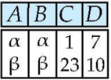

- σ A = B ∧ D &gt; 5 ( r )

ß

Module 07

Partha Pratim

Das

Objectives &amp;

Outline

Relational

Operators

Aggregation

Operators

Module Summary

## Project Operation - selection of columns (Attributes)

- Relation r
- π A , C ( r )

Database Management Systems

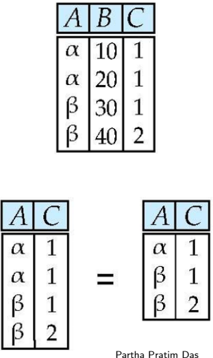

Partha Pratim Das

Module 07

Partha Pratim

Das

Objectives &amp;

Outline

Relational

Operators

Aggregation

Operators

Module Summary

## Union of two relations

- Relation r , s
- r ∪ s

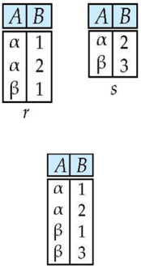

## Partha Pratim Das

Module 07

Partha Pratim

Das

Objectives &amp;

Outline

Relational

Operators

Aggregation

Operators

Module Summary

## Set difference of two relations

- Relation r , s
- r -s

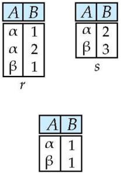

Module 07

Partha Pratim

Das

Objectives &amp;

Outline

Relational

Operators

Aggregation

Operators

Module Summary

## Set intersection of two relations

- Relation r , s
- r ∩ s

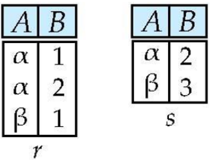

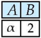

Note:

r ∩ s = r -( r -s )

Module 07

Partha Pratim

Das

Objectives &amp;

Outline

Relational

Operators

Aggregation

Operators

Module Summary

## Joining two relations - Cartesian-product

- Relation r , s

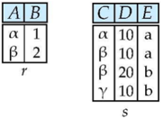

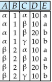

Partha Pratim Das

- r × s

Module 07

Partha Pratim

Das

Objectives &amp;

Outline

Relational

Operators

Aggregation

Operators

Module Summary

## Cartesian-product - naming issue

- Relation r , s
- r × s

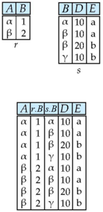

Module 07

Partha Pratim

Das

Objectives &amp; Outline

Relational Operators

Aggregation Operators

Module Summary

## Renaming a Table

- Allows us to refer to a relation, (say E ) by more than one name.
- ρ X ( E )

returns the expression E under the name X

- Relations r

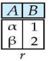

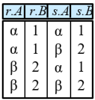

Partha Pratim Das

- r × ρ s ( r )

## Module 07

Partha Pratim Das

Objectives &amp; Outline

Relational Operators

Aggregation Operators

Module Summary

## Composition of Operations

- Can build expressions using multiple operations
- Example: σ A = C ( r × s )
- r × s

· σ A = C ( r × s )

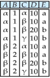

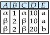

Partha Pratim Das

## Module 07

Partha Pratim Das

Objectives &amp; Outline

Relational Operators

Aggregation Operators

Module Summary

## Joining two relations - Natural Join

- Let r and s be relations on schemas R and S respectively. Then, the 'natural join' of relations R and S is a relation on schema R ∪ S obtained as follows:
- Consider each pair of tuples t r from r and t s from s .
- If t r and t s have the same value on each of the attributes in R ∩ S , add a tuple t to the result, where
- glyph[triangleright] t has the same value as t r on r
- glyph[triangleright] t has the same value as t s on s

Module 07

Partha Pratim

Das

Objectives &amp;

Outline

Relational

Operators

Aggregation

Operators

Module Summary

## Natural Join Example

- Relations r , s :
- Natural Join

◦

r

glyph[triangleright]

glyph[triangleleft]

s

π A , r . B , C , r . D , E ( σ r . B = s . B ∧ r . D = s . D ( r × s ))

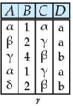

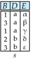

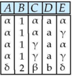

Partha Pratim Das

Module 07

Partha Pratim Das

Objectives &amp; Outline

Relational Operators

Aggregation Operators

Module Summary

## Aggregation Operators

## Aggregation Operators

## Module 07

Partha Pratim Das

Objectives &amp; Outline

Relational Operators

Aggregation Operators

Module Summary

## Aggregate Operators

- Can we compute:
- SUM
- AVG
- MAX
- MIN

## Module 07

Partha Pratim Das

Objectives &amp; Outline

Relational Operators

Aggregation Operators

Module Summary

## Notes about Relational Languages

- Each query input is a table (or set of tables)
- Each query output is a table
- All data in the output table appears in one of the input tables
- Relational Algebra is not Turing complete

Module 07

Partha Pratim

Das

Objectives &amp;

Outline

Relational

Operators

Aggregation

Operators

Module Summary

## Summary of Relational Algebra Operators

| Symbol (Name)      | Example of Use                                                                                                        |
|--------------------|-----------------------------------------------------------------------------------------------------------------------|
| (Selection)        | 85000 salary                                                                                                          |
| (Selection)        | Return rows of the input relation that the predicate. satisfy                                                         |
| (Projection)       | ID (instructor) salary                                                                                                |
| (Projection)       | Output specified attributes from all rows of the input relation. Remove duplicate tuples from the output.             |
| Cartesian Product) | instructor X department                                                                                               |
| Cartesian Product) | Output all possible combinations of rows in instructor = department. and                                              |
| (Union)            | name (student)                                                                                                        |
| (Union)            | Output the union of tuples from the two input relations                                                               |
| Set Difference)    | (student)                                                                                                             |
| Set Difference)    | Output the set difference of tuples from the two input relations.                                                     |
| (Natural Join)     | instructor % department                                                                                               |
| (Natural Join)     | Output pairs of rows from the two input relations that have the same value on all attributes that have the same name. |

## Partha Pratim Das

## Module 07

Partha Pratim Das

Objectives &amp; Outline

Relational Operators

Aggregation Operators

Module Summary

## Module Summary

- Introduced relational algebra
- Familiarized with the operators of relational algebra

Slides used in this presentation are borrowed from http://db-book.com/ with kind permission of the authors. Edited and new slides are marked with 'PPD'.