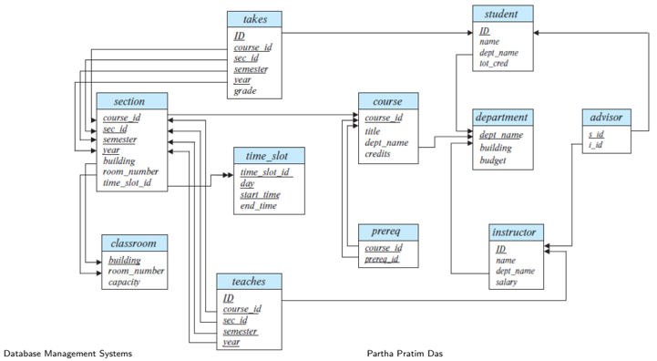
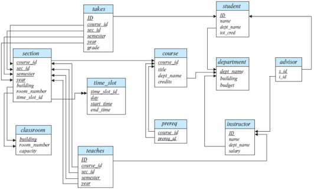
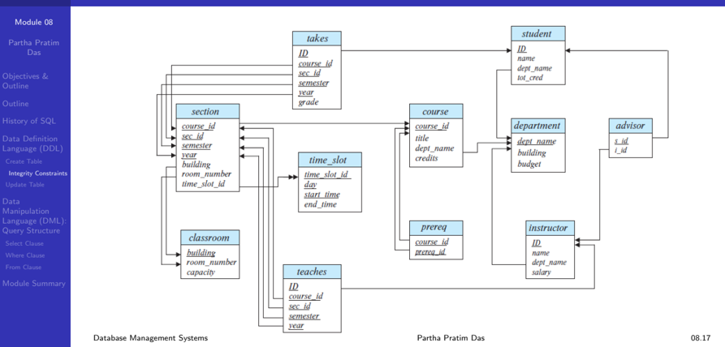

## Module 08

Partha Pratim Das

Objectives &amp; Outline

Outline

History of SQL

Data Definition

Language (DDL)

Create Table

Integrity Constraints

Update Table

Data Manipulation Language (DML): Query Structure

Select Clause

Where Clause

From Clause

Module Summary

Database Management Systems

## Database Management Systems

Module 08: Introduction to SQL/1

## Partha Pratim Das

Department of Computer Science and Engineering Indian Institute of Technology, Kharagpur ppd@cse.iitkgp.ac.in

Partha Pratim Das

## Module 08

Partha Pratim Das

Objectives &amp; Outline

Outline

History of SQL

Data Definition Language (DDL) Create Table Integrity Constraints Update Table

Data Manipulation Language (DML): Query Structure

Select Clause

Where Clause

From Clause

Module Summary

## Module Recap

- Introduced relational algebra
- Familiarized with the operators of relational algebra

## Module 08

Partha Pratim Das

Objectives &amp; Outline

Outline

History of SQL

Data Definition Language (DDL) Create Table Integrity Constraints Update Table

Data Manipulation Language (DML): Query Structure

Select Clause

Where Clause

From Clause

Module Summary

## Module Objectives

- To understand relational query language
- To understand data definition and basic query structure

## Module 08

Partha Pratim Das

Objectives &amp; Outline

Outline

History of SQL

Data Definition Language (DDL) Create Table Integrity Constraints Update Table

Data Manipulation Language (DML): Query Structure

Select Clause

Where Clause

From Clause

Module Summary

## Module Outline

- History of SQL
- Data Definition Language (DDL)
- Data Manipulation Language (DML): Query Structure

## Module 08

Partha Pratim Das

Objectives &amp; Outline

Outline

History of SQL

Data Definition Language (DDL) Create Table Integrity Constraints Update Table

Data Manipulation Language (DML): Query Structure

Select Clause

Where Clause

From Clause

Module Summary

## History of SQL

## History of SQL

## Module 08

Partha Pratim Das

Objectives &amp; Outline

Outline

History of SQL

Data Definition Language (DDL) Create Table Integrity Constraints Update Table

Data Manipulation Language (DML): Query Structure

Select Clause

Where Clause

From Clause

Module Summary

## History of Query Language

- IBM developed Structured English Query Language ( SEQUEL ) as part of System R project. Renamed Structured Query Language (SQL: pronounced still as SEQUEL )
- ANSI and ISO standard SQL:

| SQL-86   | First formalized by ANSI                                                                                                                                                                                                                                     |
|----------|--------------------------------------------------------------------------------------------------------------------------------------------------------------------------------------------------------------------------------------------------------------|
| SQL-89   | + Integrity Constraints                                                                                                                                                                                                                                      |
| SQL-92   | Major revision ( ISO/IEC 9075 standard ), De-facto Industry Standard                                                                                                                                                                                         |
| SQL:1999 | + Regular Expression Matching , Recursive Queries , Triggers , Support for Procedural and Control Flow Statements , Nonscalar types (Arrays), and Some OO features (structured types), Embedding SQL in Java (SQL/OLB) , and Embedding Java in SQL (SQL/JRT) |
| SQL:2003 | + XML features (SQL/XML) , Window Functions, Standardized Sequences, and Columns with Auto-generated Values (identity columns)                                                                                                                               |
| SQL:2006 | + Ways of importing and storing XML data in an SQL database, manipulating it within the database, and publishing both XML and conventional SQL-data in XML form                                                                                              |
| SQL:2008 | Legalizes ORDER BY outside Cursor Definitions + INSTEAD OF Triggers, TRUNCATE Statement, and FETCH Clause                                                                                                                                                    |
| SQL:2011 | + Temporal Data (PERIOD FOR) Enhancements for Window Functions and FETCH Clause                                                                                                                                                                              |
| SQL:2016 | + Row Pattern Matching, Polymorphic Table Functions, and JSON                                                                                                                                                                                                |
| SQL:2019 | + Multidimensional Arrays (MDarray type and operators)                                                                                                                                                                                                       |

## Partha Pratim Das

## Module 08

Partha Pratim Das

Objectives &amp; Outline

Outline

History of SQL

Data Definition Language (DDL) Create Table Integrity Constraints Update Table

Data Manipulation Language (DML): Query Structure

Select Clause

Where Clause

From Clause

Module Summary

## History of Query Language (2): Compliance

- SQL is the de facto industry standard today for relational or structred data systems
- Commercial systems as well as open systems may be fully or partially compliant to one or more standards from SQL-92 onward
- Not all examples here may work on your particular system. Check your system's SQL documentation

## Module 08

Partha Pratim Das

Objectives &amp; Outline

Outline

History of SQL

Data Definition Language (DDL) Create Table Integrity Constraints Update Table

Data Manipulation Language (DML): Query Structure

Select Clause

Where Clause

From Clause

Module Summary

## History of Query Language (3): Alternatives

- There aren't any alternatives to SQL for speaking to relational databases (that is, SQL as a protocol), but there are many alternatives to writing SQL in the applications
- These alternatives have been implemented in the form of frontends for working with relational databases. Some examples of a frontend include (for a section of languages):
- SchemeQL and CLSQL, which are probably the most flexible, owing to their Lisp heritage, but they also look like a lot more like SQL than other frontends
- LINQ (in .Net)
- ScalaQL and ScalaQuery (in Scala)
- SqlStatement, ActiveRecord and many others in Ruby
- HaskellDB
- ...the list goes on for many other languages.

Source :

What are good alternatives to SQL (the language)?

Database Management Systems

## Partha Pratim Das

## Module 08

Partha Pratim Das

Objectives &amp; Outline

Outline

History of SQL

Data Definition Language (DDL) Create Table Integrity Constraints Update Table

Data Manipulation Language (DML): Query Structure

Select Clause

Where Clause

From Clause

Module Summary

## History of Query Language (4): Derivatives

- There are several query languages that are derived from or inspired by SQL. Of these, the most popular and effective is SPARQL.
- SPARQL (pronounced sparkle , a recursive acronym for SPARQL Protocol and RDF Query Language ) is an RDF query language
- glyph[triangleright] A semantic query language for databases - able to retrieve and manipulate data stored in Resource Description Framework (RDF) format.
- glyph[triangleright] It has been standardized by the W3C Consortium as key technology of the semantic web
- glyph[triangleright] Versions:
- -SPARQL 1.0 (January 2008)
- -SPARQL 1.1 (March, 2013)
- glyph[triangleright] Used as the query languages for several NoSQL systems - particularly the Graph Databases that use RDF as store

## Partha Pratim Das

## Module 08

Partha Pratim Das

Objectives &amp; Outline

Outline

History of SQL

Data Definition Language (DDL)

Create Table

Integrity Constraints

Update Table

Data Manipulation Language (DML): Query Structure

Select Clause

Where Clause

From Clause

Module Summary

## Data Definition Language (DDL)

## Data Definition Language (DDL)

## Module 08

Partha Pratim Das

Objectives &amp; Outline

Outline

History of SQL

Data Definition Language (DDL)

Create Table

Integrity Constraints

Update Table

Data Manipulation Language (DML): Query Structure

Select Clause

Where Clause

From Clause

Module Summary

## Data Definition Language (DDL)

The SQL data-definition language (DDL) allows the specification of information about relations, including:

- The Schema for each Relation
- The Domain of values associated with each Attribute
- Integrity Constraints
- And, as we will see later, also other information such as
- The set of Indices to be maintained for each relations
- Security and Authorization information for each relation
- The Physical Storage Structure of each relation on disk

## Module 08

Partha Pratim Das

Objectives &amp; Outline

Outline

History of SQL

Data Definition Language (DDL)

Create Table Integrity Constraints Update Table

## Data Manipulation Language (DML): Query Structure

Select Clause

Where Clause

From Clause

Module Summary

## Domain Types in SQL

- char( n ) . Fixed length character string, with user-specified length n
- varchar ( n ). Variable length character strings, with user-specified maximum length n
- int . Integer (a finite subset of the integers that is machine-dependent)
- smallint ( n ). Small integer (a machine-dependent subset of the integer domain type)
- numeric ( p , d ). Fixed point number, with user-specified precision of p digits, with d digits to the right of decimal point. (ex., numeric (3 , 1), allows 44 . 5 to be stores exactly, but not 444 . 5 or 0 . 32)
- real, double precision . Floating point and double-precision floating point numbers, with machine-dependent precision
- float ( n ). Floating point number, with user-specified precision of at least n digits
- More are covered in Chapter 4

Module 08

Partha Pratim

Das

Objectives &amp;

Outline

Outline

History of SQL

Data Definition

Language (DDL)

Create Table

Integrity Constraints

Update Table

Data

Manipulation

Language (DML):

Query Structure

Select Clause

Where Clause

From Clause

Module Summary

## Schema Diagram for University Database

## Module 08

Partha Pratim Das

Objectives &amp; Outline

Outline

History of SQL

Data Definition Language (DDL)

Create Table

Integrity Constraints

Update Table

Data Manipulation Language (DML): Query Structure

Select Clause

Where Clause

From Clause

Module Summary

## Create Table Construct

- An SQL relation is defined using the create table command:

create table r ( A 1 D 1 , A 2 D 2 , . . . , A n D n ), ( integrity -constraint 1 ),

. . .

( integrity -constraint k ));

- r is the name of the relation
- each A i is an attribute name in the schema of relation r
- D i is the data type of values in the domain of attribute A i

Module 08

Partha Pratim

Das

Objectives &amp;

Outline

Outline

History of SQL

Data Definition

Language (DDL)

Create Table

Integrity Constraints

Update Table

Data

Manipulation

Language (DML):

Query Structure

Select Clause

Where Clause

From Clause

Module Summary

## Create Table Construct (2)

create table instructor

(

ID

char(

5

)

,

name varchar (20)

dept name varchar (20)

salary numeric

,

(8

2));

Module 08

Partha Pratim Das

Objectives &amp; Outline

Outline

History of SQL

Data Definition Language (DDL) Create Table

Integrity Constraints

Update Table

Data Manipulation Language (DML): Query Structure

Select Clause

Where Clause

From Clause

Module Summary

## Create Table Construct (3): Integrity Constraints

- not null
- primary key ( A 1 , . . . , A n )
- foreign key ( A m , . . . , A n ) references r

create table instructor (

ID char( 5 ) ,

name varchar (20)

dept name varchar (20)

salary numeric (8 , 2));

create table instructor (

ID char( 5 ) ,

name varchar (20) not null ,

dept name varchar (20),

salary numeric (8 , 2),

primary key ( ID ),

foreign key ( dept name ) references department ));

primary key declaration on an attribute automatically ensures not null

Database Management Systems

Partha Pratim Das

08.16

## University Schema

Module 08

Partha Pratim Das

Objectives &amp; Outline

Outline

History of SQL

Data Definition

Language (DDL)

Create Table

Integrity Constraints

Update Table

Data Manipulation Language (DML): Query Structure

Select Clause

Where Clause

From Clause

Module Summary

## Create Table Construct (4): More Relations

create table student ( ID varchar( 5 ) , name varchar (20) not null , dept name varchar (20), tot cred numeric (3 , 0), primary key ( ID ), foreign key ( dept name ) references department ); create table course ( course id varchar (8), title varchar (50), dept name varchar (20), credits numeric (2 , 0), primary key ( course id ), )

foreign key ( dept name references department );

Database Management Systems create table takes (

ID varchar( 5 ) , course id varchar (8),

semester varchar

(6), grade varchar (2),

primary key (

ID, course id, sec id, semester, year foreign key ( ID ) references student

foreign key ( course id, sec id, semester, year ) references section );

- Note : sec id can be dropped from primary key above, to ensure a student cannot be registered for two sections of the same course in the same semester

## Partha Pratim Das

sec id varchar (8), year

numeric

(4

,

0),

),

## Module 08

Partha Pratim Das

Objectives &amp; Outline

Outline

History of SQL

Data Definition Language (DDL)

Create Table

Integrity Constraints

Update Table

Data Manipulation Language (DML): Query Structure

Select Clause

Where Clause

From Clause

Module Summary

## Update Tables

- Insert (DML command)
- insert into instructor values ('10211', 'Smith', 'Biology', 66000);
- Delete (DML command)
- Remove all tuples from the student relation

delete from student

- Drop Table (DDL command)
- drop table r
- Alter (DDL command)
- alter table r add A D
- glyph[triangleright] Where A is the name of the attribute to be added to relation r and D is the domain of A
- glyph[triangleright] All existing tuples in the relation are assigned null as the value for the new attribute
- alter table r drop A
- glyph[triangleright] Where A is the name of an attribute of relation r
- glyph[triangleright] Dropping of attributes not supported by many databases

Partha Pratim Das

Module 08

Partha Pratim Das

Objectives &amp; Outline

Outline

History of SQL

Data Definition

Language (DDL)

Create Table

Integrity Constraints

Update Table

Data Manipulation Language (DML): Query Structure

Select Clause

Where Clause

From Clause

Module Summary

## Data Manipulation Language (DML): Query Structure

## Data Manipulation Language (DML): Query Structure

## Module 08

Partha Pratim Das

Objectives &amp; Outline

Outline

History of SQL

Data Definition Language (DDL) Create Table Integrity Constraints Update Table

## Data Manipulation Language (DML): Query Structure

Select Clause

Where Clause

From Clause

Module Summary

## Basic Query Structure

- •

- A typical SQL query has the form: select A 1 , A 2 , . . . , A n , from r 1 , r 2 , ..., r m where P

- A i represents an attribute from r i 's

- r i represents a relation

- P is a predicate

- The result of an SQL query is a relation

## Module 08

Partha Pratim Das

Objectives &amp; Outline

Outline

History of SQL

Data Definition Language (DDL) Create Table Integrity Constraints Update Table

Data Manipulation Language (DML): Query Structure

Select Clause

Where Clause

From Clause

Module Summary

## Select Clause

- The select clause lists the attributes desired in the result of a query
- Corresponds to the projection operation of the relational algebra
- Example: find the names of all instructors:

select name

,

from instructor

- NOTE: SQL names are case insensitive (that is, you may use upper-case or lower-case letters)
- Name ≡ NAME ≡ name
- Some people use upper case wherever we use bold font

Module 08

Partha Pratim Das

Objectives &amp; Outline

Outline

History of SQL

Data Definition Language (DDL) Create Table Integrity Constraints Update Table

Data Manipulation Language (DML): Query Structure

Select Clause

Where Clause

From Clause

Module Summary

## Select Clause (2)

- SQL allows duplicates in relations as well as in query results !!!
- To force the elimination of duplicates, insert the keyword distinct after select
- Find the department names of all instructors, and remove duplicates select distinct dept name from instructor
- The keyword all specifies that duplicates should not be removed select all dept name from instructor

Module 08

Partha Pratim Das

Objectives &amp; Outline

Outline

History of SQL

Data Definition Language (DDL)

Create Table

Integrity Constraints

Update Table

Data Manipulation Language (DML): Query Structure

Select Clause

Where Clause

From Clause

Module Summary

## Select Clause (3)

- An asterisk in the select clause denotes all attributes select * from instructor
- An attribute can be a literal with no from clause select '437'
- Results is a table with one column and a single row with value '437'
- Can give the column a name using: select '437' as FOO
- An attribute can be a literal with from clause select 'A' from instructor
- Result is a table with one column and N rows (number of tuples in the instructors table), each row with value 'A'

Database Management Systems

Partha Pratim Das

08.24

Module 08

Partha Pratim Das

Objectives &amp; Outline

Outline

History of SQL

Data Definition

Language (DDL)

Create Table

Integrity Constraints

Update Table

Data Manipulation Language (DML): Query Structure

Select Clause

Where Clause

From Clause

Module Summary

## Select Clause (4)

The select clause can contain arithmetic expressions involving the operation, +, -, *, and /, and operating on constants or attributes of tuples

- The query:

select ID, name, salary/12 from instructor

- Would return a relation that is the same as the instructor relation, except that the value of the attribute salary is divided by 12
- Can rename ' salary /12' using the as clause: select ID, name, salary/12 as monthly salary

## Module 08

Partha Pratim Das

Objectives &amp; Outline

Outline

History of SQL

Data Definition Language (DDL)

Create Table

Integrity Constraints

Update Table

Data Manipulation Language (DML): Query Structure

Select Clause

Where Clause

From Clause

Module Summary

## Where Clause

- The where clause specifies conditions that the result must satisfy
- Corresponds to the selection predicate of the relational algebra
- To find all instructors in Comp. Sci. dept

select name

from instructor where dept name = 'Comp. Sci.'

- Comparison results can be combined using the logical connectives and , or , and not
- To find all instructors in Comp. Sci. dept with salary &gt; 80000
- Comparisons can be applied to results of arithmetic expressions

select

name

from instructor

where dept name = 'Comp. Sci.' and salary &gt; 80000

## Module 08

Partha Pratim Das

Objectives &amp; Outline

Outline

History of SQL

Data Definition Language (DDL) Create Table Integrity Constraints Update Table

Data Manipulation Language (DML): Query Structure

Select Clause

Where Clause

From Clause

Module Summary

## From Clause

- The from clause lists the relations involved in the query
- Corresponds to the Cartesian product operation of the relational algebra
- Find the Cartesian product instructor X teaches
- select *

from instructor , teaches

- Generates every possible instructor-teaches pair, with all attributes from both relations
- For common attributes (for example, ID ), the attributes in the resulting table are renamed using the relation name (for example, instructor.ID )
- Cartesian product not very useful directly, but useful combined with where-clause condition (selection operation in relational algebra)

## Module 08

Partha Pratim

Das

Objectives &amp;

Outline

Outline

History of SQL

Data Definition

Language (DDL)

Create Table

Integrity Constraints

Update Table

Data

Manipulation

Language (DML):

Query Structure

Select Clause

Where Clause

From Clause

Module Summary

## Cartesian Product

## instructor

## teaches

|             |            |                             |                             | salarv   |    ID | course_id               | sec_id        |           | Vear      |
|-------------|------------|-----------------------------|-----------------------------|----------|-------|-------------------------|---------------|-----------|-----------|
| 70101       | Srinivasan | Comp. Sci.                  | Comp. Sci.                  | 65000    | 10101 | CS-101                  |               | Fall      | 2009      |
| 12121       | Wu         | Finance                     | Finance                     | 9000o    | 10101 | CS-315                  |               | Spring    | 2010      |
| 15151       | Mozart     | Music                       | Music                       | 40000    | 10101 | CS-347                  |               | Fall      | 2009      |
| 22222       | Einstein   | Physics                     | Physics                     | 95000    | 12121 | FIN-201                 |               | Spring    | 2010      |
|             | El Said    | History                     | History                     | 60000    | 15151 | MU-199                  |               | Spring    | 2010      |
| 33456       | Gold       | Physics                     | Physics                     | 87000    | 22222 | PHY-101                 |               | Fall      | 2009      |
| 45565       | Katz       | Sci. Comp.                  | Sci. Comp.                  | 75000    | 32343 | HIS-351                 |               | Spring    | 2010      |
| 58583       | Califieri  | History                     | History                     | 62000    | 45565 | CS-101                  |               | Spring    | 2010      |
| 76543       | Singh      | Finance                     | Finance                     | 80000    | 45565 | CS-319                  |               | Spring    | 2010      |
| 76766       | Crick      | Biology                     | Biology                     | 72000    | 76766 | BIO-101                 |               | Summer    | 2009      |
| 83821 98345 | Inst.ID    | Srinivasan Comp. Sci] 65000 |                             |          | 10101 | course_id sec_id CS-101 | semester Fall | year 2009 | 2010 2009 |
| 10101       | 10101      | Srinivasan Comp. Sci        |                             | 65000    | 10101 | CS-315                  | Spring        | 2010      | 2009 2010 |
| 10101       |            | Srinivasan                  | Sci Comp                    | 65000    | 10101 | CS-347                  | Fall          | 2009      | 2009      |
|             | 10101      | Srinivasan                  | Comp                        |          | 12121 | FIN-201                 | Spring        | 2010      |           |
| 10101       |            |                             | Srinivasan Comp. Sci] 65000 |          | 15151 | MU-199                  | Spring        | 2010      |           |
| 10101       |            |                             | Srinivasan Comp. Sci] 65000 |          | 22222 | PHY-101                 | Fall          | 2009      |           |
| 12121       |            | Wu                          | Finance                     | 9oooo    | 10101 | CS-101                  | Fall          | 2009      |           |
| 12121       |            | Wu                          | Finance                     | 9oooo    | 10101 | CS-315                  | Spring        | 2010      |           |
| 12121       |            | Wu                          | Pinance                     | 9oooo    | 10101 | CS 347                  | Fall          | 2009      |           |
|             | 12121      | Wu                          | Pinance                     | 90ooo    | 12121 | FIN-201                 | Spring        |           | 2010      |
| 12121       |            | Wu                          | Finance                     |          | 15151 | MU-199                  | Spring        | 2010      |           |
|             | 12121      | Wu                          | Pinance                     |          | 22222 | PHY-101                 | Fall          |           | 2009      |

## Database Management Systems

## Partha Pratim Das

## Module 08

Partha Pratim Das

Objectives &amp; Outline

Outline

History of SQL

Data Definition Language (DDL)

Create Table

Integrity Constraints

Update Table

Data Manipulation Language (DML): Query Structure

Select Clause

Where Clause

From Clause

Module Summary

## Module Summary

- Introduced relational query language
- Familiarized with data definition and basic query structure

Slides used in this presentation are borrowed from http://db-book.com/ with kind permission of the authors.

Edited and new slides are marked with 'PPD'.

