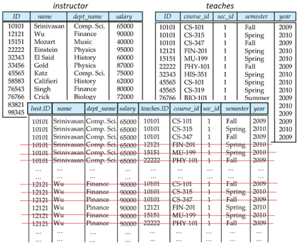
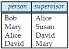

## Module 09

Partha Pratim Das

Objectives &amp; Outline

Additional Basic

Operations

Cartesian Product

Rename AS

Operation

String Values

Order By Clause

Select Top / Fetch

Clause

Where Clause

Predicates

Duplicates

Module Summary

Database Management Systems

## Database Management Systems

Module 09: Introduction to SQL/2

## Partha Pratim Das

Department of Computer Science and Engineering Indian Institute of Technology, Kharagpur ppd@cse.iitkgp.ac.in

Partha Pratim Das

09.1

## Module 09

Partha Pratim Das

## Objectives &amp; Outline

Additional Basic

Operations

Cartesian Product

Rename AS

Operation

String Values

Order By Clause

Select Top / Fetch

Clause

Where Clause

Predicates

Duplicates

Module Summary

## Module Recap

- Introduced relational query language
- Familiarized with data definition and basic query structure

## Module 09

Partha Pratim Das

Objectives &amp; Outline

Additional Basic

Operations

Cartesian Product

Rename AS

Operation

String Values

Order By Clause

Select Top / Fetch

Clause

Where Clause

Predicates

Duplicates

Module Summary

## Module Objectives

- To complete the understanding of basic query structure

## Module 09

Partha Pratim Das

## Objectives &amp; Outline

Additional Basic

Operations

Cartesian Product

Rename AS

Operation

String Values

Order By Clause

Select Top / Fetch

Clause

Where Clause Predicates Duplicates

Module Summary

## Module Outline

- Additional Basic Operations
- Cartesian Product
- Rename AS Operation
- String Values
- Order By
- Select Top / Fetch
- Where Clause Predicate
- Duplicates

## Module 09

Partha Pratim Das

Objectives &amp; Outline

Additional Basic Operations

Cartesian Product

Rename AS

Operation

String Values

Order By Clause

Select Top / Fetch

Clause

Where Clause

Predicates

Duplicates

Module Summary

## Additional Basic Operations

## Additional Basic Operations

## Module 09

Partha Pratim Das

Objectives &amp; Outline

Additional Basic

Operations

Cartesian Product

Rename AS

Operation

String Values

Order By Clause

Select Top / Fetch

Clause

Where Clause

Predicates

Duplicates

Module Summary

## Cartesian Product

- Find the Cartesian product instructor X teaches
- select * from instructor , teaches
- generates every possible instructor-teaches pair, with all attributes from both relations
- For common attributes (for example, ID ), the attributes in the resulting table are renamed using the relation name (for example, instructor.ID )
- Cartesian product not very useful directly, but useful combined with where-clause condition (selection operation in relational algebra)

## Module 09

Partha Pratim

Das

Objectives &amp;

Outline

Additional Basic

Operations

Cartesian Product

Rename AS

Operation

String Values

Order By Clause

Select Top / Fetch

Clause

Where Clause

Predicates

Duplicates

Module Summary

## Cartesian Product

## instructor

## teaches

|             |            |                             |                             | salarv   |    ID | course_id               | sec_id        |           | Vear      |
|-------------|------------|-----------------------------|-----------------------------|----------|-------|-------------------------|---------------|-----------|-----------|
| 70101       | Srinivasan | Comp. Sci.                  | Comp. Sci.                  | 65000    | 10101 | CS-101                  |               | Fall      | 2009      |
| 12121       | Wu         | Finance                     | Finance                     | 9000o    | 10101 | CS-315                  |               | Spring    | 2010      |
| 15151       | Mozart     | Music                       | Music                       | 40000    | 10101 | CS-347                  |               | Fall      | 2009      |
| 22222       | Einstein   | Physics                     | Physics                     | 95000    | 12121 | FIN-201                 |               | Spring    | 2010      |
|             | El Said    | History                     | History                     | 60000    | 15151 | MU-199                  |               | Spring    | 2010      |
| 33456       | Gold       | Physics                     | Physics                     | 87000    | 22222 | PHY-101                 |               | Fall      | 2009      |
| 45565       | Katz       | Sci. Comp.                  | Sci. Comp.                  | 75000    | 32343 | HIS-351                 |               | Spring    | 2010      |
| 58583       | Califieri  | History                     | History                     | 62000    | 45565 | CS-101                  |               | Spring    | 2010      |
| 76543       | Singh      | Finance                     | Finance                     | 80000    | 45565 | CS-319                  |               | Spring    | 2010      |
| 76766       | Crick      | Biology                     | Biology                     | 72000    | 76766 | BIO-101                 |               | Summer    | 2009      |
| 83821 98345 | Inst.ID    | Srinivasan Comp. Sci] 65000 |                             |          | 10101 | course_id sec_id CS-101 | semester Fall | year 2009 | 2010 2009 |
| 10101       | 10101      | Srinivasan Comp. Sci        |                             | 65000    | 10101 | CS-315                  | Spring        | 2010      | 2009 2010 |
| 10101       |            | Srinivasan                  | Sci Comp                    | 65000    | 10101 | CS-347                  | Fall          | 2009      | 2009      |
|             | 10101      | Srinivasan                  | Comp                        |          | 12121 | FIN-201                 | Spring        | 2010      |           |
| 10101       |            |                             | Srinivasan Comp. Sci] 65000 |          | 15151 | MU-199                  | Spring        | 2010      |           |
| 10101       |            |                             | Srinivasan Comp. Sci] 65000 |          | 22222 | PHY-101                 | Fall          | 2009      |           |
| 12121       |            | Wu                          | Finance                     | 9oooo    | 10101 | CS-101                  | Fall          | 2009      |           |
| 12121       |            | Wu                          | Finance                     | 9oooo    | 10101 | CS-315                  | Spring        | 2010      |           |
| 12121       |            | Wu                          | Pinance                     | 9oooo    | 10101 | CS 347                  | Fall          | 2009      |           |
|             | 12121      | Wu                          | Pinance                     | 90ooo    | 12121 | FIN-201                 | Spring        |           | 2010      |
| 12121       |            | Wu                          | Finance                     |          | 15151 | MU-199                  | Spring        | 2010      |           |
|             | 12121      | Wu                          | Pinance                     |          | 22222 | PHY-101                 | Fall          |           | 2009      |

## Database Management Systems

## Partha Pratim Das

Module 09

Partha Pratim

Das

Objectives &amp;

Outline

Additional Basic

Operations

Cartesian Product

Rename AS

Operation

String Values

Order By Clause

Select Top / Fetch

Clause

Where Clause

Predicates

Duplicates

Module Summary

## Examples

- Find the names of all instructors who have taught some course and the course id select name, course id from instructor , teaches where instructor . ID = teaches . ID
- Equi-Join, Natural Join

## Database Management Systems

Partha Pratim Das

## Module 09

Partha Pratim Das

Objectives &amp; Outline

Additional Basic

Operations

Cartesian Product

Rename AS

Operation

String Values

Order By Clause

Select Top / Fetch

Clause

Where Clause

Predicates

Duplicates

Module Summary

## Examples

- Find the names of all instructors in the Art department who have taught some course and the course id

select name, course id from instructor , teaches where instructor . ID = teaches . ID and instructor.dept name = 'Art'

## Module 09

Partha Pratim Das

Objectives &amp; Outline

Additional Basic

Operations

Cartesian Product

Rename AS Operation

String Values

Order By Clause

Select Top / Fetch Clause

Where Clause

Predicates

Duplicates

Module Summary

## Rename AS Operation

- The SQL allows renaming relations and attributes using the as clause: old name as new name
- Find the names of all instructors who have a higher salary than some instructor in 'Comp. Sci'.

select distinct T.name from instructor as T , instructor as S , where T . salary &gt; S . salary and S.dept name = 'Comp. Sci'

- Keyword as is optional and may be omitted instructor as T ≡ instructor T

## Module 09

Partha Pratim Das

Objectives &amp; Outline

Additional Basic

Operations

Cartesian Product

Rename AS

Operation

String Values

Order By Clause

Select Top / Fetch

Clause

Where Clause

Predicates

Duplicates

Module Summary

## Cartesian Product Example

- Relation emp super
- Find the supervisor of 'Bob'
- Find the supervisor of the supervisor of 'Bob'
- Find ALL the supervisors (direct and indirect) of 'Bob'

| person               | supervisor             |
|----------------------|------------------------|
| Bob Alice David Mary | Alice Susan David Marv |

## Module 09

Partha Pratim Das

Objectives &amp; Outline

Additional Basic

Operations

Cartesian Product

Rename AS Operation

String Values

Order By Clause

Select Top / Fetch Clause

Where Clause

Predicates

Duplicates

Module Summary

## String Operations

- SQL includes a string-matching operator for comparisons on character strings. The operator like uses patterns that are described using two special characters:
- percent ( % ). The % character matches any substring
- underscore ( ). The character matches any character
- Find the names of all instructors whose name includes the substring 'dar'
- •

select name from instructor where name like '% dar %'

- Match the string '100%' like '100%' escape ' \ '
- in that above we use backslash ( \ ) as the escape character

## Module 09

Partha Pratim Das

Objectives &amp; Outline

Additional Basic

Operations

Cartesian Product

Rename AS Operation

String Values

Order By Clause

Select Top / Fetch Clause

Where Clause

Predicates

Duplicates

Module Summary

## String Operations (2)

- Patterns are case sensitive
- Pattern matching examples:
- 'Intro%' matches any string beginning with 'Intro'
- '%Comp%' matches any string containing 'Comp' as a substring
- ' ' matches any string of exactly three characters
- ' %' matches any string of at least three characters
- SQL supports a variety of string operations such as
- concatenation (using ' ‖ ')
- converting from upper to lower case (and vice versa)
- finding string length, extracting substrings, etc.

## Module 09

Partha Pratim Das

Objectives &amp; Outline

Additional Basic

Operations

Cartesian Product

Rename AS

Operation

String Values

Order By Clause

Select Top / Fetch Clause

Where Clause Predicates Duplicates

Module Summary

## Ordering the Display of Tuples

- List in alphabetic order the names of all instructors
- select distinct name from instructor order by name
- We may specify desc for descending order or asc for ascending order, for each attribute; ascending order is the default.
- Example: order by name desc
- Can sort on multiple attributes
- Example: order by dept name, name

## Module 09

Partha Pratim Das

Objectives &amp; Outline

Additional Basic

Operations

Cartesian Product

Rename AS

Operation

String Values

Order By Clause

Select Top / Fetch Clause

Where Clause Predicates Duplicates

Module Summary

## Selecting Number of Tuples in Output

- The Select Top clause is used to specify the number of records to return
- The Select Top clause is useful on large tables with thousands of records. Returning a large number of records can impact performance

select top 10 distinct name from instructor

- Not all database systems support the SELECT TOP clause.
- SQL Server &amp; MS Access support select top
- MySQL supports the limit clause
- Oracle uses fetch first n rows only and rownum

select distinct name from instructor order by name fetch first 10 rows only

## Module 09

Partha Pratim Das

Objectives &amp; Outline

Additional Basic

Operations

Cartesian Product

Rename AS

Operation

String Values

Order By Clause

Select Top / Fetch Clause

Where Clause Predicates

Duplicates

Module Summary

## Where Clause Predicates

- SQL includes a between comparison operator
- Example: Find the names of all instructors with salary between $ 90 , 000 and $ 100 , 000 (that is, ≥ $90 , 000 and ≤ $100 , 000)

select name from instructor

where salary between 90000 and 100000

- Tuple comparison

select name, course id from instructor , teaches where (instructor.ID, dept name) = (teaches.ID, 'Biology') ;

## Module 09

Partha Pratim Das

Objectives &amp; Outline

Additional Basic

Operations

Cartesian Product

Rename AS

Operation

String Values

Order By Clause

Select Top / Fetch

Clause

Where Clause Predicates

Duplicates

Module Summary

## In Operator

- The in operator allows you to specify multiple values in a where clause
- The in operator is a shorthand for multiple or conditions

select name

from instructor

where dept name in ('Comp. Sci.', 'Biology')

## Module 09

Partha Pratim Das

Objectives &amp; Outline

Additional Basic

Operations

Cartesian Product

Rename AS

Operation

String Values

Order By Clause

Select Top / Fetch

Clause

Where Clause

Predicates

Duplicates

Module Summary

## Duplicates

- In relations with duplicates, SQL can define how many copies of tuples appear in the result
- Multiset versions of some of the relational algebra operators - given multiset relations r 1 and r 2 :
- a) σ θ ( r 1 ): If there are c 1 copies of tuple t 1 in r 1 , and t 1 satisfies selections σ θ , then there are c 1 copies of t 1 in σ θ ( r 1 )
- b) Π A ( r ): For each copy of tuple t 1 in r 1 , there is a copy of tuple Π A ( t 1 ) in Π A ( r 1 ) where Π A ( t 1 ) denotes the projection of the single tuple t 1
- c) r 1 x r 2 : If there are c 1 copies of tuple t 1 in r 1 and c 2 copies of tuple t 2 in r 2 , there are c 1 x c 2 copies of the tuple t 1 . t 2 in r 1 x r 2

## Module 09

Partha Pratim Das

Objectives &amp; Outline

Additional Basic

Operations

Cartesian Product

Rename AS

Operation

String Values

Order By Clause

Select Top / Fetch Clause

Where Clause

Predicates

Duplicates

Module Summary

## Duplicates (2)

- Example: Suppose multiset relations r 1 ( A , B ) and r 2 ( C ) are as follows: r 1 = { (1 , a )(2 , a ) } r 2 = { (2) , (3) , (3) }
- Then Π B ( r 1 ) would be { ( a ) , ( a ) } , while Π B ( r 1 ) x r 2 would be { ( a , 2) , ( a , 2) , ( a , 3) , ( a , 3) , ( a , 3) , ( a , 3) }
- SQL duplicate semantics:

select A 1 , A 2 , . . . , A n from r 1 , r 2 , . . . , r m where P

is equivalent to the multiset version of the expression:

<!-- formula-not-decoded -->

Module 09

Partha Pratim Das

Objectives &amp; Outline

Additional Basic

Operations

Cartesian Product

Rename AS

Operation

String Values

Order By Clause

Select Top / Fetch

Clause

Where Clause

Predicates

Duplicates

Module Summary

## Module Summary

- Completed the understanding of basic query structure

Slides used in this presentation are borrowed from http://db-book.com/ with kind permission of the authors.

Edited and new slides are marked with 'PPD'.

