## Module 11

Partha Pratim Das

Week Recap

Objectives &amp;

Outline

SQL Examples

SELECT

Cartesian Product /

AS

WHERE: AND / OR

String

ORDER BY

IN

Set

UNION

INTERSECT

EXCEPT

Aggregation

AVG

MIN

MAX

COUNT

SUM

Module Summary

## Database Management Systems

Module 11: SQL Examples

## Partha Pratim Das

Department of Computer Science and Engineering Indian Institute of Technology, Kharagpur ppd@cse.iitkgp.ac.in

Partha Pratim Das

## Module 11

Partha Pratim Das

Week Recap

Objectives &amp; Outline

SQL Examples

SELECT

Cartesian Product / AS

WHERE: AND / OR

String

ORDER BY

IN

Set

UNION

INTERSECT

EXCEPT

Aggregation

AVG

MIN

MAX

COUNT

SUM

Module Summary

## Week Recap

- Basic notions of Relational Database Models
- Attributes and their types
- Mathematical structure of relational model
- Schema and Instance
- Keys, primary as well as foreign
- Relational algebra with operators
- Relational query language
- DDL (Data Definition)
- DML (Basic Query Structure)
- Detailed understanding of basic query structure
- Set operations, null values, and aggregation

## Module 11

Partha Pratim Das

Week Recap

Objectives &amp; Outline

SQL Examples

SELECT

Cartesian Product /

AS

WHERE: AND / OR

String

ORDER BY

IN

Set

UNION

INTERSECT

EXCEPT

Aggregation

AVG

MIN

MAX

COUNT

SUM

Module Summary

## Module Objectives

- To recap various basic SQL features through example workout

## Module 11

Partha Pratim Das

Week Recap

Objectives &amp; Outline

SQL Examples

SELECT

Cartesian Product /

AS

WHERE: AND / OR

String

ORDER BY

IN

Set

UNION

INTERSECT

EXCEPT

Aggregation

AVG

MIN

MAX

COUNT

SUM

Module Summary

## Module Outline

- Examples of basic SQL

## Module 11

Partha Pratim

Das

Week Recap

Objectives &amp;

Outline

SQL Examples

SELECT

Cartesian Product /

AS

WHERE: AND / OR

String

ORDER BY

IN

Set

UNION

INTERSECT

EXCEPT

Aggregation

AVG

MIN

MAX

COUNT

SUM

Module Summary

## Select distinct

- From the classroom relation in the figure, find the names of buildings in which every individual classroom has capacity less than 100 (removing the duplicates).
- Query:

Figure: classroom relation

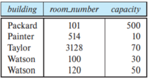

| building   | room_number   | capacity   |
|------------|---------------|------------|
| Packard    | 101           |            |
| Painter    | 514           | 10         |
| Taylor     | 3128          | 70         |
| Watson     |               | 30         |
| Watson     | 120           | 50         |

select distinct building from classroom where capacity &lt; 100;

- Output :

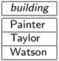

## Module 11

Partha Pratim

Das

Week Recap

Objectives &amp;

Outline

SQL Examples

SELECT

Cartesian Product /

AS

WHERE: AND / OR

String

ORDER BY

IN

Set

UNION

INTERSECT

EXCEPT

Aggregation

AVG

MIN

MAX

COUNT

SUM

Module Summary

## Select all

- From the classroom relation in the figure, find the names of buildings in which every individual classroom has capacity less than 100 (without removing the duplicates).
- Query:

| building   |   room_number | capacity   |
|------------|---------------|------------|
| Packard    |           101 |            |
| Painter    |           514 | 10         |
| Taylor     |          3128 | 70         |
| Watson     |           100 | 30         |
| Watson     |           120 | 50         |

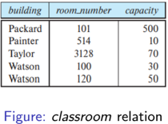

select all building from classroom where capacity &lt; 100;

- Output:
- Note that duplicate retention is the default and hence it is a common practice to skip all immediately after select .

building

Painter

Taylor

Watson

Watson

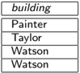

## Partha Pratim Das

## Module 11

Partha Pratim Das

Week Recap

Objectives &amp;

Outline

SQL Examples

SELECT

Cartesian Product /

AS

WHERE: AND / OR

String

ORDER BY

IN

Set

UNION

INTERSECT

EXCEPT

Aggregation

AVG

MIN

MAX

COUNT

SUM

Module Summary

## Cartesian Product

- Find the list of all students of departments which have a budget &lt; $0 . 1 million

select name, budget from student, department where student.dept name = department.dept name and budget &lt; 100000;

- The above query first generates every possible studentdepartment pair, which is the Cartesian product of student and department. Then, it filters all the rows with student.dept name = department.dept name and budget &lt; 100000.
- The common attribute dept name in the resulting table are renamed using the relation name student.dept name and department.dept name )

## Partha Pratim Das

| name     |   budget |
|----------|----------|
| Brandt   |    50000 |
| Peltier  |    70000 |
| Levy     |    70000 |
| Sanchez  |    80000 |
| Snow     |    70000 |
| Aoi      |    85000 |
| Bourikas |    85000 |
| Tanaka   |    90000 |

## Module 11

Partha Pratim Das

Week Recap

Objectives &amp;

Outline

SQL Examples

SELECT

Cartesian Product /

AS

WHERE: AND / OR

String

ORDER BY

IN

Set

UNION

INTERSECT

EXCEPT

Aggregation

AVG

MIN

MAX

COUNT

SUM

Module Summary

## Rename AS Operation

- The same query in the previous slide can be framed by renaming the tables as shown below.

select S.name as studentname , budget as deptbudget from student as S , department as D where S.dept name = D.dept name and budget &lt; 100000;

- The above query renames the relation student as S and the relation department as D
- It also displays the attribute name as StudentName and budget as DeptBudget.
- Note that the budget attribute does not have any prefix because it occurs only in the department relation.

## Partha Pratim Das

| studentname   |   deptbudget |
|---------------|--------------|
| Brandt        |        50000 |
| Peltier       |        70000 |
| Levy          |        70000 |
| Sanchez       |        80000 |
| Snow          |        70000 |
| Aoi           |        85000 |
| Bourikas      |        85000 |
| Tanaka        |        90000 |

## Module 11

Partha Pratim Das

Week Recap

Objectives &amp; Outline

SQL Examples

SELECT

Cartesian Product /

AS

WHERE: AND / OR

String

ORDER BY

IN

Set

UNION

INTERSECT

EXCEPT

Aggregation

AVG

MIN

MAX

COUNT

SUM

Module Summary

## Where: AND and OR

- From the instructor and department relations in the figure, find out the names of all instructors whose department is Finance or whose department is in any of the following buildings: Watson, Taylor. instructor ◦ Query:
- Output:

select name from instructor I, department D where D.dept name = I.dept name and ( I.dept name = 'Finance' or building in ('Watson','Taylor'));

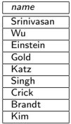

| name       |
|------------|
| Srinivasan |
| Wu         |
| Einstein   |
| Gold       |
| Katz       |
| Singh      |
| Crick      |
| Brandt     |
| Kim        |

|                                                                         | name                                                                             | deptname                                                                                                 | salary                                                            |
|-------------------------------------------------------------------------|----------------------------------------------------------------------------------|----------------------------------------------------------------------------------------------------------|-------------------------------------------------------------------|
| 10101 12121 15151 22222 32343 33456 45565 58583 76543 76766 83821 98345 | Srinivasan Mozart Einstein El Said Gold Kalz Califieri Singh Crick Brandt Kim Wu | Comp. Sci. Finance Music Physics History Physics Sci. History Finance Biology Comp. Sci. Elec. Comp- Eng | 65000 40000 95000 60000 87000 75000 62000 80000 72000 92000 80000 |

## department

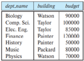

| deptname                                                   | building                                            | budget                   |
|------------------------------------------------------------|-----------------------------------------------------|--------------------------|
| Biology Comp. Sci. Elcc. Finance History Music Physics Eng | Watson Taylor Taylor Painter Painter Packard Watson | 90000 1ooooo 85000 50000 |

## Database Management Systems

## Partha Pratim Das

Module 11

Partha Pratim Das

Week Recap

Objectives &amp; Outline

SQL Examples

SELECT

Cartesian Product /

AS

WHERE: AND / OR

String

ORDER BY

IN

Set

UNION

INTERSECT

EXCEPT

Aggregation

AVG

MIN

MAX

COUNT

SUM

Module Summary

## String Operations

- From the course relation in the figure, find the titles of all courses whose course id has three alphabets indicating the department.
- Query:

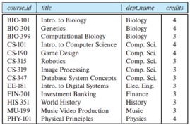

select title from course where course id like ' -%';

- Output:

| course_jd                                                                        | title                                                                                                                                                                                                            | deptame                                                                                             | credits   |
|----------------------------------------------------------------------------------|------------------------------------------------------------------------------------------------------------------------------------------------------------------------------------------------------------------|-----------------------------------------------------------------------------------------------------|-----------|
| BIO-10I BIO-301 BIO-399 CS-101 CS-190 CS315 CS-319 CS-347 FIN-201 HIS-351 MU-199 | Intro Biology Genetics Computational Biology Intro Computer Science Game Design Robotics Image Processing Database System Concepts Intro Digital Systcms Investment Banking World History Music Video Production | Biology Biology Biology Comp. Sci. Comp. Sci. Comp. Sci. Comp. Sci. Comp. Sci. Cng. Finance History |           |

Figure: course relation

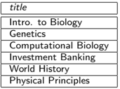

## title

Intro. to Biology

Genetics

Computational Biology

Investment Banking

World History

Physical Principles

- The course id of each department has either 2 or 3 alphabets in the beginning, followed by a hyphen and then followed by a 3-digit number. The above query returns the names of those departments that have 3 alphabets in the beginning.

Partha Pratim Das

## Module 11

Partha Pratim Das

Week Recap

Objectives &amp; Outline

SQL Examples

SELECT

Cartesian Product /

AS

WHERE: AND / OR

String

ORDER BY

IN

Set

UNION

INTERSECT

EXCEPT

Aggregation

AVG

MIN

MAX

COUNT

SUM

Module Summary

## Order By

- From the student relation in the figure, obtain the list of all students in alphabetic order of departments and within each department, in decreasing order of total credits.
- The list is first sorted in alphabetic order of dept name.
- Within each dept, it is sorted in decreasing order of total credits.
- Query:

Figure: student relation

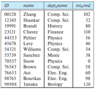

|       | namte    | deptiame   | lot_cred   |
|-------|----------|------------|------------|
| 00128 | Zhang    | Comp. Sci. | 102        |
| 12345 | Shankar  | Comp. Sci. |            |
| 19991 | Brandt   | History    |            |
| 23121 | Chavez   | Finance    | 10         |
| 44553 | Peltier  | Physics    |            |
| 45678 | Levy     | Physics    |            |
| 54321 | Williams | Comp. Sci. |            |
| 55739 | Sanchez  | Music      |            |
| 70557 | Snow     | Physics    |            |
| 76543 | Brown    | Comp. Sci. |            |
| 76653 | Aoi      | Elcc. Eng  |            |
| 98765 | Bourikas |            |            |
| 98988 | anaka    | Biology    | 120        |

select name, dept name, tot cred from student order by dept name ASC , tot cred DESC ;

- Output:

| name     | dept name   |   tot cred |
|----------|-------------|------------|
| Tanaka   | Biology     |        120 |
| Zhang    | Comp. Sci.  |        102 |
| Brown    | Comp. Sci.  |         58 |
| Williams | Comp. Sci.  |         54 |
| Shankar  | Comp. Sci.  |         32 |
| Bourikas | Elec. Eng.  |         98 |
| Aoi      | Elec. Eng.  |         60 |
| Chavez   | Finance     |        110 |
| Brandt   | History     |         80 |
| Sanchez  | Music       |         38 |
| Peltier  | Physics     |         56 |
| Levy     | Physics     |         46 |
| Snow     | Physics     |          0 |

## Partha Pratim Das

## Module 11

Partha Pratim

Das

Week Recap

Objectives &amp;

Outline

SQL Examples

SELECT

Cartesian Product /

AS

WHERE: AND / OR

String

ORDER BY

IN

Set

UNION

INTERSECT

EXCEPT

Aggregation

AVG

MIN

MAX

COUNT

SUM

Module Summary

## In Operator

- From the teaches relation in the figure, find the IDs of all courses taught in the Fall or Spring of 2018.

Figure: teaches relation

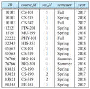

Note: We can use distinct to remove duplicates.

- Query:

select course id from teaches where semester in ('Fall','Spring') and year =2018;

- Output:

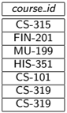

## Partha Pratim Das

Module 11

Partha Pratim

Das

Week Recap

Objectives &amp;

Outline

SQL Examples

SELECT

Cartesian Product /

AS

WHERE: AND / OR

String

ORDER BY

IN

Set

UNION

INTERSECT

EXCEPT

Aggregation

AVG

MIN

MAX

COUNT

SUM

Module Summary

## Set Operations: union

- For the same question in the previous slide, we can find the solution using union operator as follows.
- Query:
- Note that union removes all duplicates. If we use union all instead of union , we get the same set of tuples as in previous slide.

Figure: teaches relation

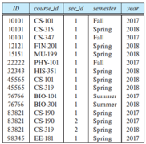

| 10101   | CS-101   | Fall   |   2017 |
|---------|----------|--------|--------|
| 10101   | CS-315   | Spring |   2018 |
|         | CS-347   | Fall   |   2017 |
| 12121   | FIN 201  | Spring |   2018 |
| 15151   | MU-199   | Spring |   2018 |
| 22222   | PHY-10I  | Fall   |   2017 |
| 32343   | HIS-351  | Spring |   2018 |
| 45565   | CS-101   | Spring |   2018 |
| 45565   | CS-319   | Spring |   2018 |
|         | BIO-101  |        |   2017 |
| 76766   | BIO-301  |        |   2018 |
| 83821   | CS-190   | Spring |   2017 |
| 83821   | CS-190   | Spring |   2017 |
| 83821   | CS-319   | Spring |   2018 |
| 98345   | EE 181   | Spring |   2017 |

Database Management Systems

## Partha Pratim Das

select course id from teaches where semester='Fall' and year =2018 union select course id from teaches where semester='Spring' and year =2018

- Output:

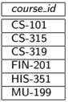

11.13

## Module 11

Partha Pratim Das

Week Recap

Objectives &amp;

Outline

SQL Examples

SELECT

Cartesian Product /

AS

WHERE: AND / OR

String

ORDER BY

IN

Set

UNION

INTERSECT

EXCEPT

Aggregation

AVG

MIN

MAX

COUNT

SUM

Module Summary

## Set Operations (2): intersect

- From the instructor relation in the figure, find the names of all instructors who taught in either the Computer Science department or the Finance department and whose salary is &lt; 80000.
- Query:

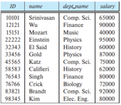

select name from instructor where dept name in ('Comp. Sci.','Finance') intersect select name from instructor where salary &lt; 80000;

- Output:

|                                                                         |                                                                                  | deptame                                                                                      | salarv                                                      |
|-------------------------------------------------------------------------|----------------------------------------------------------------------------------|----------------------------------------------------------------------------------------------|-------------------------------------------------------------|
| 10101 12121 15151 22222 32343 33456 45565 58583 76543 76766 83821 98345 | Srinivasan Wu Mozart Einstein El Said Gold Katz Calilicri Singh Crick Brandt Kim | Comp. Sci. Finance Music Physics History Physics Comp. Sci History Finance Biology Comp. Sci | 65000 40000 95000 60000 87000 75000 62000 80000 72000 92000 |

Figure: instructor relation

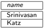

- Note that the same can be achieved using the query:

select name from instructor where dept name in ('Comp. Sci.', 'Finance') and salary &lt; 80000;

Database Management Systems

## Partha Pratim Das

## Module 11

Partha Pratim Das

Week Recap

Objectives &amp; Outline

SQL Examples

SELECT

Cartesian Product /

AS

WHERE: AND / OR

String

ORDER BY

IN

Set

UNION

INTERSECT

EXCEPT

Aggregation

AVG

MIN

MAX

COUNT

SUM

Module Summary

## Set Operations (3): except

- From the instructor relation in the figure, find the names of all instructors who taught in either the Computer Science department or the Finance department and whose salary is either ≥ 90000 or ≤ 70000.
- Query:

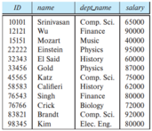

|                                                                   |                                                                                  | deptame                                                                                                   | salary                                                |
|-------------------------------------------------------------------|----------------------------------------------------------------------------------|-----------------------------------------------------------------------------------------------------------|-------------------------------------------------------|
| 10101 12121 15151 22222 32343 33456 45565 58583 76543 76766 83821 | Srinivasan Wu Mozart Finstein Fl Said Gold Katz Calitieri Singh Crick Brandt Kim | Comp- Sci. Finance Music Physics History Physics Comp. Sci. History Finance Biology Comp. Sci. Elec. Eng- | 65000 90ooo 9S000 60000 87000 75000 62000 72000 92000 |

Figure:

instructor relation

- Note that the same can be achieved using the query given below:

select name from instructor where dept name in ('Comp. Sci.', 'Finance') and ( salary &gt; = 90000 or salary &lt; = 70000);

Database Management Systems

## Partha Pratim Das

select name from instructor where dept name in ('Comp. Sci.','Finance') except select name from instructor where salary &lt; 90000 and salary &gt; 70000;

- Output:

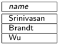

## Module 11

Partha Pratim Das

Week Recap

Objectives &amp;

Outline

SQL Examples

SELECT

Cartesian Product /

AS

WHERE: AND / OR

String

ORDER BY

IN

Set

UNION

INTERSECT

EXCEPT

Aggregation

AVG

MIN

MAX

COUNT

SUM

Module Summary

## Aggregate functions: avg

- From the classroom relation given in the figure, find the names and the average capacity of each building whose average capacity is greater than 25.
- Query:

Figure: classroom relation

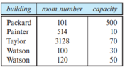

| building   | roon_number   | capacity   |
|------------|---------------|------------|
| Packard    |               | 500        |
| Painter    | 514           |            |
| Taylor     | 3128          | 70         |
| Watson     |               | 30         |
| Watson     | 120           | 50         |

select building , avg ( capacity ) from classroom group by building having avg ( capacity ) &gt; 25;

- Output:

| building   |   avg |
|------------|-------|
| Taylor     |    70 |
| Packard    |   500 |
| Watson     |    40 |

## Aggregate functions (2): min

- From the instructor relation given in the figure, find the least salary drawn by any instructor among all the instructors.
- Query:
- select min ( salary ) as least salary from instructor ;
- Output:

Figure: instructor relation

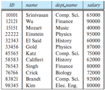

|                                                                         | name                                                                             | deptname                                                                                            | salary                                                |
|-------------------------------------------------------------------------|----------------------------------------------------------------------------------|-----------------------------------------------------------------------------------------------------|-------------------------------------------------------|
| 10101 12121 15151 22222 32343 33456 45565 58583 76543 76766 83821 98345 | Srinivasan Wu Mozart Einstein El Said Gold Katz Califieri Singh Crick Brandt Kim | Comp. Sci. Finance Music Physics History Physics Comp. Sci. History Finance Biology Comp. Sci. Elec | 65000 40000 95000 87000 75000 62000 72000 92000 80000 |

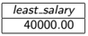

## Module 11

Partha Pratim Das

Week Recap

Objectives &amp;

Outline

SQL Examples

SELECT

Cartesian Product /

AS

WHERE: AND / OR

String

ORDER BY

IN

Set

UNION

INTERSECT

EXCEPT

Aggregation

AVG

MIN

MAX

COUNT

SUM

Module Summary

## Aggregate functions (3): max

- From the student relation given in the figure, find the maximum credits obtained by any student among all the students.
- Query:

Figure: student relation

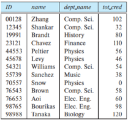

|       | name     |            | tot_cred   |
|-------|----------|------------|------------|
| 00128 | Zhang    | Comp. Sci. | 102        |
| 12345 | Shankar  | Sci. Comp. |            |
| 19991 | Brandt   | History    |            |
| 23121 | Chavez   | Finance    | 110        |
| 44553 | Peltier  | Physics    |            |
| 45678 | Levy     | Physics    |            |
| 54321 | Williams | Comp. Sci. |            |
| 55739 | Sanchez  | Music      | 38         |
| 70557 | Snow     | Physics    |            |
| 76543 | Brown    | Comp. Sci. | 58         |
| 76653 | Aoi      | Elec Eng-  |            |
| 98765 | Bourikas | Elec. Eng. |            |
| 98988 | Ianaka   | Biology    | 120        |

select max ( tot cred ) as max credits from student ;

- Output:

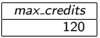

## Module 11

Partha Pratim Das

Week Recap

Objectives &amp;

Outline

SQL Examples

SELECT

Cartesian Product /

AS

WHERE: AND / OR

String

ORDER BY

IN

Set

UNION

INTERSECT

EXCEPT

Aggregation

AVG

MIN

MAX

COUNT

SUM

Module Summary

## Aggregate functions (4): count

- From the section relation given in the figure, find the number of courses run in each building.
- ◦
- Query: select building , count ( course id ) as course count from section group by building ;
- Output:

| coursejd   | secjd   | semester   |   vear | building   | room_number   | time_slotjd   |
|------------|---------|------------|--------|------------|---------------|---------------|
|            |         | Summer     |   2017 | Painter    | 514           |               |
| BIO-301    |         | Summer     |   2018 | Painter    | 514           |               |
|            |         | Fall       |   2017 | Packard    | 101           | A             |
|            |         | Spring     |   2018 | Packard    | 101           |               |
| CS-190     |         | Spring     |   2017 | Taylor     | 3128          |               |
| CS-190     |         | Spring     |   2017 | Taylor     | 3128          | 2             |
| CS-315     |         | Spring     |   2018 | Watson     | 120           |               |
|            |         | Spring     |   2018 | Warson     |               | 8             |
| CS-319     |         | Spring     |   2018 | Taylor     | 3128          |               |
| CS-347     |         | Fall       |   2017 | Taylor     | 3128          | ^             |
| EE-181     |         | Spring     |   2017 | Taylor     | 3128          |               |
| FIN-201    |         | Spring     |   2018 | Packard    | 101           |               |
| HIS-351    |         | Spring     |   2018 | Painter    | 514           |               |
| MU-199     |         | Spring     |   2018 | Packard    |               |               |
|            |         | Fall       |   2017 | Watson     | 100           |               |

Figure: section relation

| building   |   course count |
|------------|----------------|
| Taylor     |              5 |
| Packard    |              4 |
| Painter    |              3 |
| Watson     |              3 |

## Module 11

Partha Pratim Das

Week Recap

Objectives &amp;

Outline

SQL Examples

SELECT

Cartesian Product /

AS

WHERE: AND / OR

String

ORDER BY

IN

Set

UNION

INTERSECT

EXCEPT

Aggregation

AVG

MIN

MAX

COUNT

SUM

Module Summary

## Aggregate functions (5): sum

- From the course relation given in the figure, find the total credits offered by each department.
- Query:

Figure: course relation

| course_id   | title                    |            | credits   |
|-------------|--------------------------|------------|-----------|
| BIO-101     | Intro Biology            | Biology    |           |
| BIO-301     | Genetics                 | Biology    |           |
| BIO-399     | Computational Biology    | Biology    |           |
|             | Intro Computer Science   | Comp. Sci. |           |
| CS-190      | Game Design              | Comp. Sci. |           |
| CS-315      | Robotics                 | Comp. Sci. |           |
| CS-319      | Image Processing         | Comp. Sci. |           |
| CS-347      | Database System Concepts | Comp. Sci. |           |
|             | Intro to Digital Systems | Llcc. Eng  |           |
| FIN-201     | Investment Banking       | Finance    |           |
| HIS-351     | World History            | History    |           |
| MU-199      | Music Video Production   | Music      |           |
| PHY-IOI     | Physical Principles      | Physics    |           |

select dept name , sum ( credits ) as sum credits from course group by dept name ;

- Output:

| dept name   |   sum credits |
|-------------|---------------|
| Finance     |             3 |
| History     |             3 |
| Physics     |             4 |
| Music       |             3 |
| Comp. Sci.  |            17 |
| Biology     |            11 |
| Elec. Eng.  |             3 |

## Partha Pratim Das

## Module 11

Partha Pratim Das

Week Recap

Objectives &amp; Outline

SQL Examples

SELECT

Cartesian Product / AS

WHERE: AND / OR

String

ORDER BY

IN

Set

UNION

INTERSECT

EXCEPT

Aggregation

AVG

MIN

MAX

COUNT

SUM

Module Summary

## Module Summary

- SQL Examples have been practiced for
- Select
- Cartesian Product / as
- Where: and / or
- String Matching
- Order by
- in
- Set Operations: union, intersect, except
- Aggregate Functions: avg, min, max, count, sum

Database Management Systems

Partha Pratim Das

11.21