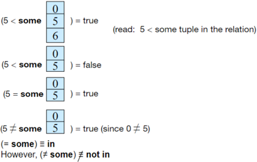
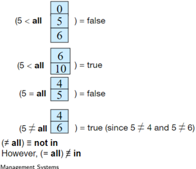

## Module 12

Partha Pratim Das

Objectives &amp; Outline

Nested Subqueries

Subqueries in the

Where Clause

Subqueries in the From Clause

Subqueries in the Select Clause

Modifications of the Database

Module Summary

## Database Management Systems

Module 12: Intermediate SQL/1

## Partha Pratim Das

Department of Computer Science and Engineering Indian Institute of Technology, Kharagpur ppd@cse.iitkgp.ac.in

Partha Pratim Das

## Module 12

Partha Pratim Das

Objectives &amp; Outline

Nested

Subqueries

Subqueries in the

Where Clause

Subqueries in the From Clause

Subqueries in the Select Clause

Modifications of the Database

Module Summary

## Module Recap

- SQL Examples Practiced

## Module 12

Partha Pratim Das

Objectives &amp; Outline

Nested Subqueries

Subqueries in the

Where Clause

Subqueries in the From Clause

Subqueries in the Select Clause

Modifications of the Database

Module Summary

## Module Objectives

- To understand nested subquery in SQL
- To understand processes for data modification

## Module 12

Partha Pratim Das

Objectives &amp; Outline

Nested Subqueries

Subqueries in the

Where Clause

Subqueries in the From Clause

Subqueries in the Select Clause

Modifications of the Database

Module Summary

## Module Outline

- Nested Subqueries
- Modifications of the Database

## Module 12

Partha Pratim Das

Objectives &amp; Outline

Nested Subqueries

Subqueries in the Where Clause

Subqueries in the From Clause

Subqueries in the Select Clause

Modifications of the Database

Module Summary

## Nested Subqueries

## Nested Subqueries

## Module 12

Partha Pratim Das

Objectives &amp; Outline

## Nested Subqueries

Subqueries in the Where Clause

Subqueries in the From Clause

Subqueries in the Select Clause

Modifications of the Database

Module Summary

## Nested Subqueries

- SQL provides a mechanism for the nesting of subqueries
- A subquery is a select-from-where expression that is nested within another query
- The nesting can be done in the following SQL query

select A 1 , A 2 , . . . , A n from r 1 , r 2 , . . . , r m

where P

## as follows:

- A i can be replaced by a subquery that generates a single value
- r i can be replaced by any valid subquery
- P can be replaced with an expression of the form:
- B &lt; operation &gt; (subquery)
- where B is an attribute and &lt; operation &gt; to be defined later

## Module 12

Partha Pratim Das

Objectives &amp; Outline

Nested Subqueries

Subqueries in the Where Clause

Subqueries in the From Clause

Subqueries in the Select Clause

Modifications of the Database

Module Summary

## Subqueries in the Where Clause

## Module 12

Partha Pratim Das

Objectives &amp; Outline

Nested Subqueries

Subqueries in the Where Clause

Subqueries in the From Clause

Subqueries in the Select Clause

Modifications of the Database

Module Summary

## Subqueries in the Where Clause

- Typical use of subqueries is to perform tests:
- For set membership
- For set comparisons
- For set cardinality

## Module 12

Partha Pratim Das

Objectives &amp; Outline

Nested Subqueries

Subqueries in the Where Clause

Subqueries in the From Clause

Subqueries in the Select Clause

Modifications of the Database

Module Summary

## Set Membership

- Find courses offered in Fall 2009 and in Spring 2010. ( intersect example)

select distinct course id

from section

where semester ='Fall' and year = 2009 and

course id in

(

select course id

from section where semester ='Spring' and year = 2010);

- Find courses offered in Fall 2009 but not in Spring 2010. ( except example)
- select distinct course id

from section

where semester ='Fall' and year = 2009 and

course id not in

(

select course id

from section where semester ='Spring' and year = 2010);

## Partha Pratim Das

## Module 12

Partha Pratim Das

Objectives &amp; Outline

Nested Subqueries

Subqueries in the Where Clause

Subqueries in the From Clause

Subqueries in the Select Clause

Modifications of the Database

Module Summary

## Set Membership (2)

- Find the total number of (distinct) students who have taken course sections taught by the instructor with ID 10101

where ( course id, sec id, semester, year ) in select course id, sec id, semester, year

select count (distinct ID ) from takes ( from teaches where teaches.ID = 10101);

- Note: Above query can be written in simpler manner. The formulation above is simply to illustrate SQL features.

## Module 12

Partha Pratim Das

Objectives &amp; Outline

Nested Subqueries

Subqueries in the Where Clause

Subqueries in the From Clause

Subqueries in the Select Clause

Modifications of the Database

Module Summary

## Set Comparison - 'some' Clause

- Find names of instructors with salary greater than that of some (at least one) instructor in the Biology department

select distinct T.name from instructor as T , instructor as S

where T . salary &gt; S . salary and S.dept name = 'Biology';

- Same query using some clause

select name

from instructor

where

salary

&gt;

some ( select salary

from instructor

where dept name = 'Biology' );

## Module 12

Partha Pratim Das

Objectives &amp; Outline

Nested Subqueries

Subqueries in the Where Clause

Subqueries in the

From Clause

Subqueries in the

Select Clause

Modifications of the Database

Module Summary

## Definition of 'some' Clause

glyph[negationslash]

- F &lt; comp &gt; some r ⇔∃ t ∈ r such that (F &lt; comp &gt; t ) where &lt; comp &gt; can be: &lt;, ≤ , &gt;, ≥ , = , =
- some represents existential quantification

## Module 12

Partha Pratim Das

Objectives &amp; Outline

Nested Subqueries

Subqueries in the Where Clause

Subqueries in the From Clause

Subqueries in the Select Clause

Modifications of the Database

Module Summary

## Set Comparison - 'all' Clause

- Find the names of all instructors whose salary is greater than the salary of all instructors in the Biology department

select name

from instructor

where

salary

&gt;

all ( select salary

from instructor

where dept name = 'Biology' );

## Module 12

Partha Pratim Das

Objectives &amp; Outline

Nested Subqueries

Subqueries in the Where Clause

Subqueries in the From Clause

Subqueries in the Select Clause

Modifications of the Database

Module Summary

## Definition of 'all' Clause

glyph[negationslash]

- F &lt; comp &gt; all r ⇔∀ t ∈ r such that (F &lt; comp &gt; t ) Where &lt; comp &gt; can be: &lt;, ≤ , &gt;, ≥ , = , =
- all represents universal quantification

## Module 12

Partha Pratim Das

Objectives &amp; Outline

Nested Subqueries

Subqueries in the Where Clause

Subqueries in the From Clause

Subqueries in the Select Clause

Modifications of the Database

Module Summary

## Test for Empty Relations: 'exists'

- The exists construct returns the value true if the argument subquery is nonempty

glyph[negationslash]

- exists r ⇔ r = ∅
- not exists r ⇔ r = ∅

## Module 12

Partha Pratim Das

Objectives &amp; Outline

Nested Subqueries

Subqueries in the Where Clause

Subqueries in the From Clause

Subqueries in the Select Clause

Modifications of the Database

Module Summary

## Use of 'exists' Clause

- Yet another way of specifying the query 'Find all courses taught in both the Fall 2009 semester and in the Spring 2010 semester'

select course id from section as S

where semester = 'Fall' and year = 2009 and exists ( select *

from section as T

where semester = 'Spring' and year = 2010

and S.course id = T.course id );

- Correlation name - variable S in the outer query
- Correlated subquery - the inner query

## Module 12

Partha Pratim Das

Objectives &amp; Outline

Nested Subqueries

Subqueries in the Where Clause

Subqueries in the From Clause

Subqueries in the Select Clause

Modifications of the Database

Module Summary

## Use of 'not exists' Clause

- Find all students who have taken all courses offered in the Biology department.

select distinct

S.ID, S.name from student as S

where not exists

( (

select course id from course

where dept name = 'Biology')

except

( select T.course id from takes as T

where S.ID = T.ID ));

- First nested query lists all courses offered in Biology
- Second nested query lists all courses a particular student took
- Note: X -Y = ∅ ⇔ X ⊆ Y
- Note: Cannot write this query using = all and its variants

Partha Pratim Das

## Module 12

Partha Pratim Das

Objectives &amp; Outline

Nested Subqueries

Subqueries in the Where Clause

Subqueries in the From Clause

Subqueries in the Select Clause

Modifications of the Database

Module Summary

## Test for Absence of Duplicate Tuples: 'unique'

- The unique construct tests whether a subquery has any duplicate tuples in its result
- The unique construct evaluates to 'true' if a given subquery contains no duplicates
- Find all courses that were offered at most once in 2009

select T.course id from course as T

where unique

( select R.course id from section as R where T.course id = R.course id and R.year = 2009);

## Module 12

Partha Pratim Das

Objectives &amp; Outline

Nested

Subqueries

Subqueries in the Where Clause

Subqueries in the From Clause

Subqueries in the Select Clause

Modifications of the Database

Module Summary

## Subqueries in the From Clause

Module 12

Partha Pratim Das

Objectives &amp; Outline

Nested Subqueries

Subqueries in the Where Clause

Subqueries in the From Clause

Subqueries in the Select Clause

Modifications of the Database

Module Summary

## Subqueries in the From Clause

- SQL allows a subquery expression to be used in the from clause
- Find the average instructors' salaries of those departments where the average salary is greater than $ 42,000

select dept name , avg salary from ( select dept name , avg ( salary ) as avg salary from instructor group by dept name )

where avg salary &gt; 42000;

- Note that we do not need to use the having clause
- Another way to write above query

select dept name , avg salary from ( select dept name , avg (salary)

from instructor group by dept name ) as dept avg ( dept name , avg salary )

where avg salary &gt;

42000;

Database Management Systems

Partha Pratim Das

## Module 12

Partha Pratim Das

Objectives &amp; Outline

Nested Subqueries

Subqueries in the Where Clause

Subqueries in the From Clause

Subqueries in the Select Clause

Modifications of the Database

Module Summary

## With Clause

- The with clause provides a way of defining a temporary relation whose definition is available only to the query in which the with clause occurs
- Find all departments with the maximum budget

with max budget(value) as ( select max ( budget ) from department ) select department.name from department, max budget where department.budget = max budget.value ;

## Module 12

Partha Pratim Das

Objectives &amp; Outline

Nested Subqueries

Subqueries in the Where Clause

Subqueries in the From Clause

Subqueries in the Select Clause

Modifications of the Database

Module Summary

## Complex Queries using With Clause

- Find all departments where the total salary is greater than the average of the total salary at all departments

with

dept total (dept name, value)

as

select dept name , sum ( salary )

from instructor

group by dept name ,

dept total avg(value) as

(

select

avg(

value

)

from dept total )

select dept name from dept total, dept total avg

where dept total.value &gt; dept total avg.value ;

## Module 12

Partha Pratim Das

Objectives &amp; Outline

Nested

Subqueries

Subqueries in the

Where Clause

Subqueries in the From Clause

Subqueries in the Select Clause

Modifications of the Database

Module Summary

## Subqueries in the Select Clause

## Module 12

Partha Pratim Das

Objectives &amp; Outline

Nested Subqueries

Subqueries in the Where Clause

Subqueries in the From Clause

Subqueries in the Select Clause

Modifications of the Database

Module Summary

## Scalar Subquery

- Scalar subquery is one which is used where a single value is expected
- List all departments along with the number of instructors in each department select dept name ,

where department.dept name = instructor.dept name )

( select count(*) from instructor as num instructors from department ;

- Runtime error if subquery returns more than one result tuple

## Module 12

Partha Pratim Das

Objectives &amp; Outline

Nested

Subqueries

Subqueries in the

Where Clause

Subqueries in the From Clause

Subqueries in the Select Clause

Modifications of the Database

Module Summary

## Modifications of the Database

## Modifications of the Database

## Module 12

Partha Pratim Das

Objectives &amp; Outline

Nested Subqueries

Subqueries in the

Where Clause

Subqueries in the From Clause

Subqueries in the Select Clause

Modifications of the Database

Module Summary

## Modification of the Database

- Deletion of tuples from a given relation
- Insertion of new tuples into a given relation
- Updating of values in some tuples in a given relation

## Module 12

Partha Pratim Das

Objectives &amp; Outline

Nested Subqueries

Subqueries in the Where Clause

Subqueries in the From Clause

Subqueries in the Select Clause

Modifications of the Database

Module Summary

## Deletion

- Delete all instructors

delete from instructor

- Delete all instructors from the Finance department delete from instructor where dept name = 'Finance';
- Delete all tuples in the instructor relation for those instructors associated with a department located in the Watson building
- delete from instructor where dept name in ( select dept name from department where building = 'Watson');

## Module 12

Partha Pratim Das

Objectives &amp; Outline

Nested

Subqueries

Subqueries in the

Where Clause

Subqueries in the From Clause

Subqueries in the Select Clause

Modifications of the Database

Module Summary

## Deletion (2)

- Delete all instructors whose salary is less than the average salary of instructors
- delete from instructor where salary &lt; ( select avg ( salary ) from instructor );
- Problem: as we delete tuples from deposit, the average salary changes
- Solution used in SQL:
- a) First, compute avg (salary) and find all tuples to delete
- b) Next, delete all tuples found above (without recomputing avg or retesting the tuples)

## Module 12

Partha Pratim Das

Objectives &amp; Outline

Nested Subqueries

Subqueries in the

Where Clause

Subqueries in the From Clause

Subqueries in the Select Clause

Modifications of the Database

Module Summary

## Insertion

- Add a new tuple to course
- insert into course

values ('CS-437', 'Database Systems', 'Comp. Sci.', 4);

- or equivalently:

insert into course (course id, title, dept name, credits) values ('CS-437', 'Database Systems', 'Comp. Sci.', 4);

- Add a new tuple to student with tot creds set to null insert into student values ('3003', 'Green', 'Finance', null );

## Module 12

Partha Pratim Das

Objectives &amp; Outline

Nested Subqueries

Subqueries in the

Where Clause

Subqueries in the From Clause

Subqueries in the Select Clause

Modifications of the Database

Module Summary

## Insertion (2)

- Add all instructors to the student relation with tot creds set to 0 insert into student select ID, name, dept name , 0 from instructor
- The select from where statement is evaluated fully before any of its results are inserted into the relation
- Otherwise queries like

insert into table1 select * from table1 would cause problem

## Module 12

Partha Pratim Das

Objectives &amp; Outline

Nested Subqueries

Subqueries in the Where Clause

Subqueries in the From Clause

Subqueries in the Select Clause

Modifications of the Database

Module Summary

## Updates

- Increase salaries of instructors whose salary is over $ 100,000 by 3%, and all others by a 5%
- Write two update statements:
- The order is important
- Can be done better using the case statement (next slide)

update instructor set salary = salary ∗ 1 . 03 where salary &gt; 100000; update instructor set salary = salary ∗ 1 . 05 where salary &lt; = 100000;

## Module 12

Partha Pratim Das

Objectives &amp; Outline

Nested

Subqueries

Subqueries in the

Where Clause

Subqueries in the From Clause

Subqueries in the Select Clause

Modifications of the Database

Module Summary

## Case Statement for Conditional Updates

- Same query as before but with case statement
- update instructor set salary = case

when salary &lt; = 100000 then salary ∗ 1 . 05 else salary ∗ 1 . 03

- end

## Module 12

Partha Pratim Das

Objectives &amp; Outline

Nested

Subqueries

Subqueries in the

Where Clause

Subqueries in the From Clause

Subqueries in the Select Clause

Modifications of the Database

Module Summary

## Updates with Scalar Subqueries

- Recompute and update tot creds value for all students
- update student S

set tot creds

= ( select sum ( credits ) from takes, course where takes.course id = course.course id and S . ID = takes . ID and takes . grade &lt;&gt; 'F' and takes . grade is not null );

- Sets tot creds to null for students who have not taken any course
- Instead of sum ( credits ), use:

case when sum ( credits ) is not null then sum ( credits ) else 0

end

## Module 12

Partha Pratim Das

Objectives &amp; Outline

Nested Subqueries

Subqueries in the Where Clause

Subqueries in the From Clause

Subqueries in the Select Clause

Modifications of the Database

Module Summary

## Module Summary

- Introduced nested subquery in SQL
- Introduced data modification

Slides used in this presentation are borrowed from http://db-book.com/ with kind permission of the authors.

Edited and new slides are marked with 'PPD'.