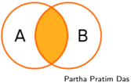
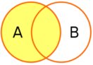
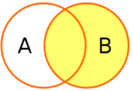
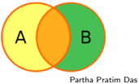

## Module 13

Partha Pratim Das

Objectives &amp; Outline

Join Expressions

Cross Join

Inner Join

Outer Join

Left Outer Join

Right Outer Join

Full Outer Join

Views

View Expansion

View Update

Materialized Views

Module Summary

## Database Management Systems

Module 13: Intermediate SQL/2

## Partha Pratim Das

Department of Computer Science and Engineering Indian Institute of Technology, Kharagpur ppd@cse.iitkgp.ac.in

Partha Pratim Das

## Module 13

Partha Pratim Das

## Objectives &amp; Outline

Join Expressions

Cross Join

Inner Join

Outer Join

Left Outer Join

Right Outer Join

Full Outer Join

Views

View Expansion

View Update

Materialized Views

Module Summary

## Module Recap

- Nested subquery in SQL
- Processes for data modification

## Module 13

Partha Pratim Das

## Objectives &amp; Outline

Join Expressions

Cross Join

Inner Join

Outer Join

Left Outer Join

Right Outer Join

Full Outer Join

Views

View Expansion

View Update

Materialized Views

Module Summary

## Module Objectives

- To learn SQL expressions for Join
- To learn SQL expressions for Views

## Module 13

Partha Pratim Das

## Objectives &amp; Outline

Join Expressions

Cross Join

Inner Join

Outer Join

Left Outer Join

Right Outer Join

Full Outer Join

Views

View Expansion

View Update

Materialized Views

Module Summary

## Module Outline

- Join Expressions
- Views

## Module 13

Partha Pratim Das

Objectives &amp; Outline

Join Expressions

Cross Join

Inner Join

Outer Join

Left Outer Join

Right Outer Join

Full Outer Join

Views

View Expansion

View Update

Materialized Views

Module Summary

## Join Expressions

## Join Expressions

## Module 13

Partha Pratim Das

Objectives &amp; Outline

Join Expressions

Cross Join

Inner Join

Outer Join

Left Outer Join

Right Outer Join

Full Outer Join

Views

View Expansion

View Update

Materialized Views

Module Summary

## Joined Relations

- Join operations take two relations and return as a result another relation
- A join operation is a Cartesian product which requires that tuples in the two relations match (under some condition).
- It also specifies the attributes that are present in the result of the join
- The join operations are typically used as subquery expressions in the from clause

## Module 13

Partha Pratim Das

Objectives &amp; Outline

Join Expressions

Cross Join

Inner Join

Outer Join

Left Outer Join

Right Outer Join

Full Outer Join

Views

View Expansion

View Update

Materialized Views

Module Summary

## Types of Join between Relations

- Cross join
- Inner join
- Equi-join
- glyph[triangleright] Natural join
- Outer join
- Left outer join
- Right outer join
- Full outer join
- Self-join

## Module 13

Partha Pratim Das

Objectives &amp; Outline

Join Expressions

Cross Join

Inner Join

Outer Join

Left Outer Join

Right Outer Join

Full Outer Join

Views

View Expansion

View Update

Materialized Views

Module Summary

## Cross Join

- •
- CROSS JOIN returns the Cartesian product of rows from tables in the join
- Explicit

select *

from employee cross join department ;

- Implicit

select * from employee, department

;

## Module 13

Partha Pratim

Das

Objectives &amp;

Outline

Join Expressions

Cross Join

Inner Join

Outer Join

Left Outer Join

Right Outer Join

Full Outer Join

Views

View Expansion

View Update

Materialized Views

Module Summary

## Join operations - Example

- Relation course
- Relation prereq
- Observe that prereq information is missing for CS-315 and course information is missing for CS-347

| course_id   | title                    | dept_name   | credits   |
|-------------|--------------------------|-------------|-----------|
| BIO-301     | Genetics                 | Biology     |           |
| CS-190      | Game Design | Comp. Sci. |             |           |
| CS-315      | Robotics                 | ComP:       | 3         |

| course_id             | prereq id             |
|-----------------------|-----------------------|
| BIO-301 CS-190 CS-347 | BIO-101 CS-101 CS-101 |

## Module 13

Partha Pratim

Das

Objectives &amp;

Outline

Join Expressions

Cross Join

Inner Join

Outer Join

Left Outer Join

Right Outer Join

Full Outer Join

Views

View Expansion

View Update

Materialized Views

Module Summary

## Inner Join

## · course inner join prereq

| course_id   | title       | dept_name   | credits   | prere_id   | course_id   |
|-------------|-------------|-------------|-----------|------------|-------------|
| BIO-301     | Genetics    | Biology     |           | BIO-101    | BIO-301     |
| CS-190      | Game Design | Comp: Sci.  |           | CS-101     | CS-190      |

## · If specified as natural , the 2 nd course id field is skipped

| course_id   | title    | dept_name   | credits   |
|-------------|----------|-------------|-----------|
| BIO-301     | Genetics | Biology     |           |
| CS-190      |          | Sci. Comp.  | 4         |
| CS-315      | Robotics | Sci. Comp.  | 3         |

| course_id             | prereq_id             |
|-----------------------|-----------------------|
| BIO-301 CS-190 CS-347 | BIO-101 CS-101 CS-101 |

## Module 13

Partha Pratim Das

Objectives &amp; Outline

Join Expressions

Cross Join

Inner Join

Outer Join

Left Outer Join

Right Outer Join

Full Outer Join

Views

View Expansion

View Update

Materialized Views

Module Summary

## Outer Join

- An extension of the join operation that avoids loss of information
- Computes the join and then adds tuples from one relation that does not match tuples in the other relation to the result of the join
- Uses null values

## Module 13

Partha Pratim

Das

Objectives &amp;

Outline

Join Expressions

Cross Join

Inner Join

Outer Join

Left Outer Join

Right Outer Join

Full Outer Join

Views

View Expansion

View Update

Materialized Views

Module Summary

## Left Outer Join

## · course natural left outer join prereq

Partha Pratim Das

| course_id   | title    | dept_name   | credits   | prere_id   |
|-------------|----------|-------------|-----------|------------|
| BIO-301     | Genetics | Biology     |           | BIO-101    |
| CS-190      |          | Sci. Comp.  | 4         | CS-101     |
| CS-315      | Robotics | Comp: Sci.  | 3         | null       |

| course_id   | title       | dept_name   | credits   |
|-------------|-------------|-------------|-----------|
| BIO-301     | Genetics    | Biology     |           |
| CS-190      | Game Design | Sci. Comp.  |           |
| CS-315      | Robotics    | Comp. Sci.  | 3         |

| course_id             | prereq_id             |
|-----------------------|-----------------------|
| BIO-301 CS-190 CS-347 | BIO-101 CS-101 CS-101 |

## Module 13

Partha Pratim

Das

Objectives &amp;

Outline

Join Expressions

Cross Join

Inner Join

Outer Join

Left Outer Join

Right Outer Join

Full Outer Join

Views

View Expansion

View Update

Materialized Views

Module Summary

## Right Outer Join

## · course natural right outer join prereq

Partha Pratim Das

| course_id             | title         | dept_name               | credits   | prere_id              |
|-----------------------|---------------|-------------------------|-----------|-----------------------|
| BIO-301 CS-190 CS-347 | Genetics null | Biology Sci. null Comp. | 4 null    | BIO-101 CS-101 CS-101 |

| course_id   | title                    | dept name   | credits   |
|-------------|--------------------------|-------------|-----------|
| BIO-301     | Genetics                 | Biology     |           |
| CS-190      | Game Design | Comp. Sci. |             |           |
| CS-315      | Robotics                 | Comp. Sci.  | 3         |

| course_id             | prereq_id             |
|-----------------------|-----------------------|
| BIO-301 CS-190 CS-347 | BIO-101 CS-101 CS-101 |

## Module 13

Partha Pratim Das

Objectives &amp; Outline

Join Expressions

Cross Join

Inner Join

Outer Join

Left Outer Join

Right Outer Join

Full Outer Join

Views

View Expansion

View Update

Materialized Views

Module Summary

## Joined Relations

- Join operations take two relations and return as a result another relation
- These additional operations are typically used as subquery expressions in the from clause
- Join condition - defines which tuples in the two relations match, and what attributes are present in the result of the join
- Join type - defines how tuples in each relation that do not match any tuple in the other relation (based on the join condition) are treated

## Join\_types

## Join Conditions

natural on &lt; predicate&gt; An)

inner join left outer join right outer join full outer join

## Module 13

Partha Pratim

Das

Objectives &amp;

Outline

Join Expressions

Cross Join

Inner Join

Outer Join

Left Outer Join

Right Outer Join

Full Outer Join

Views

View Expansion

View Update

Materialized Views

Module Summary

## Full Outer Join

## · course natural full outer join prereq

| course_id   | title       | dept_name   | credits   | prereq_id   |
|-------------|-------------|-------------|-----------|-------------|
| BIO-301     | Genetics    | Biology     |           | BIO-101     |
| CS-190      | Game Design | Sci. Comp.  |           | CS-101      |
| CS-315      | Robotics    | Comp. Sci.  | 3         | null        |
| CS-347      | null        | null        | null      | CS-101      |

| course_id   | title                    | dept_name   | credits   |
|-------------|--------------------------|-------------|-----------|
| BIO-301     | Genetics                 | Biology     |           |
| CS-190      | Game Design | Comp. Sci. |             |           |
| CS-315      | Robotics                 | Comp. Sci.  | 3         |

| course_id             | prereq_id             |
|-----------------------|-----------------------|
| BIO-301 CS-190 CS-347 | BIO-101 CS-101 CS-101 |

## Database Management Systems

## Module 13

Partha Pratim Das

Objectives &amp; Outline

Join Expressions

Cross Join

Inner Join

Outer Join

Left Outer Join

Right Outer Join

Full Outer Join

Views

View Expansion

View Update

Materialized Views

Module Summary

## Joined Relations - Examples

- course inner join prereq on course.course id = prereq.course id
- What is the difference between the above (equi join), and a natural join?
- course left outer join prereq on course.course id = prereq.course id

| course_id   | title        | dept_name   | credits   | prere_id   | course_id   |
|-------------|--------------|-------------|-----------|------------|-------------|
| BIO-301     | Genetics     | Biology     |           | BIO-101    | BIO-301     |
| CS-190      | Game Design_ | Sci.        |           | CS-101     | CS-190      |

| course_id             | title                         | dept_name                     | credits   | prere_id            | course_id           |
|-----------------------|-------------------------------|-------------------------------|-----------|---------------------|---------------------|
| BIO-301 CS-190 CS-315 | Genetics Game Design Robotics | Sci. Comp. Sci. Biology Comp. | 4 3       | BIO-101 CS-101 null | BIO-301 CS-190 null |

## Module 13

Partha Pratim

Das

Objectives &amp;

Outline

Join Expressions

Cross Join

Inner Join

Outer Join

Left Outer Join

Right Outer Join

Full Outer Join

Views

View Expansion

View Update

Materialized Views

Module Summary

## Joined Relations - Examples

## · course natural right outer join prereq

| course_id             | title                                  | dept_name    | credits   | prere_id              |
|-----------------------|----------------------------------------|--------------|-----------|-----------------------|
| BIO-301 CS-190 CS-347 | Genetics Game Design | Comp. Sci. null | Biology null | 4 null    | BIO-101 CS-101 CS-101 |

## · course full outer join prereq using (course id)

| course_id   | title       | dept_name   | credits   | prere_id   |
|-------------|-------------|-------------|-----------|------------|
| BIO-301     | Genetics    | Biology     |           | BIO-101    |
| CS-190      | Game Design | Sci. Comp.  |           | CS-101     |
| CS-315      | Robotics    | Sci. Comp   | 3         | null       |
| CS-347      | null        | null        | null      | CS-101     |

## Module 13

Partha Pratim

Das

Objectives &amp;

Outline

Join Expressions

Cross Join

Inner Join

Outer Join

Left Outer Join

Right Outer Join

Full Outer Join

Views

View Expansion

View Update

Materialized Views

Module Summary

## Views

## Views

## Module 13

Partha Pratim Das

Objectives &amp; Outline

Join Expressions

Cross Join

Inner Join

Outer Join

Left Outer Join

Right Outer Join

Full Outer Join

## Views

View Expansion

View Update

Materialized Views

Module Summary

## Views

- In some cases, it is not desirable for all users to see the entire logical model (that is, all the actual relations stored in the database.)
- Consider a person who needs to know an instructors name and department, but not the salary. This person should see a relation described, in SQL, by select ID, name, dept name from instructor
- A view provides a mechanism to hide certain data from the view of certain users
- Any relation that is not of the conceptual model but is made visible to a user as a 'virtual relation' is called a view .

## Module 13

Partha Pratim Das

Objectives &amp; Outline

Join Expressions

Cross Join

Inner Join

Outer Join

Left Outer Join

Right Outer Join

Full Outer Join

## Views

View Expansion View Update Materialized Views

Module Summary

## View Definition

- A view is defined using the create view statement which has the form create view v as &lt; query expression &gt; where &lt; query expression &gt; is any legal SQL expression
- The view name is represented by v
- Once a view is defined, the view name can be used to refer to the virtual relation that the view generates
- View definition is not the same as creating a new relation by evaluating the query expression
- Rather, a view definition causes the saving of an expression; the expression is substituted into queries using the view

## Module 13

Partha Pratim

Das

Objectives &amp; Outline

Join Expressions

Cross Join

Inner Join

Outer Join

Left Outer Join

Right Outer Join

Full Outer Join

Views

View Expansion

View Update

Materialized Views

Module Summary

## Example Views

- A view of instructors without their salary
- create view faculty as select ID, name, dept name from instructor
- Find all instructors in the Biology department
- select name from faculty

where dept name = 'Biology'

- Create a view of department salary totals
- create view departments total salary(dept name, total salary) as select dept name , sum ( salary ) from instructor group by dept name ;

Partha Pratim Das

## Module 13

Partha Pratim Das

Objectives &amp; Outline

Join Expressions

Cross Join

Inner Join

Outer Join

Left Outer Join

Right Outer Join

Full Outer Join

Views

View Expansion

View Update

Materialized Views

Module Summary

## Views Defined Using Other Views

- create view physics fall 2009 as

select course.course id, sec id, building, room number from course , section where course.course id = section.course id

and course.dept name = 'Physics'

and section.semester = 'Fall'

and section.year = '2009';

· create view physics fall 2009 watson as select course id, room number from physics fall 2009 where building = 'Watson';

## Module 13

Partha Pratim Das

Objectives &amp; Outline

Join Expressions

Cross Join

Inner Join

Outer Join

Left Outer Join

Right Outer Join

Full Outer Join

Views

View Expansion

View Update

Materialized Views

Module Summary

## View Expansion

- •
- Expand use of a view in a query/another view create view physics fall 2009 watson as ( select course id, room number from ( select course.course id, building, room number from course , section where course.course id = section.course id and course.dept name = 'Physics' and section.semester = 'Fall' and section.year = '2009') where building = 'Watson');

## Module 13

Partha Pratim Das

Objectives &amp; Outline

Join Expressions

Cross Join

Inner Join

Outer Join

Left Outer Join

Right Outer Join

Full Outer Join

Views

View Expansion

View Update

Materialized Views

Module Summary

## Views Defined Using Other Views

- One view may be used in the expression defining another view
- A view relation v 1 is said to depend directly on a view relation v 2 if v 2 is used in the expression defining v 1
- A view relation v 1 is said to depend on view relation v 2 if either v 1 depends directly on v 2 or there is a path of dependencies from v 1 to v 2
- A view relation v is said to be recursive if it depends on itself

## Module 13

Partha Pratim Das

Objectives &amp; Outline

Join Expressions

Cross Join

Inner Join

Outer Join

Left Outer Join

Right Outer Join

Full Outer Join

Views

View Expansion

View Update

Materialized Views

Module Summary

## View Expansion*

- A way to define the meaning of views defined in terms of other views
- Let view v 1 be defined by an expression e 1 that may itself contain uses of view relations
- View expansion of an expression repeats the following replacement step:
- repeat

Find any view relation v i in e 1 Replace the view relation v i by the expression defining v i until no more view relations are present in e 1

- As long as the view definitions are not recursive, this loop will terminate

## Module 13

Partha Pratim Das

Objectives &amp; Outline

Join Expressions

Cross Join

Inner Join

Outer Join

Left Outer Join

Right Outer Join

Full Outer Join

Views

View Expansion

View Update

Materialized Views

Module Summary

## Update of a View

- Add a new tuple to faculty view which we defined earlier insert into faculty values ('30765', 'Green', 'Music');
- This insertion must be represented by the insertion of the tuple ('30765', 'Green', 'Music', null) into the instructor relation

## Module 13

Partha Pratim

Das

Objectives &amp; Outline

Join Expressions

Cross Join

Inner Join

Outer Join

Left Outer Join

Right Outer Join

Full Outer Join

Views

View Expansion

View Update

Materialized Views

Module Summary

## Some Updates cannot be Translated Uniquely

- create view instructor info as select ID, name, building from instructor, department

where instructor.dept name= department.dept name ;

- insert into instructor info values ('69987', 'White', 'Taylor');
- which department, if multiple departments in Taylor?
- what if no department is in Taylor?
- Most SQL implementations allow updates only on simple views
- The from clause has only one database relation
- The select clause contains only attribute names of the relation, and does not have any expressions, aggregates, or distinct specification
- Any attribute not listed in the select clause can be set to null
- The query does not have a group by or having clause

## Module 13

Partha Pratim

Das

Objectives &amp; Outline

Join Expressions

Cross Join

Inner Join

Outer Join

Left Outer Join

Right Outer Join

Full Outer Join

Views

View Expansion

View Update

Materialized Views

Module Summary

## And Some Not at All

- create view history instructors as

select *

from instructor where dept name = 'History';

- What happens if we insert ('25566', 'Brown', 'Biology', 100000) into history instructors?

## Module 13

Partha Pratim Das

Objectives &amp; Outline

Join Expressions

Cross Join

Inner Join

Outer Join

Left Outer Join

Right Outer Join

Full Outer Join

Views

View Expansion

View Update

Materialized Views

Module Summary

## Materialized Views

- Materializing a view : create a physical table containing all the tuples in the result of the query defining the view
- If relations used in the query are updated, the materialized view result becomes out of date
- Need to maintain the view, by updating the view whenever the underlying relations are updated

Module 13

Partha Pratim Das

Objectives &amp; Outline

Join Expressions

Cross Join

Inner Join

Outer Join

Left Outer Join

Right Outer Join

Full Outer Join

Views

View Expansion

View Update

Materialized Views

Module Summary

## Module Summary

- Learnt SQL expressions for Join and Views

Slides used in this presentation are borrowed from http://db-book.com/ with kind permission of the authors.

Edited and new slides are marked with 'PPD'.