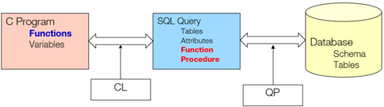
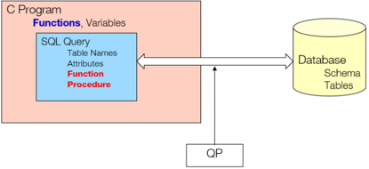

## Module 15

Partha Pratim Das

Objectives &amp; Outline

Functions and Procedural Constructs

Triggers Triggers : Functionality vs Performance

Module Summary

## Database Management Systems

Module 15: Advanced SQL

## Partha Pratim Das

Department of Computer Science and Engineering Indian Institute of Technology, Kharagpur ppd@cse.iitkgp.ac.in

Partha Pratim Das

## Module 15

Partha Pratim Das

## Objectives &amp; Outline

Functions and Procedural Constructs

Triggers

Triggers : Functionality vs Performance

Module Summary

## Module Recap

- Transactions
- Integrity Constraints
- More Data Types in SQL
- Authorization in SQL

## Module 15

Partha Pratim Das

Objectives &amp; Outline

Functions and Procedural Constructs

Triggers Triggers : Functionality vs Performance

Module Summary

## Module Objectives

- To familiarize with functions and procedures in SQL
- To understand the triggers and their performance issues

## Module 15

Partha Pratim Das

## Objectives &amp; Outline

Functions and Procedural Constructs

Triggers

Triggers : Functionality vs Performance

Module Summary

## Module Outline

- Functions and Procedural Constructs
- Triggers
- Functionality vs Performance

## Module 15

Partha Pratim Das

Objectives &amp; Outline

Functions and Procedural Constructs

Triggers

Triggers : Functionality vs Performance

Module Summary

## Functions and Procedural Constructs

Module 15

Partha Pratim

Das

Objectives &amp;

Outline

Functions and

Procedural

Constructs

Triggers

Triggers :

Functionality vs

Performance

Module Summary

## Native Language ←→ Query Language

Partha Pratim Das

Database Management Systems

## Module 15

Partha Pratim Das

Objectives &amp; Outline

Functions and Procedural Constructs

Triggers

Triggers : Functionality vs Performance

Module Summary

## Functions and Procedures

- Functions / Procedures and Control Flow Statements were added in SQL:1999
- Functions/Procedures can be written in SQL itself , or in an external programming language (like C, Java)
- Functions written in an external languages are particularly useful with specialized data types such as images and geometric objects
- glyph[triangleright] Example: Functions to check if polygons overlap, or to compare images for similarity
- Some database systems support table-valued functions , which can return a relation as a result
- SQL:1999 also supports a rich set of imperative constructs, including loops , if-then-else , and assignment
- Many databases have proprietary procedural extensions to SQL that differ from SQL:1999

## Partha Pratim Das

Module 15

Partha Pratim Das

Objectives &amp; Outline

Functions and Procedural Constructs

Triggers

Triggers :

Functionality vs

Performance

Module Summary

## SQL Functions

- Define a function that, given the name of a department, returns the count of the number of instructors in that department:
- The function dept count can be used to find the department names and budget of all departments with more that 12 instructors:

create function dept count (dept name varchar (20))

returns

integer

begin

declare d count integer;

select count (*) into d count from instructor where instructor.dept name = dept name

return d cont ; end

select dept name, budget from department

where dept count (dept name ) &gt; 12

Database Management Systems

Partha Pratim Das

15.8

## Module 15

Partha Pratim Das

Objectives &amp; Outline

Functions and Procedural Constructs

Triggers

Triggers : Functionality vs Performance

Module Summary

## SQL functions (2)

- Compound statement: begin . . . end May contain multiple SQL statements between begin and end .
- returns - indicates the variable-type that is returned (for example, integer)
- return - specifies the values that are to be returned as result of invoking the function
- SQL function are in fact parameterized views that generalize the regular notion of views by allowing parameters

Module 15

Partha Pratim Das

Objectives &amp; Outline

Functions and Procedural Constructs

Triggers

Triggers :

Functionality vs

Performance

Module Summary

## Table Functions

- Functions that return a relation as a result added in SQL:2003
- Return all instructors in a given department:

create function instructor of (dept name char (20))

returns table

(

ID varchar( 5 ) , name varchar (20),

dept name varchar (20)

salary numeric (8 , 2) )

returns table

( select ID, name, dept name, salary from

instructor where instructor.dept name = instructor of.dept name )

- Usage

select *

from table

( instructor of ('Music') )

Database Management Systems

Partha Pratim Das

15.10

Module 15

Partha Pratim Das

Objectives &amp; Outline

Functions and Procedural Constructs

Triggers

Triggers : Functionality vs Performance

Module Summary

## SQL Procedures

- The dept count function could instead be written as procedure:

create procedure dept count proc (

in dept name varchar begin

(20), out d count integer )

select count (*) into d count

from instructor

where instructor.dept name = dept count proc.dept name

end

- Procedures can be invoked either from an SQL procedure or from embedded SQL, using the call statement.

declare d count integer ; call dept count proc ('Physics', d count );

- Procedures and functions can be invoked also from dynamic SQL
- SQL:1999 allows overloading - more than one function/procedure of the same name as long as the number of arguments and / or the types of the arguments differ

Database Management Systems

Partha Pratim Das

15.11

## Module 15

Partha Pratim Das

Objectives &amp; Outline

Functions and Procedural Constructs

Triggers

Triggers : Functionality vs Performance

Module Summary

## Language Constructs for Procedures and Functions

- SQL supports constructs that gives it almost all the power of a general-purpose programming language.
- Warning : Most database systems implement their own variant of the standard syntax
- Compound statement: begin . . . end
- May contain multiple SQL statements between begin and end .
- Local variables can be declared within a compound statements

Module 15

Partha Pratim Das

Objectives &amp; Outline

Functions and Procedural Constructs

Triggers

Triggers :

Functionality vs

Performance

Module Summary

## Language Constructs (2): while and repeat

- while loop:

while boolean expression do sequence of statements ;

end while ;

- repeat loop:

repeat sequence of statements ; until boolean expression end repeat ;

## Module 15

Partha Pratim Das

Objectives &amp; Outline

Functions and Procedural Constructs

Triggers

Triggers :

Functionality vs

Performance

Module Summary

## Language Constructs (3): for

- for loop
- Permits iteration over all results of a query
- Find the budget of all departments:
- declare n integer default 0; for r as
- select budget from department

do

- set n = n + r.budget

end for ;

Module 15

Partha Pratim Das

Objectives &amp; Outline

Functions and Procedural Constructs

Triggers

Triggers : Functionality vs Performance

Module Summary

## Language Constructs (4): if-then-else

- Conditional statements
- if-then-else
- case
- if-then-else statement

if boolean expression then sequence of statements ; elseif boolean expression then sequence of statements ;

· · ·

else

sequence of statements ;

end if ;

- The if statement supports the use of optional elseif clauses and a default else clause.
- Example procedure: registers student after ensuring classroom capacity is not exceeded
- Returns 0 on success and -1 if capacity is exceeded
- See book (page 177) for details Database Management Systems

Partha Pratim Das

15.15

Module 15

Partha Pratim Das

Objectives &amp; Outline

Functions and Procedural Constructs

Triggers

Triggers :

Functionality vs

Performance

Module Summary

## Language Constructs (5): Simple case

- Simple case statement
- case variable

when value1 then sequence of statements ; when value2 then sequence of statements ;

· · ·

else sequence of statements ;

end case ;

- The when clause of the case statement defines the value that when satisfied determines the flow of control

Database Management Systems

Partha Pratim Das

Module 15

Partha Pratim Das

Objectives &amp; Outline

Functions and Procedural Constructs

Triggers

Triggers : Functionality vs Performance

Module Summary

## Language Constructs (6): Searched case

- Searched case statement

case when sql-expression = value1 then sequence of statements ; when sql-expression = value2 then sequence of statements ;

· · ·

else sequence of statements ;

end case ;

- Any supported SQL expression can be used here. These expressions can contain references to variables, parameters, special registers, and more.

## Module 15

Partha Pratim Das

Objectives &amp; Outline

Functions and Procedural Constructs

Triggers

Triggers : Functionality vs Performance

Module Summary

## Language Constructs (7): Exception

- Signaling of exception conditions, and declaring handlers for exceptions

declare out of classroom seats condition declare exit handler for out of classroom seats begin

. . .

## signal out of classroom seats

. . .

## end

- The handler here is exit causes enclosing begin . . . end to be terminate and exit
- Other actions possible on exception

Module 15

Partha Pratim Das

Objectives &amp; Outline

Functions and Procedural Constructs

Triggers

Triggers :

Functionality vs

Performance

Module Summary

## External Language Routines*

- SQL:1999 allows the definition of functions / procedures in an imperative programming language, (Java, C#, C or C++) which can be invoked from SQL queries
- Such functions can be more efficient than functions defined in SQL, and computations that cannot be carried out in SQL can be executed by these functions
- Declaring external language procedures and functions

create procedure dept count proc(

in dept name varchar (20), out count integer ) language C

external name '/usr/avi/bin/dept count proc'

create function dept count( dept name varchar (20))

returns integer language C

external name '/usr/avi/bin/dept count'

Partha Pratim Das

Database Management Systems

15.19

## Module 15

Partha Pratim Das

## Objectives &amp; Outline

Functions and Procedural Constructs

Triggers

Triggers : Functionality vs Performance

Module Summary

## External Language Routines (2)*

- Benefits of external language functions/procedures:
- More efficient for many operations, and more expressive power
- Drawbacks
- Code to implement function may need to be loaded into database system and executed in the database system's address space.
- glyph[triangleright] Risk of accidental corruption of database structures
- glyph[triangleright] Security risk, allowing users access to unauthorized data
- There are alternatives, which give good security at the cost of performance
- Direct execution in the database system's space is used when efficiency is more important than security

## Module 15

Partha Pratim Das

Objectives &amp; Outline

Functions and Procedural Constructs

Triggers

Triggers : Functionality vs Performance

Module Summary

## External Language Routines (3)*: Security

- To deal with security problems, we can do one of the following:
- Use sandbox techniques
- glyph[triangleright] That is, use a safe language like Java, which cannot be used to access/damage other parts of the database code
- Run external language functions/procedures in a separate process, with no access to the database process' memory
- glyph[triangleright] Parameters and results communicated via inter-process communication
- Both have performance overheads
- Many database systems support both above approaches as well as direct executing in database system address space

## Module 15

Partha Pratim Das

Objectives &amp; Outline

Functions and Procedural Constructs

Triggers

Triggers :

Functionality vs

Performance

Module Summary

## Triggers

## Module 15

Partha Pratim Das

Objectives &amp; Outline

Functions and Procedural Constructs

Triggers

Triggers :

Functionality vs

Performance

Module Summary

## Trigger

- A trigger defines a set of actions that are performed in response to an insert , update , or delete operation on a specified table
- When such an SQL operation is executed, the trigger is said to have been activated
- Triggers are optional
- Triggers are defined using the create trigger statement
- Triggers can be used
- To enforce data integrity rules via referential constraints and check constraints
- To cause updates to other tables, automatically generate or transform values for inserted or updated rows, or invoke functions to perform tasks such as issuing alerts
- To design a trigger mechanism, we must:
- Specify the events / (like update , insert , or delete ) for the trigger to executed
- Specify the time ( BEFORE or AFTER ) of execution
- Specify the actions to be taken when the trigger executes
- Syntax of triggers may vary across systems

Partha Pratim Das

## Module 15

Partha Pratim Das

Objectives &amp; Outline

Functions and Procedural Constructs

Triggers

Triggers :

Functionality vs

Performance

Module Summary

## Types of Triggers: BEFORE

## · BEFORE triggers

- Run before an update , or insert
- Values that are being updated or inserted can be modified before the database is actually modified. You can use triggers that run before an update or insert to:
- glyph[triangleright] Check or modify values before they are actually updated or inserted in the database
- -Useful if user-view and internal database format differs
- glyph[triangleright] Run other non-database operations coded in user-defined functions

## · BEFORE DELETE triggers

- Run before a delete
- glyph[triangleright] Checks values (a raises an error, if necessary)

## Module 15

Partha Pratim Das

Objectives &amp; Outline

Functions and Procedural Constructs

Triggers

Triggers :

Functionality vs

Performance

Module Summary

## Types of Triggers (2): AFTER

## · AFTER triggers

- Run after an update , insert , or delete
- You can use triggers that run after an update or insert to:
- glyph[triangleright] Update data in other tables
- -Useful for maintain relationships between data or keep audit trail
- glyph[triangleright] Check against other data in the table or in other tables
- -Useful to ensure data integrity when referential integrity constraints aren't appropriate, or
- -when table check constraints limit checking to the current table only
- glyph[triangleright] Run non-database operations coded in user-defined functions
- -Useful when issuing alerts or to update information outside the database

## Module 15

Partha Pratim Das

Objectives &amp; Outline

Functions and Procedural Constructs

Triggers

Triggers : Functionality vs Performance

Module Summary

## Row Level and Statement Level Triggers

There are two types of triggers based on the level at which the triggers are applied:

- Row level triggers are executed whenever a row is affected by the event on which the trigger is defined.
- Let Employee be a table with 100 rows. Suppose an update statement is executed to increase the salary of each employee by 10%. Any row level update trigger configured on the table Employee will affect all the 100 rows in the table during this update.
- Statement level triggers perform a single action for all rows affected by a statement, instead of executing a separate action for each affected row.
- Used for each statement instead of for each row
- Uses referencing old table or referencing new table to refer to temporary tables called transition tables containing the affected rows
- Can be more efficient when dealing with SQL statements that update a large number of rows

Partha Pratim Das

## Module 15

Partha Pratim Das

Objectives &amp; Outline

Functions and Procedural Constructs

Triggers

Triggers :

Functionality vs

Performance

Module Summary

## Triggering Events and Actions in SQL

- Triggering event can be an insert, delete or update
- Triggers on update can be restricted to specific attributes
- For example, after update of grade on takes
- Values of attributes before and after an update can be referenced
- referencing old row as
- : for deletes and updates
- referencing new row as : for inserts and updates
- Triggers can be activated before an event, which can serve as extra constraints. For example, convert blank grades to null.

create trigger setnull trigger before update of takes referencing new row as nrow for each row when ( nrow.grade = ' ' )

begin atomic set

nrow.grade = null ;

end ;

Database Management Systems

## Module 15

Partha Pratim Das

Objectives &amp; Outline

Functions and Procedural Constructs

Triggers

Triggers :

Functionality vs

Performance

Module Summary

## Trigger to Maintain credits earned value

create trigger credits earned after update of grade on ( takes ) referencing new row as nrow referencing old row as orow for each row when nrow.grade &lt;&gt; 'F' and nrow.grade is not null and ( orow.grade = 'F' or orow.grade is null ) begin atomic update student set tot cred= tot cred + ( select credits from course where course.course id=nrow.course id )

where student.id = nrow.id ;

end;

## Module 15

Partha Pratim Das

Objectives &amp; Outline

Functions and Procedural Constructs

Triggers

Triggers : Functionality vs Performance

Module Summary

## How to use triggers?

- The optimal use of DML triggers is for short, simple, and easy to maintain write operations that act largely independent of an applications business logic.
- Typical and recommended uses of triggers include:
- Logging changes to a history table
- Auditing users and their actions against sensitive tables
- Adding additional values to a table that may not be available to an application (due to security restrictions or other limitations), such as:
- glyph[triangleright] Login/user name
- glyph[triangleright] Time an operation occurs
- glyph[triangleright] Server/database name
- Simple validation

Source :

SQL Server triggers: The good and the scary

## Module 15

Partha Pratim Das

Objectives &amp; Outline

Functions and Procedural Constructs

Triggers

Triggers : Functionality vs Performance

Module Summary

## How not to use triggers?

- Triggers are like Lays: Once you pop, you can't stop
- One of the greatest challenges for architects and developers is to ensure that
- triggers are used only as needed, and
- to not allow them to become a one-size-fits-all solution for any data needs that happen to come along
- Adding triggers is often seen as faster and easier than adding code to an application, but the cost of doing so is compounded over time with each added line of code

Source :

SQL Server triggers: The good and the scary

## Module 15

Partha Pratim Das

Objectives &amp; Outline

Functions and Procedural Constructs

Triggers

Triggers : Functionality vs Performance

Module Summary

- Triggers can become dangerous when:
- There are too many
- Trigger code becomes complex
- Triggers go cross-server - across databases over network
- Triggers call triggers
- Recursive triggers are set to ON. This database-level setting is set to off by default
- Functions, stored procedures, or views are in triggers
- Iteration occurs

Source :

SQL Server triggers: The good and the scary

## Module 15

Partha Pratim Das

Objectives &amp; Outline

Functions and Procedural Constructs

Triggers

Triggers : Functionality vs Performance

Module Summary

## Module Summary

- Familiarized with functions and procedures in SQL
- Understood the triggers
- Familiarized with some of the performance issues of triggers

Slides used in this presentation are borrowed from http://db-book.com/ with kind permission of the authors.

Edited and new slides are marked with 'PPD'.