## Module 16

Partha Pratim Das

Week Recap

Objectives &amp;

Outline

Relational

Algebra

Select

Project

Union

Difference

Intersection

Cartesian Product

Rename

Division

Module Summary

## Database Management Systems

Module 16: Formal Relational Query Languages/1

## Partha Pratim Das

Department of Computer Science and Engineering Indian Institute of Technology, Kharagpur ppd@cse.iitkgp.ac.in

Partha Pratim Das

## Module 16

Partha Pratim Das

Week Recap

Objectives &amp; Outline

Relational Algebra

Select

Project

Union

Difference

Intersection

Cartesian Product

Rename

Division

Module Summary

## Week Recap

- SQL Examples have been practiced for basic query structures
- Nested Subquery in SQL
- Data Modification
- SQL expressions for Join and Views
- Transactions
- Integrity Constraints
- More data types in SQL
- Authorization in SQL
- Functions and Procedures in SQL
- Triggers

## Module 16

Partha Pratim Das

Week Recap

Objectives &amp; Outline

Relational

Algebra

Select

Project

Union

Difference

Intersection

Cartesian Product

Rename

Division

Module Summary

## Module Objectives

- To understand formal query language through relational algebra

## Module 16

Partha Pratim Das

Week Recap

Objectives &amp; Outline

Relational

Algebra

Select

Project

Union

Difference

Intersection

Cartesian Product

Rename

Division

Module Summary

## Module Outline

- Relational Algebra

## Module 16

Partha Pratim Das

Week Recap

Objectives &amp; Outline

Relational Algebra

Select

Project

Union

Difference

Intersection

Cartesian Product

Rename

Division

Module Summary

## Formal Relational Query Language

- Relational Algebra
- Procedural and Algebra based
- Tuple Relational Calculus
- Non-Procedural and Predicate Calculus based
- Domain Relational Calculus
- Non-Procedural and Predicate Calculus based

## Module 16

Partha Pratim Das

Week Recap

Objectives &amp; Outline

Relational Algebra

Select

Project

Union

Difference

Intersection

Cartesian Product

Rename

Division

Module Summary

## Relational Algebra

## Module 16

Partha Pratim Das

Week Recap

Objectives &amp; Outline

Relational Algebra

Select

Project

Union

Difference

Intersection

Cartesian Product

Rename

Division

Module Summary

## Relational Algebra

- Created by Edgar F Codd at IBM in 1970
- Procedural language
- Six basic operators
- select: σ
- project: Π
- union: ∪
- set difference: -
- Cartesian product:

x

- rename: ρ
- The operators take one or two relations as inputs and produce a new relation as a result

## Module 16

Partha Pratim Das

Week Recap

Objectives &amp; Outline

Relational Algebra

Select

Project

Union

Difference

Intersection

Cartesian Product

Rename

Division

Module Summary

## Select Operation

- Notation: σ p ( r )
- p is called the selection predicate
- Defined as:

σ p ( r ) = { t | t ∈ r and p ( t ) }

where p is a formula in propositional calculus consisting of terms connected by : ∧ ( and ), ∨ ( or ), ¬ ( not ) Each terms is one of:

&lt; attribute &gt; op &lt; attribute &gt; or &lt; constant &gt;

glyph[negationslash]

where op is one of: = , = , &gt;, ≥ . &lt; . ≤

- Example of selection:

σ dept name = 'Physics' ( instructor )

Database Management Systems

Partha Pratim Das

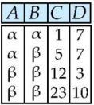

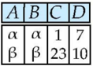

^ D &gt; 5 (r)

## Module 16

Partha Pratim Das

Week Recap

Objectives &amp; Outline

Relational

Algebra

Select

Project

Union

Difference

Intersection

Cartesian Product

Rename

Division

Module Summary

## Project Operation

- Notation: Π A 1 , A 2 ,... Ak (r) where A 1 , A 2 are attribute names and r is a relation
- The result is defined as the relation of k columns obtained by erasing the columns that are not listed
- Duplicate rows removed from result, since relations are sets
- Example: To eliminate the dept name attribute of instructor

Π ID , name , salary ( instructor )

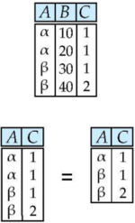

## Module 16

Partha Pratim Das

Week Recap

Objectives &amp; Outline

Relational Algebra

Select

Project

Union

Difference

Intersection

Cartesian Product

Rename

Division

Module Summary

## Union Operation

- Notation: r ∪ s
- Defined as: r ∪ s = { t | t ∈ r or t ∈ s }
- For r ∪ s to be valid.
- a) r, s must have the same arity (same number of attributes)
- b) The attribute domains must be compatible (example: 2nd column of r deals with the same type of values as does the 2nd column of s )
- c) Example: to find all courses taught in the Fall 2009 semester, or in the Spring 2010 semester, or in both

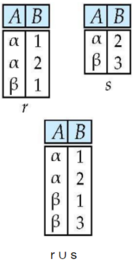

Π course id ( σ semester =' Fall ' ∧ year =2009 ( section )) ∪ Π course id ( σ semester =' Spring ' ∧ year =2010 ( section ))

## Module 16

Partha Pratim Das

Week Recap

Objectives &amp; Outline

Relational Algebra

Select

Project

Union

Difference

Intersection

Cartesian Product

Rename

Division

Module Summary

## Difference Operation

- Notation r -s
- Defined as: r -s = { t | t ∈ r and t / ∈ s }
- Set differences must be taken between compatible relations
- r and s must have the same arity
- attribute domains of r and s must be compatible
- Example: to find all courses taught in the Fall 2009 semester, but not in the Spring 2010 semester

Π course id ( σ semester =' Fall ' ∧ year =2009 ( section )) -Π course id ( σ semester =' Spring ' ∧ year =2010 ( section ))

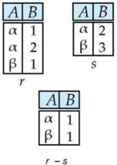

## Module 16

Partha Pratim Das

Week Recap

Objectives &amp; Outline

Relational Algebra

Select

Project

Union

Difference

Intersection

Cartesian Product

Rename

Division

Module Summary

## Intersection Operation

- Notation: r ∩ s
- Defined as:

<!-- formula-not-decoded -->

- Assume:
- r, s have the same arity
- attributes of r and s are compatible
- Note: r ∩ s = r - ( r -s )

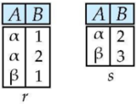

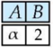

## Module 16

Partha Pratim Das

Week Recap

Objectives &amp; Outline

Relational Algebra

Select

Project

Union

Difference

Intersection

Cartesian Product

Rename

Division

Module Summary

## Cartesian-Product Operation

- Notation r × s
- Defined as:

r × s = { t q | t ∈ r and q ∈ s }

- Assume that attributes of r ( R ) and s ( S ) are disjoint. (That is, R ∩ S = φ )
- If attributes of r(R) and s(S) are not disjoint, then renaming must be used

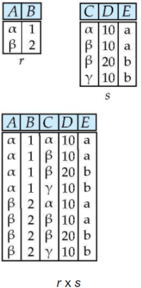

## Module 16

Partha Pratim

Das

Week Recap

Objectives &amp;

Outline

Relational

Algebra

Select

Project

Union

Difference

Intersection

Cartesian Product

Rename

Division

Module Summary

## Rename Operation

- Allows us to name, and therefore to refer to, the results of relational-algebra expressions.
- Allows us to refer to a relation by more than one name.
- Example:

ρ x ( E ) returns the expression E under the name X

- If a relational-algebra expression E has arity n , then

<!-- formula-not-decoded -->

returns the result of expression E under the name X , and with the attributes renamed to

<!-- formula-not-decoded -->

.

Database Management Systems

16.14

## Module 16

Partha Pratim Das

Week Recap

Objectives &amp; Outline

Relational Algebra

Select

Project

Union

Difference

Intersection

Cartesian Product

Rename

Division

Module Summary

## Division Operation

- The division operation is applied to two relations
- R(Z) ÷ S(X), where X subset Z. Let Y = Z - X (and hence Z = X ∪ Y); that is, let Y be the set of attributes of R that are not attributes of S
- The result of DIVISION is a relation T(Y) that includes a tuple t if tuples t R appear in R with t R [Y] = t, and with
- t R [ X ] = ts for every tuple ts in S.
- For a tuple t to appear in the result T of the DIVISION, the values in t must appear in R in combination with every tuple in S
- Division is a derived operation and can be expressed in terms of other operations
- r ÷ s ≡ Π R -S ( r ) -Π R -S ((Π R -S ( r ) × s ) -Π R -S , S ( r ))

## Module 16

Partha Pratim

Das

Week Recap

Objectives &amp;

Outline

Relational

Algebra

Select

Project

Union

Difference

Intersection

Cartesian Product

Rename

Division

Module Summary

## Division Examples

## R

| Broun   | Compilers   |
|---------|-------------|
| Brown   | Dalabases   |
| Leuis   | Proloe      |
| Smith   |             |

5

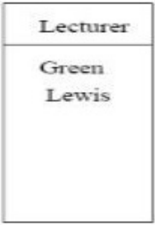

## Module 16

Partha Pratim

Das

Week Recap

Objectives &amp;

Outline

Relational

Algebra

Select

Project

Union

Difference

Intersection

Cartesian Product

Rename

Division

Module Summary

## Division Examples (2)

R

5

RIs

|                                     | Module                                                | Subject   | Lecnrer   |
|-------------------------------------|-------------------------------------------------------|-----------|-----------|
| Broun Broun Green Green Levis Suuth | Compilers Dalabases Prolog Databases Prolog Databases | Darabases | Green     |

## Division Examples (3)

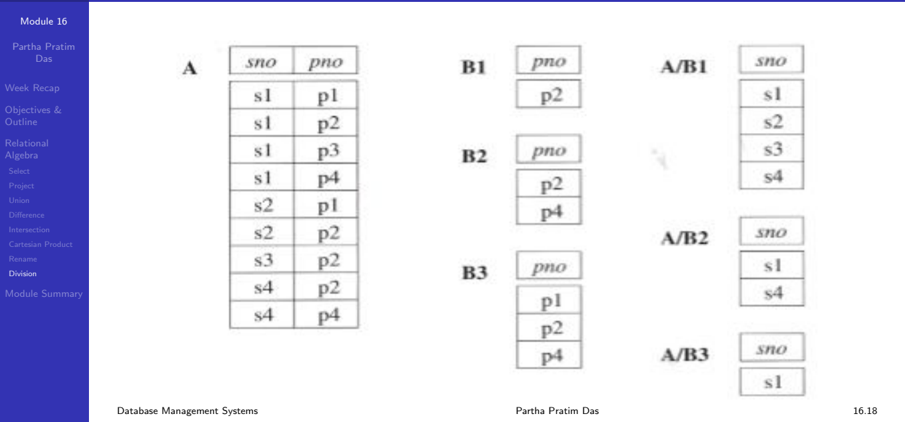

Module 16

Partha Pratim

Das

Week Recap

Objectives &amp;

Outline

Relational

Algebra

Select

Project

Union

Difference

Intersection

Cartesian Product

Rename

Division

Module Summary

## Division Example (4)

- Relations r, s :

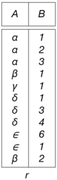

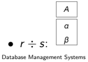

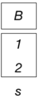

e.g. A is customer name B is branch-name 1 and 2 here show two specific branch-names (Find customers who have an account in all branches of the bank)

## Partha Pratim Das

Module 16

Partha Pratim

Das

Week Recap

Objectives &amp;

Outline

Relational

Algebra

Select

Project

Union

Difference

Intersection

Cartesian Product

Rename

Division

Module Summary

## Division Example (5)

- Relations r, s :

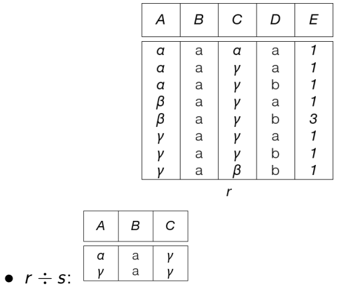

Source: db.fcngroup.nl/silberslides/Divsion Database Management Systems

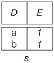

- e.g. Students who have taken both 'a' and 'b' courses, with instructor '1'

(Find students who have taken all courses given by instructor 1)

## Partha Pratim Das

Module 16

Partha Pratim Das

Week Recap

Objectives &amp; Outline

Relational Algebra

Select

Project

Union

Difference

Intersection

Cartesian Product

Rename

Division

Module Summary

## Module Summary

- Discussed relational algebra with examples

Slides used in this presentation are borrowed from http://db-book.com/ with kind permission of the authors.

Edited and new slides are marked with 'PPD'.