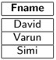
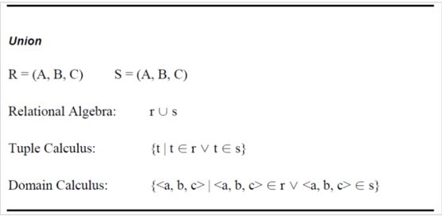
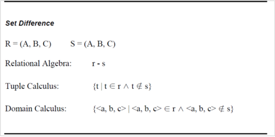
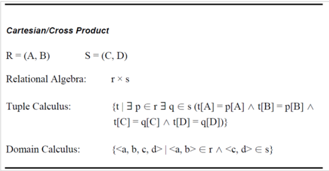
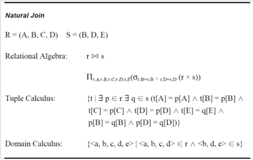

## Module 17

Partha Pratim Das

Objectives &amp; Outline

Predicate Logic

Tuple Relational Calculus

Domain Relational Calculus

Equivalence of Algebra and Calculus

Module Summary

## Database Management Systems

Module 17: Formal Relational Query Languages/2

## Partha Pratim Das

Department of Computer Science and Engineering Indian Institute of Technology, Kharagpur ppd@cse.iitkgp.ac.in

Partha Pratim Das

Module 17

Partha Pratim Das

Objectives &amp; Outline

Predicate Logic

Tuple Relational Calculus

Domain Relational Calculus

Equivalence of Algebra and Calculus

Module Summary

## Module Recap

- Relational Algebras and its Operations

Module 17

Partha Pratim Das

Objectives &amp; Outline

Predicate Logic

Tuple Relational Calculus

Domain Relational Calculus

Equivalence of Algebra and Calculus

Module Summary

## Module Objectives

- To understand formal calculus-based query language through relational algebra

## Module 17

Partha Pratim Das

Objectives &amp; Outline

Predicate Logic

Tuple Relational Calculus

Domain Relational Calculus

Equivalence of Algebra and Calculus

Module Summary

## Module Outline

- Tuple Relational Calculus (Overview only)
- Domain Relational Calculus (Overview only)
- Equivalence of Algebra and Calculus

## Module 17

Partha Pratim Das

Objectives &amp; Outline

Predicate Logic

Tuple Relational Calculus

Domain Relational Calculus

Equivalence of Algebra and Calculus

Module Summary

## Formal Relational Query Language

- Relational Algebra
- Procedural and Algebra based
- Tuple Relational Calculus
- Non-Procedural and Predicate Calculus based
- Domain Relational Calculus
- Non-Procedural and Predicate Calculus based

Module 17

Partha Pratim Das

Objectives &amp; Outline

Predicate Logic

Tuple Relational Calculus

Domain Relational Calculus

Equivalence of Algebra and Calculus

Module Summary

## Predicate Logic

Module 17

Partha Pratim Das

Objectives &amp; Outline

Predicate Logic

Tuple Relational Calculus

Domain Relational Calculus

Equivalence of Algebra and Calculus

Module Summary

## Predicate Logic

Predicate Logic or Predicate Calculus is an extension of Propositional Logic or Boolean Algebra .

It adds the concept of predicates and quantifiers to better capture the meaning of statements that cannot be adequately expressed by propositional logic.

Tuple Relational Calculus and Domain Relational Calculus are based on Predicate Calculus

## Module 17

Partha Pratim Das

Objectives &amp; Outline

Predicate Logic

Tuple Relational Calculus

Domain Relational Calculus

Equivalence of Algebra and Calculus

Module Summary

## Predicate

- Consider the statement, ' x is greater than 3'. It has two parts. The first part, the variable x , is the subject of the statement. The second part, 'is greater than 3', is the predicate. It refers to a property that the subject of the statement can have.
- The statement ' x is greater than 3' can be denoted by P ( x ) where P denotes the predicate 'is greater than 3' and x is the variable.
- The predicate P can be considered as a function. It tells the truth value of the statement P ( x ) at x . Once a value has been assigned to the variable x , the statement P ( x ) becomes a proposition and has a truth or false value.
- In general, a statement involving n variables x 1 , x 2 , x 3 , · · · , x n can be denoted by P ( x 1 , x 2 , x 3 , · · · , x n ). Here P is also referred to as n -place predicate or a n -ary predicate.

Module 17

Partha Pratim Das

Objectives &amp; Outline

Predicate Logic

Tuple Relational Calculus

Domain Relational Calculus

Equivalence of Algebra and Calculus

Module Summary

## Quantifiers

In predicate logic, predicates are used alongside quantifiers to express the extent to which a predicate is true over a range of elements. Using quantifiers to create such propositions is called quantification . There are two types of quantifiers:

- Universal Quantifier
- Existential Quantifier

Module 17

Partha Pratim Das

Objectives &amp; Outline

Predicate Logic

Tuple Relational Calculus

Domain Relational Calculus

Equivalence of Algebra and Calculus

Module Summary

## Universal Quantifier

Universal Quantification : Mathematical statements sometimes assert that a property is true for all the values of a variable in a particular domain, called the domain of discourse

- Such a statement is expressed using universal quantification.
- The universal quantification of P ( x ) for a particular domain is the proposition that asserts that P ( x ) is true for all values of x in this domain
- The domain is very important here since it decides the possible values of x
- Formally, The universal quantification of P ( x ) is the statement ' P ( x ) for all values of x in the domain'.
- The notation ∀ P ( x ) denotes the universal quantification of P ( x ). Here ∀ is called the universal quantifier. ∀ P ( x ) is read as 'for all x P ( x )'.
- Example: Let P ( x ) be the statement ' x +2 &gt; x '. What is the truth value of the statement ∀ x P ( x )?

Solution: As x +2 is greater than x for any real number, so P ( x ) ≡ T for all x or ∀ x P ( x ) ≡ T

Database Management Systems

Partha Pratim Das

Module 17

Partha Pratim Das

Objectives &amp; Outline

Predicate Logic

Tuple Relational Calculus

Domain Relational Calculus

Equivalence of Algebra and Calculus

Module Summary

## Existential Quantifier

Existential Quantification : Some mathematical statements assert that there is an element with a certain property. Such statements are expressed by existential quantification. Existential quantification can be used to form a proposition that is true if and only if P ( x ) is true for at least one value of x in the domain.

- Formally, the existential quantification of P ( x ) is the statement 'There exists an element x in the domain such that P ( x )'.
- The notation ∃ P ( x ) denotes the existential quantification of P ( x ). Here ∃ is called the existential quantifier. ∃ P ( x ) is read as 'There is atleast one such x such that P ( x )'
- Example: Let P ( x ) be the statement ' x &gt; 5'. What is the truth value of the statement ∃ xP ( x )?

Solution: P ( x ) is true for all real numbers greater than 5and false for all real numbers less than 5. So ∃ x P ( x ) ≡ T

Module 17

Partha Pratim Das

Objectives &amp; Outline

Predicate Logic

Tuple Relational Calculus

Domain Relational Calculus

Equivalence of Algebra and Calculus

Module Summary

## Tuple Relational Calculus

## Module 17

Partha Pratim Das

Objectives &amp; Outline

Predicate Logic

Tuple Relational Calculus

Domain Relational Calculus

Equivalence of Algebra and Calculus

Module Summary

## Tuple Relational Calculus

## TRC is a non-procedural query language, where each query is of the form

## { t | P ( t ) }

- where t = resulting tuples, P(t) = known as predicate and these are the conditions that are used to fetch t. P(t) may have various conditions logically combined with OR ( ∨ ), AND ( ∧ ), NOT( ¬ ).

It also uses quantifiers:

∃ t ∈ r ( Q ( t )) = 'there exists' a tuple in t in relation r such that predicate Q(t) is true. ∀ t ∈ r ( Q ( t )) = Q(t) is true 'for all' tuples in relation r.

- { P | ∃ S ∈ Students and ( S . CGPA &gt; 8 ∧ P . name = S . sname ∧ P . age = S . age ) } : returns the name and age of students with a CGPA above 8.

Database Management Systems

Partha Pratim Das

## Module 17

Partha Pratim Das

Objectives &amp; Outline

Predicate Logic

Tuple Relational Calculus

Domain Relational Calculus

Equivalence of Algebra and Calculus

Module Summary

## Predicate Calculus Formula

- a) Set of attributes and constants

glyph[negationslash]

- b) Set of comparison operators: ( e . g ., &lt;, ≤ , = , = , &gt;, ≥ )
- c) Set of connectives: and ( ∧ ), or ( ∨ ), not ( ¬ )
- d) Implication ( ⇒ ) : x ⇒ y , if x if true, then y is true x ⇒ y ≡ ¬ x ∨ y
- e) Set of quantifiers:
- ∃ t ∈ r ( Q ( t )) ≡ 'there exists' a tuple in t in relation r such that predicate Q ( t ) is true
- ∀ t ∈ r ( Q ( t )) ≡ Q is true 'for all' tuples t in relation r

## Module 17

Partha Pratim Das

Objectives &amp;

Outline

Predicate Logic

Tuple Relational

Calculus

Domain Relational Calculus

Equivalence of Algebra and Calculus

Module Summary

## TRC Example

| Student   | Student   | Student   | Student   |
|-----------|-----------|-----------|-----------|
| Fname     | Lname     | Age       | Course    |
| David     | Sharma    | 27        | DBMS      |
| Aaron     | Lilly     | 17        | JAVA      |
| Sahil     | Khan      | 19        | Python    |
| Sachin    | Rao       | 20        | DBMS      |
| Varun     | George    | 23        | JAVA      |
| Simi      | Verma     | 22        | JAVA      |

Q.1 Obtain the first name of students whose age is greater than 21.

## Solution:

{ t . Fname | Student ( t ) ∧ t . age &gt; 21 }

{ t . Fname | t ∈ Student ∧ t . age &gt; 21 }

{ t | ∃ s ∈ Student ( s . age &gt; 21 ∧ t . Fname = s . Fname ) }

## Partha Pratim Das

## Module 17

Partha Pratim Das

Objectives &amp; Outline

Predicate Logic

Tuple Relational Calculus

Domain Relational Calculus

Equivalence of Algebra and Calculus

Module Summary

## TRC Example (2)

Consider the relational schema student ( rollNo , name , year , courseId ) course ( courseId , cname , teacher )

- Q.2 Find out the names of all students who have taken the course name 'DBMS'.
- { t | ∃ s ∈ student ∃ c ∈ course ( s . courseId = c . courseId ∧ c . cname = 'DBMS' ∧ t . name = s . name ) }
- { s . name | s ∈ student ∧ ∃ c ∈ course ( s . courseId = c . courseId ∧ c . cname = 'DBMS' ) }
- Q.3 Find out the names of all students and their rollNo who have taken the course name 'DBMS'.
- { s . name , s . rollNo | s ∈ student ∧ ∃ c ∈ course ( s . courseId = c . courseId ∧ c . cname = 'DBMS' ) }
- { t | ∃ s ∈ student ∃ c ∈ course ( s . courseId = c . courseId ∧ c . cname ='DBMS' ∧ t . name = s . name ∧ t . rollNo = s . rollNo ) }

Module 17

Partha Pratim Das

Objectives &amp; Outline

Predicate Logic

Tuple Relational Calculus

Domain Relational Calculus

Equivalence of Algebra and Calculus

Module Summary

## TRC Example (3)

Consider the following relations: Flights (flno, from, to, distance, departs, arrives)

Aircraft

(aid, aname, cruisingrange)

Certified (eid, aid)

Employees (eid, ename, salary)

Q.4. Find the eids of pilots certified for Boeing aircraft.

RA

Π eid ( σ aname =' Boeing ′ ( Aircraft glyph[multicloseright] glyph[multicloseleft] Certified ))

TRC

- { C . eid | C ∈ Certified ∧ ∃ A ∈ Aircraft ( A . aid = C . aid ∧ A . aname = 'Boeing') }
- { T | ∃ C ∈ Certified ∃ A ∈ Aircraft ( A . aid = C . aid ∧ A . aname = 'Boeing' ∧ T . eid = C . eid ) }

Module 17

Partha Pratim Das

Objectives &amp; Outline

Predicate Logic

Tuple Relational Calculus

Domain Relational Calculus

Equivalence of Algebra and Calculus

Module Summary

## TRC Example (4)

Consider the following relations: Flights (flno, from, to, distance, departs, arrives) Aircraft (aid, aname, cruisingrange) Certified (eid, aid)

Employees (eid, ename, salary)

Q.5. Find the names and salaries of certified pilots working on Boeing aircrafts.

RA

Π ename , salary ( σ aname =' Boeing ' ( Aircraft glyph[multicloseright] glyph[multicloseleft] Certified glyph[multicloseright] glyph[multicloseleft] Employees ))

TRC

{ P | ∃ E ∈ Employees ∃ C ∈ Certified ∃ A ∈ Aircraft ( A . aid = C . aid ∧ A . aname = 'Boeing' ∧ E . eid = C . eid ∧ P . ename = E . ename ∧ P . salary = E . salary ) }

Module 17

Partha Pratim Das

Objectives &amp; Outline

Predicate Logic

Tuple Relational Calculus

Domain Relational Calculus

Equivalence of Algebra and Calculus

Module Summary

## TRC Example (5)

Consider the following relations: Flights (flno, from, to, distance, departs, arrives) Aircraft (aid, aname, cruisingrange) Certified (eid, aid) Employees (eid, ename, salary)

Q.6 Identify the flights that can be piloted by every pilot whose salary is more than $ 100,000. (Hint: The pilot must be certified for at least one plane with a sufficiently large cruising range.)

- { F . flno | F ∈ Flights ∧ ∃ A ∈ Aircraft ∃ C ∈ Certified ∃ E ∈ Employees ( A . cruisingrange &gt; F . distance ∧ A . aid = C . aid ∧ E . salary &gt; 100 , 000 ∧ E . eid = C . eid ) }

## Module 17

Partha Pratim Das

Objectives &amp; Outline

Predicate Logic

Tuple Relational Calculus

Domain Relational Calculus

Equivalence of Algebra and Calculus

Module Summary

## Safety of Expressions

- It is possible to write tuple calculus expressions that generate infinite relations
- For example, { t | ¬ t ∈ r } results in an infinite relation if the domain of any attribute of relation r is infinite
- To guard against the problem, we restrict the set of allowable expressions to safe expressions
- An expression { t | P ( t ) } in the tuple relational calculus is safe if every component of t appears in one of the relations, tuples, or constants that appear in P .
- NOTE: this is more than just a syntax condition
- E.g. { t | t [ A ] = 5 ∨ true } is not safe - it defines an infinite set with attribute values that do not appear in any relation or tuples or constants in P

Module 17

Partha Pratim Das

Objectives &amp; Outline

Predicate Logic

Tuple Relational Calculus

Domain Relational Calculus

Equivalence of Algebra and Calculus

Module Summary

## Domain Relational Calculus

Module 17

Partha Pratim Das

Objectives &amp; Outline

Predicate Logic

Tuple Relational Calculus

Domain Relational Calculus

Equivalence of Algebra and Calculus

Module Summary

## Domain Relational Calculus

- A non-procedural query language equivalent in power to the tuple relational calculus
- Each query is an expression of the form:

<!-- formula-not-decoded -->

- x 1 , x 2 , . . . , x n represent domain variables
- P represents a formula similar to that of the predicate calculus

Module 17

Partha Pratim Das

Objectives &amp; Outline

Predicate Logic

Tuple Relational Calculus

Domain Relational Calculus

Equivalence of Algebra and Calculus

Module Summary

## Equivalence of Algebra and Calculus

Module 17

Partha Pratim Das

Objectives &amp; Outline

Predicate Logic

Tuple Relational Calculus

Domain Relational Calculus

Equivalence of Algebra and Calculus

Module Summary

## Equivalence of RA, TRC and DRC

## Select Operation

Relational Algebra:

0B=17 (r)

Tuple Calculus:

Domain Calculus:

Source: http://www.cs.sfu.ca/CourseCentral/354/louie/Equiv Notations.pdf

Database Management Systems

Partha Pratim Das

Module 17

Partha Pratim Das

Objectives &amp; Outline

Predicate Logic

Tuple Relational Calculus

Domain Relational Calculus

Equivalence of Algebra and Calculus

Module Summary

## Equivalence of RA, TRC and DRC

## Project Operation

R = (A.B)

Relational Algebra:

M(r)

Tuple Calculus:

p[A])}

Domain Calculus:

{&lt;a&gt;|3b ( &lt;a,b&gt; € r )}

Source: http://www.cs.sfu.ca/CourseCentral/354/louie/Equiv Notations.pdf

Database Management Systems

Partha Pratim Das

Module 17

Partha Pratim Das

Objectives &amp; Outline

Predicate Logic

Tuple Relational Calculus

Domain Relational Calculus

Equivalence of Algebra and Calculus

Module Summary

## Equivalence of RA, TRC and DRC

## Combining Operations

R = (A. B)

Relational Algebra:

M(OB-1- (r)

Tuple Calculus:

p[B] = 17)}

Domain Calculus:

{&lt;a&gt;|3b ( &lt;a,b&gt; €r ^ b = 17)}

Source: http://www.cs.sfu.ca/CourseCentral/354/louie/Equiv Notations.pdf

Database Management Systems

Partha Pratim Das

Module 17

Partha Pratim Das

Objectives &amp; Outline

Predicate Logic

Tuple Relational Calculus

Domain Relational Calculus

Equivalence of Algebra and Calculus

Module Summary

## Equivalence of RA, TRC and DRC

Source: http://www.cs.sfu.ca/CourseCentral/354/louie/Equiv Notations.pdf

Database Management Systems

Partha Pratim Das

Module 17

Partha Pratim Das

Objectives &amp; Outline

Predicate Logic

Tuple Relational Calculus

Domain Relational Calculus

Equivalence of Algebra and Calculus

Module Summary

## Equivalence of RA, TRC and DRC

## Set Difference

Relational Algebra:

Tuple Calculus:

Domain Calculus:

2a.

Source: http://www.cs.sfu.ca/CourseCentral/354/louie/Equiv Notations.pdf

Database Management Systems

Partha Pratim Das

Module 17

Partha Pratim Das

Objectives &amp; Outline

Predicate Logic

Tuple Relational Calculus

Domain Relational Calculus

Equivalence of Algebra and Calculus

Module Summary

## Equivalence of RA, TRC and DRC

Intersection

R = (A,B, C)

Relational Algebra:

Tuple Calculus:

Domain Calculus:

Source: http://www.cs.sfu.ca/CourseCentral/354/louie/Equiv Notations.pdf

Database Management Systems

Partha Pratim Das

Module 17

Partha Pratim Das

Objectives &amp; Outline

Predicate Logic

Tuple Relational Calculus

Domain Relational Calculus

Equivalence of Algebra and Calculus

Module Summary

## Equivalence of RA, TRC and DRC

## CartesianlCross Product

R = (A B)

S = (C.D)

Relational Algebra:

Tuple Calculus:

t[C]=q[C] ^ t[D] = q[D])}

Domain Calculus:

Source: http://www.cs.sfu.ca/CourseCentral/354/louie/Equiv Notations.pdf

Database Management Systems

Partha Pratim Das

Module 17

Partha Pratim Das

Objectives &amp; Outline

Predicate Logic

Tuple Relational Calculus

Domain Relational Calculus

Equivalence of Algebra and Calculus

Module Summary

## Equivalence of RA, TRC and DRC

## Natural Join

S = (B.D.E)

Relational Algebra:

AD=sD (rx s))

Tuple Calculus:

t[C] = p[C] ^ t[D] = p[D] ^ t[E] = q[E] ^ p[B] = q[B] p[D] q[D])}

Domain Calculus:

Module 17

Partha Pratim Das

Objectives &amp; Outline

Predicate Logic

Tuple Relational Calculus

Domain Relational Calculus

Equivalence of Algebra and Calculus

Module Summary

## Equivalence of RA, TRC and DRC

## Division

R = (A. B)

S = (B)

Relational Algebra:

1 &amp; $

Tuple Calculus:

{t|aperVq€s (p[B] = q[B] = t[A] = p[A])}

Domain Calculus:

{&lt;a&gt; | &lt;a&gt; €r ^ V&lt;b&gt; (&lt;b&gt; € s = &lt;a,b&gt; € r)}

Source: http://www.cs.sfu.ca/CourseCentral/354/louie/Equiv Notations.pdf

Database Management Systems

Partha Pratim Das

## Module 17

Partha Pratim Das

Objectives &amp; Outline

Predicate Logic

Tuple Relational Calculus

Domain Relational Calculus

Equivalence of Algebra and Calculus

Module Summary

## Module Summary

- Introduced tuple relational and domain relational calculus
- Illustrated equivalence of algebra and calculus

Slides used in this presentation are borrowed from http://db-book.com/ with kind permission of the authors. Edited and new slides are marked with 'PPD'.