## Module 18

Partha Pratim Das

Objectives &amp; Outline

Design Process

Abstraction

Models

Design Approach

ER Model

Attributes

Entity Sets

Relationship

Cardinality

Constraints

Weak Entity Sets

Module Summary

## Database Management Systems

Module 18: Entity-Relationship Model/1

## Partha Pratim Das

Department of Computer Science and Engineering Indian Institute of Technology, Kharagpur ppd@cse.iitkgp.ac.in

Partha Pratim Das

## Module 18

Partha Pratim Das

## Objectives &amp; Outline

Design Process

Abstraction

Models

Design Approach

ER Model

Attributes

Entity Sets

Relationship

Cardinality

Constraints

Weak Entity Sets

Module Summary

## Module Recap

- Predicate Calculus
- Tuple Relational and Domain Relational Calculus
- Equivalence of Relational Algebra and Relational Calculus

## Module 18

Partha Pratim Das

## Objectives &amp; Outline

Design Process

Abstraction

Models

Design Approach

ER Model

Attributes

Entity Sets

Relationship

Cardinality

Constraints

Weak Entity Sets

Module Summary

## Module Objectives

- To understand the Design Process for Database Systems
- To study the E-R Model for real world representation

## Module 18

Partha Pratim Das

## Objectives &amp; Outline

Design Process

Abstraction

Models

Design Approach

ER Model

Attributes

Entity Sets

Relationship

Cardinality

Constraints

Weak Entity Sets

Module Summary

## Module Outline

- Design Process
- E-R Model
- Entity and Entity Set
- Relationship
- glyph[triangleright] Cardinality
- Attributes
- Weak Entity Sets

## Module 18

Partha Pratim Das

Objectives &amp; Outline

Design Process

Abstraction

Models

Design Approach

ER Model

Attributes

Entity Sets

Relationship

Cardinality

Constraints

Weak Entity Sets

Module Summary

## Design Process

## Module 18

Partha Pratim Das

Objectives &amp; Outline

Design Process

Abstraction

Models

Design Approach

ER Model

Attributes

Entity Sets

Relationship

Cardinality

Constraints

Weak Entity Sets

Module Summary

## What is Design?

## A Design:

- Satisfies a given (perhaps informal) functional specification
- Conforms to limitations of the target medium
- Meets implicit or explicit requirements on performance and resource usage
- Satisfies implicit or explicit design criteria on the form of the artifact
- Satisfies restrictions on the design process itself, such as its length or cost, or the tools available for doing the design

Module 18

Partha Pratim Das

Objectives &amp; Outline

Design Process

Abstraction

Models

Design Approach

ER Model

Attributes

Entity Sets

Relationship

Cardinality

Constraints

Weak Entity Sets

Module Summary

## Role of Abstraction

- Disorganized Complexity results from
- Storage (STM) limitations of human brain - an individual can simultaneously comprehend of the order of seven, plus or minus two chunks of information
- Speed limitations of human brain - it takes the mind about five seconds to accept a new chunk of information
- Abstraction provides the major tool to handle Disorganized Complexity by chunking information
- Ignore inessential details, deal only with the generalized, idealized model of the world

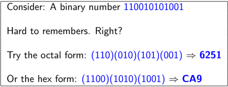

Database Management Systems

Partha Pratim Das

## Module 18

Partha Pratim Das

Objectives &amp; Outline

Design Process Abstraction

Models

Design Approach

ER Model

Attributes

Entity Sets

Relationship

Cardinality

Constraints

Weak Entity Sets

Module Summary

## Model Building

- Physics
- Time-Distance Equation
- Quantum Mechanics
- Chemistry
- Valency-Bond Structures
- Geography
- Maps
- Projections
- Electrical Circuits
- Kirchoff's Loop Equations
- Time Series Signals and FFT
- Transistor Models
- Schematic Diagram
- Interconnect Routing
- Building &amp; Bridges
- Drawings - Plan, Elevation, Side view
- Finite Element Models
- Models are common in all engineering disciplines
- Model building follows principles of decomposition, abstraction, and hierarchy
- Each model describes a specific aspect of the system
- Build new models upon old proven models

## Module 18

Partha Pratim Das

Objectives &amp; Outline

Design Process

Abstraction

Models

Design Approach

ER Model

Attributes

Entity Sets

Relationship

Cardinality

Constraints

Weak Entity Sets

Module Summary

## Design Approach

- Requirement Analysis : Analyse the data needs of the prospective database users
- Planning
- System Definition
- Database Designing : Use a modeling framework to create abstraction of the real world
- Logical Model
- Physical Model
- Implementation
- Data Conversion and Loading
- Testing

Requirements analysis

- Planning
- System definition

Database Management Systems

Database designing

- Logical model
- Physical model

Partha Pratim Das

Implementation

- Data conversion and loading

Testing

Module 18

Partha Pratim

Das

Objectives &amp;

Outline

Design Process

Abstraction

Models

Design Approach

ER Model

Attributes

Entity Sets

Relationship

Cardinality

Constraints

Weak Entity Sets

Module Summary

## Design Approach (2): Database Designing

- Logical Model : Deciding on a good database schema
- Business Decision : What attributes should we record in the database?
- Computer Science Decision : What relation schema should we have and how should the attributes be distributed among the various relation schema?
- Physical Model : Deciding on the physical layout of the database

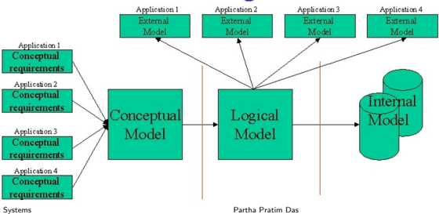

Database Management Systems

## Module 18

Partha Pratim Das

Objectives &amp; Outline

Design Process

Abstraction

Models

Design Approach

ER Model

Attributes

Entity Sets

Relationship

Cardinality

Constraints

Weak Entity Sets

Module Summary

## Design Approach (3): Database Designing: Logical Model

## · Entity Relationship Model

- Models an enterprise as a collection of entities and relationships
- glyph[triangleright] Entity : A distinguishable 'thing' or 'object' in the enterprise
- -Described by a set of attributes
- glyph[triangleright] Relationship : An association among multiple entities
- Represented by an Entity-Relationship or ER Diagram
- Database Normalization (Chapter 8)
- Formalize what designs are bad, and test for them

## Module 18

Partha Pratim Das

Objectives &amp; Outline

Design Process

Abstraction

Models

Design Approach

ER Model

Attributes

Entity Sets

Relationship

Cardinality

Constraints

Weak Entity Sets

Module Summary

## Entity Relationship (ER) Model

## Module 18

Partha Pratim Das

Objectives &amp; Outline

Design Process

Abstraction

Models

Design Approach

ER Model

Attributes

Entity Sets

Relationship

Cardinality

Constraints

Weak Entity Sets

Module Summary

## ER Model: Database Modeling

- The ER data model was developed to facilitate database design by allowing specification of an enterprise schema that represents the overall logical structure of a database
- The ER model is useful in mapping the meanings and interactions of real-world enterprises onto a conceptual schema
- The ER data model employs three basic concepts:
- Attributes
- Entity sets
- Relationship sets
- The ER model also has an associated diagrammatic representation, the ER diagram, which can express the overall logical structure of a database graphically

## Module 18

Partha Pratim Das

Objectives &amp; Outline

Design Process

Abstraction

Models

Design Approach

ER Model

Attributes

Entity Sets

Relationship

Cardinality Constraints

Weak Entity Sets

Module Summary

## Attributes

- An Attribute is a property associated with and entity / entity set. Based on the values of certain attributes, an entity can be identified uniquely
- Attribute types:
- Simple and Composite attributes
- Single-valued and Multivalued attributes
- glyph[triangleright] Example: Multivalued attribute: phone numbers
- Derived attributes
- glyph[triangleright] Can be computed from other attributes
- glyph[triangleright] Example: age, given date of birth
- Domain : Set of permitted values for each attribute

## Module 18

Partha Pratim

Das

Objectives &amp;

Outline

Design Process

Abstraction

Models

Design Approach

ER Model

Attributes

Entity Sets

Relationship

Cardinality

Constraints

Weak Entity Sets

Module Summary

## Attributes (2): Composite

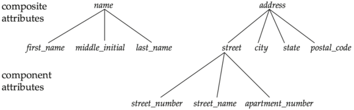

## Module 18

Partha Pratim Das

Objectives &amp; Outline

Design Process

Abstraction

Models

Design Approach

ER Model

Attributes

Entity Sets

Relationship

Cardinality

Constraints

Weak Entity Sets

Module Summary

## Entity Sets

- An entity is an object that exists and is distinguishable from other objects.
- Example: specific person, company, event, plant
- An entity set is a set of entities of the same type that share the same properties.
- Example: set of all persons, companies, trees, holidays
- An entity is represented by a set of attributes; i.e., descriptive properties possessed by all members of an entity set.
- ◦
- Example: instructor = ( ID, name, street, city, salary ) course = ( course id, title, credits )
- A subset of the attributes form a primary key of the entity set; that is, uniquely identifying each member of the set.
- Primary key of an entity set is represented by underlining it

Module 18

Partha Pratim

Das

Objectives &amp;

Outline

Design Process

Abstraction

Models

Design Approach

ER Model

Attributes

Entity Sets

Relationship

Cardinality

Constraints

Weak Entity Sets

Module Summary

## Entity Sets instructor and student

## instructor\_ID instructor name

instructor

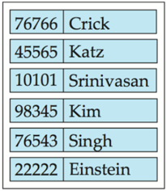

## student-ID student\_name

student

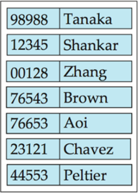

## Module 18

Partha Pratim Das

Objectives &amp; Outline

Design Process

Abstraction

Models

Design Approach

ER Model

Attributes

Entity Sets

Relationship

Cardinality Constraints

Weak Entity Sets

Module Summary

## Relationship Sets

- A relationship is an association among several entities

Example:

44553 (Peltier)

advisor

22222 (Einstein)

student entity relationship set

instructor entity

- A relationship set is a mathematical relation among n ≥ 2 entities, each taken from entity sets

<!-- formula-not-decoded -->

where ( e 1 , e 2 , . . . e n ) is a relationship.

- Example:

(44553 , 22222) ∈ advisor

Module 18

Partha Pratim

Das

Objectives &amp;

Outline

Design Process

Abstraction

Models

Design Approach

ER Model

Attributes

Entity Sets

Relationship

Cardinality

Constraints

Weak Entity Sets

Module Summary

## Relationship Set (2) advisor

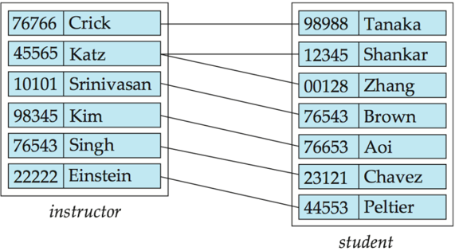

## Module 18

Partha Pratim Das

Objectives &amp; Outline

Design Process

Abstraction

Models

Design Approach

ER Model

Attributes

Entity Sets

Relationship

Cardinality

Constraints

Weak Entity Sets

Module Summary

## Relationship Sets (3)

- An attribute can also be associated with a relationship set.
- For instance, the advisor relationship set between entity sets instructor and student may have the attribute date which tracks when the student started being associated with the advisor

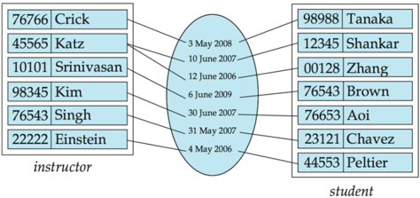

## Module 18

Partha Pratim Das

Objectives &amp; Outline

Design Process

Abstraction

Models

Design Approach

ER Model

Attributes

Entity Sets

Relationship

Cardinality Constraints

Weak Entity Sets

Module Summary

## Relationship Set (4): Degree

- Binary relationship
- involves two entity sets (or degree two).
- most relationship sets in a database system are binary.
- Relationships between more than two entity sets are rare. Most relationships are binary
- Example: students work on research projects under the guidance of an instructor .
- relationship proj guide is a ternary relationship between instructor, student, and project

## Module 18

Partha Pratim Das

Objectives &amp; Outline

Design Process

Abstraction

Models

Design Approach

ER Model

Attributes

Entity Sets

Relationship

Cardinality Constraints

Weak Entity Sets

Module Summary

## Attributes (3): Redundant

- Suppose we have entity sets:
- instructor , with attributes: ID, name, dept name, salary
- department , with attributes: dept name, building, budget
- We model the fact that each instructor has an associated department using a relationship set inst dept
- The attribute dept name appears in both entity sets. Since it is the primary key for the entity set department , it replicates information present in the relationship and is therefore redundant in the entity set instructor and needs to be removed
- BUT: When converting back to tables, in some cases the attribute gets reintroduced, as we will see later

## Module 18

Partha Pratim Das

Objectives &amp; Outline

Design Process

Abstraction

Models

Design Approach

ER Model

Attributes

Entity Sets

Relationship

Cardinality Constraints

Weak Entity Sets

Module Summary

## Mapping Cardinality Constraints

- Express the number of entities to which another entity can be associated via a relationship set.
- Most useful in describing binary relationship sets.
- For a binary relationship set the mapping cardinality must be one of the following types:
- One to one
- One to many
- Many to one
- Many to many

Module 18

Partha Pratim

Das

Objectives &amp;

Outline

Design Process

Abstraction

Models

Design Approach

ER Model

Attributes

Entity Sets

Relationship

Cardinality

Constraints

Weak Entity Sets

Module Summary

## Mapping Cardinalities

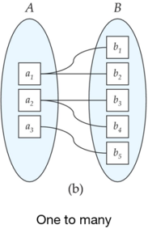

B

One to one

Note: Some elements in A and B may not be mapped to any elements in the other set

Partha Pratim Das

Module 18

Partha Pratim

Das

Objectives &amp;

Outline

Design Process

Abstraction

Models

Design Approach

ER Model

Attributes

Entity Sets

Relationship

Cardinality

Constraints

Weak Entity Sets

Module Summary

## Mapping Cardinalities

Note: Some elements in A and B may not be mapped to any elements in the other set

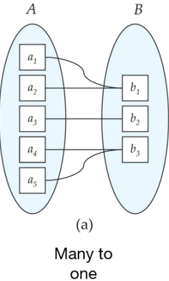

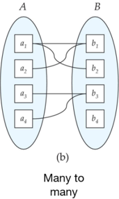

## Module 18

Partha Pratim Das

Objectives &amp; Outline

Design Process

Abstraction

Models

Design Approach

ER Model

Attributes

Entity Sets

Relationship

Cardinality Constraints

Weak Entity Sets

Module Summary

## Weak Entity Sets

## An entity set may be of two types:

- Strong entity set
- A strong entity set is an entity set that contains sufficient attributes to uniquely identify all its entities
- In other words, a primary key exists for a strong entity set
- Primary key of a strong entity set is represented by underlining it
- Weak entity set
- A weak entity set is an entity set that does not contain sufficient attributes to uniquely identify its entities
- In other words, a primary key does not exist for a weak entity set
- However, it contains a partial key called as a discriminator
- Discriminator can identify a group of entities from the entity set
- Discriminator is represented by underlining with a dashed line

## Module 18

Partha Pratim Das

Objectives &amp; Outline

Design Process

Abstraction

Models

Design Approach

ER Model

Attributes

Entity Sets

Relationship

Cardinality Constraints

Weak Entity Sets

Module Summary

## Weak Entity Sets (2)

- Since a weak entity set does not have primary key, it cannot independently exist in the ER Model
- It features in the model in relationship with a strong entity set. This is called the identifying relationship
- Primary Key of Weak Entity Set
- The combination of discriminator and primary key of the strong entity set makes it possible to uniquely identify all entities of the weak entity set
- Thus, this combination serves as a primary key for the weak entity set.
- Clearly, this primary key is not formed by the weak entity set completely.
- Primary Key of Weak Entity Set = Its own discriminator + Primary Key of Strong Entity Set
- Weak entity set must have total participation in the identifying relationship. That is all its entities must feature in the relationship

Partha Pratim Das

Module 18

Partha Pratim Das

Objectives &amp; Outline

Design Process

Abstraction

Models

Design Approach

ER Model

Attributes

Entity Sets

Relationship

Cardinality Constraints

Weak Entity Sets

Module Summary

## Weak Entity Sets (3): Example

- Strong Entity Set : Building (building no, building name, address). building no is its primary key
- Weak Entity Set : Apartment (door no, floor). door no is its discriminator as door no alone can not identify an apartment uniquely. There may be several other buildings having the same door number
- Relationship : BA between Building and Apartment
- By total participation in BA , each apartment must be present in at least one building
- In contrast, Building has partial participation in BA only as there might exist some buildings which has no apartment
- Primary Key : To uniquely identify any apartment
- First, building no is required to identify the particular building
- Second, door no of the apartment is required to uniquely identify the apartment
- Primary key of Apartment = Primary key of Building + Its own discriminator = building no + door no

Database Management Systems

Partha Pratim Das

## Module 18

Partha Pratim

Das

Objectives &amp; Outline

Design Process

Abstraction

Models

Design Approach

ER Model

Attributes

Entity Sets

Relationship

Cardinality

Constraints

Weak Entity Sets

Module Summary

## Weak Entity Sets (4): Example

- Consider a section entity, which is uniquely identified by a course id, semester, year, and sec id.
- Clearly, section entities are related to course entities. Suppose we create a relationship set sec course between entity sets section and course.
- Note that the information in sec course is redundant, since section already has an attribute course id , which identifies the course with which the section is related.

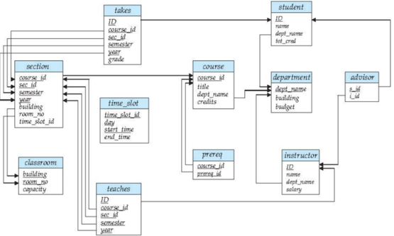

## Module 18

Partha Pratim Das

Objectives &amp; Outline

Design Process

Abstraction

Models

Design Approach

ER Model

Attributes

Entity Sets

Relationship

Cardinality Constraints

Weak Entity Sets

Module Summary

## Module Summary

- Introduced the Design Process for Database Systems
- Elucidated the E-R Model for real world representation with entities, entity sets, attributes, and relationships

Slides used in this presentation are borrowed from http://db-book.com/ with kind permission of the authors. Edited and new slides are marked with 'PPD'.

Database Management Systems

Partha Pratim Das

18.30