## Module 19

Partha Pratim Das

Objectives &amp; Outline

ER Diagram

Entity Sets

Relationship Sets

Cardinality

Constraints

Participation

Bounds

ER Model to Relational Schema

Entity Sets

Relationship

Composite Attributes

Multivalued

Attributes

Redundancy

Module Summary

## Database Management Systems

Module 19: Entity-Relationship Model/2

## Partha Pratim Das

Department of Computer Science and Engineering Indian Institute of Technology, Kharagpur ppd@cse.iitkgp.ac.in

Partha Pratim Das

## Module 19

Partha Pratim Das

Objectives &amp; Outline

ER Diagram

Entity Sets

Relationship Sets

Cardinality

Constraints

Participation

Bounds

ER Model to Relational Schema

Entity Sets

Relationship

Composite Attributes

Multivalued Attributes

Redundancy

Module Summary

## Module Recap

- Design Process for Database Systems
- ER Model for real world representation with entities, entity sets, attributes, and relationships

## Module 19

Partha Pratim Das

Objectives &amp; Outline

ER Diagram

Entity Sets

Relationship Sets

Cardinality

Constraints

Participation

Bounds

ER Model to Relational Schema

Entity Sets

Relationship

Composite Attributes

Multivalued

Attributes

Redundancy

Module Summary

## Module Objectives

- To illustrate ER Diagram notation for ER Models
- To explore translation of ER Models to Relational Schemas

## Module 19

Partha Pratim Das

Objectives &amp; Outline

ER Diagram

Entity Sets

Relationship Sets

Cardinality

Constraints

Participation

Bounds

ER Model to Relational Schema

Entity Sets

Relationship

Composite Attributes

Multivalued

Attributes

Redundancy

Module Summary

## Module Outline

- ER Diagram
- ER Model to Relational Schema

## Module 19

Partha Pratim Das

Objectives &amp; Outline

ER Diagram

Entity Sets

Relationship Sets

Cardinality

Constraints

Participation

Bounds

ER Model to Relational Schema

Entity Sets

Relationship

Composite Attributes

Multivalued

Attributes

Redundancy

Module Summary

## ER Diagram

## Module 19

Partha Pratim Das

Objectives &amp;

Outline

ER Diagram

Entity Sets

Relationship Sets

Cardinality

Constraints

Participation

Bounds

ER Model to

Relational

Schema

Entity Sets

Relationship

Composite Attributes

Multivalued

Attributes

Redundancy

Module Summary

## Entity Sets

- Entities can be represented graphically as follows:
- Rectangles represent entity sets.
- Attributes are listed inside entity rectangle.
- Underline indicates primary key attributes.

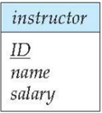

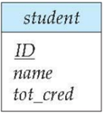

## Module 19

Partha Pratim

Das

Objectives &amp;

Outline

ER Diagram

Entity Sets

Relationship Sets

Cardinality

Constraints

Participation

Bounds

ER Model to

Relational

Schema

Entity Sets

Relationship

Composite Attributes

Multivalued

Attributes

Redundancy

Module Summary

## Relationship Sets

- Diamonds represent relationship sets.

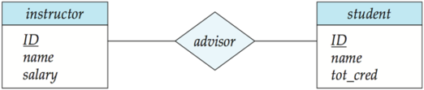

Module 19

Partha Pratim

Das

Objectives &amp;

Outline

ER Diagram

Entity Sets

Relationship Sets

Cardinality

Constraints

Participation

Bounds

ER Model to

Relational

Schema

Entity Sets

Relationship

Composite Attributes

Multivalued

Attributes

Redundancy

Module Summary

## Relationship Sets with Attributes

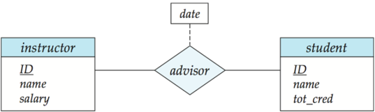

## Module 19

Partha Pratim Das

Objectives &amp; Outline

ER Diagram

Entity Sets

Relationship Sets

Cardinality

Constraints

Participation

Bounds

ER Model to

Relational

Schema

Entity Sets

Relationship

Composite Attributes

Multivalued

Attributes

Redundancy

Module Summary

## Roles

- Entity sets of a relationship need not be distinct Each occurrence of an entity set plays a 'role' in the relationship
- The labels 'course id' and 'prereq id' are called roles .

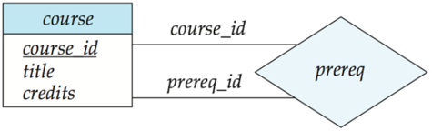

## Module 19

Partha Pratim Das

Objectives &amp; Outline

ER Diagram

Entity Sets

Relationship Sets

Cardinality

Constraints

Participation

Bounds

ER Model to

Relational

Schema

Entity Sets

Relationship

Composite Attributes

Multivalued

Attributes

Redundancy

Module Summary

## Cardinality Constraints

- We express cardinality constraints by drawing either a directed line ( → ), signifying 'one,' or an undirected line (-), signifying 'many,' between the relationship set and the entity set.
- One-to-one relationship between an instructor and a student :
- A student is associated with at most one instructor via the relationship advisor
- An instructor is associated with at most one student via the relationship advisor

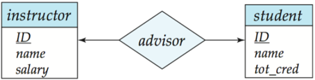

## Module 19

Partha Pratim Das

Objectives &amp; Outline

ER Diagram

Entity Sets

Relationship Sets

Cardinality

Constraints

Participation

Bounds

ER Model to

Relational

Schema

Entity Sets

Relationship

Composite Attributes

Multivalued

Attributes

Redundancy

Module Summary

## One-to-Many Relationship

- one-to-many relationship between an instructor and a student
- an instructor is associated with several (including 0) students via advisor ◦ a student is associated with at most one instructor via advisor

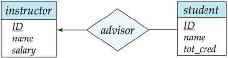

## Module 19

Partha Pratim Das

Objectives &amp;

Outline

ER Diagram

Entity Sets

Relationship Sets

Cardinality

Constraints

Participation

Bounds

ER Model to

Relational

Schema

Entity Sets

Relationship

Composite Attributes

Multivalued

Attributes

Redundancy

Module Summary

## Many-to-One Relationships

- many-to-one relationship between a student and an instructor ,
- an instructor is associated with at most one student via advisor,
- and a student is associated with several (including 0) instructors via advisor

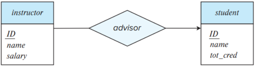

Module 19

Partha Pratim

Das

Objectives &amp;

Outline

ER Diagram

Entity Sets

Relationship Sets

Cardinality

Constraints

Participation

Bounds

ER Model to

Relational

Schema

Entity Sets

Relationship

Composite Attributes

Multivalued

Attributes

Redundancy

Module Summary

## Many-to-Many Relationship

- An instructor is associated with several (possibly 0) students via advisor
- A student is associated with several (possibly 0) instructors via advisor

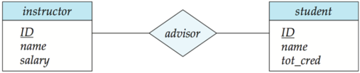

## Module 19

Partha Pratim

Das

Objectives &amp;

Outline

ER Diagram

Entity Sets

Relationship Sets

Cardinality

Constraints

Participation

Bounds

ER Model to

Relational

Schema

Entity Sets

Relationship

Composite Attributes

Multivalued

Attributes

Redundancy

Module Summary

## Total and Partial Participation

- Total participation (indicated by double line): every entity in the entity set participates in at least one relationship in the relationship set
- participation of student in advisor relation is total
- glyph[triangleright] every student must have an associated instructor
- Partial participation: some entities may not participate in any relationship in the relationship set
- Example: participation of instructor in advisor is partial

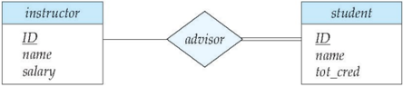

## Module 19

Partha Pratim Das

Objectives &amp; Outline

ER Diagram

Entity Sets

Relationship Sets

Cardinality

Constraints

Participation

Bounds

ER Model to Relational Schema

Entity Sets

Relationship

Composite Attributes

Multivalued

Attributes

Redundancy

Module Summary

## Notation for Expressing More Complex Constraints

- A line may have an associated minimum and maximum cardinality, shown in the form l..h , where l is the minimum and h the maximum cardinality
- A minimum value of 1 indicates total participation.
- A maximum value of 1 indicates that the entity participates in at most one relationship
- A maximum value of * indicates no limit.

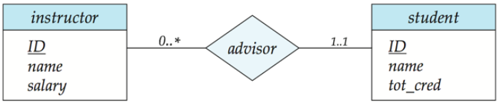

Instructor can advise 0 or more students.

A student must have 1 advisor; cannot have multiple advisors

Module 19

Partha Pratim

Das

Objectives &amp;

Outline

ER Diagram

Entity Sets

Relationship Sets

Cardinality

Constraints

Participation

Bounds

ER Model to

Relational

Schema

Entity Sets

Relationship

Composite Attributes

Multivalued

Attributes

Redundancy

Module Summary

## Notation to Express Entity with Complex Attributes

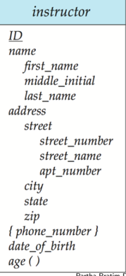

Partha Pratim Das

## Module 19

Partha Pratim Das

Objectives &amp; Outline

ER Diagram

Entity Sets

Relationship Sets

Cardinality

Constraints

Participation

Bounds

ER Model to

Relational

Schema

Entity Sets

Relationship

Composite Attributes

Multivalued

Attributes

Redundancy

Module Summary

## Expressing Weak Entity Sets

- In ER diagrams, a weak entity set is depicted via a double rectangle
- We underline the discriminator of a weak entity set with a dashed line
- The relationship set connecting the weak entity set to the identifying strong entity set is depicted by a double diamond
- Primary key for section - (course id, sec id, semester, year)

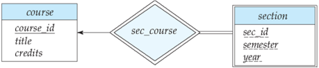

Module 19

Partha Pratim

Das

Objectives &amp;

Outline

ER Diagram

Entity Sets

Relationship Sets

Cardinality

Constraints

Participation

Bounds

ER Model to

Relational

Schema

Entity Sets

Relationship

Composite Attributes

Multivalued

Attributes

Redundancy

Module Summary

## ER Diagram for a University Enterprise

Database Management Systems

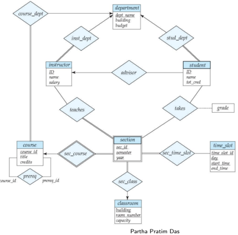

## Module 19

Partha Pratim Das

Objectives &amp; Outline

ER Diagram

Entity Sets

Relationship Sets

Cardinality

Constraints

Participation

Bounds

ER Model to Relational Schema

Entity Sets

Relationship

Composite Attributes

Multivalued

Attributes

Redundancy

Module Summary

## ER Model to Relational Schema

## Module 19

Partha Pratim Das

Objectives &amp; Outline

ER Diagram

Entity Sets

Relationship Sets

Cardinality

Constraints

Participation

Bounds

ER Model to Relational Schema

Entity Sets

Relationship

Composite Attributes

Multivalued Attributes

Redundancy

Module Summary

## Reduction to Relation Schema

- Entity sets and relationship sets can be expressed uniformly as relation schemas that represent the contents of the database
- A database which conforms to an ER diagram can be represented by a collection of schemas
- For each entity set and relationship set there is a unique schema that is assigned the name of the corresponding entity set or relationship set
- Each schema has a number of columns (generally corresponding to attributes), which have unique names

## Module 19

Partha Pratim Das

Objectives &amp; Outline

ER Diagram

Entity Sets

Relationship Sets

Cardinality

Constraints

Participation

Bounds

ER Model to Relational Schema

## Entity Sets

Relationship

Composite Attributes

Multivalued

Attributes

Redundancy

Module Summary

## Representing Entity Sets

- A strong entity set reduces to a schema with the same attributes
- student(ID, name, tot cred)
- A weak entity set becomes a table that includes a column for the primary key of the identifying strong entity set

section (course id, sec id, sem, year )

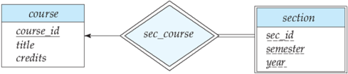

## Module 19

Partha Pratim Das

Objectives &amp; Outline

ER Diagram

Entity Sets

Relationship Sets

Cardinality

Constraints

Participation

Bounds

ER Model to

Relational

Schema

Entity Sets

Relationship

Composite Attributes

Multivalued

Attributes

Redundancy

Module Summary

## Representing Relationship Sets

- A many-to-many relationship set is represented as a schema with attributes for the primary keys of the two participating entity sets, and any descriptive attributes of the relationship set.
- Example: schema for relationship set advisor

advisor = ( s id, i id )

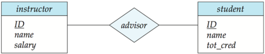

Module 19

Partha Pratim

Das

Objectives &amp;

Outline

ER Diagram

Entity Sets

Relationship Sets

Cardinality

Constraints

Participation

Bounds

ER Model to

Relational

Schema

Entity Sets

Relationship

Composite Attributes

Multivalued

Attributes

Redundancy

Module Summary

## Representation of Entity Sets with Composite Attributes

- Composite attributes are flattened out by creating a separate attribute for each component attribute
- Example: given entity set instructor with composite attribute name with component attributes first name and last name the schema corresponding to the entity set has two attributes name first name and name last name
- glyph[triangleright] Prefix omitted if there is no ambiguity ( name first name could be first name )
- Ignoring multivalued attributes, extended instructor schema is
- instructor(ID, first name, middle initial, last name, street number, street name, apt number, city, state, zip code, date of birth)

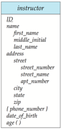

Module 19

Partha Pratim Das

Objectives &amp; Outline

ER Diagram

Entity Sets

Relationship Sets

Cardinality

Constraints

Participation

Bounds

ER Model to Relational Schema

Entity Sets

Relationship

Composite Attributes

Multivalued Attributes

Redundancy

Module Summary

## Representation of Entity Sets with Multivalued Attributes

- A multivalued attribute M of an entity E is represented by a separate schema EM
- Schema EM has attributes corresponding to the primary key of E and an attribute corresponding to multivalued attribute M
- Example: Multivalued attribute phone number of instructor is represented by a schema: inst phone = ( ID, phone number)
- Each value of the multivalued attribute maps to a separate tuple of the relation on schema EM
- For example, an instructor entity with primary key 22222 and phone numbers 456-7890 and 123-4567 maps to two tuples: (22222, 456-7890) and (22222, 123-4567)

## Module 19

Partha Pratim Das

Objectives &amp; Outline

ER Diagram

Entity Sets

Relationship Sets

Cardinality

Constraints

Participation

Bounds

ER Model to Relational Schema

Entity Sets

Relationship

Composite Attributes

Multivalued

Attributes

Redundancy

Module Summary

## Redundancy of Schema

- Many-to-one and one-to-many relationship sets that are total on the many-side can be represented by adding an extra attribute to the 'many' side, containing the primary key of the 'one' side
- Example: Instead of creating a schema for relationship set inst dept , add an attribute dept name to the schema arising from entity set instructor

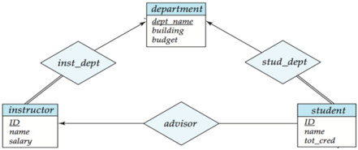

Database Management Systems

Partha Pratim Das

## Module 19

Partha Pratim Das

Objectives &amp; Outline

ER Diagram

Entity Sets

Relationship Sets

Cardinality

Constraints

Participation

Bounds

ER Model to Relational Schema

Entity Sets

Relationship

Composite Attributes

Multivalued

Attributes

Redundancy

Module Summary

## Redundancy of Schema (2)

- For one-to-one relationship sets, either side can be chosen to act as the 'many' side
- That is, an extra attribute can be added to either of the tables corresponding to the two entity sets
- If participation is partial on the 'many' side, replacing a schema by an extra attribute in the schema corresponding to the 'many' side could result in null values

## Module 19

Partha Pratim Das

Objectives &amp; Outline

ER Diagram

Entity Sets

Relationship Sets

Cardinality

Constraints

Participation

Bounds

ER Model to Relational Schema

Entity Sets

Relationship

Composite Attributes

Multivalued

Attributes

Redundancy

Module Summary

## Redundancy of Schema (3)

- The schema corresponding to a relationship set linking a weak entity set to its identifying strong entity set is redundant.
- Example: The section schema already contains the attributes that would appear in the sec course schema

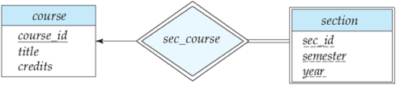

## Module 19

Partha Pratim Das

Objectives &amp; Outline

ER Diagram

Entity Sets

Relationship Sets

Cardinality Constraints

Participation

Bounds

ER Model to Relational Schema

Entity Sets

Relationship

Composite Attributes

Multivalued

Attributes

Redundancy

Module Summary

## Module Summary

- Illustrated ER Diagram notation for ER Models
- Discussed translation of ER Models to Relational Schema

Slides used in this presentation are borrowed from http://db-book.com/ with kind permission of the authors.

Edited and new slides are marked with 'PPD'.