## Module 20

Partha Pratim Das

Objectives &amp; Outline

ER Features

Non-binary

Relationship

Specialization

Specialization as Schema

Generalization

Aggregation

Design Issues

Entities vs Attributes

Entities vs

Relationship

Binary vs Non-Binary

Design Decisions

ER Notation

Module Summary

## Database Management Systems

Module 20: Entity-Relationship Model/3

## Partha Pratim Das

Department of Computer Science and Engineering Indian Institute of Technology, Kharagpur ppd@cse.iitkgp.ac.in

Partha Pratim Das

## Module 20

Partha Pratim Das

Objectives &amp; Outline

ER Features

Non-binary

Relationship

Specialization

Specialization as Schema

Generalization

Aggregation

Design Issues

Entities vs Attributes

Entities vs Relationship

Binary vs Non-Binary

Design Decisions

ER Notation

Module Summary

## Module Recap

- ER Diagram for ER Models
- Translation of ER Models to Relational Schema

## Module 20

Partha Pratim Das

Objectives &amp; Outline

ER Features

Non-binary

Relationship

Specialization

Specialization as Schema

Generalization

Aggregation

Design Issues

Entities vs Attributes

Entities vs Relationship

Binary vs Non-Binary

Design Decisions ER Notation

Module Summary

## Module Objectives

- To understand extended features of ER Model
- To discuss various design issues

## Module 20

Partha Pratim Das

Objectives &amp; Outline

ER Features

Non-binary

Relationship

Specialization

Specialization as Schema

Generalization

Aggregation

Design Issues

Entities vs Attributes

Entities vs Relationship

Binary vs Non-Binary

Design Decisions

ER Notation

Module Summary

## Module Outline

- Extended ER Features
- Design Issues

## Module 20

Partha Pratim Das

Objectives &amp; Outline

ER Features

Non-binary

Relationship

Specialization

Specialization as Schema

Generalization

Aggregation

Design Issues

Entities vs Attributes

Entities vs

Relationship

Binary vs Non-Binary

Design Decisions

ER Notation

Module Summary

## Extended ER Features

## Extended ER Features

Module 20

Partha Pratim

Das

Objectives &amp; Outline

ER Features

Non-binary

Relationship

Specialization

Specialization as

Schema

Generalization

Aggregation

Design Issues

Entities vs Attributes

Entities vs

Relationship

Binary vs Non-Binary

Design Decisions

ER Notation

Module Summary

## Non-binary Relationship Sets

- Most relationship sets are binary
- There are occasions when it is more convenient to represent relationships as non-binary
- ER Diagram with a Ternary Relationship

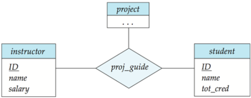

## Module 20

Partha Pratim Das

Objectives &amp; Outline

ER Features

Non-binary Relationship

Specialization

Specialization as Schema

Generalization

Aggregation

Design Issues

Entities vs Attributes

Entities vs Relationship

Binary vs Non-Binary

Design Decisions

ER Notation

Module Summary

## Cardinality Constraints on Ternary Relationship

- We allow at most one arrow out of a ternary (or greater degree) relationship to indicate a cardinality constraint
- For example, an arrow from proj guide to instructor indicates each student has at most one guide for a project
- If there is more than one arrow, there are two ways of defining the meaning.
- For example, a ternary relationship R between A , B and C with arrows to B and C could mean
- a) Each A entity is associated with a unique entity from B and C or
- b) Each pair of entities from ( A, B ) is associated with a unique C entity, and each pair ( A ,C ) is associated with a unique B
- Each alternative has been used in different formalisms
- To avoid confusion we outlaw more than one arrow

## Module 20

Partha Pratim Das

Objectives &amp; Outline

ER Features

Non-binary Relationship

Specialization

Specialization as Schema

Generalization

Aggregation

Design Issues

Entities vs Attributes

Entities vs Relationship

Binary vs Non-Binary

Design Decisions

ER Notation

Module Summary

## Specialization: ISA

- Top-down design process : We designate sub-groupings within an entity set that are distinctive from other entities in the set
- These sub-groupings become lower-level entity sets that have attributes or participate in relationships that do not apply to the higher-level entity set
- Depicted by a triangle component labeled ISA (e.g., instructor 'is a' person )
- Attribute inheritance : A lower-level entity set inherits all the attributes and relationship participation of the higher-level entity set to which it is linked

## Module 20

Partha Pratim

Das

Objectives &amp;

Outline

ER Features

Non-binary

Relationship

Specialization

Specialization as

Schema

Generalization

Aggregation

Design Issues

Entities vs Attributes

Entities vs

Relationship

Binary vs Non-Binary

Design Decisions

ER Notation

Module Summary

## Specialization: ISA (2)

- Overlapping
- : employee and student
- Disjoint : instructor and secretary
- Total and Partial

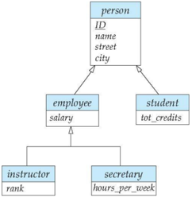

## Partha Pratim Das

Database Management Systems

## Module 20

Partha Pratim Das

Objectives &amp; Outline

ER Features

Non-binary

Relationship

Specialization

Specialization as Schema

Generalization

Aggregation

Design Issues

Entities vs Attributes

Entities vs

Relationship

Binary vs Non-Binary

Design Decisions

ER Notation

Module Summary

## Representing Specialization via Schema

- Method 1:
- Form a schema for the higher-level entity
- Form a schema for each lower-level entity set, include primary key of higher-level entity set and local attributes
- Drawback: Getting information about, an employee requires accessing two relations, the one corresponding to the low-level schema and the one corresponding to the high-level schema

| schema                  | attributes                                     |
|-------------------------|------------------------------------------------|
| person student employee | ID, name, street, city ID, tot_cred ID; salary |

## Module 20

Partha Pratim Das

Objectives &amp; Outline

ER Features

Non-binary

Relationship

Specialization

Specialization as Schema

Generalization

Aggregation

Design Issues

Entities vs Attributes

Entities vs

Relationship

Binary vs Non-Binary

Design Decisions

ER Notation

Module Summary

## Representing Specialization as Schema (2)

- Method 2:
- Form a schema for each entity set with all local and inherited attributes
- Drawback: name, street and city may be stored redundantly for people who are both students and employees

| schema   | attributes                       |
|----------|----------------------------------|
| person   | ID; name; street, city           |
| student  | ID, name, street, city, tot_cred |
| employee | ID; name; street, city, salary   |

## Module 20

Partha Pratim Das

Objectives &amp; Outline

ER Features

Non-binary

Relationship

Specialization

Specialization as Schema

Generalization

Aggregation

Design Issues

Entities vs Attributes

Entities vs Relationship

Binary vs Non-Binary

Design Decisions ER Notation

Module Summary

## Generalization

- Bottom-up design process : Combine a number of entity sets that share the same features into a higher-level entity set
- Specialization and generalization are simple inversions of each other; they are represented in an ER diagram in the same way
- The terms specialization and generalization are used interchangeably

Module 20

Partha Pratim Das

Objectives &amp; Outline

ER Features

Non-binary

Relationship

Specialization

Specialization as

Schema

Generalization

Aggregation

Design Issues

Entities vs Attributes

Entities vs

Relationship

Binary vs Non-Binary

Design Decisions

ER Notation

Module Summary

## Design Constraints on a Specialization / Generalization

- Completeness constraint : Specifies whether or not an entity in the higher-level entity set must belong to at least one of the lower-level entity sets within a generalization
- total : an entity must belong to one of the lower-level entity sets
- partial : an entity need not belong to one of the lower-level entity sets
- Partial generalization is the default. We can specify total generalization in an ER diagram by adding the keyword total in the diagram and drawing a dashed line from the keyword to the corresponding hollow arrow-head to which it applies (for a total generalization), or to the set of hollow arrow-heads to which it applies (for an overlapping generalization).
- The student generalization is total. All student entities must be either graduate or undergraduate. Because the higherlevel entity set arrived at through generalization is generally composed of only those entities in the lower-level entity sets, the completeness constraint for a generalized higher-level entity set is usually total.

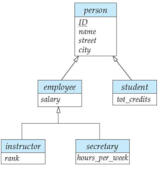

Partha Pratim Das

Module 20

Partha Pratim

Das

Objectives &amp;

Outline

ER Features

Non-binary

Relationship

Specialization

Specialization as

Schema

Generalization

Aggregation

Design Issues

Entities vs Attributes

Entities vs

Relationship

Binary vs Non-Binary

Design Decisions

ER Notation

Module Summary

## Aggregation

- Consider the ternary relationship proj guide , which we saw earlier
- Suppose we want to record evaluations of a student by a guide on a project

Database Management Systems

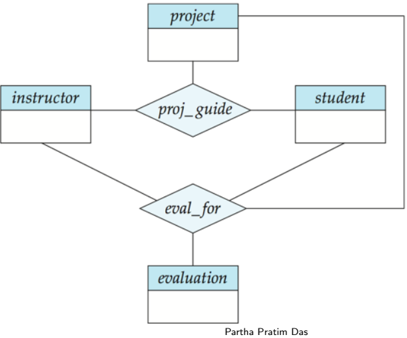

## Module 20

Partha Pratim Das

Objectives &amp; Outline

ER Features

Non-binary Relationship

Specialization

Specialization as Schema

Generalization

Aggregation

Design Issues

Entities vs Attributes

Entities vs Relationship

Binary vs Non-Binary

Design Decisions ER Notation

Module Summary

## Aggregation (2)

- Relationship sets eval for and proj guide represent overlapping information
- Every eval for relationship corresponds to a proj guide relationship
- However, some proj guide relationships may not correspond to any eval for relationships
- glyph[triangleright] So we cannot discard the proj guide relationship
- Eliminate this redundancy via aggregation
- Treat relationship as an abstract entity
- Allows relationships between relationships
- Abstraction of relationship into new entity

## Module 20

Partha Pratim Das

Objectives &amp; Outline

ER Features

Non-binary

Relationship

Specialization

Specialization as

Schema

Generalization

Aggregation

Design Issues

Entities vs Attributes

Entities vs

Relationship

Binary vs Non-Binary

Design Decisions

ER Notation

Module Summary

## Aggregation (3)

- Eliminate this redundancy via aggregation without introducing redundancy, the following diagram represents:
- A student is guided by a particular instructor on a particular project
- A student, instructor, project combination may have an associated evaluation

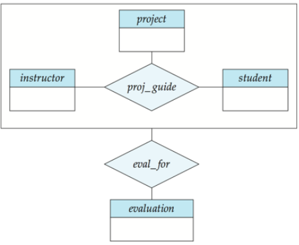

Database Management Systems

Partha Pratim Das

## Module 20

Partha Pratim Das

Objectives &amp; Outline

ER Features

Non-binary Relationship

Specialization

Specialization as Schema

Generalization

Aggregation

Design Issues

Entities vs Attributes

Entities vs Relationship

Binary vs Non-Binary

Design Decisions ER Notation

Module Summary

## Representing Aggregation via Schema

- To represent aggregation, create a schema containing
- Primary key of the aggregated relationship,
- The primary key of the associated entity set
- Any descriptive attributes
- In our example:
- The schema textiteval for is: eval for (s ID, project id, i ID, evaluation id)
- The schema proj guide is redundant

## Module 20

Partha Pratim Das

Objectives &amp; Outline

ER Features

Non-binary

Relationship

Specialization

Specialization as Schema

Generalization

Aggregation

Design Issues

Entities vs Attributes

Entities vs

Relationship

Binary vs Non-Binary

Design Decisions

ER Notation

Module Summary

## Design Issues

## Design Issues

Module 20

Partha Pratim

Das

Objectives &amp;

Outline

ER Features

Non-binary

Relationship

Specialization

Specialization as

Schema

Generalization

Aggregation

Design Issues

Entities vs Attributes

Entities vs

Relationship

Binary vs Non-Binary

Design Decisions

ER Notation

Module Summary

## Entities vs. Attributes

- Use of entity sets vs. attributes
- Use of phone as an entity allows extra information about phone numbers (plus multiple phone numbers)

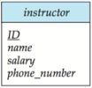

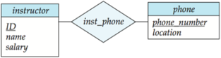

## Module 20

Partha Pratim Das

Objectives &amp; Outline

ER Features

Non-binary

Relationship

Specialization

Specialization as

Schema

Generalization

Aggregation

Design Issues

Entities vs Attributes

Entities vs Relationship

Binary vs Non-Binary

Design Decisions

ER Notation

Module Summary

## Entities vs Relationship Sets

- Use of entity sets vs. relationship sets

Possible guideline is to designate a relationship set to describe an action that occurs between entities

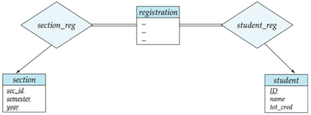

- Placement of relationship attributes

For example, attribute date as attribute of advisor or as attribute of student

## Module 20

Partha Pratim Das

Objectives &amp; Outline

ER Features

Non-binary

Relationship

Specialization

Specialization as Schema

Generalization

Aggregation

Design Issues

Entities vs Attributes

Entities vs Relationship

Binary vs Non-Binary

Design Decisions

ER Notation

Module Summary

## Binary vs Non-Binary Relationships

- Although it is possible to replace any non-binary (n-ary, for n &gt; 2) relationship set by a number of distinct binary relationship sets, a n-ary relationship set shows more clearly that several entities participate in a single relationship
- Some relationships that appear to be non-binary may be better represented using binary relationships
- For example, a ternary relationship parents , relating a child to his/her father and mother, is best replaced by two binary relationships, father and mother
- glyph[triangleright] Using two binary relationships allows partial information (e.g., only mother being known)
- But there are some relationships that are naturally non-binary
- glyph[triangleright] Example: proj guide

## Module 20

Partha Pratim Das

Objectives &amp; Outline

## ER Features

Non-binary

Relationship

Specialization

Specialization as Schema

Generalization

Aggregation

Design Issues

Entities vs Attributes

Entities vs Relationship

Binary vs Non-Binary

Design Decisions ER Notation

Module Summary

## Binary vs Non-Binary Relationships (2): Conversion

- In general, any non-binary relationship can be represented using binary relationships by creating an artificial entity set.
- Replace R between entity sets A, B and C by an entity set E, and three relationship sets:
1. R A , relating E and A
2. R B , relating E and B
3. R C , relating E and C
- Create an identifying attribute for E and add any attributes of R to E
- For each relationship ( a i , b i , c i ) in R, create
- a) a new entity e i in the entity set E
- b) add ( e i , a i ) to R A
- c) add ( e i , b i ) to R B
- d) add ( e i , c i ) to R C

## Database Management Systems

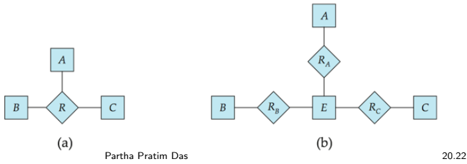

## Module 20

Partha Pratim Das

Objectives &amp; Outline

ER Features

Non-binary Relationship

Specialization

Specialization as Schema

Generalization

Aggregation

Design Issues

Entities vs Attributes

Entities vs Relationship

Binary vs Non-Binary

Design Decisions

ER Notation

Module Summary

## Binary vs Non-Binary Relationships (3): Conversion

- Also need to translate constraints
- Translating all constraints may not be possible
- There may be instances in the translated schema that cannot correspond to any instance of R.
- glyph[triangleright] Exercise: add constraints to the relationships R A , R B and R C to ensure that a newly created entity corresponds to exactly one entity in each of entity sets A , B and C
- We can avoid creating an identifying attribute by making E, a weak entity set (described shortly) identified by the three relationship sets

## Module 20

Partha Pratim Das

Objectives &amp; Outline

ER Features

Non-binary Relationship

Specialization

Specialization as Schema

Generalization

Aggregation

Design Issues

Entities vs Attributes

Entities vs Relationship

Binary vs Non-Binary

Design Decisions ER Notation

Module Summary

## ER Design Decisions

- The use of an attribute or entity set to represent an object
- Whether a real-world concept is best expressed by an entity set or a relationship set
- The use of a ternary relationship versus a pair of binary relationships
- The use of a strong or weak entity set
- The use of specialization/generalization - contributes to modularity in the design
- The use of aggregation - can treat the aggregate entity set as a single unit without concern for the details of its internal structure

## Symbols Used in ER Notation

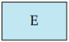

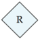

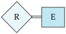

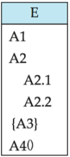

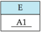

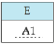

## Symbols Used in ER Notation (2)

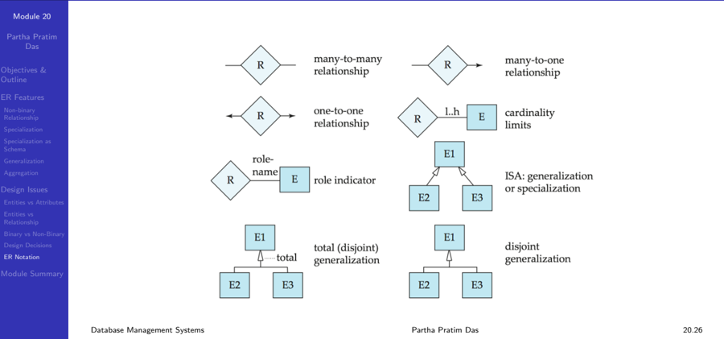

## Module 20

Partha Pratim Das

Objectives &amp; Outline

ER Features

Non-binary

Relationship

Specialization

Specialization as

Schema

Generalization

Aggregation

Design Issues

Entities vs Attributes

Entities vs

Relationship

Binary vs Non-Binary

Design Decisions

ER Notation

Module Summary

## Symbols Used in ER Notation (3): Alternate

- Chen, IDE1FX, . . .

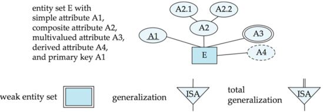

## Symbols Used in ER Notation (4): Alternates

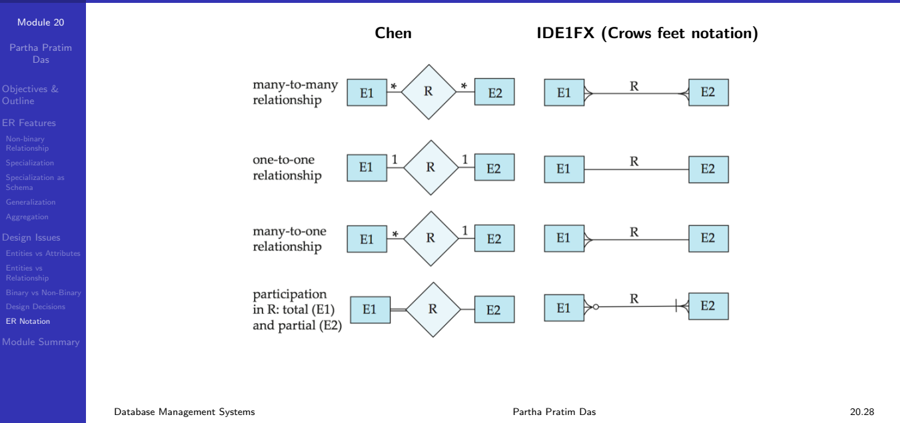

## Module 20

Partha Pratim Das

Objectives &amp; Outline

ER Features

Non-binary

Relationship

Specialization

Specialization as Schema

Generalization

Aggregation

Design Issues

Entities vs Attributes

Entities vs Relationship

Binary vs Non-Binary

Design Decisions ER Notation

Module Summary

## Module Summary

- Discussed the extended features of ER Model
- Deliberated on various design issues