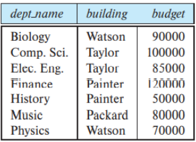
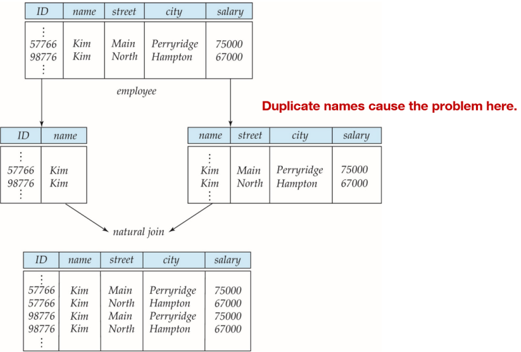
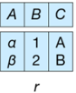
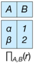
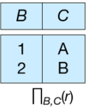
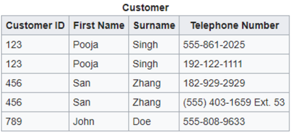
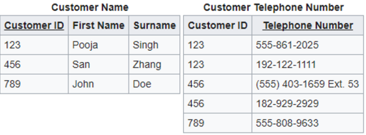

## Module 21

Partha Pratim Das

Week Recap

Objectives &amp; Outline

Features of Good Relational Design

Redundancy and Anomaly

Decomposition

Atomic Domains and First Normal Form

Module Summary

## Database Management Systems

## Module 21: Relational Database Design/1

## Partha Pratim Das

Department of Computer Science and Engineering Indian Institute of Technology, Kharagpur ppd@cse.iitkgp.ac.in

## Module 21

Partha Pratim Das

Week Recap

Objectives &amp; Outline

Features of Good Relational Design

Redundancy and Anomaly

Decomposition

Atomic Domains and First Normal Form

Module Summary

## Week Recap

- Discussed relational algebra with examples
- Introduced tuple relational and domain relational calculus
- Illustrated equivalence of algebra and calculus
- Introduced the Design Process for Database Systems
- Elucidated the E-R Model for real world representation with entities, entity sets, attributes, and relationships
- Illustrated ER Diagram notation for ER Models
- Discussed translation of ER Models to Relational Schema and extended features of ER Model
- Deliberated on various design issues

## Module 21

Partha Pratim Das

Week Recap

Objectives &amp; Outline

Features of Good Relational Design

Redundancy and Anomaly

Decomposition

Atomic Domains and First Normal Form

Module Summary

## Module Objectives

- To identify the features of good relational design
- To familiarize with the First Normal Form

## Module 21

Partha Pratim Das

Week Recap

Objectives &amp; Outline

Features of Good Relational Design

Redundancy and Anomaly

Decomposition

Atomic Domains and First Normal Form

Module Summary

## Module Outline

- Features of Good Relational Design
- Atomic Domains and First Normal Form

Module 21

Partha Pratim Das

Week Recap

Objectives &amp; Outline

Features of Good Relational Design

Redundancy and Anomaly

Decomposition

Atomic Domains and First Normal Form

Module Summary

## Features of Good Relational Design

## Module 21

Partha Pratim Das

Week Recap

Objectives &amp; Outline

## Features of Good Relational Design

Redundancy and Anomaly

Decomposition

Atomic Domains and First Normal Form

Module Summary

## Good Relational Design

- Reflects real-world structure of the problem
- Can represent all expected data over time
- Avoids redundant storage of data items
- Provides efficient access to data
- Supports the maintenance of data integrity over time
- Clean, consistent, and easy to understand
- Note: These objectives are sometimes contradictory!

## What is a Good Schema?

## instructor with department

| ID                                                                      | name                                                                             | salary                                                                  | dept_name                                                                                                | building                                                                                 | budget                                                                       |
|-------------------------------------------------------------------------|----------------------------------------------------------------------------------|-------------------------------------------------------------------------|----------------------------------------------------------------------------------------------------------|------------------------------------------------------------------------------------------|------------------------------------------------------------------------------|
| 22222 12121 32343 45565 98345 76766 10101 58583 83821 15151 33456 76543 | Einstein Wu El Said Katz Kim Crick Srinivasan Califieri Brandt Mozart Gold Singh | 95000 90000 60000 75000 80000 72000 65000 62000 92000 40000 87000 80000 | Physics Finance History Comp. Sci Elec. Comp. Sci. History Comp. Sci. Music Physics Finance Eng; Biology | Watson Painter Painter Taylor Taylor Watson Iaylor Painter Taylor Packard Watson Painter | 70000 120000 50000 100000 85000 90000 100000 50000 100000 80000 70000 120000 |

- ID : Key
- building , budget : Redundant Information
- name , salary , dept name : No Redundant Information

## Database Management Systems

Partha Pratim Das

## instructor

|    ID | name       | deptname   | salary   |
|-------|------------|------------|----------|
| 10101 | Srinivasan | Comp. Sci. | 65000    |
| 12121 | Wu         | Finance    | 90000    |
| 15151 | Mozart     | Music      | 40000    |
| 22222 | Einstein   | Physics    | 95000    |
| 32343 | El Said    | History    | 60000    |
| 33456 | Gold       | Physics    | 87000    |
| 45565 | Katz       | Comp. Sci. | 75000    |
| 58583 | Califieri  | History    | 62000    |
| 76543 | Singh      | Finance    | 80000    |
| 76766 | Crick      | Biology    | 72000    |
| 83821 | Brandt     | Comp. Sci. | 92000    |
| 98345 | Kim        | Elec. Eng. |          |

## department

| deptname                                              | building                                            | budget            |
|-------------------------------------------------------|-----------------------------------------------------|-------------------|
| Biology Comp. Sci. Elcc Finance History Music Physics | Watson Taylor Taylor Painter Painter Packard Watson | 90000 85000 70000 |

## Module 21

Partha Pratim Das

Week Recap

Objectives &amp; Outline

## Features of Good Relational Design

Redundancy and Anomaly

Decomposition

Atomic Domains and First Normal Form

Module Summary

## What is a Good Schema? (2)

- Consider combining relations
- sec class(sec id, building, room number) and
- section(course id, sec id, semester, year)
- into one relation
- section(course id, sec id, semester, year, building, room number)
- No repetition in this case

## Module 21

Partha Pratim Das

Week Recap

Objectives &amp; Outline

Features of Good Relational Design

Redundancy and Anomaly

Decomposition

Atomic Domains and First Normal Form

Module Summary

## Redundancy and Anomaly

- Redundancy : having multiple copies of same data in the database.
- This problem arises when a database is not normalized
- It leads to anomalies
- Anomaly : inconsistencies that can arise due to data changes in a database with insertion, deletion, and update
- These problems occur in poorly planned, un-normalised databases where all the data is stored in one table (a flat-file database)

## There can be three kinds of anomalies

- Insertions Anomaly
- Deletion Anomaly
- Update Anomaly

Module 21

Partha Pratim Das

Week Recap

Objectives &amp; Outline

Features of Good Relational Design

Redundancy and Anomaly

Decomposition

Atomic Domains and First Normal Form

Module Summary

## Redundancy and Anomaly (2)

## · Insertions Anomaly

- When the insertion of a data record is not possible without adding some additional unrelated data to the record
- We cannot add an Instructor in instructor with department if the department does not have a building or budget

## · Deletion Anomaly

- When deletion of a data record results in losing some unrelated information that was stored as part of the record that was deleted from a table
- We delete the last Instructor of a Department from instructor with department , we lose building and budget information

## · Update Anomaly

- When a data is changed, which could involve many records having to be changed, leading to the possibility of some changes being made incorrectly
- When the budget changes for a Department having large number of Instructors in instructor with department application may miss some of them

Partha Pratim Das

Module 21

Partha Pratim Das

Week Recap

Objectives &amp; Outline

Features of Good Relational Design

Redundancy and Anomaly

Decomposition

Atomic Domains and First Normal Form

Module Summary

## Redundancy and Anomaly (3)

- We have observed the following:
- Redundancy ⇒ Anomaly
- Relations instructor and department is better than instructor with department
- What causes redundancy?
- Dependency ⇒ Redundancy
- dept name uniquely decides building and budget . A department cannot have two different budget or building. So building and budget depends on dept name
- How to remove, or at least minimize, redundancy?
- Decompose (partition) the relation into smaller relations
- instructor with department can be decomposed into instructor and department
- Good Decomposition ⇒ Minimization of Dependency
- Is every decomposition good?
- No. It needs to preserve information, honour the dependencies, be efficient etc.
- Various schemes of normalization ensure good decomposition
- Normalization ⇒ Good Decomposition

## Module 21

Partha Pratim Das

Week Recap

Objectives &amp; Outline

Features of Good Relational Design

Redundancy and Anomaly

Decomposition

Atomic Domains and First Normal Form

Module Summary

## Decomposition

- Suppose we had started with inst dept . How would we know to split up ( decompose ) it into instructor and department ?
- Write a rule 'if there were a schema (dept name, building, budget) , then dept name would be a candidate key'
- Denote as a functional dependency : dept name → building, budget
- In inst dept , because dept name is not a candidate key, the building and budget of a department may have to be repeated.
- This indicates the need to decompose inst dept

## Module 21

Partha Pratim Das

Week Recap

Objectives &amp; Outline

Features of Good Relational Design

Redundancy and Anomaly

Decomposition

Atomic Domains and First Normal Form

Module Summary

## Decomposition (2)

- Not all decompositions are good
- Suppose we decompose
- employee(ID, name, street, city, salary) into employee1 (ID, name) employee2 (name, street, city, salary)
- Note that if name can be duplicate, then employee 2 is a weak entity set and cannot exist without an identifying relationship
- Consequently, this decomposition cannot preserve the information
- The next slide shows how we lose information - we cannot reconstruct the original employee relation - and so, this is a lossy decomposition .

Module 21

Partha Pratim

Das

Week Recap

Objectives &amp;

Outline

Features of Good

Relational Design

Redundancy and

Anomaly

Decomposition

Atomic Domains and First Normal

Form

Module Summary

## Decomposition (3): Lossy Decomposition

## Partha Pratim Das

## Module 21

Partha Pratim

Das

Week Recap

Objectives &amp;

Outline

Features of Good

Relational Design

Redundancy and

Anomaly

Decomposition

Atomic Domains and First Normal Form

Module Summary

## Decomposition (4): Lossless-Join Decomposition

- Lossless Join Decomposition
- Decomposition of R = (A, B, C) R 1 = ( A , B ), R 2 = ( B , C )

A

B

C

A

B

Partha Pratim Das

B

2

## Module 21

Partha Pratim Das

Week Recap

Objectives &amp; Outline

Features of Good Relational Design

Redundancy and Anomaly

Decomposition

Atomic Domains and First Normal Form

Module Summary

## Decomposition (5): Lossless-Join Decomposition

- Lossless Join Decomposition is a decomposition of a relation R into relations R 1 , R 2 such that if we perform natural join of two smaller relations it will return the original relation

glyph[negationslash]

R 1 ∪ R 2 = R , R 1 ∩ R 2 = φ

∀ r ∈ R , r 1 = glyph[intersectionsq] R 1 ( r ) , r 2 = glyph[intersectionsq] R 2 ( r )

r 1 glyph[triangleright] glyph[triangleleft] r 2 = r

- This is effective in removing redundancy from databases while preserving the original data
- In other words by lossless decomposition it becomes feasible to reconstruct the relation R from decomposed tables R 1 and R 2 by using Joins

Module 21

Partha Pratim Das

Week Recap

Objectives &amp; Outline

Features of Good Relational Design

Redundancy and Anomaly

Decomposition

Atomic Domains and First Normal Form

Module Summary

## Atomic Domains and First Normal Form

## Module 21

Partha Pratim Das

Week Recap

Objectives &amp; Outline

Features of Good Relational Design

Redundancy and Anomaly

Decomposition

Atomic Domains and First Normal Form

Module Summary

## First Normal Form (1NF)

- A domain is atomic if its elements are considered to be indivisible units
- Examples of non-atomic domains:
- glyph[triangleright] Set of names, composite attributes
- glyph[triangleright] Identification numbers like CS101 that can be broken up into parts
- A relational schema R is in First Normal Form (INF) if
- the domains of all attributes of R are atomic
- the value of each attribute contains only a single value from that domain
- Non-atomic values complicate storage and encourage redundant (repeated) storage of data
- Example: Set of accounts stored with each customer, and set of owners stored with each account
- We assume all relations are in first normal form

## Module 21

Partha Pratim Das

Week Recap

Objectives &amp; Outline

Features of Good Relational Design

Redundancy and Anomaly

Decomposition

Atomic Domains and First Normal Form

Module Summary

## First Normal Form (2)

- Atomicity is actually a property of how the elements of the domain are used
- Strings would normally be considered indivisible
- Suppose that students are given roll numbers which are strings of the form CS0012 or EE1127
- If the first two characters are extracted to find the department, the domain of roll numbers is not atomic
- Doing so is a bad idea
- glyph[triangleright] Leads to encoding of information in application program rather than in the database

## Module 21

Partha Pratim

Das

Week Recap

Objectives &amp;

Outline

Features of Good

Relational Design

Redundancy and

Anomaly

Decomposition

## Atomic Domains and First Normal Form

Module Summary

## First Normal Form (3)

- The following is not in 1NF

## customer

|   Customer ID | First Name   | Surname   | Telephone Number                     |
|---------------|--------------|-----------|--------------------------------------|
|           123 | Pooja        | Singh     | 555-861-2025, 192-122-1111           |
|           456 | San          | Zhang     | (555) 403-1659 Ext. 53; 182-929-2929 |
|           789 | John         | Doe       | 555-808-9633                         |

- A telephone number is composite
- Telephone number is multi-valued

## Module 21

Partha Pratim Das

Week Recap

Objectives &amp;

Outline

## Features of Good Relational Design

Redundancy and Anomaly

Decomposition

## Atomic Domains and First Normal Form

Module Summary

## First Normal Form (4)

- Consider:

## customer

|   Customer ID | First Name   | Surname   | Telephone Number1       | Telephone Number2   |
|---------------|--------------|-----------|-------------------------|---------------------|
|           123 | Pooja        | Singh     | 555-861-2025            | 192-122-1111        |
|           456 | San          | Zhang     | (555) 403-1659 Ext . 53 | 182-929-2929        |
|           789 | John         | Doe       | 555-808-9633            |                     |

- is in 1NF if telephone number is not considered composite
- However, conceptually, we have two attributes for the same concept
- glyph[triangleright] Arbitrary and meaningless ordering of attributes
- glyph[triangleright] How to search telephone numbers
- glyph[triangleright] Why only two numbers?

## Module 21

Partha Pratim

Das

Week Recap

Objectives &amp;

Outline

Features of Good

Relational Design

Redundancy and

Anomaly

Decomposition

Atomic Domains and First Normal Form

Module Summary

## First Normal Form (5)

- Is the following in 1NF?
- Duplicated information
- ID is no more the key. Key is (ID, Telephone Number)

| customer    | customer   | customer   | customer               |
|-------------|------------|------------|------------------------|
| Customer ID | First Name | surname    | Telephone Number       |
| 123         | Pooja      | Singh      | 555-861-2025           |
| 123         | Pooja      | Singh      | 192-122-1111           |
| 456         | San        | Zhang      | 182-929-2929           |
| 456         | San        | Zhang      | (555) 403-1659 Ext. 53 |
| 789         | John       | Doe        | 555-808-9633           |

## Module 21

Partha Pratim

Das

Week Recap

Objectives &amp;

Outline

Features of Good

Relational Design

Redundancy and

Anomaly

Decomposition

Atomic Domains and First Normal Form

Module Summary

## First Normal Form (6)

- Better to have 2 relations:
- One-to-Many relationship between parent and child relations
- Incidentally, satisfies 2NF and 3NF
- Decomposition helps to attain 1NF for the embedded one-to-many relationship

| customer Name   | customer Name   | customer Name   | Customer Telephone Number   | Customer Telephone Number   |
|-----------------|-----------------|-----------------|-----------------------------|-----------------------------|
| Customer ID     | First Name      | Surname         | Customer ID                 | Ielephone Number            |
| 123             | Pooja           | Singh           | 123                         | 555-861-2025                |
| 456             | San             | Zhang           | 123                         | 192-122-1111                |
| 789             | John            | Doe             | 456                         | (555) 403-1659 Ext. 53      |
|                 |                 |                 | 456                         | 182-929-2929                |
|                 |                 |                 | 789                         | 555-808-9633                |

## Module 21

Partha Pratim Das

Week Recap

Objectives &amp; Outline

Features of Good Relational Design

Redundancy and Anomaly

Decomposition

Atomic Domains and First Normal Form

Module Summary

## Module Summary

- Identified the features of good relational design
- Familiarized with the First Normal Form

Slides used in this presentation are borrowed from http://db-book.com/ with kind permission of the authors.

Edited and new slides are marked with 'PPD'.