## Module 26

Partha Pratim Das

Week Recap

Objectives &amp;

Outline

Normal Forms

1NF

2NF

3NF

Module Summary

## Database Management Systems

Module 26: Relational Database Design/6: Normal Forms

## Partha Pratim Das

Department of Computer Science and Engineering Indian Institute of Technology, Kharagpur ppd@cse.iitkgp.ac.in

Partha Pratim Das

## Module 26

Partha Pratim Das

Week Recap

Objectives &amp; Outline

Normal Forms

1NF

2NF

3NF

Module Summary

## Week Recap

- Identified the features of good relational design
- Familiarized with the First Normal Form
- Introduced the notion and the theory of functional dependencies
- Discussed issues in 'good' design in the context of functional dependencies
- Studied Algorithms for Properties of Functional Dependencies
- Understood the Characterization for and Determination of Lossless Join and Determination of Dependency Preservation

Module 26

Partha Pratim

Das

Week Recap

Objectives &amp; Outline

Normal Forms

1NF

2NF

3NF

Module Summary

## Module Objectives

- To Understand the Normal Forms and their Importance in Relational Design

Module 26

Partha Pratim

Das

Week Recap

Objectives &amp;

Outline

Normal Forms

1NF

2NF

3NF

Module Summary

## Module Outline

- Normal Forms

## Module 26

Partha Pratim Das

Week Recap

Objectives &amp; Outline

Normal Forms

1NF

2NF

3NF

Module Summary

## Normal Forms

## Normal Forms

## Module 26

Partha Pratim Das

Week Recap

Objectives &amp; Outline

Normal Forms

1NF

2NF

3NF

Module Summary

## Normalization or Schema Refinement

- Normalization or Schema Refinement is a technique of organizing the data in the database
- A systematic approach of decomposing tables to eliminate data redundancy and undesirable characteristics
- Insertion Anomaly
- Update Anomaly
- Deletion Anomaly
- Most common technique for the Schema Refinement is decomposition.
- Goal of Normalization: Eliminate Redundancy
- Redundancy refers to repetition of same data or duplicate copies of same data stored in different locations
- Normalization is used for mainly two purpose:
- Eliminating redundant (useless) data
- Ensuring data dependencies make sense, that is, data is logically stored

## Partha Pratim Das

## Anomalies

- a) Update Anomaly: Employee 519 is shown as having different addresses on different records

## Employees' Skills

Resolution: Decompose the Schema

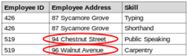

- a) Update : (ID, Address), (ID, Skill)
- b) Insert : (ID, Name, Hire Date), (ID, Code)
- c) Delete : (ID, Name, Hire Date), (ID, Code)

## Database Management Systems

- b) Insertion Anomaly : Until the new faculty member, Dr. Newsome, is assigned to teach at least one course, his details cannot be Faculty Their Courses and
- c) Deletion Anomaly : All information about Dr. Giddens is lost if he temporarily ceases to be assigned to any courses. Faculty and Their Courses

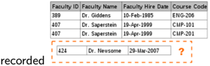

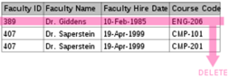

## Partha Pratim Das

## Module 26

Partha Pratim Das

Week Recap

Objectives &amp; Outline

Normal Forms

1NF

2NF

3NF

Module Summary

## Desirable Properties of Decomposition

- Lossless Join Decomposition Property
- It should be possible to reconstruct the original table
- Dependency Preserving Property
- No functional dependency (or other constraints should get violated)

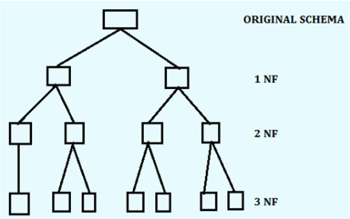

## Database Management Systems

Partha Pratim Das

## Module 26

Partha Pratim Das

Week Recap

Objectives &amp; Outline

Normal Forms

1NF

2NF

3NF

Module Summary

## Normalization and Normal Forms

- A normal form specifies a set of conditions that the relational schema must satisfy in terms of its constraints - they offer varied levels of guarantee for the design
- Normalization rules are divided into various normal forms. Most common normal forms are:
- First Normal Form (1NF)
- Second Normal Form (2NF)
- Third Normal Form (3NF)
- Informally, a relational database relation is often described as 'normalized' if it meets third normal form. Most 3NF relations are free of insertion, update, and deletion anomalies

## Module 26

Partha Pratim Das

Week Recap

Objectives &amp; Outline

Normal Forms

1NF

2NF

3NF

Module Summary

## Normalization and Normal Forms

- Additional Normal Forms
- Elementary Key Normal Form (EKNF)
- Boyce-codd Normal Form (BCNF)
- Multivalued Dependencies And Fourth Normal Form (4NF)
- Essential Tuple Normal Form (ETNF)
- Join Dependencies and Fifth Normal Form (5NF)
- Sixth Normal Form (6NF)
- Domain/Key Normal Form (DKNF)

## Module 26

Partha Pratim

Das

Week Recap

Objectives &amp;

Outline

Normal Forms

1NF

2NF

3NF

Module Summary

## 1NF: First Normal Form

- A relation is in First Normal Form if and only if all underlying domains contain atomic values only (doesn't have multivalued attributes (MVA))
- STUDENT(Sid, Sname, Cname)

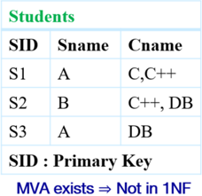

| SID             | Sname           | Cname           |
|-----------------|-----------------|-----------------|
| S1              | A               | C,C++           |
| S2              | B               | C++, DB         |
| S3              | A               | DB              |
| SID Primary Key | SID Primary Key | SID Primary Key |

## Students

No MVA = In INF

| SID         | Sname       | Cname       |
|-------------|-------------|-------------|
| S1          | A           |             |
| S1          | A           | C++         |
| S2          | B           | C++         |
| S2          | B           | DB          |
| S3          | A           | DB          |
| Primary Kev | Primary Kev | Primary Kev |

Source:

http://www.edugrabs.com/normal-forms/#fnf

Partha Pratim Das

Module 26

Partha Pratim

Das

Week Recap

Objectives &amp;

Outline

Normal Forms

1NF

2NF

3NF

Module Summary

## 1NF (2): Possible Redundancy

- Example: Supplier(SID, Status, City, PID, Qty)

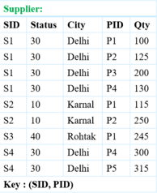

| Supplier:      | Supplier:      | Supplier:      | Supplier:   | Supplier:   |
|----------------|----------------|----------------|-------------|-------------|
| SID            | Status         | City           | PID         | Qty         |
| S1             | 30             | Delhi          | Pl          | 100         |
| S1             | 30             | Delhi          | P2          | 125         |
| SI             | 30             | Delhi          |             | 200         |
| SI             | 30             | Delhi          |             | 130         |
| S2             | 10             | Karnal         |             | 115         |
| S2             | 10             | Karnal         | P2          | 250         |
| S3             | 40             | Rohtak         | PI          | 245         |
| S4             | 30             | Delhi          | P4          | 300         |
|                | 30             | Delhi          | P5          | 315         |
| (SID, PID) Key | (SID, PID) Key | (SID, PID) Key |             |             |

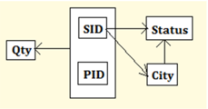

## Drawbacks:

- Deletion Anomaly: If we delete &lt; S3,40,Rohtak,P1,245 &gt; , then we lose the information that S3 lives in Rohtak.
- Insertion Anomaly: We cannot insert a Supplier S5 located in Karnal, until S5 supplies at least one part.
- Update Anomaly: If Supplier S1 moves from Delhi to Kanpur, then it is difficult to update all the tuples having SID as S1 and City as Delhi.

Normalization is a method to reduce redundancy. However, sometimes 1NF increases redundancy.

## Partha Pratim Das

## Module 26

Partha Pratim Das

Week Recap

Objectives &amp;

Outline

Normal Forms

1NF

2NF

3NF

Module Summary

## 1NF (3): Possible Redundancy

## · When LHS is not a Superkey :

- Let X → Y be a non trivial FD over R with X is not a superkey of R , then redundancy exist between X and Y attribute set.
- Hence in order to identify the redundancy, we need not to look at the actual data, it can be identified by given functional dependency.
- Example : X → Y and X is not a Candidate Key
- ⇒ X can duplicate
- ⇒ Corresponding Y value would duplicate also.

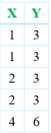

## Database Management Systems

## · When LHS is a Superkey :

- If X → Y is a non trivial FD over R with X is a superkey of R , then redundancy does not exist between X and Y attribute set.
- Example : X → Y and X is a Candidate Key ⇒ X cannot duplicate
- ⇒ Corresponding Y value may or may not duplicate.

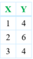

## Partha Pratim Das

## Module 26

Partha Pratim Das

Week Recap

Objectives &amp; Outline

Normal Forms

1NF

2NF

3NF

Module Summary

## 2NF: Second Normal Form

- Relation R is in Second Normal Form (2NF) only iff :
- R is in 1NF and
- R contains no Partial Dependency

## Partial Dependency:

Let R be a relational Schema and X , Y , A be the attribute sets over R where X : Any Candidate Key, Y : Proper Subset of Candidate Key, and A : Non Prime Attribute

If Y → A exists in R , then R is not in 2NF.

( Y → A ) is a Partial dependency only if

- Y : Proper subset of Candidate Key
- A : Non Prime Attribute
- A prime attribute of a relation is an attribute that is a part of a candidate key of the relation

Partha Pratim Das

## Module 26

Partha Pratim

Das

Week Recap

Objectives &amp;

Outline

Normal Forms

1NF

2NF

3NF

Module Summary

- STUDENT(Sid, Sname, Cname) (already in 1NF)
- Redundancy?
- Sname
- Anomaly?
- Yes

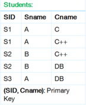

| Students:                 | Students:                 | Students:                 |
|---------------------------|---------------------------|---------------------------|
| SID                       | Sname                     | Cname                     |
| S1                        |                           |                           |
| S1                        |                           | C++                       |
| S2                        |                           | C++                       |
| S2                        |                           | DB                        |
| S3                        |                           | DB                        |
| (SID, Cname): Primary Key | (SID, Cname): Primary Key | (SID, Cname): Primary Key |

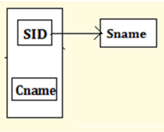

Functional Dependencies: { SID , Cname } → Sname SID → Sname

## Partial Dependencies:

SID → Sname (as SID is a Proper Subset of Candidate Key { SID , Cname } )

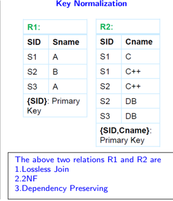

Source: http://www.edugrabs.com/2nf-second-normal-form/

## Partha Pratim Das

## Module 26

Partha Pratim

Das

Week Recap

Objectives &amp;

Outline

Normal Forms

1NF

2NF

3NF

Module Summary

## 2NF (3): Possible Redundancy

- Supplier(SID, Status, City, PID, Qty)

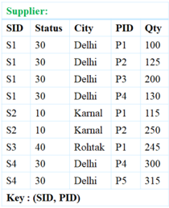

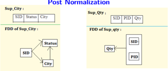

## Drawbacks:

- Deletion Anomaly : If we delete a tuple in Sup City , then we not only loose the information about a supplier, but also loose the status value of a particular city.
- Insertion Anomaly : We cannot insert a City and its status until a supplier supplies at least one part.

Partial Dependencies : SID → Status SID → City

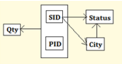

- Update Anomaly : If the status value for a city is changed, then we will face the problem of searching every tuple for that city.

| Supplier:      | Supplier:      | Supplier:      | Supplier:   | Supplier:   |
|----------------|----------------|----------------|-------------|-------------|
| SID            | Status         | City           | PID         | Qty         |
| SI             | 30             | Delhi          | Pl          | 100         |
|                | 30             | Delhi          | P2          | 125         |
|                | 30             | Delhi          | P3          | 200         |
|                | 30             | Delhi          | P4          | 130         |
| S2             | 10             | Karnal         | Pl          | 115         |
| S2             | 10             | Karnal         | P2          | 250         |
| S3             | 40             | Rohtak         | Pl          | 245         |
| S4             | 30             | Delhi          | P4          | 300         |
| S4             | 30             | Delhi          |             | 315         |
| Key (SID, PID) | Key (SID, PID) | Key (SID, PID) |             |             |

Source:

http://www.edugrabs.com/2nf-second-normal-form/

Partha Pratim Das

## Module 26

Partha Pratim Das

Week Recap

Objectives &amp; Outline

Normal Forms

1NF

2NF

3NF

Module Summary

## 3NF: Third Normal Form

Let R be the relational schema.

- [E. F. Codd,1971] R is in 3NF only if:
- R should be in 2NF
- R should not contain transitive dependencies (OR, Every non-prime attribute of R is non-transitively dependent on every key of R )
- [Carlo Zaniolo, 1982] Alternately, R is in 3NF iff for each of its functional dependencies X → A , at least one of the following conditions holds:
- X contains A (that is, A is a subset of X , meaning X → A is trivial functional dependency), or
- X is a superkey, or
- Every element of A -X , the set difference between A and X , is a prime attribute (i.e., each attribute in A -X is contained in some candidate key)
- [Simple Statement] A relational schema R is in 3NF if for every FD X → A associated with R either
- A ⊆ X (that is, the FD is trivial) or
- X is a superkey of R or
- A is part of some candidate key (not just superkey!)
- A relation in 3NF is naturally in 2NF

## Module 26

Partha Pratim Das

Week Recap

Objectives &amp; Outline

Normal Forms

1NF

2NF

3NF

Module Summary

## 3NF (2): Transitive Dependency

- A transitive dependency is a functional dependency which holds by virtue of transitivity. A transitive dependency can occur only in a relation that has three or more attributes.
- Let A , B , and C designate three distinct attributes (or distinct collections of attributes) in the relation. Suppose all three of the following conditions hold:
- A → B
- It is not the case that B → A
- B → C
- Then the functional dependency A → C (which follows from 1 and 3 by the axiom of transitivity) is a transitive dependency

Module 26

Partha Pratim Das

Week Recap

Objectives &amp; Outline

Normal Forms

1NF

2NF

3NF

Module Summary

## 3NF (3): Transitive Dependency

- Example of transitive dependency
- The functional dependency { Book } → { Author Nationality } applies; that is, if we know the book, we know the author's nationality. Furthermore:
- { Book } → { Author }
- { Author } does not → { Book }
- { Author } → { Author Nationality }
- Therefore { Book } → { Author Nationality } is a transitive dependency.
- Transitive dependency occurred because a non-key attribute (Author) was determining another non-key attribute (Author Nationality).

| Book                                  | Genre                   | Author       | Author Nationality   |
|---------------------------------------|-------------------------|--------------|----------------------|
| Twenty Thousand Leagues Under the Sea | Sclence Fiction         | Jules Verne  | French               |
| Journey the Earth                     | Sclence Fiction         | Jules Verne  | French               |
| Leaves of Grass                       | Poetry                  | Walt Whitman | American             |
| Anna Karenina                         | Literary Fiction        | Leo Tolstoy  | Russian              |
| Confession                            | Religious Autobiography | Leo Tolstoy  | Russian              |

## Database Management Systems

Partha Pratim Das

## Module 26

Partha Pratim

Das

Week Recap

Objectives &amp;

Outline

Normal Forms

1NF

2NF

3NF

Module Summary

## 3NF (4): Example

- Example:

## Sup City(SID, Status, City) (already in 2NF)

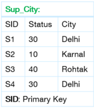

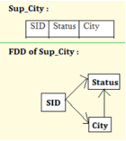

Database Management Systems

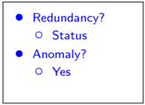

Functional Dependencies: SID → Status, SID → City, City → Status Transitive Dependency : SID → Status { As SID → City and City → Status }

## Partha Pratim Das

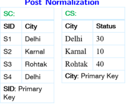

|                  |                  | CS:               | CS:               |
|------------------|------------------|-------------------|-------------------|
| SID              | City             | City              | Status            |
| S1               | Delhi            | Delhi             | 30                |
| S2               | Karnal           | Karnal            | 10                |
| S3               | Rohtak           | Rohtak            | 40                |
| S4               | Delhi            | City: Primary Key | City: Primary Key |
| SID: Primary Key | SID: Primary Key |                   |                   |

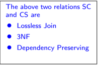

Module 26

Partha Pratim Das

Week Recap

Objectives &amp; Outline

Normal Forms

1NF

2NF

3NF

Module Summary

## 3NF (5): Example

- Relation dept advisor ( s ID , i ID , dept name )
- F = { s ID , dept name → i ID , i ID → dept name }
- Two candidate keys: s ID , dept name , and i ID , s ID
- R is in 3NF
- s ID , dept name → i ID
- glyph[triangleright] s ID , dept name is a superkey
- i ID → dept name
- glyph[triangleright] dept name is contained in a candidate key

A relational schema R is in 3NF if for every FD X → A associated with R either

- A ⊆ X (i.e., the FD is trivial) or
- X is a superkey of R or
- A is part of some key (not just superkey!)

## Module 26

Partha Pratim Das

Week Recap

Objectives &amp; Outline

Normal Forms

1NF

2NF

3NF

Module Summary

## 3NF (6): Redundancy

- There is some redundancy in this schema
- Example of problems due to redundancy in 3NF ( J : s ID , L : i ID , K : dept name )
- R = ( J , L , K ). F = { JK → L , L → K }
- Repetition of information (for example, the relationship l 1 , k 1 )
- ( i ID , dept name )
- Need to use null values (for example, to represent the relationship l 2 , k 2 where there is no corresponding value for J ).
- ( i ID , dept name ) if there is no separate relation mapping instructors to

| J    | L   | K   |
|------|-----|-----|
|      |     | E   |
| null | 12  | kz  |

departments

Database Management Systems

Partha Pratim Das

Module 26

Partha Pratim Das

Week Recap

Objectives &amp; Outline

Normal Forms

1NF

2NF

3NF

Module Summary

## Module Summary

- Studied the Normal Forms and their Importance in Relational Design - how progressive increase of constraints can minimize redundancy in a schema

Slides used in this presentation are borrowed from http://db-book.com/ with kind permission of the authors.

Edited and new slides are marked with 'PPD'.