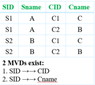
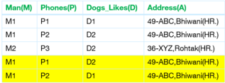
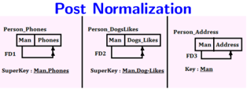

## Module 29

Partha Pratim Das

Objectives &amp; Outline

Multivalued

Dependency

Definition

Example

Use

Theory

Decomposition to

4NF

Module Summary

## Database Management Systems

Module 29: Relational Database Design/9: MVD and 4NF

## Partha Pratim Das

Department of Computer Science and Engineering Indian Institute of Technology, Kharagpur ppd@cse.iitkgp.ac.in

Partha Pratim Das

## Module 29

Partha Pratim Das

Objectives &amp; Outline

Multivalued

Dependency

Definition

Example

Use

Theory

Decomposition to 4NF

Module Summary

## Module Recap

- Using the specification for a Library Information System, we have illustrated how a schema can be designed and then refined for finalization

## Module 29

Partha Pratim Das

Objectives &amp; Outline

Multivalued

Dependency

Definition

Example

Use

Theory

Decomposition to 4NF

Module Summary

## Module Objectives

- To understand multi-valued dependencies arising out of attributes that can have multiple values
- To define Fourth Normal Form and learn the decomposition algorithm to 4NF

## Module 29

Partha Pratim Das

Objectives &amp; Outline

Multivalued

Dependency

Definition

Example

Use

Theory

Decomposition to 4NF

Module Summary

## Module Outline

- Multivalued Dependencies
- Decomposition to 4NF

## Module 29

Partha Pratim Das

Objectives &amp; Outline

Multivalued Dependency

Definition

Example

Use

Theory

Decomposition to

4NF

Module Summary

## Multivalued Dependency

## Module 29

Partha Pratim

Das

Objectives &amp;

Outline

Multivalued

Dependency

Definition

Example

Use

Theory

Decomposition to 4NF

Module Summary

## MVD: Multivalued Dependency

## · Persons(Man, Phones, Dog Like)

| Person   | Person    | Person       | Meaning of the tuples                                   |
|----------|-----------|--------------|---------------------------------------------------------|
| Man(M)   | Phones(P) | Dogs_Like(D) | Man M have phones P and likes the dogs                  |
| MI       |           | DIID2        | MI have phones Pl and P2, and likes the dogs Dl and D2. |
| M2       | P3        | D2           | M2 have phones P3, and likes the dog D2.                |
| Key MPD  | Key MPD   | Key MPD      | Key MPD                                                 |

There are no non trivial FDs because all attributes are combined forming Candidate Key, that is, MDP. In the above relation, two multivalued dependencies exists:

- Man glyph[dblarrowheadright] Phones
- Man glyph[dblarrowheadright] Dogs Like

A man's phone are independent of the dogs they like. But after converting the above relation in Single Valued Attribute, each of a man's phones appears with each of the dogs they like in all combinations.

Source : http://www.edugrabs.com/multivalued-dependency-mvd/

## Database Management Systems

## Partha Pratim Das

## Post INF Normalization

| Man(M)   | Phones(P)   | Likes(D) Dogs   |
|----------|-------------|-----------------|
|          | PI          |                 |
|          | P3          |                 |
|          |             | D2              |
| MI       | P2          | D2              |

## Module 29

Partha Pratim Das

Objectives &amp; Outline

Multivalued Dependency

Definition

Example

Use

Theory

Decomposition to

4NF

Module Summary

- If two or more independent relations are kept in a single relation, then Multivalued Dependency is possible. For example, Let there are two relations :
- Student(SID, Sname) where (SID → Sname)
- Course(CID, Cname) where (CID → Cname)
- There is no relation defined between Student and Course. If we kept them in a single relation named Student Course , then MVD will exists because of m:n Cardinality
- If two or more MVDs exist in a relation, then while converting into SVAs, MVD exists.

Source: http://www.edugrabs.com/multivalued-dependency-mvd/

## Database Management Systems

## Partha Pratim Das

## Module 29

Partha Pratim Das

Objectives &amp; Outline

## Multivalued Dependency

Definition

Example

Use

Theory

Decomposition to 4NF

Module Summary

## MVD (3)

- Suppose we record names of children, and phone numbers for instructors:
- inst child(ID, child name)
- inst phone(ID, phone number)
- If we were to combine these schema to get
- inst info(ID, child name, phone number)
- ◦
- Example data: (99999, David, 512-555-1234) (99999, David, 512-555-4321)
- (99999, William, 512-555-1234)
- (99999, William, 512-555-4321)
- This relation is in BCNF
- Why?

## Module 29

Partha Pratim Das

Objectives &amp; Outline

Multivalued Dependency

Definition

Example

Use

Theory

Decomposition to 4NF

Module Summary

## MVD: Definition

- Let R be a relation schema and let α ⊆ R and β ⊆ R. The multivalued dependency α glyph[dblarrowheadright] β

holds on R if in any legal relation r(R) , for all pairs for tuples t 1 and t 2 in r such that t 1 [ α ] = t 2 [ α ], there exist tuples t 3 and t 4 in r such that:

t 1[ α ] = t 2 [ α ] = t 3 [ α ] = t 4 [ α ] t 3[ β ] = t 1 [ β ] t 3[R β ] = t 2[R β ] t 4 [ β ] = t 2[ β ] t 4[R β ] = t 1[R β ]

Example: A relation of university courses, the books recommended for the course, and the lecturers who will be teaching the course:

| Test: course glyph[dblarrowheadright]   | Test: course glyph[dblarrowheadright]   | Test: course glyph[dblarrowheadright]   | book   |
|-----------------------------------------|-----------------------------------------|-----------------------------------------|--------|
| Course                                  | Book                                    | Lecturer                                | Tuples |
| AHA                                     | Silberschatz                            | John D                                  |        |
| AHA                                     | Nederpelt                               | William M                               |        |
| AHA                                     | Silberschatz                            | William M                               |        |
| AHA                                     | Nederpelt                               | John D                                  |        |
| AHA                                     | Silberschatz                            | Christian G                             |        |
| AHA                                     | Nederpelt                               | Christian G                             |        |
| OSO                                     | Silberschatz                            | John D                                  |        |
| OSO                                     | Silberschatz                            | William M                               |        |

- course glyph[dblarrowheadright] book
- course glyph[dblarrowheadright] lecturer

Database Management Systems

## Partha Pratim Das

## Module 29

Partha Pratim Das

Objectives &amp; Outline

Multivalued Dependency Definition

Example

Use

Theory

Decomposition to 4NF

Module Summary

## MVD: Example

- Let R be a relation schema with a set of attributes that are partitioned into 3 nonempty subsets. Y, Z, W
- We say that Y glyph[dblarrowheadright] Z (Y multidetermines Z ) if and only if for all possible relations r (R ) &lt; y 1 , z 1 , w 1 &gt; ∈ r and &lt; y 1 , z 2 , w 2 &gt; ∈ r then
- &lt; y 1 , z 1 , w 2 &gt; ∈ r and &lt; y 1 , z 2 , w 1 &gt; ∈ r
- Note that since the behavior of Z and W are identical it follows that Y glyph[dblarrowheadright] Z if Y glyph[dblarrowheadright] W

## Module 29

Partha Pratim Das

Objectives &amp; Outline

Multivalued Dependency Definition

Example

Use

Theory

Decomposition to 4NF

Module Summary

## MVD: Example (2)

- In our example:
- ID glyph[dblarrowheadright] child name
- ID glyph[dblarrowheadright] phone number
- The above formal definition is supposed to formalize the notion that given a particular value of Y ( ID ) it has associated with it a set of values of Z ( child name ) and a set of values of W ( phone number ), and these two sets are in some sense independent of each other.
- Note:
- If Y → Z then Y glyph[dblarrowheadright] Z
- Indeed we have (in above notation) Z 1 = Z 2 The claim follows.

## Module 29

Partha Pratim Das

Objectives &amp; Outline

Multivalued

Dependency

Definition

Example

Use

Theory

Decomposition to 4NF

Module Summary

## MVD: Use

- We use multivalued dependencies in two ways:
- a) To test relations to determine whether they are legal under a given set of functional and multivalued dependencies
- b) To specify constraints on the set of legal relations. We shall thus concern ourselves only with relations that satisfy a given set of functional and multivalued dependencies.
- If a relation r fails to satisfy a given multivalued dependency, we can construct a relations r ' that does satisfy the multivalued dependency by adding tuples to r .

## Module 29

Partha Pratim

Das

Objectives &amp;

Outline

Multivalued

Dependency

Definition

Example

Use

Theory

Decomposition to

4NF

Module Summary

## MVD: Theory

|    | Name            | Rule                                                                                                          |
|----|-----------------|---------------------------------------------------------------------------------------------------------------|
| C- | Complementation | If X glyph[dblarrowheadright] Y , then X glyph[dblarrowheadright] ( R - ( X ∪ Y )).                           |
| A- | Augmentation    | If X glyph[dblarrowheadright] Y and W ⊇ Z , then WX glyph[dblarrowheadright] YZ .                             |
| T- | Transitivity    | If X glyph[dblarrowheadright] Y and Y glyph[dblarrowheadright] Z , then X glyph[dblarrowheadright] ( Z - Y ). |
|    | Replication     | If X → Y , then X glyph[dblarrowheadright] Y but the reverse is not true.                                     |
|    | Coalescence     | If X glyph[dblarrowheadright] Y and there is a W such that W ∩ Y is empty, W → Z and Y ⊇ Z , then X → Z .     |

- A MVD X glyph[dblarrowheadright] Y in R is called a trivial MVD is
- Y is a subset of X (X ⊇ Y) or
- X ∪ Y = R . Otherwise, it is a non trivial MVD and we have to repeat values redundantly in the tuples.

## Module 29

Partha Pratim Das

Objectives &amp; Outline

Multivalued

Dependency

Definition

Example

Use

Theory

Decomposition to 4NF

Module Summary

## MVD: Theory (2)

- From the definition of multivalued dependency, we can derive the following rule:
- If α → β , then α glyph[dblarrowheadright] β
- That is, every functional dependency is also a multivalued dependency
- The closure D + of D is the set of all functional and multivalued dependencies logically implied by D.
- We can compute D + from D, using the formal definitions of functional dependencies and multivalued dependencies.
- We can manage with such reasoning for very simple multivalued dependencies, which seem to be most common in practice
- For complex dependencies, it is better to reason about sets of dependencies using a system of inference rules

## Module 29

Partha Pratim Das

Objectives &amp; Outline

Multivalued

Dependency

Definition

Example

Use

Theory

Decomposition to 4NF

Module Summary

## Decomposition to 4NF

## Decomposition to 4NF

Module 29

Partha Pratim Das

Objectives &amp; Outline

Multivalued

Dependency

Definition

Example

Use

Theory

Decomposition to 4NF

Module Summary

## Fourth Normal Form

- A relation schema R is in 4NF with respect to a set D of functional and multivalued dependencies if for all multivalued dependencies in D + of the form α glyph[dblarrowheadright] β , where α ⊆ R and β ⊆ R, at least one of the following hold:
- α glyph[dblarrowheadright] β is trivial (that is, β ⊆ α or α ∪ β = R) ◦ α is a superkey for schema R
- If a relation is in 4NF it is in BCNF

Module 29

Partha Pratim Das

Objectives &amp; Outline

Multivalued

Dependency

Definition

Example

Use

Theory

Decomposition to 4NF

Module Summary

## Restriction of Multivalued Dependencies

- The restriction of D to R i is the set D i consisting of
- All functional dependencies in D + that include only attributes of R i
- All multivalued dependencies of the form
- α glyph[dblarrowheadright] ( β ∩ R i ) where α ⊆ R i and α glyph[dblarrowheadright] β is in D +

## Module 29

Partha Pratim Das

Objectives &amp; Outline

Multivalued

Dependency

Definition

Example

Use

Theory

Decomposition to 4NF

Module Summary

## 4NF Decomposition Algorithm

- a) For all dependencies A glyph[dblarrowheadright] B in D + , check if A is a superkey
- By using attribute closure
- b) If not, then
- Choose a dependency in F+ that breaks the 4NF rules, say A glyph[dblarrowheadright] B
- Create R1 = A B
- Create R2 = (R - (B - A))
- Note that: R1 ∩ R2 = A and A glyph[dblarrowheadright] AB (= R1), so this is lossless decomposition
- c) Repeat for R1, and R2
- By defining D 1 + to be all dependencies in F that contain only attributes in R1
- Similarly D 2 +

## Module 29

Partha Pratim Das

Objectives &amp; Outline

Multivalued

Dependency

Definition

Example

Use

Theory

Decomposition to 4NF

Module Summary

## 4NF Decomposition Algorithm

result : = { R } ;

done := false; compute D + ; Let Di denote the restriction of D + to Ri while ( not done ) if (there is a schema Ri in result that is not in 4NF) then begin let α glyph[dblarrowheadright] β be a nontrivial multivalued dependency that holds on Ri such that α → Ri is not in Di , and α ∩ β = φ ; result := ( result - Ri ) ∪ ( Ri - β ) ∪ ( α, β ); end else done := true;

Note: each Ri is in 4NF, and decomposition is lossless-join

## Module 29

Partha Pratim Das

Objectives &amp; Outline

Multivalued

Dependency

Definition

Example

Use

Theory

Decomposition to 4NF

Module Summary

## Example of 4NF Decomposition

- Example:
- Person Modify(Man(M), Phones(P), Dog Likes(D), Address(A))
- FDs:

glyph[triangleright] FD1 : Man glyph[dblarrowheadright] Phones

- glyph[triangleright] FD2 : Man

glyph[dblarrowheadright] Dogs Like

- glyph[triangleright] FD3 : Man → Address
- Key = MPD
- All dependencies violate 4NF

| Man(M)   | Phones(P)   | Dogs_Likes(D)   | Address(A)           |
|----------|-------------|-----------------|----------------------|
|          |             | D1              | 49-ABC, Bhiwani(HR:) |
|          | P2          | D2              | 49-ABC Bhiwani(HR:)  |
| M2       | P3          | D2              | 36-XYZ,Rohtak(HR:)   |
|          |             | D2              | 49-ABC, Bhiwani(HR:) |
| Mi       | P2          | D1              | 49-ABC, Bhiwani(HR:) |

Database Management Systems

In the above relations for both the MVD's 'X' is Man, which is again not the super key, but as X uY = Rie. (Man &amp; Phones) together make the relation So the above MVD's are trivial and in FD 3, Address is functionally dependent on Man where Man is the key in Person Address hence all the three relations are in 4NF

## Partha Pratim Das

Module 29

Partha Pratim Das

Objectives &amp; Outline

Multivalued

Dependency

Definition

Example

Use

Theory

Decomposition to 4NF

Module Summary

## Example of 4NF Decomposition

- •
- R =(A, B, C, G, H, I) F = A glyph[dblarrowheadright] B B glyph[dblarrowheadright] HI CG glyph[dblarrowheadright] H
- R is not in 4NF since A glyph[dblarrowheadright] B and A is not a superkey for R
- Decomposition

- a) R 1 = (A, B)

- ( R 1

is in 4NF)

- b) R 2 = (A, C, G, H, I) ( R 2 is not in 4NF, decompose into R 3 and R 4 )

- c) R 3

- = (C, G, H) ( R 3 is in 4NF)

- d) R 4 = (A, C, G, I)

- ( R 4 is not in 4NF, decompose into R 5 and R 6 )

- A glyph[dblarrowheadright] B and B glyph[dblarrowheadright] HI → A glyph[dblarrowheadright] HI, (MVD transitivity), and

- and hence A glyph[dblarrowheadright] I (MVD restriction to R 4 )

- e) R 5 = (A, I)

( R 5 is in 4NF)

- f) R 6 = (A, C, G)

( R 6 is in 4NF)

Database Management Systems

Partha Pratim Das

29.21

Module 29

Partha Pratim Das

Objectives &amp; Outline

Multivalued

Dependency

Definition

Example

Use

Theory

Decomposition to 4NF

Module Summary

## Module Summary

- Understood multi-valued dependencies to handle attributes that can have multiple values
- Learnt Fourth Normal Form and decomposition to 4NF

Slides used in this presentation are borrowed from http://db-book.com/ with kind permission of the authors.

Edited and new slides are marked with 'PPD'.

Partha Pratim Das