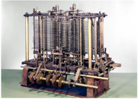
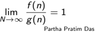
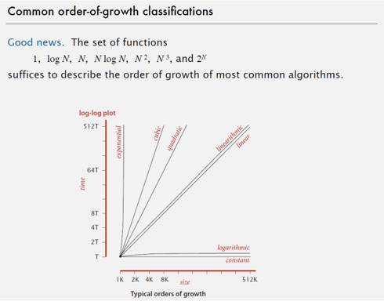
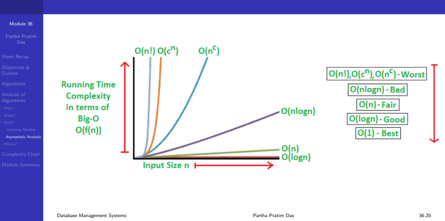
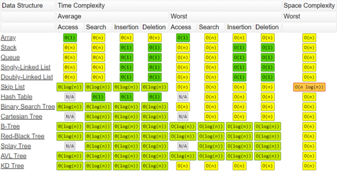
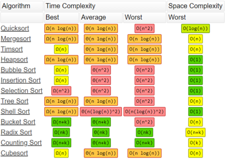

Module 36

Partha Pratim Das

Week Recap

Objectives &amp;

Outline

Algorithms

Analysis of

Algorithms

Why?

What?

How?

Counting Models

Asymptotic Analysis

Where?

Complexity Chart

Module Summary

## Database Management Systems

Module 36: Algorithms and Data Structures/1: Algorithms and Complexity Analysis

## Partha Pratim Das

Department of Computer Science and Engineering Indian Institute of Technology, Kharagpur ppd@cse.iitkgp.ac.in

Partha Pratim Das

## Module 36

Partha Pratim Das

Week Recap

Objectives &amp; Outline

Algorithms

Analysis of Algorithms

Why?

What?

How?

Counting Models

Asymptotic Analysis

Where?

Complexity Chart

Module Summary

## Week Recap

- Had a glimpse of Application Programs across various sectors
- Understood the architectures for an application and their classification and evolution
- Glimpsed at architecture for a few sample applications
- Familiarized with the Fundamentals notions and technologies of Web
- Learnt about Scripting and the notions of Servlets
- Learnt to use SQL from a programming language
- Learnt to build Python Web Applications with PostgreSQL using psycopg2 and Flask
- Understood the steps in the Rapid Application Development Process
- Exposed to the issues in Application Performance and Security
- Learnt the distinctive features of Mobile Apps

## Module 36

Partha Pratim Das

Week Recap

Objectives &amp; Outline

Algorithms

Analysis of Algorithms

Why?

What?

How?

Counting Models

Asymptotic Analysis

Where?

Complexity Chart

Module Summary

## Module Objectives

- Define Algorithms and its difference with Programs
- Analyze algorithms for performance of time, space, power, etc.
- Introduce Asymptotic notation for representation of complexity
- Consider complexity of common algorithms

## Module 36

Partha Pratim Das

Week Recap

Objectives &amp; Outline

Algorithms

Analysis of Algorithms

Why?

What?

How?

Counting Models

Asymptotic Analysis

Where?

Complexity Chart

Module Summary

## Module Outline

- Algorithms and Programs
- Analysis of Algorithms
- Complexity Chart

## Module 36

Partha Pratim Das

Week Recap

Objectives &amp; Outline

Algorithms

Analysis of Algorithms

Why?

What?

How?

Counting Models

Asymptotic Analysis

Where?

Complexity Chart

Module Summary

## Algorithms and Programs

## · Algorithm

- An algorithm is a finite sequence of well-defined , computer-implementable (optional) instructions, typically to solve a class of specific problems or to perform a computation.
- Algorithms are always unambiguous and are used as specifications for performing calculations, data processing, automated reasoning, and other tasks.
- An algorithm must terminate

## · Program

- A computer program is a collection of instructions that can be executed by a computer to perform a specific task
- A computer program is usually written by a computer programmer in a programming language.
- A programs implements an algorithm
- A program may or may not terminate. For example, an OS

## Partha Pratim Das

Module 36

Partha Pratim Das

Week Recap

Objectives &amp; Outline

Algorithms

Analysis of Algorithms

Why?

What?

How?

Counting Models

Asymptotic Analysis

Where?

Complexity Chart

Module Summary

## Analysis of Algorithms

## Analysis of Algorithms

## Module 36

Partha Pratim Das

Week Recap

Objectives &amp; Outline

Algorithms

Analysis of Algorithms

Why?

What?

How?

Counting Models

Asymptotic Analysis

Where?

Complexity Chart

Module Summary

## Analysis of Algorithms

- Why?
- Set the motivation for algorithm analysis:
- Why analyze?
- What?
- Identify what all need to be analyzed:
- What to analyze?
- How?
- Learn the techniques for analysis:
- How to analyze?
- Where?
- Understand the scenarios for application:
- Where to analyze?
- When?
- Realize your position for seeking the analysis:
- When to analyze?
- Database Management Systems

## Module 36

Partha Pratim Das

Week Recap

Objectives &amp; Outline

Algorithms

Analysis of Algorithms

Why?

What?

How?

Counting Models

Asymptotic Analysis

Where?

Complexity Chart

Module Summary

## Why analyze?

## Practical reasons:

- Resources are scarce
- Greed to do more with less
- Avoid performance bugs

## Core Issues:

- Predict performance
- How much time does binary search take?
- Compare algorithms
- How quick is Quicksort?
- Provide guarantees
- Size notwithstanding, Red-Black tree inserts in O (log n )
- Understand theoretical basis
- Sorting by comparison cannot do better than Ω( n log n )

Database Management Systems

Partha Pratim Das

Module 36

Partha Pratim Das

Week Recap

Objectives &amp; Outline

Algorithms

Analysis of Algorithms

Why?

What?

How?

Counting Models

Asymptotic Analysis

Where?

Complexity Chart

Module Summary

## What to analyze?

Core Issue: Cannot control what we cannot measure

- Time
- Story starts here with Analytical Engine
- Most common analysis factor
- Representative of various related analysis factors like Power, Bandwidth, Processors
- Supported by Complexity Classes
- Space
- Widely explored
- Important for hand-held devices
- Supported by Complexity Classes

Module 36

Partha Pratim Das

Week Recap

Objectives &amp; Outline

Algorithms

Analysis of Algorithms

Why?

What?

How?

Counting Models

Asymptotic Analysis

Where?

Complexity Chart

Module Summary

## What to analyze?

- Sum of Natural Numbers

int sum(int n) {

int s = 0;

for(;

n

&gt;

0;

--n)

s = s + n;

return s;

}

- Time T ( n ) = n (additions)
- Space S ( n ) = 2 ( n , s )

Module 36

Partha Pratim Das

Week Recap

Objectives &amp; Outline

Algorithms

Analysis of Algorithms

Why?

What?

How?

Counting Models

Asymptotic Analysis

Where?

Complexity Chart

Module Summary

## What to analyze?

- Find a character in a string

int find(char *str, char c) { for(int i = 0; i &lt; strlen(str); ++i) if (str[i] == c) return i; return 0;

}

n = strlen(str)

- Time T ( n ) = n (compare) + n ∗ T ( strlen(str) ) ≈ n + n 2 ≈ n 2
- Space S ( n ) = 3 ( str , c , i )

Module 36

Partha Pratim Das

Week Recap

Objectives &amp; Outline

Algorithms

Analysis of Algorithms

Why?

What?

How?

Counting Models

Asymptotic Analysis

Where?

Complexity Chart

Module Summary

## What to analyze?

- Minimum of a Sequence of Numbers

int min(int a[], int n) { for(int i = 0; i &lt; n; ++i) cin &gt;&gt; a[i];

int t = a[--n];

for(; n &gt; 0; --n)

if (t &lt; a[--n])

t = a[n];

return t;

}

- Time T ( n ) = n - 1 (comparison of value)

- Space S ( n ) = n +3 ( a[] 's, n , i , t )

Module 36

Partha Pratim Das

Week Recap

Objectives &amp; Outline

Algorithms

Analysis of Algorithms

Why?

What?

How?

Counting Models

Asymptotic Analysis

Where?

Complexity Chart

Module Summary

## What to analyze?

- Minimum of a Sequence of Numbers

int min(int n) {

int x;

cin &gt;&gt; x;

int t = x;

for(; n &gt; 1; --n) {

cin &gt;&gt; x;

if (t &lt; x)

t = x;

}

return t;

}

- Time T ( n ) = n - 1 (comparison of value)

- Space S ( n ) = 3 ( n , x , t )

## Module 36

Partha Pratim Das

Week Recap

Objectives &amp; Outline

Algorithms

Analysis of Algorithms

Why?

What?

How?

Counting Models

Asymptotic Analysis

Where?

Complexity Chart

Module Summary

## How to analyze?

- Counting Models
- Asymptotic Analysis
- Generating Functions
- Master Theorem

## Module 36

Partha Pratim Das

Week Recap

Objectives &amp; Outline

Algorithms

Analysis of Algorithms

Why?

What?

How?

Counting Models

Asymptotic Analysis

Where?

Complexity Chart

Module Summary

## How to analyze?: Counting Models

## Counting Models

- Core Idea: Total running time = Sum of cost × frequency for all operations
- Need to analyze program to determine set of operations
- Cost depends on machine, compiler
- Frequency depends on algorithm, input data
- Machine Model: Random Access Machine (RAM) Computing Model
- Input data &amp; size
- Operations
- Intermediate Stages
- Output data &amp; size

## Module 36

Partha Pratim Das

Week Recap

Objectives &amp; Outline

Algorithms

Analysis of Algorithms

Why?

What?

How?

Counting Models

Asymptotic Analysis

Where?

Complexity Chart

Module Summary

## How to analyze?: Counting Models

- Factorial (Recursive)

int fact(int n) {

if (0 !=

n) return n*fact(n-1);

return 1;

}

- Time T ( n ) = n -1 (multiplication)
- Space S ( n ) = n +1 ( n 's in recursive calls)
- Factorial (Iterative)
- int fact(int n) {

int t =

1;

for(; n &gt;

t = t return t;

}

- Time T ( n ) = n (multiplication)
- Space S ( n ) = 2 ( n , t )

0;

--n)

* n;

## Module 36

Partha Pratim Das

Week Recap

Objectives &amp; Outline

Algorithms

Analysis of Algorithms

Why?

What?

How?

Counting Models

Asymptotic Analysis

Where?

Complexity Chart

Module Summary

## How to analyze?: Asymptotic Analysis

## Asymptotic Analysis

- Core Idea: Cannot compare actual times; hence compare Growth or how time increases with input size
- Function Approximation (tilde (˜) notation)
- Common Growth Functions
- Big-Oh ( O ( . )), Big-Omega (Ω( . )), and Big-Theta (Θ(.)) Notations
- Solve recurrence with Growth Functions

Module 36

Partha Pratim Das

Week Recap

Objectives &amp; Outline

Algorithms

Analysis of

Algorithms

Why?

What?

How?

Counting Models

Asymptotic Analysis

Where?

Complexity Chart

Module Summary

## How to analyze?: Asymptotic Analysis

int count = 0; for (int i = 0; i &lt; N; i++) for (int j = i+1; j &lt; N; j++) if (a[i] + a[j] == 0) count++;

## Function Approximation (tilde (˜) notation)

| Operation            | Frequency                    | Approximation      |
|----------------------|------------------------------|--------------------|
| variable declaration | N +2                         | ∼ N                |
| assignment statement | N +2                         | ∼ N                |
| less than compare    | 1 2 ( N +1)( N +2)           | ∼ 1 2 N 2          |
| equal to compare     | 1 2 N ( N - 1)               | ∼ 1 2 N 2          |
| array access         | N ( N - 1)                   | ∼ N 2              |
| increment            | 1 2 N ( N - 1) to N ( N - 1) | ∼ 1 2 N 2 to ∼ N 2 |

- Estimate running time (or memory) as a function of input size N. Ignore lower order terms
- when N is large, terms are negligible
- when N is small, we don't care
- f ( n ) ∼ g ( n ) means

Database Management Systems

Module 36

Partha Pratim

Das

Week Recap

Objectives &amp;

Outline

Algorithms

Analysis of

Algorithms

Why?

What?

How?

Counting Models

Asymptotic Analysis

Where?

Complexity Chart

Module Summary

## How to analyze?: Asymptotic Analysis

Courtesy: Algorithms by Robert Sedgewick &amp; Kevin Wayne Partha Pratim Das

## How to analyze?: Asymptotic Analysis

Module 36

Partha Pratim

Das

Week Recap

Objectives &amp;

Outline

Algorithms

Analysis of

Algorithms

Why?

What?

How?

Counting Models

Asymptotic Analysis

Where?

Complexity Chart

Module Summary

## How to analyze?: Asymptotic Analysis

## Common order-of-growth classifications

| order of growth   | name         | typical code framework                                     | description        | example           | T(2N) / T(N)   |
|-------------------|--------------|------------------------------------------------------------|--------------------|-------------------|----------------|
|                   | constant     | a = b + c;                                                 | statement          | add two numbers   |                |
| log N             | logarithmic  | while (N > 1) N / 2;                                       | divide in half     | binary search     |                |
|                   | linear       | for (int i++)                                              | loop               | find the maximum  |                |
| Nlog N            | linearithmic | [see mergesort lecture]                                    | divide and conquer | mergesort         |                |
|                   | quadratic    | for (int for (int j 0; j < N; j++)                         | double loop        | check all pairs   |                |
|                   | cubic        | for (int i++) for (int 0; j < N; j++) for (int k < N; k++) | triple loop        | check all triples |                |
|                   | exponential  | [see combinatorial search lecture]                         | exhaustive search  | check all subsets |                |

## Module 36

Partha Pratim Das

Week Recap

Objectives &amp; Outline

Algorithms

Analysis of Algorithms

Why?

What?

How?

Counting Models

Asymptotic Analysis

Where?

Complexity Chart

Module Summary

## Asymptotic notation

For a given function g ( n ), we denote by O ( g ( n )) the set of functions:

O ( g ( n )) = { f ( n ) : there exist positive constants c and n 0 such that 0 ≤ f ( n ) ≤ cg ( n ) , for all n &gt; n 0 }

- We use O -notation to give an upper bound on a function, to within a constant factor.
- When we say that the running time of A is O ( n 2 ), we mean that there is a function f ( n ) that is O ( n 2 ) such that for any value of n , no matter what particular input of size n is chosen, the running time on that input is bounded from above by the value f ( n ).
- Equivalently, we mean that the worst-case running time is O ( n 2 ).

## Module 36

Partha Pratim Das

Week Recap

Objectives &amp; Outline

Algorithms

Analysis of Algorithms

Why?

What?

How?

Counting Models

Asymptotic Analysis

Where?

Complexity Chart

Module Summary

## Where to analyze?

## Algorithmic Situation

- Core Idea: Identify data configurations or scenarios for analysis
- Best Case
- ▷ Minimum running time on an input
- Worst Case
- ▷ Running time guarantee for any input of size n
- Average Case
- ▷ Expected running time for a random input of size n
- Probabilistic Case
- ▷ Expected running time of a randomized algorithm
- Amortized Case
- ▷ Worst case running time for any sequence of n operations

Module 36

Partha Pratim Das

Week Recap

Objectives &amp; Outline

Algorithms

Analysis of Algorithms

Why?

What?

How?

Counting Models

Asymptotic Analysis

Where?

Complexity Chart

Module Summary

## Analysis of Algorithms

## Complexity Chart

Module 36

Partha Pratim

Das

Week Recap

Objectives &amp;

Outline

Algorithms

Analysis of

Algorithms

Why?

What?

How?

Counting Models

Asymptotic Analysis

Where?

Complexity Chart

Module Summary

## Big-O Algorithm Complexity Cheat Sheet

## Common Data Structure Operations

| Data Structure                 | Time Complexity   | Time Complexity   | Time Complexity   | Time Complexity      | Time Complexity   | Time Complexity   | Time Complexity   | Time Complexity      | Space Complexity   |
|--------------------------------|-------------------|-------------------|-------------------|----------------------|-------------------|-------------------|-------------------|----------------------|--------------------|
| Data Structure                 | Average           | Average           | Average           | Average              | Worst             | Worst             | Worst             | Worst                | Worst              |
| Data Structure                 | Access            | Search            |                   | Insertion   Deletion | Access            | Search            |                   | Insertion   Deletion |                    |
| Array                          | 0(1)              |                   | O(n)              | O(n)                 | 0(1)              | O(n)              | O(n)              | O(n)                 | O(n)               |
| Stack                          | 0(n)              | 0(n)              | 0(1)              | 0(1)                 | O(n)              | O(n)              | 0(1)              | 0(1)                 | O(n)               |
| Queue                          |                   | 0(n)              | 0(1)              | 0(1)                 | O(n)              | O(n)              | 0(1)              | 0(1)                 | O(n)               |
| Singly-Linked List             | 0(n)              | 0(n)              | 0(1)              | 0(1)                 | O(n)              | O(n)              | 0(1)              | 0(1)                 | O(n)               |
| Doubly-Linked List             | 0(n)              | 0(n)              | 0(1)              | 0(1)                 | O(n)              | O(n)              | 0(1)              | 0(1)                 | O(n)               |
| Skip List                      |                   |                   |                   | 0(1og(n))            | O(n)              | O(n)              | O(n)              | O(n)                 |                    |
| Hash Iable                     |                   | 0(1)              | 0(1)              | 0(1)                 |                   | O(n)              | O(n)              | O(n)                 | O(n)               |
| Binary_Search Tree  0(1og(n) ) |                   | 0( log(n))        | 0( 1og(n))        | 0( 1og(n))           | O(n)              | O(n)              | O(n)              | O(n)                 | O(n)               |
| Cartesian Tree                 |                   | @(log(n))         | @(log(n))         | @(log(n))            |                   |                   | O(n)              | O(n)                 | O(n)               |
| B-Iree                         |                   | @(log(n)          | @(log(n)          | 0( 1og(n))           | O(1og (n))        |                   |                   | O(log(n))            | O(n)               |
| Red-Black Iree                 | @(1og(n))         |                   | @(1og(n)          |                      | O(1og(n)          | O(log(n)          | O(log(n)          | O(log(n)             | O(n)               |
| Splay_Iree                     |                   | 0(1og(n))         | 0( 1og(n))        | 0( 1og(n))           |                   | O(10g(n))         | O(1og(n))         | O(1og(n))            | O(n)               |
| AVL Iree                       | 0(log(n)          |                   | 0(1og(n))         |                      |                   | O(1og())          | O(1og(n))         |                      | O(n)               |
| KD Tree                        |                   | 0(log(n))         | 0( 1og(n))        | 0( 1og(n))           | O(n)              | O(n)              | O(n)              | O(n)                 | O(n)               |

Source : Know Thy Complexities! (06-Apr-2021)

Module 36

Partha Pratim

Das

Week Recap

Objectives &amp;

Outline

Algorithms

Analysis of

Algorithms

Why?

What?

How?

Counting Models

Asymptotic Analysis

Where?

Complexity Chart

Module Summary

## Big-O Algorithm Complexity Cheat Sheet

## Array Sorting Algorithms

| Algorithm      | Complexity Time   | Complexity Time   | Complexity Time   | Space Complexity   |
|----------------|-------------------|-------------------|-------------------|--------------------|
|                | Best              | Average           | Worst             | Worst              |
| Quicksort      | O(n log(n))       | O(n log(n))       | O(n^2)            | O(log(n) )         |
| Mergesort      | O(n log(n))       | @(n log(n))       | O(n log(n))       | O(n)               |
| Iimsort        | O(n)              | O(n log(n))       | O(n log(n))       | O(n)               |
| Heapsort       | O(n log(n))       | O(n log(n))       | O(n log(n))       | 0(1)               |
| Bubble Sort    |                   | 0(n^2)            | O(n^2)            | 0(1)               |
| Insertion Sort | Q(n)              | 0(n^2)            | 0(n^2)            | 0(1)               |
| Selection Sort |                   | 0(n^2)            | O(n^2             | 0(1)               |
| Iree Sort      | O(n log(n))       | 0(n log (n))      | 0(n^2-            | O(n)               |
| Shell Sort     |                   |                   | O(n(log(n))^2)    | 0(1)               |
| Bucket Sort    | O(n+k)            | 0(n+k)            | O(n^2)            | O(n)               |
| Radix Sort     | O(nk)             | O(nk)             | O(nk)             | 0(n+k)             |
| Counting_Sort  |                   | 0(n+k)            | O(n+k)            | O(k)               |
| Cubesort       | O(n)              | O(n log(n))       | O(n log(n))       | O(n)               |

Source : Know Thy Complexities! (06-Apr-2021)

Database Management Systems

Module 36

Partha Pratim Das

Week Recap

Objectives &amp; Outline

Algorithms

Analysis of Algorithms

Why?

What?

How?

Counting Models

Asymptotic Analysis

Where?

Complexity Chart

Module Summary

## Module Summary

- Need for analyzing the running-time and space requirements of a program
- Asymptotic growth rate or order of the complexity of different algorithms
- Worst-case, average-case and best-case analysis

Slides used in this presentation are borrowed from http://db-book.com/ with kind permission of the authors.

Edited and new slides are marked with 'PPD'.

Database Management Systems

Partha Pratim Das