## Module 37

Partha Pratim Das

Objectives &amp; Outline

Data Structure

Linear Data

Structures

Array

Linked List

Search

Linear Search

Binary Search

Module Summary

## Database Management Systems

Module 37: Algorithms and Data Structures/2: Data Structures

## Partha Pratim Das

Department of Computer Science and Engineering Indian Institute of Technology, Kharagpur ppd@cse.iitkgp.ac.in

Partha Pratim Das

## Module 37

Partha Pratim Das

## Objectives &amp; Outline

Data Structure

Linear Data

Structures

Array

Linked List

Search

Linear Search

Binary Search

Module Summary

## Module Recap

- Need for analyzing the running-time and space requirements of a program
- Asymptotic growth rate or order of the complexity of different algorithms
- Worst-case, average-case and best-case analysis

## Module 37

Partha Pratim Das

## Objectives &amp; Outline

Data Structure

Linear Data Structures

Array

Linked List

Search

Linear Search

Binary Search

Module Summary

## Module Objectives

- Introduction to Data Structures
- Review of linear data structures - array, list, stack, queue
- Review of search - linear and binary

## Module 37

Partha Pratim Das

## Objectives &amp; Outline

Data Structure

Linear Data Structures

Array

Linked List

Search

Linear Search

Binary Search

Module Summary

## Module Outline

- Linear data structures - array, list, stack, queue
- Search - linear and binary

## Module 37

Partha Pratim Das

Objectives &amp; Outline

## Data Structure

Linear Data

Structures

Array

Linked List

Search

Linear Search

Binary Search

Module Summary

## Data Structure

- Data structure : A data structure specifies the way of organizing and storing in-memory data that enables efficient access and modification of the data.
- Linear Data Structures
- Non-linear Data Structures
- Most data structure has a container for the data and typical operations that its needs to perform
- For applications relating to data management, the key operations are:
- Create
- Insert
- Delete
- Find / Search
- Close
- Efficiency is measured in terms of time and space taken for these operations

## Partha Pratim Das

Module 37

Partha Pratim Das

Objectives &amp; Outline

Data Structure

Linear Data Structures

Array

Linked List

Search

Linear Search

Binary Search

Module Summary

## Linear Data Structures

## Linear Data Structures

Module 37

Partha Pratim Das

Objectives &amp; Outline

Data Structure

Linear Data Structures

Array

Linked List

Search

Linear Search

Binary Search

Module Summary

## Linear Data Structures

- A Linear data structure has data elements arranged in linear or sequential manner such that each member element is connected to its previous and next element.
- Since data elements are sequentially connected, each element is traversable through a single run.
- Examples of linear data structures are Array, Linked List, Queue, Stack, etc.

## Module 37

Partha Pratim Das

Objectives &amp; Outline

Data Structure

Linear Data Structures

Array

Linked List

Search

Linear Search

Binary Search

Module Summary

## Different examples of linear data structure:

- Array : The data elements are stored at contiguous locations in memory.
- Linked List : The data elements are not required to be stored at contiguous locations in memory. Rather each element stores a link (a pointer to a reference) to the location of the next element.
- Queue : It is a FIFO (First In First Out) data structure. The element that has been inserted first in the queue would be removed first. Thus, insert and removal of the elements in this take place in the same order.
- Stack : It is a LIFO (Last In First Out) data structure. The element that has been inserted last in the stack would be removed first. Thus, insert and removal of the elements in this take place in the reverse order.

## Module 37

Partha Pratim

Das

Objectives &amp;

Outline

Data Structure

Linear Data

Structures

Array

Linked List

Search

Linear Search

Binary Search

Module Summary

## Linear Data Structures (3): Array

- The elements are stored in contiguous memory locations.
- Simple access using indices. For example, let the array name be arr, we can access the element at position 5 as arr[5] .
- Array allows random access using its index which is fast (cost of O (1)). Useful for operations like sorting, searching.

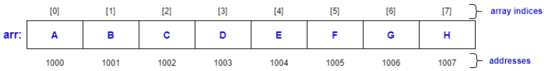

## Module 37

Partha Pratim Das

Objectives &amp; Outline

Data Structure

Linear Data

Structures

Array

Linked List

Search

Linear Search

Binary Search

Module Summary

## Linear Data Structures (4): Array

- Have fixed sizes, not flexible . Since we do not know the number of elements to be stored in runtime, If we create it too large then it can be a waste of memory, if we create it too small then some elements may not be accommodated in the array.
- For example, suppose we create an array to store 8 elements. However, during execution of the program only 5 elements are available, which results in wastage of memory space.

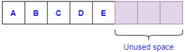

## Module 37

Partha Pratim Das

Objectives &amp; Outline

Data Structure

Linear Data

Structures

Array

Linked List

Search

Linear Search

Binary Search

Module Summary

## Linear Data Structures (5): Array

- Insertion and removal of elements from an array are costlier since the memory locations have to be consecutive.
- Insertion or removal of an element from the end of an array is easy.
- ▷ Insert at end:
- ▷ Remove from end:

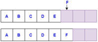

Module 37

Partha Pratim

Das

Objectives &amp; Outline

Data Structure

Linear Data

Structures

Array

Linked List

Search

Linear Search

Binary Search

Module Summary

## Linear Data Structures (6): Array

- Insertion and removal of elements from an array are costlier since the memory locations have to be consecutive.
- Insert and remove elements at any arbitrary position is costly (cost is O ( n ))
- ▷ Insert at any arbitrary position:
- ▷ Remove from any arbitrary position:

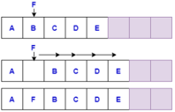

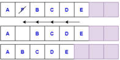

## Database Management Systems

Partha Pratim Das

## Module 37

Partha Pratim

Das

Objectives &amp; Outline

Data Structure

Linear Data

Structures

Array

Linked List

Search

Linear Search

Binary Search

Module Summary

## Linear Data Structures (7): Linked List

- Elements are not required to be stored at contiguous memory locations. A new element can be stored anywhere in the memory where free space is available. Thus, it provides better memory usage than arrays.
- For each new element allocated, a link (a pointer or a reference) is created for the new element using which the element can be added to the linked list.

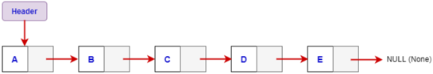

Each element is stored in a node. A node has two parts:

- Info : stores the element.
- Link : stores the location of the next node.
- Header is a link to the first node of the linked list.

Module 37

Partha Pratim Das

Objectives &amp; Outline

Data Structure

Linear Data Structures

Array

Linked List

Search

Linear Search

Binary Search

Module Summary

## Linear Data Structures (8): Linked List

- Flexible in size . Size of a linked list grows or shrinks as and when new elements are inserted or deleted.
- Random access is not possible in linked lists. The elements will have to be accessed sequentially.
- Insertion or removal of an element at/from any arbitrary position is efficient as none of the elements are not required to be moved to new locations.

## Module 37

Partha Pratim Das

Objectives &amp;

Outline

Data Structure

Linear Data

Structures

Array

Linked List

Search

Linear Search

Binary Search

Module Summary

## Linear Data Structures (9): Linked List

- Insertion or removal of an element at/from any arbitrary position is efficient.
- Insertion at front:
1. NewNode.Link = Header
2. Header = NewNode

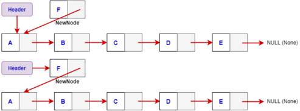

Partha Pratim Das

Module 37

Partha Pratim

Das

Objectives &amp;

Outline

Data Structure

Linear Data

Structures

Array

Linked List

Search

Linear Search

Binary Search

Module Summary

## Linear Data Structures (10): Linked List

- Insertion or removal of an element at/from any arbitrary position is efficient.
- Remove from front:
1. Temp = Header
2. Header = Header.Link
3. Delete(Temp)

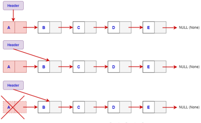

Partha Pratim Das

Database Management Systems

## Module 37

Partha Pratim

Das

Objectives &amp;

Outline

Data Structure

Linear Data

Structures

Array

Linked List

Search

Linear Search

Binary Search

Module Summary

## Linear Data Structures (11): Linked List

- Insertion or removal of an element at/from any arbitrary position is efficient.
- Insertion at end:
1. Node.Link = NewNode

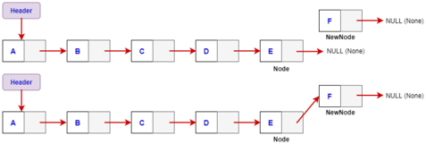

## Linear Data Structures (12): Linked List

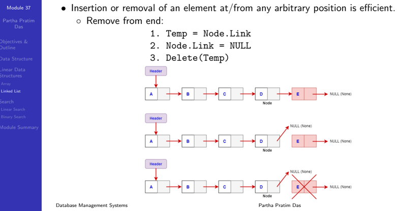

Module 37

Partha Pratim

Das

Objectives &amp;

Outline

Data Structure

Linear Data

Structures

Array

Linked List

Search

Linear Search

Binary Search

Module Summary

## Linear Data Structures (13): Linked List

- Insertion or removal of an element at/from any arbitrary position is efficient.
- Insertion at any intermediate position:
1. NewNode.Link = Node.Link
2. Node.Link = NewNode

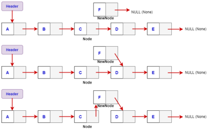

Partha Pratim Das

Database Management Systems

Module 37

Partha Pratim

Das

Objectives &amp;

Outline

Data Structure

Linear Data

Structures

Array

Linked List

Search

Linear Search

Binary Search

Module Summary

## Linear Data Structures (14): Linked List

- Insertion or removal of an element at/from any arbitrary position is efficient.
- Remove from any intermediate position:
1. Temp = Node.Link
2. Node.Link = Node.Link.Link
3. Delete(Temp)

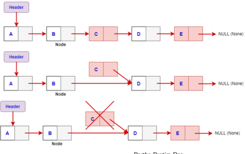

Partha Pratim Das

Database Management Systems

## Module 37

Partha Pratim

Das

Objectives &amp;

Outline

Data Structure

Linear Data

Structures

Array

Linked List

Search

Linear Search

Binary Search

Module Summary

## Search

## Search

## Module 37

Partha Pratim Das

Objectives &amp; Outline

Data Structure

Linear Data

Structures

Array

Linked List

Search

Linear Search

Binary Search

Module Summary

## Linear Search

- The algorithm starts with the first element, compares with the given key value and returns yes if they match.
- If it does not match, then it proceeds sequentially comparing each element of the list with the given key until a match is found or the full list is traversed.

Let the given input list be inputArr = ['a','c','a','d','e','m','i','c','s'] and the search key be 'i'.

Figure: Linear Search Example

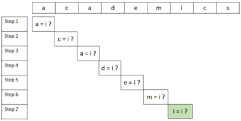

Partha Pratim Das

## Database Management Systems

Module 37

Partha Pratim Das

Objectives &amp; Outline

Data Structure

Linear Data Structures

Array

Linked List

Search

Linear Search

Binary Search

Module Summary

## Linear Search (2)

Python Code for Linear Search:

------------------------------------------------------ def linSearch(inputArr, k): for i in range(len(inputArr)): if inputArr[i] == k: return i return -1

inputArr = ['a','c','a','d','e','m','i','c','s']

k = 'i'

index = linsearch(inputArr,k)

if index != -1:

print("Element found at "+ index)

## Module 37

Partha Pratim Das

Objectives &amp; Outline

Data Structure

Linear Data

Structures

Array

Linked List

Search

Linear Search

Binary Search

Module Summary

## Binary Search

- The input for the algorithm is a sorted list.
- The algorithm compares the key k with the middle element in the list.
- If the key matches, then it returns the index.
- If the key does not match and is greater than the middle element, then the new list is the list to the right of the middle element.
- If the key does not match and is less than the middle element, then the new list is the list to the left of the middle element.

Let the given input list be inputArr = ['a','a','c','c','d','e','i','m','s'] and the search key be 'i'.

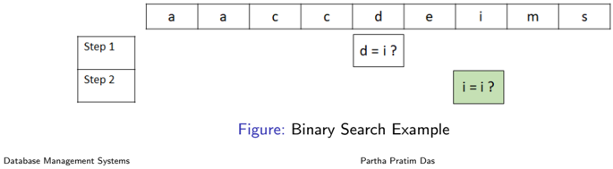

Module 37

Partha Pratim Das

Objectives &amp; Outline

Data Structure

Linear Data

Structures

Array

Linked List

Search

Linear Search

Binary Search

Module Summary

## Binary Search

Python Code for Binary Search:

------------------------------------------------------ def binSearch(inputArr, k): low = 0 high = len(inputArr) - 1 mid = 0 while low &lt;= high: mid = (high + low) // 2 # Division(floor) if inputArr[mid] &lt; k: # new list is to the right of k low = mid + 1 elif inputArr[mid] &gt; k: # new list is to the left of k high = mid 1 else: # means k is present at mid return mid return -1 # The element is not present

inputArr = ['a','a','c','c','d','e','i','m','s'] k = 'i' index = binSearch(inputArr, k) if index != -1: print("Element found at position "+ str(index+1)) else: print("Not found ")

Database Management Systems

Module 37

Partha Pratim

Das

Objectives &amp;

Outline

Data Structure

Linear Data

Structures

Array

Linked List

Search

Linear Search

Binary Search

Module Summary

## Common Data Structure Operations

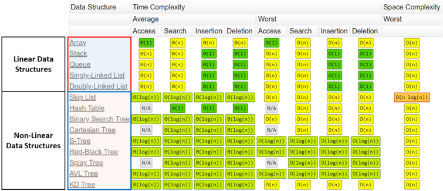

|                        | Data Structure      | Time Complexity   | Time Complexity   | Time Complexity   | Time Complexity      | Time Complexity   | Time Complexity   | Time Complexity   | Time Complexity      | Space Complexity   |
|------------------------|---------------------|-------------------|-------------------|-------------------|----------------------|-------------------|-------------------|-------------------|----------------------|--------------------|
|                        |                     | Average           | Average           | Average           | Average              | Worst             | Worst             | Worst             | Worst                | Worst              |
|                        |                     | Access            | Search            |                   | Insertion   Deletion | Access            | Search            |                   | Insertion   Deletion |                    |
| Linear Data Structures | Array               | 0(1)              |                   |                   |                      | 0(1)              | O(n)              | O(n)              | O(n)                 | O(n)               |
| Linear Data Structures | Stack               | 0(n)              |                   | 0(1)              | 0(1)                 | O(n)              | O(n)              | 0(1)              | 0(1)                 | O(n)               |
| Linear Data Structures | [Queue              | 0(n)              |                   | 0(1)              | 0(1)                 | O(n)              | O(n)              | 0(1)              | 0(1)                 | O(n)               |
| Linear Data Structures | [singly-Linked List | 0(n)              | 0(n)              | 0(1)              | 0(1)                 | O(n)              | O(n)              | 0(1)              | 0(1)                 | O(n)               |
| Linear Data Structures | Doubly-Linked List  | 0(n)              | 0(n)              | 0(1)              | 0(1)                 | O(n)              | O(n)              | 0(1)              | 0(1)                 | O(n)               |
|                        | Skip List           | 0( log(n) )       | 0( log(n))        |                   | 0(log(n))            | O(n)              | O(n)              | O(n)              | O(n)                 | O(n log(n))        |
|                        | Hash Iable          |                   | 0(1)              | 0(1)              | 0(1)                 |                   | O(n)              | O(n)              | O(n)                 | O(n)               |
|                        | [Binary_Search Tree | 0( log(n) )       | 0( log(n))        | 0( log(n))        |                      | O(n)              | O(n)              | O(n)              | O(n)                 | O(n)               |
|                        | Cartesian Iree      | N/A               | 0( log(n)         | 0( log(n)         |                      | N/A               | O(n)              | O(n)              | O(n)                 | O(n)               |
|                        | B-Iree              | 0( log(n) )       | 0( log(n))        | O(log(n))         |                      |                   | O( log(n) )       | O( log(n) )       | O(log(n))            | O(n)               |
|                        | Red-Black Iree      |                   |                   |                   |                      | O(1og(n)          | 0(log(n)          | O(log(n)          | O(log(n))            | O(n)               |
|                        | Splay_Tree          | N/A               | O(log(n))         |                   |                      |                   | O(log(n))         | O(log(n))         | O(log(n))            | O(n)               |
|                        | AVL Iree            | @(log(n))         |                   | O(log(n)          | 0(1og(n)             | O(log(n))         | O(log(n)          | O(log(n)          | O(log(n)             | O(n)               |
|                        | KD Iree             |                   |                   |                   | O(log(n))            | O(n)              | O(n)              | O(n)              | O(n)                 | O(n)               |

Source

: Know Thy Complexities! (06-Apr-2021)

Database Management Systems

Module 37

Partha Pratim Das

Objectives &amp; Outline

Data Structure

Linear Data Structures

Array

Linked List

Search

Linear Search

Binary Search

Module Summary

## Module Summary

- Introduced Data Structures
- Reviewed array, list, stack, queue
- Reviewed linear and binary search

Slides used in this presentation are borrowed from http://db-book.com/ with kind permission of the authors.

Edited and new slides are marked with 'PPD'.

Partha Pratim Das