## Module 38

Partha Pratim Das

Objectives &amp; Outline

Data Structure

Non-linear Data Structures

Graph

Tree

Hash Table

Binary Search Tree

Build a BST

Search a Key

Comparison

Module Summary

## Database Management Systems

Module 38: Algorithms and Data Structures/3: Data Structures

## Partha Pratim Das

Department of Computer Science and Engineering Indian Institute of Technology, Kharagpur ppd@cse.iitkgp.ac.in

Partha Pratim Das

## Module 38

Partha Pratim Das

Objectives &amp; Outline

Data Structure

Non-linear Data Structures

Graph

Tree

Hash Table

Binary Search Tree

Build a BST

Search a Key

Comparison

Module Summary

## Module Recap

- Introduced Data Structures
- Defined Linear Data Structure
- Reviewed array, list, stack, queue
- Reviewed linear and binary search

## Module 38

Partha Pratim Das

## Objectives &amp; Outline

Data Structure

Non-linear Data Structures

Graph

Tree

Hash Table

Binary Search Tree

Build a BST

Search a Key

Comparison

Module Summary

## Module Objectives

- Introducing Non-linear Data Structures - graph, tree, hash table
- Exploring Binary Search Tree
- Comparing Linear and Non-Linear Data Structures

## Module 38

Partha Pratim Das

Objectives &amp; Outline

Data Structure

Non-linear Data Structures

Graph

Tree

Hash Table

Binary Search Tree

Build a BST

Search a Key

Comparison

Module Summary

## Module Outline

- Non-linear Data Structures
- Binary Search Trees
- Comparison of Linear and Non-Linear Data Structures

## Module 38

Partha Pratim Das

Objectives &amp; Outline

## Data Structure

Non-linear Data Structures

Graph

Tree

Hash Table

Binary Search Tree

Build a BST

Search a Key

Comparison

Module Summary

## Data Structure

- Data structure : A data structure specifies the way of organizing and storing in-memory data that enables efficient access and modification of the data.
- Linear Data Structures
- Non-linear Data Structures
- Most data structure has a container for the data and typical operations that its needs to perform
- For applications relating to data management, the key operations are:
- Create
- Insert
- Delete
- Find / Search
- Close
- Efficiency is measured in terms of time and space taken for these operations

## Partha Pratim Das

## Module 38

Partha Pratim Das

Objectives &amp; Outline

Data Structure

Non-linear Data Structures

Graph

Tree

Hash Table

Binary Search Tree

Build a BST

Search a Key

Comparison

Module Summary

## Non-linear Data Structures

## Non-linear Data Structures

Module 38

Partha Pratim Das

Objectives &amp; Outline

Data Structure

Non-linear Data Structures

Graph

Tree

Hash Table

Binary Search Tree

Build a BST

Search a Key

Comparison

Module Summary

## Non-linear Data Structures: Why?

- From the study of Linear data structures in the last module, we can make the following summary observations:
- All of them have the space complexity O ( n ), which optimal. However, the actual used space may be lower in array while linked list has an overhead of 100% (double)
- All of them have complexities that are identical for Worst as well as Average case
- All of them offer satisfactory complexity for some operations while being unsatisfactory on the others

|        | Array     | Array     | Linked List   | Linked List   |
|--------|-----------|-----------|---------------|---------------|
|        | Unordered | Ordered   | Unordered     | Ordered       |
| Access | O (1)     | O (1)     | O ( n )       | O ( n )       |
| Insert | O ( n )   | O ( n )   | O (1)         | O (1)         |
| Delete | O ( n )   | O ( n )   | O (1)         | O (1)         |
| Search | O ( n )   | O (lg n ) | O ( n )       | O ( n )       |

Non-Linear data structures

•

can be used to trade-off between extremes and achieve a balanced good performance for all

Database Management Systems

Partha Pratim Das

38.7

## Module 38

Partha Pratim Das

Objectives &amp; Outline

Data Structure

Non-linear Data Structures

Graph

Tree

Hash Table

Binary Search Tree

Build a BST

Search a Key

Comparison

Module Summary

## Non-linear Data Structures (2)

- Nonlinear data structures are those data structures in which data items are not arranged in a sequence and each element may have multiple paths to connect to other elements.
- Unlike linear data structures, in which each element is directly connected with utmost two neighbouring elements (previous and next elements), non-linear data structures may be connected with more than two elements.
- The elements don't have a single path to connect to the other elements but have multiple paths. Traversing through the elements is not possible in one run as the data is non-linearly arranged.
- Common Non-Linear Data Structures include:
- Graph : Undirected or Directed, Unweighted or Weighted, and variants
- Tree : Rooted or Unrooted, Binary or n-ary, Balanced or Unbalanced, and variants
- Hash Table : Array with lists (coalesced chains) and one or more hash functions
- Skip List : Multi-layered interconnected linked lists
- and so on

Database Management Systems

## Partha Pratim Das

## Module 38

Partha Pratim Das

Objectives &amp; Outline

Data Structure

Non-linear Data Structures

Graph

Tree

Hash Table

Binary Search Tree

Build a BST

Search a Key

Comparison

Module Summary

## Non-linear Data Structures (3): Graph

- Graphs : Graph G is a collection of vertices V (store the elements) and connecting edges (links) E between vertices: G = &lt; V , E &gt; where E ⊆ V × V
- A graph may be:
- Examples of a graph include:
- Undirected or Directed
- Unweighted or Weighted
- Cyclic or Acyclic
- Disconnected or Connected
- and so on
- ER Diagram
- Network: Electrical, Water
- Friendships in Facebook
- Knowledge Graph

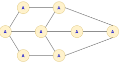

## Partha Pratim Das

## Module 38

Partha Pratim

Das

Objectives &amp; Outline

Data Structure

Non-linear Data

Structures

Graph

Tree

Hash Table

Binary Search Tree

Build a BST

Search a Key

Comparison

Module Summary

## Non-linear Data Structures (4): Tree

- Tree : Is a connected acyclic graph representing hierarchical relationship
- A tree may be:
- Rooted or Unrooted
- Binary or n-ary
- Balanced or Unbalanced
- Disconnected (forest) or Connected
- and so on
- Examples of a tree include:
- Composite Attributes
- Family Genealogy
- Search Trees
- and so on

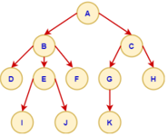

## Module 38

Partha Pratim

Das

Objectives &amp;

Outline

Data Structure

Non-linear Data

Structures

Graph

Tree

Hash Table

Binary Search Tree

Build a BST

Search a Key

Comparison

Module Summary

## Non-linear Data Structures (5): Tree

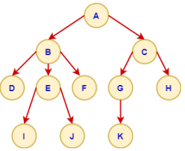

- Root : The node at the top of the tree is called root. There is only one root per tree and one path from the root node to any node. A is the root node.
- Parent : The node which is a predecessor of any node is called parent node. In the given tree, B is the parent of E . Every node, except the Root, has a unique parent
- Child : A node which is the descendant of a node: D , E and F are the child nodes of B
- Leaf : A node which does not have any child node: I , J and K are leaf nodes

## Module 38

Partha Pratim

Das

Objectives &amp; Outline

Data Structure

Non-linear Data

Structures

Graph

Tree

Hash Table

Binary Search Tree

Build a BST

Search a Key

Comparison

Module Summary

## Non-linear Data Structures (6): Tree

- Internal Nodes : The node which has at least one child is called internal Node
- Subtree : Subtree represents the tree rooted at that node
- Path : Path refers to the sequence of nodes along the edges of a tree
- Siblings : Nodes having the same parents: D , E and F are the siblings.
- Arity : Number of children of a node. B has arity 3, E has arity 2, G has arity 1, and D has arity 0 ( Leaf )

Maximum arity of a node is defined as the arity of the tree.

Partha Pratim Das

## Module 38

Partha Pratim

Das

Objectives &amp;

Outline

Data Structure

Non-linear Data

Structures

Graph

Tree

Hash Table

Binary Search

Tree

Build a BST

Search a Key

Comparison

Module Summary

## Non-linear Data Structures (7): Tree

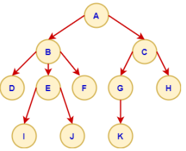

- Levels : The root node is said to be at Level 0 and the children of the root node are at Level 1 and the children of the nodes which are at Level 1 will be at Level 2 and so on.
- Level is the length of the path (number of links) or distance of a node from the root node. So, level of A is 0, level of C is 1, level of G is 2, and level of J is 3.
- Height : Maximum level in a tree
- Binary Tree : is a tree, where each node can have at most 2 children. It has arity 2.

## Module 38

Partha Pratim Das

Objectives &amp; Outline

Data Structure

Non-linear Data Structures

Graph

Tree

Hash Table

Binary Search Tree

Build a BST

Search a Key

Comparison

Module Summary

## Non-linear Data Structures (8): Tree

- Fact 1 : A tree with n nodes has n -1 edges
- Fact 2 : The maximum number of nodes at level l of a binary tree is 2 l .
- Fact 3 : If h is the height of a binary tree of n nodes, then:
- h +1 ≤ n ≤ 2 h +1 -1
- ⌈ lg( n +1) ⌉ -1 ≤ h ≤ n -1
- O (lg n ) ≤ h ≤ O ( n )
- For a k -ary tree, O (lg k n ) ≤ h ≤ O ( n )

## Module 38

Partha Pratim Das

Objectives &amp; Outline

Data Structure

Non-linear Data

Structures

Graph

Tree

Hash Table

Binary Search Tree

Build a BST

Search a Key

Comparison

Module Summary

## Non-linear Data Structures (9): Hash Table (Module 44)

- Hash Table (Hash Map) : implements an associative array abstract data type, a structure that can map keys to values by using a hash function to compute an index (hash code), into an array of buckets or slots, from which the desired value can be found
- A hash table may be using:
- Examples of a hash table include:
- Static or Dynamic Schemes
- Open Addressing
- 2-Choice Hashing
- and so on

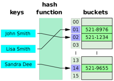

Database Management Systems

- Associative arrays
- Database indexing
- Caches
- and so on Partha Pratim Das

## Module 38

Partha Pratim Das

Objectives &amp; Outline

Data Structure

Non-linear Data Structures

Graph

Tree

Hash Table

Binary Search Tree

Build a BST

Search a Key

Comparison

Module Summary

## Binary Search Tree

## Binary Search Tree

## Module 38

Partha Pratim Das

Objectives &amp; Outline

Data Structure

Non-linear Data Structures

Graph

Tree

Hash Table

## Binary Search Tree

Build a BST

Search a Key

Comparison

Module Summary

## Binary Search and Binary Search Tree

- During the study of linear data structure, we observed that
- Binary search is efficient in search of a key: O (lg n ). However,
- ▷ it needs to be performed on a sorted array, and
- ▷ the array makes insertion and deletion expensive at O ( n )
- The linked list, on the other hand is efficient in insertion and deletion at O (1), while it makes the search expensive at O ( n ).
- ▷ O (1) insert / delete is possible because we just need to manipulate pointers and not physically move data
- Using the non-linearity, specifically (binary) trees, we can combine the benefits of both
- Note that once an array is sorted, we know the order in which its elements may be checked (for any key) during a search
- As the binary search splits the array, we can conceptually consider the Middle Element to be the Root of a tree and the left (right) sub-array to be its left (right) sub-tree
- Progressing recursively, we have a Binary Search Tree

Partha Pratim Das

## Module 38

Partha Pratim Das

Objectives &amp; Outline

Data Structure

Non-linear Data Structures

Graph

Tree

Hash Table

## Binary Search Tree

Build a BST

Search a Key

Comparison

Module Summary

## Binary Search and Binary Search Tree

| 10   | 12   | 14   | 17   | 19   | 22   | 25   |
|------|------|------|------|------|------|------|
| LL   | L    | LR   | M    | RL   | R    | RR   |

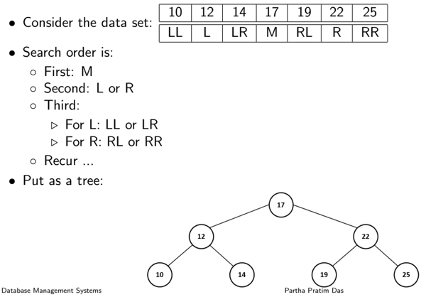

38.18

Module 38

Partha Pratim

Das

Objectives &amp;

Outline

Data Structure

Non-linear Data

Structures

Graph

Tree

Hash Table

Binary Search

Tree

Build a BST

Search a Key

Comparison

Module Summary

## Binary Search Tree

- Binary Search Tree (BST) : Is a tree in which all the nodes hold the following:
- The value of each node in the left sub-tree is less than the value of its root
- The value of each node in the right sub-tree is greater than the value of its root
- Structure of BST node : Each node consists of an element ( X ), and a link to the left child or the left subtree ( LC ), and a link to the right child or the right subtree ( RC )

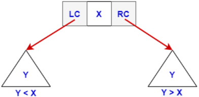

Module 38

Partha Pratim

Das

Objectives &amp;

Outline

Data Structure

Non-linear Data

Structures

Graph

Tree

Hash Table

Binary Search

Tree

Build a BST

Search a Key

Comparison

Module Summary

## Binary Search Tree (2)

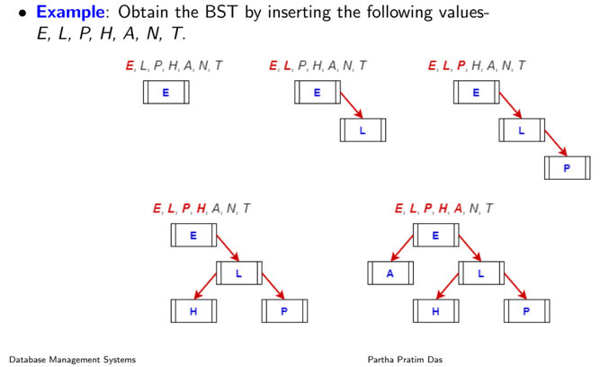

38.20

Module 38

Partha Pratim

Das

Objectives &amp;

Outline

Data Structure

Non-linear Data

Structures

Graph

Tree

Hash Table

Binary Search

Tree

Build a BST

Search a Key

Comparison

Module Summary

## Binary Search Tree (3)

- Example : Obtain the BST by inserting the following valuesE, L, P, H, A, N, T .

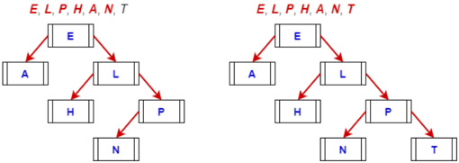

## Module 38

Partha Pratim Das

Objectives &amp; Outline

Data Structure

Non-linear Data Structures

Graph

Tree

Hash Table

Binary Search Tree

Build a BST

Search a Key

Comparison

Module Summary

## Searching a key in BST

search(root, key)

1. Compare the key with the element at root.
2. 1.1. If the key is equal to root's element then
3. 1.1.1 Element found and return
4. 1.2. else if the key is lesser than the root's element
5. 1.2.1 search(root.lc) #search on the left subtree
6. 1.3 else: #if the key is greater than the root's element 1.3.1 search(root.rc) #search on the right subtree

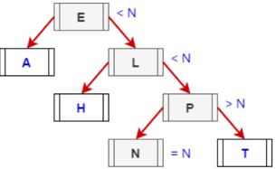

Partha Pratim Das

## Module 38

Partha Pratim Das

Objectives &amp; Outline

Data Structure

Non-linear Data Structures

Graph

Tree

Hash Table

Binary Search Tree

Build a BST

Search a Key

Comparison

Module Summary

## Searching a key in BST (2)

- Searching a key in a BST is O ( h ), where h is the height of the key

## · Worst Case

- The BST is a skewed binary search tree (all the nodes except the leaf would have only one child)
- This can happen if keys are inserted in sorted order
- Height ( h ) of the BST having n elements becomes n -1
- Time complexity of search in BST becomes O ( n )

## · Best Case

- The BST is a balanced binary search tree
- This is possible if
- ▷ If keys are inserted in purely randomized order, Or
- ▷ If the tree is explicitly balanced after every insertion
- Height ( h ) of the binary search tree becomes lg n
- Time complexity of search in BST becomes O (lg n )

Module 38

Partha Pratim Das

Objectives &amp; Outline

Data Structure

Non-linear Data Structures

Graph

Tree

Hash Table

Binary Search Tree

Build a BST

Search a Key

Comparison

Module Summary

## Comparison of Linear and Non-Linear Data Structures

## Comparison of Linear and Non-Linear Data Structures

## Linear and Non-Linear Data Structures

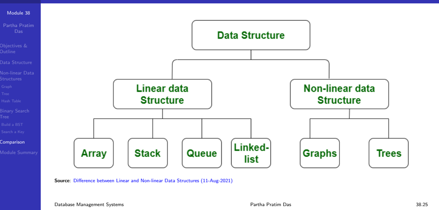

Module 38

Partha Pratim

Das

Objectives &amp;

Outline

Data Structure

Non-linear Data

Structures

Graph

Tree

Hash Table

Binary Search

Tree

Build a BST

Search a Key

Comparison

Module Summary

## Comparison of Linear and Non-Linear Data Structures

| Linear Data Structure                                                                                                       | Non-Linear Data Structure                                                                                                                                                        |
|-----------------------------------------------------------------------------------------------------------------------------|----------------------------------------------------------------------------------------------------------------------------------------------------------------------------------|
| • Data elements are arranged in a linear order where each and every elements are attached to its previous and next adjacent | • Data elements are arranged in hierar- chical or networked manner                                                                                                               |
| • Single level is involved                                                                                                  | • Multiple level are involved                                                                                                                                                    |
| • Implementation is easy in comparison to non-linear data structure                                                         | • Implementation is complex in compari- son to linear data structure                                                                                                             |
| • Data elements can be traversed in one way only                                                                            | • Data elements can be traversed in mul- tiple ways. Various traversals may be de- fined to linearize the data: Depth-First, Breadth-First, Inorder, Prepoder, Pos- torder, etc. |
| • Examples : array, stack, queue, linked list, and their variants                                                           | • Examples : trees, graphs, skip list, hash map, and several variants                                                                                                            |

## Partha Pratim Das

Module 38

Partha Pratim

Das

Objectives &amp;

Outline

Data Structure

Non-linear Data

Structures

Graph

Tree

Hash Table

Binary Search

Tree

Build a BST

Search a Key

Comparison

Module Summary

## Complexity of Common Data Structure Operations

|                        | Data Structure      | Time Complexity   | Time Complexity   | Time Complexity   | Time Complexity      | Time Complexity   | Time Complexity   | Time Complexity   | Time Complexity      | Space Complexity   |
|------------------------|---------------------|-------------------|-------------------|-------------------|----------------------|-------------------|-------------------|-------------------|----------------------|--------------------|
|                        |                     | Average           | Average           | Average           | Average              | Worst             | Worst             | Worst             | Worst                | Worst              |
|                        |                     | Access            | Search            |                   | Insertion   Deletion | Access            | Search            |                   | Insertion   Deletion |                    |
| Linear Data Structures | Array               | 0(1)              |                   |                   |                      | 0(1)              | O(n)              | O(n)              | O(n)                 | O(n)               |
| Linear Data Structures | Stack               | 0(n)              |                   | 0(1)              | 0(1)                 | O(n)              | O(n)              | 0(1)              | 0(1)                 | O(n)               |
| Linear Data Structures | [Queue              | 0(n)              |                   | 0(1)              | 0(1)                 | O(n)              | O(n)              | 0(1)              | 0(1)                 | O(n)               |
| Linear Data Structures | [singly-Linked List | 0(n)              | 0(n)              | 0(1)              | 0(1)                 | O(n)              | O(n)              | 0(1)              | 0(1)                 | O(n)               |
| Linear Data Structures | Doubly-Linked List  | 0(n)              | 0(n)              | 0(1)              | 0(1)                 | O(n)              | O(n)              | 0(1)              | 0(1)                 | O(n)               |
|                        | Skip List           | 0( log(n) )       | 0( log(n))        |                   | 0(log(n))            | O(n)              | O(n)              | O(n)              | O(n)                 | O(n log(n))        |
|                        | Hash Iable          |                   | 0(1)              | 0(1)              | 0(1)                 |                   | O(n)              | O(n)              | O(n)                 | O(n)               |
|                        | [Binary_Search Tree | 0( log(n) )       | 0( log(n))        | 0( log(n))        |                      | O(n)              | O(n)              | O(n)              | O(n)                 | O(n)               |
|                        | Cartesian Iree      | N/A               | 0( log(n)         | 0( log(n)         |                      | N/A               | O(n)              | O(n)              | O(n)                 | O(n)               |
|                        | B-Iree              | 0( log(n) )       | 0( log(n))        | O(log(n))         |                      |                   | O( log(n) )       | O( log(n) )       | O(log(n))            | O(n)               |
|                        | Red-Black Iree      |                   |                   |                   |                      | O(1og(n)          | 0(log(n)          | O(log(n)          | O(log(n))            | O(n)               |
|                        | Splay_Tree          | N/A               | O(log(n))         |                   |                      |                   | O(log(n))         | O(log(n))         | O(log(n))            | O(n)               |
|                        | AVL Iree            | @(log(n))         |                   | O(log(n)          | 0(1og(n)             | O(log(n))         | O(log(n)          | O(log(n)          | O(log(n)             | O(n)               |
|                        | KD Iree             |                   |                   |                   | O(log(n))            | O(n)              | O(n)              | O(n)              | O(n)                 | O(n)               |

Source

: Know Thy Complexities! (06-Apr-2021)

Database Management Systems

## Partha Pratim Das

## Module 38

Partha Pratim Das

Objectives &amp; Outline

Data Structure

Non-linear Data Structures

Graph

Tree

Hash Table

Binary Search Tree

Build a BST

Search a Key

Comparison

Module Summary

## Module Summary

- Introduced Non-linear Data Structures - graph, tree, hash table
- Studied Binary Search Tree as an adaptation of binary search
- Compared Linear and Non-Linear Data Structures

Slides used in this presentation are borrowed from http://db-book.com/ with kind permission of the authors.

Edited and new slides are marked with 'PPD'.

Partha Pratim Das