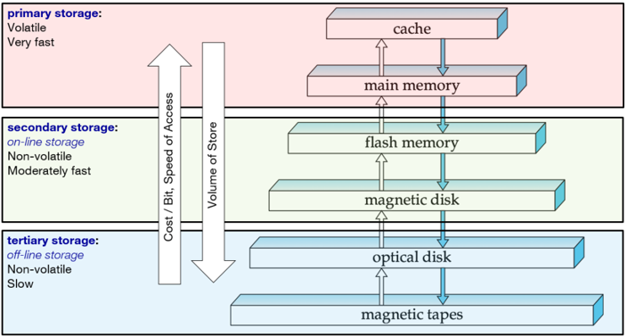
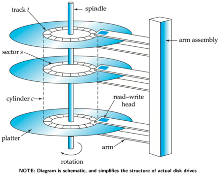
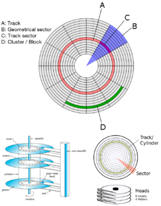
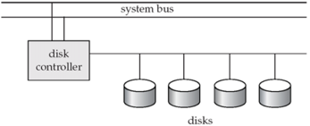

## Module 39

Partha Pratim Das

Objectives &amp; Outline

Physical Storage Flash memory Magnetic Disk Optical Storage Tape Storage Storage Hierarchy

Magnetic Disk

Magnetic Tapes

Cloud Storage

Cloud vs. Storage

Other Storage

Optical Disk

Flash Drives

SD &amp; SSD

Future of Storage DNA Digital Quantum Memory

Module Summary

Database Management Systems

## Database Management Systems

Module 39: Storage and File Structure/1: Physical Storage

## Partha Pratim Das

Department of Computer Science and Engineering Indian Institute of Technology, Kharagpur ppd@cse.iitkgp.ac.in

Partha Pratim Das

## Module 39

Partha Pratim Das

## Objectives &amp; Outline

Physical Storage

Flash memory

Magnetic Disk

Optical Storage

Tape Storage

Storage Hierarchy

Magnetic Disk

Magnetic Tapes

Cloud Storage

Cloud vs. Storage

Other Storage

Optical Disk

Flash Drives

SD &amp; SSD

Future of Storage DNA Digital Quantum Memory

Module Summary

## Module Recap

- Introduced Non-linear Data Structures - graph, tree, hash table
- Studied Binary Search Tree as an adaptation of binary search
- Compared Linear and Non-Linear Data Structures

## Module 39

Partha Pratim Das

## Objectives &amp; Outline

Physical Storage Flash memory Magnetic Disk Optical Storage Tape Storage Storage Hierarchy

Magnetic Disk

Magnetic Tapes

Cloud Storage

Cloud vs. Storage

Other Storage

Optical Disk Flash Drives SD &amp; SSD

Future of Storage DNA Digital Quantum Memory

Module Summary

## Module Objectives

- Introduce various Physical Storage Media for high volume, fast, reliable and inexpensive options for data storage for databases
- To understand the options of Tertiary Storage for high volume, inexpensive backup options

## Module 39

Partha Pratim Das

## Objectives &amp; Outline

Physical Storage

Flash memory

Magnetic Disk

Optical Storage

Tape Storage

Storage Hierarchy

Magnetic Disk

Magnetic Tapes

Cloud Storage

Cloud vs. Storage

Other Storage

Optical Disk

Flash Drives

SD &amp; SSD

Future of Storage DNA Digital Quantum Memory

Module Summary

## Module Outline

- Physical Storage Media
- Magnetic Disks
- Magnetic Tape
- Other Storage
- Future of Storage

## Module 39

Partha Pratim Das

Objectives &amp; Outline

Physical Storage

Flash memory

Magnetic Disk

Optical Storage

Tape Storage

Storage Hierarchy

Magnetic Disk

Magnetic Tapes

Cloud Storage

Cloud vs. Storage

Other Storage

Optical Disk

Flash Drives

SD &amp; SSD

Future of Storage DNA Digital Quantum Memory

Module Summary

## Physical Storage Media

## Physical Storage Media

## Module 39

Partha Pratim Das

Objectives &amp; Outline

Physical Storage

Flash memory

Magnetic Disk

Optical Storage

Tape Storage

Storage Hierarchy

Magnetic Disk

Magnetic Tapes

Cloud Storage

Cloud vs. Storage

Other Storage

Optical Disk

Flash Drives

SD &amp; SSD

Future of Storage

DNA Digital Quantum Memory

Module Summary

## Classification of Physical Storage Media

- Speed with which data can be accessed
- Cost per unit of data
- Reliability
- data loss on power failure or system crash
- physical failure of the storage device
- Can differentiate storage into:
- volatile storage : loses contents when power is switched off
- non-volatile storage :
- ▷ Contents persist even when power is switched off
- ▷ Includes secondary and tertiary storage, as well as battery-backed up main-memory

## Module 39

Partha Pratim Das

Objectives &amp; Outline

## Physical Storage

Flash memory

Magnetic Disk

Optical Storage

Tape Storage

Storage Hierarchy

Magnetic Disk

Magnetic Tapes

Cloud Storage

Cloud vs. Storage

Other Storage

Optical Disk

Flash Drives

SD &amp; SSD

Future of Storage DNA Digital Quantum Memory

Module Summary

## Physical Storage Media

## · Cache

- fastest and most costly form of storage
- volatile
- managed by the computer system hardware

## · Main memory

- fast access (10's to 100's of nanoseconds (ns); 1 ns = 10 -9 seconds)
- generally too small (or too expensive) to store the entire database
- ▷ capacities of up to a few Gigabytes widely used currently
- ▷ Capacities have gone up and per-byte costs have decreased steadily and rapidly (roughly factor of 2 every 2 to 3 years)

## · Volatile

- contents of main memory are usually lost if a power failure or system crash occurs

## Partha Pratim Das

## Module 39

Partha Pratim Das

Objectives &amp; Outline

Physical Storage

Flash memory

Magnetic Disk

Optical Storage

Tape Storage

Storage Hierarchy

Magnetic Disk

Magnetic Tapes

Cloud Storage

Cloud vs. Storage

Other Storage Optical Disk Flash Drives SD &amp; SSD

Future of Storage

DNA Digital Quantum Memory

Module Summary

## Physical Storage Media (2): Flash memory

- Data survives power failure
- Data can be written at a location only once, but location can be erased and written to again
- Can support only a limited number (10K - 1M) of write/erase cycles
- Erasing of memory has to be done to an entire bank of memory
- Reads are roughly as fast as main memory
- But writes are slow (few microseconds), erase is slower
- Widely used in embedded devices such as digital cameras, phones, and USB keys

Module 39

Partha Pratim Das

Objectives &amp; Outline

Physical Storage Flash memory

Magnetic Disk

Optical Storage

Tape Storage

Storage Hierarchy

Magnetic Disk

Magnetic Tapes

Cloud Storage

Cloud vs. Storage

Other Storage

Optical Disk

Flash Drives

SD &amp; SSD

Future of Storage

DNA Digital Quantum Memory

Module Summary

## Physical Storage Media (3): Magnetic Disk

- Data is stored on spinning disk, and read/written magnetically
- Primary medium for the long-term storage of data
- typically stores entire database
- Data must be moved from disk to main memory for access, and written back for storage - much slower access than main memory
- direct-access
- possible to read data on disk in any order, unlike magnetic tape
- Capacities range up to roughly 16-32 TB
- Much larger capacity and much lower cost/byte than main memory/flash memory
- Growing constantly and rapidly with technology improvements (factor of 2 to 3 every 2 years)
- Survives power failures and system crashes
- disk failure can destroy data, but is rare

## Module 39

Partha Pratim Das

Objectives &amp; Outline

Physical Storage

Flash memory

Magnetic Disk

Optical Storage

Tape Storage

Storage Hierarchy

Magnetic Disk

Magnetic Tapes

Cloud Storage Cloud vs. Storage

Other Storage

Optical Disk

Flash Drives

SD &amp; SSD

Future of Storage DNA Digital Quantum Memory

Module Summary

## Physical Storage Media (4): Optical Storage

- non-volatile, data is read optically from a spinning disk using a laser
- CD-ROM (640 MB) and DVD (4.7 to 17 GB) most popular forms
- Blu-ray disks: 27 GB to 54 GB
- Write-one, read-many (WORM) optical disks used for archival storage (CD-R, DVD-R, DVD+R)
- Multiple write versions also available (CD-RW, DVD-RW, DVD+RW, and DVD-RAM)
- Reads and writes are slower than with magnetic disk
- Juke-box systems, with large numbers of removable disks, a few drives, and a mechanism for automatic loading/unloading of disks available for storing large volumes of data

## Module 39

Partha Pratim Das

Objectives &amp; Outline

Physical Storage

Flash memory

Magnetic Disk

Optical Storage

Tape Storage

Storage Hierarchy

Magnetic Disk

Magnetic Tapes

Cloud Storage

Cloud vs. Storage

Other Storage

Optical Disk

Flash Drives

SD &amp; SSD

Future of Storage DNA Digital Quantum Memory

Module Summary

## Physical Storage Media (5): Tape Storage

- non-volatile, used primarily for backup (to recover from disk failure), and for archival data
- sequential-access
- much slower than disk
- very high capacity (40 to 300 TB tapes available)
- tape can be removed from drive storage costs much cheaper than disk, but drives are expensive
- Tape jukeboxes available for storing massive amounts of data
- hundreds of terabytes (TB) (1 TB = 10 12 bytes) to even multiple petabytes (PB) (1 PB = 10 15 bytes)

Module 39

Partha Pratim

Das

Objectives &amp;

Outline

Physical Storage

Flash memory

Magnetic Disk

Optical Storage

Tape Storage

Storage Hierarchy

Magnetic Disk

Magnetic Tapes

Cloud Storage

Cloud vs. Storage

Other Storage

Optical Disk

Flash Drives

SD &amp; SSD

Future of Storage

DNA Digital

Quantum Memory

Module Summary

## Storage Hierarchy

Database Management Systems

Partha Pratim Das

## Module 39

Partha Pratim Das

Objectives &amp; Outline

Physical Storage

Flash memory

Magnetic Disk

Optical Storage

Tape Storage

Storage Hierarchy

Magnetic Disk

Magnetic Tapes

Cloud Storage Cloud vs. Storage

Other Storage

Optical Disk

Flash Drives

SD &amp; SSD

Future of Storage DNA Digital Quantum Memory

Module Summary

## Magnetic Disk

## Magnetic Disk

Module 39

Partha Pratim

Das

Objectives &amp;

Outline

Physical Storage

Flash memory

Magnetic Disk

Optical Storage

Tape Storage

Storage Hierarchy

Magnetic Disk

Magnetic Tapes

Cloud Storage

Cloud vs. Storage

Other Storage

Optical Disk

Flash Drives

SD &amp; SSD

Future of Storage

DNA Digital

Quantum Memory

Module Summary

## Magnetic Disk: Mechanism

Database Management Systems

Partha Pratim Das

## Module 39

Partha Pratim Das

Objectives &amp; Outline

Physical Storage Flash memory Magnetic Disk Optical Storage Tape Storage Storage Hierarchy

Magnetic Disk

Magnetic Tapes

Cloud Storage

Cloud vs. Storage

Other Storage

Optical Disk

Flash Drives

SD &amp; SSD

Future of Storage DNA Digital Quantum Memory

Module Summary

## Magnetic Disk (2): Mechanism

- Read-write head
- Positioned very close to the platter surface
- Reads or writes magnetically encoded information
- Surface of platter divided into circular tracks
- Over 50K-100K tracks per platter on typical hard disks
- Each track is divided into sectors
- A sector is the smallest unit of data read or written
- Sector size typically 512 bytes
- Sectors / track: 500 to 1k (inner) to 1k to 2k (outer)
- To read/write a sector
- disk arm swings to position head on right track
- platter spins: Read/Write as sector passes under head
- Head-disk assemblies
- multiple disk platters on a single spindle (1 to 5 usually)
- one head per platter, mounted on a common arm.
- Cylinder i consists of i th track of all the platters

## Database Management Systems

## Partha Pratim Das

## Module 39

Partha Pratim Das

Objectives &amp; Outline

Physical Storage Flash memory Magnetic Disk Optical Storage Tape Storage Storage Hierarchy

Magnetic Disk

Magnetic Tapes

Cloud Storage

Cloud vs. Storage

Other Storage Optical Disk Flash Drives SD &amp; SSD

Future of Storage DNA Digital Quantum Memory

Module Summary

## Magnetic Disks (3): Disk Controller, Subsystems, and Interfaces

- Disk Controller : interfaces between the computer system and the disk drive hardware
- Accepts high-level commands to read or write a sector
- Initiates actions moving the disk arm to the right track, reading or writing the data
- Computes and attaches checksums to each sector to verify that correct read back
- Ensures successful writing by reading back sector after writing it
- Performs remapping of bad sectors
- Disk Subsystem :
- Disk Interface Standards Families : ATA, SATA, SCSI, SAS, several variants
- Storage Area Networks (SAN) connects disks by a high-speed network to a number of servers
- Network Attached Storage (NAS) provides a file system interface using networked file system protocol Database Management Systems Partha Pratim Das 39.16

Module 39

Partha Pratim Das

Objectives &amp; Outline

Physical Storage

Flash memory

Magnetic Disk

Optical Storage

Tape Storage

Storage Hierarchy

Magnetic Disk

Magnetic Tapes

Cloud Storage

Cloud vs. Storage

Other Storage

Optical Disk

Flash Drives

SD &amp; SSD

Future of Storage DNA Digital Quantum Memory

Module Summary

## Magnetic Disks (4): Performance Measures

- Access Time : time from a read or write request issue to start of data transfer:
- Seek Time : time to reposition the arm over the correct track
- ▷ Avg. seek time is 1/2 the worst case seek time; 1/3 if all tracks have same number of sectors
- ▷ 4 to 10 milliseconds on typical disks
- Rotational Latency : time for the sector to be accessed to appear under the head
- ▷ Average latency is 1/2 of the worst case latency
- ▷ 4 to 11 milliseconds on typical disks (5400 to 15000 rpm)
- Data-transfer Rate : the rate at which data can be retrieved from or stored to the disk
- 25 to 100 MB per second max rate, lower for inner tracks
- Multiple disks may share a controller, so rate that controller can handle is also important
- Mean Time To Failure (MTTF) : Avg. time the disk is expected to run continuously without any failure
- Typically 3 to 5 years
- Probability of failure of new disks is quite low, corresponding to a theoretical MTTF of 500,000 to 1,200,000 hours for a new disk. For example, an MTTF of 1,200,000 hours for a new disk means that given 1000 relatively new disks, on an average one will fail every 1200 hours
- MTTF decreases as disk ages

Partha Pratim Das

## Module 39

Partha Pratim Das

Objectives &amp; Outline

Physical Storage

Flash memory

Magnetic Disk

Optical Storage

Tape Storage

Storage Hierarchy

Magnetic Disk

Magnetic Tapes

Cloud Storage

Cloud vs. Storage

Other Storage

Optical Disk

Flash Drives

SD &amp; SSD

Future of Storage DNA Digital Quantum Memory

Module Summary

## Magnetic Tapes

## Magnetic Tapes

Module 39

Partha Pratim Das

Objectives &amp; Outline

Physical Storage

Flash memory

Magnetic Disk

Optical Storage

Tape Storage

Storage Hierarchy

Magnetic Disk

Magnetic Tapes

Cloud Storage

Cloud vs. Storage

Other Storage

Optical Disk

Flash Drives

SD &amp; SSD

Future of Storage

DNA Digital

Quantum Memory

Module Summary

## Magnetic Tapes

- Hold large volumes of data and provide high transfer rates
- Tape Formats
- ▷ Few GB for DAT (Digital Audio Tape) format
- ▷ 10-40 GB with DLT (Digital Linear Tape) format
- ▷ 100 GB+ with Ultrium format, and
- ▷ 330 GB with Ampex helical scan format
- Transfer rates from few to 10's of MB/s
- Tapes are cheap, but cost of drives is very high
- Very slow access time in comparison to magnetic and optical disks
- Limited to sequential access
- Some formats (Accelis) provide faster seek (10's of seconds) at cost of lower capacity
- Used mainly for backup, for storage of infrequently used information, and as an off-line medium for transferring information from one system to another.
- Tape jukeboxes used for very large capacity storage
- Multiple petabyes (10 15 bytes) Database Management Systems

Partha Pratim Das

39.19

## Module 39

Partha Pratim Das

Objectives &amp; Outline

Physical Storage

Flash memory

Magnetic Disk

Optical Storage

Tape Storage

Storage Hierarchy

Magnetic Disk

Magnetic Tapes

Cloud Storage

Cloud vs. Storage

Other Storage

Optical Disk

Flash Drives

SD &amp; SSD

Future of Storage

DNA Digital

Quantum Memory

Module Summary

## Cloud Storage

## Cloud Storage

## Module 39

Partha Pratim Das

Objectives &amp; Outline

Physical Storage Flash memory Magnetic Disk Optical Storage Tape Storage Storage Hierarchy

Magnetic Disk

Magnetic Tapes

## Cloud Storage

Cloud vs. Storage

Other Storage

Optical Disk

Flash Drives

SD &amp; SSD

Future of Storage DNA Digital Quantum Memory

Module Summary

## Cloud Storage

- Cloud storage is purchased from a third-party cloud vendor who owns and operates data storage capacity and delivers it over the Internet in a pay-as-you-go model
- These cloud storage vendors manage capacity, security and durability to make data accessible to applications all around the world
- Applications access cloud storage through traditional storage protocols or directly via an API
- Many vendors offer complementary services designed to help collect, manage, secure and analyze data at massive scale. Various available options for cloud storage are:
- Google Drive
- Amazon Drive
- OneDrive by Microsoft
- Evernote
- Dropbox
- and so on

Module 39

Partha Pratim

Das

Objectives &amp;

Outline

Physical Storage

Flash memory

Magnetic Disk

Optical Storage

Tape Storage

Storage Hierarchy

Magnetic Disk

Magnetic Tapes

Cloud Storage

Cloud vs. Storage

Other Storage

Optical Disk

Flash Drives

SD &amp; SSD

Future of Storage

DNA Digital

Quantum Memory

Module Summary

## Cloud Storage vs. Traditional Storage

| Parameters       | Cloud Storage                                                                                                                                                                                                       | Traditional Storage                                                                                                                  |
|------------------|---------------------------------------------------------------------------------------------------------------------------------------------------------------------------------------------------------------------|--------------------------------------------------------------------------------------------------------------------------------------|
| Cost             | Cloud storage is cheaper per GB than using external drives.                                                                                                                                                         | The hardware and infrastructure costs are high and adding on more space and upgrading only adds extra costs.                         |
| Reliability      | Cloud storage is highly reliable as it takes less time to get under function- ing                                                                                                                                   | Traditional storage requires high initial effort and is less reliable.                                                               |
| File Sharing     | Cloud storage supports file sharing dynamically as it can be shared any- where with network access                                                                                                                  | Traditional storage requires physical drives to share data and a network is to be established between both                           |
| Accessibility    | Cloud storage gives you access to your files from anywhere                                                                                                                                                          | Restricted to local access                                                                                                           |
| Backup/ Recovery | Very safe from on site disaster. In case of a hard drive failure or other hardware malfunction, you can ac- cess your files on the cloud, which acts as a backup solution for your local storage on physical drives | Data that is stored locally is much more susceptible to unexpected events and lo- cal storage and local backups could be easily lost |

## Partha Pratim Das

## Module 39

Partha Pratim Das

Objectives &amp; Outline

Physical Storage

Flash memory

Magnetic Disk

Optical Storage

Tape Storage

Storage Hierarchy

Magnetic Disk

Magnetic Tapes

Cloud Storage Cloud vs. Storage

Other Storage

Optical Disk

Flash Drives

SD &amp; SSD

Future of Storage DNA Digital Quantum Memory

Module Summary

## Other Storage

## Other Storage

## Module 39

Partha Pratim Das

Objectives &amp; Outline

Physical Storage

Flash memory

Magnetic Disk

Optical Storage

Tape Storage

Storage Hierarchy

Magnetic Disk

Magnetic Tapes

Cloud Storage

Cloud vs. Storage

Other Storage

Optical Disk

Flash Drives

SD &amp; SSD

Future of Storage

DNA Digital Quantum Memory

Module Summary

## Optical Disks

- Compact disk-read only memory (CD-ROM)
- Removable disks, 640 MB per disk
- Seek time about 100 msec (optical read head is heavier and slower)
- Higher latency (3000 RPM) and lower data-transfer rates (3-6 MB/s) compared to magnetic disks
- Digital Video Disk (DVD)
- DVD-5 holds 4.7 GB , and DVD-9 holds 8.5 GB
- DVD-10 and DVD-18 are double sided formats with capacities of 9.4 GB and 17 GB
- Blu-ray DVD: 27 GB (54 GB for double sided disk)
- Slow seek time, for same reasons as CD-ROM
- Record once versions (CD-R and DVD-R) are popular
- data can only be written once, and cannot be erased.
- high capacity and long lifetime; used for archival storage
- Multi-write versions (CD-RW, DVD-RW, DVD+RW and DVD-RAM) also available

Database Management Systems

Partha Pratim Das

39.24

## Module 39

Partha Pratim Das

Objectives &amp; Outline

Physical Storage Flash memory Magnetic Disk Optical Storage Tape Storage Storage Hierarchy

Magnetic Disk

Magnetic Tapes

Cloud Storage Cloud vs. Storage

Other Storage Optical Disk

Flash Drives

SD &amp; SSD

Future of Storage DNA Digital Quantum Memory

Module Summary

## Flash Drives

- Flash drives are often referred to as pen drives, thumb drives, or jump drives. They have completely replaced floppy drives for portable storage. Considering how large and inexpensive they have become, they have nearly replaced CDs and DVDs for data storage purposes.
- USB flash drives are removable and rewritable storage devices that, as the name suggests, require a USB port for connection and utilizes non-volatile flash memory technology.
- The storage space in USB flash drives is quite large with sizes ranging from 128MB to 2TB.
- The USB standard a flash drive is built around will determine the number of things about its potential performance, including maximum transfer rate.

Module 39

Partha Pratim Das

Objectives &amp; Outline

Physical Storage

Flash memory

Magnetic Disk

Optical Storage

Tape Storage

Storage Hierarchy

Magnetic Disk

Magnetic Tapes

Cloud Storage

Cloud vs. Storage

Other Storage Optical Disk Flash Drives SD &amp; SSD

Future of Storage

DNA Digital Quantum Memory

Module Summary

## Secure Digital Cards (SD cards)

- A Secure Digital (SD, in short) card is a type of removable memory card used to read and write large quantities of data.
- Due to their relatively small size, SD cards are widely used in mobile electronics, cameras, smart devices, video game consoles, and more.
- There are several types of SD cards sold and used today:

| Card Type   |   Year of Debut | Capacity     | Supported Devices                            |
|-------------|-----------------|--------------|----------------------------------------------|
| SD          |            1996 | 128MB to 2GB | All host devices that support SD, SDHC, SDXC |
| SDHC        |            2006 | 4GB to 32GB  | All host devices that support SDHC, SDXC     |
| SDXC        |            2009 | 64GB to 2TB  | All host devices that support SDXC           |

| Card Type   | Capacity     | File System   | Remarks                                         |
|-------------|--------------|---------------|-------------------------------------------------|
| SD          | 128MB to 2GB | FAT16         | FAT16 supports 16 MB to 2 GB                    |
| SDHC        | 4GB to 32GB  | FAT32         | FAT32 can be support up to 16 TB                |
| SDXC        | 64GB to 2TB  | exFAT         | exFAT is non-standard, supports file up to 4 GB |

Source

: CARDS - WHAT ARE THE DIFFERENCES BETWEEN FAT16, FAT32 AND EXFAT FILE SYSTEMS?

Database Management Systems

Partha Pratim Das

## Module 39

Partha Pratim Das

Objectives &amp; Outline

Physical Storage

Flash memory

Magnetic Disk

Optical Storage

Tape Storage

Storage Hierarchy

Magnetic Disk

Magnetic Tapes

Cloud Storage

Cloud vs. Storage

Other Storage

Optical Disk

Flash Drives

SD &amp; SSD

Future of Storage

DNA Digital Quantum Memory

Module Summary

## Flash Storage

- NOR flash vs NAND flash
- NAND flash
- used widely for storage, since it is much cheaper than NOR flash
- requires page-at-a-time read (page: 512 bytes to 4 KB)
- transfer rate around 20 MB/sec
- solid state disks : Use multiple flash storage devices to provide higher transfer rate of 100 to 200 MB/sec
- erase is very slow (1 to 2 ms)
- ▷ erase block contains multiple pages
- ▷ remapping of logical page addresses to physical page addresses avoids waiting for erase
- -translation table tracks mapping
- -also stored in a label field of flash page
- -remapping carried out by flash translation layer
- ▷ after 100,000 to 1,000,000 erases, erase block becomes unreliable and cannot be used
- -wear leveling

Partha Pratim Das

## Module 39

Partha Pratim Das

Objectives &amp; Outline

Physical Storage Flash memory Magnetic Disk Optical Storage Tape Storage Storage Hierarchy

Magnetic Disk

Magnetic Tapes

Cloud Storage Cloud vs. Storage

Other Storage

Optical Disk

Flash Drives

SD &amp; SSD

Future of Storage

DNA Digital Quantum Memory

Module Summary

## Solid-State Drives (SSD)

- SSDs replace traditional mechanical hard disks by using flash-based memory, which is significantly faster.
- SSDs speed up computers significantly due to their low read-access times and fast throughput.
- The idea of SSDs was introduced in 1978. It was implemented using semiconductors. It stores the data in the persistent state even when no power is supplied.
- The speed of SSD is much larger than that of HDD as it reads/writes data at higher input-output per second.
- Unlike HDDs, SSDs do not include any moving parts. SDDs can resist vibrations and high temperatures.

Module 39

Partha Pratim

Das

Objectives &amp;

Outline

Physical Storage

Flash memory

Magnetic Disk

Optical Storage

Tape Storage

Storage Hierarchy

Magnetic Disk

Magnetic Tapes

Cloud Storage

Cloud vs. Storage

Other Storage

Optical Disk

Flash Drives

SD &amp; SSD

Future of Storage

DNA Digital

Quantum Memory

Module Summary

## SDD vs. HDD

| Parameters               | SSD                                   | HDD                                                    |
|--------------------------|---------------------------------------|--------------------------------------------------------|
| Technology               | Integrated circuit using Flash memory | Mechanical Parts, including spinning disks or platters |
| Access Time              | 0.1 ms                                | 5.5-8.0 ms                                             |
| Average Seek Time        | 0.08-0.16 ms                          | < 10 ms                                                |
| Speed (SATA II)          | 80-250 MB/sec                         | 65-85 MB/sec                                           |
| Random I/O Perfor- mance | 6000 io/s                             | 400 io/s                                               |
| Backup rates             | 6 hours                               | 20- 24 hours                                           |
| Reliability              | The failure rate of less than 0.5%    | Failure rate fluctuates between 2-5%                   |
| Energy Consumption       | 2 to 5 watts                          | 6 to 15 watts                                          |

## Module 39

Partha Pratim Das

Objectives &amp; Outline

Physical Storage

Flash memory

Magnetic Disk

Optical Storage

Tape Storage

Storage Hierarchy

Magnetic Disk

Magnetic Tapes

Cloud Storage

Cloud vs. Storage

Other Storage

Optical Disk

Flash Drives

SD &amp; SSD

Future of Storage

DNA Digital

Quantum Memory

Module Summary

## Future of Storage

## Future of Storage

Module 39

Partha Pratim Das

Objectives &amp; Outline

Physical Storage Flash memory Magnetic Disk Optical Storage Tape Storage Storage Hierarchy

Magnetic Disk

Magnetic Tapes

Cloud Storage Cloud vs. Storage

Other Storage Optical Disk Flash Drives SD &amp; SSD

Future of Storage

DNA Digital

Quantum Memory

Module Summary

## Future of Storage: DNA Digital Storage

- DNA digital data storage is the process of encoding and decoding binary data to and from synthesized strands of DNA.
- While DNA as a storage medium has enormous potential because of its high storage density, its practical use is currently severely limited because of its high cost and very slow read and write times.
- Digital storage systems encode the text, photos, or any other kind of information as a series of 0s and 1s. This same information can be encoded in DNA using the four nucleotides that make up the genetic code: A, T, G, and C. For example, G and C could be used to represent 0 while A and T represent 1.
- DNA has several other features that makes it desirable as a storage medium; it is extremely stable and is fairly easy (but expensive) to synthesize and sequence.
- Also, because of its high density - each nucleotide, equivalent to up to two bits, is about 1 cubic nanometer - an exabyte (10 18 bytes) of data stored as DNA could fit in the palm of your hand
- DNA Synthesis: A DNA synthesizer machine builds synthetic DNA strands matching the sequence of digital code.

Database Management Systems

Partha Pratim Das

## Module 39

Partha Pratim Das

Objectives &amp; Outline

Physical Storage Flash memory Magnetic Disk Optical Storage Tape Storage Storage Hierarchy

Magnetic Disk

Magnetic Tapes

Cloud Storage Cloud vs. Storage

Other Storage

Optical Disk

Flash Drives

SD &amp; SSD

Future of Storage DNA Digital Quantum Memory

Module Summary

## Future of Storage: Quantum Memory

- Quantum memory is the quantum-mechanical version of ordinary computer memory
- Whereas ordinary memory stores information as binary states (represented by '1's and '0's), quantum memory stores a quantum state for later retrieval
- These states hold useful computational information known as qubits
- Quantum memory is essential for the development of many devices in quantum information processing applications such as quantum network, quantum repeater, linear optical quantum computation or long-distance quantum communication
- Unlike the classical memory of everyday computers, the states stored in quantum memory can be in a quantum superposition, giving much more practical flexibility in quantum algorithms than classical information storage

## Module 39

Partha Pratim Das

Objectives &amp; Outline

Physical Storage

Flash memory

Magnetic Disk

Optical Storage

Tape Storage

Storage Hierarchy

Magnetic Disk

Magnetic Tapes

Cloud Storage

Cloud vs. Storage

Other Storage

Optical Disk

Flash Drives

SD &amp; SSD

Future of Storage DNA Digital Quantum Memory

Module Summary

## Module Summary

- Understood the range of Physical Storage Media
- Studied the mechanism and performance of the Magnetic Disks
- Looked at the features of Magnetic Tape as tertiary storage
- Glimpsed through Other Storage including Optical Disk, Flash and SSD
- Considered the Future of Storage in terms of DNA and Quantum

Slides used in this presentation are borrowed from http://db-book.com/ with kind permission of the authors.

Edited and new slides are marked with 'PPD'.

Partha Pratim Das