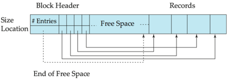
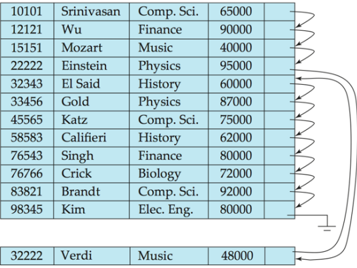

Module 40

Partha Pratim Das

Objectives &amp; Outline

File Organization

Fixed-Length Records

Free Lists

Variable-Length

Records

Organization of Records in Files

Sequential

Multi-Table

Data Dictionary Storage

Storage Access

Buffer Manager

Buffer Replacement

Policy

Module Summary

Database Management Systems

## Database Management Systems

Module 40: Storage and File Structure/2: File Structure

## Partha Pratim Das

Department of Computer Science and Engineering Indian Institute of Technology, Kharagpur ppd@cse.iitkgp.ac.in

Partha Pratim Das

## Module 40

Partha Pratim Das

## Objectives &amp; Outline

File Organization Fixed-Length Records Free Lists Variable-Length Records

Organization of Records in Files

Sequential

Multi-Table

Data Dictionary Storage

Storage Access Buffer Manager Buffer Replacement Policy

Module Summary

## Module Recap

- Understood the range of Physical Storage Media
- Studied the mechanism and performance of the Magnetic Disks
- Looked at the features of Magnetic Tape as tertiary storage
- Glimpsed through Other Storage including Optical Disk, Flash and SSD
- Considered the Future of Storage in terms of DNA and Quantum

## Module 40

Partha Pratim Das

## Objectives &amp; Outline

File Organization

Fixed-Length Records

Free Lists

Variable-Length Records

Organization of Records in Files

Sequential

Multi-Table

Data Dictionary Storage

Storage Access Buffer Manager Buffer Replacement Policy

Module Summary

## Module Objectives

- To familiarize with the organization for database files
- To understand how records and relations are organized in files
- To learn how databases keep their own information in Data-Dictionary Storage - the metadata database of a database
- To understand the mechanisms for fast access of a database store

## Module 40

Partha Pratim Das

## Objectives &amp; Outline

File Organization

Fixed-Length Records

Free Lists

Variable-Length Records

Organization of Records in Files

Sequential

Multi-Table

Data Dictionary Storage

Storage Access Buffer Manager Buffer Replacement Policy

Module Summary

## Module Outline

- File Organization
- Organization of Records in Files
- Data-Dictionary Storage
- Storage Access

Module 40

Partha Pratim Das

Objectives &amp; Outline

File Organization

Fixed-Length Records

Free Lists

Variable-Length Records

Organization of Records in Files

Sequential

Multi-Table

Data Dictionary Storage

Storage Access Buffer Manager Buffer Replacement Policy

Module Summary

## File Organization

## File Organization

## Module 40

Partha Pratim Das

Objectives &amp; Outline

File Organization

Fixed-Length Records

Free Lists

Variable-Length Records

Organization of Records in Files

Sequential

Multi-Table

Data Dictionary Storage

Storage Access Buffer Manager Buffer Replacement Policy

Module Summary

## File Organization

- A database is
- A collection of files . A file is
- ▷ A sequence of records . A record is
- -A sequence of fields
- One approach:
- assume record size is fixed
- each file has records of one particular type only
- different files are used for different relations
- This case is easiest to implement; will consider variable length records later
- A database file is partitioned into fixed-length storage units called blocks
- Blocks are units of both storage allocation and data transfer

## Module 40

Partha Pratim Das

Objectives &amp; Outline

File Organization

Fixed-Length Records

Free Lists

Variable-Length Records

## Organization of Records in Files

Sequential

Multi-Table

Data Dictionary Storage

Storage Access

Buffer Manager

Buffer Replacement

Policy

Module Summary

## Fixed-Length Records

- Simple approach:
- Store record i starting from byte n ∗ ( i -1), where n is the size of each record.
- Record access is simple but records may cross blocks
- ▷ Modification: do not allow records to cross block boundaries
- Deletion of record i: Alternatives:
- move records i + 1 , · · · , n to i , · · · , n -1
- move record n to i
- do not move records, but link all free records on a free list

| record 0   |   10101 | Srinivasan   | Comp. Sci   |   65000 |
|------------|---------|--------------|-------------|---------|
| record 1   |   12121 | Wu           | Finance     |   90000 |
| record 2   |   15151 | Mozart       | Music       |   40000 |
| record 3   |   22222 | Einstein     | Physics     |   95000 |
| record 4   |   32343 | El Said      | History     |   60000 |
| record 5   |   33456 | Gold         | Physics     |   87000 |
| record 6   |   45565 | Katz         | Comp. Sci   |   75000 |
| record 7   |   58583 | Califieri    | History     |   62000 |
| record 8   |   76543 | Singh        | Finance     |   80000 |
| record 9   |   76766 | Crick        | Biology     |   72000 |
| record 10  |   83821 | Brandt       | Comp: Sci   |   92000 |
| record 11  |   98345 | Kim          | Elec. Eng   |   80000 |

## Database Management Systems

## Partha Pratim Das

## Module 40

Partha Pratim Das

Objectives &amp; Outline

File Organization

Fixed-Length Records

Free Lists

Variable-Length

Records

Organization of Records in Files

Sequential

Multi-Table

Data Dictionary Storage

Storage Access

Buffer Manager

Buffer Replacement

Policy

Module Summary

## Deleting Record 3 with Compaction

## Before deletion

record 0

record 1

record 2

record 3

record 4

record 5

record 6

record 7

record 8

record 9

record 10

record 11

|   10101 | Srinivasan   | Comp: Sci.   | 65000   |
|---------|--------------|--------------|---------|
|   12121 | Wu           | Finance      |         |
|   15151 | Mozart       | Music        | 40000   |
|   22222 | Einstein     | Physics      | 95000   |
|   32343 | El Said      | History      | 60000   |
|   33456 | Gold         | Physics      | 87000   |
|   45565 | Katz         | Comp. Sci.   | 75000   |
|   58583 | Califieri    | History      | 62000   |
|   76543 | Singh        | Finance      | 80000   |
|   76766 | Crick        | Biology      | 72000   |
|   83821 | Brandt       | Comp. Sci.   | 92000   |
|   98345 | Kim          | Elec. Eng    | 80000   |

## After deletion &amp; Compaction

record 0 record 1 record 2 record 4 record 5 record 6 record 7 record 8 record 9 record 10 record 11

|   10101 | Srinivasan   | Comp. Sci_   |   65000 |
|---------|--------------|--------------|---------|
|   12121 | Wu           | Finance      |   90000 |
|   15151 | Mozart       | Music        |   40000 |
|   32343 | El Said      | History      |   60000 |
|   33456 | Gold         | Physics      |   87000 |
|   45565 | Katz         | Comp. Sci_   |   75000 |
|   58583 | Califieri    | History      |   62000 |
|   76543 | Singh        | Finance      |   80000 |
|   76766 | Crick        | Biology      |   72000 |
|   83821 | Brandt       | Comp: Sci    |   92000 |
|   98345 | Kim          | Elec. Eng    |   80000 |

## Partha Pratim Das

## Module 40

Partha Pratim Das

Objectives &amp; Outline

File Organization

Fixed-Length Records

Free Lists

Variable-Length

Records

Organization of

Records in Files

Sequential

Multi-Table

Data Dictionary Storage

Storage Access

Buffer Manager

Buffer Replacement

Policy

Module Summary

## Deleting Record 3 with Moving last record

## Before deletion

## After deletion &amp; Movement

| record 0   |   10101 | Srinivasan   | Comp. Sci.   | 65000   |
|------------|---------|--------------|--------------|---------|
| record 1   |   12121 | Wu           | Finance      | 90000   |
| record 2   |   15151 | Mozart       | Music        | 40000   |
| record 3   |   22222 | Einstein     | Physics      | 95000   |
| record 4   |   32343 | El Said      | History      | 60000   |
| record 5   |   33456 | Gold         | Physics      | 87000   |
| record 6   |   45565 | Katz         | Comp. Sci.   | 75000   |
| record 7   |   58583 | Califieri    | History      | 62000   |
| record 8   |   76543 | Singh        | Finance      |         |
| record 9   |   76766 | Crick        | Biology      | 72000   |
| record 10  |   83821 | Brandt       | Sci.         | 92000   |
| record 11  |   98345 | Kim          | Elec Eng     | 80000   |

record 0 record 1 record 2 record 11 record 4 record 5 record 6 record 7 record 8 record 9 record 10

|   10101 | Srinivasan   | Comp: Sci.   |   65000 |
|---------|--------------|--------------|---------|
|   12121 | Wu           | Finance      |   90000 |
|   15151 | Mozart       | Music        |   40000 |
|   98345 | Kim          | Elec. Eng    |   80000 |
|   32343 | El Said      | History      |   60000 |
|   33456 | Gold         | Physics      |   87000 |
|   45565 | Katz         | Comp. Sci.   |   75000 |
|   58583 | Califieri    | History      |   62000 |
|   76543 | Singh        | Finance      |   80000 |
|   76766 | Crick        | Biology      |   72000 |
|   83821 | Brandt       | Comp. Sci.   |   92000 |

## Partha Pratim Das

Module 40

Partha Pratim Das

Objectives &amp; Outline

File Organization Fixed-Length Records

Free Lists

Variable-Length

Records

Organization of

Records in Files

Sequential

Multi-Table

Data Dictionary

Storage

Storage Access

Buffer Manager

Buffer Replacement

Policy

Module Summary

## Free Lists

- Store the address of the first deleted record in the file header
- Use this first record to store the address of the second deleted record, and so on
- Consider these stored addresses as pointers since they point to the location of a record
- More space efficient representation: reuse space for normal attributes of free records to store pointers (No pointers stored in in-use records)

| header    |       |            |            |       |
|-----------|-------|------------|------------|-------|
| record 0  | 10101 | Srinivasan | Sci. Comp. | 65000 |
| record 1  |       |            |            |       |
| record 2  | 15151 | Mozart     | Music      | 40000 |
| record 3  | 22222 | Einstein   | Physics    | 95000 |
| record 4  |       |            |            |       |
| record 5  | 33456 | Gold       | Physics    | 87000 |
| record 6  |       |            |            |       |
| record 7  | 58583 | Califieri  | History    | 62000 |
| record 8  | 76543 | Singh      | Finance    |       |
| record 9  | 76766 | Crick      | Biology    | 72000 |
| record 10 | 83821 | Brandt     | Comp. Sci. | 92000 |
| record 11 | 98345 | Kim        | Elec. Eng  | 80000 |

Database Management Systems

Partha Pratim Das

Module 40

Partha Pratim Das

Objectives &amp; Outline

File Organization

Fixed-Length Records

Free Lists

Variable-Length Records

Organization of Records in Files

Sequential

Multi-Table

Data Dictionary Storage

Storage Access Buffer Manager Buffer Replacement Policy

Module Summary

## Variable-Length Records

- Variable-length records arise in database systems in several ways:
- Storage of multiple record types in a file
- Record types that allow variable lengths for one or more fields such as strings ( varchar )
- Record types that allow repeating fields (used in some older data models)
- Attributes are stored in order
- Variable length attributes represented by fixed size (offset, length), with actual data stored after all fixed length attributes
- Null values represented by null-value bitmap

Null bitmap (stored in 1 byte)

21, 5

Bytes 0

Database Management Systems

26, 10

36, 10

4

8

65000

12

10101

Srinivasan

Comp. Sci.

20 21

26

Partha Pratim Das

36

45

40.11

Module 40

Partha Pratim

Das

Objectives &amp;

Outline

File Organization

Fixed-Length Records

Free Lists

Variable-Length

Records

Organization of Records in Files

Sequential

Multi-Table

Data Dictionary Storage

Storage Access

Buffer Manager

Buffer Replacement

Policy

Module Summary

## Variable-Length Records (2)

- Slotted Page header contains:
- number of record entries
- end of free space in the block
- location and size of each record
- Records can be moved around within a page to keep them contiguous with no empty space between them; entry in the header must be updated
- Pointers should not point directly to record - instead they should point to the entry for the record in header

Database Management Systems

## Partha Pratim Das

Module 40

Partha Pratim Das

Objectives &amp; Outline

File Organization

Fixed-Length Records

Free Lists

Variable-Length

Records

Organization of Records in Files

Sequential

Multi-Table

Data Dictionary Storage

Storage Access Buffer Manager Buffer Replacement Policy

Module Summary

## Organization of Records in Files

## Organization of Records in Files

## Module 40

Partha Pratim Das

Objectives &amp; Outline

File Organization Fixed-Length Records Free Lists

Variable-Length Records

## Organization of Records in Files

Sequential

Multi-Table

Data Dictionary Storage

Storage Access Buffer Manager Buffer Replacement Policy

Module Summary

## Organization of Records in Files

- Heap : A record can be placed anywhere in the file where there is space
- Sequential : Store records in sequential order, based on the value of the search key of each record
- Hashing : A hash function computed on some attribute of each record; the result specifies in which block of the file the record should be placed
- Records of each relation may be stored in a separate file. In a multitable clustering file organization records of several different relations can be stored in the same file
- Motivation: store related records on the same block to minimize I/O

## Module 40

Partha Pratim Das

Objectives &amp; Outline

File Organization

Fixed-Length Records

Free Lists

Variable-Length

Records

Organization of Records in Files

Sequential

Multi-Table

Data Dictionary

Storage

Storage Access

Buffer Manager

Buffer Replacement

Policy

Module Summary

## Sequential File Organization

- Suitable for applications that require sequential processing of the entire file
- The records in the file are ordered by a search-key

|   10101 | Srinivasan   | Comp. Sci.   |   65000 |
|---------|--------------|--------------|---------|
|   12121 | Wu           | Finance      |   90000 |
|   15151 | Mozart       | Music        |   40000 |
|   22222 | Einstein     | Physics      |   95000 |
|   32343 | El Said      | History      |   60000 |
|   33456 | Gold         | Physics      |   87000 |
|   45565 | Katz         | Comp: Sci.   |   75000 |
|   58583 | Califieri    | History      |   62000 |
|   76543 | Singh        | Finance      |   80000 |
|   76766 | Crick        | Biology      |   72000 |
|   83821 | Brandt       | Comp. Sci.   |   92000 |
|   98345 | Kim          | Elec. Eng    |   80000 |

## Partha Pratim Das

## Module 40

Partha Pratim Das

Objectives &amp; Outline

File Organization

Fixed-Length Records

Free Lists

Variable-Length

Records

Organization of Records in Files

Sequential

Multi-Table

Data Dictionary Storage

Storage Access Buffer Manager Buffer Replacement Policy

Module Summary

## Sequential File Organization (2)

- Deletion: Use pointer chains
- Insertion: Locate the position where the record is to be inserted
- if there is free space insert there
- if no free space, insert the record in an overflow block
- In either case, pointer chain must be updated
- Need to reorganize the file from time to time to restore sequential order

Module 40

Partha Pratim Das

Objectives &amp; Outline

File Organization

Fixed-Length Records

Free Lists

Variable-Length

Records

Organization of Records in Files

Sequential

Multi-Table

Data Dictionary Storage

Storage Access

Buffer Manager

Buffer Replacement

Policy

Module Summary

## Multitable Clustering File Organization

Store several relations in one file using a multitable clustering file organization department

| dept_name   | building   |   budget |
|-------------|------------|----------|
| Comp. Sci.  | Taylor     |   100000 |
| Physics     | Watson     |    70000 |

instructor multitable clustering of department and instructor

Database Management Systems

|    ID | name       | dept_name   |   salary |
|-------|------------|-------------|----------|
| 10101 | Srinivasan | Comp. Sci   |    65000 |
| 33456 | Gold       | Physics     |    87000 |
| 45565 | Katz       | Comp. Sci.  |    75000 |
| 83821 | Brandt     | Comp. Sci.  |    92000 |

| Comp: Sci.   | Taylor     |   100000 |
|--------------|------------|----------|
| 45564        | Katz       |    75000 |
| 10101        | Srinivasan |    65000 |
| 83821        | Brandt     |    92000 |
| Physics      | Watson     |    70000 |
| 33456        | Gold       |    87000 |

## Partha Pratim Das

## Module 40

Partha Pratim Das

Objectives &amp; Outline

File Organization

Fixed-Length Records

Free Lists

Variable-Length

Records

Organization of Records in Files

Sequential

Multi-Table

Data Dictionary Storage

Storage Access

Buffer Manager

Buffer Replacement

Policy

Module Summary

## Multitable Clustering File Organization (2)

- good for queries involving department ▷ ◁ instructor , and for queries involving one single department and its instructors
- bad for queries involving only department
- results in variable size records
- Can add pointer chains to link records of a particular relation

| Sci. Comp.   | Taylor     |   100000 |
|--------------|------------|----------|
| 45564        | Katz       |    75000 |
| 10101        | Srinivasan |    65000 |
| 83821        | Brandt     |    92000 |
| Physics      | Watson     |    70000 |
| 33456        | Gold       |    87000 |

Module 40

Partha Pratim Das

Objectives &amp; Outline

File Organization

Fixed-Length Records

Free Lists

Variable-Length

Records

Organization of Records in Files

Sequential

Multi-Table

Data Dictionary Storage

Storage Access Buffer Manager Buffer Replacement Policy

Module Summary

## Data Dictionary Storage

## Data Dictionary Storage

## Module 40

Partha Pratim Das

Objectives &amp; Outline

File Organization

Fixed-Length Records

Free Lists

Variable-Length Records

Organization of Records in Files

Sequential

Multi-Table

## Data Dictionary Storage

Storage Access Buffer Manager Buffer Replacement Policy

Module Summary

## Data Dictionary Storage

Data Dictionary (also, System Catalog ) stores metadata (data about data) such as:

- Information about relations
- names of relations
- names, types and lengths of attributes of each relation
- names and definitions of views
- integrity constraints
- User and accounting information, including passwords
- Statistical and descriptive data
- number of tuples in each relation
- Physical file organization information
- How relation is stored (sequential/hash/ · · · )
- Physical location of relation
- Information about indices

## Module 40

Partha Pratim Das

Objectives &amp; Outline

File Organization

Fixed-Length Records

Free Lists

Variable-Length

Records

Organization of

Records in Files

Sequential

Multi-Table

## Data Dictionary Storage

Storage Access Buffer Manager Buffer Replacement Policy

Module Summary

## Relational Representation of System Metadata

## Relation\_metadata

relation\_name number\_of\_attributes storage\_organization location

## Index\_metadata

index\_name relation\_name index\_type index\_attributes

## View\_metadata

view\_name definition

## Partha Pratim Das

- Relational representation on disk
- Specialized data structures designed for efficient access, in memory

## Attribute\_metadata

relation\_name attribute\_name domain\_type position length

## User\_metadata

user\_name encrypted\_password group

Module 40

Partha Pratim Das

Objectives &amp; Outline

File Organization

Fixed-Length Records

Free Lists

Variable-Length

Records

Organization of Records in Files

Sequential

Multi-Table

Data Dictionary Storage

Storage Access

Buffer Manager

Buffer Replacement

Policy

Module Summary

## Storage Access

## Storage Access

## Module 40

Partha Pratim Das

Objectives &amp; Outline

File Organization

Fixed-Length Records

Free Lists

Variable-Length Records

Organization of Records in Files

Sequential

Multi-Table

Data Dictionary Storage

Storage Access

Buffer Manager

Buffer Replacement

Policy

Module Summary

## Storage Access

- A database file is partitioned into fixed-length storage units called blocks
- Blocks are units of both storage allocation and data transfer
- Database system seeks to minimize the number of block transfers between the disk and memory
- We can reduce the number of disk accesses by keeping as many blocks as possible in main memory
- Buffer : portion of main memory available to store copies of disk blocks
- Buffer Manager : subsystem responsible for allocating buffer space in main memory

Module 40

Partha Pratim Das

Objectives &amp; Outline

File Organization

Fixed-Length Records

Free Lists

Variable-Length Records

Organization of Records in Files

Sequential

Multi-Table

Data Dictionary Storage

Storage Access

Buffer Manager

Buffer Replacement Policy

Module Summary

## Buffer Manager

- Programs call on the buffer manager when they need a block from disk
- If the block is already in the buffer, buffer manager returns the address of the block in main memory
- If the block is not in the buffer, the buffer manager
- ▷ Allocates space in the buffer for the block
- -Replacing (throwing out) some other block, if required, to make space for the new block
- -Replaced block written back to disk only if it was modified since the most recent time that it was written to / fetched from the disk
- ▷ Reads the block from the disk to the buffer, and returns the address of the block in main memory to requester

Module 40

Partha Pratim Das

Objectives &amp; Outline

File Organization Fixed-Length Records

Free Lists

Variable-Length Records

Organization of Records in Files

Sequential

Multi-Table

Data Dictionary Storage

Storage Access Buffer Manager

Buffer Replacement Policy

Module Summary

## Buffer Replacement Policies

- Most operating systems replace the block least recently used (LRU strategy)
- Idea behind LRU - use past pattern of block references as a predictor of future references
- Queries have well-defined access patterns (such as sequential scans), and a database system can use the information in a user's query to predict future references
- LRU may be a bad strategy for certain access patterns involving repeated scans of data
- ▷ For example: when computing the join of 2 relations r and s by a nested loop for each tuple tr of r do for each tuple ts of s do if the tuples tr and ts match ...
- Mixed strategy with hints on replacement strategy provided by the query optimizer is preferable

Database Management Systems

Partha Pratim Das

## Module 40

Partha Pratim Das

Objectives &amp; Outline

File Organization Fixed-Length Records Free Lists Variable-Length Records

Organization of Records in Files

Sequential Multi-Table

Data Dictionary Storage

Storage Access Buffer Manager

Buffer Replacement Policy

Module Summary

## Buffer Replacement Policies (2)

- Pinned block : memory block that is not allowed to be written back to disk
- Toss-immediate strategy : frees the space occupied by a block as soon as the final tuple of that block has been processed
- Most recently used (MRU) strategy : system must pin the block currently being processed. After the final tuple of that block has been processed, the block is unpinned, and it becomes the most recently used block.
- Buffer manager can use statistical information regarding the probability that a request will reference a particular relation
- For example., the data dictionary is frequently accessed. Heuristic: keep data-dictionary blocks in main memory buffer
- Buffer managers also support forced output of blocks for the purpose of recovery

## Module 40

Partha Pratim Das

Objectives &amp; Outline

File Organization

Fixed-Length Records

Free Lists

Variable-Length Records

Organization of Records in Files

Sequential

Multi-Table

Data Dictionary Storage

Storage Access Buffer Manager Buffer Replacement Policy

Module Summary

## Module Summary

- Familiarized with the organization for database files
- Understood how records and relations are organized in files
- Learnt how databases keep their own information in Data-Dictionary Storage - the metadata database of a database
- Understood the mechanisms for fast access of a database store

Slides used in this presentation are borrowed from http://db-book.com/ with kind permission of the authors.

Edited and new slides are marked with 'PPD'. Database Management Systems Partha Pratim Das