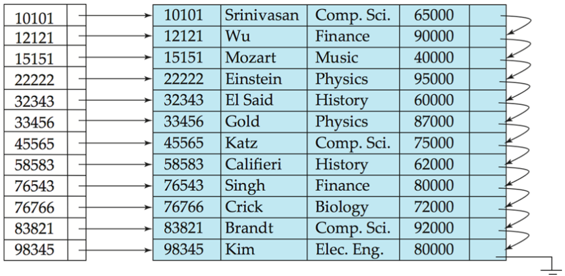
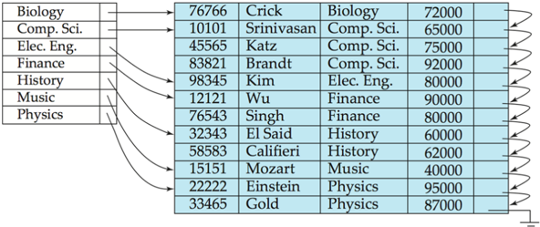
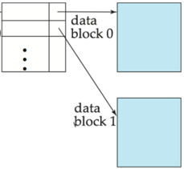
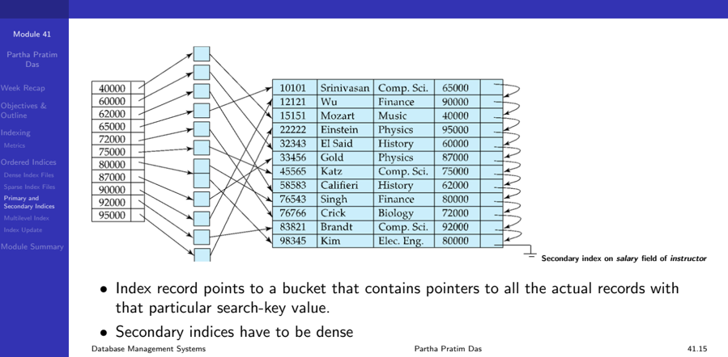
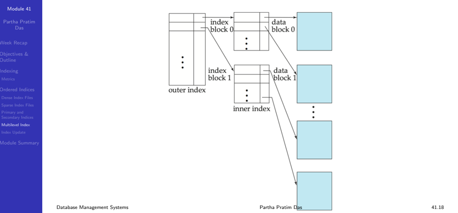
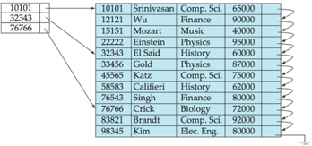

## Module 41

Partha Pratim Das

Week Recap

Objectives &amp;

Outline

Indexing

Metrics

Ordered Indices Dense Index Files Sparse Index Files Primary and Secondary Indices Multilevel Index Index Update

Module Summary

## Database Management Systems

Module 41: Indexing and Hashing/1: Indexing/1

## Partha Pratim Das

Department of Computer Science and Engineering Indian Institute of Technology, Kharagpur ppd@cse.iitkgp.ac.in

Partha Pratim Das

Module 41

Partha Pratim Das

Week Recap

Objectives &amp; Outline

Indexing

Metrics

Ordered Indices

Dense Index Files

Sparse Index Files

Primary and Secondary Indices

Multilevel Index

Index Update

Module Summary

## Week Recap

- Need for algorithm analysis, Asymptotic complexity, and Worst-case, average-case and best-case analysis
- Reviewed Linear Data Structures; array, list, stack, queue; and linear and binary search
- Reviewed Non-linear Data Structures - graph, tree, hash table; Binary Search Tree; and compared Linear and Non-Linear Data Structures
- Understood the range of Physical Storage Media
- Studied about Magnetic Disks and Magnetic Tape
- Glimpsed through Other Storage and the Future of Storage
- Familiarized with the organization for database files
- Understood how records and relations are organized in files
- Learnt how databases keep their own information in Data-Dictionary Storage - the metadata database of a database
- Understood the mechanisms for fast access of a database store

Database Management Systems

## Partha Pratim Das

## Module 41

Partha Pratim Das

Week Recap

Objectives &amp; Outline

Indexing

Metrics

Ordered Indices Dense Index Files Sparse Index Files Primary and Secondary Indices Multilevel Index Index Update

Module Summary

## Module Objectives

- To understand the reasons for which we need to index database table
- To learn about the ordered indexes and Indexed Sequential Access Mechanism

## Module 41

Partha Pratim Das

Week Recap

Objectives &amp; Outline

Indexing

Metrics

Ordered Indices Dense Index Files Sparse Index Files Primary and Secondary Indices Multilevel Index Index Update

Module Summary

## Module Outline

- Basic Concepts of Indexing
- Ordered Indices

## Module 41

Partha Pratim Das

Week Recap

Objectives &amp;

Outline

Indexing

Metrics

Ordered Indices

Dense Index Files

Sparse Index Files

Primary and

Secondary Indices

Multilevel Index

Index Update

Module Summary

## Concepts of Indexing

## Concepts of Indexing

Module 41

Partha Pratim

Das

Week Recap

Objectives &amp;

Outline

Indexing

Metrics

Ordered Indices

Dense Index Files

Sparse Index Files

Primary and

Secondary Indices

Multilevel Index

Index Update

Module Summary

## Search Records

- Consider a table: Faculty(Name, Phone)
- How to search on Name?
- Get the phone number for 'Pabitra Mitra'
- Use 'Name' Index - sorted on 'Name', search 'Pabitra Mitra' and navigate on pointer (rec #)
- How to search on Phone?
- Get the name of the faculty having phone number = 84772
- Use 'Phone' Index - sorted on 'Phone', search '84772' and navigate on pointer (rec #)
- We can keep the records sorted on 'Name' or on 'Phone' (called the primary index), but not on both Database Management Systems Partha Pratim Das

| Index on 'Name"     | Index on 'Name"   |                    |       | Index on "Phone   | Index on "Phone   |
|---------------------|-------------------|--------------------|-------|-------------------|-------------------|
| Name                | Pointer           | Rec# Name          | Phone | Pointer           | Phone             |
| Anupam Basu         |                   | 1Partha Pratim Das | 81998 |                   | 81664             |
| Pabitra Mitra       |                   | 2Anupam Basu       | 82404 |                   | 81998             |
| Partha Pratim Das   |                   | 3Ranjan Sen        | 84624 |                   | 82404             |
| Prabir Kumar Biswas |                   | 4Sudeshna Sarkar   | 82432 |                   | 82432             |
| Rajib Mall          |                   | 5Rajib Mall        | 83668 |                   | 83668             |
| Ranjan Sen          |                   | 6Pabitra Mitra     | 81664 |                   | 84624             |
| Sudeshna Sarkar     |                   |                    |       |                   | 84772             |

## Module 41

Partha Pratim Das

Week Recap

Objectives &amp; Outline

Indexing

Metrics

Ordered Indices

Dense Index Files

Sparse Index Files

Primary and Secondary Indices

Multilevel Index

Index Update

Module Summary

## Basic Concepts

- Indexing mechanisms used to speed up access to desired data.
- For example:
- glyph[triangleright] Name in a faculty table
- glyph[triangleright] author catalog in library
- Search Key - attribute to set of attributes used to look up records in a file
- An index file consists of records (called index entries ) of the form
- Index files are typically much smaller than the original file
- Two basic kinds of indices:
- Ordered indices : search keys are stored in sorted order
- Hash indices : search keys are distributed uniformly across buckets using a hash function

Database Management Systems

Partha Pratim Das

## Module 41

Partha Pratim Das

Week Recap

Objectives &amp; Outline

Indexing

Metrics

Ordered Indices Dense Index Files Sparse Index Files Primary and Secondary Indices Multilevel Index Index Update

Module Summary

## Index Evaluation Metrics

- Access types supported efficiently. For example,
- records with a specified value in the attribute, or
- records with an attribute value falling in a specified range of values
- Access time
- Insertion time
- Deletion time
- Space overhead

## Module 41

Partha Pratim Das

Week Recap

Objectives &amp;

Outline

Indexing

Metrics

Ordered Indices

Dense Index Files

Sparse Index Files

Primary and

Secondary Indices

Multilevel Index

Index Update

Module Summary

## Ordered Indices

## Ordered Indices

## Module 41

Partha Pratim Das

Week Recap

Objectives &amp; Outline

Indexing

Metrics

## Ordered Indices

Dense Index Files

Sparse Index Files

Primary and Secondary Indices

Multilevel Index

Index Update

Module Summary

## Ordered Indices

- In an ordered index , index entries are stored sorted on the search key value. For example, author catalog in library
- Primary index : in a sequentially ordered file, the index whose search key specifies the sequential order of the file
- Also called clustering index
- The search key of a primary index is usually but not necessarily the primary key
- Secondary index : an index whose search key specifies an order different from the sequential order of the file
- Also called non-clustering index
- Index-sequential file : ordered sequential file with a primary index

## Module 41

Partha Pratim

Das

Week Recap

Objectives &amp;

Outline

Indexing

Metrics

Ordered Indices

Dense Index Files

Sparse Index Files

Primary and

Secondary Indices

Multilevel Index

Index Update

Module Summary

## Dense Index Files

- Dense index - Index record appears for every search-key value in the file.
- For example, index on ID attribute of instructor relation

## Partha Pratim Das

## Module 41

Partha Pratim

Das

Week Recap

Objectives &amp;

Outline

Indexing

Metrics

Ordered Indices

Dense Index Files

Sparse Index Files

Primary and

Secondary Indices

Multilevel Index

Index Update

Module Summary

## Dense Index Files (2)

- Dense index on dept name , with instructor file sorted on dept name

| Biology   |   76766 | Crick      | Biology   |   72000 |
|-----------|---------|------------|-----------|---------|
| Comp. Sci |   10101 | Srinivasan |           |   65000 |
| Elec. Eng |   45565 | Katz       | Comp Sci. |   75000 |
| Finance   |   83821 | Brandt     |           |   92000 |
| History   |   98345 | Kim        | Elec. Eng |   80000 |
| Music     |   12121 | Wu         | Finance   |   90000 |
| Physics   |   76543 | Singh      | Finance   |   80000 |
|           |   32343 | El Said    | History   |   60000 |
|           |   58583 | Califieri  | History   |   62000 |
|           |   15151 | Mozart     | Music     |   40000 |
|           |   22222 | Einstein   | Physics   |   95000 |
|           |   33465 | Gold       | Physics   |   87000 |

## Module 41

Partha Pratim Das

Week Recap

Objectives &amp;

Outline

Indexing

Metrics

Ordered Indices

Dense Index Files

Sparse Index Files

Primary and

Secondary Indices

Multilevel Index

Index Update

Module Summary

## Sparse Index Files

- Sparse Index : contains index records for only some search-key values.
- Applicable when records are sequentially ordered on search-key
- To locate a record with search-key value K we:
- Find index record with largest search-key value &lt; K
- Search file sequentially starting at the record to which the index record points

## Database Management Systems

Partha Pratim Das

## Module 41

Partha Pratim Das

Week Recap

Objectives &amp; Outline

Indexing

Metrics

Ordered Indices

Dense Index Files

Sparse Index Files

Primary and

Secondary Indices

Multilevel Index

Index Update

Module Summary

## Sparse Index Files (2)

- Compared to dense indices:
- Less space and less maintenance overhead for insertions and deletions
- Generally slower than dense index for locating records
- Good tradeoff : sparse index with an index entry for every block in file, corresponding to least search-key value in the block

Partha Pratim Das

## Secondary Indices Example

## Module 41

Partha Pratim Das

Week Recap

Objectives &amp; Outline

Indexing

Metrics

Ordered Indices

Dense Index Files

Sparse Index Files

Primary and Secondary Indices

Multilevel Index

Index Update

Module Summary

## Primary and Secondary Indices

- Indices offer substantial benefits when searching for records
- BUT: Updating indices imposes overhead on database modification -when a file is modified, every index on the file must be updated
- Sequential scan using primary index is efficient, but a sequential scan using a secondary index is expensive
- Each record access may fetch a new block from disk
- Block fetch requires about 5 to 10 milliseconds, versus about 100 nanoseconds for memory access

## Module 41

Partha Pratim Das

Week Recap

Objectives &amp; Outline

Indexing

Metrics

Ordered Indices

Dense Index Files

Sparse Index Files

Primary and Secondary Indices

Multilevel Index

Index Update

Module Summary

## Multilevel Index

- If primary index does not fit in memory, access becomes expensive
- Solution: treat primary index kept on disk as a sequential file and construct a sparse index on it
- outer index - a sparse index of primary index
- inner index - the primary index file
- If even outer index is too large to fit in main memory, yet another level of index can be created, and so on
- Indices at all levels must be updated on insertion or deletion from the file

## Module 41

Partha Pratim Das

Week Recap

Objectives &amp; Outline

Indexing

Metrics

Ordered Indices

Dense Index Files

Sparse Index Files

Primary and

Secondary Indices

Multilevel Index

Index Update

Module Summary

## Index Update: Deletion

- If deleted record was the only record in the file with its particular search-key value, the searchkey is deleted from the index also.
- Single-level index entry deletion :
- Dense indices - deletion of search-key is similar to file record deletion
- Sparse indices -
- glyph[triangleright] If an entry for the search key exists in the index, it is deleted by replacing the entry in the index with the next search-key value in the file (in search-key order)
- glyph[triangleright] If the next search-key value already has an index entry, the entry is deleted instead of being replaced

## Module 41

Partha Pratim Das

Week Recap

Objectives &amp; Outline

Indexing

Metrics

Ordered Indices

Dense Index Files

Sparse Index Files

Primary and

Secondary Indices

Multilevel Index

Index Update

Module Summary

## Index Update (2): Insertion

- Single-level index insertion :
- Perform a lookup using the search-key value appearing in the record to be inserted
- Dense indices - if the search-key value does not appear in the index, insert it
- Sparse indices - if index stores an entry for each block of the file, no change needs to be made to the index unless a new block is created
- glyph[triangleright] If a new block is created, the first search-key value appearing in the new block is inserted into the index
- Multilevel insertion and deletion : algorithms are simple extensions of the single-level algorithms

## Module 41

Partha Pratim Das

Week Recap

Objectives &amp; Outline

Indexing

Metrics

Ordered Indices Dense Index Files Sparse Index Files Primary and Secondary Indices

Multilevel Index

Index Update

Module Summary

## Secondary Indices

- Frequently, one wants to find all the records whose values in a certain field (which is not the search-key of the primary index) satisfy some condition
- Example 1: In the instructor relation stored sequentially by ID, we may want to find all instructors in a particular department
- Example 2: as above, but where we want to find all instructors with a specified salary or with salary in a specified range of values
- We can have a secondary index with an index record for each search-key value

## Module 41

Partha Pratim Das

Week Recap

Objectives &amp; Outline

Indexing

Metrics

Ordered Indices Dense Index Files Sparse Index Files Primary and Secondary Indices Multilevel Index Index Update

Module Summary

## Module Summary

- Appreciated the reasons for indexing database tables
- Understood the ordered indexes

Slides used in this presentation are borrowed from http://db-book.com/ with kind permission of the authors. Edited and new slides are marked with 'PPD'.