## Module 42

Partha Pratim

Das

Objectives &amp;

Outline

Balanced BST

2-3-4 Tree

Search

Insert

Split

Example

Delete

Observations

Module Summary

## Database Management Systems

Module 42: Indexing and Hashing/2: Indexing/2

## Partha Pratim Das

Department of Computer Science and Engineering Indian Institute of Technology, Kharagpur ppd@cse.iitkgp.ac.in

Partha Pratim Das

## Module 42

Partha Pratim Das

Objectives &amp; Outline

Balanced BST

2-3-4 Tree

Search

Insert

Split

Example

Delete

Observations

Module Summary

## Module Recap

- Appreciated the reasons for indexing database tables
- Understood the ordered indexes

## Module 42

Partha Pratim Das

Objectives &amp; Outline

Balanced BST

2-3-4 Tree

Search

Insert

Split

Example

Delete

Observations

Module Summary

## Module Objectives

- To recap Balanced Binary Search Trees as options for optimal in-memory search data structures
- To understand the issues relating to external search data structures for persistent data
- To study 2-3-4 Tree as a precursor to B/B+-Tree for an efficient external data structure for database and index tables

## Module 42

Partha Pratim Das

Objectives &amp; Outline

Balanced BST

2-3-4 Tree

Search

Insert

Split

Example

Delete

Observations

Module Summary

## Module Outline

- Balanced Binary Search Trees
- 2-3-4 Tree

Module 42

Partha Pratim Das

Objectives &amp;

Outline

Balanced BST

2-3-4 Tree

Search

Insert

Split

Example

Delete

Observations

Module Summary

## Balanced Binary Search Trees

## Balanced Binary Search Trees

## Module 42

Partha Pratim Das

Objectives &amp; Outline

Balanced BST

2-3-4 Tree

Search

Insert

Split

Example

Delete

Observations

Module Summary

## Search Data Structures

- How to search a key in a list of n data items?
- Linear Search: O ( n ): Find 28 ⇒ 16 comparisons
- glyph[triangleright] Unordered items in an array - search sequentially
- glyph[triangleright] Unordered / Ordered items in a list - search sequentially

22 50 20 36 40 15 08 01 45 48 30 10 38 12 25 28 05 END

- Binary Search: O (lg n ): Find 28 ⇒ 4 comparisons - 25, 36, 30, 28
- glyph[triangleright] Ordered items in an array - search by divide-and-conquer

01 05 08 10 12 15 20 22 25 28 30 36 38 40 45 48 50 END

- glyph[triangleright] Binary Search Tree - recursively on left / right

## Database Management Systems

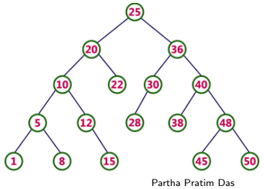

Module 42

Partha Pratim

Das

Objectives &amp;

Outline

Balanced BST

2-3-4 Tree

Search

Insert

Split

Example

Delete

Observations

Module Summary

## Search Data Structures (2)

- Worst case time (n data items in the data structure):
- Between an array and a list, there is a trade-off between search and insert/delete complexity
- For a BST of n nodes, lg n ≤ h &lt; n , where h is the height of the tree
- A BST is balanced if h ∼ O (lg n ): this what we desire

| Data Structure     | Search   | Insert   | Delete   | Remarks                                                                                                       |
|--------------------|----------|----------|----------|---------------------------------------------------------------------------------------------------------------|
| Unordered Array    | O(n)     | 0(1)     | 0(1)     | The time to Insert / Delete an item is the time after the location of the item has been ascertained by Search |
| Ordered Array      | O(log n) | O(n)     |          | The time to Insert / Delete an item is the time after the location of the item has been ascertained by Search |
| Unordered List     | O(n)     | 0(1)     |          | The time to Insert / Delete an item is the time after the location of the item has been ascertained by Search |
| Ordered List       | O(n)     | 0(1)     | 0(1)     | The time to Insert / Delete an item is the time after the location of the item has been ascertained by Search |
| Binary Search Tree | O(h)     | 0(1)     | 0(1)     | The time to Insert / Delete an item is the time after the location of the item has been ascertained by Search |

## Partha Pratim Das

Module 42

Partha Pratim Das

Objectives &amp; Outline

Balanced BST

2-3-4 Tree

Search

Insert

Split

Example

Delete

Observations

Module Summary

## Search Data Structures (3): BST

- In the worst case, searching a key in a BST is O ( h ), where h is the height of the key
- Bad Tree: h ∼ O ( n )
- The BST is a skewed binary search tree (all the nodes except the leaf would have only one child)
- This can happen if keys are inserted in sorted order
- Height ( h ) of the BST having n elements becomes n -1
- Time complexity of search in BST becomes O ( n )
- Good Tree: h ∼ O (lg n )
- The BST is a balanced binary search tree
- This is possible if
- glyph[triangleright] If keys are inserted in purely randomized order, Or
- glyph[triangleright] If the tree is explicitly balanced after every insertion
- Height ( h ) of the binary search tree becomes lg n
- Time complexity of search in BST becomes O (lg n )

Module 42

Partha Pratim Das

Objectives &amp; Outline

Balanced BST

2-3-4 Tree

Search

Insert

Split

Example

Delete

Observations

Module Summary

## Balanced Binary Search Trees

- A BST is balanced if h ∼ O (lg n )
- Balancing Guarantees may be of various types:
- Worst-case
- glyph[triangleright] AVL Tree: Self-balancing BST
- -Named after inventors Adelson-Velsky-Landis
- -Heights of the two child subtrees of any node differ by at most one: | hL -hR | ≤ 1
- -If they differ by more than one, rebalancing is done rotation
- Randomized
- glyph[triangleright] Randomized BST
- -A BST on n keys is random if either it is empty ( n = 0), or the probability that a given key is at the root is 1 n , and the left and right subtrees are random
- glyph[triangleright] Skip List
- -A skip list is built (probabbilistically) in layers of ordered linked lists
- Amortized
- glyph[triangleright] Splay
- -A BST where recently accessed elements are quick to access again Partha Pratim Das

Database Management Systems

## Module 42

Partha Pratim Das

Objectives &amp; Outline

Balanced BST

2-3-4 Tree

Search

Insert

Split

Example

Delete

Observations

Module Summary

## Balanced Binary Search Trees (2)

- These data structures have optimal complexity for the required operations:
- Search: O (lg n )
- Insert: Search + O (1): O (lg n )
- Delete: Search + O (1): O (lg n )
- And they are:
- Good for in-memory operations
- Work well for small volume of data
- Has complex rotation and / or similar operations
- Do not scale for external data structures

Module 42

Partha Pratim

Das

Objectives &amp;

Outline

Balanced BST

2-3-4 Tree

Search

Insert

Split

Example

Delete

Observations

Module Summary

## 2-3-4 Tree

## 2-3-4 Tree

## Module 42

Partha Pratim Das

Objectives &amp; Outline

Balanced BST

2-3-4 Tree

Search

Insert

Split

Example

Delete

Observations

Module Summary

## 2-3-4 Trees

- All leaves are at the same depth (the bottom level).
- Height, h , of all leaf nodes are same
- glyph[triangleright] h ∼ O (lg n )
- glyph[triangleright] Complexity of search, insert and delete: O ( h ) ∼ O (lg n )
- All data is kept in sorted order
- Every node (leaf or internal) is a 2-node, 3-node or a 4-node (based on the number of links or children), and holds one, two, or three data elements, respectively
- Generalizes easily to larger nodes
- Extends to external data structures

## Module 42

Partha Pratim Das

Objectives &amp; Outline

Balanced BST

2-3-4 Tree

Search

Insert

Split

Example

Delete

Observations

Module Summary

## 2-3-4 Trees

- Uses 3 kinds of nodes satisfying key relationships as shown below:
- A 2-node must contain a single data item (S) and two links
- A 3-node must contain two data items (S, L) and three links
- A 4-node must contain three data items (S, M, L) and four links
- A leaf may contain either one, two, or three data items

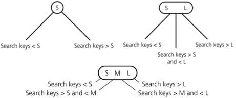

## Module 42

Partha Pratim Das

Objectives &amp;

Outline

Balanced BST

2-3-4 Tree

Search

Insert

Split

Example

Delete

Observations

Module Summary

## 2-3-4 Trees: Search

- Search
- Simple and natural extension of search in BST

## Module 42

Partha Pratim Das

Objectives &amp; Outline

Balanced BST

2-3-4 Tree

Search

Insert

Split

Example

Delete

Observations

Module Summary

## 2-3-4 Trees: Insert

- Insert
- Search to find expected location
- glyph[triangleright] If it is a 2 node, change to 3 node and insert
- glyph[triangleright] If it is a 3 node, change to 4 node and insert
- glyph[triangleright] If it is a 4 node, split the node by moving the middle item to parent node, then insert
- Node Splitting
- glyph[triangleright] A 4-node is split as soon as it is encountered during a search from the root to a leaf
- glyph[triangleright] The 4-node that is split will
- -Be the root, or
- -Have a 2-node parent, or
- -Have a 3-node parent

## Module 42

Partha Pratim Das

Objectives &amp; Outline

Balanced BST

2-3-4 Tree

Search

Insert

Split

Example

Delete

Observations

Module Summary

## 2-3-4 Trees: Insert

- Splitting at Root

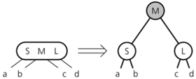

Module 42

Partha Pratim

Das

Objectives &amp;

Outline

Balanced BST

2-3-4 Tree

Search

Insert

Split

Example

Delete

Observations

Module Summary

## 2-3-4 Trees: Insert

## · Splitting with 2 Node parent

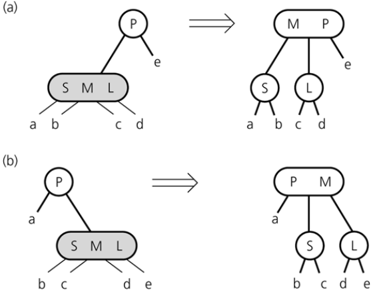

## Database Management Systems

## Partha Pratim Das

Module 42

Partha Pratim

Das

Objectives &amp;

Outline

Balanced BST

2-3-4 Tree

Search

Insert

Split

Example

Delete

Observations

Module Summary

## 2-3-4 Trees: Insert

- Splitting with 3 Node parent

## Database Management Systems

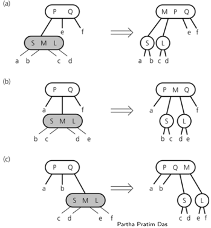

42.18

## Module 42

Partha Pratim Das

Objectives &amp; Outline

Balanced BST

2-3-4 Tree

Search

Insert

Split

Example

Delete

Observations

Module Summary

## 2-3-4 Trees: Insert

- Node Splitting: There are two strategies:
- Early : Split a 4-node as soon as you cross on in traversal. It ensures that the tree does not have a path with multiple 4-nodes at any point
- Late : Split a 4-node only when you need to insert an item in it. This might lead to cases where for one insert we may need to perform O ( h ) splits going till up to the root
- Both are valid and has the same complexity O ( h ). However, they lead to different results. Different texts and sites follow different strategies.
- Here we are following early strategy

## 2-3-4 Trees: Insert: Example

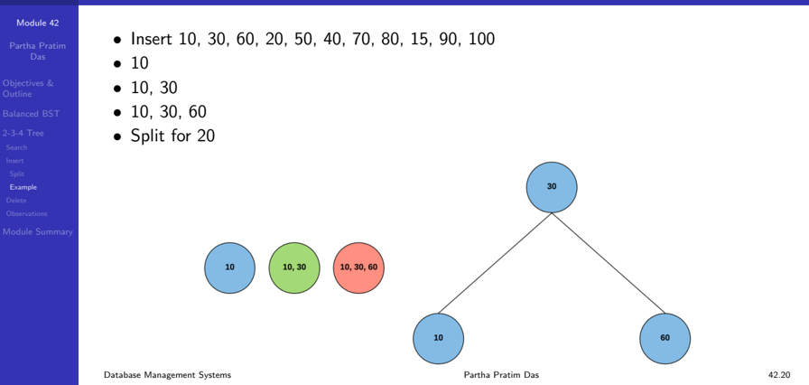

Module 42

Partha Pratim

Das

Objectives &amp;

Outline

Balanced BST

2-3-4 Tree

Search

Insert

Split

Example

Delete

Observations

Module Summary

## 2-3-4 Trees: Insert: Example

- 10, 30, 60, 20
- 10, 30, 60, 20, 50

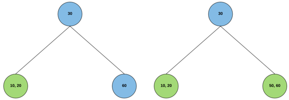

Module 42

Partha Pratim

Das

Objectives &amp;

Outline

Balanced BST

2-3-4 Tree

Search

Insert

Split

Example

Delete

Observations

Module Summary

## 2-3-4 Trees: Insert: Example

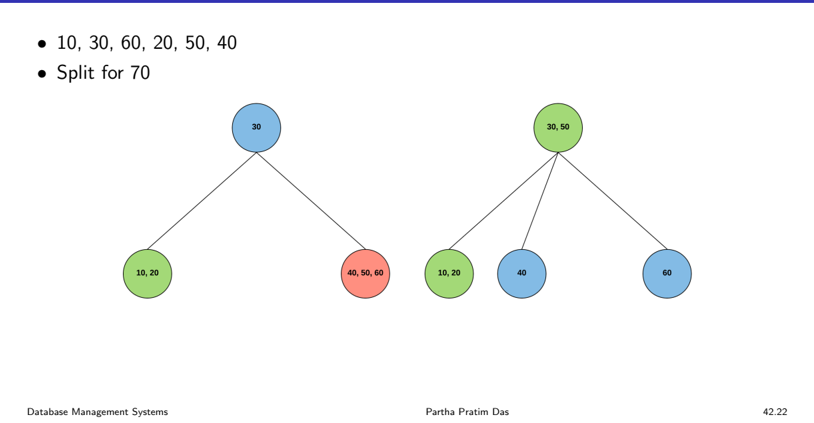

Module 42

Partha Pratim

Das

Objectives &amp;

Outline

Balanced BST

2-3-4 Tree

Search

Insert

Split

Example

Delete

Observations

Module Summary

## 2-3-4 Trees: Insert: Example

- 10, 30, 60, 20, 50, 40, 70
- 10, 30, 60, 20, 50, 40, 70, 80

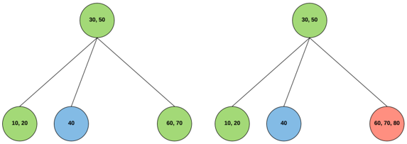

## Module 42

Partha Pratim

Das

Objectives &amp;

Outline

Balanced BST

2-3-4 Tree

Search

Insert

Split

Example

Delete

Observations

Module Summary

## 2-3-4 Trees: Insert: Example

- 10, 30, 60, 20, 50, 40, 70, 80, 15
- Split for 90

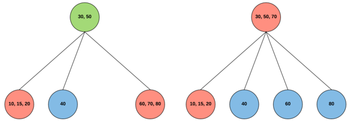

## Module 42

Partha Pratim

Das

Objectives &amp;

Outline

Balanced BST

2-3-4 Tree

Search

Insert

Split

Example

Delete

Observations

Module Summary

## 2-3-4 Trees: Insert: Example

- 10, 30, 60, 20, 50, 40, 70, 80, 15, 90
- Split for 100

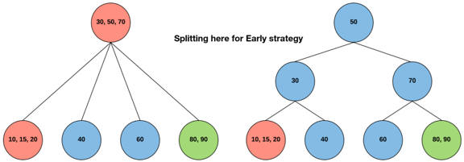

Module 42

Partha Pratim

Das

Objectives &amp;

Outline

Balanced BST

2-3-4 Tree

Search

Insert

Split

Example

Delete

Observations

Module Summary

## 2-3-4 Trees: Insert: Example

- 10, 30, 60, 20, 50, 40, 70, 80, 15, 90, 100

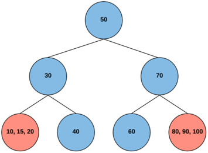

## Module 42

Partha Pratim Das

Objectives &amp; Outline

Balanced BST

2-3-4 Tree

Search

Insert

Split

Example

Delete

Observations

Module Summary

## 2-3-4 Trees: Delete

- Delete
- Locate the node n that contains the item theItem
- Find theItem 's inorder successor and swap it with theItem (deletion will always be at a leaf)
- If that leaf is a 3-node or a 4-node, remove theItem
- To ensure that theItem does not occur in a 2-node
- glyph[triangleright] Transform each 2-node encountered into a 3-node or a 4-node
- glyph[triangleright] Reverse different cases illustrated for splitting

## Module 42

Partha Pratim Das

Objectives &amp; Outline

Balanced BST

2-3-4 Tree

Search

Insert

Split

Example

Delete

Observations

Module Summary

## 2-3-4 Tree

- Advantages
- All leaves are at the same depth (the bottom level): Height, h ∼ O (lg n )
- Complexity of search, insert and delete: O ( h ) ∼ O (lg n )
- All data is kept in sorted order
- Generalizes easily to larger nodes
- Extends to external data structures
- Disadvantages
- Uses variety of node types - need to destruct and construct multiple nodes for converting a 2 Node to 3 Node, a 3 Node to 4 Node, for splitting etc.

## Module 42

Partha Pratim Das

Objectives &amp; Outline

Balanced BST

2-3-4 Tree

Search

Insert

Split

Example

Delete

Observations

Module Summary

## 2-3-4 Trees

- Consider only one node type with space for 3 items and 4 links
- Internal node (non-root) has 2 to 4 children (links)
- Leaf node has 1 to 3 items
- Wastes some space, but has several advantages for external data structure
- Generalizes easily to larger nodes
- All paths from root to leaf are of the same length
- Each node that is not a root or a leaf has between
- A leaf node has between ⌈ ( n -1) 2 ⌉ and n -1 values
- ⌈ n 2 ⌉ and n children.
- Special cases:
- glyph[triangleright] If the root is not a leaf, it has at least 2 children.
- glyph[triangleright] If the root is a leaf, it can have between 0 and ( n -1) values.
- Extends to external data structures
- B-Tree
- 2-3-4 Tree is a B-Tree where n = 4

Database Management Systems

Partha Pratim Das

## Module 42

Partha Pratim Das

Objectives &amp; Outline

Balanced BST

2-3-4 Tree

Search

Insert

Split

Example

Delete

Observations

Module Summary

## Module Summary

- Recapitulated the notions of Balanced Binary Search Trees as options for optimal in-memory search data structures
- Understood the issues relating to external data structures for persistent data
- Explored 2-3-4 Tree in depth as a precursor to B/B+-Tree for an efficient external data structure for database and index tables

Slides used in this presentation are borrowed from http://db-book.com/ with kind permission of the authors.

Edited and new slides are marked with 'PPD'.

Database Management Systems

Partha Pratim Das

42.30