## Module 43

Partha Pratim Das

Objectives &amp; Outline

B+-Tree Index Files

Simple B +

Tree

Index Files

Nodes

Observations

Query

Duplicates

Updates

Insertion

Deletion

File Organization

Non-Unique Keys

Relocation and Secondary Indices

Strings

B-Tree Index Files

Comparison

Module Summary

Database Management Systems

## Database Management Systems

Module 43: Indexing and Hashing/3: Indexing/3

## Partha Pratim Das

Department of Computer Science and Engineering Indian Institute of Technology, Kharagpur ppd@cse.iitkgp.ac.in

Partha Pratim Das

## Module 43

Partha Pratim Das

Objectives &amp; Outline

B+-Tree Index Files

Simple B +

Tree

Index Files

Nodes

Observations

Query

Duplicates

Updates

Insertion

Deletion

File Organization

Non-Unique Keys

Relocation and Secondary Indices

Strings

B-Tree Index Files

Comparison

Module Summary

## Module Recap

- Recapitulated the notions of Balanced Binary Search Trees as options for optimal in-memory search data structures
- Understood the issues relating to external data structures for persistent data
- Explored 2-3-4 Tree in depth as a precursor to B/B+-Tree for an efficient external data structure for database and index tables

## Module 43

Partha Pratim Das

Objectives &amp; Outline

B+-Tree Index Files

Simple B +

Tree

Index Files

Nodes

Observations

Query

Duplicates

Updates

Insertion

Deletion

File Organization

Non-Unique Keys

Relocation and Secondary Indices

Strings

B-Tree Index Files

Comparison

Module Summary

## Module Objectives

- To understand the design of B + Tree Index Files as a generalization of 2-3-4 Tree
- To understand the fundamentals of B-Tree Index Files

## Module 43

Partha Pratim Das

Objectives &amp; Outline

B+-Tree Index

Files

Simple B +

Index Files

Nodes

Observations

Query

Duplicates

Updates

Insertion

Deletion

File Organization

Non-Unique Keys

Relocation and

Secondary Indices

Strings

B-Tree Index Files

Comparison

Module Summary

Tree

## Module Outline

- B + Tree Index Files
- B-Tree Index Files

## Module 43

Partha Pratim Das

Objectives &amp; Outline

B+-Tree Index Files

Simple B +

Tree

Index Files

Nodes

Observations

Query

Duplicates

Updates

Insertion

Deletion

File Organization

Non-Unique Keys

Relocation and

Secondary Indices

Strings

B-Tree Index Files

Comparison

Module Summary

## B + Tree Index Files

## Module 43

Partha Pratim Das

Objectives &amp; Outline

B+-Tree Index Files

Simple B +

Tree

Index Files

Nodes

Observations

Query

Duplicates

Updates

Insertion

Deletion

File Organization

Non-Unique Keys

Relocation and

Secondary Indices

Strings

B-Tree Index Files

Comparison

Module Summary

## B + Tree

## The B + Tree

- Is a balanced binary search tree
- Follows a multi-level index format like 2-3-4 Tree
- Has the leaf nodes denoting actual data pointers
- Ensures that all leaf nodes remain at the same height (like 2-3-4 Tree)
- Has the leaf nodes are linked using a link list
- Can support random access as well as sequential access
- Example:

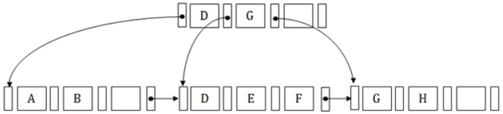

Source :

B

+

Tree

Database Management Systems

## Partha Pratim Das

## Module 43

Partha Pratim

Das

Objectives &amp;

Outline

B+-Tree Index

Files

Simple B +

Index Files

Nodes

Observations

Query

Duplicates

Updates

Insertion

Deletion

File Organization

Non-Unique Keys

Relocation and

Secondary Indices

Strings

B-Tree Index Files

Comparison

Module Summary

Tree

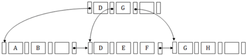

- Internal node contains
- At least n 2 child pointers, except the root node
- At most n pointers
- Leaf node contains
- At least n 2 record pointers and n 2 key values
- At most n record pointer and n key values
- One block pointer P to point to next leaf node

## Source : B + Tree

Database Management Systems

Note: These are approximate values, we will discuss more precise values later in this lecture.

## Module 43

Partha Pratim Das

Objectives &amp; Outline

B+-Tree Index Files

Simple B +

Tree

Index Files

Nodes

Observations

Query

Duplicates

Updates

Insertion

Deletion

File Organization

Non-Unique Keys

Relocation and

Secondary Indices

Strings

B-Tree Index Files

Comparison

Module Summary

## B + Tree (3): Search

- Suppose we have to search 55 in the B + tree below
- First, we will fetch for the intermediary node which will direct to the leaf node that can contain a record for 55
- So, in the intermediary node, we will find a branch between 50 and 75 nodes
- Then at the end, we will be redirected to the third leaf node
- Here DBMS will perform a sequential search to find 55

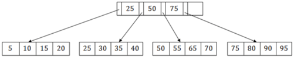

B

+

Tree

Source :

Module 43

Partha Pratim

Das

Objectives &amp;

Outline

B+-Tree Index

Files

Simple B +

Index Files

Nodes

Observations

Query

Duplicates

Updates

Insertion

Deletion

File Organization

Non-Unique Keys

Relocation and

Secondary Indices

Strings

B-Tree Index

Files

Comparison

Module Summary

Tree

## B + Tree (3): Insert

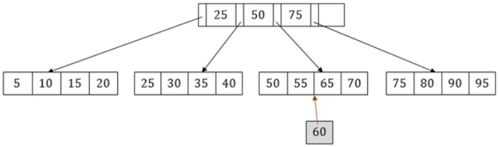

- Suppose we want to insert a record 60 that goes to 3 rd leaf node after 55
- The leaf node of this tree is already full, so we cannot insert 60 there
- So we have to split the leaf node, so that it can be inserted into tree without affecting the fill factor, balance and order
- The 3 rd leaf node has the values (50, 55, 60, 65, 70) and its current root node is 50
- We will split the leaf node of the tree in the middle so that its balance is not altered

## Source : B + Tree

Database Management Systems

## Partha Pratim Das

Module 43

Partha Pratim

Das

Objectives &amp;

Outline

B+-Tree Index

Files

Simple B +

Index Files

Nodes

Observations

Query

Duplicates

Updates

Insertion

Deletion

File Organization

Non-Unique Keys

Relocation and

Secondary Indices

Strings

B-Tree Index

Files

Comparison

Module Summary

Tree

## B + Tree (4): Insert

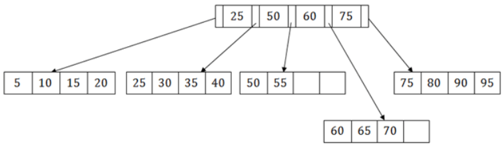

- So we can group (50, 55) and (60, 65, 70) into 2 leaf nodes
- If these two has to be leaf nodes, the intermediate node cannot branch from 50
- It should have 60 added to it, and then we can have pointers to a new leaf node
- This is how we can insert an entry when there is overflow. In a normal scenario, it is very easy to find the node where it fits and then place it in that leaf node

Source :

Module 43

Partha Pratim

Das

Objectives &amp;

Outline

B+-Tree Index

Files

Simple B +

Index Files

Nodes

Observations

Query

Duplicates

Updates

Insertion

Deletion

File Organization

Non-Unique Keys

Relocation and

Secondary Indices

Strings

B-Tree Index

Files

Comparison

Module Summary

Tree

## B + Tree (5): Delete

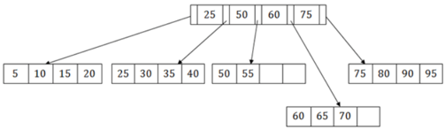

- To delete 60, we have to remove 60 from intermediate node as well as 4 th leaf node
- If we remove it from the intermediate node, then the tree will not remain a B+ tree
- So with deleting 60 we re-arranging the nodes:

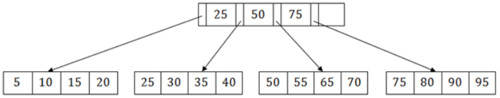

Source

:

B

+

Tree

Database Management Systems

Partha Pratim Das

## Module 43

Partha Pratim Das

Objectives &amp; Outline

B+-Tree Index Files

Simple B +

Tree

Index Files

Nodes

Observations

Query

Duplicates

Updates

Insertion

Deletion

File Organization

Non-Unique Keys

Relocation and Secondary Indices

Strings

B-Tree Index Files

Comparison

Module Summary

## B + Tree Index Files

- B + tree indices are an alternative to indexed-sequential files
- Disadvantage of ISAM files
- Performance degrades as file grows, since many overflow blocks get created
- Periodic reorganization of entire file is required
- Advantage of B + tree index files :
- Automatically reorganizes itself with small, local, changes, in the face of insertions and deletions
- Reorganization of entire file is not required to maintain performance
- (Minor) disadvantage of B + trees :
- Extra insertion and deletion overhead, space overhead
- Advantages of B + trees outweigh disadvantages
- B + trees are used extensively

Module 43

Partha Pratim

Das

Objectives &amp;

Outline

B+-Tree Index

Files

Simple B +

Index Files

Nodes

Observations

Query

Duplicates

Updates

Insertion

Deletion

File Organization

Non-Unique Keys

Relocation and

Secondary Indices

Strings

B-Tree Index

Files

Comparison

Module Summary

Tree

## B + Tree Index Files (2): Example

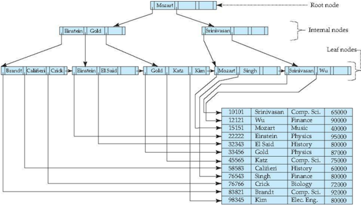

Database Management Systems

Partha Pratim Das

## Module 43

Partha Pratim Das

Objectives &amp; Outline

B+-Tree Index Files

Simple B + Tree

Index Files

Nodes

Observations

Query

Duplicates

Updates

Insertion

Deletion

File Organization

Non-Unique Keys

Relocation and Secondary Indices

Strings

B-Tree Index Files

Comparison

Module Summary

## B + Tree Index Files (3): Structure

A B + tree is a rooted tree satisfying the following properties:

- All paths from root to leaf are of the same length
- Each node that is not a root or a leaf has between glyph[ceilingleft] n 2 glyph[ceilingright] and n children
- A leaf node has between an glyph[ceilingleft] n -1 2 glyph[ceilingright] and n -1 values
- Special cases:
- If the root is not a leaf, it has at least 2 children.
- If the root is a leaf (that is, there are no other nodes in the tree), it can have between 0 and ( n -1) values.

Module 43

Partha Pratim Das

Objectives &amp; Outline

B+-Tree Index

Files

Simple B +

Index Files

Nodes

Observations

Query

Duplicates

Updates

Insertion

Deletion

File Organization

Non-Unique Keys

Relocation and

Secondary Indices

Strings

B-Tree Index Files

Comparison

Module Summary

Tree

## B + Tree Index Files (4): Node Structure

- Typical node
- K i are the search-key values
- P i are pointers to children (for non-leaf nodes) or pointers to records or buckets of records (for leaf nodes).
- The search-keys in a node are ordered
- K 1 &lt; K 2 &lt; K 3 &lt; · · · &lt; K n -1 (Initially assume no duplicate keys, address duplicates later)

P1

K1

P2

Pn-1

Kn-1

Pn

Module 43

Partha Pratim

Das

Objectives &amp;

Outline

B+-Tree Index

Files

Simple B +

Index Files

Nodes

Observations

Query

Duplicates

Updates

Insertion

Deletion

File Organization

Non-Unique Keys

Relocation and

Secondary Indices

Strings

B-Tree Index

Files

Comparison

Module Summary

Tree

## B + Tree Index Files (5): Leaf Nodes

## Properties of a leaf node

- For i = 1 , 2 , · · · , n -1, pointer P i points to a file record with search-key value K i ,
- If L i , L j are leaf nodes and i &lt; j , L i 's search-key values are less than or equal to L j 's search-key values
- P n points to next leaf node in search-key order

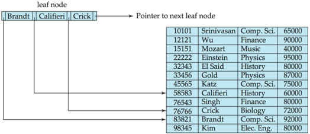

## Database Management Systems

Partha Pratim Das

## Module 43

Partha Pratim Das

Objectives &amp; Outline

B+-Tree Index Files

Simple B + Tree Index Files

Nodes

Observations

Query

Duplicates

Updates

Insertion

Deletion

File Organization

Non-Unique Keys

Relocation and Secondary Indices

Strings

B-Tree Index Files

Comparison

Module Summary

## B + Tree Index Files (6): Non-Leaf Nodes

- Non leaf nodes form a multi-level sparse index on the leaf nodes. For a non-leaf node with m pointers:
- All the search-keys in the subtree to which P 1 points are less than K 1
- For 2 ≤ i ≤ n -1, all the search-keys in the subtree to which Pi points have values greater than or equal to K i -1 and less than K i
- All the search-keys in the subtree to which Pn points have values greater than or equal to K n -1

P1

K1

P2

Pn-1

Kn-1

Pn

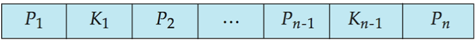

Module 43

Partha Pratim

Das

Objectives &amp;

Outline

B+-Tree Index

Files

Simple B +

Index Files

Nodes

Observations

Query

Duplicates

Updates

Insertion

Deletion

File Organization

Non-Unique Keys

Relocation and

Secondary Indices

Strings

B-Tree Index

Files

Comparison

Module Summary

Tree

## B + Tree Index Files (7): Example

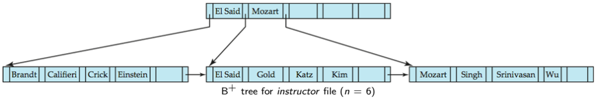

- Leaf nodes must have between 3 and 5 values: glyph[ceilingleft] n -1 2 glyph[ceilingright] and n -1, with n = 6
- Non-leaf nodes other than root must have between 3 and 6 children: glyph[ceilingleft] n 2 glyph[ceilingright] and n with n = 6
- Root must have at least 2 children

Module 43

Partha Pratim Das

Objectives &amp; Outline

B+-Tree Index Files

Simple B +

Tree

Index Files

Nodes

Observations

Query

Duplicates

Updates

Insertion

Deletion

File Organization

Non-Unique Keys

Relocation and Secondary Indices

Strings

B-Tree Index Files

Comparison

Module Summary

## B + Tree Index Files: Observations

- Since the inter-node connections are done by pointers, logically close blocks need not be physically close
- The non-leaf levels of the B + tree form a hierarchy of sparse indices
- The B + tree contains a relatively small number of levels
- Level below root has at least 2 ∗ ⌈ n ⌉ values
- Next level has at least 2 ∗ glyph[ceilingleft] n glyph[ceilingright] ∗ glyph[ceilingleft] n glyph[ceilingright] values
- 2
- 2 2
- ... etc.
- If there are K search-key values in the file, the tree height is no more than glyph[ceilingleft] log glyph[ceilingleft] n / 2 glyph[ceilingright] ( K ) glyph[ceilingright]
- thus searches can be conducted efficiently
- Insertions and deletions to the main file can be handled efficiently, as the index can be restructured in logarithmic time

Database Management Systems

Partha Pratim Das

43.19

## Module 43

Partha Pratim Das

Objectives &amp; Outline

B+-Tree Index

Files

Simple B +

Index Files

Nodes

Observations

Query

Duplicates

Updates

Insertion

Deletion

File Organization

Non-Unique Keys

Relocation and

Secondary Indices

Strings

B-Tree Index Files

Comparison

Module Summary

Tree

## B + Tree Index Files: Queries

- Find record with search-key value V
- a) C = root
- b) While C is not a leaf node
- i) Let i be least value such that V ≤ K i
- ii) If no such exists, set C = last non-null pointer in C
- iii) Else { if ( V = K i ) Set C = P i +1 else set C = P i }
- c) Let i be least value s.t. K i = V
- d) If there is such a value i, follow pointer Pi to the desired record
- e) Else no record with search-key value k exists

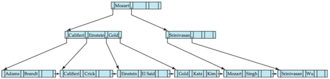

Database Management Systems

Partha Pratim Das

## Module 43

Partha Pratim Das

Objectives &amp; Outline

B+-Tree Index Files

Simple B +

Tree

Index Files

Nodes

Observations

Query

Duplicates

Updates

Insertion

Deletion

File Organization

Non-Unique Keys

Relocation and

Secondary Indices

Strings

B-Tree Index Files

Comparison

Module Summary

## B + Trees Index Files: Queries (2)

- If there are K search-key values in the file, the height of the tree is no more than ⌈ log glyph[ceilingleft] n 2 glyph[ceilingright] ( K ) ⌉
- A node is generally the same size as a disk block, typically 4 kilobytes
- and n is typically around 100 (40 bytes per index entry)
- With 1 million search key values and n = 100
- at most log 50 (1 , 000 , 000) = 4 nodes are accessed in a lookup
- Contrast this with a balanced binary tree with 1 million search key values - around 20 nodes are accessed in a lookup
- above difference is significant since every node access may need a disk I/O, costing around 20 milliseconds

## Module 43

Partha Pratim Das

Objectives &amp; Outline

B+-Tree Index Files

Simple B +

Tree

Index Files

Nodes

Observations

Query

Duplicates

Updates

Insertion

Deletion

File Organization

Non-Unique Keys

Relocation and Secondary Indices

Strings

B-Tree Index Files

Comparison

Module Summary

## B + Tree Index Files: Handling Duplicates

- With duplicate search keys
- In both leaf and internal nodes,
- glyph[triangleright] we cannot guarantee that K 1 &lt; K 2 &lt; K 3 &lt; · · · &lt; K n -1
- glyph[triangleright] but can guarantee K 1 ≤ K 2 ≤ K 3 ≤ · · · ≤ K n -1
- Search-keys in the subtree to which P i points
- glyph[triangleright] are ≤ K i , but not necessarily &lt; K i ,
- glyph[triangleright] To see why, suppose same search key value V is present in two leaf node L i and L i +1 . Then in parent node K i must be equal to V

## Module 43

Partha Pratim Das

Objectives &amp; Outline

B+-Tree Index Files

Simple B +

Tree

Index Files

Nodes

Observations

Query

Duplicates

Updates

Insertion

Deletion

File Organization

Non-Unique Keys

Relocation and Secondary Indices

Strings

B-Tree Index Files

Comparison

Module Summary

## B + Tree Index Files: Handling Duplicates (2)

- We modify find procedure as follows
- traverse P i even if V = K i
- As soon as we reach a leaf node C check if C has only search key values less than V glyph[triangleright] if so set C = right sibling of C before checking whether C contains V
- Procedure printAll
- uses modified find procedure to find first occurrence of V
- Traverse through consecutive leaves to find all occurrences of V

## Module 43

Partha Pratim Das

Objectives &amp; Outline

B+-Tree Index Files

Simple B +

Tree

Index Files

Nodes

Observations

Query

Duplicates

Updates

Insertion

Deletion

File Organization

Non-Unique Keys

Relocation and Secondary Indices

Strings

B-Tree Index Files

Comparison

Module Summary

## Updates on B + Trees: Insertion

- Find the leaf node in which the search-key value would appear
- If the search-key value is already present in the leaf node
- Add record to the file
- If necessary add a pointer to the bucket
- If the search-key value is not present, then
- Add the record to the main file (and create a bucket if necessary)
- If there is room in the leaf node, insert (key-value, pointer) pair in the leaf node
- Otherwise, split the node (along with the new (key-value, pointer) entry) as discussed in the next slide

## Module 43

Partha Pratim Das

Objectives &amp; Outline

B+-Tree Index Files

Simple B +

Tree

Index Files

Nodes

Observations

Query

Duplicates

Updates

Insertion

Deletion

File Organization

Non-Unique Keys

Relocation and

Secondary Indices

Strings

B-Tree Index Files

Comparison

Module Summary

## Updates on B + Trees: Insertion (2)

- Splitting a leaf node:
- take the n (search-key value, pointer) pairs (including the one being inserted) in sorted order. Place the first ⌈ n 2 ⌉ in the original node, and the rest in a new node
- let the new node be p , and let k be the least key value in p . Insert ( k , p ) in the parent of the node being split
- If the parent is full, split it and propagate the split further up
- Splitting of nodes proceeds upwards till a node that is not full is found
- In the worst case the root node may be split increasing the height of the tree by 1

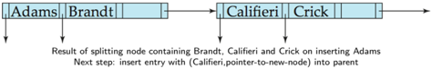

## Module 43

Partha Pratim Das

Objectives &amp; Outline

B+-Tree Index

Files

Simple B +

Index Files

Nodes

Observations

Query

Duplicates

Updates

Insertion

Deletion

File Organization

Non-Unique Keys

Relocation and

Secondary Indices

Strings

B-Tree Index

Files

Comparison

Module Summary

Tree

## Updates on B + Trees: Insertion (3)

- Splitting a non-leaf node: when inserting ( k , p ) into an already full internal node N
- Copy N to an in-memory area M with space for n +1 pointers and n keys
- Insert ( k , p ) into M
- Copy P 1 , K 1 , · · · , K glyph[ceilingleft] n 2 glyph[ceilingright] -1 , P glyph[ceilingleft] n 2 glyph[ceilingright] from M back into node N
- Insert ( K glyph[ceilingleft] n 2 glyph[ceilingright] , N ′ ) into parent N
- Copy P glyph[ceilingleft] n 2 glyph[ceilingright] +1 , K glyph[ceilingleft] n 2 glyph[ceilingright] +1 , · · · , K n , P n +1 from M into newly allocated node N ′
- Read pseudocode in book!

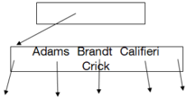

Database Management Systems

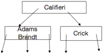

Partha Pratim Das

Module 43

Partha Pratim

Das

Objectives &amp;

Outline

B+-Tree Index

Files

Simple B +

Index Files

Nodes

Observations

Query

Duplicates

Updates

Insertion

Deletion

File Organization

Non-Unique Keys

Relocation and

Secondary Indices

Strings

B-Tree Index

Files

Comparison

Module Summary

Tree

## Updates on B + Trees: Insertion Example

Morart

Einstein

Gold

Root node

Internal nodes

Leaf nodes

Brandt

Califieri

Crickl

Einstein

El Said

Katz

Kim

Morart

Singh

Srinivasan

Wu

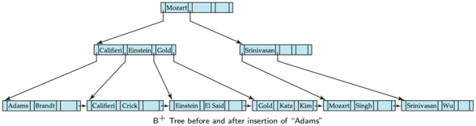

Database Management Systems

Partha Pratim Das

## Updates on B + Trees: Insertion Example (2)

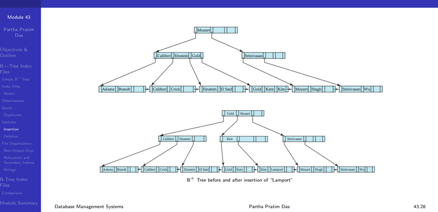

## Module 43

Partha Pratim Das

Objectives &amp; Outline

B+-Tree Index Files

Simple B +

Tree

Index Files

Nodes

Observations

Query

Duplicates

Updates

Insertion

Deletion

File Organization

Non-Unique Keys

Relocation and Secondary Indices

Strings

B-Tree Index Files

Comparison

Module Summary

## Updates on B + Trees: Deletion

- Find the record to be deleted, and remove it from the main file and from the bucket (if present)
- Remove (search-key value, pointer) from the leaf node if there is no bucket or if the bucket has become empty
- If the node has too few entries due to the removal, and the entries in the node and a sibling fit into a single node, then merge siblings :
- Insert all the search-key values in the two nodes into a single node (the one on the left), and delete the other node.
- Delete the pair ( K i -1 , P i ), where P i is the pointer to the deleted node, from its parent, recursively using the above procedure.

## Module 43

Partha Pratim Das

Objectives &amp; Outline

B+-Tree Index Files

Simple B +

Tree

Index Files

Nodes

Observations

Query

Duplicates

Updates

Insertion

Deletion

File Organization

Non-Unique Keys

Relocation and Secondary Indices

Strings

B-Tree Index Files

Comparison

Module Summary

## Updates on B + Trees: Deletion (2)

- Otherwise, if the node has too few entries due to the removal, but the entries in the node and a sibling do not fit into a single node, then redistribute pointers :
- Redistribute the pointers between the node and a sibling such that both have more than the minimum number of entries
- Update the corresponding search-key value in the parent of the node
- The node deletions may cascade upwards till a node which has ⌈ n 2 ⌉ or more pointers is found
- If the root node has only one pointer after deletion, it is deleted and the sole child becomes the root

Module 43

Partha Pratim

Das

Objectives &amp;

Outline

B+-Tree Index

Files

Simple B +

Index Files

Nodes

Observations

Query

Duplicates

Updates

Insertion

Deletion

File Organization

Non-Unique Keys

Relocation and

Secondary Indices

Strings

B-Tree Index

Files

Comparison

Module Summary

Tree

## Updates on B + Trees: Deletion Example

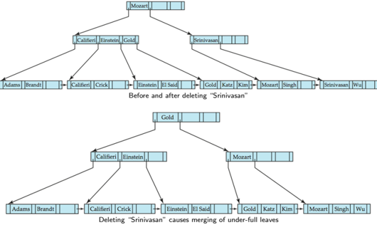

Database Management Systems

Partha Pratim Das

Module 43

Partha Pratim

Das

Objectives &amp;

Outline

B+-Tree Index

Files

Simple B +

Index Files

Nodes

Observations

Query

Duplicates

Updates

Insertion

Deletion

File Organization

Non-Unique Keys

Relocation and

Secondary Indices

Strings

B-Tree Index

Files

Comparison

Module Summary

Tree

## Updates on B + Trees: Deletion Example (2)

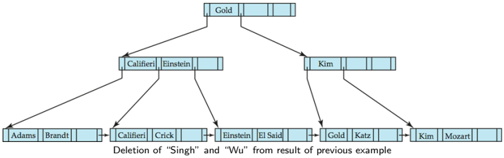

- Leaf containing Singh and Wu became underfull, and borrowed a value Kim from its left sibling
- Search-key value in the parent changes as a result

Module 43

Partha Pratim

Das

Objectives &amp;

Outline

B+-Tree Index

Files

Simple B +

Index Files

Nodes

Observations

Query

Duplicates

Updates

Insertion

Deletion

File Organization

Non-Unique Keys

Relocation and

Secondary Indices

Strings

B-Tree Index

Files

Comparison

Module Summary

Tree

## Updates on B + Trees: Deletion Example (3)

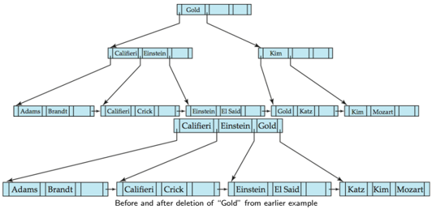

- Node with 'Gold' and 'Katz' became underfull, and was merged with its sibling
- Parent node becomes underfull, and is merged with its sibling
- Value separating two nodes (at the parent) is pulled down when merging
- Root node then has only one child, and is delete Database Management Systems Partha Pratim Das

## Module 43

Partha Pratim Das

Objectives &amp; Outline

B+-Tree Index Files

Simple B +

Tree

Index Files

Nodes

Observations

Query

Duplicates

Updates

Insertion

Deletion

File Organization

Non-Unique Keys

Relocation and Secondary Indices

Strings

B-Tree Index Files

Comparison

Module Summary

## B + Tree File Organization

- Index file degradation problem is solved by using B + Tree indices
- Data file degradation problem is solved by using B + Tree File Organization
- The leaf nodes in a B + tree file organization store records, instead of pointers
- Leaf nodes are still required to be half full
- Since records are larger than pointers, the maximum number of records that can be stored in a leaf node is less than the number of pointers in a non-leaf node
- Insertion and deletion are handled in the same way as insertion and deletion of entries in a B + tree index

Module 43

Partha Pratim

Das

Objectives &amp;

Outline

B+-Tree Index

Files

Simple B +

Index Files

Nodes

Observations

Query

Duplicates

Updates

Insertion

Deletion

File Organization

Non-Unique Keys

Relocation and

Secondary Indices

Strings

B-Tree Index

Files

Comparison

Module Summary

Tree

## B + Tree File Organization: Example

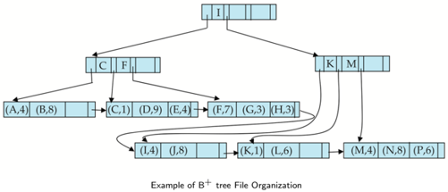

- Good space utilization important since records use more space than pointers.
- To improve space utilization, involve more sibling nodes in redistribution during splits and merges
- Involving 2 siblings in redistribution (to avoid split / merge where possible) results in each node having at least ⌈ 2 n 3 ⌉ entries

Partha Pratim Das

## Module 43

Partha Pratim Das

Objectives &amp; Outline

B+-Tree Index Files

Simple B + Tree Index Files

Nodes

Observations

Query

Duplicates

Updates

Insertion

Deletion

File Organization

Non-Unique Keys

Relocation and Secondary Indices

Strings

B-Tree Index Files

Comparison

Module Summary

## Non-Unique Search Keys

- Alternatives to scheme described earlier
- Buckets on separate block (bad idea)
- List of tuple pointers with each key
- glyph[triangleright] Extra code to handle long lists
- glyph[triangleright] Deletion of a tuple can be expensive if there are many duplicates on search key (why?)
- glyph[triangleright] Low space overhead, no extra cost for queries
- Make search key unique by adding a record-identifier
- glyph[triangleright] Extra storage overhead for keys
- glyph[triangleright] Simpler code for insertion/deletion
- glyph[triangleright] Widely used

## Module 43

Partha Pratim Das

Objectives &amp; Outline

B+-Tree Index Files

Simple B +

Tree

Index Files

Nodes

Observations

Query

Duplicates

Updates

Insertion

Deletion

File Organization

Non-Unique Keys

Relocation and Secondary Indices

Strings

B-Tree Index Files

Comparison

Module Summary

## Record Relocation and Secondary Indices

- If a record moves, all secondary indices that store record pointers have to be updated
- Node splits in B + tree file organizations become very expensive
- Solution : Use primary-index search key instead of record pointer in secondary index
- Extra traversal of primary index to locate record
- Higher cost for queries, but node splits are cheap
- Add record-id if primary-index search key is non-unique

## Module 43

Partha Pratim Das

Objectives &amp; Outline

B+-Tree Index Files

Simple B +

Tree

Index Files

Nodes

Observations

Query

Duplicates

Updates

Insertion

Deletion

File Organization

Non-Unique Keys

Relocation and Secondary Indices

Strings

B-Tree Index Files

Comparison

Module Summary

## Indexing Strings

- Variable length strings as keys
- Variable fanout
- Use space utilization as criterion for splitting, not number of pointers
- Prefix compression
- Key values at internal nodes can be prefixes of full key
- glyph[triangleright] Keep enough characters to distinguish entries in the subtrees separated by the key value
- -For example, 'Silas' and 'Silberschatz' can be separated by 'Silb'
- Keys in leaf node can be compressed by sharing common prefixes

## Module 43

Partha Pratim Das

Objectives &amp; Outline

B+-Tree Index

Files

Simple B +

Index Files

Nodes

Observations

Query

Duplicates

Updates

Insertion

Deletion

File Organization

Non-Unique Keys

Relocation and

Secondary Indices

Strings

B-Tree Index Files

Comparison

Module Summary

Tree

## B-Tree Index Files

## B-Tree Index Files

## Module 43

Partha Pratim Das

Objectives &amp; Outline

B+-Tree Index

Files

Simple B +

Index Files

Nodes

Observations

Query

Duplicates

Updates

Insertion

Deletion

File Organization

Non-Unique Keys

Relocation and

Secondary Indices

Strings

B-Tree Index Files

Comparison

Module Summary

Tree

## B-Tree Index Files

- Similar to B + tree, but B-tree allows search-key values to appear only once; eliminates redundant storage of search keys
- Search keys in non-leaf nodes appear nowhere else in the B-tree; an additional pointer field for each search key in a non-leaf node must be included
- Generalized B-tree leaf node
- Non-leaf node - pointers Bi are the bucket or file record pointers

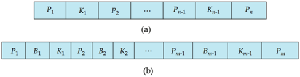

Module 43

Partha Pratim

Das

Objectives &amp;

Outline

B+-Tree Index

Files

Simple B +

Index Files

Nodes

Observations

Query

Duplicates

Updates

Insertion

Deletion

File Organization

Non-Unique Keys

Relocation and

Secondary Indices

Strings

B-Tree Index

Files

Comparison

Module Summary

Tree

## B-Tree Index File (2): Example

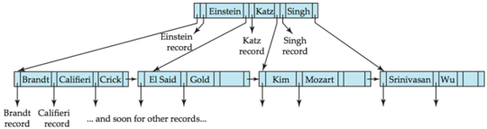

B-tree (above) and B + tree (below) on same data

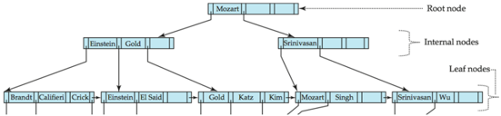

Database Management Systems

Partha Pratim Das

## Module 43

Partha Pratim Das

Objectives &amp; Outline

B+-Tree Index Files

Simple B +

Tree

Index Files

Nodes

Observations

Query

Duplicates

Updates

Insertion

Deletion

File Organization

Non-Unique Keys

Relocation and Secondary Indices

Strings

B-Tree Index Files

Comparison

Module Summary

## Comparison of B-Tree and B + Tree Index Files

- Advantages of B-Tree indices:
- May use less tree nodes than a corresponding B + Tree
- Sometimes possible to find search-key value before reaching leaf node
- Disadvantages of B-Tree indices:
- Only small fraction of all search-key values are found early
- Non-leaf nodes are larger, so fan-out is reduced. Thus, B-Trees typically have greater depth than corresponding B + Tree
- Insertion and deletion more complicated than in B + Trees
- Implementation is harder than B + Trees
- Typically, advantages of B-Trees do not outweigh disadvantages

Module 43

Partha Pratim Das

Objectives &amp; Outline

B+-Tree Index Files

Simple B +

Tree

Index Files

Nodes

Observations

Query

Duplicates

Updates

Insertion

Deletion

File Organization

Non-Unique Keys

Relocation and Secondary Indices

Strings

B-Tree Index Files

Comparison

Module Summary

## Module Summary

- Understood the design of B + Tree Index Files in depth for database persistent store
- Familiarized with B-Tree Index Files

Slides used in this presentation are borrowed from http://db-book.com/ with kind permission of the authors. Edited and new slides are marked with 'PPD'.

43.43