## Module 44

Partha Pratim Das

Objectives &amp; Outline

Static Hashing

Hash Function

Example

Bucket Overflow

Dynamic Hashing

Example

Comparison Schemes

Bitmap Indices

Module Summary

## Database Management Systems

Module 44: Indexing and Hashing/4: Hashing

## Partha Pratim Das

Department of Computer Science and Engineering Indian Institute of Technology, Kharagpur ppd@cse.iitkgp.ac.in

Partha Pratim Das

## Module 44

Partha Pratim Das

Objectives &amp; Outline

Static Hashing

Hash Function

Example

Bucket Overflow

Dynamic Hashing

Example

Comparison Schemes

Bitmap Indices

Module Summary

## Module Recap

- Understood the design of B + Tree Index Files in depth for database persistent store
- Familiarized with B-Tree Index Files

## Module 44

Partha Pratim Das

## Objectives &amp; Outline

Static Hashing Hash Function Example Bucket Overflow

Dynamic Hashing

Example

Comparison Schemes

Bitmap Indices

Module Summary

## Module Objectives

- To explore various hashing schemes - Static and Dynamic Hashing
- To compare Ordered Indexing and Hashing
- To understand the Bitmap Indices

## Module 44

Partha Pratim Das

## Objectives &amp; Outline

Static Hashing

Hash Function Example Bucket Overflow

Dynamic Hashing

Example

Comparison Schemes

Bitmap Indices

Module Summary

## Module Outline

- Static Hashing
- Dynamic Hashing
- Comparison of Ordered Indexing and Hashing
- Bitmap Indices

## Module 44

Partha Pratim Das

Objectives &amp; Outline

Static Hashing

Hash Function

Example

Bucket Overflow

Dynamic Hashing

Example

Comparison Schemes

Bitmap Indices

Module Summary

## Static Hashing

## Static Hashing

## Module 44

Partha Pratim Das

Objectives &amp; Outline

Static Hashing

Hash Function

Example

Bucket Overflow

Dynamic Hashing

Example

Comparison

Schemes

Bitmap Indices

Module Summary

## Hash Function

- A hash function h maps data of arbitrary size (from domain D ) to fixed-size values (say, integers from 0 to N &gt; 0 h : D → [0 .. N ]
- Given key k , h ( k ) is called hash values, hash codes, digests, or simply hashes

glyph[negationslash]

- If for two keys k 1 = k 2 , we have h ( k 1 ) = h ( k 2 ), we say a collision has occured
- A hash function should be Collision Free and Fast

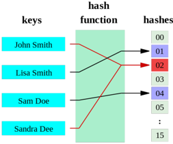

## Database Management Systems

## Partha Pratim Das

## Module 44

Partha Pratim Das

Objectives &amp; Outline

Static Hashing

Hash Function

Example

Bucket Overflow

Dynamic Hashing

Example

Comparison Schemes

Bitmap Indices

Module Summary

## Static Hashing

- A bucket is a unit of storage containing one or more records (a bucket is typically a disk block)
- In a hash file organization we obtain the bucket of a record directly from its search-key value using a hash function
- Hash function h is a function from the set of all search-key values K to the set of all bucket addresses B
- Hash function is used to locate records for access, insertion as well as deletion
- Records with different search-key values may be mapped to the same bucket; thus entire bucket has to be searched sequentially to locate a record

## Module 44

Partha Pratim Das

Objectives &amp; Outline

Static Hashing Hash Function

Example

Bucket Overflow

Dynamic Hashing

Example

Comparison Schemes

Bitmap Indices

Module Summary

## Example of Hash File Organization

Hash file organization of instructor file, using dept name as key

- There are 10 buckets
- The binary representation of the i th character is assumed to be the integer i
- The hash function returns the sum of the binary representations of the characters modulo 10
- For example

h (Music) = 1

h (History) = 2

h (Physics) = 3

h (Elec. Eng.) = 3

## Module 44

Partha Pratim Das

Objectives &amp; Outline

Static Hashing

Hash Function

Example

Bucket Overflow

Dynamic Hashing

Example

Comparison Schemes

Bitmap Indices

Module Summary

## Example of Hash File Organization

## bucket 1

## bucket 2

## bucket 4

| 12121   | Wu            | Finance   |       |
|---------|---------------|-----------|-------|
|         | 76543 | Singh | Finance   | 80000 |

## bucket 5

## bucket 6

| 32343| El Said    | History   |       |
|-------------------|-----------|-------|
| 58583 | Califieri | History   | 60000 |

|   45565 Katz |        | [Comp Sci [75000]   |
|--------------|--------|---------------------|
|        83821 | Brandt |                     |

## bucket 3

## bucket 7

| 22222  Einstein   | Physics    |   95000 |
|-------------------|------------|---------|
| 33456 Gold        | Physics    |   87000 |
| 98345  Kim        | Elec. Eng] |   80000 |

Hash file organization of instructor file, using dept name as key

Database Management Systems

Partha Pratim Das

## Module 44

Partha Pratim Das

Objectives &amp; Outline

Static Hashing Hash Function

Example

Bucket Overflow

Dynamic Hashing

Example

Comparison Schemes

Bitmap Indices

Module Summary

## Hash Functions

- Worst hash function maps all search-key values to the same bucket; this makes access time proportional to the number of search-key values in the file
- An ideal hash function is uniform , i.e., each bucket is assigned the same number of search-key values from the set of all possible values
- Ideal hash function is random , so each bucket will have the same number of records assigned to it irrespective of the actual distribution of search-key values in the file
- Typical hash functions perform computation on the internal binary representation of the search-key
- For example, for a string search-key, the binary representations of all the characters in the string could be added and the sum modulo the number of buckets could be returned

## Module 44

Partha Pratim Das

Objectives &amp; Outline

Static Hashing

Hash Function

Example

Bucket Overflow

Dynamic Hashing

Example

Comparison Schemes

Bitmap Indices

Module Summary

## Handling of Bucket Overflows

- Bucket overflow can occur because of
- Insufficient buckets
- Skew in distribution of records. This can occur due to two reasons:
- glyph[triangleright] multiple records have same search-key value
- glyph[triangleright] chosen hash function produces non-uniform distribution of key values
- Although the probability of bucket overflow can be reduced, it cannot be eliminated
- it is handled by using overflow buckets

Module 44

Partha Pratim

Das

Objectives &amp;

Outline

Static Hashing

Hash Function

Example

Bucket Overflow

Dynamic Hashing

Example

Comparison

Schemes

Bitmap Indices

Module Summary

## Handling of Bucket Overflows (2)

- Overflow chaining - the overflow buckets of a given bucket are chained together in a linked list
- Above scheme is called closed hashing
- An alternative, called open hashing , which does not use overflow buckets, is not suitable for database applications

Database Management Systems

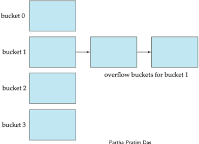

Partha Pratim Das

## Module 44

Partha Pratim Das

Objectives &amp; Outline

Static Hashing

Hash Function

Example

Bucket Overflow

Dynamic Hashing

Example

Comparison Schemes

Bitmap Indices

Module Summary

## Hash Indices

- Hashing can be used not only for file organization, but also for index-structure creation
- A hash index organizes the search keys, with their associated record pointers, into a hash file structure
- Strictly speaking, hash indices are always secondary indices
- if the file itself is organized using hashing, a separate primary hash index on it using the same search-key is unnecessary
- However, we use the term hash index to refer to both secondary index structures and hash organized files

Module 44

Partha Pratim

Das

Objectives &amp;

Outline

Static Hashing

Hash Function

Example

Bucket Overflow

Dynamic Hashing

Example

Comparison

Schemes

Bitmap Indices

Module Summary

## Example of Hash Index

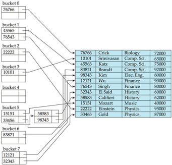

- Hash index on instructor , on attribute ID
- Computed by adding the digits modulo 8 Database Management Systems

## Module 44

Partha Pratim Das

Objectives &amp; Outline

Static Hashing

Hash Function

Example

Bucket Overflow

Dynamic Hashing

Example

Comparison Schemes

Bitmap Indices

Module Summary

## Deficiencies of Static Hashing

- In static hashing, function h maps search-key values to a fixed set of B of bucket addresses. Databases grow or shrink with time
- If initial number of buckets is too small, and file grows, performance will degrade due to too much overflows
- If space is allocated for anticipated growth, a significant amount of space will be wasted initially (and buckets will be underfull).
- If database shrinks, again space will be wasted
- One solution: periodic re-organization of the file with a new hash function
- Expensive, disrupts normal operations
- Better solution : allow the number of buckets to be modified dynamically

## Module 44

Partha Pratim Das

Objectives &amp; Outline

Static Hashing

Hash Function

Example

Bucket Overflow

Dynamic Hashing

Example

Comparison Schemes

Bitmap Indices

Module Summary

## Dynamic Hashing

## Dynamic Hashing

## Module 44

Partha Pratim Das

Objectives &amp; Outline

Static Hashing Hash Function Example Bucket Overflow

Dynamic Hashing

Example

Comparison Schemes

Bitmap Indices

Module Summary

## Dynamic Hashing

- Good for database that grows and shrinks in size
- Allows the hash function to be modified dynamically
- Extendable hashing - one form of dynamic hashing
- Hash function generates values over a large range - typically b -bit integers, with b = 32
- At any time use only a prefix of the hash function to index into a table of bucket addresses
- Let the length of the prefix be i bits, 0 ≤ i ≤ 32
- glyph[triangleright] Bucket address table size = 2 i . Initially i = 0
- glyph[triangleright] Value of i grows and shrinks as the size of the database grows and shrinks
- Multiple entries in the bucket address table may point to a bucket (why?)
- Thus, actual number of buckets is &lt; 2 i
- glyph[triangleright] The number of buckets also changes dynamically due to coalescing and splitting of buckets

Module 44

Partha Pratim

Das

Objectives &amp;

Outline

Static Hashing

Hash Function

Example

Bucket Overflow

Dynamic Hashing

Example

Comparison

Schemes

Bitmap Indices

Module Summary

## General Extendable Hash Structure

In this structure, i 2 = i 3 = i , whereas i 1 = i -1 Decode i j number of bits to find the record in bucket j . i j ≤ i .

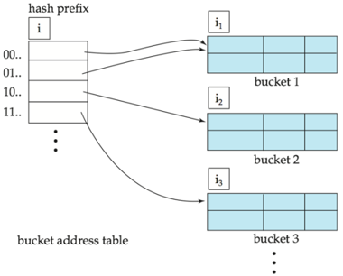

Database Management Systems

Partha Pratim Das

## Module 44

Partha Pratim Das

Objectives &amp; Outline

Static Hashing

Hash Function

Example

Bucket Overflow

Dynamic Hashing

Example

Comparison Schemes

Bitmap Indices

Module Summary

## Use of Extendable Hash Structure

- Each bucket j stores a value i j
- All the entries that point to the same bucket have the same values on the first i j bits
- To locate the bucket containing search-key K j
- Compute h ( K j ) = X
- Use the first i high order bits of X as a displacement into bucket address table, and follow the pointer to appropriate bucket
- To insert a record with search-key value K j
- Follow same procedure as look-up and locate the bucket, say j
- If there is room in the bucket j insert record in the bucket
- Else the bucket must be split and insertion re-attempted (next slide)
- glyph[triangleright] Overflow buckets used instead in some cases (will see shortly)

## Module 44

Partha Pratim Das

Objectives &amp; Outline

Static Hashing

Hash Function

Example

Bucket Overflow

Dynamic Hashing

Example

Comparison

Schemes

Bitmap Indices

Module Summary

## Insertion in Extendable Hash Structure

## To split a bucket j when inserting record with search-key value K j

- If i &gt; i j (more than one pointer to bucket j )
- Allocate a new bucket z , and set i j = i z = ( i j +1)
- Update the second half of the bucket address table entries originally pointing to j , to point to z
- Remove each record in bucket j and reinsert (in j or z )
- Recompute new bucket for K j and insert record in the bucket (further splitting is required if the bucket is still full)
- If i = i j (only one pointer to bucket j )
- If i reaches some limit b , or too many splits have happened in this insertion, create an overflow bucket
- Else
- glyph[triangleright] Increment i and double the size of the bucket address table
- glyph[triangleright] Replace each entry in the table by two entries that point to the same bucket
- glyph[triangleright] Recompute new bucket address table entry for K j . Now i &gt; i j so use the first case above Database Management Systems Partha Pratim Das

## Module 44

Partha Pratim Das

Objectives &amp; Outline

Static Hashing

Hash Function Example Bucket Overflow

Dynamic Hashing

Example

Comparison Schemes

Bitmap Indices

Module Summary

## Deletion in Extendable Hash Structure

- To delete a key value,
- locate it in its bucket and remove it
- The bucket itself can be removed if it becomes empty (with appropriate updates to the bucket address table)
- Coalescing of buckets can be done (can coalesce only with a 'buddy' bucket having same value of i j and same i j -1 prefix, if it is present)
- Decreasing bucket address table size is also possible
- glyph[triangleright] Note: decreasing bucket address table size is an expensive operation and should be done only if number of buckets becomes much smaller than the size of the table

Module 44

Partha Pratim

Das

Objectives &amp;

Outline

Static Hashing

Hash Function

Example

Bucket Overflow

Dynamic Hashing

Example

Comparison

Schemes

Bitmap Indices

Module Summary

## Use of Extendable Hash Structure: Example

| dept_name                                                  | h(dept_name)                                                                                                                                                                                                                                                                            |
|------------------------------------------------------------|-----------------------------------------------------------------------------------------------------------------------------------------------------------------------------------------------------------------------------------------------------------------------------------------|
| Sci. Elec. Finance History Music Physics Biology Comp. Eng | 0010 1101 1111 1011 0010 1100 0011 0OOO 1111 0001 0010 0100 1001 0011 0110 1101 0100 0011 1010 1100 1100 0110 1101 1111 1010 0011 1010 0000 1100 0110 1001 1111 1100 0111 1110 1101 1011 1111 0011 1010 0011 0101 1010 0110 1100 1001 1110 1011 1001 1000 0011 1111 1001 1100 000O 0001 |

## Module 44

Partha Pratim

Das

Objectives &amp;

Outline

Static Hashing

Hash Function

Example

Bucket Overflow

Dynamic Hashing

Example

Comparison

Schemes

Bitmap Indices

Module Summary

## Example (2)

- Initial Hash structure; bucket size = 2
- Insert 'Mozart', 'Srinivasan', and 'Wu' records

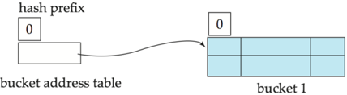

## Database Management Systems

## Partha Pratim Das

| dept_namte   | h(dept_name)                            |
|--------------|-----------------------------------------|
| Biology      | 0010 1101 1111 1011 0010 1100 0011 OOOO |
| Comp. Sci.   | 1111 0001 0010 0100 1001 0011 0110 1101 |
| Elec. Eng    | 0100 0011 1010 1100 1100 0110 1101 1111 |
| Finance      | 1010 0011 1010 OOOO 1100 0110 1001 1111 |
| History      | 1100 0111 1110 1101 1011 1111 0011 1010 |
| Music        | 0011 0101 1010 0110 1100 1001 1110 1011 |
| Physics      | 1001 1000 0011 1111 1001 1100 000O 0001 |

|   76766 | Crick      |          |   72000 |
|---------|------------|----------|---------|
|   10101 | Srinivasan | Comp Sc. |   65000 |
|   45565 |            |          |   75000 |
|   83821 | Brandt     |          |   92000 |
|   98345 | Kim        | Eng      |   80000 |
|   12121 | Wu         |          |   90000 |
|   76543 | Singh      | Finance  |   80000 |
|   32343 | El Said    | History  |   60000 |
|   58583 | Califieri  | History  |   62000 |
|   15151 | Mozart     | Music    |   40000 |
|   22222 | Einstein   | Physics  |   95000 |
|   33465 | Cold       | Physics  |   87000 |

44.23

Module 44

Partha Pratim

Das

Objectives &amp;

Outline

Static Hashing

Hash Function

Example

Bucket Overflow

Dynamic Hashing

Example

Comparison

Schemes

Bitmap Indices

Module Summary

## Example (3)

- Hash structure after insertion of 'Mozart', 'Srinivasan', and 'Wu' records
- Insert Einstein record

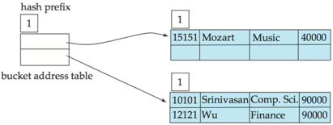

## Database Management Systems

Partha Pratim Das dept\_namte

Biology

Elec.

Comp. Sci.

Finance

Eng

History

Music

Physics

## h(dept\_name)

0010 1101 1111 1011 0010 1100 0011 OOOO 1111 0001 0010 0100 1001 0011 0110 1101 0100 0011 1010 1100 1100 0110 1101 1111 1010 0011 1010 OOOO 1100 0110 1001 1111 1100 0111 1110 1101 1011 1111 0011 1010 0011 0101 1010 0110 1100 1001 1110 1011 1001 1000 0011 1111 1001 1100 000O 0001

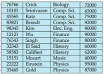

|   76766 | Crick      |          |   72000 |
|---------|------------|----------|---------|
|   10101 | Srinivasan | Comp Sc. |   65000 |
|   45565 |            |          |   75000 |
|   83821 | Brandt     |          |   92000 |
|   98345 | Kim        | Eng      |   80000 |
|   12121 | Wu         |          |   90000 |
|   76543 | Singh      | Finance  |   80000 |
|   32343 | El Said    | History  |   60000 |
|   58583 | Califieri  | History  |   62000 |
|   15151 | Mozart     | Music    |   40000 |
|   22222 | Einstein   | Physics  |   95000 |
|   33465 | Cold       | Physics  |   87000 |

Module 44

Partha Pratim

Das

Objectives &amp;

Outline

Static Hashing

Hash Function

Example

Bucket Overflow

Dynamic Hashing

Example

Comparison

Schemes

Bitmap Indices

Module Summary

## Example (4)

## · Hash structure after insertion of 'Einstein' record

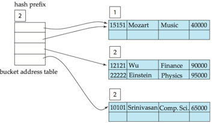

## · Insert 'Gold' and 'El Said' records

## Database Management Systems

## Partha Pratim Das

dept\_namte

Biology

Elec.

Comp. Sci.

Finance

Eng

History

Music

Physics

## h(dept\_name)

0010 1101 1111 1011 0010 1100 0011 OOOO 1111 0001 0010 0100 1001 0011 0110 1101 0100 0011 1010 1100 1100 0110 1101 1111 1010 0011 1010 OOOO 1100 0110 1001 1111 1100 0111 1110 1101 1011 1111 0011 1010 0011 0101 1010 0110 1100 1001 1110 1011 1001 1000 0011 1111 1001 1100 000O 0001

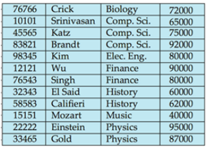

|   76766 | Crick      |          |   72000 |
|---------|------------|----------|---------|
|   10101 | Srinivasan | Comp Sc. |   65000 |
|   45565 |            |          |   75000 |
|   83821 | Brandt     |          |   92000 |
|   98345 | Kim        | Eng      |   80000 |
|   12121 | Wu         |          |   90000 |
|   76543 | Singh      | Finance  |   80000 |
|   32343 | El Said    | History  |   60000 |
|   58583 | Califieri  | History  |   62000 |
|   15151 | Mozart     | Music    |   40000 |
|   22222 | Einstein   | Physics  |   95000 |
|   33465 | Cold       | Physics  |   87000 |

Module 44

Partha Pratim

Das

Objectives &amp;

Outline

Static Hashing

Hash Function

Example

Bucket Overflow

Dynamic Hashing

Example

Comparison

Schemes

Bitmap Indices

Module Summary

## Example (5)

- Hash structure after insertion of 'Gold' and 'El Said' records
- Insert Katz record

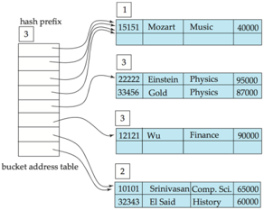

## Database Management Systems

## Partha Pratim Das

dept\_namte

Biology

Elec.

Comp. Sci.

Finance

Eng

History

Music

Physics

## h(dept\_name)

0010 1101 1111 1011 0010 1100 0011 OOOO 1111 0001 0010 0100 1001 0011 0110 1101 0100 0011 1010 1100 1100 0110 1101 1111 1010 0011 1010 OOOO 1100 0110 1001 1111 1100 0111 1110 1101 1011 1111 0011 1010 0011 0101 1010 0110 1100 1001 1110 1011 1001 1000 0011 1111 1001 1100 000O 0001

|   76766 | Crick      |          |   72000 |
|---------|------------|----------|---------|
|   10101 | Srinivasan | Comp Sc. |   65000 |
|   45565 |            |          |   75000 |
|   83821 | Brandt     |          |   92000 |
|   98345 | Kim        | Eng      |   80000 |
|   12121 | Wu         |          |   90000 |
|   76543 | Singh      | Finance  |   80000 |
|   32343 | El Said    | History  |   60000 |
|   58583 | Califieri  | History  |   62000 |
|   15151 | Mozart     | Music    |   40000 |
|   22222 | Einstein   | Physics  |   95000 |
|   33465 | Cold       | Physics  |   87000 |

Module 44

Partha Pratim

Das

Objectives &amp;

Outline

Static Hashing

Hash Function

Example

Bucket Overflow

Dynamic Hashing

Example

Comparison

Schemes

Bitmap Indices

Module Summary

## Example (6)

## · Hash structure after insertion of 'Katz' record

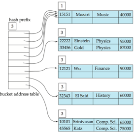

## · Insert 'Singh', 'Califieri', 'Crick', 'Brandt' records

## Database Management Systems

## Partha Pratim Das

| dept_namte   | h(dept_name)                            |
|--------------|-----------------------------------------|
| Biology      | 0010 1101 1111 1011 0010 1100 0011 OOOO |
| Comp. Sci.   | 1111 0001 0010 0100 1001 0011 0110 1101 |
| Elec. Eng    | 0100 0011 1010 1100 1100 0110 1101 1111 |
| Finance      | 1010 0011 1010 OOOO 1100 0110 1001 1111 |
| History      | 1100 0111 1110 1101 1011 1111 0011 1010 |
| Music        | 0011 0101 1010 0110 1100 1001 1110 1011 |
| Physics      | 1001 1000 0011 1111 1001 1100 000O 0001 |

|   76766 | Crick      |          |   72000 |
|---------|------------|----------|---------|
|   10101 | Srinivasan | Comp Sc. |   65000 |
|   45565 |            |          |   75000 |
|   83821 | Brandt     |          |   92000 |
|   98345 | Kim        | Eng      |   80000 |
|   12121 | Wu         |          |   90000 |
|   76543 | Singh      | Finance  |   80000 |
|   32343 | El Said    | History  |   60000 |
|   58583 | Califieri  | History  |   62000 |
|   15151 | Mozart     | Music    |   40000 |
|   22222 | Einstein   | Physics  |   95000 |
|   33465 | Cold       | Physics  |   87000 |

Module 44

Partha Pratim

Das

Objectives &amp;

Outline

Static Hashing

Hash Function

Example

Bucket Overflow

Dynamic Hashing

Example

Comparison

Schemes

Bitmap Indices

Module Summary

## Example (7)

- Hash structure after insertion of 'Singh', 'Califieri', 'Crick', 'Brandt' records

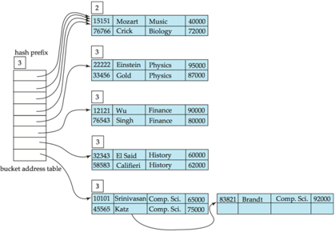

## · Insert Kim record

Database Management Systems

## Partha Pratim Das

| dept_name   | h(dept_name)                            |
|-------------|-----------------------------------------|
| Biology     | 0010 1101 1111 1011 0010 1100 0011 0OOO |
| Comp. Sci.  | 1111 0001 0010 0100 1001 0011 0110 1101 |
| Elec Eng    | 0100 0011 1010 1100 1100 0110 1101 1111 |
| Finance     |                                         |
| History     | 1100 0111 1110 1101 1011 1111 0011 1010 |
| Music       | 0011 0101 1010 0110 1100 1001 1110 1011 |
| Physics     |                                         |

|   76766 | Crick      | Biology   |   72000 |
|---------|------------|-----------|---------|
|   10101 | Srinivasan |           |   65000 |
|   45565 |            |           |   75000 |
|   83821 | Brandt     | Sa. Comp  |   92000 |
|   98345 | Kim        | Elec: Eng |   80000 |
|   12121 | Wu         | Finance   |   90000 |
|   76543 | Singh      | Finance   |   80000 |
|   32343 | El Said    | History   |   60000 |
|   58583 | Califieri  | History   |   62000 |
|   15151 | Mozart     | Music     |   40000 |
|   22222 | Einstein   | Physics   |   95000 |
|   33465 | Gold       | Physics   |   87000 |

## Example (8)

| dept_name   | h(dept_name)                            |
|-------------|-----------------------------------------|
| Biology     | 0010 1101 1111 1011 0010 1100 0011 0OOO |
| Comp. Sci.  | 1111 0001 0010 0100 1001 0011 0110 1101 |
| Elec Eng    | 0100 0011 1010 1100 1100 0110 1101 1111 |
| Finance     |                                         |
| History     | 1100 0111 1110 1101 1011 1111 0011 1010 |
| Music       | 0011 0101 1010 0110 1100 1001 1110 1011 |
| Physics     |                                         |

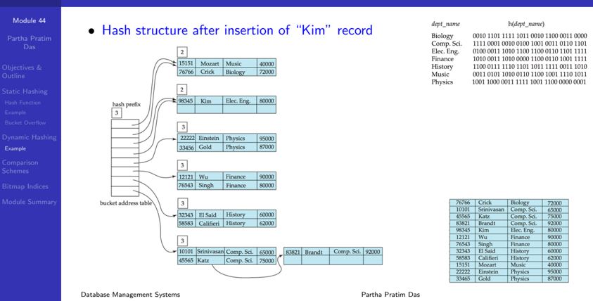

Module 44

Partha Pratim Das

Objectives &amp; Outline

Static Hashing

Hash Function

Example

Bucket Overflow

Dynamic Hashing

Example

Comparison Schemes

Bitmap Indices

Module Summary

## Comparison Schemes

## Comparison Schemes

## Module 44

Partha Pratim Das

Objectives &amp; Outline

Static Hashing

Hash Function

Example

Bucket Overflow

Dynamic Hashing

Example

Comparison Schemes

Bitmap Indices

Module Summary

## Extendable Hashing vs. Other Schemes

- Benefits of extendable hashing:
- Hash performance does not degrade with growth of file
- Minimal space overhead
- Disadvantages of extendable hashing
- Extra level of indirection to find desired record
- Bucket address table may itself become very big (larger than memory)
- glyph[triangleright] Cannot allocate very large contiguous areas on disk either
- glyph[triangleright] Solution: B + -tree structure to locate desired record in bucket address table
- Changing size of bucket address table is an expensive operation
- Linear hashing is an alternative mechanism
- Allows incremental growth of its directory (equivalent to bucket address table)
- At the cost of more bucket overflows

## Module 44

Partha Pratim Das

Objectives &amp; Outline

Static Hashing

Hash Function

Example

Bucket Overflow

Dynamic Hashing Example

Comparison Schemes

Bitmap Indices

Module Summary

## Comparison of Ordered Indexing and Hashing

- Cost of periodic re-organization
- Relative frequency of insertions and deletions
- Is it desirable to optimize average access time at the expense of worst-case access time?
- Expected type of queries:
- Hashing is generally better at retrieving records having a specified value of the key
- If range queries are common, ordered indices are to be preferred
- In practice :
- PostgreSQL supports hash indices, but discourages use due to poor performance
- Oracle supports static hash organization, but not hash indices
- SQLServer supports only B + -trees

Module 44

Partha Pratim Das

Objectives &amp; Outline

Static Hashing

Hash Function

Example

Bucket Overflow

Dynamic Hashing

Example

Comparison Schemes

Bitmap Indices

Module Summary

## Bitmap Indices

## Bitmap Indices

## Module 44

Partha Pratim Das

Objectives &amp; Outline

Static Hashing

Hash Function

Example

Bucket Overflow

Dynamic Hashing

Example

Comparison Schemes

Bitmap Indices

Module Summary

## Bitmap Indices

- Bitmap indices are a special type of index designed for efficient querying on multiple keys
- Records in a relation are assumed to be numbered sequentially from, say, 0
- Given a number n it must be easy to retrieve record n
- glyph[triangleright] Particularly easy if records are of fixed size
- Applicable on attributes that take on a relatively small number of distinct values
- For example: gender, country, state, . . .
- For example: income-level (income broken up into a small number of levels such as 0-9999, 10000-19999, 20000-50000, 50000- infinity)
- A bitmap is simply an array of bits

Module 44

Partha Pratim

Das

Objectives &amp;

Outline

Static Hashing

Hash Function

Example

Bucket Overflow

Dynamic Hashing

Example

Comparison

Schemes

Bitmap Indices

Module Summary

## Bitmap Indices (2)

- In its simplest form a bitmap index on an attribute has a bitmap for each value of the attribute
- Bitmap has as many bits as records
- In a bitmap for value v, the bit for a record is 1 if the record has the value v for the attribute, and is 0 otherwise

| record number   |    ID | gender   | income_level   |
|-----------------|-------|----------|----------------|
|                 | 76766 | m        | Ll             |
|                 | 22222 |          | L2             |
|                 | 12121 |          | Ll             |
|                 | 15151 | m        | L4             |
|                 | 58583 |          | L3             |

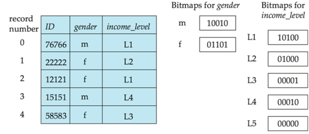

Database Management Systems

Partha Pratim Das

44.35

## Module 44

Partha Pratim Das

Objectives &amp; Outline

Static Hashing

Hash Function

Example

Bucket Overflow

Dynamic Hashing

Example

Comparison Schemes

Bitmap Indices

Module Summary

## Bitmap Indices (3)

- Bitmap indices are useful for queries on multiple attributes
- not particularly useful for single attribute queries
- Queries are answered using bitmap operations
- Intersection (and)
- Union (or)
- Complementation (not)
- Each operation takes two bitmaps of the same size and applies the operation on corresponding bits to get the result bitmap
- ◦
- For example: 100110 AND 110011 = 100010 100110 OR 110011 = 110111 NOT 100110 = 011001
- Males with income level L1: 10010 AND 10100 = 10000
- glyph[triangleright] Can then retrieve required tuples
- glyph[triangleright] Counting number of matching tuples is even faster

Partha Pratim Das

## Module 44

Partha Pratim Das

Objectives &amp; Outline

Static Hashing

Hash Function

Example

Bucket Overflow

Dynamic Hashing

Example

Comparison Schemes

Bitmap Indices

Module Summary

## Bitmap Indices (4)

- Bitmap indices generally very small compared with relation size
- For example, if record is 100 bytes, space for a single bitmap is 1/800 of space used by relation
- glyph[triangleright] If number of distinct attribute values is 8, bitmap is only 1% of relation size
- Deletion needs to be handled properly
- Existence bitmap to note if there is a valid record at a record location
- Needed for complementation
- glyph[triangleright] not( A=v ): (NOT bitmap-A-v) AND ExistenceBitmap
- Should keep bitmaps for all values, even null value
- To correctly handle SQL null semantics for NOT( A=v ):
- glyph[triangleright] intersect above result with (NOT bitmap-A-Null )

## Module 44

Partha Pratim Das

Objectives &amp; Outline

Static Hashing

Hash Function

Example

Bucket Overflow

Dynamic Hashing

Example

Comparison Schemes

Bitmap Indices

Module Summary

## Bitmap Indices (5): Efficient Bitmap Operations

- Bitmaps are packed into words; a single word and (a basic CPU instruction) computes and of 32 or 64 bits at once
- For example, 1-million-bit maps can be and-ed with just 31,250 instruction
- Counting number of 1s can be done fast by a trick:
- Use each byte to index into a precomputed array of 256 elements each storing the count of 1s in the binary representation
- glyph[triangleright] Can use pairs of bytes to speed up further at a higher memory cost
- Add up the retrieved counts
- Bitmaps can be used instead of Tuple-ID lists at leaf levels of B + -trees, for values that have a large number of matching records
- Worthwhile if &gt; 1 / 64 of the records have that value, assuming a tuple-id is 64 bits
- Above technique merges benefits of bitmap and B + -tree indices

## Module 44

Partha Pratim Das

Objectives &amp; Outline

Static Hashing

Hash Function Example Bucket Overflow

Dynamic Hashing

Example

Comparison Schemes

Bitmap Indices

Module Summary

## Module Summary

- Explored various hashing schemes - Static and Dynamic Hashing
- Compared Ordered Indexing and Hashing
- Studied the use of Bitmap Indices for fast access of columns with limited number of distinct values

Slides used in this presentation are borrowed from http://db-book.com/ with kind permission of the authors.

Edited and new slides are marked with 'PPD'.

Database Management Systems

Partha Pratim Das

44.39