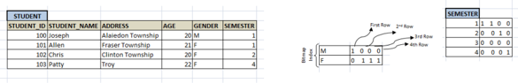
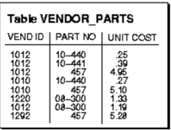

## Module 45

Partha Pratim Das

Objectives &amp; Outline

Index Definition in SQL

Multiple-Key Access

Privileges

Guidelines for Indexing Ground Rules

Rule 0

Rule 1

Rule 2

Rule 3

Rule 4

Rule 5

Rule 6

Module Summary

Database Management Systems

## Database Management Systems

Module 45: Indexing and Hashing/5: Index Design

## Partha Pratim Das

Department of Computer Science and Engineering Indian Institute of Technology, Kharagpur ppd@cse.iitkgp.ac.in

Partha Pratim Das

## Module 45

Partha Pratim Das

## Objectives &amp; Outline

Index Definition in SQL

Multiple-Key Access

Privileges

Guidelines for

Indexing

Ground Rules

Rule 0

Rule 1

Rule 2

Rule 3

Rule 4

Rule 5

Rule 6

Module Summary

## Module Recap

- Explored various hashing schemes - Static and Dynamic Hashing
- Compared Ordered Indexing and Hashing
- Studied the use of Bitmap Indices for fast access of columns with limited number of distinct values

## Module 45

Partha Pratim Das

## Objectives &amp; Outline

Index Definition in SQL

Multiple-Key Access

Privileges

Guidelines for

Indexing

Ground Rules

Rule 0

Rule 1

Rule 2

Rule 3

Rule 4

Rule 5

Rule 6

Module Summary

## Module Objectives

- To discuss how Indexes can be created in SQL
- To deliberate on good index designs in terms of Guidelines for Indexing

## Module 45

Partha Pratim Das

Objectives &amp; Outline

Index Definition in SQL

Multiple-Key Access

Privileges

Guidelines for

Indexing

Ground Rules

Rule 0

Rule 1

Rule 2

Rule 3

Rule 4

Rule 5

Rule 6

Module Summary

## Module Outline

- Index Definition in SQL
- Guidelines for Indexing

Module 45

Partha Pratim Das

Objectives &amp; Outline

Index Definition in SQL

Multiple-Key Access

Privileges

Guidelines for

Indexing

Ground Rules

Rule 0

Rule 1

Rule 2

Rule 3

Rule 4

Rule 5

Rule 6

Module Summary

## Index Definition in SQL

## Index Definition in SQL

Module 45

Partha Pratim Das

Objectives &amp; Outline

Index Definition in SQL

Multiple-Key Access

Privileges

Guidelines for

Indexing

Ground Rules

Rule 0

Rule 1

Rule 2

Rule 3

Rule 4

Rule 5

Rule 6

Module Summary

## Index in SQL

- Create an index

create index &lt; index-name &gt; on &lt; relation-name &gt; ( &lt; attribute-list &gt; )

For example: create index b-index on branch ( branch name )

- Use create unique index to indirectly specify and enforce the condition that the search key is a candidate key
- Not really required if SQL unique integrity constraint is supported - it is preferred
- To drop an index

drop index &lt; index-name &gt;

- Most database systems allow specification of type of index, and clustering
- You can also create an index for a cluster
- You can create a composite index on multiple columns up to a maximum of 32 columns
- glyph[triangleright] A composite index key cannot exceed roughly one-half (minus some overhead) of the available space in the data block

## Partha Pratim Das

Module 45

Partha Pratim Das

Objectives &amp; Outline

Index Definition in SQL

Multiple-Key Access

Privileges

Guidelines for

Indexing

Ground Rules

Rule 0

Rule 1

Rule 2

Rule 3

Rule 4

Rule 5

Rule 6

Module Summary

## Index in SQL: Examples

- Create an index for a single column, to speed up queries that test that column:
- CREATE INDEX emp ename ON emp tab(ename);
- Specify several storage settings explicitly for the index:
- CREATE INDEX emp ename ON emp tab(ename)
- TABLESPACE users // Allocation of space in the Database to contain schema objects STORAGE ( // Specify how Database should store a database object INITIAL 20K // Specify the size of the 1 st extent of the object NEXT 20K // Specify in bytes the size of the 2 nd extent to be allocated to the object PCTINCREASE 75) // Specify the percent by which later extents grow over PCTFREE 0 // 0% of each data block in this table's data segment be free for updates COMPUTE STATISTICS;
- Create index on two columns, to speed up queries that test either the first column or both columns:
- glyph[triangleright] CREATE INDEX emp ename ON emp tab(ename, empno) COMPUTE STATISTICS;
- If a query is going to sort on the function UPPER(ENAME), an index on the ENAME column itself would not speed up this operation, and it might be slow to call the function for each result row
- glyph[triangleright] A function-based index precomputes the result of the function for each column value, speeding up queries that use the function for searching or sorting:
- CREATE INDEX emp upper ename ON emp tab(UPPER(ename)) COMPUTE STATISTICS;

Source :

Selecting an Index Strategy

Database Management Systems

## Partha Pratim Das

## Module 45

Partha Pratim Das

Objectives &amp; Outline

## Index Definition in SQL

Multiple-Key Access

Privileges

Guidelines for

Indexing

Ground Rules

Rule 0

Rule 1

Rule 2

Rule 3

Rule 4

Rule 5

Rule 6

Module Summary

## Index in SQL: Bitmap

- create bitmap index &lt; index-name &gt; on &lt; relation-name &gt; ( &lt; attribute-list &gt; )
- Example :
- Student (Student ID, Name, Address, Age, Gender, Semester)
- CREATE BITMAP INDEX Idx Gender ON Student (Gender);
- CREATE BITMAP INDEX Idx Semester ON Student (Semester);
- SELECT * FROM Student WHERE Gender = 'F' AND Semester =4;
- AND 0 1 1 1 with 0 0 0 1 to get the result

## Partha Pratim Das

## Module 45

Partha Pratim Das

Objectives &amp; Outline

Index Definition in SQL

Multiple-Key Access

Privileges

Guidelines for

Indexing

Ground Rules

Rule 0

Rule 1

Rule 2

Rule 3

Rule 4

Rule 5

Rule 6

Module Summary

## Multiple-Key Access

- Use multiple indices for certain types of queries
- Example:

select ID

from instructor where dept name = 'Finance' and salary = 80000

- Possible strategies for processing query using indices on single attributes:
- Use index on dept name to find instructors with department name Finance; test salary = 80000
- Use index on salary to find instructors with a salary of 80000; test dept name = 'Finance'
- Use dept name index to find pointers to all records pertaining to the 'Finance' department. Similarly use index on salary . Take intersection of both sets of pointers obtained

## Partha Pratim Das

## Module 45

Partha Pratim Das

Objectives &amp; Outline

Index Definition in SQL

Multiple-Key Access

Privileges

Guidelines for Indexing

Ground Rules

Rule 0

Rule 1

Rule 2

Rule 3

Rule 4

Rule 5

Rule 6

Module Summary

## Multiple-Key Access (2): Indices

- Composite Search Keys are search keys containing more than one attribute
- For example, ( dept name , salary )
- Lexicographic ordering: ( a 1 , a 2 ) &lt; ( b 1 , b 2 ) if either
- a 1 &lt; b 1 , or
- a 1 = b 1 and a 2 &lt; b 2
- Hence, the order is important

Module 45

Partha Pratim Das

Objectives &amp; Outline

Index Definition in SQL

Multiple-Key Access

Privileges

Guidelines for

Indexing

Ground Rules

Rule 0

Rule 1

Rule 2

Rule 3

Rule 4

Rule 5

Rule 6

Module Summary

## Multiple-Key Access (3): Indices on Multiple Attributes

## Suppose we have an index on combined search-key

## :

( dept name , salary )

- With the where clause

where dept name = 'Finance' and salary = 80000 the index on ( dept name , salary ) can be used to fetch only records that satisfy both conditions.

- Using separate indices in less efficient - we may fetch many records (or pointers) that satisfy only one of the conditions
- Can also efficiently handle

where dept name = 'Finance' and salary &lt; 80000

- But cannot efficiently handle

where dept name &lt; 'Finance' and balance = 80000

- glyph[triangleright] May fetch many records that satisfy the first but not the second condition

Partha Pratim Das

## Module 45

Partha Pratim Das

Objectives &amp; Outline

Index Definition in SQL Multiple-Key Access

Privileges

Guidelines for Indexing Ground Rules

Rule 0

Rule 1

Rule 2

Rule 3

Rule 4

Rule 5

Rule 6

Module Summary

## Privileges Required to Create an Index

- When using indexes in an application, you might need to request that the DBA grant privileges or make changes to initialization parameters
- To create a new index
- You must own, or have the INDEX object privilege for the corresponding table
- The schema that contains the index must also have a quota for the tablespace intended to contain the index, or the UNLIMITED TABLESPACE system privilege
- To create an index in another user's schema, you must have the CREATE ANY INDEX system privilege
- Function-based indexes also require the QUERY REWRITE privilege, and that the QUERY REWRITE ENABLED initialization parameter to be set to TRUE

Module 45

Partha Pratim Das

Objectives &amp; Outline

Index Definition in SQL

Multiple-Key Access

Privileges

Guidelines for Indexing

Ground Rules

Rule 0

Rule 1

Rule 2

Rule 3

Rule 4

Rule 5

Rule 6

Module Summary

## Guidelines for Indexing

Module 45

Partha Pratim Das

Objectives &amp; Outline

Index Definition in SQL

Multiple-Key Access

Privileges

Guidelines for Indexing

Ground Rules

Rule 0

Rule 1

Rule 2

Rule 3

Rule 4

Rule 5

Rule 6

Module Summary

## Guidelines for Indexing

- In Modules 16 to 20 (Week 4), we have studied various issues for a proper design of a relational database system. This focused on:
- Normalization of Tables leading to
- glyph[triangleright] Reduction of Redundancy to minimize possibilities of Anomaly
- glyph[triangleright] Easier adherence to constraints (various dependencies)
- glyph[triangleright] Efficiency of access and update - a better normalized design often gives better performance

Module 45

Partha Pratim Das

Objectives &amp; Outline

Index Definition in SQL Multiple-Key Access Privileges

Guidelines for Indexing

Ground Rules

Rule 0

Rule 1

Rule 2

Rule 3

Rule 4

Rule 5

Rule 6

Module Summary

## Guidelines for Indexing (2)

- The performance of a database system, however, is also significantly impacted by the way the data is physically organized and managed. These are done through:
- Indexing and Hashing
- While normalization and design are startup time activities that are usually performed once at the beginning (and rarely changed later), the performance behavior continues to evolve as the database is used over time. Hence we need to continually:
- Collect Statistics about data (of various tables) to learn of the patterns, and
- Adjust the Indexes on the tables to optimize performance
- There is no sound theory that determines optimal performance. Rather, we take a quick look into a few common guidelines that can help you keep your database agile in its behavior

## Module 45

Partha Pratim Das

Objectives &amp; Outline

Index Definition in SQL

Multiple-Key Access

Privileges

Guidelines for

Indexing

Ground Rules

Rule 0

Rule 1

Rule 2

Rule 3

Rule 4

Rule 5

Rule 6

Module Summary

## Guidelines for Indexing: Ground Rules

- Some guidelines - heuristic and common sense, but time-tested - are summarized here as a set of Ground Rules for Indexing
- Rule 0 : Indexes lead to Access - Update Tradeoff
- Rule 1 : Index the Correct Tables
- Rule 2 : Index the Correct Columns
- Rule 3 : Limit the Number of Indexes for Each Table
- Rule 4 : Choose the Order of Columns in Composite Indexes
- Rule 5 : Gather Statistics to Make Index Usage More Accurate
- Rule 6 : Drop Indexes That Are No Longer Required
- These rules are explained in the following slides

## Module 45

Partha Pratim Das

Objectives &amp; Outline

Index Definition in SQL

Multiple-Key Access

Privileges

Guidelines for Indexing Ground Rules

Rule 0

Rule 1

Rule 2

Rule 3

Rule 4

Rule 5

Rule 6

Module Summary

## Guidelines for Indexing: Rule 0

## · Rule 0 : Indexes lead to Access - Update Tradeoff

- Every query (access) results in a 'search' on the underlying physical data structures glyph[triangleright] Having specific index on search field can significantly improve performance
- Every update (insert / delete / values update) results in update of the index files an overhead or penalty for quicker access
- glyph[triangleright] Having unnecessary indexes can cause significant degradation of performance of various operations
- glyph[triangleright] Index files may also occupy significant space on your disk and / or
- glyph[triangleright] Cause slow behavior due to memory limitations during index computations
- Use informed judgment to index!

## Module 45

Partha Pratim Das

Objectives &amp; Outline

Index Definition in SQL

Multiple-Key Access

Privileges

Guidelines for

Indexing

Ground Rules

Rule 0

Rule 1

Rule 2

Rule 3

Rule 4

Rule 5

Rule 6

Module Summary

## Guidelines for Indexing: Rule 1

- Rule 1 : Index the Correct Tables
- Create an index if you frequently want to retrieve less than 15% of the rows in a large table
- glyph[triangleright] The percentage varies greatly according to the relative speed of a table scan and how clustered the row data is about the index key
- -The faster the table scan, the lower the percentage
- -More clustered the row data, the higher the percentage
- Index columns used for joins to improve performance on joins of multiple tables
- Primary and unique keys automatically have indexes, but you might want to create an index on a foreign key
- Small tables do not require indexes
- If a query is taking too long, then the table might have grown from small to large

Module 45

Partha Pratim Das

Objectives &amp; Outline

Index Definition in SQL

Multiple-Key Access

Privileges

Guidelines for

Indexing

Ground Rules

Rule 0

Rule 1

Rule 2

Rule 3

Rule 4

Rule 5

Rule 6

Module Summary

## Guidelines for Indexing: Rule 2

## · Rule 2 : Index the Correct Columns

- Columns with the following characteristics are candidates for indexing:
- glyph[triangleright] Values are relatively unique in the column
- glyph[triangleright] There is a wide range of values (good for regular indexes)
- glyph[triangleright] There is a small range of values (good for bitmap indexes)
- glyph[triangleright] The column contains many nulls, but queries often select all rows having a value. In this case, a comparison that matches all the non-null values, such as:
- -WHERE COL X &gt; -9.99 *power(10, 125) is preferable to WHERE COL X IS NOT NULL
- -This is because the first uses an index on COL X (if COL X is a numeric column)
- Columns with the following characteristics are less suitable for indexing:
- glyph[triangleright] There are many nulls in the column and you do not search on the non-null values glyph[triangleright] LONG and LONG RAW columns cannot be indexed
- The size of a single index entry cannot exceed roughly one-half (minus some overhead) of the available space in the data block Database Management Systems Partha Pratim Das

Module 45

Partha Pratim Das

Objectives &amp; Outline

Index Definition in SQL

Multiple-Key Access

Privileges

Guidelines for

Indexing

Ground Rules

Rule 0

Rule 1

Rule 2

Rule 3

Rule 4

Rule 5

Rule 6

Module Summary

## Guidelines for Indexing: Rule 3

## · Rule 3 : Limit the Number of Indexes for Each Table

- The more indexes, the more overhead is incurred as the table is altered
- glyph[triangleright] When rows are inserted or deleted, all indexes on the table must be updated
- glyph[triangleright] When a column is updated, all indexes on the column must be updated
- You must weigh the performance benefit of indexes for queries against the performance overhead of updates
- glyph[triangleright] If a table is primarily read-only, you might use more indexes; but, if a table is heavily updated, you might use fewer indexes

Module 45

Partha Pratim Das

Objectives &amp; Outline

Index Definition in SQL

Multiple-Key Access

Privileges

Guidelines for

Indexing

Ground Rules

Rule 0

Rule 1

Rule 2

Rule 3

Rule 4

Rule 5

Rule 6

Module Summary

## Guidelines for Indexing: Rule 4

- Rule 4 : Choose the Order of Columns in Composite Indexes
- The order of columns in the CREATE INDEX statement can affect performance
- glyph[triangleright] Put the column used most often first in the index
- glyph[triangleright] You can create a composite index (using several columns), and the same index can be used for queries that reference all of these columns, or just some of them
- For the VENDOR PARTS table, assume that there are 5 vendors, and each vendor has about 1000 parts. Suppose VENDOR PARTS is commonly queried as:
- SELECT * FROM vendor parts WHERE part no = 457 AND vendor id = 1012;
- Create a composite index with the most selective (with most values) column first glyph[triangleright] CREATE INDEX ind vendor id ON vendor parts (part no, vendor id);
- Composite indexes speed up queries that use the leading portion of the index:
- So queries with WHERE clauses using only PART NO column also runs faster
- With only 5 distinct values, a separate index on VENDOR ID does not help

## Module 45

Partha Pratim Das

Objectives &amp; Outline

Index Definition in SQL

Multiple-Key Access

Privileges

Guidelines for

Indexing

Ground Rules

Rule 0

Rule 1

Rule 2

Rule 3

Rule 4

Rule 5

Rule 6

Module Summary

## Guidelines for Indexing: Rule 5

## · Rule 5 : Gather Statistics to Make Index Usage More Accurate

- The database can use indexes more effectively when it has statistical information about the tables involved in the queries
- glyph[triangleright] Gather statistics when the indexes are created by including the keywords COMPUTE STATISTICS in the CREATE INDEX statement
- glyph[triangleright] As data is updated and the distribution of values changes, periodically refresh the statistics by calling procedures like (in Oracle):
- -DBMS STATS.GATHER TABLE STATISTICS and
- -DBMS STATS.GATHER SCHEMA STATISTICS

## Module 45

Partha Pratim Das

Objectives &amp; Outline

Index Definition in SQL

Multiple-Key Access

Privileges

Guidelines for

Indexing

Ground Rules

Rule 0

Rule 1

Rule 2

Rule 3

Rule 4

Rule 5

Rule 6

Module Summary

## Guidelines for Indexing: Rule 6

## · Rule 6 : Drop Indexes That Are No Longer Required

- You might drop an index if:
- glyph[triangleright] It does not speed up queries. The table might be very small, or there might be many rows in the table but very few index entries
- glyph[triangleright] The queries in your applications do not use the index
- glyph[triangleright] The index must be dropped before being rebuilt
- When you drop an index, all extents of the index's segment are returned to the containing tablespace and become available for other objects in the tablespace
- Use the SQL command DROP INDEX to drop an index. For example, the following statement drops a specific named index:
- glyph[triangleright] DROP INDEX Emp ename;
- If you drop a table, then all associated indexes are dropped
- To drop an index, the index must be contained in your schema or you must have the DROP ANY INDEX system privilege

Partha Pratim Das

## Module 45

Partha Pratim Das

Objectives &amp; Outline

Index Definition in SQL

Multiple-Key Access

Privileges

Guidelines for Indexing Ground Rules

Rule 0

Rule 1

Rule 2

Rule 3

Rule 4

Rule 5

Rule 6

Module Summary

## Module Summary

- Learnt to create Indexes in SQL
- Introduced the set of Ground Rules for Indexing

Slides used in this presentation are borrowed from http://db-book.com/ with kind permission of the authors. Edited and new slides are marked with 'PPD'.