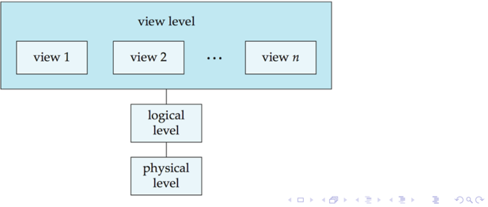
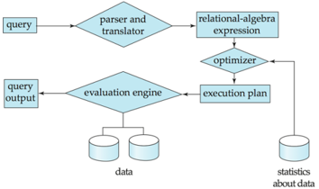
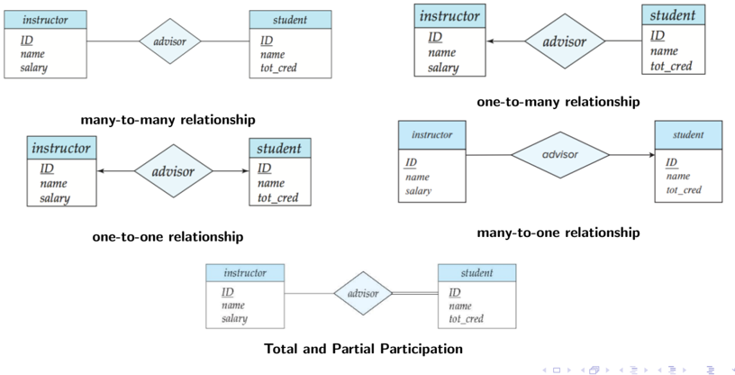
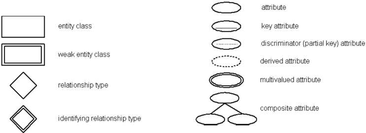

Week-1

Comparison

Levels of Abstraction

Database Engine

## Database Management Systems

Summary : Week-1

Week-1

Comparison

Levels of Abstraction

Database Engine

## Comparison

| Parameter                                          | File Handling via Python                                                                                    | DBMS                                                                                                                   |
|----------------------------------------------------|-------------------------------------------------------------------------------------------------------------|------------------------------------------------------------------------------------------------------------------------|
| Scalability with re- spect to amount of data       | Very difficult to handle insert, update and querying of records                                             | In-built features to provide high scalability for a large number of records                                            |
| Scalability with re- spect to changes in structure | Extremely difficult to change the structure of records as in the case of adding or removing attributes      | Adding or removing attributes can be done seamlessly using simple SQL queries                                          |
| Time of execution                                  | In seconds                                                                                                  | In milliseconds                                                                                                        |
| Persistence                                        | Data processed using temporary data struc- tures have to be manually updated to the file                    | Data persistence is ensured via automatic, sys- tem induced mechanisms                                                 |
| Robustness                                         | Ensuring robustness of data has to be done manually                                                         | Backup, recovery and restore need minimum manual intervention                                                          |
| Security                                           | Difficult to implement in Python (Security at OS level)                                                     | User-specific access at database level                                                                                 |
| Programmer's productivity                          | Most file access operations involve extensive coding to ensure persistence, robustness and security of data | Standard and simple built-in queries reduce the effort involved in coding thereby increasing a programmer's throughput |
| Arithmetic opera- tions                            | Easy to do arithmetic computations                                                                          | Limited set of arithmetic operations are avail- able                                                                   |
| Costs                                              | Low costs for hardware, software and human resources                                                        | High costs for hardware, software and human resources                                                                  |

Week-1

Comparison

Levels of

Abstraction

Database Engine

## Levels of Abstraction

- Physical level: Describes how a record is stored (e.g. blocks of storage)
- Logical level: Describes data stored in a database, and the relationships among the data fields (attributes, data types of attributes etc.)
- View level: Application programs hide details of data types; it also hides information for security purposes (user interfaces)

Week-1

Comparison

Levels of

Abstraction

Database Engine

## Database Engine

- Storage manager
- Provides the interface between the low-level data stored in the database and the application programs and queries submitted to the system
- Interact with the OS file manager
- Efficient storing, retrieving and updating of data
- Query Processing
- Parsing and translation → Optimization → Evaluation

Figure: Query Processing

Week-1

Comparison

Levels of Abstraction

Database Engine

## Database Engine (cont..)

## Transaction Management

- A transaction is a collection of operations that performs a single logical function in a database application
- Transaction-management component - ensures that the database remains in a consistent state despite system failures and transaction failures.
- Concurrency-control manager - controls the interaction among the concurrent transactions

Week-3

Module 6

Module 6

Module 7

Module 9

Module 10

## Database Management Systems

Summary : Week-2

January 26, 2022

Week-3

Module 6

Module 6

Module 7

Module 9

Module 10

## Module 6 Recap

Attributes types, schema and instance, keys, relational query languages

- Attribute Types - The set of allowed values for each attribute is called the domain of the attribute. i.e. Alphanumeric string, Alpha string, Date, number etc.
- Schema - R = (A1, A2, · · · , An) is a relation schema.
- A1, A2, · · · , An are attributes
- Instances : The collection of information stored in the database at a particular moment is called an instance of the database.
- Let K R, where R is the set of attributes in the relation.
- K is a super key of R if values for K are sufficient to identify a unique tuple of each possible relation r(R).
- Super key K is a candidate key if K is minimal.
- One of the candidate keys is selected to be the primary key .
- A surrogate key (or synthetic key) in a database is a unique identifier for either an entity in the modeled world or an object in the database.

Week-3

Module 6

Module 6

Module 7

Module 9

Module 10

## Module 6 Recap (Cont.)

## keys, relational query languages

- Secondary / Alternate Key : candidate keys other than primary key.
- Simple key : Consists of a single attribute.
- Composite key : Consists of more than one attribute to uniquely identify each tuples in a relation.
- Foreign key : Value in one relation must appear in another.
- Compound key : consists of more than one attribute to uniquely identify an entity occurrence.
- Relational Query language :
- Procedural programming : requires that the programmer tell the computer what to do.That is, how to get the output for the range of required inputs.
- Declarative programming : requires a more descriptive style ◦ The programmer must know what relationships hold between various entities

Week-3

Module 6

Module 6

Module 7

Module 9

Module 10

## Module 7 Recap

## Relational operators

- select operation : selection of rows(tuples). i.e: σ D &gt; 5 ( r )
- Project operation : selection of columns (Attributes). i.e. π A , C ( r )
- Union : union of two relations. i.e. r ∪ s
- Difference : Set difference of two relations. i.e. r -s
- Intersection : Set intersection of two relations. i.e. r ∩ s
- Cartesian Product : Joining two relations - Cartesian-product. i.e. r × s
- Natural Join : natural join operation on two relations matches tuples whose values are the same on all attribute names that are common to both relations. i.e. r ▷ ◁ s

Week-3

Module 6

Module 6

Module 7

Module 9

Module 10

## Module 8 Recap

## History of SQL, DDL, DML: Query structure

- History of SQL
- Data Definition Language (DDL) : The SQL DDL provides commands for defining relation schemas, deleting relations, and modifying relation schema. i.e. CREATE TABLE, DROP TABLE, ALTER etc.
- Data Manipulation Language (DML) :The SQL DML provides the ability to query information from the database and to insert tuples into, delete tuples from, and modify tuples in the database. i.e. update, insert, delete etc.
- Basic SQL structure: SELECT A1,A2,..,An FROM r1,r2,.., rm WHERE P
- Select clause The select clause lists the attributes desired in the result of a query.
- Where clause : The where clause specifies conditions that the result must satisfy.
- From clause : The from clause lists the relations involved in the query.

Week-3

Module 6

Module 6

Module 7

Module 9

Module 10

## Module 9 Recap

## Additional Basic Operations

- Cartesian Product : The Cartesian product instructor X teaches. SQL query is :
- it generates every possible instructor-teaches pair, with all attributes from both relations.
- Rename AS Operation :The SQL allows renaming relations and attributes using the as clause. i.e. old name as new name
- String Operation : SQL includes a string-matching operator for comparisons on character strings. The operator like uses patterns that are described using two special characters:
- percent ( % ). The % character matches any substring
- underscore ( ). The character matches any character
- Order By : We may specify desc for descending order or asc for ascending order, for each attribute; ascending order is the default.i.e order by name desc

select * from instructor,

teaches

Week-3

Module 6

Module 6

Module 7

Module 9

Module 10

## Module 9 Recap (Cont.)

## Additional Basic Operations

- Select top/ Fetch : The Select Top clause is used to specify the number of records to return. i.e

select top 10 distinct name from instructor

Oracle uses fetch first n rows only and rownum instructor select distinct name from order by name fetch first 10 rows only

- Where Clause Predicate : SQL includes a between comparison operator, Tuple comparison.
- IN operator : The in operator allows you to specify multiple values in a where clause.
- Duplicates :In relations with duplicates, SQL can define how many copies of tuples appear in the result. Multiset versions of some relational algebra operators.

Week-3

Module 6

Module 6

Module 7

Module 9

Module 10

## Module 10 Recap

## set operations, null values and aggregation

- Set Operations : union, intersect, except
- Each of the above operations automatically eliminates duplicates.
- o retain all duplicates use the corresponding multiset versions union all, intersect all, and except all,
- Null Values : null signifies an unknown value or that a value does not exist.
- Aggregate Functions :
- avg: return average value
- min: return min value
- max: return max value
- sum: return sum of values
- count: return number of values

Week-3

Module 6

Module 6

Module 7

Module 9

Module 10

## Module 10 Recap (Cont.)

## Group By :

- The attribute or attributes given in the group by clause are used to form groups.
- Tuples with the same value on all attributes in the group by clause are placed in one group
- Having : predicates in the having clause are applied after the formation of groups.
- Null Values All aggregate operations except count(*) ignore tuples with null values on the aggregated attributes.

Week-3

Module 11

Module 12

Module 13

Module 14

Module 15

## Database Management Systems

Summary : Week-3

January 26, 2022

Week-3

Module 11

Module 12

Module 13

Module 14

Module 15

## Module 11

Various basic SQL features through example workout

- select distinct - removing the duplicates
- select all - (duplicate retention is the default)
- Cartesian Product
- Rename AS Operation
- where : AND and OR
- String Operations like with % and
- order by -ASC and DESC
- in Operator
- Set Operations
- union -union removes all duplicates.
- Use union all instead of union to retain the duplicates
- intersect
- except
- Aggregate functions avg , min , max , count , sum

Week-3

Module 11

Module 12

Module 13

Module 14

Module 15

## Module 12

## Nested Subqueries

- A subquery is a select-from-where expression that is nested within another query
- Subqueries in the where clause
- Typical use of subqueries is to perform tests:
- For set membership - using in
- For set comparisons - using some , any , all , exists , not exists and unique
- Subqueries in the from clause
- The clause provides a way of defining a temporary relation whose definition is available only to the query in which the with clause occurs
- Subqueries in the select clause
- Using - scalar subquery is one which is used where a single value is expected

## Modification of the Database

- Deletion of tuples from a given relation delete from
- Insertion of new tuples into a given relation insert into
- Updating of values in some tuples in a given relation update

Week-3

Module 11

Module 12

Module 13

Module 14

Module 15

## Module 13

## Join Expressions

- Join operations take two relations and return as a result another relation
- Types of Join between Relations:
- Cross Join - returns the Cartesian product of rows from tables in the join
- Inner join - joins two table on the basis of the column which is explicitly specified in the ON clause with a given condition using a comparison operator
- Equi-join - condition containing an equality (=) operator
- Natural join - joins two tables based on same attribute name and compatible datatypes
- Outer join - computes the join and then adds tuples from one relation that does not match tuples in the other relation to the result of the join - uses null values
- Left outer join
- Right outer join
- Full outer join
- Self-join - a table is joined with itself

Week-3

Module 11

Module 12

Module 13

Module 14

Module 15

## Module 13 (Cont.)

## Views

- A view provides a mechanism to hide certain data from the view of certain users
- Any relation that is not of the conceptual model but is made visible to a user as a'virtual relation' is called a view.
- Defining a view using the create view statement
- Views defined using other views
- Materializing a view - create a physical table containing all the tuples in the result of the query defining the view

Week-3

Module 11

Module 12

Module 13

Module 14

Module 15

## Module 14

- Integrity Constraints - Guard against accidental damage to the database, by ensuring that authorized changes to the database do not result in a loss of data consistency
- Integrity Constraints on a Single Relation
- not null
- primary key
- unique
- check(P), where P is a predicate
- Referential Integrity - Ensures that a value that appears in one relation for a given set of attributes also appears for a certain set of attributes in another relation
- Cascading actions in referential integrity
- on delete cascade, on update cascade

Week-3

Module 11

Module 12

Module 13

Module 14

Module 15

## Module 14 (Cont.)

- Built-in Data Types in SQL - such as date, time, timestamp, interval
- Index creation - using create index statement
- User-Defined Types - using create type statement
- Domains - using create domain statement
- Types and domains are similar
- Domains can have constraints, such as not null
- Authorization - using grant and revoke statement
- Roles - using create role statement

Week-3

Module 11

Module 12

Module 13

Module 14

Module 15

## Module 15

- SQL functions - using create function statement
- Table-valued functions - can return a relation as a result
- SQL procedures - using create procedure statement
- Language constructs for procedures and functions - while loop, repeat loop, for loop, if-then-else, case
- Trigger - a set of actions that are performed in response to an insert, update, or delete operation on a specified table
- Before triggers and after triggers
- Row level and statement level triggers
- Triggering events and actions in SQL
- Triggering event can be an insert, delete or update

## Database Management Systems

Week 4 Summary

January 26, 2022

## TRC

## TRC is a nonprocedural query language, where each query is of the form

## { t | P ( t ) }

where t = resulting tuples,

P(t) = known as predicate and these are the conditions that are used to fetch t.

P(t) may have various conditions logically combined with OR ( ∨ ), AND ( ∧ ), NOT( ¬ ).

It also uses quantifiers:

∃ t ∈ r ( Q ( t )) = 'there exists' a tuple in t in relation r such that predicate Q(t) is true.

∀ t ∈ r ( Q ( t )) = Q(t) is true 'for all' tuples in relation r.

- { P | ∃ S ∈ Students ( S . CGPA &gt; 8 ∧ P . name = S . sname ∧ P . age = S . age ) } : returns the name and age of students with a CGPA above 8.

## DRC

## { &lt; x 1 , x 2 , . . . , x n &gt; | P ( x 1 , x 2 , . . . , x n ) }

- x 1 , x 2 , . . . , x n represent domain variables
- P represents a formula similar to that of the predicate calculus

| Name    |   Age |   Marks | Subject   |
|---------|-------|---------|-----------|
| David   |    23 |      78 | Maths     |
| Matthew |    29 |      54 | English   |
| Anand   |    22 |      89 | JAVA      |
| Mitchel |    21 |      56 | Maths     |
| Shaun   |    26 |      92 | Maths     |

## Relation Students

- { &lt; a , b &gt; | ∃ a , b , c , d ( &lt; a , b , c , d &gt; ∈ students ∧ c &gt; 75) } : returns the name and age of students having marks above 75.

Note: You have to mention the domain variables in the same order as given in the table.

## Q1

| Name    |   Age |   Marks | Subject   |
|---------|-------|---------|-----------|
| David   |    23 |      78 | Maths     |
| Matthew |    29 |      54 | English   |
| Anand   |    22 |      89 | JAVA      |
| Mitchel |    21 |      56 | Maths     |
| Shaun   |    26 |      92 | Maths     |

| Name    | Sports   |   Awards |   Points |
|---------|----------|----------|----------|
| David   | Cricket  |        2 |       67 |
| Matthew | Football |        4 |       90 |
| Anand   | Cricket  |        5 |       80 |
| Mitchel | Tennis   |        8 |       70 |
| Shaun   | Hockey   |        3 |       75 |

## Relation Students

## Relation Activity

- Q). Write down the RA, TRC and DRC expressions which will return the names of students whose age is greater than 25, or who are enrolled in Maths.

RA : Π Name ( σ age &gt; 25 ∨ subject =' Maths ' ( Students ))

TRC:

{ t | ∃ s ∈ students ( s . age &gt; 25 ∨ s . subject = ' Maths ' ∧ t . name = s . name ) }

{ t . name | t ∈ students ∧ s . age &gt; 25 ∨ s . subject = ' Maths ') }

DRC:

{ &lt; a &gt; | ∃ b , c , d ( &lt; a , b , c , d &gt; ∈ students ∧ b &gt; 25 ∨ d = ' Maths ') }

## Q2

| Name    |   Age |   Marks | Subject   |
|---------|-------|---------|-----------|
| David   |    23 |      78 | Maths     |
| Matthew |    29 |      54 | English   |
| Anand   |    22 |      89 | JAVA      |
| Mitchel |    21 |      56 | Maths     |
| Shaun   |    26 |      92 | Maths     |

| Name    | Sports   |   Awards |   Points |
|---------|----------|----------|----------|
| David   | Cricket  |        2 |       67 |
| Matthew | Football |        4 |       90 |
| Anand   | Cricket  |        5 |       80 |
| Mitchel | Tennis   |        8 |       70 |
| Shaun   | Hockey   |        3 |       75 |

## Relation Students

## Relation Activity

- Q). Write down the RA, TRC and DRC expressions which will return the names of students along with sports, whose age is less than 25 and who have secured more than 75 marks.
- RA : Π Name , Sports , ( σ age &lt; 25 ∧ Marks &gt; 75 ( Students ⋊ ⋉ Activity ))

TRC: { t | ∃ s ∈ students ∃ a ∈ activity ( s . name = a . name ∧ s . age &lt; 25 ∧ s . marks &gt; 75 ∧ t . name = s . name ∧ t . sports = a . sports ) } DRC: { &lt; a , f &gt; | ∃ b , c , d ( &lt; a , b , c , d &gt; ∈ students ∧ b &lt; 25 ∧ c &gt; 75) ∧ ∃ e , g , h ( &lt; e , f , g , h &gt; ∈ activity ∧ a = e ) }

| Name    |   Age |   Marks | Subject   |
|---------|-------|---------|-----------|
| David   |    23 |      78 | Maths     |
| Matthew |    29 |      54 | English   |
| Anand   |    22 |      89 | JAVA      |
| Mitchel |    21 |      56 | Maths     |
| Shaun   |    26 |      92 | Maths     |

| Name    | Sports   |   Awards |   Points |
|---------|----------|----------|----------|
| David   | Cricket  |        2 |       67 |
| Matthew | Football |        4 |       90 |
| Anand   | Cricket  |        5 |       80 |
| Mitchel | Tennis   |        8 |       70 |
| Shaun   | Hockey   |        3 |       75 |

## Relation Students

## Relation Activity

- Q). Write down the RA, TRC and DRC expressions which will return the names of students and sports played by the students whose age is less than 25 and have won more than 3 awards.

RA : Π Name , Sports , ( σ age &lt; 25 ∧ awards &gt; 3 ( Students ⋊ ⋉ Activity ))

TRC: { t | ∃ s ∈ students ∃ a ∈ activity ( s . name = a . name ∧ s . age &lt; 25 ∧ a . awards &gt; 3 ∧ t . name = s . name ∧ t . sports = a . sports ) }

DRC: { &lt; a , f &gt; | ∃ b , c , d ( &lt; a , b , c , d &gt; ∈ students ∧ b &lt; 25) ∧ ∃ e , g , h ( &lt; e , f , g , h &gt; ∈ activity ∧ g &gt; 3 ∧ a = e ) }

## E-R Diagram

- Please go through the tutorials.

## Mapping Constraints

## E-R diagrams symbols

attribute

entity class

attribute key

discriminator (partial key} attribute

weak entity class

derived attribute

multivalued attribute

relationship type

composite attribute

identifying relationship type

