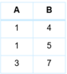
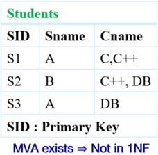
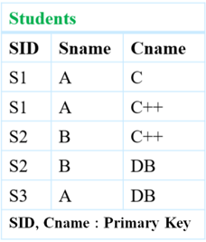

Week-5

Module 21

Module 22

Module 23

Module 24

Module 25

## Database Management Systems

Summary : Week-5

Week-5

Module 21

Module 22

Module 23

Module 24

Module 25

## Module 21 Recap

- Redundancy : having multiple copies of same data in the database.
- This problem arises when a database is not normalized
- It leads to anomalies
- Anomaly : inconsistencies that can arise due to data changes in a database with insertion, deletion, and update
- These problems occur in poorly planned, un-normalised databases where all the data is stored in one table (a flat-file database)

There can be three kinds of anomalies

- Insertions Anomaly
- Deletion Anomaly
- Update Anomaly

Week-5

Module 21

Module 22

Module 23

Module 24

Module 25

## Redundancy and Anomaly

## Insertions Anomaly

- When the insertion of a data record is not possible without adding some additional unrelated data to the record
- We cannot add an Instructor in instructor with department if the department does not have a building or budget

## Deletion Anomaly

- When deletion of a data record results in losing some unrelated information that was stored as part of the record that was deleted from a table
- We delete the last Instructor of a Department from instructor with department , we lose building and budget information

## Update Anomaly

- When a data is changed, which could involve many records having to be changed, leading to the possibility of some changes being made incorrectly
- When the budget changes for a Department having large number of Instructors in instructor with department application may miss some of them

Week-5

Module 21

Module 22

Module 23

Module 24

Module 25

## First Normal Form (1NF)

- A domain is atomic if its elements are considered to be indivisible units
- Examples of non-atomic domains:
- Set of names, composite attributes
- Identification numbers like CS101 that can be broken up into parts
- A relational schema R is in First Normal Form (INF) if
- the domains of all attributes of R are atomic
- the value of each attribute contains only a single value from that domain
- Non-atomic values complicate storage and encourage redundant (repeated) storage of data
- Example: Set of accounts stored with each customer, and set of owners stored with each account
- We assume all relations are in first normal form

Week-5

Module 21

Module 22

Module 23

Module 24

Module 25

## Functional Dependencies

- Let R be a relation schema α ⊆ R and β ⊆ R
- The functional dependency or FD

α

→

β

holds on R if and only if for any legal relations r ( R ), whenever any two tuples t 1 and t 2 of r agree on the attributes α , they also agree on the attributes β . That is,

<!-- formula-not-decoded -->

- Example: Consider r ( A , B ) with the following instance of r .
- On this instance, A → B does NOT hold, but B → A does hold. So we cannot have tuples like (2, 4), or (3, 5), or (4, 7) added to the current instance.

Week-5

Module 21

Module 22

Module 23

Module 24

Module 25

## Functional Dependencies : Armstrong's Axioms

- Given a set of Functional Dependencies F , we can infer new dependencies by the Armstrong's Axioms :
- Reflexivity : if β ⊆ α , then α → β
- Augmentation : if α → β , then γα → γβ
- Transitivity : if α → β and β → γ , then α → γ
- These axioms can be repeatedly applied to generate new FDs and added to F
- A new FD obtained by applying the axioms is said to the logically implied by F
- The process of generations of FDs terminate after finite number of steps and we call it the Closure Set F + for FDs F . This is the set of all FDs logically implied by F
- Clearly, F ⊆ F +
- These axioms are
- Sound (generate only functional dependencies that actually hold), and
- Complete (eventually generate all functional dependencies that hold)
- Prove the axioms from definitions of FDs
- Prove the soundness and completeness of the axioms

Week-5

Module 21

Module 22

Module 23

Module 24

Module 25

## Functional Dependencies : Armstrong's Axioms: Derived Rules

- Additional Derived Rules:
- Union : if α → β holds and α → γ holds, then α → βγ holds
- Decomposition : if α → βγ holds, then α → β holds and α → γ holds
- Pseudotransitivity : if α → β holds and γβ → δ holds, then αγ → δ holds
- The above rules can be inferred from basic Armstrong's axioms (and hence are not included in the basic set). They can be proven independently too
- Reflexivity : if β ⊆ α , then α → β
- Augmentation : if α → β , then γα → γβ
- Transitivity : if α → β and β → γ , then α → γ
- Prove the Rules from:
- Basic Axioms
- The definitions of FDs

Week-5

Module 21

Module 22

Module 23

Module 24

Module 25

## Functional Dependencies : Closure of Attribute Sets: Example

- R = ( A , B , C , G , H , I )
- F = { A → B , A → C , CG → H , CG → I , B → H }
- ( AG ) +
- 1 result = AG
- 2 result = ABCG ( A → C and A → B )
- 3 result = ABCGH ( CG → H and CG ⊆ AGBC )
- 4 result = ABCGHI ( CG → I and CG ⊆ AGBCH )
- Is AG a candidate key?
- 1 Is AG a super key?
- 1 Does AG → R ? == Is ( AG ) + ⊇ R
- 2 Is any subset of AG a superkey?
- 1 Does A → R ? == Is ( A ) + ⊇ R
- 2 Does G → R ? == Is ( G ) + ⊇ R

Week-5

Module 21

Module 22

Module 23

Module 24

Module 25

## BCNF: Boyce-Codd Normal Form

- A relation schema R is in BCNF with respect to a set F of FDs if for all FDs in F + of the form
- α → β , where α ⊆ R and β ⊆ R at least one of the following holds:
- α → β is trivial (that is, β ⊆ α )
- α is a superkey for R
- Example schema not in
- BCNF:
- instr dept (ID, name, salary, dept name, building, budget)
- because the non-trivial dependency dept name → building, budget holds on instr dept , but dept name is not a superkey

Week-5

Module 21

Module 22

Module 23

Module 24

Module 25

## BCNF (2): Decomposition

- If in schema R and a non-trivial dependency α → β causes a violation of BCNF, we decompose R into:
- α ∪ β
- ( R -( β -α ))
- In our example,
- α = dept name
- β = building , budget
- dept name → building, budget
- inst dept is replaced by
- ( α ∪ β ) = ( dept name, building, budget )
- dept name → building, budget
- ( R -( β -α )) = (ID, name, salary, dept name)
- ID → name, salary, dept name

Week-5

Module 21

Module 22

Module 23

Module 24

Module 25

## 3NF: Third Normal Form

- A relation schema R is in third normal form (3NF) if for all:
- α → β ∈ F
- +
- at least one of the following holds:
- α → β is trivial (that is, β ⊆ α )
- α is a superkey for R
- Each attribute A in β -α is contained in a candidate key for R (Nore: Each attribute may be in a different candidate key)
- If a relation is in BCNF it is in 3NF (since in BCNF one of the first two conditions above must hold)
- Third condition is a minimal relaxation of BCNF to ensure dependency preservation (will see why later)

Week-5

Module 21

Module 22

Module 23

Module 24

Module 25

## Extraneous Attributes

- Consider a set F of FDs and the FD α → β in F .
- Attribute A is extraneous in α if A ∈ α and F logically implies ( F -{ α → β } ) ∪ { ( α -A ) → β } .
- Attribute A is extraneous in β if A ∈ β and the set of FDs ( F -{ α → β } ) ∪ { α → ( β -A ) } logically implies F .
- Note: Implication in the opposite direction is trivial in each of the cases above, since a 'stronger' functional dependency always implies a weaker one
- Example: Given F = { A → C , AB → C }
- B is extraneous in AB → C because { A → C , AB → C } logically implies A → C (that is, the result of dropping B from AB → C ).
- A + = AC in { A → C , AB → C }
- Example: Given F = { A → C , AB → CD }
- C is extraneous in AB → CD since AB → C can be inferred even after deleting C
- AB + = ABCD in { A → C , AB → D }

Week-5

Module 21

Module 22

Module 23

Module 24

Module 25

## Equivalence of Sets of Functional Dependencies

- Let F &amp; G are two functional dependency sets.
- These two sets F &amp; G are equivalent if F + = G + . That is: ( F + = G + ) ⇔ ( F + ⇒ G and G + ⇒ F )
- Equivalence means that every functional dependency in F can be inferred from G , and every functional dependency in G an be inferred from F
- F and G are equal only if
- F covers G : Means that all functional dependency of G are logically numbers of functional dependency set F ⇒ F + ⊇ G .
- G covers F : Means that all functional dependency of F are logically members of functional dependency set G ⇒ G + ⊇ F .

| Condition   | CASES   | CASES   | CASES   | CASES         |
|-------------|---------|---------|---------|---------------|
| F Covers G  | True    | True    | False   | False         |
| Covers F    | True    | False   | True    | False         |
| Result      | F=G     |         | G-F     | No Comparison |

Week-5

Module 21

Module 22

Module 23

Module 24

Module 25

## Canonical Cover

- A Canonical Cover for F is a set of dependencies F c such that ALL the following properties are satisfied:
- F + = F + c . Or,
- F logically implies all dependencies in F c
- F c logically implies all dependencies in F
- No functional dependency in F c contains an extraneous attribute
- Each left side of functional dependency in F c is unique. That is, there are no two dependencies α 1 → β 1 and α 2 → β 2 in such that α 1 → α 2
- Intuitively, a Canonical cover of F is a minimal set of FDs
- Equivalent to F
- Having no redundant FDs
- No redundant parts of FDs
- Minimal / Irreducible Set of Functional Dependencies

Week-5

Module 21

Module 22

Module 23

Module 24

Module 25

## Canonical Cover : Example

- For example: A → C is redundant in: { A → B , B → C , A → C }
- Parts of a functional dependency may be redundant
- For example: on RHS: { A → B , B → C , A → CD } can be simplified to { A → B , B → C , A → D }
- -In the forward: (1) A → CD ⇒ A → C and A → D (2) A → B , B → C ⇒ A → C
- -In the reverse: (1) A → B , B → C ⇒ A → C (2) A → C , A → D ⇒ A → CD
- For example: on LHS: { A → B , B → C , AC → D } can be simplified to { A → B , B → C , A → D }
- -In the forward: (1) A → B , B → C ⇒ A → C ⇒ A → AC (2) A → AC , AC → D ⇒ A → D
- -In the reverse: A → D ⇒ AC → D

Week-5

Module 21

Module 22

Module 23

Module 24

Module 25

## Lossless Join Decomposition

- For the case of R = ( R 1 , R 2 ), we require that for all possible relations r on schema R

<!-- formula-not-decoded -->

- A decomposition of R into R 1 and R 2 is lossless join if at least one of the following dependencies is in F + :
- R 1 ∩ R 2 → R 1
- R 1 ∩ R 2 → R 2
- The above functional dependencies are a sufficient condition for lossless join decomposition; the dependencies are a necessary condition only if all constraints are functional dependencies
- To Identify whether a decomposition is lossy or lossless, it must satisfy the following conditions:
- R 1 ∪ R 2 = R

̸

- R 1 ∩ R 2 = ϕ and
- R 1 ∩ R 2 → R 1 or R 1 ∩ R 2 → R 2

Week-5

Module 21

Module 22

Module 23

Module 24

Module 25

## Lossless Join Decomposition : Example

- R = ( A , B , C
- )
- F = { A → B , B → C }
- Can be decomposed in two different ways
- R 1 = ( A , B ) , R 2 = ( B , C )
- Lossless-join decomposition: R 1 ∩ R 2 = { B } and B → BC
- Dependency preserving
- R 1 = ( A , B ) , R 2 = ( A , C )
- Lossless-join decomposition: R 1 ∩ R 2 = { A } and A → AB
- Not dependency preserving
- (cannot check
- B → C without computing R 1 ▷ ◁ R 2 )

Week-5

Module 21

Module 22

Module 23

Module 24

Module 25

## Dependency Preservation

- Let F i be the set of dependencies F + that include only attributes in R i
- A decomposition is dependency preserving , if

<!-- formula-not-decoded -->

- If it is not, then checking updates for violation of functional dependencies may require computing joins, which is expensive

Let R be the original relational schema having FD set F. Let R 1 and R 2 having FD set F 1 and F 2 respectively, are the decomposed sub-relations of R. The decomposition of R is said to be preserving if

- F 1 ∪ F 2 ≡ F { Decomposition Preserving Dependency }
- If F 1 ∪ F 2 ⊂ F { Decomposition NOT Preserving Dependency } and
- F 1 ∪ F 2 ⊃ F { this is not possible }

Week-5

Module 21

Module 22

Module 23

Module 24

Module 25

## Dependency Preservation : Example

- R ( A, B, C, D )
- F = { A → B , B → C , C → D , D → A
- }
- Decomposition: R1 (A, B) R2 (B, C) R3 (C, D)
- A → B is preserved on table R1
- B → C is preserved on table R2
- C → D is preserved on table R3
- We have to check whether the one remaining FD: D → A is preserved or not.

R1

R2

R3

F 1= { A → AB , B → BA }

F 2= { B → BC , C → CB }

- F ′ = F 1 ∪ F 2 ∪ F 3 .
- Checking for: D → A in F ′ +
- D → C (from R3), C → B (from R2), B → A (from R1) : D → A (By Transitivity)

Hence all dependencies are preserved .

F 3= { C → CD , D → DC }

Week-6

Module 26

Module 27

Module 29

## Database Management Systems

Summary : Week-6

Week-6

Module 26

Module 27

Module 29

## Normalization or Schema Refinement

- Normalization or Schema Refinement is a technique of organizing the data in the database
- A systematic approach of decomposing tables to eliminate data redundancy and undesirable characteristics
- Insertion Anomaly
- Update Anomaly
- Deletion Anomaly
- Most common technique for the Schema Refinement is decomposition.
- Goal of Normalization: Eliminate Redundancy
- Redundancy refers to repetition of same data or duplicate copies of same data stored in different locations
- Normalization is used for mainly two purpose:
- Eliminating redundant (useless) data
- Ensuring data dependencies make sense, that is, data is logically stored

Week-6

Module 26

Module 27

Module 29

## Normalization and Normal Forms

- A normal form specifies a set of conditions that the relational schema must satisfy in terms of its constraints - they offer varied levels of guarantee for the design
- Normalization rules are divided into various normal forms. Most common normal forms are:
- First Normal Form (1NF)
- Second Normal Form (2NF)
- Third Normal Form (3NF)
- Informally, a relational database relation is often described as 'normalized' if it meets third normal form. Most 3NF relations are free of insertion, update, and deletion anomalies

Week-6

Module 26

Module 27

Module 29

## 1NF: First Normal Form

- A relation is in First Normal Form if and only if all underlying domains contain atomic values only (doesn't have multivalued attributes (MVA))
- STUDENT(Sid, Sname, Cname)

| SID             | Sname           | Cname           |
|-----------------|-----------------|-----------------|
| S1              | A               | C,C++           |
| S2              | B               | C++, DB         |
| S3              | A               | DB              |
| SID Primary Key | SID Primary Key | SID Primary Key |

Source:

| SID         | Sname       | Cname       |
|-------------|-------------|-------------|
| S1          | A           |             |
| S1          | A           | C++         |
| S2          | B           | C++         |
| S2          | B           | DB          |
| S3          | A           | DB          |
| Primary Kev | Primary Kev | Primary Kev |

No MVA = In INF

Week-6

Module 26

Module 27

Module 29

## 2NF: Second Normal Form

- Relation R is in Second Normal Form (2NF) only iff :
- R is in 1NF and
- R contains no Partial Dependency

## Partial Dependency:

Let R be a relational Schema and X , Y , A be the attribute sets over R where X : Any Candidate Key, Y : Proper Subset of Candidate Key, and A : Non Prime Attribute

If Y → A exists in R , then R is not in 2NF.

- ( Y → A ) is a Partial dependency only if
- Y : Proper subset of Candidate Key
- A : Non Prime Attribute

A prime attribute of a relation is an attribute that is a part of a candidate key of the relation

Week-6

Module 26

Module 27

Module 29

## 3NF: Third Normal Form

## Let R be the relational schema.

- [E. F. Codd,1971] R is in 3NF only if:
- R should be in 2NF
- R should not contain transitive dependencies (OR, Every non-prime attribute of R is non-transitively dependent on every key of R )
- [Carlo Zaniolo, 1982] Alternately, R is in 3NF iff for each of its functional dependencies X → A , at least one of the following conditions holds:
- X contains A (that is, A is a subset of X , meaning X → A is trivial functional dependency), or
- X is a superkey, or
- Every element of A -X , the set difference between A and X , is a prime attribute (i.e., each attribute in A -X is contained in some candidate key)
- [Simple Statement] A relational schema R is in 3NF if for every FD X → A associated with R either
- A ⊆ X (that is, the FD is trivial) or
- X is a superkey of R or
- A is part of some candidate key (not just superkey!)
- A relation in 3NF is naturally in 2NF

Week-6

Module 26

Module 27

Module 29

## Module 27 Recap

## Decomposition to 3NF

Week-6

Module 26

Module 27

Module 29

## 3NF Decomposition: Motivation

- There are some situations where
- BCNF is not dependency preserving, and
- Efficient checking for FD violation on updates is important
- Solution: define a weaker normal form, called Third Normal Form (3NF)
- Allows some redundancy (with resultant problems; as seen above)
- But functional dependencies can be checked on individual relations without computing a join
- There is always a lossless-join, dependency-preserving decomposition into 3NF

Week-6

Module 26

Module 27

Module 29

## 3NF Decomposition : Testing for 3NF

- Optimization: Need to check only FDs in F , need not check all FDs in F + .
- Use attribute closure to check for each dependency α → β , if α is a superkey.
- If α is not a superkey, we have to verify if each attribute in β is contained in a candidate key of R
- This test is rather more expensive, since it involve finding candidate keys
- Testing for 3NF has been shown to be NP-hard
- Decomposition into 3NF can be done in polynomial time

Week-6

Module 26

Module 27

Module 29

## 3NF Decomposition : Algorithm

- Given: relation R , set F of functional dependencies
- Find: decomposition of R into a set of 3NF relation R i
- Algorithm:
- 1 Eliminate redundant FDs, resulting in a canonical cover F c of F
- 2 Create a relation R i = XY for each FD X → Y in F c
- 3 If the key K of R does not occur in any relation R i , create one more relation R i = K

Week-6

Module 26

Module 27

Module 29

## 3NF Decomposition : Example

- Relation schema:
- cust banker branch = (customer id, employee id, branch name, type)
- The functional dependencies for this relation schema are:
- 1 customer id, employee id → branch name, type
- 2 employee id → branch name
- 3 customer id, branch name → employee id
- We first compute a canonical cover
- branch name is extraneous in the RHS of the 1 st dependency
- No other attribute is extraneous, so we get F c =
- customer id, employee id → type
- employee id → branch name

customer id, branch name → employee id

Week-6

Module 26

Module 27

Module 29

## 3NF Decomposition : Example

- The for loop generates following 3NF schema:
- Observe that (customer id, employee id, type) contains a candidate key of the original schema, so no further relation schema needs be added
- At end of for loop, detect and delete schemas, such as (employee id, branch name) , which are subsets of other schemas
- result will not depend on the order in which FDs are considered
- The resultant simplified 3NF schema is:
- (customer id, employee id, type) (customer id, branch name, employee id)

(customer id, employee id, type)

(employee id, branch name)

(customer id, branch name, employee id)

Week-6

Module 26

Module 27

Module 29

## BCNF Decomposition: BCNF Definition

- A relation schema R is in BCNF with respect to a set F of FDs if for all FDs in F + of the form
- α → β , where α ⊆ R and β ⊆ R at least one of the following holds:
- α → β is trivial (that is, β ⊆ α )
- α is a superkey for R

Week-6

Module 26

Module 27

Module 29

## BCNF Decomposition : Algorithm

- 1 For all dependencies A → B in F + , check if A is a superkey
- By using attribute closure
- 2 If not, then
- Choose a dependency in F + that breaks the BCNF rules, say A → B
- Create R 1 = AB
- Create R 2 = ( R -( B -A ))
- Note that: R 1 ∩ R 2 = A and A → AB (= R 1), so this is lossless decomposition
- 3 Repeat for R 1, and R 2
- By defining F 1 + to be all dependencies in F that contain only attributes in R 1
- Similarly F 2 +

Week-6

Module 26

Module 27

Module 29

## BCNF Decomposition (4): Testing Dependency Preservation: Using Closure Set of FD

Consider the example given below, we will apply both the algorithms to check dependency preservation and will discuss the results.

- R ( A, B, C, D )
- F = { A → B , B → C , C → D , D → A }
- Decomposition: R1 (A, B) R2 (B, C) R3 (C, D)
- A → B is preserved on table R1
- B → C is preserved on table R2
- C → D is preserved on table R3
- We have to check whether the one remaining FD: D → A is preserved or not.

R1

R2

R3

F 1= { A → AB , B → BA }

F 2= { B → BC , C → CB }

F 3= { C → CD , D → DC }

- F ′ = F 1 ∪ F 2 ∪ F 3 .
- Checking for: D → A in F ′ +
- D → C (from R3), C → B (from R2), B → A (from R1) : D → A (By Transitivity)
- Hence all dependencies are preserved .

Week-6

Module 26

Module 27

Module 29

## MVD: Definition

- Let R be a relation schema and let α ⊆ R and β ⊆ R. The multivalued dependency α ↠ β

holds on R if in any legal relation r(R) , for all pairs for tuples t 1 and t 2 in r such that t 1[ α ] = t 2 [ α ], there exist tuples t 3 and t 4 in r such that:

t 1[ α ] = t 2 [ α ] = t 3 [ α ] = t 4 [ α ] t 3[ β ] = t 1 [ β ] t 3[R β ] = t 2[R β ] t 4 [ β ] = t 2[ β ] t 4[R β ] = t 1[R β ]

Example: A relation of university courses, the books recommended for the course, and the lecturers who will be teaching the course:

| Test: course ↠   | Test: course ↠   | Test: course ↠   | book   |
|------------------|------------------|------------------|--------|
| Course           | Book             | Lecturer         | Tuples |
| AHA              | Silberschatz     | John D           |        |
| AHA              | Nederpelt        | William M        |        |
| AHA              | Silberschatz     | William M        |        |
| AHA              | Nederpelt        | John D           |        |
| AHA              | Silberschatz     | Christian G      |        |
| AHA              | Nederpelt        | Christian G      |        |
| OSO              | Silberschatz     | John D           |        |
| OSO              | Silberschatz     | William M        |        |

- course ↠ book
- course ↠ lecturer

Week-6

Module 26

Module 27

Module 29

## Fourth Normal Form

- A relation schema R is in 4NF with respect to a set D of functional and multivalued dependencies if for all multivalued dependencies in D + of the form α ↠ β , where α ⊆ R and β ⊆ R, at least one of the following hold:
- α ↠ β is trivial (that is, β ⊆ α or α ∪ β = R)
- α is a superkey for schema R
- If a relation is in 4NF,then it is in BCNF

Week-7

Module 31

Module 32

Module 33

Module 34

Module 35

## Database Management Systems

Summary : Week-7

March 7, 2022

Week-7

Module 31

Module 32

Module 33

Module 34

Module 35

## Module 31 Recap

- Characteristic of Application Programs - Diversity and Unity
- Applications are functionally split into:
- Frontend or Presentation Layer / Tier
- Middle or Application / Business Logic Layer / Tier
- Backend or Data Access Layer / Tier
- Application Architectures: Layers
- Presentation Layer / Tier
- Model-View-Controller (MVC) architecture
- model - business logic
- view - presentation of data, depends on display device
- controller - receives events, executes actions, and returns a view to the user
- Business Logic Layer / Tier - provides high level view of data and actions on data
- Data Access Layer / Tier - interfaces between business logic layer and the underlying database

Week-7

Module 31

Module 32

Module 33

Module 34

Module 35

## Module 31 Recap (Cont.)

## Architecture Classification

- The design of a DBMS depends on its architecture. It can be
- centralized
- decentralized
- hierarchical
- The architecture of a DBMS can be seen as either single tier or multi-tier:
- 1-tier architecture
- 2-tier architecture
- 3-tier architecture
- n-tier architecture

Week-7

Module 31

Module 32

Module 33

Module 34

Module 35

## Module 32 Recap

## Web Fundamentals

- The World Wide Web
- Hypertext MarkupLanguage (HTML)
- Uniform Resource Locators (URLs)
- Uniform Resource Identifier (URI)
- Uniform Resource Locator (URL)
- Uniform Resource Name (URN)
- Hypertext Transfer Protocol (HTTP)
- HTTP and Sessions
- Sessions and Cookies
- Web Browser
- Web Servers
- Web Services - Representation State Transfer (REST), XML, JavaScript Object Notation (JSON), Big Web Services

Week-7

Module 31

Module 32

Module 33

Module 34

Module 35

## Module 32 Recap (Cont.)

## Scripting for Web Applications

- Client side scripting - are firstly downloaded at the client-end and then interpreted and executed by the browser
- Javascript
- Server side scripting - is responsible for the completion or carrying out a task at the server-end and then sending the result to the client-end.
- Servlets
- Java Server Pages (JSP)
- PHP

Week-7

Module 31

Module 32

Module 33

Module 34

Module 35

## Module 33 Recap

- Working with SQL and Native Language
- Connectionist
- Open Database Connectivity (ODBC)
- Java Database Connectivity (JDBC)
- JDBC example
- Connectionist Bridge Configurations
- ODBC-to-JDBC bridges, JDBC-to-ODBC bridges, OLE DB-to-ODBC bridges, ADO.NET-to-ODBC bridges
- Embedded SQL
- Examples with C, Java

Week-7

Module 31

Module 32

Module 33

Module 34

Module 35

## Module 34 Recap

## Python Modules for PostgreSQL

- Package psycopg2
- Steps to access PostgresSQL from Python using psycopg2
- 1 Create connection
- 2 Create cursor
- 3 Execute the query
- 4 Commit/rollback
- 5 Close the cursor
- 6 Close the connection
- Python psycopg2 Module APIs: insert, delete, update stored procedures
- Python psycopg2 Module APIs: select
- Web and Internet Development using Python

Week-7

Module 31

Module 32

Module 33

Module 34

Module 35

## Module 35 Recap

- Rapid Application Development - RAD Software is an agile model that focuses on fast prototyping and quick feedback in app development to ensure speedier delivery and an efficient result
- Several approaches to speed up application development
- Web application development frameworks
1. Java Server Faces (JSF) 2. Ruby on Rails
- RAD Platforms and Tools
- ASP.NET and Visual Studio
- Application Performance
- Application Security
- SQL Injection: i.e. select * from instructor where name = 'X' or 'Y' = 'Y'
1. Password Leakage 2. Authentication 3. Application-Level Authorization 4. Audit Trails

Week-7

Module 31

Module 32

Module 33

Module 34

Module 35

## Module 35 Recap (Cont.

- Challenges in Web Application Development - User Interface and User Experience, Scalability, Performance, Knowledge of Framework and Platforms, Security
- Mobile Apps - A type of application software designed to run on a mobile device, such as a smartphone or tablet computer
- Mobile Website
- Mobile Apps
- Architecture of Mobile App - Typically 3 tier: Presentation, Business, and Data
- Types of Mobile Apps
- Native Apps
- Web Apps
- Hybrid Apps
- Design Issues

Week-8

Module 36

Module 37

Module 38

Module 39

Module 40

## Database Management Systems

Summary : Week-8

Week-8

## Module 36

Module 37

Module 38

Module 39

Module 40

## Module 36 Recap

- Algorithms and Programs
- Analysis of Algorithms
- Why analyze?
- What to analyze?
- How to analyze?
- Counting Models
- Asymptotic Analysis
- Generating Functions
- Master Theorem
- Where to analyze?
- When to analyze?
- Complexity Chart

Week-8

Module 36

Module 37

Module 38

Module 39

Module 40

## Module 37 Recap

- Linear data structures: A Linear data structure has data elements arranged in linear or sequential manner such that each member element is connected to its previous and next element.
- Array: The data elements are stored at contiguous locations in memory.
- Linked List: The data elements are not required to be stored at contiguous locations in memory. Rather each element stores a link (a pointer to a reference) to the location of the next element.
- Queue: It is a FIFO (First In First Out) data structure.
- Stack: It is a LIFO (Last In First Out) data structure.
- Search
- Linear
- Binary

Week-8

Module 36

Module 37

Module 38

Module 39

Module 40

## Module 37 Recap (Cont..)

- From the study of Linear data structures , we can make the following summary observations:
- All of them have the space complexity O ( n ), which optimal. However, the actual used space may be lower in array while linked list has an overhead of 100% (double)
- All of them have complexities that are identical for Worst as well as Average case
- All of them offer satisfactory complexity for some operations while being unsatisfactory on the others

|        | Array     | Array     | Linked List   | Linked List   |
|--------|-----------|-----------|---------------|---------------|
|        | Unordered | Ordered   | Unordered     | Ordered       |
| Access | O (1)     | O (1)     | O ( n )       | O ( n )       |
| Insert | O ( n )   | O ( n )   | O (1)         | O (1)         |
| Delete | O ( n )   | O ( n )   | O (1)         | O (1)         |
| Search | O ( n )   | O (lg n ) | O ( n )       | O ( n )       |

Week-8

Module 36

Module 37

Module 38

Module 39

Module 40

## Module 38 Recap

- Non-Linear data structures are those data structures in which data items are not arranged in a sequence and each element may have multiple paths to connect to other elements.
- Graph: Undirected or Directed, Unweighted or Weighted, and variants
- Tree: Rooted or Unrooted, Binary or n-ary, Balanced or Unbalanced, and variants
- Hash Table: Array with lists (coalesced chains) and one or more hash functions
- Skip List: Multi-layered interconnected linked lists
- Binary Search Trees: Is a tree in which all the nodes hold the following:
- The value of each node in the left sub-tree is less than the value of its root
- The value of each node in the right sub-tree is greater than the value of its root

Week-8

Module 36

Module 37

Module 38

Module 39

Module 40

## Binary Search Tree

Practice Question: Construct the binary search tree for the following sequence:

- 1 15,10,20,8,12,27,23,2,6,11,14,17
- 2 15,10,6,20,27,2,23,17,8,14,11,12
- 3 15,23,6,20,12,2,10,17,8,14,11,27

For each BST, find out the number of leaf nodes, height of BST and number of elements at level 2.

Week-8

Module 36

Module 37

Module 38

Module 39

Module 40

## Comparison of Linear and Non-Linear Data Structures

| Linear Data Structure                                                                                                       | Non-Linear Data Structure                                                                                                                                                        |
|-----------------------------------------------------------------------------------------------------------------------------|----------------------------------------------------------------------------------------------------------------------------------------------------------------------------------|
| • Data elements are arranged in a linear order where each and every elements are attached to its previous and next adjacent | • Data elements are arranged in hierar- chical or networked manner                                                                                                               |
| • Single level is involved                                                                                                  | • Multiple level are involved                                                                                                                                                    |
| • Implementation is easy in comparison to non-linear data structure                                                         | • Implementation is complex in compari- son to linear data structure                                                                                                             |
| • Data elements can be traversed in one way only                                                                            | • Data elements can be traversed in mul- tiple ways. Various traversals may be de- fined to linearize the data: Depth-First, Breadth-First, Inorder, Prepoder, Pos- torder, etc. |
| • Examples : array, stack, queue, linked list, and their variants                                                           | • Examples : trees, graphs, skip list, hash map, and several variants                                                                                                            |

Week-8

Module 36

Module 37

Module 38

Module 39

Module 40

## Module 39 Recap

- Physical Storage Media
- Magnetic Disks
- (Go through the slides for theoretical part and refer to practice and graded assignment questions )
- Magnetic Tape
- Cloud Storage
- Cloud Storage vs. Traditional Storage
- Other Storage
- Optical Disks
- Flash Drives
- Secure Digital Cards (SD cards)
- Flash Storage
- Solid-State Drives (SSD)
- Future of Storage
- DNA Digital Storage
- Quantum Memory

Week-8

Module 36

Module 37

Module 38

Module 39

Module 40

## Module 40 Recap

- File Organization
- Organization of Records in Files
- Heap: A record can be placed anywhere in the file where there is space
- Sequential: Store records in sequential order, based on the value of the search key of each record.
- Suitable for applications that require sequential processing of the entire file
- The records in the file are ordered by a search-key.
- It will work more efficiently when working on search-key (primary key) of the table.
- Hashing: A hash function computed on some attribute of each record; the result specifies in which block of the file the record should be placed
- In a multitable clustering file organization records of several different relations can be stored in the same file.
- good for queries involving department ▷ ◁ instructor , and for queries involving one single department and its instructors
- bad for queries involving only department
- results in variable size records
- Can add pointer chains to link records of a particular relation

Week-8

Module 36

Module 37

Module 38

Module 39

Module 40

## Module 40 Cont..

- Data Dictionary (also, System Catalog ) stores metadata (data about data) such
- as:
- Information about relations
- User and accounting information, including passwords
- Statistical and descriptive data
- Physical file organization information
- Information about indices
- Buffer : portion of main memory available to store copies of disk blocks
- Buffer Manager : subsystem responsible for allocating buffer space in main memory
- Buffer Replacement Policies:
- Least recently used (LRU strategy)
- Most recently used (MRU strategy)